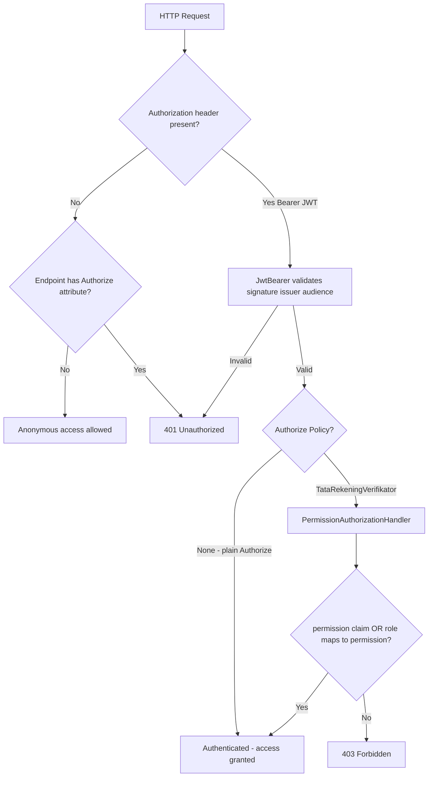

# Authorization Investigation Report — Bilreg.Api

**Date:** 2026-07-01  
**Scope:** `src/bilreg/Bilreg.Api` and related auth infrastructure  
**Mode:** Read-only investigation (no code changes)

---

## 1. Executive Summary

Bilreg.Api is configured for **JWT Bearer authentication (validation only)** but **does not issue tokens** — there is no login/auth controller in this solution. Of **222 active HTTP endpoints** across **44 controllers**, **195 (88%) are effectively public** because ASP.NET Core allows anonymous access when no `[Authorize]` attribute is present and no fallback authorization policy is configured.

Authorization is applied inconsistently in three isolated areas:

| Area | Controllers | Mechanism |
|------|-------------|-----------|
| Tata Rekening (Payment) | `TataRekeningController` | Policy `TataRekeningVerifikator` + permission `TATA-REKENING-WRITE`; one `GET` is explicitly `[AllowAnonymous]` |
| Tarif policy admin | `TarifPolicyController` | `[Authorize]` (any authenticated JWT) |
| Tarif migration admin | `TarifMigrationController` | `[Authorize]` (any authenticated JWT) |

A **custom permission authorization handler** exists (`PermissionAuthorizationHandler`) but is wired to **only one policy** today. A broader **role/permission domain model** exists (static `RolePermissionDto`, DB tables `BILRG_User` / `BILRG_UserRole`) but is **not connected to endpoint authorization** except for Tata Rekening.

**Swagger/Scalar** documents a global Bearer JWT scheme, which overstates protection because most endpoints do not enforce it.

---

## 2. Authentication Architecture

### Mechanism

| Item | Value |
|------|-------|
| **Scheme** | JWT Bearer (`Microsoft.AspNetCore.Authentication.JwtBearer`) |
| **Default scheme** | `JwtBearerDefaults.AuthenticationScheme` (`Bearer`) |
| **Challenge scheme** | Default (same as authenticate scheme — not explicitly overridden) |
| **Sign-in scheme** | Not configured (no cookie/OIDC sign-in) |
| **Type** | **Hybrid-ready, validation-only** — external token issuer assumed |

### Registration

Configured in `Bilreg.Api/Configurations/PresentationService.cs`:

```csharp
services.AddAuthentication(JwtBearerDefaults.AuthenticationScheme).AddJwtBearer(options =>
{
    options.RequireHttpsMetadata = false;
    options.SaveToken = true;
    options.TokenValidationParameters = new TokenValidationParameters
    {
        ValidateIssuer = true,
        ValidateAudience = true,
        ValidAudience = configuration["Jwt:Audience"],
        ValidIssuer = configuration["Jwt:Issuer"],
        IssuerSigningKey = new SymmetricSecurityKey(
            Encoding.UTF8.GetBytes(configuration["Jwt:Key"] ?? string.Empty))
    };
});
```

### JWT settings (`appsettings.json`)

| Setting | Value |
|---------|-------|
| `Jwt:Issuer` | `BilregApiServer` |
| `Jwt:Audience` | `BilregApiClient` |
| `Jwt:Subject` | `BilregApiAccessToken` (not referenced in validation code) |
| `Jwt:Key` | Symmetric signing key (configured in appsettings) |

**Not configured in code:** explicit `ValidateLifetime`, `ClockSkew`, or token expiration defaults beyond framework defaults (`ValidateLifetime` defaults to `true`).

### Middleware pipeline (`Program.cs`)

```
UseSerilogRequestLogging
→ ErrorHandlerMiddleware
→ UseHttpsRedirection
→ UseRouting
→ UseCors("corsapp")
→ UseAuthentication()
→ UseAuthorization()
→ MapControllers()
→ UseSwagger (OpenAPI JSON at /openapi/{documentName}.json)
→ MapScalarApiReference
```

There is **no** `Startup.cs` (minimal hosting model).

### What authentication does *not* include

- ASP.NET Identity
- Cookie authentication
- OAuth / OpenID Connect
- API key middleware
- Windows authentication
- Session state
- Token generation / refresh in this API

### CORS

Policy `corsapp` allows **any origin, method, and header** (`WithOrigins("*")` + `AllowAnyOrigin()`), which is permissive for browser clients.

---

## 3. Authorization Architecture

### Model

ASP.NET Core **policy-based authorization** with:

1. **`[Authorize]`** — requires authenticated user (any valid JWT).
2. **`[Authorize(Policy = ...)]`** — custom policy with `PermissionRequirement`.
3. **`[AllowAnonymous]`** — overrides controller-level policy for a single action.
4. **`ICurrentUserContext`** — reads actor user id from JWT claims in application code (not a filter).

**Not used:** global authorization filters, `FallbackPolicy`, `DefaultPolicy` customization, MediatR pipeline authorization behaviors, custom `AuthorizeAttribute` subclasses, endpoint conventions, or middleware-based authorization.

### Policy registration

```csharp
services.AddAuthorization(options =>
{
    options.AddPolicy(TataRekeningPolicies.Verifikator, policy =>
        policy.RequireAuthenticatedUser()
            .AddRequirements(new PermissionRequirement(TataRekeningPolicies.WritePermission)));
});
services.AddScoped<IAuthorizationHandler, PermissionAuthorizationHandler>();
```

Constant `TataRekeningPolicies.Verifikator` = `"TataRekeningVerifikator"`.  
Required permission: `TATA-REKENING-WRITE`.

### How a request becomes authorized



### Authorization inheritance & precedence

ASP.NET Core default rules apply (no project-specific overrides):

| Source | Present? | Effect |
|--------|----------|--------|
| Global `FallbackPolicy` | **No** | Unmarked endpoints remain anonymous |
| Controller `[Authorize]` | 3 controllers | Inherited by all actions unless overridden |
| Action `[Authorize]` / `[AllowAnonymous]` | Tata Rekening `Open` action | `AllowAnonymous` wins over controller policy |
| Base controller | **No shared base** | Controllers inherit `Controller` / `ControllerBase` only |
| Global filters | **None** | — |
| Middleware | **None** for authz | `ErrorHandlerMiddleware` maps `UnauthorizedAccessException` → 401 in handlers only |
| Endpoint conventions | **None** | — |

**Precedence:** `[AllowAnonymous]` > action `[Authorize]` > controller `[Authorize]` > no attribute (anonymous).

### Application-layer identity

`HttpCurrentUserContext` resolves user id from claims: `NameIdentifier`, `sub`, `Name`, or `Identity.Name`. Used by Tata Rekening write operations via `ICurrentUserContext.GetActorUserId()` — throws `UnauthorizedAccessException` if not authenticated (caught by middleware as 401), but this is **orthogonal** to `[Authorize]` on other controllers.

---

## 4. Login Flow

### Finding: **No login flow exists in Bilreg.Api**

Investigation found:

- **No** `LoginController`, `AuthController`, `AccountController`, or token-issuing endpoint.
- **No** `JwtSecurityToken`, `SecurityTokenDescriptor`, or token factory in the solution.
- **No** refresh-token storage or endpoint.

User management **application commands** exist (`UserCreateCmd`, `UserAssignRoleCmd`, `UserActivedCmd`, `UserDeAvtiveCmd`) with persistence to `BILRG_User` and `BILRG_UserRole`, but **no HTTP API exposes them**.

### Expected external flow (inferred)

1. Client obtains JWT from an **external identity service** (hospital SSO, Jetli API, or future Bilreg auth service) signed with the same `Jwt:Key` / issuer / audience.
2. Client calls Bilreg.Api with `Authorization: Bearer <token>`.
3. Token should include:
   - **Role:** `ClaimTypes.Role` or `"role"` claim (e.g. `VERIF-SPV`, `VERIF-USR` for Tata Rekening writes)
   - **Optional direct permission:** `"permission"` claim matching permission id
   - **Actor id:** `sub` or `NameIdentifier` for audit fields

### Token lifetime & refresh

Not defined in this codebase. Validation uses default lifetime checks if tokens include `exp`.

---

## 5. Existing Permission Model

### Summary

**Hybrid role + permission model** — partially implemented, mostly static.

| Layer | Location | Status |
|-------|----------|--------|
| Permission value object | `Bilreg.Domain/Shared/User/PermissionModel.cs` | Domain model |
| Role | `Bilreg.Domain/Shared/User/RoleModel.cs` | Static catalog (`ListData()`) |
| Role ↔ Permission | `Bilreg.Domain/Shared/User/RolePermissionModel.cs` | Domain aggregate |
| Static permission map | `Bilreg.Infrastructure/Shared/User/RolePermissionDto.cs` | **Authoritative for authorization handler** |
| DB repo | `RolePermissionRepo` | Reads from static DTO, not DB |
| User persistence | `BILRG_User`, `BILRG_UserRole` tables | Used for user/role assignment, not live authz |

### Permissions in `RolePermissionDto` (authorization-relevant)

| RoleId | Permissions |
|--------|-------------|
| `ADM-SPV` | REGJLNWLK-*, REGJLNBOOK-*, BOK-* (create/edit/void/delete) |
| `ADM-USR` | REGJLNWLK-CREATE/EDIT, REGJLNBOOK-CREATE/EDIT, BOK-CREATE/EDIT |
| `VERIF-SPV` | TATA-REKENING-READ, TATA-REKENING-WRITE |
| `VERIF-USR` | TATA-REKENING-READ, TATA-REKENING-WRITE |

### Evaluation (`PermissionAuthorizationHandler`)

1. Succeed if JWT has claim `permission` == required permission id.
2. Else collect `ClaimTypes.Role` and `"role"` claims.
3. Map roles through `RolePermissionDto.ListData()`; succeed if mapped permissions contain required id.
4. Otherwise fail (403 for policy-protected endpoints).

**Note:** `RoleModel.ListData()` uses **different role ids** (`ADM-USER`, `TAREK-SPV`, etc.) than `RolePermissionDto` (`ADM-USR`, `VERIF-SPV`). Only `RolePermissionDto` is used for authorization today.

### Database tables (user domain)

| Table | Purpose |
|-------|---------|
| `BILRG_User` | UserId, Email, UserName, IsActive |
| `BILRG_UserRole` | UserId, Email, UserName, RoleId, RoleName |

No `BILRG_Permission` or `BILRG_RolePermission` tables — permissions are code-defined.

### Authorization style

- **Endpoint level:** Mostly none (anonymous).
- **Tata Rekening:** **Permission-based** policy (via roles or direct claim).
- **Tarif admin:** **Authentication-only** (any valid JWT, no role/permission check).

---

## 6. Authorization Inventory (all endpoints)

**Totals:** 222 endpoints · 44 active controllers · 29 controllers fully commented out (not registered)

| Controller | Method | Route | HTTP Verb | Authorization |
| --- | --- | --- | --- | --- |
| AntrianController | GetAvailabelNumberQueue | /api/Antrian/genNewNumber | POST | Anonymous |
| AntrianController | ListHeader | /api/Antrian/header/{tglYmd}/list | GET | Anonymous |
| AntrianController | ListPasien | /api/Antrian/pasien/{tglYmd} | GET | Anonymous |
| AntrianController | GetLastNumber | /api/Antrian/quota/{dokterId}/{tglPraktek}/{jamMulai} | GET | Anonymous |
| AntrianController | SelesaiPeriksa | /api/Antrian/selesaiPeriksa/{antrianId}/{noUrut:int} | PATCH | Anonymous |
| AntrianController | GetAntrian | /api/Antrian/{id} | GET | Anonymous |
| BedIgdController | ListBed | /api/BedIgd | GET | Anonymous |
| BedIgdController | ListAvailable | /api/BedIgd/available | GET | Anonymous |
| BedIgdController | ListOrphanPakaiBed | /api/BedIgd/pakaiBed/orphan | GET | Anonymous |
| BedIgdController | MarkClean | /api/BedIgd/{id}/markClean | PATCH | Anonymous |
| BhpIgdController | AddBhp | /api/BhpIgd/{visitId} | POST | Anonymous |
| BookingController | Save | /api/Booking | POST | Anonymous |
| BookingController | CreateFromHidok | /api/Booking/createFromHidok | POST | Anonymous |
| BookingController | Delete | /api/Booking/delete | DELETE | Anonymous |
| BookingController | ResolvePasienId | /api/Booking/genPasien | PATCH | Anonymous |
| BookingController | ListAllBooking | /api/Booking/list/{tglYmd} | GET | Anonymous |
| BookingController | ListBooking | /api/Booking/list/{tglYmd}/{dokterId} | GET | Anonymous |
| BookingController | ResolvePasienId | /api/Booking/resolvePasienId | PATCH | Anonymous |
| BookingController | SearchByQr | /api/Booking/search/{tglBerobat}/{keyword} | GET | Anonymous |
| BookingController | SetQrExt | /api/Booking/setQrExt | PATCH | Anonymous |
| BookingController | DeleteFromHidok | /api/Booking/{bookingIdHidok}/hidok | DELETE | Anonymous |
| BookingController | GetData | /api/Booking/{id} | GET | Anonymous |
| CaraMasukDkController | ListData | /api/CaraMasukDk | GET | Anonymous |
| CaraMasukDkController | GetData | /api/CaraMasukDk/{id} | GET | Anonymous |
| DemografiController | ListDataKabupaten | /api/Demografi/kabupaten/list/{propinsiId} | GET | Anonymous |
| DemografiController | GetDataKabupaten | /api/Demografi/kabupaten/{id} | GET | Anonymous |
| DemografiController | ListDataKecamatan | /api/Demografi/kecamatan/list/{kabupatenId} | GET | Anonymous |
| DemografiController | GetDataKecamatan | /api/Demografi/kecamatan/{id} | GET | Anonymous |
| DemografiController | ListDataKelurahan | /api/Demografi/kelurahan/list/{keyword} | GET | Anonymous |
| DemografiController | GetDataKelurahan | /api/Demografi/kelurahan/{id} | GET | Anonymous |
| DemografiController | ListDataKota | /api/Demografi/kota | GET | Anonymous |
| DemografiController | GetDataKota | /api/Demografi/kota/{id} | GET | Anonymous |
| DemografiController | ListDataNegara | /api/Demografi/negara | GET | Anonymous |
| DemografiController | GetDataNegara | /api/Demografi/negara/{id} | GET | Anonymous |
| DemografiController | ListDataPropinsi | /api/Demografi/propinsi | GET | Anonymous |
| DemografiController | GetDataPropinsi | /api/Demografi/propinsi/{id} | GET | Anonymous |
| GrupJaminanController | ListData | /api/GrupJaminan | GET | Anonymous |
| GrupJaminanController | GetData | /api/GrupJaminan/{id} | GET | Anonymous |
| IgdVisitController | Daftar | /api/IgdVisit | POST | Anonymous |
| IgdVisitController | ListAktif | /api/IgdVisit/aktif | GET | Anonymous |
| IgdVisitController | GetTriageMonitoring | /api/IgdVisit/triage-monitoring | GET | Anonymous |
| IgdVisitController | Get | /api/IgdVisit/{id} | GET | Anonymous |
| IgdVisitController | AssignBed | /api/IgdVisit/{id}/assignBed | POST | Anonymous |
| IgdVisitController | CheckOut | /api/IgdVisit/{id}/checkOut | POST | Anonymous |
| IgdVisitController | Discharge | /api/IgdVisit/{id}/discharge | POST | Anonymous |
| IgdVisitController | AssignDokter | /api/IgdVisit/{id}/dokter | PATCH | Anonymous |
| IgdVisitController | ReAssessTriage | /api/IgdVisit/{id}/re-triage | POST | Anonymous |
| IgdVisitController | RedirectRawatJalan | /api/IgdVisit/{id}/redirectRawatJalan | POST | Anonymous |
| IgdVisitController | AssignRegister | /api/IgdVisit/{id}/register | PATCH | Anonymous |
| IgdVisitController | TransferBed | /api/IgdVisit/{id}/transferBed | POST | Anonymous |
| IgdVisitController | AssessTriage | /api/IgdVisit/{id}/triage | POST | Anonymous |
| IgdVisitController | GetTriageHistory | /api/IgdVisit/{id}/triage-history | GET | Anonymous |
| IgdVisitController | Void | /api/IgdVisit/{id}/void | POST | Anonymous |
| JadwalPraktekController | ListbyLayanan | /api/JadwalPraktek/layanan/{layananId} | GET | Anonymous |
| JadwalPraktekController | ListbyLayananDk | /api/JadwalPraktek/layananDk/{layananDkId} | GET | Anonymous |
| JadwalPraktekController | Miigrasi | /api/JadwalPraktek/migrasi | POST | Anonymous |
| JadwalPraktekController | Delete | /api/JadwalPraktek/save/delete | DELETE | Anonymous |
| JadwalPraktekController | SearchJadwal | /api/JadwalPraktek/search/{keyword} | GET | Anonymous |
| JadwalPraktekController | ListByDokter | /api/JadwalPraktek/{dokterId} | GET | Anonymous |
| JadwalPraktekEffectiveController | List | /api/JadwalPraktekEffective/{dokterId}/{tglYmd} | GET | Anonymous |
| JadwalPraktekEffectiveController | Get | /api/JadwalPraktekEffective/{dokterId}/{tglYmd}/{jamMulai} | GET | Anonymous |
| JadwalPraktekHarianController | Cancel | /api/JadwalPraktekHarian/cancel | POST | Anonymous |
| JadwalPraktekHarianController | Save | /api/JadwalPraktekHarian/save | POST | Anonymous |
| JadwalPraktekHarianController | List | /api/JadwalPraktekHarian/{tglPraktek} | GET | Anonymous |
| JaminanController | ListData | /api/Jaminan | GET | Anonymous |
| JaminanController | Search | /api/Jaminan/search/{keyword} | GET | Anonymous |
| JaminanController | GetData | /api/Jaminan/{id} | GET | Anonymous |
| JenisInapController | ListJenisInap | /api/JenisInap/list | GET | Anonymous |
| JenisInapController | GetJenisInap | /api/JenisInap/{id} | GET | Anonymous |
| KarcisController | ListData | /api/Karcis/list/{instalasiDkId} | GET | Anonymous |
| KarcisController | GetData | /api/Karcis/{id} | GET | Anonymous |
| KarcisController | ListByLayanan | /api/Karcis/{layananId}/list | GET | Anonymous |
| KelasController | ListData | /api/Kelas | GET | Anonymous |
| KelasController | ListDataDk | /api/Kelas/dk | GET | Anonymous |
| LabComponentMasterController | ListComponents | /api/LabContext/LabComponentMasterFeature/components | GET | Anonymous |
| LabComponentMasterController | GetComponent | /api/LabContext/LabComponentMasterFeature/components/{componentId} | GET | Anonymous |
| LabOrderController | ActivateDeferred | /api/LabContext/LabOrderFeature/activateDeferred | PATCH | Anonymous |
| LabOrderController | GetByEmrOrderId | /api/LabContext/LabOrderFeature/byEmrOrderId/{emrOrderId} | GET | Anonymous |
| LabOrderController | Cancel | /api/LabContext/LabOrderFeature/cancel | PATCH | Anonymous |
| LabOrderController | Charge | /api/LabContext/LabOrderFeature/charge | PATCH | Anonymous |
| LabOrderController | Collect | /api/LabContext/LabOrderFeature/collect | PATCH | Anonymous |
| LabOrderController | CollectionPreparation | /api/LabContext/LabOrderFeature/collectionPreparation | GET | Anonymous |
| LabOrderController | Defer | /api/LabContext/LabOrderFeature/defer | PATCH | Anonymous |
| LabOrderController | CreateExternal | /api/LabContext/LabOrderFeature/external | POST | Anonymous |
| LabOrderController | CreateFromEmr | /api/LabContext/LabOrderFeature/fromEmr | POST | Anonymous |
| LabOrderController | Release | /api/LabContext/LabOrderFeature/release | PATCH | Anonymous |
| LabOrderController | ReleaseWorklist | /api/LabContext/LabOrderFeature/releaseWorklist | GET | Anonymous |
| LabOrderController | Terminate | /api/LabContext/LabOrderFeature/terminate | PATCH | Anonymous |
| LabOrderController | Worklist | /api/LabContext/LabOrderFeature/worklist | GET | Anonymous |
| LabOrderController | Get | /api/LabContext/LabOrderFeature/{orderId} | GET | Anonymous |
| LabOwareController | Enqueue | /api/LabContext/LabOwareFeature/enqueue | POST | Anonymous |
| LabOwareController | Process | /api/LabContext/LabOwareFeature/process | POST | Anonymous |
| LabOwareController | Retry | /api/LabContext/LabOwareFeature/retry | PATCH | Anonymous |
| LabOwareController | Worklist | /api/LabContext/LabOwareFeature/worklist | GET | Anonymous |
| LabResultController | Amend | /api/LabContext/LabResultFeature/amend | PATCH | Anonymous |
| LabResultController | Record | /api/LabContext/LabResultFeature/record | POST | Anonymous |
| LabResultController | Verify | /api/LabContext/LabResultFeature/verify | PATCH | Anonymous |
| LabResultController | VerificationWorklist | /api/LabContext/LabResultFeature/worklist/verification | GET | Anonymous |
| LabResultController | Get | /api/LabContext/LabResultFeature/{orderId} | GET | Anonymous |
| LabResultController | Pdf | /api/LabContext/LabResultFeature/{orderId}/pdf | GET | Anonymous |
| LabTestDefinitionController | GetByTarif | /api/LabContext/LabTestDefinitionFeature/byTarif/{tarifId} | GET | Anonymous |
| LabTestDefinitionController | ListDefinitions | /api/LabContext/LabTestDefinitionFeature/definitions | GET | Anonymous |
| LabTestDefinitionController | CreateDefinition | /api/LabContext/LabTestDefinitionFeature/definitions | POST | Anonymous |
| LabTestDefinitionController | GetDefinition | /api/LabContext/LabTestDefinitionFeature/definitions/{testDefinitionId} | GET | Anonymous |
| LabTestDefinitionController | UpdateDefinition | /api/LabContext/LabTestDefinitionFeature/definitions/{testDefinitionId} | PUT | Anonymous |
| LabTestDefinitionController | ActivateDefinition | /api/LabContext/LabTestDefinitionFeature/definitions/{testDefinitionId}/activate | POST | Anonymous |
| LabTestDefinitionController | DeactivateDefinition | /api/LabContext/LabTestDefinitionFeature/definitions/{testDefinitionId}/deactivate | POST | Anonymous |
| LayananController | ListData | /api/Layanan | GET | Anonymous |
| LayananController | GetData | /api/Layanan/{id} | GET | Anonymous |
| LayananController | ListDataByInstalasiDkId | /api/Layanan/{instalasiDkId}/list | GET | Anonymous |
| LayananDkController | ListData | /api/LayananDk | GET | Anonymous |
| NilaiTarifController | Import | /api/NilaiTarif/import | POST | Authorize (commented out) |
| NilaiTarifController | ListTarifBrg | /api/NilaiTarif/tarif-brg | GET | Authorize (commented out) |
| OperationController | CancelStart | /api/Operation/CancelStart | POST | Anonymous |
| OperationController | FinishOp | /api/Operation/Finish | POST | Anonymous |
| OperationController | StartOp | /api/Operation/Start | POST | Anonymous |
| OrderOpController | ListOrder | /api/OrderOp | GET | Anonymous |
| OrderOpController | CreateOrderByPasien | /api/OrderOp/CreateByPasien | POST | Anonymous |
| OrderOpController | CreateOrderByReg | /api/OrderOp/CreateByReg | POST | Anonymous |
| OrderOpController | DischargeOp | /api/OrderOp/Discharge | POST | Anonymous |
| PasienController | Create | /api/Pasien | POST | Anonymous |
| PasienController | AddContact | /api/Pasien/addContact | PATCH | Anonymous |
| PasienController | CreateByKtp | /api/Pasien/createByKtp | POST | Anonymous |
| PasienController | SetStatusSosial | /api/Pasien/demografi | PATCH | Anonymous |
| PasienController | SetDataKpt | /api/Pasien/ktp | PATCH | Anonymous |
| PasienController | NonActive | /api/Pasien/nonActive | PATCH | Anonymous |
| PasienController | ReActive | /api/Pasien/reActive | PATCH | Anonymous |
| PasienController | Search | /api/Pasien/search/{keyword} | GET | Anonymous |
| PasienController | GetData | /api/Pasien/{id} | GET | Anonymous |
| PolisController | Save | /api/Polis | POST | Anonymous |
| PolisController | AddCoverage | /api/Polis/addCoverage | PUT | Anonymous |
| PolisController | GetByNoPeserta | /api/Polis/byNoPeserta | GET | Anonymous |
| PolisController | ListData | /api/Polis/list/{pasienId} | GET | Anonymous |
| PolisController | RemoveCoverage | /api/Polis/removeCoverage | PUT | Anonymous |
| PolisController | GetData | /api/Polis/{id} | GET | Anonymous |
| PpaController | ListDokter | /api/Ppa/dokter | GET | Anonymous |
| PpaController | ListDokterByLayanan | /api/Ppa/dokter/{layananId} | GET | Anonymous |
| PpaController | ListDokterAnestesi | /api/Ppa/dokterAnestesi | GET | Anonymous |
| PpaController | ListDokterOk | /api/Ppa/dokterOk | GET | Anonymous |
| PpaController | ListDokterRajal | /api/Ppa/dokterRajal | GET | Anonymous |
| PpaController | ListPpa | /api/Ppa/list | GET | Anonymous |
| PpaController | GetData | /api/Ppa/{id} | GET | Anonymous |
| PraktekDokterController | PraktekDokterDokter | /api/PraktekDokter/dokter | POST | Anonymous |
| PraktekDokterController | PraktekDokterGroupSpesialis | /api/PraktekDokter/groupSpesialis | POST | Anonymous |
| ProsedurMasukInapController | ListProsedurMasukInap | /api/ProsedurMasukInap/list | GET | Anonymous |
| ProsedurMasukInapController | GetProsedurMasukInap | /api/ProsedurMasukInap/{id} | GET | Anonymous |
| RegController | ListAktifByJenisReg | /api/Reg/aktif/{jenisReg}/jenisReg | GET | Anonymous |
| RegController | ListAktifByMr | /api/Reg/aktif/{pasienId} | GET | Anonymous |
| RegController | RegRadar | /api/Reg/darurat | POST | Anonymous |
| RegController | Void | /api/Reg/rajalBatal | PATCH | Anonymous |
| RegController | Save | /api/Reg/rajalByBooking | POST | Anonymous |
| RegController | Save | /api/Reg/rajalWalkIn | POST | Anonymous |
| RegController | RegAktifAdd | /api/Reg/regAktif/add | POST | Anonymous |
| RegController | SetDataEligibility | /api/Reg/setDataEligibility | PATCH | Anonymous |
| RegController | UbahJaminan | /api/Reg/ubahJaminan | PATCH | Anonymous |
| RegController | UbahKunjungan | /api/Reg/ubahKunjungan | PATCH | Anonymous |
| RegController | GetData | /api/Reg/{id} | GET | Anonymous |
| RegController | Deactivate | /api/Reg/{id}/deactivate | PATCH | Anonymous |
| RegController | ListAktif | /api/Reg/{layananId}/layanan | GET | Anonymous |
| RoomRateController | GetRoomRate | /api/RoomRate/{kamarId} | GET | Anonymous |
| RuangController | ListData | /api/Ruang/list | GET | Anonymous |
| RuangController | GetData | /api/Ruang/{ruangId} | GET | Anonymous |
| RujukanController | ListData | /api/Rujukan/list/{tipeRujukanId} | GET | Anonymous |
| RujukanController | GetByPpk | /api/Rujukan/ppk/{ppkId} | GET | Anonymous |
| RujukanController | ListDataByCaraMasuk | /api/Rujukan/{caraMasukDkId}/list | GET | Anonymous |
| RujukanController | GetData | /api/Rujukan/{id} | GET | Anonymous |
| ScheduleOpController | AddPpa | /api/ScheduleOp/AddPpa | PATCH | Anonymous |
| ScheduleOpController | AssignLeader | /api/ScheduleOp/AssignLeader | PATCH | Anonymous |
| ScheduleOpController | CancelSchedule | /api/ScheduleOp/Cancel | PATCH | Anonymous |
| ScheduleOpController | RemovePpa | /api/ScheduleOp/RemovePpa | PATCH | Anonymous |
| ScheduleOpController | SetSchedule | /api/ScheduleOp/SetSchedule | POST | Anonymous |
| ScheduleOpController | GetSchedule | /api/ScheduleOp/{orderOpId} | GET | Anonymous |
| ScheduleOpController | ListSchedule | /api/ScheduleOp/{tgl}/TglOp | GET | Anonymous |
| StatusSosialController | ListDataAgama | /api/StatusSosial/agama | GET | Anonymous |
| StatusSosialController | GetDataAgama | /api/StatusSosial/agama/{id} | GET | Anonymous |
| StatusSosialController | ListDataPekerjaanDk | /api/StatusSosial/pekerjaanDk | GET | Anonymous |
| StatusSosialController | GetDataPekerjaanDk | /api/StatusSosial/pekerjaanDk/{id} | GET | Anonymous |
| StatusSosialController | ListDataPendidikanDk | /api/StatusSosial/pendidikanDk | GET | Anonymous |
| StatusSosialController | GetDataPendidikanDk | /api/StatusSosial/pendidikanDk/{id} | GET | Anonymous |
| StatusSosialController | ListDataStatusKawinDk | /api/StatusSosial/statusKawinDk | GET | Anonymous |
| StatusSosialController | GetDataStatusKawinDk | /api/StatusSosial/statusKawinDk/{id} | GET | Anonymous |
| StatusSosialController | ListDataSuku | /api/StatusSosial/suku | GET | Anonymous |
| StatusSosialController | GetDataSuku | /api/StatusSosial/suku/{id} | GET | Anonymous |
| TarifController | GetNilai | /api/Tarif/nilai/{id}/{tipeTarifId}/{kelasId} | GET | Anonymous |
| TarifController | GetData | /api/Tarif/search/{layananId}/{keyword} | GET | Anonymous |
| TarifMigrationController | CreateBaseline | /api/tarif-migration/baseline | POST | Authorize |
| TarifMigrationController | GetConsistency | /api/tarif-migration/consistency | GET | Authorize |
| TarifMigrationController | SetMode | /api/tarif-migration/mode | PUT | Authorize |
| TarifMigrationController | ClearMode | /api/tarif-migration/mode | DELETE | Authorize |
| TarifMigrationController | GetStatus | /api/tarif-migration/status | GET | Authorize |
| TarifPolicyController | Create | /api/tarif-policy | POST | Authorize |
| TarifPolicyController | List | /api/tarif-policy | GET | Authorize |
| TarifPolicyController | Get | /api/tarif-policy/{id} | GET | Authorize |
| TarifPolicyController | Update | /api/tarif-policy/{id} | PUT | Authorize |
| TarifPolicyController | Copy | /api/tarif-policy/{id}/copy | POST | Authorize |
| TarifPolicyController | MassAdjustment | /api/tarif-policy/{id}/mass-adjustment | POST | Authorize |
| TarifPolicyController | Publish | /api/tarif-policy/{id}/publish | POST | Authorize |
| TarifPolicyController | ListPublishLog | /api/tarif-policy/{id}/publish-log | GET | Authorize |
| TarifPolicyController | Review | /api/tarif-policy/{id}/review | POST | Authorize |
| TarifPolicyController | AddVariant | /api/tarif-policy/{id}/variant | POST | Authorize |
| TarifPolicyController | UpdateVariant | /api/tarif-policy/{id}/variant/{itemNo:int} | PUT | Authorize |
| TarifPolicyController | RemoveVariant | /api/tarif-policy/{id}/variant/{itemNo:int} | DELETE | Authorize |
| TataRekeningController | Merge | /api/tatarekening/merge | POST | Policy(Verifikator) |
| TataRekeningController | Open | /api/tatarekening/{regId} | GET | AllowAnonymous |
| TataRekeningController | Adjust | /api/tatarekening/{regId}/adjust | POST | Policy(Verifikator) |
| TataRekeningController | Allocate | /api/tatarekening/{regId}/allocate | POST | Policy(Verifikator) |
| TataRekeningController | CancelFinalization | /api/tatarekening/{regId}/cancel-finalization | POST | Policy(Verifikator) |
| TataRekeningController | Close | /api/tatarekening/{regId}/close | POST | Policy(Verifikator) |
| TataRekeningController | Finalize | /api/tatarekening/{regId}/finalize | POST | Policy(Verifikator) |
| TataRekeningController | Reopen | /api/tatarekening/{regId}/reopen | POST | Policy(Verifikator) |
| TataRekeningController | SettlementInitiation | /api/tatarekening/{regId}/settlement-initiation | POST | Policy(Verifikator) |
| TataRekeningController | Verify | /api/tatarekening/{regId}/verify | POST | Policy(Verifikator) |
| TindakanController | Batal | /api/Tindakan/batal | PATCH | Anonymous |
| TindakanController | Create | /api/Tindakan/create | POST | Anonymous |
| TindakanController | SaveTindakan | /api/Tindakan/save | POST | Anonymous |
| TindakanController | ListTdkJual | /api/Tindakan/tdkJual/list/{regId} | GET | Anonymous |
| TindakanIgdController | Void | /api/TindakanIgd/delete/{tindakanIgdId} | DELETE | Anonymous |
| TindakanIgdController | ListData | /api/TindakanIgd/list/{visitId} | GET | Anonymous |
| TindakanIgdController | AddTindakan | /api/TindakanIgd/{visitId} | POST | Anonymous |
| TipeJaminanController | Search | /api/TipeJaminan/search/{keyword} | GET | Anonymous |
| TipeJaminanController | Get | /api/TipeJaminan/{id} | GET | Anonymous |
| WardController | ListKamarOk | /api/Ward/KamarOk | GET | Anonymous |
---

## 7. Anonymous Endpoint Inventory

**195 endpoints** are publicly accessible without a valid JWT.

| Endpoint | Controller | Reason |
| --- | --- | --- |
| GET /api/Antrian/header/{tglYmd}/list | AntrianController | No `[Authorize]`, policy, or global fallback |
| GET /api/Antrian/pasien/{tglYmd} | AntrianController | No `[Authorize]`, policy, or global fallback |
| GET /api/Antrian/quota/{dokterId}/{tglPraktek}/{jamMulai} | AntrianController | No `[Authorize]`, policy, or global fallback |
| GET /api/Antrian/{id} | AntrianController | No `[Authorize]`, policy, or global fallback |
| PATCH /api/Antrian/selesaiPeriksa/{antrianId}/{noUrut:int} | AntrianController | No `[Authorize]`, policy, or global fallback |
| POST /api/Antrian/genNewNumber | AntrianController | No `[Authorize]`, policy, or global fallback |
| GET /api/BedIgd | BedIgdController | No `[Authorize]`, policy, or global fallback |
| GET /api/BedIgd/available | BedIgdController | No `[Authorize]`, policy, or global fallback |
| GET /api/BedIgd/pakaiBed/orphan | BedIgdController | No `[Authorize]`, policy, or global fallback |
| PATCH /api/BedIgd/{id}/markClean | BedIgdController | No `[Authorize]`, policy, or global fallback |
| POST /api/BhpIgd/{visitId} | BhpIgdController | No `[Authorize]`, policy, or global fallback |
| DELETE /api/Booking/delete | BookingController | No `[Authorize]`, policy, or global fallback |
| DELETE /api/Booking/{bookingIdHidok}/hidok | BookingController | No `[Authorize]`, policy, or global fallback |
| GET /api/Booking/list/{tglYmd} | BookingController | No `[Authorize]`, policy, or global fallback |
| GET /api/Booking/list/{tglYmd}/{dokterId} | BookingController | No `[Authorize]`, policy, or global fallback |
| GET /api/Booking/search/{tglBerobat}/{keyword} | BookingController | No `[Authorize]`, policy, or global fallback |
| GET /api/Booking/{id} | BookingController | No `[Authorize]`, policy, or global fallback |
| PATCH /api/Booking/genPasien | BookingController | No `[Authorize]`, policy, or global fallback |
| PATCH /api/Booking/resolvePasienId | BookingController | No `[Authorize]`, policy, or global fallback |
| PATCH /api/Booking/setQrExt | BookingController | No `[Authorize]`, policy, or global fallback |
| POST /api/Booking | BookingController | No `[Authorize]`, policy, or global fallback |
| POST /api/Booking/createFromHidok | BookingController | No `[Authorize]`, policy, or global fallback |
| GET /api/CaraMasukDk | CaraMasukDkController | No `[Authorize]`, policy, or global fallback |
| GET /api/CaraMasukDk/{id} | CaraMasukDkController | No `[Authorize]`, policy, or global fallback |
| GET /api/Demografi/kabupaten/list/{propinsiId} | DemografiController | No `[Authorize]`, policy, or global fallback |
| GET /api/Demografi/kabupaten/{id} | DemografiController | No `[Authorize]`, policy, or global fallback |
| GET /api/Demografi/kecamatan/list/{kabupatenId} | DemografiController | No `[Authorize]`, policy, or global fallback |
| GET /api/Demografi/kecamatan/{id} | DemografiController | No `[Authorize]`, policy, or global fallback |
| GET /api/Demografi/kelurahan/list/{keyword} | DemografiController | No `[Authorize]`, policy, or global fallback |
| GET /api/Demografi/kelurahan/{id} | DemografiController | No `[Authorize]`, policy, or global fallback |
| GET /api/Demografi/kota | DemografiController | No `[Authorize]`, policy, or global fallback |
| GET /api/Demografi/kota/{id} | DemografiController | No `[Authorize]`, policy, or global fallback |
| GET /api/Demografi/negara | DemografiController | No `[Authorize]`, policy, or global fallback |
| GET /api/Demografi/negara/{id} | DemografiController | No `[Authorize]`, policy, or global fallback |
| GET /api/Demografi/propinsi | DemografiController | No `[Authorize]`, policy, or global fallback |
| GET /api/Demografi/propinsi/{id} | DemografiController | No `[Authorize]`, policy, or global fallback |
| GET /api/GrupJaminan | GrupJaminanController | No `[Authorize]`, policy, or global fallback |
| GET /api/GrupJaminan/{id} | GrupJaminanController | No `[Authorize]`, policy, or global fallback |
| GET /api/IgdVisit/aktif | IgdVisitController | No `[Authorize]`, policy, or global fallback |
| GET /api/IgdVisit/triage-monitoring | IgdVisitController | No `[Authorize]`, policy, or global fallback |
| GET /api/IgdVisit/{id} | IgdVisitController | No `[Authorize]`, policy, or global fallback |
| GET /api/IgdVisit/{id}/triage-history | IgdVisitController | No `[Authorize]`, policy, or global fallback |
| PATCH /api/IgdVisit/{id}/dokter | IgdVisitController | No `[Authorize]`, policy, or global fallback |
| PATCH /api/IgdVisit/{id}/register | IgdVisitController | No `[Authorize]`, policy, or global fallback |
| POST /api/IgdVisit | IgdVisitController | No `[Authorize]`, policy, or global fallback |
| POST /api/IgdVisit/{id}/assignBed | IgdVisitController | No `[Authorize]`, policy, or global fallback |
| POST /api/IgdVisit/{id}/checkOut | IgdVisitController | No `[Authorize]`, policy, or global fallback |
| POST /api/IgdVisit/{id}/discharge | IgdVisitController | No `[Authorize]`, policy, or global fallback |
| POST /api/IgdVisit/{id}/re-triage | IgdVisitController | No `[Authorize]`, policy, or global fallback |
| POST /api/IgdVisit/{id}/redirectRawatJalan | IgdVisitController | No `[Authorize]`, policy, or global fallback |
| POST /api/IgdVisit/{id}/transferBed | IgdVisitController | No `[Authorize]`, policy, or global fallback |
| POST /api/IgdVisit/{id}/triage | IgdVisitController | No `[Authorize]`, policy, or global fallback |
| POST /api/IgdVisit/{id}/void | IgdVisitController | No `[Authorize]`, policy, or global fallback |
| DELETE /api/JadwalPraktek/save/delete | JadwalPraktekController | No `[Authorize]`, policy, or global fallback |
| GET /api/JadwalPraktek/layanan/{layananId} | JadwalPraktekController | No `[Authorize]`, policy, or global fallback |
| GET /api/JadwalPraktek/layananDk/{layananDkId} | JadwalPraktekController | No `[Authorize]`, policy, or global fallback |
| GET /api/JadwalPraktek/search/{keyword} | JadwalPraktekController | No `[Authorize]`, policy, or global fallback |
| GET /api/JadwalPraktek/{dokterId} | JadwalPraktekController | No `[Authorize]`, policy, or global fallback |
| POST /api/JadwalPraktek/migrasi | JadwalPraktekController | No `[Authorize]`, policy, or global fallback |
| GET /api/JadwalPraktekEffective/{dokterId}/{tglYmd} | JadwalPraktekEffectiveController | No `[Authorize]`, policy, or global fallback |
| GET /api/JadwalPraktekEffective/{dokterId}/{tglYmd}/{jamMulai} | JadwalPraktekEffectiveController | No `[Authorize]`, policy, or global fallback |
| GET /api/JadwalPraktekHarian/{tglPraktek} | JadwalPraktekHarianController | No `[Authorize]`, policy, or global fallback |
| POST /api/JadwalPraktekHarian/cancel | JadwalPraktekHarianController | No `[Authorize]`, policy, or global fallback |
| POST /api/JadwalPraktekHarian/save | JadwalPraktekHarianController | No `[Authorize]`, policy, or global fallback |
| GET /api/Jaminan | JaminanController | No `[Authorize]`, policy, or global fallback |
| GET /api/Jaminan/search/{keyword} | JaminanController | No `[Authorize]`, policy, or global fallback |
| GET /api/Jaminan/{id} | JaminanController | No `[Authorize]`, policy, or global fallback |
| GET /api/JenisInap/list | JenisInapController | No `[Authorize]`, policy, or global fallback |
| GET /api/JenisInap/{id} | JenisInapController | No `[Authorize]`, policy, or global fallback |
| GET /api/Karcis/list/{instalasiDkId} | KarcisController | No `[Authorize]`, policy, or global fallback |
| GET /api/Karcis/{id} | KarcisController | No `[Authorize]`, policy, or global fallback |
| GET /api/Karcis/{layananId}/list | KarcisController | No `[Authorize]`, policy, or global fallback |
| GET /api/Kelas | KelasController | No `[Authorize]`, policy, or global fallback |
| GET /api/Kelas/dk | KelasController | No `[Authorize]`, policy, or global fallback |
| GET /api/LabContext/LabComponentMasterFeature/components | LabComponentMasterController | No `[Authorize]`, policy, or global fallback |
| GET /api/LabContext/LabComponentMasterFeature/components/{componentId} | LabComponentMasterController | No `[Authorize]`, policy, or global fallback |
| GET /api/LabContext/LabOrderFeature/byEmrOrderId/{emrOrderId} | LabOrderController | No `[Authorize]`, policy, or global fallback |
| GET /api/LabContext/LabOrderFeature/collectionPreparation | LabOrderController | No `[Authorize]`, policy, or global fallback |
| GET /api/LabContext/LabOrderFeature/releaseWorklist | LabOrderController | No `[Authorize]`, policy, or global fallback |
| GET /api/LabContext/LabOrderFeature/worklist | LabOrderController | No `[Authorize]`, policy, or global fallback |
| GET /api/LabContext/LabOrderFeature/{orderId} | LabOrderController | No `[Authorize]`, policy, or global fallback |
| PATCH /api/LabContext/LabOrderFeature/activateDeferred | LabOrderController | No `[Authorize]`, policy, or global fallback |
| PATCH /api/LabContext/LabOrderFeature/cancel | LabOrderController | No `[Authorize]`, policy, or global fallback |
| PATCH /api/LabContext/LabOrderFeature/charge | LabOrderController | No `[Authorize]`, policy, or global fallback |
| PATCH /api/LabContext/LabOrderFeature/collect | LabOrderController | No `[Authorize]`, policy, or global fallback |
| PATCH /api/LabContext/LabOrderFeature/defer | LabOrderController | No `[Authorize]`, policy, or global fallback |
| PATCH /api/LabContext/LabOrderFeature/release | LabOrderController | No `[Authorize]`, policy, or global fallback |
| PATCH /api/LabContext/LabOrderFeature/terminate | LabOrderController | No `[Authorize]`, policy, or global fallback |
| POST /api/LabContext/LabOrderFeature/external | LabOrderController | No `[Authorize]`, policy, or global fallback |
| POST /api/LabContext/LabOrderFeature/fromEmr | LabOrderController | No `[Authorize]`, policy, or global fallback |
| GET /api/LabContext/LabOwareFeature/worklist | LabOwareController | No `[Authorize]`, policy, or global fallback |
| PATCH /api/LabContext/LabOwareFeature/retry | LabOwareController | No `[Authorize]`, policy, or global fallback |
| POST /api/LabContext/LabOwareFeature/enqueue | LabOwareController | No `[Authorize]`, policy, or global fallback |
| POST /api/LabContext/LabOwareFeature/process | LabOwareController | No `[Authorize]`, policy, or global fallback |
| GET /api/LabContext/LabResultFeature/worklist/verification | LabResultController | No `[Authorize]`, policy, or global fallback |
| GET /api/LabContext/LabResultFeature/{orderId} | LabResultController | No `[Authorize]`, policy, or global fallback |
| GET /api/LabContext/LabResultFeature/{orderId}/pdf | LabResultController | No `[Authorize]`, policy, or global fallback |
| PATCH /api/LabContext/LabResultFeature/amend | LabResultController | No `[Authorize]`, policy, or global fallback |
| PATCH /api/LabContext/LabResultFeature/verify | LabResultController | No `[Authorize]`, policy, or global fallback |
| POST /api/LabContext/LabResultFeature/record | LabResultController | No `[Authorize]`, policy, or global fallback |
| GET /api/LabContext/LabTestDefinitionFeature/byTarif/{tarifId} | LabTestDefinitionController | No `[Authorize]`, policy, or global fallback |
| GET /api/LabContext/LabTestDefinitionFeature/definitions | LabTestDefinitionController | No `[Authorize]`, policy, or global fallback |
| GET /api/LabContext/LabTestDefinitionFeature/definitions/{testDefinitionId} | LabTestDefinitionController | No `[Authorize]`, policy, or global fallback |
| POST /api/LabContext/LabTestDefinitionFeature/definitions | LabTestDefinitionController | No `[Authorize]`, policy, or global fallback |
| POST /api/LabContext/LabTestDefinitionFeature/definitions/{testDefinitionId}/activate | LabTestDefinitionController | No `[Authorize]`, policy, or global fallback |
| POST /api/LabContext/LabTestDefinitionFeature/definitions/{testDefinitionId}/deactivate | LabTestDefinitionController | No `[Authorize]`, policy, or global fallback |
| PUT /api/LabContext/LabTestDefinitionFeature/definitions/{testDefinitionId} | LabTestDefinitionController | No `[Authorize]`, policy, or global fallback |
| GET /api/Layanan | LayananController | No `[Authorize]`, policy, or global fallback |
| GET /api/Layanan/{id} | LayananController | No `[Authorize]`, policy, or global fallback |
| GET /api/Layanan/{instalasiDkId}/list | LayananController | No `[Authorize]`, policy, or global fallback |
| GET /api/LayananDk | LayananDkController | No `[Authorize]`, policy, or global fallback |
| GET /api/NilaiTarif/tarif-brg | NilaiTarifController | Controller-level `[Authorize]` is commented out |
| POST /api/NilaiTarif/import | NilaiTarifController | Controller-level `[Authorize]` is commented out |
| POST /api/Operation/CancelStart | OperationController | No `[Authorize]`, policy, or global fallback |
| POST /api/Operation/Finish | OperationController | No `[Authorize]`, policy, or global fallback |
| POST /api/Operation/Start | OperationController | No `[Authorize]`, policy, or global fallback |
| GET /api/OrderOp | OrderOpController | No `[Authorize]`, policy, or global fallback |
| POST /api/OrderOp/CreateByPasien | OrderOpController | No `[Authorize]`, policy, or global fallback |
| POST /api/OrderOp/CreateByReg | OrderOpController | No `[Authorize]`, policy, or global fallback |
| POST /api/OrderOp/Discharge | OrderOpController | No `[Authorize]`, policy, or global fallback |
| GET /api/Pasien/search/{keyword} | PasienController | No `[Authorize]`, policy, or global fallback |
| GET /api/Pasien/{id} | PasienController | No `[Authorize]`, policy, or global fallback |
| PATCH /api/Pasien/addContact | PasienController | No `[Authorize]`, policy, or global fallback |
| PATCH /api/Pasien/demografi | PasienController | No `[Authorize]`, policy, or global fallback |
| PATCH /api/Pasien/ktp | PasienController | No `[Authorize]`, policy, or global fallback |
| PATCH /api/Pasien/nonActive | PasienController | No `[Authorize]`, policy, or global fallback |
| PATCH /api/Pasien/reActive | PasienController | No `[Authorize]`, policy, or global fallback |
| POST /api/Pasien | PasienController | No `[Authorize]`, policy, or global fallback |
| POST /api/Pasien/createByKtp | PasienController | No `[Authorize]`, policy, or global fallback |
| GET /api/Polis/byNoPeserta | PolisController | No `[Authorize]`, policy, or global fallback |
| GET /api/Polis/list/{pasienId} | PolisController | No `[Authorize]`, policy, or global fallback |
| GET /api/Polis/{id} | PolisController | No `[Authorize]`, policy, or global fallback |
| POST /api/Polis | PolisController | No `[Authorize]`, policy, or global fallback |
| PUT /api/Polis/addCoverage | PolisController | No `[Authorize]`, policy, or global fallback |
| PUT /api/Polis/removeCoverage | PolisController | No `[Authorize]`, policy, or global fallback |
| GET /api/Ppa/dokter | PpaController | No `[Authorize]`, policy, or global fallback |
| GET /api/Ppa/dokter/{layananId} | PpaController | No `[Authorize]`, policy, or global fallback |
| GET /api/Ppa/dokterAnestesi | PpaController | No `[Authorize]`, policy, or global fallback |
| GET /api/Ppa/dokterOk | PpaController | No `[Authorize]`, policy, or global fallback |
| GET /api/Ppa/dokterRajal | PpaController | No `[Authorize]`, policy, or global fallback |
| GET /api/Ppa/list | PpaController | No `[Authorize]`, policy, or global fallback |
| GET /api/Ppa/{id} | PpaController | No `[Authorize]`, policy, or global fallback |
| POST /api/PraktekDokter/dokter | PraktekDokterController | No `[Authorize]`, policy, or global fallback |
| POST /api/PraktekDokter/groupSpesialis | PraktekDokterController | No `[Authorize]`, policy, or global fallback |
| GET /api/ProsedurMasukInap/list | ProsedurMasukInapController | No `[Authorize]`, policy, or global fallback |
| GET /api/ProsedurMasukInap/{id} | ProsedurMasukInapController | No `[Authorize]`, policy, or global fallback |
| GET /api/Reg/aktif/{jenisReg}/jenisReg | RegController | No `[Authorize]`, policy, or global fallback |
| GET /api/Reg/aktif/{pasienId} | RegController | No `[Authorize]`, policy, or global fallback |
| GET /api/Reg/{id} | RegController | No `[Authorize]`, policy, or global fallback |
| GET /api/Reg/{layananId}/layanan | RegController | No `[Authorize]`, policy, or global fallback |
| PATCH /api/Reg/rajalBatal | RegController | No `[Authorize]`, policy, or global fallback |
| PATCH /api/Reg/setDataEligibility | RegController | No `[Authorize]`, policy, or global fallback |
| PATCH /api/Reg/ubahJaminan | RegController | No `[Authorize]`, policy, or global fallback |
| PATCH /api/Reg/ubahKunjungan | RegController | No `[Authorize]`, policy, or global fallback |
| PATCH /api/Reg/{id}/deactivate | RegController | No `[Authorize]`, policy, or global fallback |
| POST /api/Reg/darurat | RegController | No `[Authorize]`, policy, or global fallback |
| POST /api/Reg/rajalByBooking | RegController | No `[Authorize]`, policy, or global fallback |
| POST /api/Reg/rajalWalkIn | RegController | No `[Authorize]`, policy, or global fallback |
| POST /api/Reg/regAktif/add | RegController | No `[Authorize]`, policy, or global fallback |
| GET /api/RoomRate/{kamarId} | RoomRateController | No `[Authorize]`, policy, or global fallback |
| GET /api/Ruang/list | RuangController | No `[Authorize]`, policy, or global fallback |
| GET /api/Ruang/{ruangId} | RuangController | No `[Authorize]`, policy, or global fallback |
| GET /api/Rujukan/list/{tipeRujukanId} | RujukanController | No `[Authorize]`, policy, or global fallback |
| GET /api/Rujukan/ppk/{ppkId} | RujukanController | No `[Authorize]`, policy, or global fallback |
| GET /api/Rujukan/{caraMasukDkId}/list | RujukanController | No `[Authorize]`, policy, or global fallback |
| GET /api/Rujukan/{id} | RujukanController | No `[Authorize]`, policy, or global fallback |
| GET /api/ScheduleOp/{orderOpId} | ScheduleOpController | No `[Authorize]`, policy, or global fallback |
| GET /api/ScheduleOp/{tgl}/TglOp | ScheduleOpController | No `[Authorize]`, policy, or global fallback |
| PATCH /api/ScheduleOp/AddPpa | ScheduleOpController | No `[Authorize]`, policy, or global fallback |
| PATCH /api/ScheduleOp/AssignLeader | ScheduleOpController | No `[Authorize]`, policy, or global fallback |
| PATCH /api/ScheduleOp/Cancel | ScheduleOpController | No `[Authorize]`, policy, or global fallback |
| PATCH /api/ScheduleOp/RemovePpa | ScheduleOpController | No `[Authorize]`, policy, or global fallback |
| POST /api/ScheduleOp/SetSchedule | ScheduleOpController | No `[Authorize]`, policy, or global fallback |
| GET /api/StatusSosial/agama | StatusSosialController | No `[Authorize]`, policy, or global fallback |
| GET /api/StatusSosial/agama/{id} | StatusSosialController | No `[Authorize]`, policy, or global fallback |
| GET /api/StatusSosial/pekerjaanDk | StatusSosialController | No `[Authorize]`, policy, or global fallback |
| GET /api/StatusSosial/pekerjaanDk/{id} | StatusSosialController | No `[Authorize]`, policy, or global fallback |
| GET /api/StatusSosial/pendidikanDk | StatusSosialController | No `[Authorize]`, policy, or global fallback |
| GET /api/StatusSosial/pendidikanDk/{id} | StatusSosialController | No `[Authorize]`, policy, or global fallback |
| GET /api/StatusSosial/statusKawinDk | StatusSosialController | No `[Authorize]`, policy, or global fallback |
| GET /api/StatusSosial/statusKawinDk/{id} | StatusSosialController | No `[Authorize]`, policy, or global fallback |
| GET /api/StatusSosial/suku | StatusSosialController | No `[Authorize]`, policy, or global fallback |
| GET /api/StatusSosial/suku/{id} | StatusSosialController | No `[Authorize]`, policy, or global fallback |
| GET /api/Tarif/nilai/{id}/{tipeTarifId}/{kelasId} | TarifController | No `[Authorize]`, policy, or global fallback |
| GET /api/Tarif/search/{layananId}/{keyword} | TarifController | No `[Authorize]`, policy, or global fallback |
| GET /api/Tindakan/tdkJual/list/{regId} | TindakanController | No `[Authorize]`, policy, or global fallback |
| PATCH /api/Tindakan/batal | TindakanController | No `[Authorize]`, policy, or global fallback |
| POST /api/Tindakan/create | TindakanController | No `[Authorize]`, policy, or global fallback |
| POST /api/Tindakan/save | TindakanController | No `[Authorize]`, policy, or global fallback |
| DELETE /api/TindakanIgd/delete/{tindakanIgdId} | TindakanIgdController | No `[Authorize]`, policy, or global fallback |
| GET /api/TindakanIgd/list/{visitId} | TindakanIgdController | No `[Authorize]`, policy, or global fallback |
| POST /api/TindakanIgd/{visitId} | TindakanIgdController | No `[Authorize]`, policy, or global fallback |
| GET /api/TipeJaminan/search/{keyword} | TipeJaminanController | No `[Authorize]`, policy, or global fallback |
| GET /api/TipeJaminan/{id} | TipeJaminanController | No `[Authorize]`, policy, or global fallback |
| GET /api/Ward/KamarOk | WardController | No `[Authorize]`, policy, or global fallback |
---

## 8. Custom Authorization Components

| Component | File | Role |
|-----------|------|------|
| `PermissionRequirement` | `Bilreg.Api/Authorization/PermissionRequirement.cs` | `IAuthorizationRequirement` holding permission id |
| `PermissionAuthorizationHandler` | `Bilreg.Api/Authorization/PermissionAuthorizationHandler.cs` | Maps JWT roles/permissions to requirements |
| `TataRekeningPolicies` | `Bilreg.Api/Authorization/TataRekeningPolicies.cs` | Policy and permission constants |
| `HttpCurrentUserContext` | `Bilreg.Api/Authorization/HttpCurrentUserContext.cs` | `ICurrentUserContext` from `HttpContext.User` |
| `RolePermissionDto` | `Bilreg.Infrastructure/Shared/User/RolePermissionDto.cs` | Static role→permission matrix |
| `RolePermissionRepo` | `Bilreg.Infrastructure/Shared/User/RolePermissionRepo.cs` | Domain repo (static data) |
| `TestAuthHandler` | `Bilreg.Test/.../TestAuthHandler.cs` | Test-only auth scheme (not production) |

**Not found:** custom `AuthorizeAttribute`, `IAuthorizationPolicyProvider`, authorization middleware, action filters for authz, MediatR `IPipelineBehavior` for authz.

---

## 9. Swagger Authentication

Configured in `PresentationService.cs` via Swashbuckle:

| Feature | Status |
|---------|--------|
| `AddSecurityDefinition("Bearer", ...)` | **Yes** — HTTP bearer, JWT format |
| `AddSecurityRequirement` (global) | **Yes** — applies Bearer to all operations in OpenAPI doc |
| Scalar API reference | **Yes** — `MapScalarApiReference` in `Program.cs` |
| Per-operation anonymous override | **No** — OpenAPI does not mark anonymous endpoints differently |

**Implication:** Swagger UI/Scalar shows a lock icon and Bearer input for **all** endpoints, but **most do not enforce it** at runtime. Tata Rekening `GET` open workspace is anonymous despite global security requirement in the spec.

---

## 10. Risks

| Risk | Severity | Description |
|------|----------|-------------|
| Open clinical/financial APIs | **Critical** | Registration, patient CRUD, IGD, lab orders/results, booking, charges — all anonymous |
| Swagger misleading security | **Medium** | Global Bearer requirement suggests protection that does not exist |
| JWT key in appsettings | **High** | Symmetric key in config file; no rotation mechanism visible |
| `RequireHttpsMetadata = false` | **Medium** | JWT middleware does not require HTTPS metadata |
| Permissive CORS | **Medium** | Any origin can call API from browsers |
| No login/token service in-repo | **Medium** | Unclear token provisioning; risk of ad-hoc shared tokens |
| Role id mismatch | **Medium** | `RoleModel` vs `RolePermissionDto` use different id conventions |
| Commented `[Authorize]` on `NilaiTarifController` | **High** | Tariff import intentionally left open during migration |
| `ICurrentUserContext` without `[Authorize]` | **Medium** | Handlers may throw 401 at runtime but endpoints are reachable |
| Global fallback policy absent | **High** | Easy to add new controllers without realizing they are public |

---

## 11. Recommendations

### Smallest change for consistency (not a full redesign)

1. **Add a global fallback policy** requiring authentication by default:
   ```csharp
   options.FallbackPolicy = new AuthorizationPolicyBuilder()
       .RequireAuthenticatedUser()
       .Build();
   ```
   Then explicitly `[AllowAnonymous]` only where needed.

2. **Keep anonymous (explicit allow-list):**
   - Health/diagnostic endpoints (if added)
   - Tata Rekening `GET /api/tatarekening/{regId}` (documented convention)
   - Consider: readonly reference data used by kiosk/public booking (product decision)

3. **Require authorization (priority order):**
   - All **mutating** endpoints (POST/PUT/PATCH/DELETE) — especially Reg, Pasien, IGD, Lab, Booking, Payment
   - All **Tarif** endpoints including `NilaiTarifController` (uncomment `[Authorize]`)
   - Read endpoints with PHI (patient search, registration detail)

4. **Controller-level `[Authorize]`** is preferable for new work — reduces per-action omission risk.

5. **Retain action-level exceptions** only for deliberate public reads (`[AllowAnonymous]`).

6. **Extend policies over bare `[Authorize]`** for admin domains:
   - Tarif: policy requiring Keuangan/Supervisor permissions (already planned in `docs/contexts/tarif/`)
   - Admisi: map `ADM-USR` / `ADM-SPV` permissions already in `RolePermissionDto`

7. **Do not rely on Roles alone** where fine-grained permissions exist — use `PermissionRequirement` pattern from Tata Rekening.

8. **Fix OpenAPI** to use operation-level security requirements instead of global Bearer on anonymous routes.

9. **Implement or document token issuer** — either add `/api/auth/login` to this API or formally document the external Jetli/SSO service contract.

### Risks of enabling authorization globally

- Breaking all existing clients that call APIs without JWT (frontends, EMR integrations, HiDok, lab bridges)
- Batch jobs and internal services using direct HTTP without tokens
- Need coordinated JWT distribution before enforcement
- Role claim format must align with `RolePermissionDto` ids (`VERIF-SPV`, not `TAREK-SPV`)

---

## 12. Suggested Migration Strategy

### Phase 0 — Prerequisites (no enforcement)
- Document external token issuer and required claims
- Audit all API consumers (EMR, HiDok, Jetli, internal UIs)
- Add integration tests with JWT for critical flows

### Phase 1 — Safe enforcement (low blast radius)
- Enable `[Authorize]` on `NilaiTarifController` (already prepared, commented)
- Verify `TarifPolicyController` / `TarifMigrationController` clients send JWT
- Align Swagger security with actual per-route requirements

### Phase 2 — Opt-in global fallback in staging
- Set `FallbackPolicy` in non-production
- Add `[AllowAnonymous]` to endpoints that must remain public
- Fix client applications

### Phase 3 — Production global fallback
- Deploy `FallbackPolicy` to production
- Monitor 401/403 rates

### Phase 4 — Fine-grained policies
- Introduce policies per bounded context (Admisi, Lab, IGD) using existing `RolePermissionDto` ids
- Replace authentication-only tarif gates with permission policies when roles are stable

### Phase 5 — Login service (if not external)
- Add token issuance endpoint with refresh tokens, wired to `BILRG_User` / `BILRG_UserRole`
- Embed role and permission claims at issuance time

---

## Appendix A — Controllers with authorization attributes

| Controller | Class-level | Notes |
|------------|-------------|-------|
| `TataRekeningController` | `Policy(TataRekeningVerifikator)` | `Open` action: `[AllowAnonymous]` |
| `TarifPolicyController` | `[Authorize]` | 12 endpoints |
| `TarifMigrationController` | `[Authorize]` | 5 endpoints |
| `NilaiTarifController` | `//[Authorize]` (commented) | 2 endpoints effectively public |

## Appendix B — Commented-out controllers (inactive)

These files exist but the entire controller class is commented out — **no endpoints registered:**  
`AmbulanceController`, `BangsalController`, `BedController`, `GrupKomponenController`, `GrupRekapCetakController`, `GrupTarifController`, `GrupTarifDkController`, `InstalasiController`, `InstalasiDkController`, `JenisTarifController`, `KamarController`, `KelasDkController`, `KelasRujukanController`, `KomponenTarifController`, `RekapCetakController`, `RekapCetakDkController`, `RekapKomponenController`, `RegOutController`, `SmfController`, `SatTugasController` (×2), `TindakanController` (BillContext), `TipeKamarController`, `TipeLayananDkController`, `TipeRekController`, `TipeRujukanController`, `TipeTarifController`, `TrsBillingControllerController`, `TujuanTransportController`, and others per source scan.

---

*Generated by static analysis of `Bilreg.Api` controllers and configuration. Endpoint inventory reflects active (non-commented) controller actions as of investigation date.*
