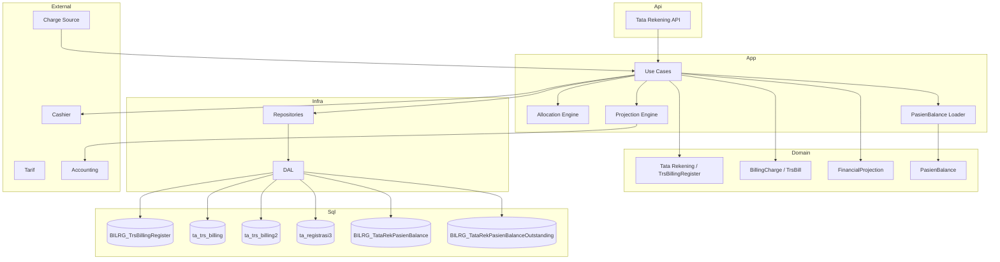

# 03-design.md — Tata Rekening

## FEATURE NAME

Tata Rekening

---

# UBIQUITOUS LANGUAGE (DESIGN)

| Term | Layer | Notes |
|---|---|---|
| Tata Rekening | Bounded context + aggregate | Business name; maps to `TataRekeningModel` / `TrsBillingRegister` in code |
| Verifikator | Actor | HIS user role executing workflow; authorization target for sensitive operations |
| TrsBill | Entity | Maps to `TrsBillType` / `BillingCharge`; persistence `ta_trs_billing` |
| FinancialProjection | Projection | Maps to `ta_trs_billing2` rows |

Use **finalization** vocabulary in business descriptions. **Discharge** appears only when referring to inpatient operational discharge events or legacy code identifiers.

---

# DESIGN OVERVIEW

Implementation follows:

```text
Clean Architecture
+
Pragmatic Tactical DDD
+
Legacy Compatibility First
```

Tata Rekening design prioritizes:

- aggregate clarity,
- operational stability,
- accounting compatibility,
- transactional consistency,
- low-risk migration.

Core principle:

```text
registration-scoped orchestration
+
legacy financial persistence
```

Business authority is **Tata Rekening**. Implementation uses legacy table names and orchestration types only in this design document.

---

# ARCHITECTURE



---

# AGGREGATE IMPLEMENTATION

## Business vs implementation naming

| Business concept | Implementation aggregate / type | Persistence |
|---|---|---|
| Tata Rekening (aggregate) | `TataRekeningModel` / `TrsBillingRegister` | `BILRG_TrsBillingRegister` |
| TrsBill (entity) | `TrsBillType` / `BillingCharge` | `ta_trs_billing` |
| FinancialProjection | projection rows / component events | `ta_trs_billing2` |
| PasienBalance (neighbor) | `PasienBalanceModel` | `BILRG_TataRekPasienBalance` + outstanding child table |

`BillingComponent` is renamed to **`FinancialProjection`** in design vocabulary because `ta_trs_billing2` represents financial decomposition, allocation projection, ownership transfer, and accounting projection — not merely a "component" row.

---

## Orchestration aggregate root

```text
TataRekeningModel / TrsBillingRegister (implementation)
```

Business aggregate name: **Tata Rekening**.

Persistence:

```text
BILRG_TrsBillingRegister
```

Purpose:

- lifecycle orchestration,
- finalize/reopen control,
- settlement boundary,
- concurrency boundary.

Does NOT hold financial totals — financial authority remains in `ta_trs_billing`.

---

## Child entity: BillingCharge (TrsBill)

Persistence:

```text
ta_trs_billing
```

Purpose:

- authoritative financial charge,
- pricing snapshot,
- source transaction snapshot.

---

## Child projection: FinancialProjection

Persistence:

```text
ta_trs_billing2
```

Purpose:

- financial decomposition,
- payer allocation projection,
- receivable ownership transfer projection,
- accounting projection source.

NOT:

- event sourcing stream,
- immutable history,
- accounting journal.

Regeneration strategy: **DELETE → REGENERATE**.

---

# PERSISTENCE DESIGN

## `BILRG_TrsBillingRegister`

Stores:

- RegId,
- BillState,
- CloseDate,
- FinalizationDate,
- PaidDate,
- orchestration metadata.

Does NOT store:

- financial totals,
- pricing amount,
- accounting amount.

---

## `ta_trs_billing`

Remains:

- authoritative billing persistence,
- legacy-compatible financial row,
- pricing snapshot authority.

---

## `ta_trs_billing2`

Remains:

- financial distribution projection (`FinancialProjection`),
- accounting-ready decomposition,
- payer allocation projection.

Rows may be:

- deleted,
- regenerated,
- recalculated.

---

## PasienBalance persistence

| Table | Role |
|---|---|
| `BILRG_TataRekPasienBalance` | Aggregate root (`PasienId`, `Version`, audit) |
| `BILRG_TataRekPasienBalanceOutstanding` | Current outstanding entries (one per unsettled `RegId`) |

Scripts: `Bilreg.SqlDb/PaymentContext/PasienBalanceFeature/`

Partition totals are computed, not persisted.

---

# LIFECYCLE IMPLEMENTATION

```text
OPEN
    ↓
CLOSE BILL
    ↓
FINALIZED
    ↓
LUNAS (PAID)
```

---

## OPEN

Allowed:

- add charge,
- remove charge,
- allocation recalculation,
- projection regeneration,
- carry-over from PasienBalance.

---

## CLOSE BILL

Triggered by operational events such as:

- inpatient operational discharge,
- operational closing,
- outpatient completion.

Effects:

- operational billing generation disabled,
- recalculation still allowed.

Close Bill does not finalize financial responsibility.

---

## FINALIZED

Triggered when Verifikator workflow completes:

- financial verification,
- financial responsibility allocation,
- auto-finalize workflow,
- cashier-ready validation.

Effects:

- finalization allocation locked,
- accounting projection stable,
- reopen / cancel finalization restricted.

---

## LUNAS (PAID)

Triggered by:

- Cashier payment settlement.

Effects:

- financial freeze,
- no operational modification,
- no allocation regeneration.

---

# PASIENBALANCE INTEGRATION

PasienBalance is implemented as a neighboring feature under `PaymentContext/PasienBalanceFeature`. The Tata Rekening bounded context consumes it during registration open and carry-over — it does not own the aggregate.

## Carry-over workflow

```text
Open Registration
    ↓
IPasienBalanceLoader.LoadEntity(pasienId)
    ↓
List OutstandingEntries (presented to Verifikator)
    ↓
Verifikator selects carry-over
    ↓
Finalize carry-over use case records financial responsibility on Tata Rekening aggregate
    ↓
PasienBalance UpdateOutstanding / RemoveOutstanding
```

Carry-over selection is Verifikator input. The use case updates the Tata Rekening aggregate and PasienBalance atomically. PasienBalance remains agnostic about **why** an entry changes.

## Bootstrap and loading

Legacy authoritative data remains in `t_bp_piutang_hdr` during migration.

| Component | Responsibility |
|---|---|
| `IPasienBalanceLegacyReader` | Read unsettled legacy receivables (`fn_sisa > 0`, void filter, jaminan filter) |
| `PasienBalanceBootstrapService` | Import legacy rows into empty aggregate |
| `IPasienBalanceLoader` / `PasienBalanceLoader` | Transparent bootstrap: load or bootstrap-then-save |

Loader flow:

```text
repo.LoadEntity(key)
  → Some: return aggregate
  → None: bootstrap from legacy → repo.SaveChanges → return aggregate
```

Bootstrap is transparent to Tata Rekening callers.

## Repository

`IPasienBalanceRepo`:

| Operation | Method |
|---|---|
| Find by patient | `LoadEntity(IPasienKey)` |
| Save | `SaveChanges(PasienBalanceModel)` |

Repository is persistence only — no bootstrap logic (bootstrap lives in loader service).

## Optimistic concurrency

Header updates use version check:

```sql
UPDATE ... WHERE PasienId = @PasienId AND Version = @ExpectedVersion
```

Stale writes throw `InvalidOperationException`.

On `SaveChanges`:

1. Insert or update header.
2. Delete all outstanding rows for `PasienId`.
3. Bulk insert current entry collection.

## Code layout (PasienBalance slice)

```text
Bilreg.Domain/PaymentContext/PasienBalanceFeature/
Bilreg.Application/PaymentContext/PasienBalanceFeature/
Bilreg.Infrastructure/PaymentContext/PasienBalanceFeature/
Bilreg.Test/PaymentContext/PasienBalanceFeature/
```

PasienBalance HTTP API and Tata Rekening carry-over orchestration use cases are future slices — domain and persistence foundation exist.

---

# TRANSACTION STRATEGY

Tata Rekening uses:

# synchronous transactional persistence

No distributed saga. No CQRS. No event sourcing.

---

## Transaction boundary

Transaction scope exists at:

```text
registration aggregate scope
```

NOT billing-row scope.

Carry-over that touches both Tata Rekening and PasienBalance should complete within a single application transaction where both aggregates are updated atomically.

---

## Required atomic operations

| Use Case | Transaction Scope |
|---|---|
| Create Charge | orchestration + billing + projection |
| Recalculate Allocation | delete old projection + regenerate |
| Close Bill | lifecycle update + projection sync |
| Finalize Financial Responsibility | finalization state + projection validation |
| Cancel Finalization | revert finalization allocation + regenerate projection |
| Carry Over | Tata Rekening charge + PasienBalance update |
| Payment Settlement | settlement + freeze validation |

---

# ALLOCATION IMPLEMENTATION

Allocation authority source:

```text
ta_registrasi3
```

Allocation strategy:

```text
proportional decomposition
```

across:

- billing charge,
- tarif component,
- payer allocation.

---

## Allocation process

```text
Load payer allocation
    ↓
Load transaction / finalization components
    ↓
Calculate proportional value
    ↓
Generate FinancialProjection rows (ta_trs_billing2)
```

---

# PROJECTION REGENERATION STRATEGY

```text
DELETE
→ REGENERATE
```

Triggered when:

- payer allocation changes,
- billing recalculation occurs,
- reopen occurs,
- cancel finalization occurs,
- finalize rollback occurs.

---

# CONCURRENCY STRATEGY

Concurrency controlled at:

```text
TrsBillingRegister (orchestration)
```

and

```text
PasienBalance header Version
```

NOT:

- individual billing row,
- individual projection row.

---

## Concurrency goals

Prevent:

- double finalize,
- reopen-after-payment,
- duplicate projection regeneration,
- concurrent settlement,
- stale PasienBalance overwrite.

---

## Recommended strategy

| Area | Strategy |
|---|---|
| Finalize | orchestration state validation |
| Reopen | paid-state validation |
| Settlement | paid-state CAS |
| Projection regeneration | transaction lock |
| PasienBalance save | optimistic concurrency on `Version` |

---

# SOURCE TRANSACTION STRATEGY

Charge Source:

- creates charge request,
- Tata Rekening synchronously persists financial charge.

Integration pattern:

```text
Charge Source
→ Charge Request
→ Tata Rekening
```

---

## Idempotency

Idempotency key:

```text
OrderNumber
```

Purpose:

- retry-safe integration,
- duplicate prevention.

---

# ACCOUNTING PROJECTION DESIGN

The bounded context provides:

# accounting-ready projection source

Accounting journal generation remains:

- asynchronous,
- externalized (Accounting bounded context),
- legacy-compatible.

Posting status remains compatible with existing accounting workflow and `ta_trs_billing2` posting mechanism.

Do NOT redesign accounting workflow.

---

# QUERY STRATEGY

| Query | Purpose |
|---|---|
| Get Register / Tata Rekening | aggregate detail |
| List Open Bill | operational monitoring |
| List Finalized Bill | cashier queue |
| List Unposted Projection | accounting projection |
| Allocation Projection | financial decomposition |
| PasienBalance by patient | carry-over candidate list |

---

# SECURITY DESIGN

Sensitive operations (Verifikator role):

- finalize financial responsibility,
- cancel finalization,
- reopen,
- settlement,
- allocation recalculation,
- carry-over.

Authorization remains compatible with:

- existing HIS authorization,
- cashier workflow,
- Verifikator / Tata Rekening role mapping.

---

# PERFORMANCE DESIGN

Optimized for:

- large transaction volume,
- legacy SQL workload,
- accounting batch projection.

---

## Recommended index

| Table | Index |
|---|---|
| `BILRG_TrsBillingRegister` | RegId, BillState |
| `ta_trs_billing` | RegId, TrsId |
| `ta_trs_billing2` | posting flag |
| `ta_trs_billing2` | payer type |
| `BILRG_TataRekPasienBalanceOutstanding` | PasienId, RegId |

---

# ERROR HANDLING STRATEGY

## Domain validation

Prevent:

- invalid lifecycle transition,
- settlement before finalize,
- reopen after payment,
- duplicate charge,
- duplicate PasienBalance `RegId` entry.

## Application validation

Rollback on:

- projection regeneration failure,
- settlement failure,
- finalize validation failure,
- PasienBalance concurrency conflict.

---

# AI IMPLEMENTATION NOTE

When implementing:

1. Business aggregate name is **Tata Rekening** — registration scope.

2. `TrsBillingRegister` / `TataRekeningModel` is implementation orchestration — NOT financial authority.

3. `ta_trs_billing` remains financial authority (TrsBill).

4. `ta_trs_billing2` is **FinancialProjection** — derived, NOT immutable history.

5. Projection recalculation MUST use `DELETE → REGENERATE`.

6. Pricing snapshot and accounting snapshot are immutable.

7. PasienBalance is a separate aggregate — load via `IPasienBalanceLoader`, update via `IPasienBalanceRepo`.

8. Carry-over: Verifikator selects entries; use case updates Tata Rekening aggregate and PasienBalance.

9. Prefer compatibility and operational stability over architectural purity.

10. Do NOT redesign accounting, Billing2 semantics, or introduce event sourcing / CQRS / distributed transactions.

11. Legacy code may still use `Discharge` / `CancelDischarge` identifiers — map to finalization vocabulary in new code and SOP.

---

# TESTING STRATEGY

| Area | Validation |
|---|---|
| Lifecycle | OPEN → CLOSE → FINALIZED → LUNAS |
| Allocation | proportional decomposition |
| Projection | delete-regenerate consistency |
| Finalization | 100% financial responsibility allocation invariant |
| Cancel finalization | no-payment guard |
| Settlement | freeze validation |
| Snapshot | historical consistency |
| Idempotency | duplicate prevention |
| PasienBalance | bootstrap, loader, concurrency |
| Carry over | Verifikator selection + Tata Rekening aggregate + PasienBalance atomic update |

---

# DEPLOYMENT STRATEGY

# incremental compatibility-first rollout

Principles:

- preserve existing billing tables,
- preserve accounting integration,
- preserve cashier workflow,
- additive migration only.

---

# FUTURE EXTENSION POINT

| Area | Extension |
|---|---|
| Posting | orchestration-level posting state |
| Projection | async projection queue |
| Monitoring | reconciliation dashboard |
| Allocation | configurable decomposition |
| Integration | centralized charge gateway |
| Carry over | Verifikator workflow + use case API |

WITHOUT:

- replacing accounting module,
- replacing cashier workflow,
- requiring big-bang migration,
- redesigning `ta_trs_billing2` as event store.
