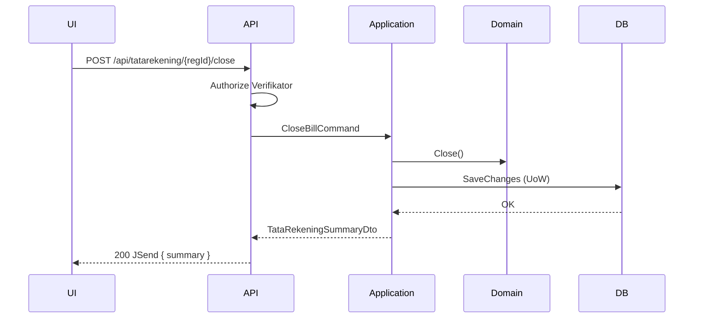
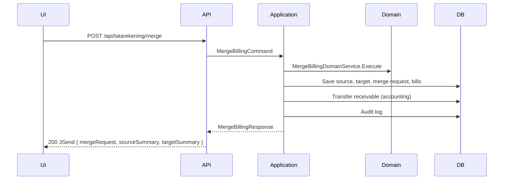
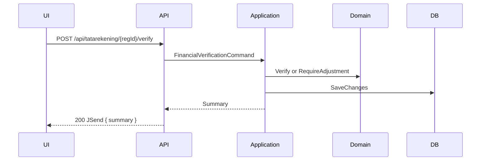
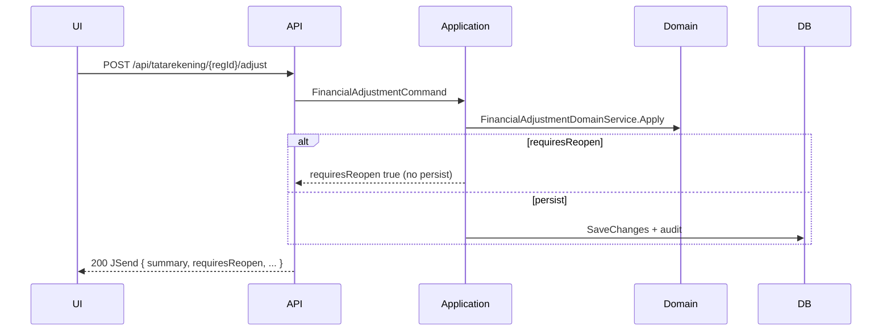
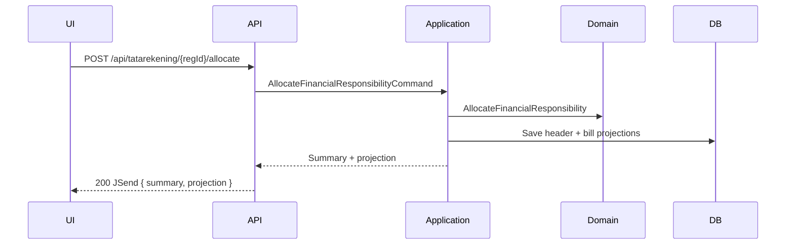
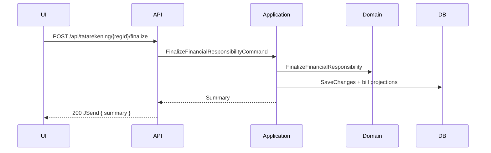
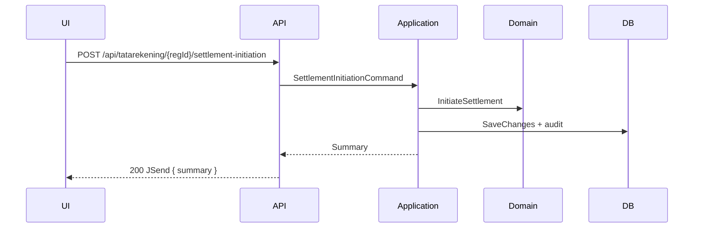

# Tata Rekening — Frontend Integration Guide

**Audience:** Frontend developers and AI agents implementing the Tata Rekening UI  
**OpenAPI:** [`swagger.json`](swagger.json)  
**Related:** [`tata-rekening-api-contract.md`](tata-rekening-api-contract.md)

---

## Base URL

Configure per environment. OpenAPI `servers[0].url` is `/` (relative to API host).

Example: `https://{host}/api/tatarekening/{regId}`

---

## Authentication

### Mechanism

| Item | Value |
|------|-------|
| Scheme | JWT Bearer |
| Header | `Authorization: Bearer {access_token}` |
| Issuer | `BilregApiServer` (see `appsettings.json` Jwt:Issuer) |
| Audience | `BilregApiClient` |

### Authorization

| Endpoint type | Requirement |
|---------------|-------------|
| `GET /api/tatarekening/{regId}` | **None** (anonymous) |
| All `POST` endpoints | Policy `TataRekeningVerifikator` |

### Verifikator roles

JWT must include a `role` claim (or `ClaimTypes.Role`) with one of:

| RoleId | Description |
|--------|-------------|
| `VERIF-SPV` | Verifikator supervisor |
| `VERIF-USR` | Verifikator user |

Permission required for writes: `TATA-REKENING-WRITE`.

### Actor identity

The API derives the verifier identity from JWT claims (`sub`, `NameIdentifier`, or `name`). Do **not** send `petugasVerif` in request bodies — the backend sets it from the token for verify, finalize, and settlement.

### Required headers (writes)

```http
Authorization: Bearer {token}
Content-Type: application/json
```

---

## Response envelope (JSend)

All successful responses:

```json
{
  "status": "success",
  "code": 200,
  "data": { }
}
```

Error responses (from `ErrorHandlerMiddleware`):

```json
{
  "status": "Not Found",
  "code": 404,
  "message": "Human-readable error message"
}
```

Always read `code` (HTTP status) and `message` for error handling.

---

## Endpoint summary

### GET `/api/tatarekening/{regId}` — Open Tata Rekening (SOP-TR-01)

**Purpose:** Load the Tata Rekening workspace for a registration.

**Auth:** None

**Request:** Path parameter `regId` only.

**Success — 200 `data`:**

```json
{
  "summary": { "regId": "REG-001", "status": 0, "financialVerificationStatus": 0, "isFinancialResponsibilityAllocated": false, "settlementInitiated": false },
  "bills": [ { "trsBillingId": "BILL-01", "regId": "REG-001", "modulGroup": 0, "nilaiTotal": 50000, "financialTotal": 50000 } ],
  "projection": [ { "paymentId": "BYKAS", "paymentName": "KAS", "isTipeJaminan": false, "nilaiJasa": 50000, "nilaiObat": 0 } ],
  "pendingMergeRequests": [ { "mergeRequestId": "MR-01", "sourceRegId": "REG-SRC", "targetRegId": "REG-001", "status": 0 } ]
}
```

**Errors:** 404 (registration or Tata Rekening not found)

---

### POST `/api/tatarekening/{regId}/close` — Close Bill (SOP-TR-02)

**Purpose:** Close the billing set when operational charges are complete.

**Auth:** Verifikator

**Request:** Empty body.

**Success — 200 `data`:**

```json
{ "summary": { "regId": "REG-001", "status": 1, "financialVerificationStatus": 0, "isFinancialResponsibilityAllocated": false, "settlementInitiated": false } }
```

**Errors:** 400 (e.g. bill not OPEN), 401, 403, 404, 409, 500

---

### POST `/api/tatarekening/merge` — Merge Billing (SOP-TR-03)

**Purpose:** Execute a pending merge request; move source bills to target registration.

**Auth:** Verifikator

**Request:**

```json
{ "mergeRequestId": "MR-00001" }
```

**Success — 200 `data`:**

```json
{
  "mergeRequest": { "mergeRequestId": "MR-00001", "sourceRegId": "REG-SRC", "targetRegId": "REG-TGT", "status": 1 },
  "sourceSummary": { "regId": "REG-SRC", "status": 1, "financialVerificationStatus": 0, "isFinancialResponsibilityAllocated": false, "settlementInitiated": false },
  "targetSummary": { "regId": "REG-TGT", "status": 1, "financialVerificationStatus": 0, "isFinancialResponsibilityAllocated": false, "settlementInitiated": false }
}
```

**Errors:** 400, 401, 403, 404, 409, 422, 500

**Note:** Merge request **creation** is out of scope; requests must exist before calling this endpoint.

---

### POST `/api/tatarekening/{regId}/verify` — Financial Verification (SOP-TR-04)

**Purpose:** Mark verification valid or flag that adjustment is required.

**Auth:** Verifikator

**Request:**

```json
{ "action": 0, "verifiedAt": "2026-06-30T10:00:00Z" }
```

`action`: `0` = Verify, `1` = RequireAdjustment. `verifiedAt` is optional (defaults to server UTC now).

**Success — 200 `data`:** `{ "summary": { ... } }`

**Errors:** 400 (e.g. pending merge blocks verify), 401, 403, 404, 409, 422, 500

---

### POST `/api/tatarekening/{regId}/adjust` — Financial Adjustment (SOP-TR-05)

**Purpose:** Apply waive, subsidy, billing correction, manual charge, or charge-source flag.

**Auth:** Verifikator

**Request:**

```json
{
  "adjustment": {
    "type": 2,
    "amount": 10000,
    "reason": "Waive selisih",
    "trsBillingId": "BILL-01",
    "requiresChargeSourceChange": false
  },
  "appliedAt": "2026-06-30T10:00:00Z"
}
```

**Success — 200 `data`:**

```json
{
  "summary": { ... },
  "requiresReopen": false,
  "adjustmentType": 2,
  "trsBillingId": "BILL-01"
}
```

When `requiresReopen` is `true`, call **Reopen** next (charge-source change path).

**Errors:** 400, 401, 403, 404, 409, 422, 500

---

### POST `/api/tatarekening/{regId}/allocate` — Allocation (SOP-TR-06)

**Purpose:** Allocate financial responsibility across payers; regenerate projection.

**Auth:** Verifikator

**Request:**

```json
{
  "payments": [
    {
      "paymentId": "BYKAS",
      "paymentName": "KAS",
      "isTipeJaminan": false,
      "nilaiJasa": 100000,
      "nilaiObat": 0,
      "coaId": "COA-01",
      "coaName": "COA Kas"
    }
  ]
}
```

**Success — 200 `data`:**

```json
{
  "summary": { "isFinancialResponsibilityAllocated": true, ... },
  "projection": [ { "paymentId": "BYKAS", "paymentName": "KAS", "isTipeJaminan": false, "nilaiJasa": 100000, "nilaiObat": 0 } ]
}
```

**Errors:** 400, 401, 403, 404, 409, 422, 500

---

### POST `/api/tatarekening/{regId}/finalize` — Finalize (SOP-TR-07)

**Purpose:** Lock financial responsibility after allocation review.

**Auth:** Verifikator

**Request:**

```json
{ "finalizationDate": "2026-06-30T10:00:00Z" }
```

Body may be `{}` — date defaults to server UTC now.

**Success — 200 `data`:** `{ "summary": { "status": 2, ... } }` (status = Finalized)

**Errors:** 400, 401, 403, 404, 409, 422, 500

---

### POST `/api/tatarekening/{regId}/cancel-finalization` — Cancel Finalization (SOP-TR-08)

**Purpose:** Revert FINALIZED → CLOSED to allow re-allocation.

**Auth:** Verifikator

**Request:**

```json
{ "reason": "Koreksi alokasi jaminan" }
```

**Success — 200 `data`:** `{ "summary": { "status": 1, "isFinancialResponsibilityAllocated": false, ... } }`

**Errors:** 400, 401, 403, 404, 409, 422, 500

---

### POST `/api/tatarekening/{regId}/reopen` — Reopen Billing (SOP-TR-09)

**Purpose:** Reopen CLOSED billing after charge-source adjustment.

**Auth:** Verifikator

**Request:**

```json
{ "reason": "Koreksi charge source" }
```

**Success — 200 `data`:** `{ "summary": { "status": 0, ... } }` (status = Opened)

**Errors:** 400, 401, 403, 404, 409, 422, 500

---

### POST `/api/tatarekening/{regId}/settlement-initiation` — Settlement Initiation (SOP-TR-10)

**Purpose:** Hand off finalized bill to cashier settlement workflow.

**Auth:** Verifikator

**Request:**

```json
{ "initiatedAt": "2026-06-30T10:00:00Z" }
```

Body may be `{}`.

**Success — 200 `data`:** `{ "summary": { "settlementInitiated": true, ... } }`

**Errors:** 400, 401, 403, 404, 409, 422, 500

**Note:** Route spelling `settlement-initiation` is intentional (matches backend).

---

## Workflow mapping

```text
Open Screen
    ↓
GET /api/tatarekening/{regId}
    ↓
[User reviews bills, projection, pending merges]
    ↓
Close Bill button → POST /api/tatarekening/{regId}/close
    ↓
[Optional] Merge Billing dialog → POST /api/tatarekening/merge
    ↓
Verify button → POST /api/tatarekening/{regId}/verify  (action: 0)
    ↓
[If verification requires adjustment]
    POST /api/tatarekening/{regId}/verify  (action: 1)
    → POST /api/tatarekening/{regId}/adjust
    → [if requiresReopen] POST /api/tatarekening/{regId}/reopen
    → re-run Close / Verify as needed
    ↓
Allocate → POST /api/tatarekening/{regId}/allocate
    ↓
Finalize → POST /api/tatarekening/{regId}/finalize
    ↓
[Optional correction]
    POST /api/tatarekening/{regId}/cancel-finalization
    → POST /api/tatarekening/{regId}/allocate  (re-allocate)
    → POST /api/tatarekening/{regId}/finalize
    ↓
Settlement → POST /api/tatarekening/{regId}/settlement-initiation
```

### Status-driven UI guards (use `summary` from GET or last mutation)

| `summary.status` | Typical enabled actions |
|--------------------|-------------------------|
| Opened (0) | Close |
| Closed (1) | Merge (if pending requests), Verify, Adjust, Allocate, Reopen |
| Finalized (2) | Cancel Finalization, Settlement Initiation |
| Lunas (3) | Read-only |

| `financialVerificationStatus` | UI hint |
|-------------------------------|---------|
| NotVerified (0) | Show Verify |
| Valid (1) | Enable Allocate |
| RequiresAdjustment (2) | Show Adjust flow |

---

## Error mapping

| HTTP | Meaning | Frontend action |
|------|---------|-------------------|
| 400 | Business rule violation | Show dialog with `message`; keep user on screen |
| 401 | Not authenticated | Redirect to login / refresh token |
| 403 | Not Verifikator | Show permission denied; disable write actions |
| 404 | Registration or entity not found | Navigate back to registration search |
| 409 | Optimistic concurrency (stale version) | Reload via GET Open; prompt user to retry |
| 422 | Validation error (format/required fields) | Highlight invalid fields; show `message` |
| 500 | Unexpected server error | Generic error toast; offer retry |

---

## DTO reference

### TataRekeningSummaryDto

| Property | Type | Nullable | Description |
|----------|------|----------|-------------|
| regId | string | no | Registration identifier |
| status | TataRekeningStatusEnum (int) | no | Billing lifecycle status |
| financialVerificationStatus | FinancialVerificationStatusEnum (int) | no | Verification state |
| isFinancialResponsibilityAllocated | boolean | no | Allocation completed flag |
| settlementInitiated | boolean | no | Settlement handoff flag |

### TrsBillSummaryDto

| Property | Type | Nullable | Description |
|----------|------|----------|-------------|
| trsBillingId | string | no | Bill identifier |
| regId | string | no | Owning registration |
| modulGroup | BillModulGroup (int) | no | 0=Jasa, 1=Obat |
| nilaiTotal | number | no | Total bill amount |
| financialTotal | number | no | Financial charge total |

### PaymentProjectionDto

| Property | Type | Nullable | Description |
|----------|------|----------|-------------|
| paymentId | string | no | Payer / payment type id |
| paymentName | string | no | Display name |
| isTipeJaminan | boolean | no | Insurance-type payer |
| nilaiJasa | number | no | Service allocation amount |
| nilaiObat | number | no | Pharmacy allocation amount |

### MergeRequestSummaryDto

| Property | Type | Nullable | Description |
|----------|------|----------|-------------|
| mergeRequestId | string | no | Merge request id |
| sourceRegId | string | no | Source registration |
| targetRegId | string | yes | Target registration (may be null for patient-level pending) |
| status | MergeRequestStatusEnum (int) | no | Pending / Executed / Cancelled |

### PaymentAllocationInputDto

| Property | Type | Nullable | Description |
|----------|------|----------|-------------|
| paymentId | string | no | Payer id |
| paymentName | string | no | Payer name |
| isTipeJaminan | boolean | no | Insurance flag |
| nilaiJasa | number | no | Service amount |
| nilaiObat | number | no | Pharmacy amount |
| coaId | string | no | Chart of accounts id |
| coaName | string | no | COA display name |

### FinancialAdjustmentInputDto

| Property | Type | Nullable | Description |
|----------|------|----------|-------------|
| type | FinancialAdjustmentTypeEnum (int) | no | Adjustment kind |
| amount | number | no | Adjustment amount |
| reason | string | no | Audit reason |
| trsBillingId | string | yes | Target bill (most types) |
| subsidyPaymentId | string | yes | Subsidy payer id |
| subsidyPaymentName | string | yes | Subsidy payer name |
| requiresChargeSourceChange | boolean | no | If true, response may set requiresReopen |
| manualChargeTrsBillingId | string | yes | Required for ManualCharge type |

### Request bodies (API layer)

| DTO | Required fields |
|-----|-----------------|
| MergeBillingRequest | mergeRequestId |
| FinancialVerificationRequest | action |
| FinancialAdjustmentRequest | adjustment |
| AllocateFinancialResponsibilityRequest | payments (non-empty array) |
| FinalizeFinancialResponsibilityRequest | _(all optional)_ |
| CancelFinalizationRequest | reason (min length 1) |
| ReopenBillingRequest | reason (min length 1) |
| SettlementInitiationRequest | _(all optional)_ |

### Response wrappers (`data` payload)

| DTO | Used by |
|-----|---------|
| OpenTataRekeningApiResponse | GET open |
| TataRekeningMutationApiResponse | close, verify, finalize, cancel, reopen, settlement |
| MergeBillingApiResponse | merge |
| AllocateFinancialResponsibilityApiResponse | allocate |
| FinancialAdjustmentApiResponse | adjust |

---

## Enum reference

### TataRekeningStatusEnum (billing lifecycle)

| Value | Name | Description |
|-------|------|-------------|
| 0 | Opened | Billing open; charges may still arrive |
| 1 | Closed | Billing closed; financial control phase |
| 2 | Finalized | Financial responsibility locked |
| 3 | Lunas | Fully settled / paid |

### FinancialVerificationStatusEnum

| Value | Name | Description |
|-------|------|-------------|
| 0 | NotVerified | Verification not completed |
| 1 | Valid | Ready for allocation |
| 2 | RequiresAdjustment | Must adjust before proceeding |

### MergeRequestStatusEnum

| Value | Name | Description |
|-------|------|-------------|
| 0 | Pending | Awaiting merge execution |
| 1 | Executed | Merge completed |
| 2 | Cancelled | Merge cancelled |

### FinancialAdjustmentTypeEnum

| Value | Name | Description |
|-------|------|-------------|
| 0 | ManualCharge | Add manual charge line |
| 1 | BillingCorrection | Correct bill amount |
| 2 | Waive | Waive portion of charge |
| 3 | Subsidy | Apply subsidy payer |
| 4 | MergeBillingCorrection | Post-merge correction |

### FinancialVerificationAction (request)

| Value | Name | Description |
|-------|------|-------------|
| 0 | Verify | Complete verification successfully |
| 1 | RequireAdjustment | Flag adjustment required |

### BillModulGroup

| Value | Name |
|-------|------|
| 0 | Jasa |
| 1 | Obat |

**JSON serialization:** Enums are serialized as **integers**, not strings.

---

## Screen recommendation

```text
Open Tata Rekening (route: /tata-rekening/{regId})
│
├── Summary Card          ← data.summary (status, verification, flags)
├── Billing List          ← data.bills[]
├── Merge Request Panel   ← data.pendingMergeRequests[] (actions: Execute Merge)
├── Projection Panel      ← data.projection[] (after allocation)
├── Financial Responsibility Editor  ← allocate form → POST allocate
└── Action Bar
    ├── Close Bill        (status == Opened)
    ├── Verify            (status == Closed, not verified)
    ├── Adjust            (requiresAdjustment or user-initiated)
    ├── Allocate          (verified, not allocated)
    ├── Finalize          (allocated, not finalized)
    ├── Cancel Finalization (finalized, no settlement)
    ├── Reopen            (after adjust requiresReopen)
    └── Settlement        (finalized, not settlementInitiated)
```

After every successful **POST**, update local state from `data.summary` (and `data.projection` when returned). On **409**, call **GET Open** to resync.

---

## Sequence diagrams

### Close Bill



### Merge Billing



### Financial Verification



### Financial Adjustment



### Allocation



### Finalization



### Settlement Initiation



---

## Backend assumptions (frontend must know)

1. **Merge requests** are created outside this API; Open screen lists pending requests only.
2. **Payment / cashier** flows are separate; settlement initiation does not record payment.
3. **Optimistic concurrency** — concurrent writes may return 409; always reload Open after 409.
4. **Enum values** are integers in JSON request/response bodies.
5. **Verifier identity** comes from JWT, not from request body fields.
6. **RegId** in URL must match an existing registration with a Tata Rekening header.

---

## Regenerating OpenAPI

```powershell
$env:EXPORT_TATA_OPENAPI = "1"
dotnet test Bilreg.Test --filter "FullyQualifiedName~Export_WhenEnvSet"
```

Output: `docs/contexts/TataRekening/swagger.json`
