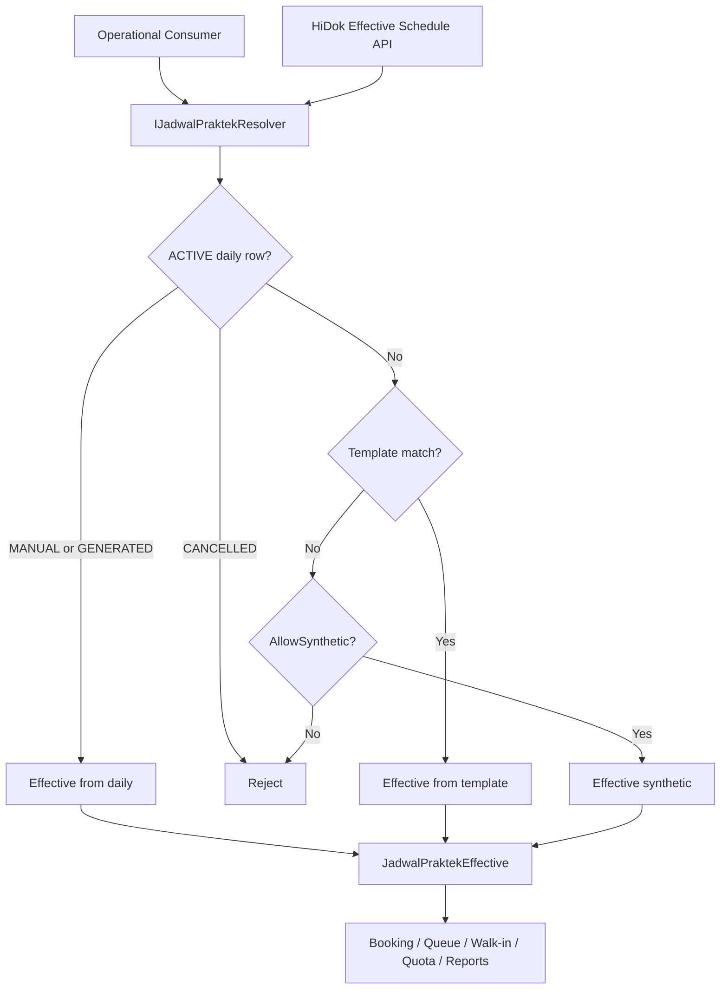
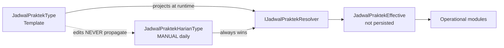

# JadwalPraktekHarian — Architecture Analysis

**Date:** 2026-06-23  
**Status:** Approved — design decisions locked  
**Audience:** Software architects, senior developers  
**Prerequisites:** [jadwal-praktek-investigation-report.md](./jadwal-praktek-investigation-report.md)  
**Scope:** Introduce daily practice schedule (`JadwalPraktekHarianType`) as execution-layer schedule alongside existing weekly template (`JadwalPraktekType`)

---

## 0. Design Philosophy & Locked Decisions

### 0.1 Design principles

| Principle | Implication |
|-----------|-------------|
| Simple, explicit domain models | Two persisted aggregates + one runtime projection; no generic schedule hierarchy |
| Planning vs execution separation | Template plans; daily schedule executes; neither auto-mutates the other |
| No automatic operational mutation | Override, cancellation, and queue changes are explicit workflows — never side effects |
| Consumers depend on Effective Schedule | Booking, queue, walk-in, HiDok, reports use `JadwalPraktekEffective` only |
| Trial-phase domain improvement allowed | Internal model may evolve; **HiDok** is already public — treat its API contract carefully |

### 0.2 Persisted vs runtime concepts

```text
PERSISTED (domain entities)          RUNTIME (never persisted)
─────────────────────────────        ─────────────────────────
JadwalPraktekType                    JadwalPraktekEffective
  weekly template                      projection returned by resolver
                                       consumed by all operational modules

JadwalPraktekHarianType
  daily occurrence (only when needed)
  override / cancel / replace
```

`JadwalPraktekEffective` is **not** a table, **not** an aggregate root, and **must not** become a persisted entity. It is a value object / read model materialized by `IJadwalPraktekResolver`.

### 0.3 Resolver as single authority

`IJadwalPraktekResolver` is the **only** component that decides schedule resolution. No operational module may implement its own template/daily lookup logic.

**Forbidden after migration:** private `ResolveJadwalPraktek` methods, direct `IJadwalPraktekRepo.ListData` + `DayOfWeek` filtering in booking, queue, walk-in, quota, or report handlers.

### 0.4 Locked business decisions

| # | Topic | Decision |
|---|-------|----------|
| 1 | Booking schedule reference | Store **both** nullable `JadwalPraktekId` (lineage) and `JadwalPraktekHarianId` (execution). **No** full schedule snapshot on booking. |
| 2 | Override when bookings exist | **Block** in v1 with clear validation message. Future "Move Existing Bookings" workflow is out of scope. |
| 3 | Replacement doctor | **New queue** (doctor + date + session). Existing bookings are **not** auto-migrated. |
| 4 | Holiday | **Defer** holiday master. v1: `Status = CANCELLED`, `Catatan` = reason (e.g. `"Holiday"`). |
| 5 | Template audit columns | **Defer.** Audit on daily schedule only. |
| 6 | HiDok discovery API | **Effective Schedule API** only. HiDok never sees template vs daily vs synthetic distinction. |
| 7 | Walk-in synthetic | **Remain runtime-only.** Never auto-persist synthetic schedules. |
| 8 | Multiple sessions same day | **Require `JamMulai`** for deterministic resolution when multiple sessions exist. |
| 9 | Manual daily override | Once `Source = MANUAL`, daily row is **fully independent** of future template edits. `JadwalPraktekId` is traceability only. |

---

## 1. Executive Summary

The proposal to introduce `JadwalPraktekHarianType` as a **date-specific execution schedule** separate from the **weekly recurring template** (`JadwalPraktekType`) is **approved**.

**Architecture:**

- **Planning layer:** `JadwalPraktekType` (weekly template)
- **Execution layer:** `JadwalPraktekHarianType` (persisted only when override/cancel/replace requires it)
- **Runtime contract:** `JadwalPraktekEffective` (resolver projection — never persisted)
- **Single authority:** `IJadwalPraktekResolver`

**Critical findings from codebase audit:**

| Finding | Impact |
|---------|--------|
| Schedule resolution is **duplicated** in 6+ handlers with slightly different rules | Eliminate via mandatory resolver migration |
| `AntrianFactory.Create` and `BookingModel.CreateLocal` enforce `visitDate.DayOfWeek == jadwal.Hari` | Replace with `TglPraktek` validation via effective schedule |
| `Booking` does **not** store schedule IDs — only `DokterId`, `JamPraktek`, `TglBerobat` | Add `JadwalPraktekId` + `JadwalPraktekHarianId` (both nullable) |
| `AntrianMap` stores template `JadwalId` + composite lookup | Daily override blocked when operational bookings exist (v1) |
| Walk-in uses **synthetic in-memory schedule** when no template exists | Preserved as runtime `Source = SYNTHETIC`; never persisted |
| Template updates do **not** rebuild existing antrian maps | Reinforced: manual daily rows also immune to template edits |

**Complexity estimate:** Medium–High (cross-cutting, 15+ touch points). HiDok Effective Schedule API requires careful versioning.

---

## 2. Domain Analysis

### 2.1 Is `JadwalPraktekHarianType` the correct model?

**Yes.** The business distinguishes two change types:

| Change type | Layer | Example |
|-------------|-------|---------|
| Permanent | Weekly template | Doctor permanently moves practice to Thursday |
| Incidental | Daily occurrence | Doctor on leave 2026-07-15; substitute doctor; one-day time change |

### 2.2 Aggregate boundaries

```text
┌─────────────────────────────────────┐
│  Scheduling Bounded Context         │
│  (Admisi / BookingFeature)          │
├─────────────────────────────────────┤
│  JadwalPraktek (Template Aggregate) │
│    - weekly recurrence rules        │
│    - overlap validation per doctor  │
│    - CRUD via admin commands        │
│    - NEVER mutates manual daily rows│
├─────────────────────────────────────┤
│  JadwalPraktekHarian (Occurrence)   │
│    - date-specific execution        │
│    - optional link to template      │
│    - override / cancel / replace    │
│    - MANUAL rows fully independent  │
└─────────────────────────────────────┘
         │
         │ IJadwalPraktekResolver (single authority)
         ▼
┌─────────────────────────────────────┐
│  JadwalPraktekEffective             │
│  (runtime projection — NOT stored)  │
└─────────────────────────────────────┘
         │
         ▼
┌─────────────────────────────────────┐
│  Operational Consumers              │
│  Booking, Antrian, AntrianMap, Reg  │
│  Quota, Reports, HiDok              │
└─────────────────────────────────────┘
```

### 2.3 Identity

| Concept | Identity | Natural key (business) |
|---------|----------|------------------------|
| `JadwalPraktekType` | `JadwalPraktekId` (`JADW###`) | Doctor + DayOfWeek + JamMulai |
| `JadwalPraktekHarianType` | `JadwalPraktekHarianId` (`JPH########`) | TglPraktek + DokterId + JamMulai |
| `JadwalPraktekEffective` | *(none — not persisted)* | Resolved per request |

For **doctor replacement**, the natural key uses the **practicing doctor** on the daily row. `JadwalPraktekId` on the daily row preserves template lineage only.

### 2.4 Lifecycle

**Weekly template (`JadwalPraktekType`):**

| Event | Behavior |
|-------|----------|
| Create | New `JADW###`; overlap validation |
| Update | In-place update; **never** modifies manual daily rows, generated dailies with `Source=MANUAL`, or seeded antrian maps |
| Delete | Block if future bookings exist; does not delete historical daily or operational data |

**Daily schedule (`JadwalPraktekHarianType`):**

| Event | Behavior |
|-------|----------|
| Generated (implicit) | Resolver projects from template at runtime; no row required |
| Generated (explicit) | Optional batch INSERT with `Source = GENERATED`; invalidated by regeneration command only |
| Manual override | `Source = MANUAL`; **becomes independent from template** (see §2.8) |
| Cancellation | `Status = CANCELLED`; blocks booking/walk-in; use `Catatan` for reason (e.g. `"Holiday"`) |
| Replacement doctor | Daily row with new `DokterId`; **new queue**; existing bookings not migrated |
| Expiration | Past dates retained for audit; no auto-delete |

### 2.5 Relationship with `JadwalPraktekType`

```text
JadwalPraktekType (0..1) ──< JadwalPraktekHarianType (0..*)
         │                              │
         │  traceability only           │  TglPraktek is authoritative
         └──────────────────────────────┘
              (no auto-sync after MANUAL)
```

- Most dates need **no** persisted daily row — resolver projects from template.
- Persisted daily rows exist for override, cancellation, and explicit admin actions only.

### 2.6 Avoid inheritance

**Do not** model `JadwalPraktekHarianType : JadwalPraktekType`.

Introduce `JadwalPraktekEffective` as a **runtime value object**:

```text
JadwalPraktekEffective          ← NEVER persisted
  - JadwalPraktekId             (nullable — template lineage)
  - JadwalPraktekHarianId       (nullable — persisted daily, if any)
  - TglPraktek
  - Dokter, Layanan, LayananDk, GroupSpesialis, Ruang
  - JamMulai, JamSelesai
  - MaxPasien, AntrianPattern
  - Status                      (ACTIVE | CANCELLED)
  - Source                      (TEMPLATE | DAILY_GENERATED | DAILY_MANUAL | SYNTHETIC)
```

Operational consumers migrate from `JadwalPraktekType` → `JadwalPraktekEffective`. Admin/template UIs continue to use persisted entities directly.

### 2.7 Occurrence vs derived entity

**Hybrid (approved):** Persist daily rows only when override/cancel/replace requires durable state. Otherwise resolver projects from template at runtime. Walk-in synthetic remains purely runtime (`Source = SYNTHETIC`).

### 2.8 Manual override independence (core rule)

> Once a daily schedule has `Source = MANUAL`, it is **fully independent** of future template modifications.

| Scenario | Behavior |
|----------|----------|
| Admin edits template `JamMulai`, `MaxPasien`, `DokterId` | Manual daily row **unchanged** |
| Admin deletes template | Manual daily row **retained**; `JadwalPraktekId` may point to deleted template (traceability) |
| Resolver on date with manual daily | Always uses daily row, never re-derives from template |
| `JadwalPraktekId` on manual daily | Lineage / reporting only — not a live sync link |

`Source = GENERATED` rows (optional batch) **may** be invalidated by an explicit regeneration command when template changes. `Source = MANUAL` rows **must not** be touched by template edits or batch regeneration.

---

## 3. Architecture Validation

### 3.1 Proposed layering

```text
         Admin UI / API                    HiDok (public)
              │                                  │
    ┌─────────┴─────────┐                        │
    ▼                   ▼                        ▼
JadwalPraktek      JadwalPraktekHarian    Effective Schedule API
(admin only)       (admin only)           (external contract)
    │                   │                        │
    └─────────┬─────────┘                        │
              ▼                                    │
      IJadwalPraktekResolver ◄───────────────────┘
              │
              ▼
      JadwalPraktekEffective  (runtime only)
              │
    ┌─────────┼─────────┬──────────┐
    ▼         ▼         ▼          ▼
 Booking   Antrian   AntrianMap   Quota / Reports
 Walk-in
```

### 3.2 Validation against ENGINEERING.md principles

| Principle | Alignment |
|-----------|-----------|
| Pragmatic Tactical DDD | Two aggregates + one value object — explicit, not over-abstracted |
| Explicit persistence | New table with explicit SQL; effective schedule stays out of database |
| Operational workflow clarity | Resolver centralizes all resolution; no hidden lookup in consumers |
| Low cognitive load | External and internal ops consumers see one effective shape |

---

## 4. Database Design

### 4.1 New table: `BILRG_JadwalPraktekHarian`

```sql
CREATE TABLE BILRG_JadwalPraktekHarian (
    JadwalPraktekHarianId VARCHAR(12) NOT NULL
        CONSTRAINT DF_BILRG_JPH_Id DEFAULT (''),
    JadwalPraktekId       VARCHAR(7)  NULL,      -- traceability; NOT a live sync link
    TglPraktek            DATE        NOT NULL,
    DokterId              VARCHAR(10) NOT NULL,
    LayananId             VARCHAR(5)  NOT NULL,
    RuangId               VARCHAR(8)  NOT NULL,
    JamMulai              VARCHAR(5)  NOT NULL,
    JamSelesai            VARCHAR(5)  NOT NULL,
    MaxPasien             INT         NOT NULL,
    AntrianPattern        VARCHAR(512) NOT NULL,
    Status                VARCHAR(20) NOT NULL,  -- ACTIVE | CANCELLED
    Source                VARCHAR(20) NOT NULL,  -- GENERATED | MANUAL
    Catatan               VARCHAR(200) NULL,     -- override reason; "Holiday" for v1 holidays

    CrtUser               VARCHAR(50) NOT NULL,
    CrtDate               DATETIME    NOT NULL,
    UpdUser               VARCHAR(50) NOT NULL,
    UpdDate               DATETIME    NOT NULL,

    CONSTRAINT PK_BILRG_JadwalPraktekHarian
        PRIMARY KEY CLUSTERED (JadwalPraktekHarianId)
);
```

**Note:** `Source = HOLIDAY` is **not** a separate enum value in v1. Holidays are represented as `Status = CANCELLED` with `Catatan` describing the reason. A `BILRG_JadwalLibur` holiday calendar is **deferred**.

### 4.2 Design decisions

| Decision | Rationale |
|----------|-----------|
| **`JadwalPraktekId` nullable** | Traceability for overrides; NULL for ad-hoc daily (not walk-in synthetic — that stays runtime-only) |
| **`Source` = GENERATED \| MANUAL only** | Holiday via cancellation + `Catatan`; keeps v1 simple |
| **Audit on daily only** | Template audit deferred per locked decision |
| **No `Hari` column** | `TglPraktek` is authoritative |

### 4.3 Indexes

```sql
CREATE UNIQUE INDEX UX_BILRG_JPH_Tgl_Dokter_Jam
    ON BILRG_JadwalPraktekHarian (TglPraktek, DokterId, JamMulai)
    WHERE Status = 'ACTIVE'
    WITH (FILLFACTOR = 90);

CREATE INDEX IX_BILRG_JPH_JadwalPraktekId_Tgl
    ON BILRG_JadwalPraktekHarian (JadwalPraktekId, TglPraktek)
    WITH (FILLFACTOR = 90);

CREATE INDEX IX_BILRG_JPH_TglPraktek
    ON BILRG_JadwalPraktekHarian (TglPraktek, DokterId)
    WITH (FILLFACTOR = 90);
```

### 4.4 Booking table changes (required)

Add **both** nullable columns to `BILRG_Booking`:

```sql
ALTER TABLE BILRG_Booking
    ADD JadwalPraktekId       VARCHAR(7)  NULL,
        JadwalPraktekHarianId VARCHAR(12) NULL;
```

| Column | Purpose |
|--------|---------|
| `JadwalPraktekId` | Lineage — which recurring template slot the booking originated from |
| `JadwalPraktekHarianId` | Execution — which persisted daily schedule was active (NULL when resolved from template or synthetic) |

**No full schedule snapshot** on booking. Doctor, visit date, and practice time already stored operationally suffice for display. Schedule IDs enable stable re-resolution on delete/quota without re-deriving from current template state.

Populated at booking creation from `JadwalPraktekEffective.JadwalPraktekId` and `.JadwalPraktekHarianId`.

### 4.5 AntrianMap (optional, milestone 4)

Additive column `fs_kd_jadwal_harian` on `ta_no_antrian_map_hdr` recommended. Existing `fs_kd_jadwal` retains template lineage.

### 4.6 Holiday handling (v1)

No holiday master table. Admin cancels daily schedule:

```text
Status  = CANCELLED
Catatan = "Holiday"   (or free-text reason)
Source  = MANUAL
```

Hospital-wide holiday automation is a **future** concern.

---

## 5. Runtime Resolution Design

### 5.1 Component: `IJadwalPraktekResolver`

**Location:** `Bilreg.Application/AdmisiContext/BookingFeature/`

```text
interface IJadwalPraktekResolver
{
    JadwalPraktekEffective Resolve(JadwalPraktekResolveRequest request);
    IEnumerable<JadwalPraktekEffective> ResolveForDate(JadwalPraktekResolveForDateRequest request);
}
```

**Single authority rule:** All modules listed in §0.3 must call this interface. Code review gate: no `IJadwalPraktekRepo` usage in operational handlers except inside resolver implementation and template admin commands.

```text
record JadwalPraktekResolveRequest(
    DateOnly TglPraktek,
    IPpaKey Dokter,
    TimeOnly? JamMulai,          -- REQUIRED when multiple sessions exist on same date
    JadwalPraktekResolveOptions Options
);

record JadwalPraktekResolveOptions(
    bool AllowSynthetic,         -- walk-in only
    bool ThrowIfCancelled,
    bool ThrowIfNotFound
);
```

### 5.2 Resolution algorithm

```text
Resolve(date, dokter, jamMulai?):

1. Load ACTIVE daily WHERE TglPraktek = date AND DokterId = dokter
     a. IF jamMulai provided → filter JamMulai; IF multiple ACTIVE without jamMulai → throw ambiguous
     b. IF found AND Status = CANCELLED → reject (per options)
     c. IF found AND Status = ACTIVE  → return MapToEffective(daily)  // MANUAL or GENERATED

2. Load templates WHERE DokterId = dokter AND Hari = date.DayOfWeek
     a. IF jamMulai provided → filter JamMulai match
     b. IF zero matches → go to step 3
     c. IF one match → return MapToEffective(template, date, source=TEMPLATE)
     d. IF multiple without jamMulai → throw "JamMulai wajib diisi"

3. IF AllowSynthetic → return Synthetic(date, dokter, jamMulai or 00:00–23:59)

4. Throw not found
```

**Manual daily always wins** over template for the same natural key. Template edits never overwrite `Source = MANUAL` rows.

### 5.3 `ResolveForDate`

Used by queue UI, reports, and HiDok effective schedule list:

```text
1. Load all ACTIVE daily rows for TglPraktek
2. Load all templates for date.DayOfWeek
3. For each template slot:
     IF no ACTIVE daily exists for (TglPraktek, template.Dokter, template.JamMulai)
        → include template-derived effective
4. Include all ACTIVE daily rows (overrides, replacements)
5. Exclude CANCELLED from bookable results; include in admin/report views per query option
6. De-duplicate by (DokterId, JamMulai)
```

### 5.4 Day-of-week validation change

| Location | Required change |
|----------|-----------------|
| `AntrianFactory.Create` | Validate `effective.TglPraktek == antrianDate`; remove `jadwal.Hari` check |
| `BookingModel.CreateLocal` | Accept `JadwalPraktekEffective`; validate `tglBerobat == effective.TglPraktek` |

### 5.5 Queue identity

Sequence tag: `AN{yyMMdd}{JamMulai:HHmm}_{DokterId}`

Queue identity = **doctor + practice date + practice session (JamMulai)**.

**Replacement doctor → new queue** (approved). Patients queue for a doctor, not a room. Existing bookings under the original doctor's queue are **not** auto-migrated.

### 5.6 Override guard (v1)

Before saving a manual daily override or cancellation, validate:

```text
IF any non-voided booking exists for (TglPraktek, DokterId, JamMulai)
   OR any antrian entry exists for the session's sequence tag
THEN reject with clear message
```

Future versions may introduce explicit "Move Existing Bookings" admin workflow. v1 **blocks only**.

### 5.7 HiDok Effective Schedule API (external contract)

HiDok must **not** consume template or daily admin APIs. It consumes **Effective Schedule** only.

**Proposed endpoints (additive, version carefully):**

| HTTP | Route | Purpose |
|------|-------|---------|
| `GET` | `api/JadwalPraktekEffective/{dokterId}/{tglYmd}` | All effective sessions for doctor on date |
| `GET` | `api/JadwalPraktekEffective/{dokterId}/{tglYmd}/{jamMulai}` | Single session (booking/quota) |

**Response shape (example):**

```json
{
  "tglPraktek": "2026-07-15",
  "dokterId": "DR001",
  "jamMulai": "08:00",
  "jamSelesai": "12:00",
  "layananId": "LY001",
  "ruangId": "RU001",
  "maxPasien": 30,
  "status": "ACTIVE",
  "availableQuota": 12
}
```

**Response must NOT expose:** `JadwalPraktekId`, `JadwalPraktekHarianId`, `Source`, or whether schedule came from template/daily/synthetic. Those are internal.

Implementation delegates to `IJadwalPraktekResolver`. Existing `BookingCreateFromHidokCommand` continues to work; new discovery endpoint supports HiDok schedule browsing before booking.

### 5.8 Code to migrate to resolver

| Priority | File | Migration |
|----------|------|-----------|
| P0 | `BookingCreateCmd.cs` | Resolver + persist both schedule IDs on booking |
| P0 | `BookingCreateFromHidokCommand.cs` | Same |
| P0 | `RegJalanWalkInCommand.cs` | Resolver; `AllowSynthetic=true`; remove private lookup |
| P0 | `RegJalanUbahKunjunganCmd.cs` | Same |
| P0 | `DeleteBookingWorkflow.cs` | Use booking's stored schedule IDs; fallback resolver |
| P1 | `AntrianGetQuotaQuery.cs` | Resolver with required `JamMulai` |
| P1 | `AntrianMapWithBookingResolver.cs` | Receive effective schedule from caller |
| P1 | `AntrianMapWithRegResolver.cs` | Same |
| P2 | `QueListAntrianHeaderQuery.cs` | `ResolveForDate` |
| P2 | `QuePasienListQuery.cs` | Same |
| P2 | `PraktekDokterPeriodeDokterListQuery.cs` | `ResolveForDate` per date in range |
| P2 | `PraktekDokterPeriodeGroupSpesialisListQuery.cs` | Same |
| P3 | `AntrianFactory.cs` | Accept `JadwalPraktekEffective` |
| P3 | `AntrianMapModel` | `CreateFromEffective` |

**Admin queries** (`JadwalPraktekListQuery`, `JadwalPraktekHarian*` admin) remain on persisted entities — not via resolver.

---

## 6. Consumer Impact Matrix

| Consumer | Required modification | Migration risk |
|----------|----------------------|----------------|
| **Booking** | Resolver; store `JadwalPraktekId` + `JadwalPraktekHarianId`; reject `CANCELLED` | **Medium** |
| **HiDok Booking** | Resolver; same booking persistence | **Medium** — public integration |
| **HiDok Discovery** | New Effective Schedule API (§5.7) | **Medium** — new public contract |
| **Walk-in** | Resolver; `AllowSynthetic=true`; never persist synthetic | **Low** |
| **Change visit** | Resolver | **Medium** |
| **Queue header** | `JadwalPraktekEffective`; date-based validation | **Medium** |
| **Queue map** | `CreateFromEffective`; override blocked when bookings exist | **High** |
| **Queue number** | Effective dokter + jam in sequence tag | **Low** |
| **Quota** | Resolver with `JamMulai`; effective `MaxPasien` | **Medium** — fixes existing bug |
| **Reports** | `ResolveForDate`; cancelled days show correctly | **High** |
| **Queue UI** | `ResolveForDate` join | **Medium** |
| **Delete booking** | Use stored schedule IDs from booking | **Low** after ID columns added |
| **Jadwal admin** | Template CRUD unchanged; add daily admin (internal) | **Low** |

---

## 7. Lifecycle Design

### 7.1 Weekly template lifecycle

| Action | Rule |
|--------|------|
| **Create** | Overlap check per doctor + Hari |
| **Update** | Never modifies `Source = MANUAL` daily rows; may invalidate `Source = GENERATED` via explicit regen command only |
| **Delete** | Block if future bookings reference template |

### 7.2 Daily schedule lifecycle

| Action | Rule |
|--------|------|
| **Manual override** | `Source = MANUAL`; independent from template forever after |
| **Cancellation / Holiday** | `Status = CANCELLED`; `Catatan` = reason; no holiday master in v1 |
| **Replacement doctor** | New `DokterId` on daily row; new queue; no booking migration |
| **Override guard** | Block if operational bookings or antrian entries exist (v1) |

### 7.3 Generation strategy

**Primary: On-demand resolution** — no row unless override/cancel/admin action.

**Secondary (optional, milestone 5):** Nightly batch for next 7 days, `Source = GENERATED` only. Regeneration command may delete future `GENERATED` rows when template changes. **`MANUAL` rows never affected.**

---

## 8. Migration Strategy (Backward Compatibility)

### 8.1 Principles

1. No breaking changes to existing HiDok booking endpoint in phase 1–2
2. Effective Schedule API is **additive**
3. Booking schedule ID columns are **additive** (nullable; backfill not required)
4. Behavioral change (cancelled day rejection) only after resolver migration

### 8.2 Incremental phases

```text
Phase 0 ─ Investigation + decisions locked (this document)
Phase 1 ─ JadwalPraktekEffective + IJadwalPraktekResolver (no DB change)
Phase 2 ─ BILRG_JadwalPraktekHarian + daily admin API + override guard
Phase 3 ─ Migrate operational consumers; booking schedule IDs; HiDok Effective Schedule API
Phase 4 ─ AntrianMap alignment; reports; queue UI
Phase 5 ─ Optional GENERATED batch (no holiday master)
```

### 8.3 API surface

| API | Audience | v1 behavior |
|-----|----------|-------------|
| `GET/POST api/JadwalPraktek/*` | Internal admin | Unchanged — template only |
| `GET/POST api/JadwalPraktekHarian/*` | Internal admin | New — daily override/cancel |
| `GET api/JadwalPraktekEffective/*` | **HiDok + internal ops** | New — effective schedule only |
| Existing HiDok booking endpoint | HiDok | Unchanged contract; internal resolver upgrade |

HiDok must **never** be directed to `JadwalPraktekHarian` admin endpoints.

---

## 9. Risk Assessment

| Risk | Mitigation (locked) |
|------|---------------------|
| **Override with existing bookings** | **Block v1** with validation message |
| **Replacement doctor splits queue** | **Approved behavior** — new queue; no auto-migration |
| **Re-resolution drift on delete** | Store both schedule IDs on booking at creation |
| **Manual daily vs template drift** | **By design** — manual rows independent after override |
| **HiDok sees internal schedule model** | Effective Schedule API hides source/template/daily distinction |
| **Walk-in synthetic proliferation** | Never persist; runtime `SYNTHETIC` only |
| **Multiple sessions ambiguity** | Require `JamMulai` in resolver |
| **Concurrent duplicate dailies** | Filtered unique index on ACTIVE natural key |
| **Template edit vs GENERATED batch** | Regeneration command affects GENERATED only, never MANUAL |

---

## 10. Implementation Roadmap

### Milestone 1 — Effective schedule + resolver (no DB change)

| Item | Detail |
|------|--------|
| **Objective** | Runtime projection + single resolution authority |
| **Domain changes** | `JadwalPraktekEffective` (value object, not persisted), `IJadwalPraktekResolver` |
| **Acceptance criteria** | Resolver unit tests: template / manual daily / cancelled / synthetic / ambiguous-without-jam / multi-session-with-jam |
| **Complexity** | S |

### Milestone 2 — Daily schedule persistence + override guard

| Item | Detail |
|------|--------|
| **Objective** | Persist override/cancel; enforce manual independence; block override when bookings exist |
| **Database changes** | `BILRG_JadwalPraktekHarian` + indexes |
| **API changes** | Internal `JadwalPraktekHarianController` (admin only) |
| **Domain rules** | `Source = MANUAL` immunity from template edits; override guard (§5.6) |
| **Acceptance criteria** | Manual override survives template edit; override rejected when booking exists; holiday = CANCELLED + Catatan |
| **Complexity** | M |
| **Dependencies** | M1 |

### Milestone 3 — Operational migration + booking IDs + HiDok API

| Item | Detail |
|------|--------|
| **Objective** | All operational modules use resolver exclusively; HiDok gets effective schedule |
| **Database changes** | `BILRG_Booking.JadwalPraktekId` + `JadwalPraktekHarianId` (nullable) |
| **API changes** | `GET api/JadwalPraktekEffective/*` (additive, public for HiDok) |
| **Scope** | Booking, HiDok booking, walk-in, ubah kunjungan, delete booking, quota |
| **Acceptance criteria** | No handler outside resolver implements schedule lookup; booking stores both IDs; HiDok response has no internal fields |
| **Complexity** | M |
| **Dependencies** | M2 |

### Milestone 4 — Queue map, UI, reports

| Item | Detail |
|------|--------|
| **Objective** | Queue and reporting align with effective schedule |
| **Database changes** | Optional `fs_kd_jadwal_harian` on antrian map hdr |
| **Scope** | AntrianMap, QueList*, PraktekDokterPeriode* |
| **Acceptance criteria** | Reports reflect cancelled days; queue UI uses `ResolveForDate` |
| **Complexity** | L |
| **Dependencies** | M3 |

### Milestone 5 — Optional GENERATED batch (deferred extras)

| Item | Detail |
|------|--------|
| **Objective** | Planning UI support via pre-generated rows |
| **Out of scope v1** | Holiday master (`BILRG_JadwalLibur`), booking migration workflow, template audit |
| **Acceptance criteria** | Batch creates `GENERATED` only; regen never touches `MANUAL` |
| **Complexity** | M |
| **Dependencies** | M4 |

---

## 11. Resolved Decisions

All open questions are **closed**. See §0.4 for the decision table.

| # | Question | **Decision** |
|---|----------|--------------|
| 1 | Booking schedule reference | Both `JadwalPraktekId` and `JadwalPraktekHarianId` (nullable). No full snapshot. |
| 2 | Override after bookings exist | Block v1. Future explicit migration workflow only. |
| 3 | Replacement doctor | New queue. No auto-migration of existing bookings. |
| 4 | Holiday scope | Defer master. v1: `CANCELLED` + `Catatan`. |
| 5 | Template audit | Defer. |
| 6 | HiDok API | Effective Schedule API only. |
| 7 | Walk-in synthetic | Runtime only. Never persist. |
| 8 | Multiple sessions | Require `JamMulai` when ambiguous. |
| 9 | Manual override independence | Fully independent from template after `Source = MANUAL`. |
| 10 | Effective schedule persistence | **Never persisted.** Runtime projection only. |
| 11 | Resolution authority | `IJadwalPraktekResolver` only. No consumer-side lookup. |

---

## 12. Final Recommendation

**Proceed** with implementation per milestones M1 → M4. M5 is optional.

**Core invariants to preserve during implementation:**

1. `JadwalPraktekEffective` is a **runtime projection** — never a table or aggregate.
2. `IJadwalPraktekResolver` is the **only** schedule resolution path for operational modules.
3. Manual daily schedules (`Source = MANUAL`) are **immune** to template changes.
4. Schedule override is **blocked** when operational bookings exist (v1).
5. HiDok consumes **Effective Schedule API** — not template or daily admin APIs.
6. Booking stores **both** schedule IDs for lineage and execution traceability — not a full snapshot.
7. Replacement doctor creates a **new queue**; existing bookings stay on the original session.

**Do not** begin database work before M1 resolver abstraction is in place.

**Do not** mutate `JadwalPraktekType` to absorb daily fields.

---

## Appendix A — Code evidence index

| Concern | Location |
|---------|----------|
| Template entity | `Bilreg.Domain/AdmisiContext/BookingFeature/JadwalPraktekType.cs` |
| Duplicated booking resolution | `Bilreg.Application/.../BookingCreateCmd.cs` L59–66 |
| Walk-in synthetic fallback | `RegJalanWalkInCommand.cs` `ResolveJadwalPraktek` |
| Day-of-week guard | `AntrianFactory.cs` L27–29; `BookingModel.cs` L55–56 |
| Sequence tag formula | `AntrianModel.cs` L83–98 |
| Booking without schedule IDs | `Bilreg.SqlDb/.../BILRG_Booking.sql` |
| Investigation baseline | [jadwal-praktek-investigation-report.md](./jadwal-praktek-investigation-report.md) |

---

## Appendix B — Resolution flow (approved)



---

## Appendix C — Planning vs execution independence


