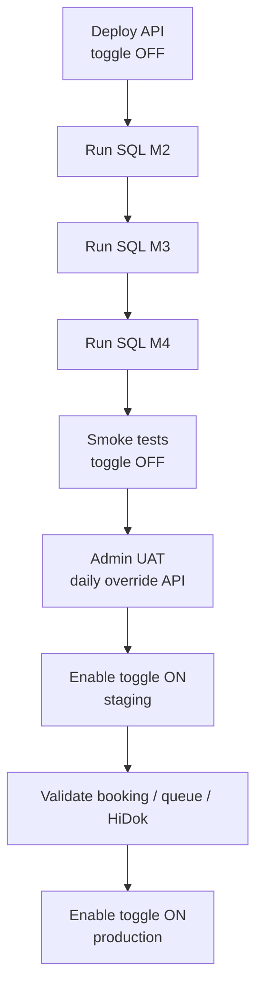

# jadwal-praktek-harian-deployment-manual.md — Deployment & Operations

> **Canonical location:** `docs/contexts/admisi-rajal/jadwal-praktek-harian-deployment-manual.md`  
> **Related:** [`jadwal-praktek-harian-architecture-analysis.md`](jadwal-praktek-harian-architecture-analysis.md) (design), [`adr/`](adr/) (decisions), [`jadwal-praktek-investigation-report.md`](jadwal-praktek-investigation-report.md) (baseline)

---

## PURPOSE

Operational guide for DBA, release engineer, and Admisi admin when deploying **Jadwal Praktek Harian** (daily doctor schedule) to staging or production.

This feature introduces:

- Runtime **effective schedule** resolution (`JadwalPraktekEffective`) — never persisted
- Daily override/cancel persistence (`BILRG_JadwalPraktekHarian`)
- Nullable schedule lineage on booking and antrian map
- HiDok-facing **Effective Schedule API** (additive)
- Internal admin API for daily schedule management

**Safe default:** feature toggle `EnableDailyScheduleResolver` is **OFF** after deploy. Legacy `DayOfWeek` template behaviour remains until toggle is enabled deliberately.

---

## SCOPE

| In scope (M1–M4) | Out of scope (deferred) |
|------------------|-------------------------|
| `IJadwalPraktekResolver` + feature toggle | `BILRG_JadwalLibur` holiday master |
| `BILRG_JadwalPraktekHarian` table + admin API | Nightly GENERATED batch (M5) |
| Booking schedule ID columns | Template audit columns |
| HiDok Effective Schedule API | Move-existing-bookings workflow |
| Queue/report resolver migration | Booking auto-migration on replacement doctor |

---

## PREREQUISITES

| Item | Requirement |
|------|-------------|
| Application build | `Bilreg.Api` includes JadwalPraktekHarian controllers and resolver DI |
| SQL access | DBA can run scripts under `Bilreg.SqlDb/` on target database |
| Master data | `td_peg`, `ta_layanan`, `Hidok_ruang`, template `BILRG_JadwalPraktek` unchanged |
| HiDok integration | HiDok continues using existing booking endpoint; Effective API is **additive** |
| ID generation | `JadwalPraktekHarianId` uses `NunaId.New("JPH")` — **no sequencer row** required |

---

## DATABASE MIGRATION ORDER

Run scripts **in order** on the target database. Each step is idempotent where noted.

### Step 1 — M2: Daily schedule table

| Order | Script | Purpose |
|-------|--------|---------|
| 1a | `Bilreg.SqlDb/AdmisiContext/BookingFeature/BILRG_JadwalPraktekHarian.sql` | Create `BILRG_JadwalPraktekHarian` |
| 1b | `Bilreg.SqlDb/AdmisiContext/BookingFeature/BILRG_JadwalPraktekHarian_M2_Indexes.sql` | Unique ACTIVE key + lookup indexes |

**Rollback:** `BILRG_JadwalPraktekHarian_M2_Rollback.sql`

### Step 2 — M3: Booking schedule references

| Order | Script | Purpose |
|-------|--------|---------|
| 2a | `Bilreg.SqlDb/AdmisiContext/BookingFeature/BILRG_Booking_M3_ScheduleIds_Alter.sql` | Add nullable `JadwalPraktekId`, `JadwalPraktekHarianId` |

Columns are nullable; **no backfill** required. Existing bookings keep NULL IDs; delete workflow uses resolver fallback when toggle is ON.

**Rollback:** `BILRG_Booking_M3_ScheduleIds_Rollback.sql`

### Step 3 — M4: Antrian map daily reference

| Order | Script | Purpose |
|-------|--------|---------|
| 3a | `Bilreg.SqlDb/AdmisiContext/AntrianFeature/ta_no_antrian_map_hdr_M4_JadwalHarian_Alter.sql` | Add nullable `fs_kd_jadwal_harian` |

**Rollback:** `Bilreg.SqlDb/AdmisiContext/AntrianFeature/ta_no_antrian_map_hdr_M4_Rollback.sql`

### Post-migration verification (SQL)

```sql
-- M2
SELECT COUNT(*) FROM INFORMATION_SCHEMA.TABLES
 WHERE TABLE_NAME = 'BILRG_JadwalPraktekHarian';

-- M3
SELECT COLUMN_NAME FROM INFORMATION_SCHEMA.COLUMNS
 WHERE TABLE_NAME = 'BILRG_Booking'
   AND COLUMN_NAME IN ('JadwalPraktekId', 'JadwalPraktekHarianId');

-- M4
SELECT COLUMN_NAME FROM INFORMATION_SCHEMA.COLUMNS
 WHERE TABLE_NAME = 'ta_no_antrian_map_hdr'
   AND COLUMN_NAME = 'fs_kd_jadwal_harian';
```

---

## APPLICATION DEPLOYMENT

### 1. Deploy application binaries

Standard `Bilreg.Api` release. No separate service or worker.

### 2. Configuration (`appsettings.json` or environment override)

```json
"JadwalPraktek": {
  "EnableDailyScheduleResolver": false
}
```

| Setting | Staging recommendation | Production initial |
|---------|------------------------|-------------------|
| `EnableDailyScheduleResolver` | `false` until SQL + smoke tests pass | `false` until UAT sign-off |

Environment variable equivalent (if used): bind `JadwalPraktek__EnableDailyScheduleResolver`.

### 3. Restart API

Recycle IIS / restart container after config change. Toggle takes effect **without redeploy**.

---

## ROLLOUT PROCEDURE



### Phase A — Schema only (toggle OFF)

1. Deploy application with `EnableDailyScheduleResolver: false`.
2. Run SQL steps 1–3.
3. Confirm legacy booking, walk-in, and queue behaviour unchanged.

### Phase B — Admin validation (toggle OFF)

Internal admin can use daily schedule API to create test rows; resolver is **not** consumed by operational flows while toggle is OFF.

| Action | Endpoint |
|--------|----------|
| List daily rows | `GET api/JadwalPraktekHarian/{tglPraktek}?dokterId=` |
| Save override / new daily | `POST api/JadwalPraktekHarian/save` |
| Cancel day/session | `POST api/JadwalPraktekHarian/cancel` |

### Phase C — Resolver enabled (toggle ON)

1. Set `EnableDailyScheduleResolver: true` on **staging**.
2. Run validation checklist (below).
3. After sign-off, enable on production during a low-traffic window.

---

## API SURFACE

### Internal admin — daily schedule

| Method | Route | Audience |
|--------|-------|----------|
| GET | `api/JadwalPraktekHarian/{tglPraktek}` | Internal admin |
| POST | `api/JadwalPraktekHarian/save` | Internal admin |
| POST | `api/JadwalPraktekHarian/cancel` | Internal admin |

**HiDok must not** call these endpoints.

### HiDok / ops — effective schedule (additive)

| Method | Route | Response notes |
|--------|-------|----------------|
| GET | `api/JadwalPraktekEffective/{dokterId}/{tglYmd}` | List ACTIVE sessions; includes `AvailableQuota` |
| GET | `api/JadwalPraktekEffective/{dokterId}/{tglYmd}/{jamMulai}` | Single session |

Response **excludes** internal fields: `JadwalPraktekId`, `JadwalPraktekHarianId`, `Source`.

### Unchanged

| Surface | Notes |
|---------|-------|
| `GET/POST api/JadwalPraktek/*` | Template master — unchanged |
| HiDok booking create | Existing contract frozen; internal resolver upgrade only |

---

## OPERATIONAL VALIDATION CHECKLIST

Run after SQL deploy (toggle OFF) and again after enabling toggle ON.

### Toggle OFF (regression)

| # | Check | Expected |
|---|-------|----------|
| 1 | Create booking (internal) | Success; schedule from template `DayOfWeek` |
| 2 | HiDok booking create | Unchanged response contract |
| 3 | Walk-in registrasi | Queue created as before |
| 4 | Queue header list | `GET api/Antrian/...` returns expected dokter/jam |
| 5 | Praktek dokter report | Period report matches pre-deploy baseline |

### Toggle ON (new behaviour)

| # | Check | Expected |
|---|-------|----------|
| 6 | Manual daily override via admin API | Row in `BILRG_JadwalPraktekHarian`; `Source = MANUAL` |
| 7 | Booking on overridden day | `JadwalPraktekHarianId` populated on new booking |
| 8 | Cancelled day | Booking rejected; not in Effective API list |
| 9 | HiDok Effective API | Returns overridden jam/layanan; no internal IDs |
| 10 | Override with existing booking | Save rejected (override guard) |
| 11 | Replacement doctor | Separate queue; no auto-migration of existing bookings |
| 12 | Delete booking | Uses stored schedule IDs when present |

### Automated tests (CI / local)

```bash
dotnet test Bilreg.Test/Bilreg.Test.csproj --filter "FullyQualifiedName~JadwalPraktek"
```

Integration DAL tests for `BILRG_JadwalPraktekHarian` are skipped until the table exists in the test database.

---

## ROLLBACK

### Immediate behavioural rollback (no code deploy)

Set `EnableDailyScheduleResolver: false` and restart API.

- Operational handlers revert to legacy `DayOfWeek` template lookup.
- Daily rows remain in DB but are ignored.
- Nullable booking/map columns are safe to leave in place.

### Schema rollback (only if feature is abandoned)

Run rollback scripts **in reverse order**:

1. `ta_no_antrian_map_hdr_M4_Rollback.sql`
2. `BILRG_Booking_M3_ScheduleIds_Rollback.sql`
3. `BILRG_JadwalPraktekHarian_M2_Rollback.sql`

**Warning:** Dropping `BILRG_JadwalPraktekHarian` destroys all manual daily overrides. Export data first if overrides were created in production.

---

## TROUBLESHOOTING

| Symptom | Likely cause | Action |
|---------|--------------|--------|
| `Invalid object name 'BILRG_JadwalPraktekHarian'` | M2 SQL not run | Execute Step 1 scripts |
| Daily save returns 500 on insert | M2 table missing or column mismatch | Verify table DDL; check DAL `SqlDbType` compatibility |
| Toggle ON but behaviour unchanged | Config not loaded / wrong environment | Verify `JadwalPraktek:EnableDailyScheduleResolver` in active config |
| Override save blocked | Active booking or antrian on slot | Expected (ADR-002 / override guard); cancel bookings first or use different slot |
| HiDok sees template time after override | Toggle OFF or wrong date/dokter/jam | Enable toggle; confirm `JamMulai` in Effective GET |
| Duplicate daily row error | Unique index `UX_BILRG_JPH_Tgl_Dokter_Jam` | Update existing ACTIVE row instead of insert |
| Queue mismatch after replacement doctor | Approved design — new queue | Do not expect merged antrian; see ADR-003 |
| `fs_kd_jadwal_harian` errors on antrian map | M4 SQL not run | Execute Step 3 script |

---

## KEY INVARIANTS (do not violate in ops)

1. `JadwalPraktekEffective` is **runtime only** — never insert into a table.
2. `Source = MANUAL` daily rows are **independent** from template edits.
3. HiDok uses **Effective Schedule API** only — not `JadwalPraktekHarian` admin routes.
4. `fs_kd_jadwal` on antrian map = template lineage; `fs_kd_jadwal_harian` = execution reference.
5. Synthetic walk-in schedules are **never persisted**.

---

## REFERENCES

| Document | Purpose |
|----------|---------|
| [`jadwal-praktek-harian-architecture-analysis.md`](jadwal-praktek-harian-architecture-analysis.md) | Full design and milestone acceptance |
| [`adr/ADR-001-runtime-effective-schedule.md`](adr/ADR-001-runtime-effective-schedule.md) | Resolver authority |
| [`adr/ADR-002-manual-override-independence.md`](adr/ADR-002-manual-override-independence.md) | Manual daily independence |
| [`adr/ADR-003-booking-schedule-references.md`](adr/ADR-003-booking-schedule-references.md) | Dual nullable booking IDs |
