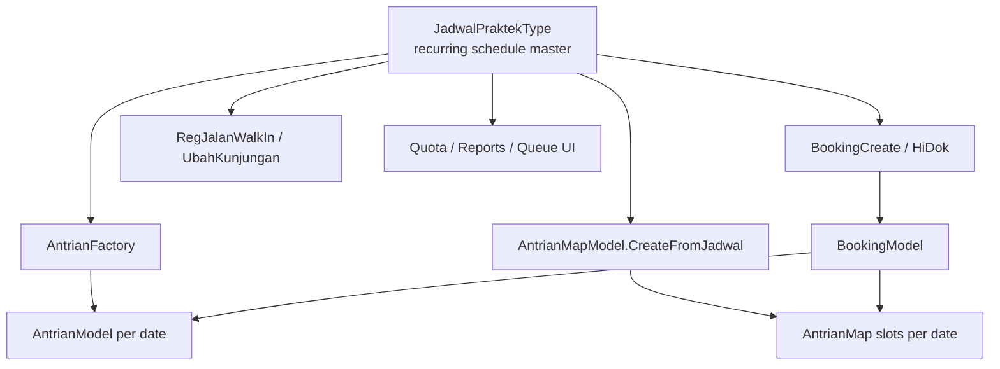

# JadwalPraktek Investigation Report

**Audit date:** 2026-06-23  
**Implementation scope:** `Bilreg.Domain/AdmisiContext/BookingFeature/JadwalPraktekType.cs` and all consumers across Domain, Application, Infrastructure, and API layers  
**Out of scope:** Frontend UI, legacy `JadwalFo` source schema (except migration path)

---

## Executive Summary

`JadwalPraktekType` is the **recurring doctor practice schedule** in the Admisi booking/queue bounded context. It defines which doctor practices on which day, at what time, in which room and service, how many patients are allowed, and how queue slots are patterned.

The entity is **master data**: it is written only through explicit schedule-administration commands. Patient-facing flows (booking, walk-in registration, queue assignment) **read** jadwal but never mutate it.

Persistence table: `BILRG_JadwalPraktek`.

---

## 1. Entity Definition

**Source:** `Bilreg.Domain/AdmisiContext/BookingFeature/JadwalPraktekType.cs`

| Property | Type | Meaning |
|----------|------|---------|
| `JadwalPraktekId` | `string` | Primary key (e.g. `JADW001`) |
| `Dokter` | `PpaReff` | Doctor / medical staff |
| `Layanan` | `LayananReff` | Service / clinic |
| `LayananDk` | `LayananDkReff` | Service category (denormalized on read) |
| `GroupSpesialis` | `GroupSpesialisType` | Specialty group (denormalized on read) |
| `Ruang` | `RuangType` | Room and antrian prefix |
| `Hari` | `DayOfWeek` | Day of week the schedule recurs |
| `JamMulai` | `TimeOnly` | Practice start time |
| `JamSelesai` | `TimeOnly` | Practice end time |
| `MaxPasien` | `int` | Maximum patients per session |
| `AntrianPattern` | `AntrianPatternType` | Queue slot pattern (`FLAG` vs `AUTO`, reserved counts, pattern items) |

**Supporting types:**

- `IJadwalPraktekKey` — key interface (`JadwalPraktekId` only)
- `JadwalPraktekType.Default` — sentinel with id `"-"` for not-found / placeholder
- `JadwalPraktekType.Key(string id)` — lightweight key factory

The type is an **immutable `record`**; all changes produce a new instance and persist via `IJadwalPraktekRepo.SaveChanges`.

---

## 2. Persistence

**Repository:** `Bilreg.Infrastructure/AdmisiContext/BookingFeature/JadwalPraktekRepo.cs`  
**DAL:** `Bilreg.Infrastructure/AdmisiContext/BookingFeature/JadwalPraktekDal.cs`  
**DTO mapping:** `Bilreg.Infrastructure/AdmisiContext/BookingFeature/JadwalPraktekDto.cs`

### Table: `BILRG_JadwalPraktek`

| Column | Written on save |
|--------|-----------------|
| `JadwalPraktekId` | Insert only (key) |
| `DokterId` | Yes |
| `LayananId` | Yes |
| `RuangId` | Yes |
| `Hari` | Yes (stored as `int`) |
| `JamMulai` | Yes (`varchar`, `HH:mm`) |
| `JamSelesai` | Yes (`varchar`, `HH:mm`) |
| `MaxPasien` | Yes |
| `AntrianPattern` | Yes (JSON string) |

List/get queries join `td_peg`, `ta_layanan`, `ta_layanan_dk`, `td_peg2`, `BILRG_GroupSpesialis`, and `Hidok_ruang` to hydrate display names and denormalized references.

### Repository operations

| Method | Behavior |
|--------|----------|
| `SaveChanges` | Insert if key not found; otherwise Update |
| `LoadEntity` | Single row by `JadwalPraktekId` |
| `DeleteEntity` | Delete by key |
| `ListData()` | All schedules |
| `ListData(IPpaKey)` | By doctor |
| `ListData(ILayananKey)` | By service |
| `ListData(ILayananDkKey)` | By service category |
| `ListData(IGroupSpesialisKey)` | By specialty group |
| `Migrasi()` | Delete all rows; bulk insert from legacy `JadwalFo` |

---

## 3. Use Cases That Consume JadwalPraktekType

### 3.1 Master schedule administration (read + write)

**API:** `Bilreg.Api/Controllers/AdmisiContext/BookingFeature/JadwalPraktekController.cs`

| HTTP | Route | Handler | Role |
|------|-------|---------|------|
| `GET` | `api/JadwalPraktek/{dokterId}` | `JadwalPraktekListQuery` | List by doctor |
| `GET` | `api/JadwalPraktek/layanan/{layananId}` | `JadwalPraktekListByLayananQuery` | List by service |
| `GET` | `api/JadwalPraktek/layananDk/{layananDkId}` | `JadwalPraktekListByLayananDkQuery` | List by service category |
| `GET` | `api/JadwalPraktek/search/{keyword}` | `JadwalPraktekSearchQuery` | Search |
| `POST` | `api/JadwalPraktek/save` | `JadwalPraktekSaveCmd` | Create or update |
| `DELETE` | `api/JadwalPraktek/delete` | `JadwalPraktekDeleteCmd` | Delete |
| `POST` | `api/JadwalPraktek/migrasi` | `JadwalPraktekMigrasiCmd` | Legacy bulk import |

### 3.2 Booking (patient appointment)

| Handler | How jadwal is resolved |
|---------|------------------------|
| `BookingCreateCmd` | `ListData(dokter)` → match `Hari` + `JamMulai` on visit date |
| `BookingCreateFromHidokCommand` | Same, doctor found by email contact |

Resolution failure throws `"Jadwal tidak ditemukan"`.

**Downstream use after resolve:**

1. `BookingModel.CreateLocal` / `CreateFromExternal` — copies doctor, layanan, `JamMulai`; validates visit date day-of-week matches `jadwal.Hari`
2. `AntrianFactory.Create(tgl, jadwal)` — creates or reuses daily queue header
3. `AntrianMapWithBookingResolver.Resolve(jadwal, tgl, booking, pasien)` — seeds/fills slot map

### 3.3 Queue (Antrian) header

`AntrianFactory.Create(DateOnly, JadwalPraktekType)`:

- Validates `antrianDate.DayOfWeek == jadwal.Hari`
- Sets queue window from `jadwal.JamMulai` / `jadwal.JamSelesai`
- Builds `sequenceTag` via `AntrianModel.GenSequenceTag(tgl, jadwal)`:

```text
AN{yyMMdd}{JamMulai:HHmm}_{Dokter.PpaId}
```

(spaces in `PpaId` replaced with `$`)

### 3.4 Antrian slot map (AntrianMap)

`AntrianMapModel.CreateFromJadwal(jadwal, tgl)` copies:

- `JadwalPraktekId`, doctor, layanan
- `JamMulai` as both `JamJadwal` and `JamPraktek`
- `AntrianPattern`, `MaxPasien`

`AntrianMapModel.SeedingMap()` branches on `AntrianPattern.Tipe`:

- `"FLAG"` → `SeedingMapFlag()` (pattern items define UMUM/BPJS/etc. slots)
- otherwise → `SeedingMapAuto()` (`MaxPasien` homogeneous AUTO slots)

Used by:

- `AntrianMapWithBookingResolver` (booking flow)
- `AntrianMapWithRegResolver` (walk-in registration flow)
- `IAntrianMapHdrRepo.Find` / `ListDetil` (lookup by jadwal + date)

### 3.5 Walk-in registration and visit change

| Handler | Resolve logic |
|---------|---------------|
| `RegJalanWalkInCommand` | `ResolveJadwalPraktek(dokter, jamPraktek, tgl)` |
| `RegJalanUbahKunjunganCmd` | Same |

Resolution rules:

| Schedules on that weekday | Result |
|---------------------------|--------|
| Exactly 1 | Use it |
| More than 1 | Match by `JamMulai == jamPraktek`; throw if no match |
| None | Synthetic `JadwalPraktekType.Default with { Dokter, Hari, JamMulai=00:00, JamSelesai=23:59 }` |

### 3.6 Quota / availability

`AntrianGetQuotaQuery` (`AntrianGetLastNumberQuery.cs`):

- Loads jadwal for doctor on visit date's `DayOfWeek`
- Returns `Quota = jadwal.MaxPasien`, `Used = antrian.ListEntry.Count()`, `AvailableQuota = MaxPasien - Used`

### 3.7 Reporting and queue UI

| Handler | Use of jadwal |
|---------|---------------|
| `PraktekDokterPeriodeDokterListQuery` | Join date range × doctor jadwal × antrian counts |
| `PraktekDokterPeriodeGroupSpesialisListQuery` | Same, filtered by specialty group |
| `QueListAntrianHeaderQuery` | Match today's antrian headers with jadwal for that weekday |
| `QuePasienListQuery` | Jadwal repo for queue context |
| `DeleteBookingWorkflow` | `CekAntrianMap(jadwal, tgl)` on booking cancellation |

---

## 4. Data Flow



**Key invariant:** Jadwal is a **weekly template**. Runtime flows combine `jadwal` + a concrete `DateOnly` to produce per-day antrian and slot maps.

---

## 5. When JadwalPraktekType Is Updated

Only through `IJadwalPraktekRepo` write paths. Patient flows never call `SaveChanges` on jadwal.

### 5.1 Create / update — `JadwalPraktekSaveCmd`

**Handler:** `Bilreg.Application/AdmisiContext/BookingFeature/JadwalPraktekSaveCmd.cs`  
**API:** `POST api/JadwalPraktek/save`

| Step | Behavior |
|------|----------|
| Validate | Doctor, layanan, ruang exist; `MaxPasien > 0`; valid `Hari`; `JamMulai < JamSelesai`; `HH:mm` format |
| Load existing | `LoadEntity(request)` → `Default` (id `"-"`) if not found |
| Branch | Not found → `CreateNewJadwal` via `JadwalPraktekFactory`; found → `UpdateJadwal` |
| Overlap check | Same doctor + same `Hari` + overlapping time window → throw `"Jadwal beririsan"` |
| Persist | `_jadwalRepo.SaveChanges(jadwal)` |

**New ID generation** (`JadwalPraktekFactory.Create`):

```text
sequencer "BILRG_JadwalPraktek" → JADW{nnn:D3}
```

**Fields updated on save:** `DokterId`, `LayananId`, `RuangId`, `Hari`, `JamMulai`, `JamSelesai`, `MaxPasien`, `AntrianPattern`.

**Note:** `JadwalPraktekCreateCmd` exists but is fully commented out; create and update are unified in `JadwalPraktekSaveCmd` (upsert by ID presence in DB).

### 5.2 Delete — `JadwalPraktekDeleteCmd`

**API:** `DELETE api/JadwalPraktek/delete`  
Deletes row by `JadwalPraktekId`. Loads entity first (for validation) but does not block delete if missing.

### 5.3 Migration — `JadwalPraktekMigrasiCmd`

**API:** `POST api/JadwalPraktek/migrasi`  
`JadwalPraktekRepo.Migrasi()`:

1. `DELETE FROM BILRG_JadwalPraktek` (all rows)
2. Insert all rows from legacy `JadwalFo` via `IJadwalFoDal`

One-off / admin operation; not part of normal patient or booking workflow.

### 5.4 What does NOT update jadwal

| Flow | Interaction |
|------|-------------|
| `BookingCreateCmd` | Read only |
| `BookingCreateFromHidokCommand` | Read only |
| `RegJalanWalkInCommand` | Read only (or synthetic default, not persisted) |
| `RegJalanUbahKunjunganCmd` | Read only (or synthetic default, not persisted) |
| `AntrianMapWithBookingResolver` | Read only |
| `AntrianGetQuotaQuery` | Read only |
| `DeleteBookingWorkflow` | Read only |

---

## 6. Implementation Notes

### 6.1 Factory vs update path inconsistency

`JadwalPraktekFactory.Create` sets:

- `LayananDk` → `LayananDkType.Default`
- `GroupSpesialis` → `GroupSpesialisType.Default`

`UpdateJadwal` in `JadwalPraktekSaveCmd` correctly sets:

- `LayananDk` from `layanan.LayananDk`
- `GroupSpesialis` from `dokter.GroupSpesialis`

On read, both fields are hydrated from SQL joins regardless. New inserts may have placeholder domain values until first update or until loaded from DB.

### 6.2 Synthetic jadwal on walk-in

When no schedule exists for a doctor on a given weekday, walk-in registration uses an in-memory default jadwal (`00:00`–`23:59`). This is **not persisted** and bypasses normal schedule constraints.

### 6.3 AntrianPattern impact

Changes to `AntrianPattern` or `MaxPasien` affect **future** `AntrianMapModel.SeedingMap()` calls for dates that have not yet been seeded. Already-persisted antrian maps for past/future dates are not automatically rebuilt when jadwal is updated.

---

## 7. Code Reference Index

| Layer | Path |
|-------|------|
| Domain entity | `Bilreg.Domain/AdmisiContext/BookingFeature/JadwalPraktekType.cs` |
| Domain factory | `Bilreg.Domain/AdmisiContext/BookingFeature/JadwalPraktekFactory.cs` |
| Repo interface | `Bilreg.Application/AdmisiContext/BookingFeature/IJadwalPraktekRepo.cs` |
| Repo impl | `Bilreg.Infrastructure/AdmisiContext/BookingFeature/JadwalPraktekRepo.cs` |
| DAL | `Bilreg.Infrastructure/AdmisiContext/BookingFeature/JadwalPraktekDal.cs` |
| Save command | `Bilreg.Application/AdmisiContext/BookingFeature/JadwalPraktekSaveCmd.cs` |
| Delete command | `Bilreg.Application/AdmisiContext/BookingFeature/JadwalPraktekDeleteCmd.cs` |
| Migration command | `Bilreg.Application/AdmisiContext/BookingFeature/JadwalPraktekMigrasiCmd.cs` |
| API controller | `Bilreg.Api/Controllers/AdmisiContext/BookingFeature/JadwalPraktekController.cs` |
| Booking consumer | `Bilreg.Application/AdmisiContext/BookingFeature/UseCases/BookingCreateCmd.cs` |
| Antrian factory | `Bilreg.Domain/AdmisiContext/AntrianFeature/AntrianFactory.cs` |
| Antrian map | `Bilreg.Domain/AdmisiContext/AntrianFeature/AntrianMapModel.cs` |
| Walk-in consumer | `Bilreg.Application/AdmisiContext/RegFeature/UseCases/RegJalanWalkInCommand.cs` |

---

## 8. Summary Table

| Aspect | Detail |
|--------|--------|
| **Business role** | Recurring doctor practice schedule template |
| **Persistence** | `BILRG_JadwalPraktek` |
| **Write paths** | `JadwalPraktekSaveCmd`, `JadwalPraktekDeleteCmd`, `JadwalPraktekMigrasiCmd` |
| **Read consumers** | Booking, antrian, antrian map, walk-in reg, quota, queue UI, period reports |
| **Mutated by patient flows** | No |
| **Identity** | `JadwalPraktekId` (`JADW###` on create) |
