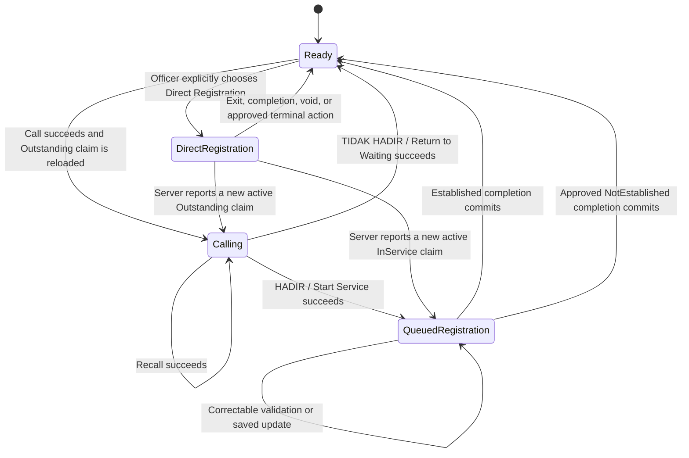

# Feasibility Analysis — Admisi Rajal Admission Officer Workspace Modes

**Date:** 2026-07-27  
**Scope:** `c012_myhospital_web`, `b09-bilreg-api`, and the admission Queue Display/Kiosk repository  
**Nature of work:** Repository analysis only; no application implementation  
**Target screen:** `c012_myhospital_web/src/modules/Admisi/views/RegistrasiRajal.vue`

## 1. Executive conclusion

Refactoring the Admisi Rajal officer workspace into the four proposed actor-centric modes is
feasible, but the modes should be treated as a **workspace interaction model**, not as four new
backend queue states.

The first three modes already have authoritative backend equivalents:

| Proposed workspace mode | Existing authoritative condition | Feasibility |
|---|---|---|
| Ready | No active claim for the configured Loket | High; mostly an explicit frontend model |
| Calling | Queue Entry `Waiting` + current-Loket claim `Outstanding` | High; backend and frontend operations already exist |
| Queued Registration | Queue Entry `InService` + current-Loket claim `InService` | High; editing, reload/resume, and atomic completion already exist |
| Direct Registration | No active queue claim + locally selected direct-registration intent | Conditional; the form exists, but true queue-less persistence semantics are unresolved |

The recommended architecture is therefore:

1. derive Ready, Calling, and Queued Registration from server-owned current-Loket and worklist
   projections;
2. represent Direct Registration as an explicit local workspace intent that is permitted only
   when the server reports no active Loket claim;
3. keep transient UI states such as starting, saving, completing, conflict, and dirty-form
   confirmation as subordinate session states rather than promoting them to business modes; and
4. never persist a duplicate frontend queue/workspace ledger.

The business clarification about **`TIDAK HADIR` is fully compatible with the implemented
`return-to-waiting` transition**:

- it releases only the matching `Outstanding` claim;
- the Queue Entry remains `Waiting`;
- the Queue Label, CallCount, Priority, and history remain;
- no reason is requested;
- no Registration Outcome is created; and
- the entry can be called again.

It must not invoke the existing `no-show` route. That route is terminal: it changes the Queue Entry
to `Withdrawn` with reason `NoShow`.

The repository does **not** currently contain a complete queue/session-closing workflow. It has
per-entry terminal `withdraw` and `no-show` commands, and the canonical SOP assigns final
disposition to Queue Operations supervision, but there is no implemented supervisor batch review,
Queue Session close state, end-of-day command, or officer UI. A separate, explicit closing process
is the appropriate design; it must not infer final outcomes from elapsed time or CallCount.

The largest unresolved issue is Direct Registration. The frontend's legacy registration workspace
already supports new Walk-In registration, opening an existing Registration, updates, and voiding.
However, when a new Registration is submitted without Admission Queue context, the backend
compatibility path currently creates an admission Queue Entry, immediately serves and completes it,
and records an `Established` Registration Outcome. Therefore, it is queue-less only from the
operator's perspective, not from persistence or reporting. Product and domain owners must decide
whether that behavior is acceptable before Direct Registration is called “without a queue number.”

## 2. Investigation scope and evidence baseline

### 2.1 Repositories inspected

- `c012_myhospital_web`: officer workspace, Registration editor, API clients, unit tests, SOP,
  roadmap, implementation summaries, and changelog.
- `b09-bilreg-api`: canonical Admisi Rajal and Patient Tracker artifacts, queue state and claim
  persistence, v1 API, Registration orchestration, outcome persistence, SQL migrations, unit/API
  tests, and real-SQL gates.
- `c013-kiosk-queue-display-web`: display snapshot, polling, SignalR refresh hints, and
  AnnouncementVersion behavior relevant to repeated Call/Recall.

### 2.2 Current worktree qualification

The frontend repository has uncommitted changes in the exact files under investigation:

- `useOfficerAdmissionQueue.ts`
- `admissionQueueActionRules.ts`
- `RegistrasiRajal.vue`
- the action-rule tests
- workstation setup UI/configuration

Those local edits add a fail-closed “current Loket availability is known” check and disable a new
Call when a current Loket session exists. They are useful evidence of an identified gap, but they
must not be treated as part of the last committed baseline until reviewed and committed.

The backend repository was clean at inspection time. The Queue Display repository's Git status was
not changed or required for this analysis.

### 2.3 Verification qualification

Repository implementation summaries report successful focused frontend, backend, API, type-check,
and build runs for phases 3–9. Real-SQL verification is explicitly environment-gated through
`BILREG_AQ_IT_*`.

A focused frontend Vitest run was attempted during this investigation:

- the first invocation used a CLI option no longer supported by the installed Vitest 4;
- the corrected invocation started but produced no completed results before the 60-second sandbox
  timeout.

Consequently, this report does not claim a new independent green test run. It distinguishes
source/test presence from executed environment proof.

## 3. Current implementation

## 3.1 Queue truth and claim truth are separate

The backend intentionally uses two related state dimensions:

1. `BILRG_AntrianEntry.AntrianStatus`
   - `Waiting`
   - `InService`
   - `Done`
   - `Withdrawn`
2. `BILRG_AdmLoketCurrentCall.ClaimState`
   - `Released`
   - `Outstanding`
   - `InService`

Call and Recall leave the Queue Entry `Waiting`; the active claim distinguishes an uncalled waiting
entry from a called one. Start Service changes both dimensions to `InService`.

This separation is exactly what the proposed Ready/Calling/Queued Registration model needs.

## 3.2 Current frontend modes

`useRegistrationAssistanceSession.ts` currently exposes:

- `legacy-editable`
- `empty`
- `preview`
- `starting`
- `processing`
- `saving`
- `completing`
- `conflict`

These values combine stable workspace modes with transient UI states. The route component does not
currently expose a single actor-centric mode.

The effective behavior is:

| Current condition | Left side | Right side |
|---|---|---|
| No selected queue entry | Worklist active | Empty/read-only guidance |
| Selected Waiting entry | Worklist active | Read-only Preview |
| Current claim Outstanding | Current Loket Session shows Recall and Return to Waiting; worklist remains navigable | Selected item may show Preview and Start Processing |
| Matching entry InService | Current session shows Resume Processing; worklist remains mounted | Editor appears only after Start or explicit Resume |
| Saving/completing | Worklist remains mounted; mutations are guarded | Editor remains mounted with pending state |

The current frontend therefore implements the required permissions more strongly than it implements
the proposed visual modes.

## 3.3 Queue actions

The current routes and transitions are:

| Action | Queue Entry | Claim | Announcement | Final? |
|---|---|---|---|---|
| Call | remains `Waiting`; CallCount +1 | `Outstanding` | version +1 | No |
| Recall | remains `Waiting`; CallCount +1 | remains `Outstanding` | version +1 | No |
| Return to Waiting | remains `Waiting` | `Released`/inactive | no new announcement | No |
| Start Service | `InService` | `InService` | no Call announcement | No |
| Established | `Done` | released | refresh only | Yes, Registration Outcome |
| NotEstablished | `Done` | released | refresh only | Yes, Registration Outcome |
| Withdraw | `Withdrawn` | released if active | refresh only | Yes, queue participation |
| No-Show | `Withdrawn`, reason `NoShow` | released | refresh only | Yes, queue participation |

## 3.4 Registration completion

There are two queue-linked completion paths:

- New Booking/Walk-In Registration carries `(AntrianId, NoUrut, ExpectedRowVersion)`. The backend
  establishes Registration, associates/creates the Patient Tracker as applicable, writes the
  immutable `Established` outcome, marks the Queue Entry `Done`, and releases the matching
  InService claim inside one transaction.
- An already-existing Registration is completed with the explicit
  `outcomes/established` endpoint, also guarded by the matching InService claim and RowVersion.

Correctable validation errors do not create an outcome and leave the session InService.

The frontend has a typed `NotEstablished` client mutation, but no enabled operator action because
the operational ReasonCode catalog is not approved/configured.

Registration voiding is not a substitute for queue completion. The current void command is a
Registration operation requiring a reason. It does not itself express whether the queue-assisted
work concluded as Established, NotEstablished, or another approved terminal disposition.

## 3.5 Workspace restoration

The current restoration model is partially strong:

- workstation selection is stored locally and re-resolved by the server;
- the current-Loket display row is persisted and is authoritative after reload;
- a separate current-Loket worklist query retrieves the active item independently of the visible
  filter and main page;
- an InService session can be reopened with Resume Processing.

Gaps remain:

- reload during Calling restores the pinned current session, but not necessarily the selected
  Preview/right-panel context;
- reload during InService requires explicit Resume rather than immediately presenting the
  actor-centric Queued Registration mode;
- unsaved form drafts are deliberately not persisted;
- Direct Registration has no mode or restoration contract;
- current-display reads do not use the same periodic polling interval as the main worklist, so
  another browser/tab using the same workstation identity can leave local current-session state
  stale until an explicit invalidation/refetch.

## 3.6 Concurrency and ownership

Persistence provides:

- primary-key uniqueness per Loket current-call row;
- a filtered unique index allowing one active Loket claim per Queue Entry;
- one active claim per Loket by the current-call row state;
- RowVersion compare-and-set for Recall, Return to Waiting, Start Service, and completion;
- transaction-scoped queue/claim/outcome coordination; and
- HTTP `409 AQ_CONCURRENCY_CONFLICT` recovery contracts.

Ownership is currently **Loket/workstation ownership**, not exclusive staff-user ownership:

- the server resolves the Loket from workstation configuration/headers;
- `UserId` still comes from request payload under an accepted identity deferral;
- multiple browser tabs on the same physical workstation are not separate server-side owners.

Direct Registration would have no server claim at all unless a new workspace/activity lease were
introduced. A local Direct mode can prevent actions in one browser, but cannot reserve the Loket
against another tab or process.

## 4. Proposed actor-centric state machine

The stable workspace state should be projected as follows:



The last two transitions are fail-safe recovery rules. Server authority must win over stale local
Direct intent.

### 4.1 Recommended mode projection

```text
if currentLoketClaim.state == Outstanding:
    Calling
else if currentLoketClaim.state == InService:
    QueuedRegistration
else if directRegistrationIntent is active:
    DirectRegistration
else:
    Ready
```

Do not store Ready, Calling, or Queued Registration as a new database enum. They are projections of
existing queue/claim truth.

Keep subordinate UI state separately:

```text
workspaceMode: Ready | Calling | QueuedRegistration | DirectRegistration
operationState: Idle | Starting | Saving | Completing | Conflict
draftState: Pristine | Dirty | GuardingTransition
```

This avoids invalid combinations such as treating `saving` as a fifth business workflow mode.

## 5. Mode-by-mode feasibility and required changes

## 5.1 Ready Mode

**Appropriate:** Yes.

Recommended meaning:

- no active Outstanding or InService claim exists for the configured Loket;
- the worklist and Call actions are available after current-Loket authority is known;
- queue selection may show a read-only Preview;
- Registration mutations are unavailable;
- Direct Registration may be entered explicitly.

Required changes:

- introduce one explicit derived `workspaceMode`;
- use the current-display query as a fail-closed prerequisite before enabling any Call;
- make the committed behavior match the existing uncommitted active-session guard;
- decide whether read-only Preview is allowed in Ready. The current design allows it and repository
  artifacts support it; “right panel read-only” should not mean “right panel unusable.”

## 5.2 Calling Mode

**Appropriate:** Yes.

Authoritative condition:

- Queue Entry remains `Waiting`;
- current-Loket claim is `Outstanding`.

Required UI alignment:

- pin and visually activate the called tile from the authoritative current session;
- prevent selection/Preview from making another tile look like the active work item;
- disable all new Call actions;
- optionally allow non-mutating inspection of other entries only if Product explicitly wants it;
- expose three actor actions for the active entry:
  - `PANGGIL LAGI` / Recall;
  - `TIDAK HADIR` mapped to Return to Waiting;
  - `HADIR` mapped to Start Service.

The user-described “three buttons on the tile” is feasible, but repository UX analysis previously
kept Start Processing apart from Call to reduce accidental service start. A good compromise is one
active-entry command region attached to the tile/session, with destructive or state-changing
actions visually separated and keyboard accessible. Product should approve the final placement.

`TIDAK HADIR` must use:

```text
POST entries/{q}/{n}/return-to-waiting
```

It must never use:

```text
POST entries/{q}/{n}/no-show
POST entries/{q}/{n}/outcomes/not-established
```

No new backend endpoint or database migration is needed for this mode.

## 5.3 Queued Registration Mode

**Appropriate:** Yes.

Authoritative condition:

- matching Queue Entry is `InService`;
- matching current-Loket claim is `InService`;
- current RowVersion is available.

Required UI alignment:

- visually disable or collapse the worklist while preserving the current-session identity;
- mount or resume the Registration editor automatically from authoritative context, or retain the
  existing explicit Resume action but still label the workspace mode clearly;
- keep dirty guards for selection, workstation, service point, navigation, reload, and mode exit;
- only exit to Ready after an authoritative terminal operation commits.

Important correction to the proposed wording:

- ordinary save/update actions do not necessarily end queue assistance;
- correctable errors must keep the entry InService;
- voiding a Registration is not automatically a queue outcome;
- only explicit Established or approved NotEstablished completion should release the claim and
  return the workspace to Ready.

The current backend already supports atomic new-Registration completion and explicit completion of
an existing Registration. No new endpoint is needed for Established. NotEstablished UI remains
blocked by the missing approved ReasonCode catalog.

## 5.4 Direct Registration Mode

**Appropriate:** Yes as an actor activity, but it is not yet a settled domain/persistence mode.

Frontend feasibility is high:

- reuse `LegacyRegistrationWorkspace` rather than create a second form;
- enter it from an explicit Ready-mode command;
- omit Admission Queue context;
- support the existing patient/Booking/Registration search and confirmation patterns;
- retain create, update, guarantee/SEP, visit-change, and permitted void operations;
- return to Ready through an explicit exit/complete flow with dirty-draft protection.

Backend semantics require a decision:

### Option A — UX-direct, compatibility persistence

Keep current backend behavior. A direct new Registration silently creates and immediately
completes an admission Queue Entry and Established outcome.

Advantages:

- lowest implementation risk;
- no Registration command changes;
- existing Patient Tracker evidence continues unchanged.

Disadvantages:

- it is not truly queue-less;
- consumes an admission queue sequence number;
- may distort queue volume/duration/outcome reporting;
- creates records for a queue interaction the actor and patient did not perform.

### Option B — True direct Registration

When no Admission Queue context is supplied, establish the Registration and Patient Tracker
evidence without creating an admission Queue Entry or Registration Outcome.

Advantages:

- matches “without a queue number” literally;
- cleaner operational queue metrics;
- preserves Registration Outcome as the result of Registration Assistance Queue Entries.

Disadvantages:

- changes a legacy compatibility contract;
- requires consumer inventory and regression testing;
- requires explicit origin/audit semantics for direct officer work;
- may affect integrations that assume every Registration creates a completed admission queue row.

### Recommendation

Prefer Option B for the target architecture, but do not implement it until:

1. Product confirms that direct officer registration is not queue participation;
2. reporting owners approve the changed denominator/history;
3. external/legacy consumers of create-on-registration queue entries are inventoried;
4. a stable `RegistrationOrigin` or equivalent audit field/value is approved; and
5. migrations or data interpretation rules are defined for historical synthetic entries.

If rapid rollout is needed, Option A may be used temporarily behind a separate Direct Mode feature
flag, but the UI and documentation must disclose that it is a compatibility path rather than claim
true queue-less persistence.

## 6. `TIDAK HADIR`, terminal No-Show, and Queue Session closing

## 6.1 Confirmed non-terminal behavior

The user's `TIDAK HADIR` meaning aligns with the current Return to Waiting implementation and phase
4 artifacts. It requires:

- current Loket;
- matching Outstanding claim;
- current RowVersion;
- one claim-only compare-and-set update;
- append-only `RETURN_TO_WAITING` / `UnansweredCall` audit evidence.

It requires no reason and creates no Registration Outcome.

## 6.2 Existing terminal mechanisms

The backend already exposes:

- `no-show`: terminal `Withdrawn` with fixed reason `NoShow`;
- `withdraw`: terminal `Withdrawn` with a supplied reason;
- `not-established`: terminal `Done` plus immutable Registration Outcome and required ReasonCode.

These represent different business facts and must remain separate.

## 6.3 Missing closing mechanism

No implemented artifact was found for:

- Queue Session status such as Open/Closing/Closed;
- end-of-day or shift-close command;
- supervisor review of remaining Waiting entries;
- bulk terminal disposition;
- reconciliation of active claims before closing; or
- closing UI and audit summary.

The canonical SOP says a supervisor chooses whether an unanswered entry remains Waiting or becomes
Withdrawn/No-Show. R-14 explicitly forbids automatic No-Show, queue aging, CallCount thresholds, and
automatic selection.

## 6.4 Recommended closing design

Introduce a separate Queue Operations Supervisor workflow, not an Admission Officer Calling-mode
button:

1. select Service Point and Business Date;
2. load authoritative remaining Waiting entries and active claims;
3. block closing while any entry is InService;
4. require explicit review of active Outstanding claims;
5. allow selected entries to remain open under an approved carry-forward policy or be terminally
   withdrawn under an approved closing reason;
6. write per-entry audit facts and one closing summary;
7. never create `NotEstablished` merely because the patient never presented; and
8. never infer a terminal result from CallCount or time.

Whether the final reason is `NoShow`, `SessionClosedUnpresented`, or another controlled value
requires Operations approval. If Queue Session closure must be a durable lifecycle rather than a
reporting operation, the queue header needs an explicit close-state/time/actor contract; it does not
currently have one.

## 7. Artifact reconciliation

| Artifact | Current evidence | Reconciliation |
|---|---|---|
| Admisi Rajal domain | Worklist composes Patient Tracker queue truth; NotEstablished is explicit and reasoned | Aligns with proposed projection; Direct Mode must not create a second queue ledger |
| Patient Tracker queue domain | Waiting → InService → Done, or Waiting → Withdrawn | Aligns; Calling is claim state, not Queue Entry status |
| Admission Queue SOP | Recall; supervisor chooses retain Waiting or terminal No-Show | Aligns with separate non-terminal `TIDAK HADIR` and closing decision |
| R-14 deferred policies | No automatic No-Show/aging/selection | Closing must be explicit, not scheduled inference |
| API v1 contract | Call, Recall, Return to Waiting, Start, Withdraw, No-Show, outcomes | Sufficient for modes 1–3; no Direct/close-session contract |
| High-density phases 3–9 | Preview, Return, Start/Resume, atomic completion, resolver, paging, rollout | Modes 1–3 are already substantially delivered |
| Old architecture reconciliation | Says officer client and enriched worklist are absent | Stale relative to current frontend and backend phase implementations |
| Frontend SOP/changelog | Documents Return to Waiting, Start/Resume, Complete Registration | Aligns with user clarification; does not define Direct Mode or session closing |
| Frontend roadmap | NotEstablished UI deferred pending reasons | Still accurate |
| Registration backend | No-context Registration creates a completed admission queue entry | Conflicts with literal “Direct Registration without queue number” |
| Queue Display repository | Snapshot-first, poll, AnnouncementVersion-gated audio | Supports repeated Call/Recall; no workspace-mode ownership |
| Authentication artifacts | Generic authenticated access and payload UserId were documented; display access has since changed in source | Security documentation needs a current pass before rollout |

## 8. Gap analysis

## 8.1 Functional gaps

| Gap | Severity | Notes |
|---|---:|---|
| No explicit four-mode workspace projection | Medium | Current permissions exist but are distributed across composables/components |
| Calling active tile and selected Preview can diverge | High UX risk | Current session is authoritative; selection is independent |
| Other tiles remain previewable during Calling/Processing | Product decision | Calls are server-blocked; full visual disabling is not implemented |
| Active-session Call guard is only uncommitted locally | High release risk | Backend remains safe, but released frontend can offer an action that will conflict |
| Direct Mode entry/exit does not exist in redesigned branch | High | Legacy editor is only mounted for authoritative queue Processing |
| Direct persistence is not truly queue-less | High domain/reporting risk | Current no-context create produces synthetic completed queue participation |
| No terminal NotEstablished UI/catalog | High for failure completion | Typed contract exists; operational reasons are missing |
| No session-closing workflow | High operational gap | Per-entry endpoints exist, but no close policy or supervisor surface |
| Void/update terminal semantics are ambiguous | Medium | Save/update should not automatically imply queue completion |

## 8.2 Restoration gaps

- Calling restores the current session but not a guaranteed right-panel active context.
- InService restores as a resumable session, not a single explicit workspace mode.
- Direct mode and direct draft have no restore contract.
- Same-workstation multi-tab changes can make current-display state stale.
- No server-side exclusive actor lease exists beyond the Loket queue claim.

## 8.3 API and persistence gaps

- No API change is required for Ready, Calling, or Queued Registration.
- True Direct Registration needs an explicit no-queue backend policy.
- Queue Session closing needs new application/API contracts if durable close or batch disposition is
  approved.
- NotEstablished needs an owned ReasonCode catalog endpoint/contract or another approved delivery
  mechanism.
- Current actor accountability relies on payload UserId and workstation mapping, not claims-derived
  identity.

## 8.4 Test gaps

Source tests cover action eligibility, Return to Waiting, Start/Resume, queue-linked completion,
API shape, and real-SQL races. Missing or environment-gated coverage includes:

- one end-to-end test for each proposed stable workspace mode;
- reload in Calling with active item automatically re-associated;
- reload/Resume in Queued Registration with dirty-guard expectations;
- Ready → Direct → exit/create/update/void;
- Direct Mode versus a concurrent Call from another tab/workstation;
- explicit proof that `TIDAK HADIR` never invokes No-Show or NotEstablished;
- queue closing review and partial-failure behavior;
- representative real-SQL execution in the designated disposable database;
- authenticated browser tests with real headers, display announcement, and concurrency conflicts.

## 9. Risks and design considerations

### 9.1 Domain vocabulary

Use **Ready** for the workspace and **Waiting** for a Queue Entry. Calling is not a new queue status;
it is Waiting plus an Outstanding claim. “Queued Registration” should be described as the
queue-originated Registration session, not as a new Registration status.

### 9.2 Mistaking selection for ownership

Selecting a tile is read-only Preview. Ownership starts only when Call succeeds. Editing starts only
when Start Service succeeds and the InService claim is reloaded.

### 9.3 Accidental terminal action

`TIDAK HADIR`, No-Show, Withdraw, NotEstablished, and Registration void are distinct. Labels,
authorization, confirmations, audit facts, and endpoints must not be shared casually.

### 9.4 Direct-mode exclusivity

A local Direct mode cannot reserve a Loket. If hospital policy requires “while this officer is doing
direct work, nobody may Call from this Loket,” a separate server-side workstation activity lease is
needed. That is a materially larger capability and should not be hidden inside frontend state.

The lower-complexity recommendation is to treat Direct mode as local screen intent and rely on
staff/workstation operating policy, while server queue claims remain authoritative.

### 9.5 Metrics contamination

Keeping synthetic completed queue entries for direct registrations may inflate:

- issued/completed queue counts;
- apparent zero-duration service;
- admission conversion rates;
- Registration Outcome counts; and
- sequence usage.

Changing the behavior affects historical comparability and downstream reports.

### 9.6 Indeterminate requests

Call, Return, Start, and completion must continue to reconcile persisted truth after timeout. Direct
Registration also needs idempotency/reconciliation rules; a timeout must not encourage blind
duplicate Registration creation.

### 9.7 Security and audit

Role policies for officer versus supervisor actions remain incomplete. Direct registration, final
No-Show/Withdraw, NotEstablished, and session closing should not inherit generic authenticated
access without an approved authorization matrix.

### 9.8 Operational deployment

SQL migration presence is not evidence that every environment has the schema. Real-SQL gates,
workstation mappings, trusted headers, query performance, browser flows, telemetry exporter wiring,
and rollback evidence remain production prerequisites.

## 10. Recommended target architecture

## 10.1 Frontend

Add a route-level workspace controller/composable responsible for:

- deriving the stable `workspaceMode`;
- resolving the active entry from current-Loket truth;
- enforcing mode transitions;
- keeping operation and dirty-draft states orthogonal;
- rejecting local Direct intent when a server claim appears;
- centralizing enable/disable/copy/focus rules; and
- exposing a testable action matrix.

Continue to use:

- TanStack Query for worklist/current-session authority;
- stable composite queue key `(AntrianId, NoUrut)`;
- the existing Registration Assistance context resolver;
- `LegacyRegistrationWorkspace` as the single Registration editor;
- the existing dirty-transition guard; and
- feature flags for controlled rollout.

Do not introduce a Pinia queue ledger or persist copies of server queue objects.

## 10.2 Backend

Retain:

- queue/claim state separation;
- current-call RowVersion compare-and-set;
- workstation-resolved Loket;
- atomic queue-linked Registration completion;
- immutable Registration Outcomes; and
- snapshot-first display behavior.

Add only after policy approval:

- explicit Direct Registration origin/no-queue semantics;
- NotEstablished ReasonCode catalog delivery;
- supervisor closing commands and, if required, Queue Session lifecycle fields; and
- stronger actor/role authorization.

## 10.3 Mode/action matrix

| Action | Ready | Calling | Queued Registration | Direct Registration |
|---|:---:|:---:|:---:|:---:|
| Preview queue entry | Yes | Product decision/read-only | No or read-only pinned only | No |
| Call | Yes | No | No | No locally |
| Recall | No | Active entry only | No | No |
| TIDAK HADIR / Return | No | Active entry only | No | No |
| HADIR / Start | No | Active entry only | No | No |
| Edit queue Registration | No | No | Yes | No |
| Create/update direct Registration | No | No | No | Yes |
| Complete Established | No | No | Yes | Direct save semantics |
| Complete NotEstablished | No | No | Yes, after catalog approval | Not applicable without queue entry |
| Final No-Show/Withdraw | Supervisor workflow | Separate authorized action | No | No |

## 11. Incremental implementation roadmap

### Phase 0 — Policy and contract decisions

- Approve vocabulary and exact button labels.
- Confirm whether other tiles may be previewed during Calling.
- Confirm whether Direct Registration is truly queue-less.
- Define Direct create/update/void completion semantics.
- Approve NotEstablished reasons and authorization.
- Approve end-of-session closing authority and terminal reasons.
- Decide whether local Direct mode requires server-side Loket exclusivity.

Exit: signed action/mode matrix and persistence decision.

### Phase 1 — Explicit mode projection, no backend change

- Add the derived workspace controller.
- Project Ready/Calling/Queued Registration from current server truth.
- Keep existing empty/preview/starting/saving/completing/conflict states subordinate.
- Auto-associate the current Calling/InService entry after reload.
- Add focused mode projection and invalid-combination tests.

Exit: modes 1–3 are explicit and restore correctly without changing queue semantics.

### Phase 2 — Interaction alignment

- Make the authoritative called entry the only active Calling work item.
- Map `TIDAK HADIR` exclusively to Return to Waiting.
- Map `HADIR` exclusively to Start Service.
- Commit or supersede the current uncommitted fail-closed Call guard.
- Apply consistent desktop/mobile focus, disabled, pending, and conflict behavior.

Exit: actor flow matches the proposed Calling mode and existing backend transitions.

### Phase 3 — Restoration and concurrency hardening

- Poll or subscribe/refetch current-Loket state independently of the main worklist.
- Test reload in Outstanding and InService.
- Test multi-tab/same-workstation conflict recovery.
- Run the real-SQL race/rollback suite in the approved disposable database.
- Execute authenticated Playwright with the Queue Display.

Exit: server authority consistently wins after reload, conflict, timeout, and missed refresh hint.

### Phase 4 — Direct Mode frontend shell

- Add a Ready-only Direct Registration entry command behind its own rollout flag.
- Reuse the existing Registration editor and resolver.
- Add explicit exit and dirty-draft guards.
- Initially limit behavior to the persistence contract approved in Phase 0.
- Do not claim “queue-less” if compatibility persistence is retained.

Exit: direct create/update/void journeys are usable and accurately documented.

### Phase 5 — True direct persistence, if approved

- Introduce explicit Registration origin/audit semantics.
- Stop create-on-registration admission queue synthesis for approved Direct requests.
- Preserve Patient Tracker Registration evidence without queue participation.
- Inventory and gate legacy consumers.
- Add migration/reporting reconciliation and contract tests.

Exit: Direct Registration has no Queue Entry/Queue Label and downstream reports are approved.

### Phase 6 — Terminal outcomes and session closing

- Deliver the approved NotEstablished catalog and operator action.
- Add supervisor remaining-queue review.
- Add explicit per-entry/batch closing transitions and summary audit.
- Block close with InService work; resolve Outstanding claims explicitly.
- Add partial-failure, retry, and audit tests.

Exit: never-present patients are resolved under approved closing policy without overloading
`TIDAK HADIR`.

### Phase 7 — Controlled rollout

- Pilot by approved environment/workstation.
- Validate telemetry, conflict rates, duration metrics, and support workflow.
- Complete browser/accessibility/manual operator scenarios.
- Retain kill switch and legacy fallback until stabilization evidence is signed.
- Update stale architecture reconciliation and API/auth documents.

## 12. Approved architecture baseline

**Status:** Approved on 2026-07-27. This section supersedes the former open-decision list and is
the authoritative baseline for implementation planning unless changed by a formal architecture
decision.

| Decision | Approved baseline |
|---|---|
| Workspace modes | Ready, Calling, Queued Registration, and Direct Registration are frontend projections only. They are never persisted backend business states. |
| Authority | Queue Entry state, Loket Claim state, Registration state, and Registration Outcome remain backend authority. The frontend never independently synchronizes Workspace Mode. |
| Ready Preview | Read-only Preview is allowed. Selection is not ownership; successful Call is ownership. |
| Calling focus | Exactly one active entry. The worklist remains visible only for awareness; all other entries are non-interactive. |
| Calling action placement | Actions live on the active pinned tile: `Panggil Lagi`, `Tidak Hadir`, and `Hadir`. |
| Terminology | Recall = `Panggil Lagi`; Return to Waiting = `Tidak Hadir`; Start Service = `Hadir`; final No-Show = `Tidak Datang`; NotEstablished = `Registrasi Tidak Terbentuk`. Do not expose “No Show” to operators. |
| Direct Registration | True queue-less workflow. New direct Registration must not create a synthetic Admission Queue Entry. Queue participation and Direct Registration are separate concepts. |
| Direct scope | New Registration, Registration edit, Visit Change, SEP/Guarantee maintenance, and Registration Void are supported, subject to existing permissions. Queue-specific actions are excluded. |
| Direct completion | Return to Ready after successful Registration, explicit cancellation, or exit with no unsaved changes. |
| Direct ownership | Local workspace activity only; it does not reserve a Loket. Only an Admission Queue claim establishes operational ownership. |
| Authorization | Admission Officer: Call, Panggil Lagi, Tidak Hadir, Hadir, Registration, Established, and Registrasi Tidak Terbentuk. Supervisor: Withdraw, Tidak Datang, and Queue Closing. |
| NotEstablished reasons | Remain externally owned. No local ReasonCodes may be invented. |
| Queue Closing | Explicit operational review is required. Remaining Waiting entries do not carry forward automatically and each receives an explicit final disposition. No automatic No-Show by time or CallCount. |
| Queue Closing model | Operational command only. Do not add a Queue Session aggregate/lifecycle unless a later business requirement explicitly requires it. |
| Historical data | Existing synthetic historical entries remain unchanged; the new queue-less Direct behavior applies prospectively only. |
| User identity | Current UserId/authentication handling remains unchanged; identity improvements are outside this refactoring. |

### 12.1 Consequences for the implementation plan

- Direct Registration is no longer decision-gated. Its backend work must remove the current
  no-context `create-on-registration` synthetic Admission Queue Entry path for the new direct
  workflow, while retaining legacy compatibility behavior only where explicitly required.
- The calling worklist must enforce a single interactive active tile; read-only awareness must not
  permit preview, Call, or any other action on a second entry.
- Queue Closing should be planned as a supervisor command that applies explicit per-entry
  dispositions and audit facts. It must not add a persisted Workspace Mode or Queue Session
  lifecycle.
- The implementation plan must leave the NotEstablished operator command behind its externally
  supplied ReasonCode catalog, rather than inventing local fallback values.

## 13. Final recommendation

Proceed with the refactor in two conceptual layers:

1. **Workspace projection:** formalize Ready, Calling, Queued Registration, and Direct
   Registration as a server-derived/local-intent frontend model; align `Tidak Hadir` with Return to
   Waiting; enforce the single active Calling tile; and harden restoration/concurrency.
2. **Approved backend evolution:** implement prospective true queue-less Direct Registration and
   the supervisor Queue Closing command without adding Workspace Mode persistence or a Queue
   Session lifecycle.

The proposed four-mode model is sound as an actor-centered UX. It becomes unsafe only if it is
implemented as a second state machine that can disagree with queue/claim persistence, or if the
approved queue-less Direct Mode is implemented while the backend continues to synthesize completed
queue participation.

## 14. Primary repository evidence

### Frontend

- `c012_myhospital_web/src/modules/Admisi/views/RegistrasiRajal.vue`
- `c012_myhospital_web/src/modules/Admisi/composables/useOfficerAdmissionQueue.ts`
- `c012_myhospital_web/src/modules/Admisi/composables/useRegistrationAssistanceSession.ts`
- `c012_myhospital_web/src/modules/Admisi/composables/admissionQueueActionRules.ts`
- `c012_myhospital_web/src/modules/Admisi/components/admissionQueue/DenseWorklistTile.vue`
- `c012_myhospital_web/src/modules/Admisi/components/admissionQueue/CurrentLoketSession.vue`
- `c012_myhospital_web/src/modules/Admisi/components/registrationAssistance/LegacyRegistrationWorkspace.vue`
- `c012_myhospital_web/src/modules/Admisi/composables/useRegistrasiActions.ts`
- `c012_myhospital_web/src/modules/Admisi/queries/AdmissionQueueService.ts`
- `c012_myhospital_web/docs/_notes/admisi/admisi-rajal-high-density-worklist-feasibility.md`
- `c012_myhospital_web/docs/_notes/admisi/admisi-rajal-high-density-worklist-implementation-roadmap.md`
- `c012_myhospital_web/docs/modules/admisi/README.md`
- `c012_myhospital_web/docs/modules/admisi/sop-admisi-rajal-ranap-v1.md`

### Backend and canonical artifacts

- `b09-bilreg-api/docs/contexts/admisi-rajal/admisi-rajal-domain.md`
- `b09-bilreg-api/docs/contexts/pasien-tracker/TRACKER-ADMISSION-QUEUE-DOMAIN.md`
- `b09-bilreg-api/docs/contexts/pasien-tracker/TRACKER-ADMISSION-QUEUE-SOP.md`
- `b09-bilreg-api/docs/contexts/pasien-tracker/TRACKER-ADMISSION-QUEUE-API-V1.md`
- `b09-bilreg-api/docs/contexts/pasien-tracker/TRACKER-ADMISSION-QUEUE-ARCHITECTURE-RECONCILIATION.md`
- `b09-bilreg-api/docs/contexts/pasien-tracker/tracker-admission-queue-r14-deferred-operational-policies.md`
- `b09-bilreg-api/src/bilreg/Bilreg.Application/AdmisiContext/AntrianFeature/UseCases/AdmissionQueueOperationalCommands.cs`
- `b09-bilreg-api/src/bilreg/Bilreg.Infrastructure/AdmisiContext/AntrianFeature/AdmissionQueueOperationRepo.cs`
- `b09-bilreg-api/src/bilreg/Bilreg.Api/Controllers/AdmisiContext/AntrianFeature/AdmissionQueueV1Controller.cs`
- `b09-bilreg-api/src/bilreg/Bilreg.Application/AdmisiContext/RegFeature/RegistrationOutcomeCommands.cs`
- `b09-bilreg-api/src/bilreg/Bilreg.Infrastructure/AdmisiContext/RegFeature/RegistrationOutcomeOperationRepo.cs`
- `b09-bilreg-api/src/bilreg/Bilreg.Application/AdmisiContext/AntrianFeature/AdmissionQueueComplete.cs`
- `b09-bilreg-api/src/bilreg/Bilreg.Application/AdmisiContext/RegFeature/UseCases/RegJalanWalkInCommand.cs`
- `b09-bilreg-api/src/bilreg/Bilreg.Application/AdmisiContext/RegFeature/UseCases/RegJalanByBookingCmd.cs`
- `b09-bilreg-api/src/bilreg/Bilreg.SqlDb/AdmisiContext/AntrianFeature/BILRG_AdmLoketCurrentCall.sql`
- `b09-bilreg-api/src/bilreg/Bilreg.Test/AdmisiContext/AntrianFeature/AdmissionQueueRealSqlGateTest.cs`

### Display

- `c013-kiosk-queue-display-web/apps/display-web/src/views/DisplayPage.vue`
- `c013-kiosk-queue-display-web/packages/signalr-client/src/index.ts`
- `c013-kiosk-queue-display-web/apps/display-web/src/lib/announcementGate.ts`
