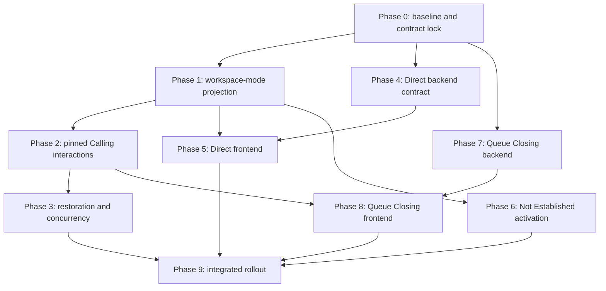

# Implementation Master Plan — Admisi Rajal Admission Officer Workspace Refactoring

**Status:** Approved-baseline implementation plan  
**Planning date:** 2026-07-27  
**Scope:** `RegistrasiRajal.vue`, Admission Queue officer workflow, queue-linked registration, queue-less Direct Registration, Registration Not Established, and Queue Closing  
**Nature of this artifact:** Implementation planning only; this document does not authorize architectural redesign

## 1. Executive implementation conclusion

The refactoring is feasible as an incremental delivery. It does not require replacing the existing Admission Queue aggregate, Loket claim model, Registration aggregate, or Registration Outcome model.

The implementation shall introduce four frontend-only workspace projections:

1. **Ready**
2. **Calling**
3. **Queued Registration**
4. **Direct Registration**

The first three modes are derived from backend queue and claim truth. Direct Registration is a local frontend activity. No workspace mode may be persisted, sent as a synchronized state, or added to the Admission Queue domain.

The safest delivery sequence is:

1. stabilize the current unfinished frontend call guard;
2. add and test the pure workspace-mode projection;
3. move Calling actions into one pinned active tile;
4. harden restoration and conflict handling;
5. add new, additive queue-less Direct Registration endpoints;
6. activate the Direct Registration UI against those endpoints;
7. activate Registration Not Established only when the external reason catalog is available;
8. add an atomic supervisor Queue Closing command and preview;
9. add the supervisor Queue Closing UI;
10. complete integrated rollout and documentation reconciliation.

**Superseding decision — 2026-07-27:** Registration create endpoints without Admission Queue context are queue-less. They create Registration and tracker evidence but no synthetic Queue Session, Queue Entry, claim, or Registration Outcome. Historical synthetic records remain unchanged.

Service Point selection is runtime work scope. A server-resolved Loket may serve any registered Admission Service Point and may switch while Ready. Queue-linked completion validates the queue's persisted Service Point against the Admission Service Point master and validates the active Loket claim; it does not compare against one server-wide configured Service Point.

No database migration is planned for the core mode refactoring, Direct Registration, or Queue Closing. Existing queue, claim, outcome, tracker, and audit persistence is sufficient. Any proposal that adds a persisted `WorkspaceMode`, synthetic Direct queue entry, Queue Session aggregate, automatic final no-show, or historical data migration violates the approved baseline.

## 2. Authority and evidence

### 2.1 Authoritative inputs

This plan implements:

- the accepted feasibility analysis in `admisi-rajal-officer-workspace-mode-feasibility-analysis.md`;
- approved decisions D-01 through D-15;
- the additional decision that Workspace Mode is strictly a UI concern;
- the current repository implementation, where it does not conflict with those decisions.

If a coding task encounters a conflict, precedence is:

1. approved decisions D-01 through D-15;
2. this master plan;
3. accepted feasibility analysis;
4. current canonical Admission Queue artifacts;
5. older reports, roadmaps, and implementation plans.

Do not resolve a conflict by redesigning the architecture. Record the conflict and return it to the plan owner.

### 2.2 Repositories inspected

| Repository | Relevant responsibility |
|---|---|
| `c012_myhospital_web` | Admission Officer workspace, queue worklist, registration assistance, registration mutations, runtime queue configuration |
| `b09-bilreg-api` | Admission Queue aggregate and handlers, Loket claims, Registration handlers, outcomes, API contracts, SQL repositories, authorization |
| `c013-kiosk-queue-display-web` | Read-only Queue Display client and SignalR hint handling |

Queue Display is an observer of backend projections. It is not a workspace-mode participant and should require no feature change for this refactoring.

### 2.3 Verified implementation anchors

Frontend anchors:

- `src/modules/Admisi/views/RegistrasiRajal.vue`
- `src/modules/Admisi/composables/useOfficerAdmissionQueue.ts`
- `src/modules/Admisi/composables/admissionQueueActionRules.ts`
- `src/modules/Admisi/composables/useRegistrationAssistanceSession.ts`
- `src/modules/Admisi/composables/useRegistrasiActions.ts`
- `src/modules/Admisi/components/admissionQueue/OfficerAdmissionQueueWorkspace.vue`
- `src/modules/Admisi/components/admissionQueue/DenseWorklistTile.vue`
- `src/modules/Admisi/components/admissionQueue/CurrentLoketSession.vue`
- `src/modules/Admisi/components/admissionQueue/VirtualWorklistGrid.vue`
- `src/modules/Admisi/components/registrationAssistance/LegacyRegistrationWorkspace.vue`
- `src/modules/Admisi/components/registrationAssistance/RegistrationAssistancePanel.vue`
- `src/modules/Admisi/queries/AdmissionQueueService.ts`
- `src/modules/Admisi/queries/RegistrasiService.ts`
- `src/core/types/admissionQueueConfig.ts`
- `public/global_config.json`

Backend anchors:

- `Bilreg.Api/Controllers/AdmisiContext/AntrianFeature/AdmissionQueueV1Controller.cs`
- `Bilreg.Api/Controllers/AdmisiContext/RegFeature/RegController.cs`
- `Bilreg.Application/AdmisiContext/RegFeature/AdmissionRegistrationQueueContext.cs`
- `Bilreg.Application/AdmisiContext/RegFeature/UseCases/RegJalanWalkInCommand.cs`
- `Bilreg.Application/AdmisiContext/RegFeature/UseCases/RegJalanByBookingCmd.cs`
- `Bilreg.Application/AdmisiContext/AntrianFeature/AdmissionQueueComplete.cs`
- `Bilreg.Application/AdmisiContext/AntrianFeature/AdmissionQueueRegistrationResolver.cs`
- Admission Queue command handlers, repositories, and API contract tests under `Bilreg.Application`, `Bilreg.Infrastructure`, and `Bilreg.Test`
- `Bilreg.Api/Configurations/PresentationService.cs`
- `Bilreg.Api/Authorization/PermissionAuthorizationHandler.cs`

### 2.4 Current worktree warning

At planning time, the frontend contains uncommitted work in the workstation setup, current-Loket call guard, action rules, tests, `RegistrasiRajal.vue`, and workstation runtime configuration. Queue Display also contains unrelated uncommitted transport/configuration work.

Implementation agents shall:

- inspect the current diff before editing;
- preserve all user-authored changes;
- treat the current-Loket fail-closed call guard as work to reconcile, not overwrite;
- keep Queue Display changes outside this feature unless a verified display regression requires a narrowly scoped fix;
- never use reset/checkout to discard those changes.

## 3. Frozen target architecture

## 3.1 Source-of-truth rule

Backend authoritative state remains:

- Queue Entry state;
- Loket Claim state;
- Registration state;
- Registration Outcome.

Frontend state contains:

- derived `WorkspaceMode`;
- selected preview key;
- Direct Registration local session state;
- transient editor/save/conflict state.

Only the latter two categories are local. Selection never establishes ownership. Only a successful Call command establishes an Outstanding Loket claim.

## 3.2 Stable workspace-mode projection

Create a pure projection function and a thin Vue composable. Use this exact priority:

| Priority | Authoritative/local input | Derived mode |
|---:|---|---|
| 1 | Current Loket claim is `InService` | `queued-registration` |
| 2 | Current Loket claim is `Outstanding` | `calling` |
| 3 | No active claim and local Direct session is active | `direct-registration` |
| 4 | No active claim and no Direct session | `ready` |

Rules:

- an active backend claim always wins over stale local Direct intent;
- `Released` is not active;
- a selected worklist item does not affect the mode;
- Registration Assistance transient modes such as `starting`, `processing`, `saving`, `completing`, and `conflict` remain substate and do not become workspace modes;
- the mode is recomputed after every current-display refresh and successful mutation;
- the mode is never written to local storage, a backend request, a database column, or SignalR payload.

Recommended frontend names:

- type: `AdmisiRajalWorkspaceMode`;
- pure function: `deriveAdmisiRajalWorkspaceMode`;
- composable: `useAdmisiRajalWorkspaceMode`;
- local Direct session: `useDirectRegistrationSession`.

## 3.3 Mode behavior matrix

| Behavior | Ready | Calling | Queued Registration | Direct Registration |
|---|---|---|---|---|
| Worklist visible | Yes | Yes | Yes | Yes |
| Worklist entries interactive | Yes | Active pinned tile only | No | No |
| Read-only preview | Yes | Active patient only | Active patient | Direct editor/search |
| Loket claim | None | Outstanding | InService | None |
| Active tile actions | `Panggil` | `Panggil Lagi`, `Tidak Hadir`, `Hadir` | None | None |
| Registration editor | Read-only/closed | Read-only | Enabled | Enabled |
| Queue completion allowed | No | No | Yes | No |
| Exit to Ready | N/A | `Tidak Hadir` | Registration terminal result | Success/cancel/clean exit |

## 3.4 Frozen UI terminology

| Domain/API action | Operator label |
|---|---|
| Call first attempt | `Panggil` |
| Recall | `Panggil Lagi` |
| Return to Waiting | `Tidak Hadir` |
| Start Service | `Hadir` |
| Terminal no-show | `Tidak Datang` |
| Registration Not Established | `Registrasi Tidak Terbentuk` |

Do not display “No Show” in the operator UI.

## 3.5 Calling layout contract

Calling Mode must contain exactly one pinned active tile.

Implementation contract:

- reuse `DenseWorklistTile.vue` with an explicit active-Calling variant;
- render the active tile in a pinned region above the virtual worklist;
- filter that same entry out of the virtual list to avoid duplicate interactive representations;
- render all remaining entries for awareness but disable selection, preview, and Call;
- place all three Calling actions on the pinned tile;
- remove duplicate Calling actions from `CurrentLoketSession.vue`;
- `CurrentLoketSession.vue` may remain as a compact status/identity summary during migration, but it must not expose a second action surface;
- keyboard focus must move to the pinned tile after Call succeeds;
- disabled worklist entries must use actual disabled controls or `aria-disabled`, not CSS alone.

## 3.6 `Tidak Hadir` contract

`Tidak Hadir` invokes the existing Return-to-Waiting command.

It must:

- release the Outstanding claim;
- leave the Queue Entry in Waiting;
- retain the entry in the queue;
- require no reason;
- create no Registration Outcome;
- not increment or infer a terminal no-show;
- return the workspace to Ready after authoritative refresh.

The existing terminal No Show command remains a separate supervisor operation surfaced as `Tidak Datang`.

## 3.7 Direct Registration API contract

Add two endpoints while keeping existing endpoints unchanged:

| Purpose | Endpoint |
|---|---|
| Direct walk-in create | `POST /api/Reg/rajalWalkIn/direct` |
| Direct booking-based create | `POST /api/Reg/rajalByBooking/direct` |

Request and response bodies reuse the corresponding existing Registration create contracts, except:

- Direct requests must omit `AdmissionAntrianId`;
- Direct requests must omit `AdmissionNoUrut`;
- Direct requests must omit `AdmissionExpectedRowVersion`;
- Direct requests do not require an Admission Queue workstation header;
- a Direct endpoint receiving any queue-context field returns the standard validation error response.

Add a JSON-ignored application property to both Registration commands:

```text
RegistrationAdmissionQueueBehavior
  QueueLinked
  None
```

This is a transient application instruction, not a domain state and not a persisted workspace mode.

Controller mapping:

- existing create endpoint + complete queue context → `QueueLinked`;
- existing create endpoint + no queue context → `None`;
- new Direct endpoint → `None`;
- partial queue context → validation error;
- queue context on a Direct endpoint → validation error.

Direct contract/context validation must use the existing `ArgumentException` middleware path: HTTP 400 with code `AQ_INVALID_REQUEST`.

Handler behavior:

- `QueueLinked`: preserve the current atomic Queue Entry completion, claim release, Established outcome, and tracker evidence;
- `None`: save Registration and all existing Registration side effects, create/reuse the Patient Tracker as required, append REGISTER evidence if missing, but create no Admission Queue entry, complete no Admission Queue entry, acquire/release no Loket claim, and write no Admission Queue Registration Outcome.

The normal Registration response remains unchanged. The new endpoint is additive and prospective. Historical synthetic records are untouched.

## 3.8 Direct Registration UI contract

Ready Mode gets one explicit primary/secondary action labelled `Registrasi Langsung`.

Entry conditions:

- current-display query completed successfully;
- no Outstanding or InService claim exists for the workstation;
- no queue mutation is pending;
- local Direct session is inactive.

Direct mode shall reuse `LegacyRegistrationWorkspace.vue` and existing Registration dialogs/actions rather than create a second editor.

Direct mode supports:

- new Registration;
- editing an existing Registration;
- visit change;
- SEP/guarantee maintenance;
- Registration Void.

It hides/disables:

- Call/Recall;
- Return to Waiting;
- Start Service;
- Established/Not Established queue completion;
- any queue number or claim action.

Exit rules:

- new Registration: exit to Ready only after the Direct create request and required post-save work report success;
- if Registration persists but a follow-up SEP/guarantee operation fails, remain in Direct mode and show a recoverable partial-success message containing the `RegId`;
- Registration Void success exits to Ready;
- other existing-record maintenance does not silently exit while a dialog or dirty form remains; provide `Selesai` after mutations settle and the editor is clean;
- `Batal` exits after explicit discard confirmation when dirty;
- route/tab/browser exit uses the existing unsaved-change guard;
- clean explicit exit returns to Ready without a confirmation.

Direct mode does not reserve a Loket. If an authoritative queue claim appears during Direct mode, the claim-derived Calling/Queued Registration mode wins and the Direct draft is retained locally only long enough for the existing unsaved-change conflict guard to require a user decision. It must never suppress the backend claim.

## 3.9 Registration Not Established contract

Officer action label: `Registrasi Tidak Terbentuk`.

Behavior:

- available only in Queued Registration Mode;
- invokes the existing Not Established outcome endpoint;
- requires an external reason code;
- never invents a local code or “other” code;
- on success completes the Queue Entry and releases the claim atomically;
- on concurrency conflict refreshes authoritative state and does not retry silently.

For this implementation, the current runtime `admissionQueue.reasonCodes` configuration is the only catalog input. The external owner supplies its production values through deployment configuration. An empty catalog keeps the action unavailable and displays a configuration/dependency message to authorized operators. Empty catalog data is not an implementation failure. A future catalog API requires a separate formal decision and is outside this plan.

## 3.10 Queue Closing API contract

Queue Closing is a supervisor operational command. It does not persist a Queue Session or closed lifecycle.

Add:

```text
GET  /api/v1/admission-queue/closing-preview
POST /api/v1/admission-queue/close
```

Preview query parameters:

```text
businessDate: yyyy-MM-dd, required
servicePointId: required
```

Preview returns every remaining Waiting Queue Entry for the exact business date and service point, including:

- `antrianId`;
- `noUrut`;
- display number and patient/booking summary already safe for officer projections;
- current claim state, if any;
- claim Loket key, if any;
- claim RowVersion as Base64, if any;
- CallCount;
- last call timestamp;
- allowed final dispositions.

Close request:

```json
{
  "businessDate": "yyyy-MM-dd",
  "servicePointId": "string",
  "userId": "existing-convention",
  "decisions": [
    {
      "antrianId": "string",
      "noUrut": 1,
      "disposition": "NoShow | Withdraw",
      "reason": "required only for Withdraw",
      "expectedClaimRowVersion": "required when preview reported an Outstanding claim"
    }
  ]
}
```

Close response:

```json
{
  "businessDate": "yyyy-MM-dd",
  "servicePointId": "string",
  "reviewedCount": 0,
  "noShowCount": 0,
  "withdrawnCount": 0,
  "closedAt": "ISO-8601"
}
```

Command rules:

- the decision set must exactly match the authoritative remaining Waiting set at transaction time;
- duplicate or missing keys are rejected;
- an entry created after Preview causes a conflict and a required review refresh;
- an `InService` claim blocks the entire command;
- an Outstanding claim may be finalized only with its exact expected RowVersion;
- Waiting/unclaimed entries need no RowVersion;
- `NoShow` maps to the existing terminal Queue Entry reason and UI label `Tidak Datang`;
- `Withdraw` requires a nonblank reason and maps to the existing Withdrawn behavior;
- no decision may create a Registration Not Established outcome;
- all decisions commit atomically or none commit;
- successful close leaves no Waiting entry in the selected scope at that transaction boundary;
- append an operational summary audit plus the normal per-entry audit/evidence;
- do not persist a “closed” flag or Queue Session row.

Set mismatches, stale RowVersions, and concurrent Call/Intake/Close changes must throw `AdmissionQueueConcurrencyException`, producing the existing HTTP 409 code `AQ_CONCURRENCY_CONFLICT`. Malformed or incomplete decisions use HTTP 400 `AQ_INVALID_REQUEST`. InService blockers use HTTP 400 `AQ_OPERATION_NOT_ALLOWED`. Authentication/authorization retain the existing 401/403 envelopes.

Because there is no persisted Queue Session lifecycle, operations must stop intake for the service point/date before closing. The exact-set transaction protects against a race by returning conflict if intake or another actor changes the set. It cannot permanently prevent a later intake. The runbook must make intake cutoff and post-close empty-preview verification mandatory.

## 3.11 Authorization contract

Keep current authentication and payload `UserId` handling unchanged.

Frontend:

- `user` may perform officer actions;
- `supervisor`, `admin`, and `celestial` may perform supervisor UI actions;
- include `admin` in the shared `UserRole` type to reconcile the role already used by Admisi configuration;
- UI authorization is a usability guard, not the security boundary.

Backend:

- Call, Recall, Return-to-Waiting, Start-Service, Established, and Not-Established remain under their current authenticated boundary;
- existing terminal Withdraw and No-Show endpoints plus Queue Closing preview and command require a new `AdmissionQueueSupervisorOperations` authorization policy;
- accept a direct permission claim named `AdmissionQueue.SupervisorOperations`;
- map externally configured allowed JWT roles through `AdmissionQueueApiOptions.SupervisorOperationAllowedRoles`;
- fail closed if neither permission nor an allowed role is present;
- do not change token creation, actor claim mapping, or command `UserId`.

This enforces the new supervisor-only command using the repository's existing permission pattern without broadening the project into an identity refactor.

## 4. Delivery dependency graph



Backend Phase 4 and backend Phase 7 can proceed in parallel after Phase 0. Frontend Phase 1 may also proceed in parallel because it touches only the frontend mode projection. Within one repository, keep the listed PR order unless branches are coordinated to avoid the same files.

## 5. Phase 0 — Baseline stabilization and contract lock

### Objective

Produce a green, reviewable baseline and prevent feature work from overwriting the current unfinished call-safety changes.

### Scope

Reconcile existing worktree changes, freeze API examples and state terminology, and establish characterization tests. No workflow feature is activated.

### Prerequisites

- accepted feasibility report;
- approved D-01 through D-15;
- current frontend and Queue Display diffs reviewed by their owners.

### Implementation slices

#### Slice 0A — Reconcile current-Loket call guard

- review the uncommitted `isLoketAvailabilityKnown` / `hasActiveLoketSession` changes;
- retain fail-closed behavior while current display is unknown;
- retain the prohibition on Call while any active current-Loket claim exists;
- update existing action-rule and view tests;
- separate workstation retry/config work from workspace-mode work if possible.

#### Slice 0B — Add characterization tests

- characterize current Ready preview;
- characterize current Call, Recall, Return-to-Waiting, Start Service, Established, and Registration completion contracts;
- characterize legacy no-context Registration creation so later Direct work cannot accidentally change it;
- characterize queue-context all-or-none validation;
- characterize current authorization response envelope.

#### Slice 0C — Freeze contract fixtures

- add API request/response examples to canonical Admission Queue API documentation;
- record the mode projection and terminology table;
- mark stale “No Show”/absence descriptions as superseded.

### Backend tasks

- add only missing characterization/API contract tests;
- add a regression test proving existing no-context create still uses legacy behavior;
- make no handler behavior change.

### Frontend tasks

- reconcile current dirty call-guard work;
- add/repair focused tests only;
- make no four-mode UI change yet.

### Database changes

None.

### API changes

None.

### Domain changes

None.

### Concurrency considerations

The call guard must remain fail-closed when current-display truth has not loaded. A timeout or failed current-display query must not be interpreted as “Loket free.”

### Testing strategy

- frontend unit tests for action rules and `RegistrasiRajal`;
- backend API contract tests;
- existing Admission Queue domain/handler tests;
- manual two-browser smoke check: browser B cannot Call after browser A acquires the Loket.

### Documentation updates

- add an “authoritative implementation baseline” note to relevant queue docs;
- link the feasibility analysis and this master plan;
- do not rewrite historical implementation reports.

### Rollback considerations

This phase is test/baseline oriented. Revert only its isolated commits; never discard pre-existing user changes.

### Exit Criteria

- current frontend feature tests are green;
- backend characterization tests are green;
- no app behavior intentionally changed except completion of the already-started call guard;
- API/state terminology is documented;
- feature branches can rebase without unresolved ownership of the dirty files.

## 6. Phase 1 — Explicit frontend workspace-mode projection

### Objective

Introduce the four stable actor-centric modes without changing backend behavior or moving actions.

### Scope

Pure types, projection, integration into `RegistrasiRajal.vue`, and mode-aware panel capabilities.

### Prerequisites

- Phase 0 complete;
- current-display query exposes Outstanding versus InService claim state.

### Implementation slices

#### Slice 1A — Pure type and projection

- add `AdmisiRajalWorkspaceMode`;
- add `deriveAdmisiRajalWorkspaceMode`;
- unit-test every input combination and priority.

#### Slice 1B — Composable integration

- add `useAdmisiRajalWorkspaceMode`;
- feed it authoritative current-display data and local Direct-active flag;
- expose read-only booleans such as `isReady`, `isCalling`, `isQueuedRegistration`, `isDirectRegistration`.

#### Slice 1C — Assistance capability mapping

- keep `RegistrationAssistanceMode` as transient editor state;
- compute high-level editable/read-only capability from Workspace Mode;
- Ready supports preview but no edits;
- Calling is read-only;
- Queued Registration is editable;
- Direct remains inactive until Phase 5.

### Backend tasks

None.

### Frontend tasks

- create the type/function/composable and focused tests;
- replace scattered high-level mode guesses in `RegistrasiRajal.vue` with the projection;
- do not rename transient assistance states into workspace states;
- expose no development/debug mode indicator in the operator UI.

### Database changes

None.

### API changes

None.

### Domain changes

None. The new type belongs in the frontend Admisi module, not backend or shared domain packages.

### Concurrency considerations

- authoritative claim has priority over local state;
- unknown current-display state must not derive Ready;
- while initial truth is loading, render a neutral loading/disabled shell rather than Ready;
- after a 409/412-style queue conflict, refresh first and derive from refreshed truth.

### Testing strategy

- table-driven unit tests for the pure projection;
- composable tests for loading/error/success changes;
- view tests proving selection does not leave Ready;
- tests proving Outstanding → Calling and InService → Queued Registration;
- test proving active claim overrides local Direct intent.

### Documentation updates

- document stable Workspace Mode versus transient Registration Assistance state;
- add the projection precedence table to frontend technical docs.

### Rollback considerations

The projection is additive. A temporary rollback may keep the old rendered behavior while removing its consumption, but do not add a persisted compatibility flag.

### Exit Criteria

- all four mode values exist in frontend code;
- Ready/Calling/Queued Registration derive only from current backend truth;
- selection remains Ready;
- no workspace mode is persisted or sent;
- existing workflows still operate with unchanged action placement.

## 7. Phase 2 — Pinned Calling tile and interaction alignment

### Objective

Make Calling Mode focus exactly one Queue Entry and put all approved Calling actions on that tile.

### Scope

Worklist layout, tile variants, action placement, labels, accessibility, and interaction guards.

### Prerequisites

- Phase 1 mode projection;
- existing Call/Recall/Return-to-Waiting/Start-Service clients are green.

### Implementation slices

#### Slice 2A — Tile interaction contract

- add explicit tile presentation/interaction props;
- Ready tile shows `Panggil`;
- Calling active tile shows `Panggil Lagi`, `Tidak Hadir`, `Hadir`;
- inactive Calling tiles expose no actionable controls.

#### Slice 2B — Pinned region

- render the active entry above the virtual list;
- filter it from the list;
- preserve worklist scroll position;
- focus the active tile after successful Call or restore.

#### Slice 2C — Remove duplicate action surfaces

- remove Recall/Return actions from `CurrentLoketSession`;
- retain only non-action status content if still useful;
- remove ordinary-tile Recall behavior.

#### Slice 2D — Queued Registration lock

- leave worklist visible but non-interactive in Queued Registration;
- ensure the right panel is the only registration work surface.

### Backend tasks

None.

### Frontend tasks

- update `DenseWorklistTile.vue`;
- update `VirtualWorklistGrid.vue`;
- update `OfficerAdmissionQueueWorkspace.vue`;
- reduce `CurrentLoketSession.vue` to one status surface;
- route events through `useOfficerAdmissionQueue.ts`;
- apply approved Indonesian labels;
- disable buttons while their mutation is pending.

### Database changes

None.

### API changes

None. Existing endpoints remain authoritative.

### Domain changes

None.

### Concurrency considerations

- do not optimistically expose Calling until Call succeeds;
- double-clicks must collapse to one pending mutation;
- actions use the current active key, not a stale selected-preview key;
- after any conflict, remove optimistic focus and refresh current display/worklist;
- `Tidak Hadir` must not call terminal No Show.

### Testing strategy

- component tests for every tile variant;
- tests proving exactly one active Calling tile;
- tests proving active entry is not duplicated;
- tests proving other tiles cannot select, preview, or Call;
- event tests for each approved action;
- view tests for Calling → Ready and Calling → Queued Registration;
- keyboard and accessible-name checks.

### Documentation updates

- update UI/UX screenshots or wireframes;
- update operator vocabulary;
- explicitly state `Tidak Hadir` is Return to Waiting.

### Rollback considerations

Keep API/composable behavior unchanged so the visual reorganization can be reverted independently. Do not restore terminal semantics under the old label.

### Exit Criteria

- Calling has one pinned interactive tile;
- the pinned tile has exactly the three approved actions;
- all other tiles are visible and non-interactive;
- Queued Registration locks the left worklist;
- no duplicate Recall/Return action surface remains;
- Return to Waiting remains nonterminal.

## 8. Phase 3 — Workspace restoration and concurrency hardening

### Objective

Ensure refresh, reopen, multi-tab, and competing-officer scenarios restore the correct mode and patient without manual selection.

### Scope

Polling/refetch behavior, restoration binding, stale selection cleanup, and conflict recovery.

### Prerequisites

- Phase 2 interaction model;
- current-display and current-Loket worklist endpoints available.

### Implementation slices

#### Slice 3A — Current-display refresh policy

- give current-display an explicit polling interval aligned with queue runtime configuration;
- refetch on window focus/reconnect;
- continue treating SignalR as a hint, not truth.

#### Slice 3B — Active-patient restoration

- bind Outstanding claim to the pinned Calling tile after reload;
- bind InService claim to the queued Registration assistance session;
- fetch the current-Loket item if it is absent from the general page;
- never require the officer to reselect an owned patient.

#### Slice 3C — Conflict reconciliation

- centralize queue mutation conflict handling;
- invalidate current display, current-Loket worklist, and general worklist together;
- clear stale preview only when its authoritative entry disappears or changes incompatibly;
- show a concise operator message and use refreshed mode.

#### Slice 3D — Navigation guard

- warn before leaving Queued Registration with unsaved changes;
- allow clean leave;
- keep backend claim authoritative after route return.

### Backend tasks

- add missing concurrency characterization tests if frontend recovery reveals an undocumented response;
- do not change claim cardinality or row-version rules.

### Frontend tasks

- update query refresh options;
- centralize invalidation;
- restore active item/session;
- add route/window unsaved-change guards.

### Database changes

None.

### API changes

None unless a verified projection omission prevents restoration. Any such addition must be additive to the current-display response and separately approved in the PR.

### Domain changes

None.

### Concurrency considerations

Test:

- two tabs at one workstation;
- two workstations calling the same Waiting entry;
- stale RowVersion on Recall, Return, Start Service, and completion;
- claim changes during polling;
- network success with lost response;
- page refresh during Outstanding and InService.

Never auto-retry a non-idempotent mutation whose outcome is indeterminate. Refresh truth first.

### Testing strategy

- fake-timer query/composable tests;
- view restoration tests;
- backend real-SQL concurrency tests where available;
- manual two-browser validation checkpoint;
- verify Queue Display remains projection-consistent.

### Documentation updates

- recovery/runbook matrix for refresh, disconnect, conflict, and indeterminate request;
- document polling and SignalR roles.

### Rollback considerations

Polling frequency is runtime configurable and may be increased if load is excessive. Do not roll back to optimistic Ready derivation.

### Exit Criteria

- refresh in Outstanding restores Calling and its active tile;
- refresh in InService restores Queued Registration and active patient;
- multi-tab conflicts converge to backend truth;
- no stale selection creates ownership;
- no non-idempotent command is silently retried.

## 9. Phase 4 — Additive backend support for queue-less Direct Registration

### Objective

Provide true queue-less Registration creation without changing legacy or queue-linked callers.

### Scope

New Direct create routes, transient application behavior, handler branch, tests, and API documentation.

### Prerequisites

- Phase 0 characterization tests;
- explicit agreement that endpoint routes and behavior enum match Section 3.7.

### Implementation slices

#### Slice 4A — Application behavior type

- add `RegistrationAdmissionQueueBehavior`;
- add JSON-ignored property to both create commands;
- add validation helpers for behavior/context combinations.

#### Slice 4B — Direct routes

- add `rajalWalkIn/direct`;
- add `rajalByBooking/direct`;
- map them to `None`;
- reject queue context;
- keep responses identical to existing create routes.

#### Slice 4C — Walk-in handler branch

- preserve all current Registration, billing, physician-queue, EMR-outbox, and tracker side effects;
- for `None`, skip Admission Queue creation/completion and outcome persistence;
- append REGISTER tracker evidence exactly once.

#### Slice 4D — Booking handler branch

- reuse the booking-linked tracker;
- for `None`, skip Admission Queue completion and outcome persistence;
- preserve physician queue mapping and booking/Registration side effects;
- append REGISTER evidence exactly once.

#### Slice 4E — Compatibility verification

- prove existing no-context routes create no queue sessions, entries, claims, or outcomes;
- prove queue-linked routes retain atomic completion;
- prove Direct routes create no queue/outcome.

### Backend tasks

- implement the slices above in Application and API layers;
- keep domain models free of workspace state;
- reuse `AdmissionQueueComplete.AppendRegisterIfMissing` or extract a narrowly named tracker helper if accessibility requires it;
- keep controller-to-command mapping explicit.

### Frontend tasks

None in this phase. The new routes remain unused until Phase 5.

### Database changes

None. No migration and no historical backfill.

### API changes

Two additive POST routes. Existing routes and bodies are backward compatible.

### Domain changes

No Admission Queue domain change. The behavior enum is an Application-layer instruction only.

### Concurrency considerations

- Direct create has normal Registration duplicate/concurrency behavior but no Loket claim;
- queue-context fields on Direct fail before writes;
- preserve existing transaction boundaries;
- ensure REGISTER evidence is idempotent within handler retry semantics;
- do not query/acquire a Loket for Direct.

### Testing strategy

For walk-in and booking separately:

- Direct success creates Registration;
- no `BILRG_AdmAntrianEntry` is added;
- no `BILRG_RegOutcome` is added;
- no `BILRG_AdmLoketCurrentCall` is added/changed;
- tracker REGISTER evidence exists once;
- physician queue and billing side effects remain;
- queue fields are rejected;
- existing legacy endpoint behavior unchanged;
- queue-linked behavior unchanged;
- transaction rollback leaves no partial Registration artifacts.

Use unit/handler tests, API contract tests, and real-SQL integration tests under the existing fail-closed `BILREG_AQ_IT_*` gate.

### Documentation updates

- update Registration API contract;
- document the three transient application behaviors;
- mark new behavior prospective only;
- state no historical migration.

### Rollback considerations

Because routes are additive and initially unused, rollback removes the new routes/branch without data migration. Registrations already created through Direct remain valid Registrations and must never be retroactively given queue entries.

### Exit Criteria

- both Direct routes are deployed and contract-tested;
- Direct creates no Admission Queue artifact or outcome;
- existing create routes are behaviorally unchanged;
- no database schema change;
- no workspace mode appears in backend code.

## 10. Phase 5 — Direct Registration frontend workflow

### Objective

Expose Direct Registration from Ready Mode and reuse the complete existing Registration toolset without a queue claim.

### Scope

Direct session orchestration, entry/exit actions, direct service hooks, dirty-state behavior, and mode interaction.

### Prerequisites

- Phase 1 projection;
- Phase 4 Direct endpoints available in the target environment;
- existing legacy Registration workspace tests green.

### Implementation slices

#### Slice 5A — Direct service clients

- add explicit Direct walk-in and booking create methods/hooks;
- use schemas that omit queue context;
- leave existing create hooks unchanged.

#### Slice 5B — Local Direct session

- add `useDirectRegistrationSession`;
- track active state, operation type, dirty state, pending state, and successful terminal state;
- do not persist it.

#### Slice 5C — Entry and shell

- add `Registrasi Langsung` in Ready;
- enter only when current-Loket truth is known and free;
- reuse `LegacyRegistrationWorkspace`;
- lock the worklist and hide queue actions.

#### Slice 5D — New Registration completion

- route new walk-in/booking submits to Direct endpoints;
- exit only after the existing submit pipeline reports success;
- retain recoverable mode after partial post-save failure and display `RegId`.

#### Slice 5E — Existing Registration maintenance

- expose edit, visit change, SEP/guarantee, and Void;
- auto-exit after successful Void;
- otherwise use `Selesai` when clean and settled;
- implement explicit `Batal` and unsaved-change confirmation.

#### Slice 5F — Claim collision recovery

- authoritative Outstanding/InService overrides Direct mode;
- prevent new Direct mutations after the collision is detected;
- invoke unsaved-change resolution;
- refresh and restore the queue-owned patient.

### Backend tasks

- no new backend work beyond defect fixes against the frozen Direct contract.

### Frontend tasks

- implement all slices;
- keep queued and Direct submit functions separate at the service boundary;
- do not construct fake queue context;
- ensure Direct operations never invoke queue completion.

### Database changes

None.

### API changes

Consume the two Phase 4 routes. No additional route.

### Domain changes

None.

### Concurrency considerations

- recheck current display immediately before Direct entry and before Direct create;
- this is a guard, not a Loket reservation;
- a race may still produce a claim; authoritative claim wins;
- disable duplicate submits;
- preserve existing Registration concurrency behavior for edit/void;
- never release or overwrite a claim from Direct cleanup.

### Testing strategy

- Direct entry only from Ready;
- no synthetic queue fields in Direct requests;
- all approved operations visible;
- queue actions absent;
- success, cancel, and clean exit return Ready;
- dirty exit prompts;
- post-save partial failure stays recoverable;
- claim collision overrides Direct;
- Void success exits;
- queued Registration still uses queue-linked endpoints;
- regression tests for legacy non-queue feature flag path if it remains available.

### Documentation updates

- operator guide for `Registrasi Langsung`;
- clarify no queue number/claim is created;
- partial-success recovery instructions;
- update frontend architecture notes.

### Rollback considerations

Guard the Direct entry action with a runtime feature flag for initial rollout. Disabling the flag hides entry but does not alter Direct-created Registrations. Do not redirect Direct calls to legacy endpoints as rollback.

### Exit Criteria

- Direct is usable only from Ready;
- new Direct calls use only Direct endpoints;
- all approved non-queue operations work;
- no Loket claim or queue action is created;
- every approved exit path returns Ready;
- queued Registration remains unchanged.

## 11. Phase 6 — Registration Not Established activation

### Objective

Complete the officer's Queued Registration terminal alternatives without inventing reason codes.

### Scope

Reason catalog adapter, action UI, confirmation, existing outcome API integration, and conflict recovery.

### Prerequisites

- Phase 1 Queued Registration projection;
- externally supplied reason codes available through runtime `admissionQueue.reasonCodes`;
- existing Not Established backend endpoint green.

### Implementation slices

#### Slice 6A — Catalog availability

- expose catalog readiness separately from an empty selection;
- validate code/label shape;
- do not commit sample/test codes to production config.

#### Slice 6B — Completion action

- add `Registrasi Tidak Terbentuk` in the queued assistance action area;
- require a selected external reason;
- show an explicit terminal confirmation;
- call the existing endpoint with current claim RowVersion.

#### Slice 6C — Recovery

- on success return to Ready after refresh;
- on conflict refresh without retry;
- on empty catalog keep action unavailable with operational guidance.

### Backend tasks

- no contract change;
- never hard-code local reason codes.

### Frontend tasks

- implement catalog readiness and action UI;
- preserve the Established path;
- clear selected reason after completion/cancel.

### Database changes

None.

### API changes

None by default.

### Domain changes

None.

### Concurrency considerations

Use the current claim RowVersion. A stale completion must fail and refresh. Established and Not Established racing each other must result in exactly one terminal outcome.

### Testing strategy

- hidden/disabled state with empty catalog;
- reason required;
- configured code passed unchanged;
- no local fallback code;
- success completes and releases;
- conflict refreshes;
- Established versus Not Established race in backend tests.

### Documentation updates

- external dependency ownership;
- reason catalog configuration;
- terminal meaning distinct from `Tidak Hadir` and `Tidak Datang`.

### Rollback considerations

Disable the UI action if catalog quality is uncertain. Existing backend endpoint remains. Never substitute a fabricated reason.

### Exit Criteria

- action is available only with external reasons and Queued Registration;
- successful completion returns Ready;
- no local reason code exists;
- terminology is correct.

If the external catalog is not supplied, this phase may be recorded as **implementation-ready but activation-blocked** without blocking Direct Registration or Calling delivery.

## 12. Phase 7 — Supervisor Queue Closing backend

### Objective

Provide explicit, atomic final disposition of every remaining Waiting entry without a Queue Session aggregate.

### Scope

Closing preview, close command, transactional repository operation, authorization policy, audit, and API tests.

### Prerequisites

- Phase 0 contracts;
- operational definition of intake cutoff and business date;
- deployed JWT role/permission values configured for supervisor policy;
- Section 3.10 contract accepted unchanged.

### Implementation slices

#### Slice 7A — Query contract

- add closing-preview query/response;
- scope by business date and service point;
- include claim concurrency metadata and allowed dispositions.

#### Slice 7B — Command validation

- validate exact keys, duplicates, disposition, Withdraw reason, and RowVersion format;
- reject InService before mutations.

#### Slice 7C — Transactional repository operation

- begin one transaction;
- lock/reload the scoped remaining set;
- compare it exactly with decisions;
- validate Outstanding claim versions;
- apply existing terminal state transitions;
- release Outstanding claims;
- persist outcomes/audit atomically.

#### Slice 7D — Authorization

- add `AdmissionQueueSupervisorOperations` policy;
- support permission claim and configured role allowlist;
- apply it to the existing Withdraw and No-Show endpoints and the new closing Preview and Close endpoints;
- keep actor `UserId` convention unchanged.

#### Slice 7E — Operational audit and response

- append command summary audit;
- return counts/time;
- verify remaining set empty at commit boundary.

### Backend tasks

- implement all slices in API, Application, Domain only where existing transition methods require reuse, and Infrastructure;
- prefer an aggregate/application operation that reuses existing per-entry state methods;
- do not loop through public HTTP commands;
- do not commit each entry independently.
- write one `ADMISSION_QUEUE_CLOSE` summary audit with entity `AdmissionServicePointBusinessDate`, entity id `<servicePointId>:<businessDate>`, submitted counts as structured snapshot JSON, and one terminal audit per affected entry.

### Frontend tasks

None.

### Database changes

None. Use existing entry status/reason fields, claim RowVersion, and `BILRG_AuditLog`. Queue Closing must not write `BILRG_RegOutcome`, because never-presented entries have no Registration outcome.

### API changes

Add the two Section 3.10 routes and authorization error contracts.

### Domain changes

- reuse existing terminal No Show and Withdraw semantics;
- add no Queue Session entity;
- add no automatic time/CallCount rule;
- add no Registration Not Established outcome for never-presented patients.

### Concurrency considerations

- exact-set comparison prevents silent carry-forward;
- use a Serializable transaction and SQL Server `UPDLOCK, HOLDLOCK` range protection for the scoped remaining-set read so a Call or Intake cannot be missed during commit;
- an InService entry blocks all;
- stale Outstanding RowVersion blocks all;
- any mismatch returns conflict and zero writes;
- deadlock retry may be applied only at the database transaction wrapper, not by replaying an indeterminate HTTP request without idempotency evidence.

### Testing strategy

- preview scoping;
- empty close;
- every entry explicitly NoShow/Withdraw;
- missing and extra decision;
- duplicate decision;
- Withdraw without reason;
- NoShow with irrelevant reason normalization;
- InService blocker;
- Outstanding exact/stale RowVersion;
- concurrent Call;
- concurrent intake;
- concurrent second close;
- rollback on final decision failure;
- authorization 401/403/success for Withdraw, No Show, closing Preview, and Close;
- no Registration Outcome;
- no queue-session persistence;
- real-SQL transaction/locking tests.

### Documentation updates

- API contract;
- domain clarification;
- supervisor runbook including intake cutoff;
- permission/role deployment configuration;
- audit behavior.

### Rollback considerations

Routes can be disabled behind a backend feature option. Partially committed closing is prohibited; rollback is operationally a new explicit correction, never an automatic reopen. Successful terminal dispositions remain historical truth.

### Exit Criteria

- preview and close are supervisor-protected;
- close is all-or-nothing;
- exact remaining set is required;
- no InService entry is closed;
- all successful decisions are explicit;
- no session aggregate/table exists;
- no automatic No Show rule exists;
- real-SQL concurrency suite passes.

## 13. Phase 8 — Supervisor Queue Closing frontend

### Objective

Give supervisors a safe review-and-confirm workflow for the Phase 7 operational command.

### Scope

Supervisor-only launcher, preview/review dialog, disposition collection, conflict refresh, and runbook cues.

### Prerequisites

- Phase 7 deployed;
- Phase 2 workspace action placement complete;
- supervisor roles normalized by frontend auth store;
- intake cutoff process documented.

### Implementation slices

#### Slice 8A — Authorization and launcher

- extend `UserRole` with `admin`;
- add a reusable supervisor capability check;
- show `Tutup Antrean` only to supervisor/admin/celestial;
- allow launch only while local workspace is Ready and no mutation is pending.

#### Slice 8B — Review table

- load preview;
- require one explicit disposition for every row;
- label NoShow as `Tidak Datang`;
- require reason only for `Withdraw`;
- flag Outstanding and block InService.

#### Slice 8C — Confirmation and command

- show scope and counts;
- require final confirmation;
- submit exact preview concurrency data;
- prevent double submit.

#### Slice 8D — Conflict and completion

- on mismatch/conflict reload preview and discard stale confirmation;
- on success refresh worklist/current display;
- verify/show empty remainder;
- retain an operator-visible audit summary.

### Backend tasks

Only contract defect fixes.

### Frontend tasks

- implement a dedicated `QueueClosingDialog` or feature folder;
- do not overload ordinary Queue Entry tile actions;
- keep supervisor state separate from Workspace Mode.

### Database changes

None.

### API changes

Consume Phase 7 APIs.

### Domain changes

None.

### Concurrency considerations

- preview is not a reservation;
- conflict always forces a fresh human review;
- never auto-apply old decisions to a new preview;
- closing must not proceed with an InService row;
- current workspace claim truth can invalidate dialog readiness.

### Testing strategy

- role visibility;
- Ready-only launch;
- every-row decision validation;
- correct Indonesian labels;
- Withdraw reason validation;
- InService blocker;
- conflict refresh clears confirmation;
- success refreshes and shows empty result;
- officer cannot call close API through UI;
- backend remains the security boundary.

### Documentation updates

- illustrated supervisor procedure;
- intake cutoff, review, confirmation, conflict, and post-close verification;
- distinguish `Tidak Hadir`, `Tidak Datang`, and `Registrasi Tidak Terbentuk`.

### Rollback considerations

Hide launcher with a frontend feature flag and disable backend route flag together. Never emulate closing with client-side loops over terminal endpoints.

### Exit Criteria

- only authorized supervisor UI can launch;
- every row receives explicit disposition;
- stale preview cannot be submitted silently;
- successful close leaves a visibly empty reviewed scope;
- officer workspace modes remain unchanged.

## 14. Phase 9 — Integrated rollout, regression closure, and documentation reconciliation

### Objective

Validate the complete workflow in production-like conditions and make the new baseline operationally supportable.

### Scope

Cross-repository tests, staged flags, performance, observability, docs, and removal of obsolete duplicate UI paths.

### Prerequisites

- Phases 1–5 complete;
- Phase 6 complete or formally activation-blocked by the external catalog;
- Phases 7–8 complete if Queue Closing is included in the release train.

### Implementation slices

#### Slice 9A — End-to-end workflow matrix

- Ready preview and arbitrary Call;
- repeated Panggil Lagi;
- Tidak Hadir and later recall;
- Hadir and Established;
- Hadir and Registration Not Established;
- Direct new/edit/change/SEP/Void;
- refresh/reconnect at every mode;
- supervisor closing.

#### Slice 9B — Staged activation

- enable mode projection first;
- enable pinned Calling UI;
- enable Direct backend then frontend flag;
- enable Queue Closing backend then frontend flag;
- monitor before removing old duplicate surfaces.

#### Slice 9C — Performance and observability

- measure worklist/current-display polling load;
- log conflicts and command results without PHI;
- monitor Direct versus queue-linked Registration counts;
- monitor entries remaining after closing;
- verify Queue Display latency remains acceptable.

#### Slice 9D — Documentation reconciliation

- update canonical architecture, API, runbook, UI/UX, implementation status, and gap analysis;
- mark older proposed states superseded;
- record final PRs and verification evidence.

### Backend tasks

- run full relevant test suite;
- add structured operational telemetry where the project pattern supports it;
- verify feature options and authorization configuration.

### Frontend tasks

- run full typecheck/lint/unit/build;
- remove obsolete duplicate Calling action code only after flags prove stable;
- retain legacy Registration path only where independently used.

### Database changes

None planned. Verify deployments require no migration.

### API changes

No new contract beyond Phases 4 and 7. Freeze versions and examples.

### Domain changes

None.

### Concurrency considerations

Run production-like multi-browser and real-SQL race scenarios. Validate intake cutoff around Queue Closing. Confirm lost responses recover by refresh rather than duplicate terminal actions.

### Testing strategy

Validation checkpoint:

- frontend focused unit tests;
- frontend complete unit suite;
- `pnpm tc:app`;
- `pnpm lint`;
- production build;
- backend focused Admission Queue/Registration tests;
- full `Bilreg.Test` where practical;
- real-SQL Admission Queue suite with explicit environment;
- manual multi-browser script;
- Queue Display smoke test;
- database before/after evidence for Direct and closing.

### Documentation updates

All canonical artifacts, release notes, feature-flag runbook, rollback runbook, and unresolved external dependency status.

### Rollback considerations

Rollback flags in reverse activation order. Backend additive endpoints may remain deployed but unused. Never migrate Direct-created Registrations or reopen closed entries automatically.

### Exit Criteria

- all enabled workflows pass the end-to-end matrix;
- no persisted Workspace Mode;
- no Direct synthetic queue entry;
- no automatic No Show;
- Queue Closing is explicit and atomic;
- operational and technical documentation agree with implementation;
- metrics and logs can distinguish queue-linked versus Direct behavior without deriving it from synthetic data.

## 15. Recommended pull-request boundaries

Keep PRs small enough to review and revert independently.

| PR | Repository | Content | Depends on |
|---|---|---|---|
| F-00 | frontend | Reconcile current call guard and characterization tests | none |
| B-00 | backend | Legacy/queue-linked characterization and contract docs | none |
| F-01 | frontend | Workspace-mode type, pure projection, composable tests | F-00 |
| F-02 | frontend | Integrate projection and panel capability mapping | F-01 |
| F-03 | frontend | Tile variants and pinned active Calling tile | F-02 |
| F-04 | frontend | Remove duplicate actions, queued-worklist lock, accessibility | F-03 |
| F-05 | frontend | Restoration, polling, centralized conflict recovery | F-04 |
| B-01 | backend | Direct behavior type and validation | B-00 |
| B-02 | backend | Direct walk-in route/handler/tests | B-01 |
| B-03 | backend | Direct booking route/handler/tests and compatibility suite | B-02 |
| F-06 | frontend | Direct API client and schemas | B-03, F-02 |
| F-07 | frontend | Direct session/entry/new Registration | F-06 |
| F-08 | frontend | Direct edit/change/SEP/Void/exit guards | F-07 |
| F-09 | frontend | Not Established catalog adapter and UI | F-02, external catalog |
| B-04 | backend | Closing preview and policy | B-00 |
| B-05 | backend | Atomic close command/repository/tests | B-04 |
| F-10 | frontend | Supervisor closing capability and review dialog | B-05, F-04 |
| F-11 | frontend | Closing conflict/completion UX | F-10 |
| D-01 | docs | Final architecture/API/runbook reconciliation | all enabled PRs |

PR rules:

- one behavioral purpose per PR;
- tests and docs travel with behavior;
- no mixed formatting sweep;
- no unrelated Queue Display diff;
- no database migration placeholder when none is required;
- every PR description lists which approved decisions it implements;
- every PR states feature-flag and rollback behavior.

## 16. Parallel work opportunities

After Phase 0:

- frontend mode projection (`F-01`/`F-02`);
- backend Direct support (`B-01` through `B-03`);
- backend Queue Closing preview/policy (`B-04`);

may run in parallel.

Safe secondary parallelism:

- Direct frontend service client can be prepared against frozen contract examples while backend tests run, but must not merge activation before backend deployment;
- Queue Closing UI component tests can use frozen fixtures while `B-05` runs, but final integration waits for the backend contract;
- operator/runbook documentation can be drafted alongside feature implementation.

Avoid parallel edits to:

- `RegistrasiRajal.vue`;
- `useOfficerAdmissionQueue.ts`;
- `OfficerAdmissionQueueWorkspace.vue`;
- Admission Queue API controller;
- Registration create handlers.

Assign one integration owner for those files or serialize their PRs.

## 17. Validation checkpoints

### Checkpoint A — After Phase 1

- mode projection truth table approved;
- no persisted/synchronized mode;
- current behavior unchanged.

### Checkpoint B — After Phase 3

- two-browser Calling and restoration script passes;
- `Tidak Hadir` is proven nonterminal in UI, API, and database;
- no duplicate Calling action surface.

### Checkpoint C — After Phase 4

Database evidence for a Direct walk-in and booking shows:

- Registration exists;
- tracker evidence exists;
- no Admission Queue entry/outcome/claim was created;
- legacy endpoints still create their previous artifacts.

### Checkpoint D — After Phase 5

- all Direct operations work without queue actions;
- success/cancel/clean exit behavior matches D-08;
- claim collision recovers safely.

### Checkpoint E — After Phase 7

- real-SQL exact-set and rollback tests pass;
- no Queue Session table/model exists;
- supervisor policy fails closed;
- no automatic rule finalizes entries.

### Checkpoint F — Before general release

- complete mode/action matrix signed off by Product, Admission Operations, Backend, Frontend, and QA;
- external reason catalog status recorded;
- intake cutoff/closing runbook rehearsed;
- feature flags and rollback owners assigned.

## 18. Risk register and required mitigations

| Risk | Impact | Required mitigation |
|---|---|---|
| Workspace mode accidentally persisted | Competing truth/source divergence | Frontend-only type; architecture test/review checklist; no API field |
| Existing no-context callers become queue-less | Silent compatibility break | Add new Direct routes; preserve existing endpoints; characterization tests |
| Direct accidentally creates synthetic queue data | Metrics/domain contamination | Negative persistence assertions and database checkpoint |
| Selection treated as claim | Multi-officer collision | Ready projection unaffected by selection; Call-success-only ownership |
| Current display unknown treated as free | Double work | Fail-closed loading/error guard |
| Active tile duplicated | Conflicting actions | Filter active key from virtual list; component assertion |
| `Tidak Hadir` wired to terminal endpoint | Incorrect finalization | Named Return-to-Waiting service method; API-event test |
| Reason codes fabricated to unblock UI | Invalid outcome data | Empty-catalog disabled state; external dependency gate |
| Queue Closing misses new entries | Silent carry-forward | Intake cutoff, exact-set transaction, post-close preview |
| Queue Closing partially commits | Operational inconsistency | One transaction, real-SQL rollback tests |
| Supervisor enforced only in UI | Unauthorized closing | Backend policy fail-closed |
| D-15 expanded into identity redesign | Scope and deployment risk | Reuse claims/options; preserve `UserId`; separate future security work |
| Polling load regression | API/database pressure | Runtime interval, metrics, staged rollout |
| Uncommitted user work overwritten | Data loss/merge conflict | Phase 0 reconciliation; no reset/checkout; narrow PRs |
| Queue Display unnecessarily changed | Cross-repo regression | Observer-only smoke test; no planned feature changes |

## 19. Coding-agent task template

Every task handed to a lower-reasoning coding agent should include:

1. one PR identifier from Section 15;
2. exact repository and file set;
3. objective and explicit non-goals;
4. frozen contract section reference;
5. input/output examples;
6. required tests;
7. commands to run;
8. rollback/feature-flag expectation;
9. exit criteria;
10. instruction to stop if a contract change seems necessary.

Example task size:

> Add the pure `deriveAdmisiRajalWorkspaceMode` function and table-driven tests only. Do not integrate it into `RegistrasiRajal.vue`, change APIs, or persist state. Inputs and precedence must exactly match Section 3.2. Run the focused unit test, typecheck the modified package, format only modified files, and report any current-display state that cannot be represented.

Do not assign an entire phase to one low-reasoning agent when the phase contains multiple slices.

## 20. Standard verification commands

Use repository instructions as authoritative if commands change.

Frontend, from `c012_myhospital_web`:

```text
pnpm exec prettier --write <modified-files>
pnpm test:unit -- --run <focused-test-files>
pnpm tc:app
pnpm lint
pnpm build
```

Backend, from `b09-bilreg-api/src/bilreg`:

```text
dotnet test Bilreg.Test/Bilreg.Test.csproj --filter "FullyQualifiedName~AdmissionQueue"
dotnet test Bilreg.Test/Bilreg.Test.csproj --filter "FullyQualifiedName~RegJalan"
dotnet test Bilreg.Test/Bilreg.Test.csproj
```

Real-SQL tests must use the repository's explicit `BILREG_AQ_IT_*` environment gate and fail closed when configuration is incomplete. Never report an environment-skipped test as a pass.

## 21. Approved-decision traceability

| Decision | Implementation location |
|---|---|
| D-01 — four UI-only modes | Sections 3.1–3.3; Phases 1 and 5 |
| D-02 — Ready preview, selection is not ownership | Sections 3.1 and 3.3; Phases 1–2 |
| D-03 — one Calling focus | Section 3.5; Phase 2 |
| D-04 — actions on active tile | Sections 3.4–3.5; Phase 2 |
| D-05 — operator terminology | Section 3.4; Phases 2, 6, and 8 |
| D-06 — true queue-less Direct | Sections 3.7–3.8; Phases 4–5 |
| D-07 — complete Direct operation scope | Section 3.8; Phase 5 |
| D-08 — Direct completion/exit | Section 3.8; Phase 5 |
| D-09 — Direct has no Loket ownership | Sections 3.2, 3.7, and 3.8; Phases 4–5 |
| D-10 — officer/supervisor authorization | Section 3.11; Phases 6–8 |
| D-11 — external Not Established reasons | Section 3.9; Phase 6 |
| D-12 — explicit review, no carry/automation | Section 3.10; Phases 7–8 |
| D-13 — command, no Queue Session aggregate | Section 3.10; Phase 7 |
| D-14 — no historical migration | Sections 3.7 and 9; Phase 4 |
| D-15 — current identity handling unchanged | Section 3.11; Phase 7 |

## 22. Definition of complete

The refactoring is complete only when:

- the frontend derives exactly four stable modes and persists none of them;
- Ready supports read-only preview and only Call establishes ownership;
- Calling focuses exactly one pinned tile with `Panggil Lagi`, `Tidak Hadir`, and `Hadir`;
- `Tidak Hadir` returns the entry to Waiting without a terminal outcome;
- Queued Registration locks the worklist and uses the existing atomic queue-linked Registration flow;
- Direct Registration creates no synthetic Queue Entry and reserves no Loket;
- all approved Direct operations and exit paths work;
- Registration Not Established uses only external reasons;
- supervisors can explicitly close a reviewed queue scope with a disposition for every remaining entry;
- Queue Closing has no Queue Session aggregate, carry-forward, elapsed-time rule, or CallCount rule;
- historical synthetic queue data remains unchanged;
- current `UserId` and authentication handling remain unchanged;
- concurrency, restoration, API, database, and operational runbook tests pass;
- canonical documentation matches the delivered system.
