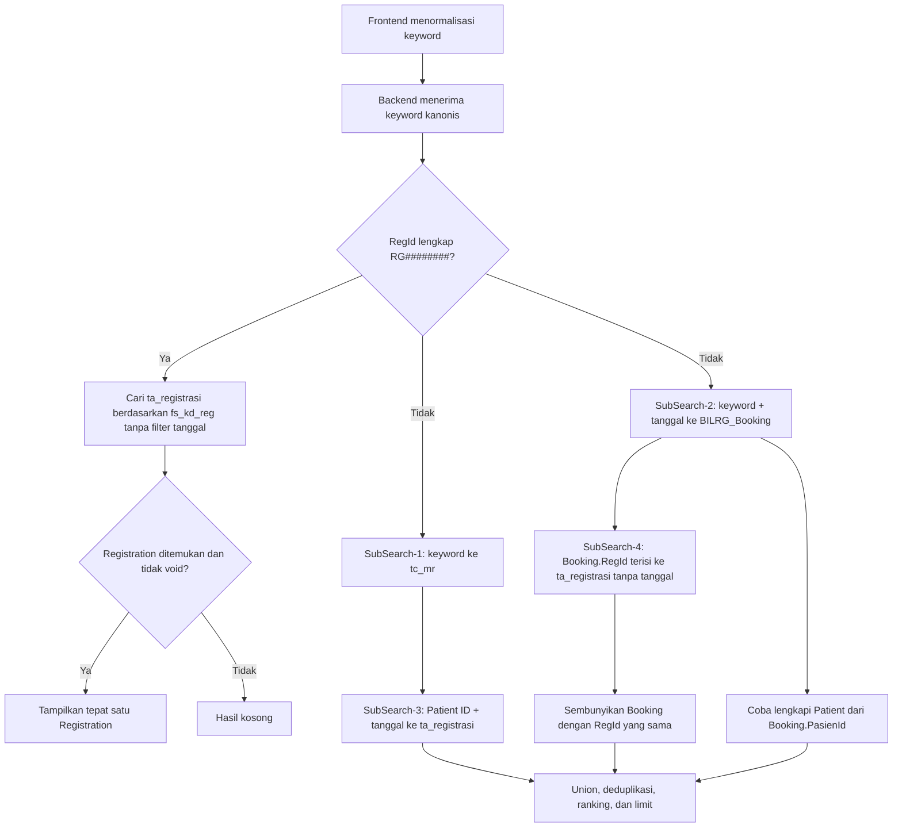

# Fitur Reg Deep Search

> Dokumen Bahasa Indonesia untuk programmer. Versi Inggris
> `reg-deep-search-feature.md` adalah spesifikasi kanonis yang digunakan sebagai
> konteks implementasi AI Agent. Jika terdapat perbedaan penafsiran, ikuti versi
> Inggris.

## 1. Tujuan

Fitur ini mencari konteks pasien rawat jalan melalui tiga tahap perjalanan
data:

```text
Pasien (tc_mr)
    → Booking (BILRG_Booking)
        → Registrasi (ta_registrasi)
```

Perubahan utama yang harus dicapai:

1. sumber hasil Registration dipindahkan dari `BILRG_RegAktif` ke
   `ta_registrasi`;
2. registrasi yang sudah discharge tetap dapat ditemukan;
3. hasil Patient, Booking bertanggal, dan Registration bertanggal digabung,
   sedangkan Booking hanya diganti melalui relasi `RegId` yang eksplisit;
4. jika Booking sudah berubah menjadi Registration, tampilkan Registration dan
   sembunyikan Booking;
5. Booking dan Registration mengikuti tanggal kunjungan yang dipilih;
6. pengecualian tanggal hanya berlaku jika backend menerima Registration ID
   lengkap berbentuk `RG########`;
7. pengguna boleh mengetik RegId ringkas seperti `RG891`, `RG-891`, atau
   `RG:891`; frontend mengubahnya menjadi `RG00000891`.

Perubahan ini hanya menyentuh proses pencarian dan konfirmasi konteks. Proses
pembuatan pasien, booking, registrasi, dan discharge tidak diubah.

## 2. Sumber data dan relasi

| Konteks | Tabel utama | Primary key | Relasi pasien | Relasi registrasi |
|---|---|---|---|---|
| Patient | `tc_mr` | `fs_mr` | — | — |
| Booking | `BILRG_Booking` | `BookingId` | `PasienId = tc_mr.fs_mr` | `RegId = ta_registrasi.fs_kd_reg` |
| Registration | `ta_registrasi` | `fs_kd_reg` | `fs_mr = tc_mr.fs_mr` | — |

Tabel `BILRG_RegAktif` tidak boleh lagi menjadi sumber Registration untuk fitur
ini. Tabel tersebut hanya menyimpan registrasi aktif dan datanya dapat dihapus
setelah pasien discharge. `ta_registrasi` menyimpan riwayat registrasi sehingga
menjadi sumber yang tepat untuk deep search.

Data tampilan dapat dilengkapi dari:

- `ta_layanan` untuk nama layanan;
- `td_peg` untuk nama dokter;
- `ta_tipe_jaminan` untuk tipe jaminan;
- `tc_mr_id` dan `tc_mr_ktp` untuk pencarian NIK bila diperlukan.

## 3. Kontrak API

Endpoint tetap menggunakan:

```http
POST /api/v1/admisi-rajal/patient-context-search
```

Contoh request:

```json
{
  "keyword": "RG00000891",
  "businessDate": "2026-07-29",
  "scope": "All",
  "limitPerType": 10,
  "suggestedBookingId": null,
  "suggestedRegistrationId": null,
  "suggestedPatientId": null
}
```

`businessDate` tetap wajib dikirim. Saat keyword merupakan RegId lengkap,
backend menerima tanggal tersebut tetapi tidak memakainya sebagai filter.

## 4. Normalisasi Registration ID di frontend

### Format yang diterima

Pengguna dapat memasukkan:

```text
RG00000891
RG891
RG-891
RG:891
```

Semua input tersebut harus dikirim ke backend sebagai:

```text
RG00000891
```

Aturannya:

- prefix `RG`, tidak case-sensitive;
- separator `-` atau `:` bersifat opsional;
- suffix berisi satu sampai delapan angka;
- suffix dipenuhi angka nol dari kiri hingga panjangnya delapan digit.

Implementasi yang direkomendasikan:

```ts
const registrationIdInputPattern = /^RG[:-]?(\d{1,8})$/i
const fullRegistrationIdPattern = /^RG\d{8}$/i

function normalizeRegistrationIdInput(value: string) {
  const normalized = value.trim().toUpperCase()
  const match = registrationIdInputPattern.exec(normalized)

  if (!match) return normalized

  return `RG${match[1].padStart(8, '0')}`
}
```

Gunakan nilai hasil normalisasi untuk `submittedQuery` dan
`request.keyword`. Nilai yang terlihat di input tidak harus diganti. Contoh:

```text
Teks di input : RG:891
Keyword API   : RG00000891
```

Mempertahankan teks asli menghindari perpindahan cursor saat pengguna masih
mengetik.

Input berikut tidak boleh di-padding:

```text
RG
RG-
RG:
RG123456789
RG-12-3
RGABC
```

Input tersebut mengikuti validasi pencarian biasa dan tidak mendapat
pengecualian tanggal.

### Tanggung jawab backend

Backend hanya mengenali bentuk kanonis:

```csharp
private static readonly Regex FullRegistrationIdPattern =
    new(@"^RG\d{8}$", RegexOptions.Compiled | RegexOptions.IgnoreCase);
```

Backend tidak mengubah `RG891` menjadi `RG00000891`. Normalisasi bentuk ringkas
sepenuhnya merupakan tanggung jawab frontend.

### Keyword nomor telepon

Keyword telepon adalah tanda `+` opsional yang diikuti 8–15 angka:

```text
081234567890
+6281234567890
```

Pencarian dilakukan secara exact setelah `trim`. Sistem tidak mengubah `+62`
menjadi `08`, tidak menghapus tanda baca, dan tidak memakai pencarian
suffix/contains.

Sumber nomor yang diperiksa:

```text
tc_mr.fs_tlp_pasien
tc_mr.fs_no_hp
tc_mr_telp.fs_no_telp
```

Gunakan SQL parameter dan `EXISTS` untuk `tc_mr_telp`, lalu deduplikasi hasil
berdasarkan `tc_mr.fs_mr`. Keyword numerik dapat sekaligus bermakna MR dan
telepon, sehingga hasil phone search digabung dengan hasil Patient search
lainnya.

## 5. Aturan filter tanggal

### Pencarian biasa

Untuk semua keyword selain RegId lengkap yang diterima backend:

| Sumber | Field tanggal | Filter |
|---|---|---|
| `BILRG_Booking` | `TglBerobat` | sama dengan `businessDate` |
| `ta_registrasi` | `fd_tgl_masuk` | sama dengan `businessDate` |
| `tc_mr` | — | tidak difilter tanggal |

Filter harus dikerjakan di SQL, bukan setelah mengambil data dalam jumlah
besar.

Booking:

```sql
WHERE booking.TglBerobat = @businessDate
  AND booking.VodDate = '3000-01-01'
```

Registration:

```sql
WHERE reg.fd_tgl_masuk = @businessDate
  AND reg.fd_tgl_void = '3000-01-01'
```

Jangan menambahkan kondisi:

```sql
reg.fd_tgl_keluar = '3000-01-01'
```

karena kondisi tersebut akan menghilangkan registrasi yang sudah discharge.

### Pencarian RegId lengkap

Jika backend menerima `RG########`, pencarian Registration tidak menggunakan
tanggal:

```sql
WHERE reg.fs_kd_reg = @registrationId
  AND reg.fd_tgl_void = '3000-01-01'
```

Jalur ini khusus untuk mengedit Registration yang ID-nya sudah diketahui.
Backend tidak menjalankan pencarian Patient maupun Booking. Jika ditemukan,
hasilnya tepat satu record Registration.

Contoh:

```text
Input pengguna : RG:891
Keyword API    : RG00000891
Tanggal UI     : 2026-07-29
Tanggal reg    : 2025-04-10
```

Registration tetap ditemukan karena backend menerima RegId lengkap.

## 6. Alur pencarian



Pseudocode jalur RegId lengkap:

```csharp
if (IsFullRegistrationId(keyword))
{
    var registration = registrationReader.GetById(keyword);

    if (registration is null || registration.IsVoided)
        return EmptyResponse(request.BusinessDate);

    return BuildResponse(
        businessDate: request.BusinessDate,
        patients: [],
        bookings: [],
        registrations: [ToRegistrationResult(registration)]);
}
```

Pseudocode jalur biasa:

```csharp
var patients = SearchPatients(keyword);                    // SubSearch-1
var bookings = SearchBookings(keyword, businessDate);      // SubSearch-2

var datedRegistrations = registrationReader.FindByPatientIds(
    businessDate,
    patients.Select(x => x.PatientId));                    // SubSearch-3

var bookingSuccessors = registrationReader.FindByRegistrationIds(
    bookings.Select(x => x.RegistrationId)
        .Where(x => !string.IsNullOrWhiteSpace(x)));        // SubSearch-4

var successorIds = bookingSuccessors
    .Select(x => x.RegistrationId)
    .ToHashSet(StringComparer.OrdinalIgnoreCase);

var visibleBookings = bookings.Where(x =>
    string.IsNullOrWhiteSpace(x.RegistrationId) ||
    !successorIds.Contains(x.RegistrationId));

patients = UnionPatients(
    patients,
    LoadExistingPatients(bookings.Select(x => x.PatientId)));
```

SubSearch-3 wajib mengikuti tanggal karena berasal dari Patient yang cocok
langsung. SubSearch-4 sengaja tidak mengikuti tanggal karena `Booking.RegId`
adalah relasi eksplisit. Ketika pengguna mencari Booking ID, backend harus:

1. menemukan Booking;
2. membaca `Booking.RegId`;
3. mencari `ta_registrasi.fs_kd_reg` menggunakan RegId tersebut;
4. menampilkan Registration dan menyembunyikan Booking jika Registration ada.

## 7. Aturan tampilan lifecycle

### Patient dipertahankan bila tersedia

| Data yang tersedia | Hasil yang ditampilkan |
|---|---|
| Patient | Patient |
| Patient + Booking | Patient + Booking |
| Patient + Registration | Patient + Registration |
| Patient + Booking + Registration | Patient + Registration |

Untuk Booking yang cocok, backend sebaiknya mencoba mengambil Patient melalui
`Booking.PasienId`. Akan tetapi, Booking dapat menunjuk pasien yang belum
tercatat di `tc_mr`. Ini adalah kondisi data yang valid untuk deep search:
Booking atau Registration penerusnya tetap harus tampil sebagai satu-satunya
record transaksi. Ketiadaan Patient tidak boleh menghilangkan transaksi atau
membuat request gagal.

Jalur exact RegId adalah pengecualian yang disengaja: jalur tersebut selalu
menghasilkan Registration saja dan tidak mengambil Patient.

### Relasi utama

Booking dianggap sudah menjadi Registration jika:

```text
BILRG_Booking.RegId = ta_registrasi.fs_kd_reg
```

Relasi eksplisit ini selalu menjadi prioritas.

### Tidak ada suppression berdasarkan dugaan

Booking hanya disembunyikan bila `Booking.RegId` terisi dan SubSearch-4
menemukan `ta_registrasi.fs_kd_reg` yang sama. Kemiripan pasien, tanggal, atau
layanan tidak boleh menyembunyikan Booking. Jika `Booking.RegId` kosong,
Booking tetap tampil walaupun SubSearch-3 menemukan Registration untuk pasien
dan tanggal yang sama.

### Urutan pemrosesan

Deduplication harus dilakukan sebelum `limitPerType`:

1. ambil kandidat dari masing-masing sumber;
2. lengkapi Patient yang diketahui melalui transaksi;
3. hubungkan Booking dengan Registration;
4. sembunyikan Booking yang sudah menjadi Registration;
5. hapus duplikat berdasarkan primary key sumber;
6. hitung rank;
7. terapkan limit;
8. hitung `total`, `hasMore`, dan `bestMatch`.

`total` tidak boleh menghitung Booking yang sudah disembunyikan.

## 8. Status Registration

Status diturunkan dari tanggal void dan tanggal keluar:

```csharp
State = registration.VoidDate != SentinelDate
    ? "Voided"
    : registration.ExitDate != SentinelDate
        ? "Discharged"
        : "Active";
```

Aturan hasil:

- `Active`: ditampilkan;
- `Discharged`: ditampilkan;
- `Voided`: tidak ditampilkan dan tidak boleh menyembunyikan Booking.

## 9. Ranking hasil

Ranking dihitung setelah rekonsiliasi lifecycle. Angka lebih kecil berarti
lebih relevan.

| Rank | Kondisi |
|---:|---|
| 10 | Exact Registration ID |
| 15 | Registration ditemukan melalui exact Booking ID |
| 20 | Exact Patient ID/MR/NIK |
| 30 | Sesuai konteks antrean yang disarankan |
| 40 | Registration lain pada tanggal terpilih |
| 50 | Booking yang belum menjadi Registration pada tanggal terpilih |
| 60 | Nama pasien sama persis |
| 70 | Nama pasien diawali keyword |
| 80 | Partial match lain yang aktif |
| 90 | Partial match Patient nonaktif |

Nilai angka boleh menjadi detail implementasi, tetapi urutan prioritasnya harus
dipertahankan.

## 10. Arti scope

`scope` diterapkan sebagai filter tampilan setelah empat sub-search dan
rekonsiliasi selesai. Scope tidak boleh mengubah cara kandidat dicari atau
direkonsiliasi.

| Scope | RegId lengkap | Keyword lain |
|---|---|---|
| `All` | Registration saja | Patient + Booking/Registration hasil rekonsiliasi |
| `Patient` | Registration saja | Patient yang cocok |
| `Booking` | Registration saja | Patient + Booking atau Registration penerus |
| `Registration` | Registration saja | Patient + Registration |

Jika Booking sudah menjadi Registration, hasil tidak boleh hilang hanya karena
scope saat itu `Booking`.

Jalur exact RegId mengabaikan scope dan selalu mengembalikan satu Registration
bila ditemukan. Untuk keyword biasa, Patient tetap dapat ditampilkan bersama
jenis transaksi yang dipilih scope. Registration dari SubSearch-4 tetap
merupakan penerus Booking pada scope `Booking`.

## 11. Konfirmasi hasil

Hasil pencarian hanya preview. Saat pengguna menekan konfirmasi, backend harus
membaca ulang data terbaru.

### Konfirmasi Registration

Ambil Registration dari:

```text
ta_registrasi.fs_kd_reg = selected Registration ID
```

Jangan menolak Registration hanya karena `fd_tgl_masuk` berbeda dari tanggal
yang sedang dipilih. ID yang dikonfirmasi sudah berbentuk lengkap sehingga
mengikuti pengecualian tanggal.

Endpoint lama boleh tetap menerima `businessDate` untuk menjaga kompatibilitas:

```http
GET /api/v1/admisi-rajal/patient-context/Registration/{id}?businessDate=...
```

### Konfirmasi Booking

Booking tetap harus memenuhi:

```text
BILRG_Booking.TglBerobat = businessDate
```

Sebelum Booking dikonfirmasi, periksa ulang apakah Registration sudah dibuat.
Jika sudah, kembalikan konteks Registration. Ini menangani kondisi ketika
registrasi dibuat setelah hasil pencarian tampil tetapi sebelum pengguna
menekan tombol.

### Konfirmasi Patient

Patient dibaca ulang dari `tc_mr` dan tidak difilter tanggal.

## 12. Rancangan backend

Gunakan reader khusus untuk riwayat registrasi:

```csharp
public interface IRegistrationHistoryReader
{
    RegistrationSearchView? GetById(string registrationId);

    IReadOnlyList<RegistrationSearchView> FindByPatientIds(
        DateOnly admissionDate,
        IReadOnlyCollection<string> patientIds);

    IReadOnlyList<RegistrationSearchView> FindByRegistrationIds(
        IReadOnlyCollection<string> registrationIds);
}
```

Reader ini lebih sesuai daripada memakai `IRegAktifRepo`, karena deep search
merupakan read projection lintas aggregate.

SQL dasarnya:

```sql
FROM ta_registrasi reg
LEFT JOIN tc_mr pasien
    ON pasien.fs_mr = reg.fs_mr
LEFT JOIN ta_layanan layanan
    ON layanan.fs_kd_layanan = reg.fs_kd_layanan
LEFT JOIN td_peg dokter
    ON dokter.fs_kd_peg = reg.fs_kd_medis
LEFT JOIN ta_tipe_jaminan jaminan
    ON jaminan.fs_kd_tipe_jaminan = reg.fs_kd_tipe_jaminan
```

Semua input pengguna harus memakai SQL parameter. Jangan memasukkan keyword
mentah ke dynamic SQL.

Perubahan handler:

1. ganti dependency `IRegAktifRepo` dengan history reader;
2. deteksi RegId kanonis `RG########`;
3. buat fast path exact RegId tanpa tanggal;
4. gunakan pencarian `ta_registrasi` berbatas tanggal untuk keyword lain;
5. lengkapi Patient dari hasil Booking/Registration;
6. rekonsiliasi lifecycle sebelum limit;
7. hitung status dari field keluar dan void;
8. ulangi pemeriksaan lifecycle saat konfirmasi.

## 13. Dampak frontend

Perubahan utama berada di
`useAdmisiRajalUniversalSearch.ts`:

1. normalisasi input RegId sebelum menentukan `submittedQuery`;
2. gunakan hasil normalisasi sebagai `request.keyword`;
3. biarkan `query.value` tetap menyimpan teks yang diketik pengguna;
4. backend tetap menjadi otoritas keputusan bypass tanggal.

Komponen `UniversalPatientContextSearch.vue` tidak perlu melakukan deduplication.
Backend harus mengirim group, count, ranking, dan `bestMatch` yang sudah
direkonsiliasi.

Tanggal tetap ditampilkan dan tetap wajib walaupun pengguna mengetik RegId
lengkap atau ringkas.

## 14. Contoh kasus

### Pasien tanpa transaksi

```text
Keyword: 001234
Tanggal: 2026-07-29
```

Hasil:

```text
Patient 001234
```

### Booking belum diregistrasikan

```text
Patient 001234
Booking BO000001, TglBerobat 2026-07-29, RegId kosong
```

Hasil:

```text
Patient 001234
Booking BO000001
```

### Booking sudah diregistrasikan

```text
Booking.RegId = RG00000891
ta_registrasi.fs_kd_reg = RG00000891
```

Hasil:

```text
Patient 001234
Registration RG00000891
```

Booking disembunyikan.

### RegId ringkas untuk registrasi lama

```text
Input pengguna : RG-891
Keyword API    : RG00000891
Tanggal UI     : 2026-07-29
Tanggal masuk  : 2025-04-10
```

Hasil:

```text
Registration RG00000891 · Discharged · 2025-04-10
```

Tanggal UI diabaikan karena backend menerima RegId lengkap. Patient dan
Booking tidak dicari ataupun ditampilkan.

### RegId tidak kanonis

```text
Input: RGABC
Tanggal: 2026-07-29
```

Frontend tidak melakukan padding. Jika pencarian dijalankan, Registration tetap
harus memenuhi `fd_tgl_masuk = 2026-07-29`.

## 15. Checklist acceptance

### Sumber dan tanggal

- [ ] Registration dibaca dari `ta_registrasi`.
- [ ] Deep search tidak bergantung pada `BILRG_RegAktif`.
- [ ] Booking biasa difilter dengan `TglBerobat`.
- [ ] Registration biasa difilter dengan `fd_tgl_masuk`.
- [ ] Discharged Registration tetap tampil.
- [ ] Voided Registration tidak tampil.
- [ ] Exact `RG########` mengabaikan tanggal.

### Normalisasi frontend

- [ ] `RG891` dikirim sebagai `RG00000891`.
- [ ] `RG-891` dikirim sebagai `RG00000891`.
- [ ] `RG:891` dikirim sebagai `RG00000891`.
- [ ] `rg891` dikirim sebagai `RG00000891`.
- [ ] `RG00000891` tetap `RG00000891`.
- [ ] Suffix lebih dari delapan digit tidak di-padding.
- [ ] Input tanpa angka atau dengan separator tidak valid tidak di-padding.
- [ ] Backend tidak melakukan konversi bentuk ringkas.
- [ ] Nomor exact dicari pada `fs_tlp_pasien`, `fs_no_hp`, dan
      `tc_mr_telp.fs_no_telp`.
- [ ] Nomor tidak dikonversi antara format `+62` dan `08`.
- [ ] Hasil phone search dideduplikasi berdasarkan MR.

### Lifecycle

- [ ] Exact RegId menghasilkan tepat satu Registration tanpa Patient/Booking.
- [ ] Patient hasil SubSearch-1 selalu tampil.
- [ ] Patient dari Booking dilengkapi bila row `tc_mr` tersedia.
- [ ] Booking tetap tampil bila `PasienId` belum ada di `tc_mr`.
- [ ] Booking tanpa Registration tetap tampil.
- [ ] Registration menyembunyikan Booking terkait.
- [ ] Suppression hanya memakai relasi eksplisit `Booking.RegId`.
- [ ] SubSearch-4 tidak memakai filter tanggal.
- [ ] Kesamaan pasien/tanggal/layanan tidak menyembunyikan Booking.
- [ ] Rekonsiliasi dilakukan sebelum limit.
- [ ] `total` dan `bestMatch` tidak menghitung Booking yang disembunyikan.
- [ ] Patient scope tidak mengirim Booking atau Registration.
- [ ] Booking scope tidak mengambil Registration hanya dari direct Patient
      ketika tidak ada Booking yang cocok.

### Konfirmasi

- [ ] Konfirmasi Registration lama tidak ditolak karena tanggal UI berbeda.
- [ ] Konfirmasi Booking tetap memeriksa `TglBerobat`.
- [ ] Konfirmasi Booking mendeteksi Registration yang baru terbentuk.
- [ ] Konfirmasi Patient tidak dibatasi tanggal.

## 16. Test minimum

Frontend:

1. normalisasi full ID;
2. normalisasi ketiga bentuk ringkas;
3. normalisasi huruf kecil;
4. suffix satu dan delapan digit;
5. penolakan suffix sembilan digit;
6. penolakan input tanpa angka dan separator ganda;
7. request mengirim nilai kanonis tanpa mengubah teks input.

Backend:

1. Patient tanpa transaksi;
2. Patient dengan Booking yang belum diregistrasikan;
3. Booking dengan active Registration;
4. Booking dengan discharged Registration;
5. Booking tanpa RegId tetap tampil bersama Registration pasien/tanggal sama;
6. Booking dengan RegId menemukan Registration tanpa filter tanggal;
7. Booking pada tanggal lain tidak muncul;
8. Registration pada tanggal lain tidak muncul dalam pencarian biasa;
9. exact RegId menemukan registrasi pada tanggal lain;
10. exact RegId mengembalikan tepat satu Registration tanpa Patient/Booking;
11. voided Registration tidak muncul dan tidak menyembunyikan Booking;
12. rekonsiliasi sebelum limit;
13. konfirmasi historical Registration;
14. konfirmasi Booking dengan tanggal berbeda ditolak;
15. race: Registration dibuat setelah search tetapi sebelum konfirmasi Booking.
16. exact phone pada ketiga sumber nomor;
17. duplikasi nomor pada beberapa sumber tetap menghasilkan satu Patient;
18. scope matrix untuk Patient, Booking, Registration, dan All.
19. exact Booking melengkapi Patient bila `tc_mr` tersedia;
20. exact Booking tetap mengembalikan transaksi bila `tc_mr` tidak tersedia.

## 17. Urutan implementasi

1. Buat projection dan history reader dari `ta_registrasi`.
2. Tambahkan test DAL untuk query tanggal dan exact RegId.
3. Ganti `IRegAktifRepo` pada patient-context handler.
4. Tambahkan exact-RegId fast path.
5. Tambahkan pengambilan Patient melalui transaksi.
6. Tambahkan rekonsiliasi Booking dan Registration.
7. Pindahkan limit serta `bestMatch` setelah rekonsiliasi.
8. Ubah confirmation agar memakai `ta_registrasi`.
9. Implementasikan normalisasi RegId ringkas di frontend.
10. Tambahkan unit test frontend dan backend.
11. Jalankan integration test menggunakan data active, discharged, dan voided.

## 18. Di luar cakupan

Perubahan ini tidak mencakup:

- migrasi atau penghapusan `BILRG_RegAktif`;
- perubahan proses create/discharge Registration;
- perubahan proses write Booking-to-Registration;
- penampilan voided Registration;
- penghapusan `businessDate` dari kontrak API;
- deduplication lifecycle di komponen Vue.
