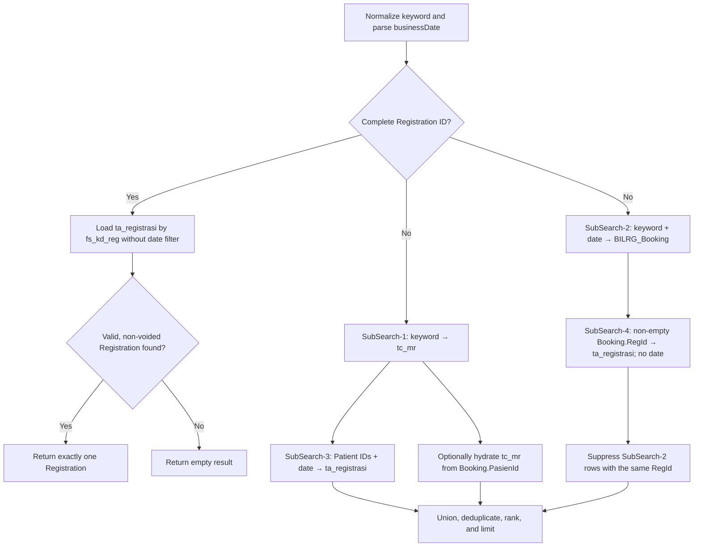

# Reg Deep Search Feature

> Canonical English specification optimized for AI-agent implementation
> context. Normative terms such as **must**, **must not**, **should**, and
> **may** describe required behavior, prohibited behavior, recommendations, and
> optional behavior respectively.

## 1. Purpose

This document defines the target behavior and implementation design for the
Admisi Rajal universal patient-context search.

The search resolves a person's outpatient visit context across three lifecycle
stages:

```text
Patient (tc_mr)
    → Booking (BILRG_Booking)
        → Registration (ta_registrasi)
```

The design has four primary goals:

1. use `ta_registrasi`, rather than `BILRG_RegAktif`, as the authoritative
   Registration search source;
2. include discharged registrations in historical search results;
3. union the Patient, dated Booking, and dated Registration sub-searches while
   replacing a Booking only through its explicit `RegId` successor;
4. apply the selected visit date consistently, except when the backend receives
   a complete Registration ID; the frontend may produce that complete ID from
   either full or simplified user input.

This document covers search and confirmation behavior. It does not change the
registration creation, discharge, or booking persistence workflows.

## 2. Source-of-truth model

| Context | Primary table | Primary key | Patient relationship | Registration relationship |
|---|---|---|---|---|
| Patient | `tc_mr` | `fs_mr` | — | — |
| Booking | `BILRG_Booking` | `BookingId` | `PasienId = tc_mr.fs_mr` | `RegId = ta_registrasi.fs_kd_reg` |
| Registration | `ta_registrasi` | `fs_kd_reg` | `fs_mr = tc_mr.fs_mr` | — |

`BILRG_RegAktif` must not be used as the Registration source for this search.
It is an active-registration projection whose rows may be removed after
discharge. `ta_registrasi` retains the historical registration and is therefore
the appropriate authority for a universal search.

Reference tables may enrich the result:

- `ta_layanan` for the service name;
- `td_peg` for the doctor name;
- `ta_tipe_jaminan` for the guarantee type;
- `tc_mr_id` and `tc_mr_ktp` for patient identity/NIK resolution where needed.

## 3. Request contract

The existing endpoint and request shape can remain:

```http
POST /api/v1/admisi-rajal/patient-context-search
```

```json
{
  "keyword": "search term",
  "businessDate": "2026-07-29",
  "scope": "All",
  "limitPerType": 10,
  "suggestedBookingId": null,
  "suggestedRegistrationId": null,
  "suggestedPatientId": null
}
```

`businessDate` remains required even when the keyword is a complete
Registration ID. In that case the backend deliberately does not use it as a
filter. Keeping the argument required preserves a stable API and UI contract.

## 4. Registration ID normalization and keyword classification

### 4.1 Frontend normalization

Users may enter either a full Registration ID or a simplified Registration ID.

Accepted forms are:

```text
RG00000891
RG891
RG-891
RG:891
```

The simplified form consists of:

1. the case-insensitive prefix `RG`;
2. an optional `-` or `:` separator;
3. between one and eight decimal digits.

The frontend converts the numeric suffix to eight digits using left-zero
padding:

```text
RG891  → RG00000891
RG-891 → RG00000891
RG:891 → RG00000891
```

Recommended frontend implementation:

```ts
const registrationIdInputPattern = /^RG[:-]?(\d{1,8})$/i
const fullRegistrationIdPattern = /^RG\d{8}$/i

function normalizeRegistrationIdInput(value: string) {
  const normalized = value.trim().toUpperCase()
  const match = registrationIdInputPattern.exec(normalized)
  if (!match) return normalized
  return `RG${match[1].padStart(8, '0')}`
}
```

The raw value may remain visible in the search field. The normalized value must
be used for `submittedQuery` and sent as `request.keyword`.

For example:

```text
Visible input:   RG:891
Request keyword: RG00000891
```

Normalization must be completed before determining whether the query is an
exact identifier and before calling the API.

Input with no numeric suffix, more than eight suffix digits, unsupported
characters, or multiple separators is not simplified-ID input:

```text
RG
RG-
RG:
RG123456789
RG-12-3
RGABC
```

These values must not be padded. They follow the ordinary search validation and
date-filter rules.

### 4.2 Backend classification

The backend must normalize the keyword before classifying it:

```csharp
var keyword = request.Keyword.Trim().ToUpperInvariant();
```

Registration IDs currently originate from:

```csharp
var regId = $"RG{newNo:D8}";
```

The backend accepts only the canonical complete Registration ID form for the
date-bypass path:

```csharp
private static readonly Regex FullRegistrationIdPattern =
    new(@"^RG\d{8}$", RegexOptions.Compiled | RegexOptions.IgnoreCase);
```

If verified historical data permits letters in the eight-character suffix, the
expression may instead be:

```text
^RG[A-Z0-9]{8}$
```

A simplified value such as `RG891` must never reach the backend as
`request.Keyword`; the frontend sends `RG00000891`. If a noncanonical value
does reach the backend, it is not a complete Registration ID and does not
bypass the date filter.

The backend must not duplicate the simplified-ID conversion. This keeps the API
contract canonical and ensures that other API consumers explicitly send full
Registration IDs.

The broad frontend/core-identifier recognition may continue to control
debouncing. Only the canonical value produced by
`normalizeRegistrationIdInput` is sent to the backend.

### 4.3 Exact phone keywords

A phone keyword is an optional `+` followed by 8–15 decimal digits:

```text
081234567890
+6281234567890
```

Phone matching is exact after trimming. The search does not convert `+62` to
`08`, strip punctuation, or perform suffix/contains matching.

Patient phone lookup must check:

```text
tc_mr.fs_tlp_pasien
tc_mr.fs_no_hp
tc_mr_telp.fs_no_telp
```

The child-table lookup uses `EXISTS`, all values are parameterized, and results
are deduplicated by `tc_mr.fs_mr`. Numeric keywords may be meaningful as both a
Patient/MR identifier and a phone, so phone matches are unioned with the
existing Patient matches.

## 5. Date-filter rules

### 5.1 Normal searches

For all backend keywords other than a canonical complete Registration ID:

| Source | Date field | Required predicate |
|---|---|---|
| `BILRG_Booking` | `TglBerobat` | `TglBerobat = businessDate` |
| `ta_registrasi` | `fd_tgl_masuk` | `fd_tgl_masuk = businessDate` |
| `tc_mr` | none | no visit-date predicate |

Date filtering should be performed by SQL/DAL queries rather than after loading
unbounded data.

Booking search should also retain the current not-voided rule:

```sql
WHERE aa.TglBerobat = @businessDate
  AND aa.VodDate = '3000-01-01'
```

Registration search should include active and discharged registrations, but
exclude voided registrations:

```sql
WHERE aa.fd_tgl_masuk = @businessDate
  AND aa.fd_tgl_void = '3000-01-01'
```

It must not require:

```sql
aa.fd_tgl_keluar = '3000-01-01'
```

because that would exclude discharged registrations.

### 5.2 Complete Registration ID

When the canonical backend keyword matches `FullRegistrationIdPattern`, neither
Booking nor Registration is constrained by the selected visit date. This
includes searches where the user entered `RG891`, `RG-891`, or `RG:891`,
because the frontend sends `RG00000891`.

The preferred execution path is an exact `ta_registrasi` lookup:

```sql
WHERE aa.fs_kd_reg = @registrationId
  AND aa.fd_tgl_void = '3000-01-01'
```

This is a terminal fast path intended for editing a known Registration. No
Patient or Booking search is performed. The result is exactly:

```text
Registration
```

not:

```text
Patient + Booking + Registration
```

If an exact Registration ID does not exist in `ta_registrasi`, the normal
response is empty. The handler must not fall through to Patient or Booking
search.

## 6. Search algorithm

### 6.1 High-level flow



### 6.2 Exact Registration ID path

Pseudocode:

```csharp
if (IsFullRegistrationId(keyword))
{
    var registration = registrationReader.GetById(keyword);
    if (registration is null || registration.IsVoided)
        return EmptyResponse(request.BusinessDate);

    return BuildResponse(
        businessDate: request.BusinessDate,
        patients: [],
        bookings: [],
        registrations: [ToRegistrationResult(registration)]);
}
```

This path intentionally returns a historical Registration even when
`fd_tgl_masuk` differs from `businessDate`.

### 6.3 Date-bounded path

Pseudocode:

```csharp
var patients = SearchPatients(keyword);                    // SubSearch-1
var bookings = SearchBookings(keyword, businessDate);      // SubSearch-2

var datedRegistrations = registrationReader.FindByPatientIds(
    businessDate,
    patients.Select(x => x.PatientId));                    // SubSearch-3

var bookingSuccessors = registrationReader.FindByRegistrationIds(
    bookings
        .Select(x => x.RegistrationId)
        .Where(x => !string.IsNullOrWhiteSpace(x)));        // SubSearch-4

var successorIds = bookingSuccessors
    .Select(x => x.RegistrationId)
    .ToHashSet(StringComparer.OrdinalIgnoreCase);

var visibleBookings = bookings.Where(x =>
    string.IsNullOrWhiteSpace(x.RegistrationId) ||
    !successorIds.Contains(x.RegistrationId));

// Design decision: a Booking may refer to a Patient not yet present in tc_mr.
// Hydration is best effort and must never suppress the transaction.
patients = UnionPatients(
    patients,
    LoadExistingPatients(bookings.Select(x => x.PatientId)));

return BuildResponse(
    businessDate: request.BusinessDate,
    patients: patients,
    bookings: visibleBookings,
    registrations: UnionRegistrations(
        datedRegistrations,
        bookingSuccessors));
```

SubSearch-3 is date-bounded because it represents visits of directly matched
Patients on the selected date. SubSearch-4 is deliberately not date-bounded:
an explicit `Booking.RegId` is an authoritative relationship even if the
Booking and Registration dates are inconsistent.

## 7. Lifecycle reconciliation

Patient and transaction-stage results have different display rules.

### 7.1 Patient rule

Every Patient found by SubSearch-1 is retained. For each matched Booking, the
handler should also attempt to load `tc_mr` by `Booking.PasienId` so an exact
Booking-ID search normally displays both the Patient and transaction.

Examples:

| Available records | Display |
|---|---|
| Patient only | Patient |
| Patient + Booking | Patient + Booking |
| Patient + Registration | Patient + Registration |
| Patient + Booking + Registration | Patient + Registration |

This is a best-effort invariant, not a referential-integrity assumption. A
Booking may legitimately reference a patient that has not yet been recorded in
`tc_mr`. In that case the Booking or its Registration successor remains
visible as a single transaction result. The missing Patient must not cause the
transaction to be discarded or the request to fail.

The exact Registration-ID fast path is the explicit exception: it returns only
the Registration and does not load Patient.

### 7.2 Explicit Booking-to-Registration relationship

The authoritative successor relationship is:

```text
BILRG_Booking.RegId = ta_registrasi.fs_kd_reg
```

If this relationship exists, the Booking is suppressed and the Registration is
shown.

### 7.3 No inferred Booking suppression

A Booking is suppressed only when its non-empty `RegId` is found as
`ta_registrasi.fs_kd_reg` by SubSearch-4. Patient/date/service similarity must
not suppress a Booking. If `Booking.RegId` is empty, that Booking remains
visible even when SubSearch-3 finds a Registration for the same Patient and
date; they are separate union records unless the explicit key proves
succession.

### 7.4 Deduplication order

Lifecycle reconciliation must occur before applying `limitPerType`. Otherwise,
superseded Bookings may consume the limit and hide valid results.

The order is:

1. retrieve source candidates;
2. resolve Patient records implied by matched transactions;
3. resolve Booking-to-Registration relationships;
4. suppress superseded Bookings;
5. remove duplicate source records by stable source key;
6. calculate ranks;
7. apply per-type limits;
8. calculate totals, `hasMore`, and `bestMatch`.

Response totals must describe the visible, reconciled result set rather than
including suppressed Booking rows.

## 8. Registration state

The Registration projection must expose enough audit data to distinguish
active, discharged, and voided rows:

```csharp
State = registration.VoidDate != SentinelDate
    ? "Voided"
    : registration.ExitDate != SentinelDate
        ? "Discharged"
        : "Active";
```

Normal and exact searches should exclude `Voided` registrations. Both `Active`
and `Discharged` registrations remain valid results.

Voided registrations must not suppress a valid Booking.

## 9. Ranking

Ranking is applied after lifecycle reconciliation. Lower values are better.

Recommended order:

| Rank | Meaning |
|---:|---|
| 10 | Exact Registration ID |
| 15 | Registration resolved from an exact Booking ID |
| 20 | Exact Patient ID/MR/NIK |
| 30 | Suggested queue-context match |
| 40 | Other Registration for the selected date |
| 50 | Unsuperseded Booking for the selected date |
| 60 | Exact patient-name match |
| 70 | Patient-name prefix match |
| 80 | Other active partial match |
| 90 | Inactive Patient partial match |

The precise numeric values may remain implementation details, but the ordering
above is part of the expected behavior.

An exact Booking ID that has already become a Registration must rank the
resolved Registration highly even though the typed keyword differs from
`ta_registrasi.fs_kd_reg`.

## 10. Scope semantics

Scope is a presentation filter applied after the four sub-searches and
reconciliation. It must not change how SubSearch-1 through SubSearch-4 derive
or reconcile candidates.

Recommended behavior:

| Scope | Complete Registration ID | Other keyword |
|---|---|---|
| `All` | Registration only | Patient + reconciled Booking/Registration |
| `Patient` | Registration only | Patient matches |
| `Booking` | Registration only | Patient + unsuperseded Booking or its Registration successor |
| `Registration` | Registration only | Patient + Registration |

The exact Registration-ID fast path overrides scope and always returns the one
Registration when found. For ordinary searches, Patient results remain visible
alongside the transaction type selected by scope. A Registration reached
through SubSearch-4 remains the successor of a matched Booking in `Booking`
scope.

## 11. Confirmation behavior

Search results are previews. Confirmation must reload the current authoritative
record and repeat lifecycle checks to avoid a race between search and user
selection.

### 11.1 Registration confirmation

Registration confirmation loads:

```text
ta_registrasi.fs_kd_reg = selected Registration ID
```

It must not reject the Registration because its `fd_tgl_masuk` differs from the
currently selected date. A selected Registration ID is complete and therefore
uses the exact-ID date exception.

The existing confirmation endpoint may retain `businessDate` for contract
compatibility:

```http
GET /api/v1/admisi-rajal/patient-context/Registration/{id}?businessDate=...
```

but the Registration lookup does not use it as a filter.

### 11.2 Booking confirmation

Booking confirmation normally requires:

```text
BILRG_Booking.TglBerobat = businessDate
```

Before confirming the Booking, the handler rechecks:

```text
Booking.RegId = ta_registrasi.fs_kd_reg
```

No Patient/date/service inference is used.

If a Registration was created after the search response, confirmation returns
the Registration context instead of confirming a stale Booking context.

### 11.3 Patient confirmation

Patient confirmation is not constrained by visit date. It reloads the current
Patient from `tc_mr`.

## 12. Backend design

### 12.1 Preferred read abstraction

Introduce a query-oriented Registration reader backed by `ta_registrasi`:

```csharp
public interface IRegistrationHistoryReader
{
    RegistrationSearchView? GetById(string registrationId);

    IReadOnlyList<RegistrationSearchView> FindByPatientIds(
        DateOnly admissionDate,
        IReadOnlyCollection<string> patientIds);

    IReadOnlyList<RegistrationSearchView> FindByRegistrationIds(
        IReadOnlyCollection<string> registrationIds);
}
```

This is preferable to reusing `IRegAktifRepo` or expanding a write-oriented
aggregate repository with cross-source search concerns.

`RegistrationSearchView` should contain at least:

```csharp
public sealed record RegistrationSearchView(
    string RegistrationId,
    DateOnly AdmissionDate,
    TimeOnly? AdmissionTime,
    string PatientId,
    string PatientName,
    DateOnly? BirthDate,
    string? Gender,
    string? ServiceId,
    string? ServiceName,
    string? DoctorId,
    string? DoctorName,
    string? GuaranteeName,
    DateOnly? ExitDate,
    DateOnly? VoidDate);
```

### 12.2 SQL projection

The projection is based on:

```sql
FROM ta_registrasi reg
LEFT JOIN tc_mr pasien
    ON pasien.fs_mr = reg.fs_mr
LEFT JOIN ta_layanan layanan
    ON layanan.fs_kd_layanan = reg.fs_kd_layanan
LEFT JOIN td_peg dokter
    ON dokter.fs_kd_peg = reg.fs_kd_medis
LEFT JOIN ta_tipe_jaminan jaminan
    ON jaminan.fs_kd_tipe_jaminan = reg.fs_kd_tipe_jaminan
```

All user-supplied values must remain parameterized. Existing full-text
name-search conventions may be reused, but dynamic SQL must not interpolate raw
keywords.

### 12.3 Application handler changes

`AdmisiRajalPatientContextHandler` should:

1. replace its `IRegAktifRepo` dependency with the history reader;
2. classify canonical complete Registration IDs separately;
3. implement the exact-ID fast path;
4. use date-bounded `ta_registrasi` search for other keywords;
5. execute the four sub-searches with their distinct date rules;
6. hydrate Booking Patients on a best-effort basis;
7. suppress a Booking only through an explicit `RegId` successor;
8. derive Registration state from exit/void audit fields;
9. repeat reconciliation during confirmation.

## 13. Frontend implementation

The current request already includes `businessDate`; no API schema change is
required.

The frontend must normalize full and simplified Registration ID input before it
builds the search request:

```ts
const registrationIdInputPattern = /^RG[:-]?(\d{1,8})$/i
const fullRegistrationIdPattern = /^RG\d{8}$/i

function normalizeRegistrationIdInput(value: string) {
  const normalized = value.trim().toUpperCase()
  const match = registrationIdInputPattern.exec(normalized)
  return match ? `RG${match[1].padStart(8, '0')}` : normalized
}

const submittedQuery = computed(() => {
  const normalized = normalizeRegistrationIdInput(query.value)
  return coreIdentifierPattern.test(normalized)
    ? normalized
    : normalizeRegistrationIdInput(debouncedQuery.value)
})
```

Consequently, all of these inputs send the same request:

```text
RG891
RG-891
RG:891
RG00000891
```

```json
{
  "keyword": "RG00000891"
}
```

The frontend owns the simplification syntax. The backend remains the authority
for recognizing the received canonical full ID and applying the date-bypass
rule.

The search input does not have to rewrite the visible user text. Keeping
`RG:891` visible while submitting `RG00000891` avoids cursor jumps during
typing. Search results and confirmed context use the canonical ID returned by
the backend.

The component should continue showing the selected date even during an exact
Registration ID search. Hiding or disabling it would create unnecessary UI
state and make subsequent searches less predictable.

No client-side Booking/Registration deduplication should be added. The backend
must return reconciled source groups so that counts, `bestMatch`, warnings, and
confirmation all agree.

## 14. Examples

### 14.1 Patient without a visit

Input:

```text
keyword = 001234
businessDate = 2026-07-29
```

Available:

```text
tc_mr: Patient 001234
```

Displayed:

```text
Patient 001234
```

### 14.2 Patient with an unregistered Booking

Available:

```text
tc_mr.fs_mr = 001234
BILRG_Booking.PasienId = 001234
BILRG_Booking.TglBerobat = 2026-07-29
BILRG_Booking.RegId = null
```

Displayed:

```text
Patient 001234
Booking BO...
```

### 14.3 Booking has become a Registration

Available:

```text
tc_mr.fs_mr = 001234
BILRG_Booking.BookingId = BO...
BILRG_Booking.PasienId = 001234
BILRG_Booking.RegId = RG12345678
BILRG_Booking.TglBerobat = 2026-07-29
ta_registrasi.fs_kd_reg = RG12345678
ta_registrasi.fs_mr = 001234
ta_registrasi.fd_tgl_masuk = 2026-07-29
```

Displayed:

```text
Patient 001234
Registration RG12345678
```

Suppressed:

```text
Booking BO...
```

### 14.4 Historical complete Registration ID

Input:

```text
keyword = RG12345678
businessDate = 2026-07-29
```

Available:

```text
ta_registrasi.fs_kd_reg = RG12345678
ta_registrasi.fs_mr = 001234
ta_registrasi.fd_tgl_masuk = 2025-04-10
ta_registrasi.fd_tgl_keluar = 2025-04-10
```

Displayed despite the different selected date:

```text
Patient 001234
Registration RG12345678, Discharged, 2025-04-10
```

### 14.5 Simplified historical Registration ID

User input:

```text
RG:891
```

Frontend request:

```text
keyword = RG00000891
businessDate = 2026-07-29
```

The backend receives a canonical full Registration ID. It therefore ignores the
selected date and performs:

```text
ta_registrasi.fs_kd_reg = RG00000891
```

The inputs `RG891` and `RG-891` produce the same request and result.

### 14.6 Noncanonical Registration-like input

Input:

```text
keyword = RGABC
businessDate = 2026-07-29
```

The frontend cannot convert `RGABC` into a canonical full Registration ID. If
the value passes ordinary search validation, Registration candidates must
satisfy:

```text
ta_registrasi.fd_tgl_masuk = 2026-07-29
```

### 14.7 Booking without an explicit Registration ID

Available on the selected date:

```text
Booking: Patient 001234, no RegId
Registration: Patient 001234, same selected date
```

Both records remain visible. The Registration does not suppress the Booking
because no explicit `Booking.RegId` proves that it is the successor.

## 15. Acceptance criteria

### Source authority

- Registration results come from `ta_registrasi`.
- Universal search does not depend on `BILRG_RegAktif`.
- Discharged, non-voided registrations remain searchable.

### Date behavior

- Normal Booking search matches `BILRG_Booking.TglBerobat` to `businessDate`.
- Normal Registration search matches `ta_registrasi.fd_tgl_masuk` to
  `businessDate`.
- Patient search has no visit-date filter.
- A complete `RG########` lookup ignores the date for Registration.
- Simplified `RG<number>`, `RG-<number>`, and `RG:<number>` input is converted
  by the frontend to `RG########`.
- The backend receives only the canonical full Registration ID for simplified
  searches.
- Noncanonical or invalid Registration-like inputs do not bypass the date.
- Exact phone searches check `tc_mr.fs_tlp_pasien`, `tc_mr.fs_no_hp`, and
  `tc_mr_telp.fs_no_telp`.
- Phone searches do not normalize country/local formats or perform fuzzy
  matching.

### Lifecycle behavior

- Exact Registration ID returns exactly one Registration and runs no other
  source search.
- A found Patient remains visible in ordinary searches.
- A matched Booking remains valid when its `PasienId` does not exist in
  `tc_mr`; the response may contain only that transaction.
- An unregistered Booking remains visible.
- A Registration suppresses its related Booking.
- Suppression requires explicit
  `BILRG_Booking.RegId = ta_registrasi.fs_kd_reg`.
- SubSearch-4 ignores the selected date.
- Patient/date/service similarity alone never suppresses a Booking.
- A voided Registration does not suppress a Booking.

### Confirmation behavior

- Historical Registration confirmation succeeds even when its admission date
  differs from the selected date.
- Booking confirmation retains the visit-date check.
- Booking confirmation detects a newly created Registration and resolves to it.
- Patient confirmation remains date-independent.

### Response behavior

- Deduplication occurs before per-type limits.
- Group totals exclude suppressed Booking results.
- `bestMatch` is selected from visible, reconciled results.
- Exact Booking-to-Registration resolution ranks ahead of unrelated matches.

## 16. Required automated tests

1. Patient-only search returns Patient.
2. Patient plus unregistered Booking returns both.
3. Patient plus linked active Registration suppresses Booking.
4. Patient plus linked discharged Registration suppresses Booking.
5. A Booking without `RegId` remains visible beside a same-Patient/date
   Registration.
6. A Booking with a non-empty `RegId` resolves its Registration without a date
   filter and is suppressed.
7. Normal Booking search excludes a different `TglBerobat`.
8. Normal Registration search excludes a different `fd_tgl_masuk`.
9. Full `RG00000891` input is submitted unchanged.
10. `RG891` input is submitted as `RG00000891`.
11. `RG-891` input is submitted as `RG00000891`.
12. `RG:891` input is submitted as `RG00000891`.
13. Lowercase simplified input is uppercased and padded.
14. One-digit and eight-digit numeric suffixes normalize correctly.
15. A suffix longer than eight digits is not padded.
16. Missing digits, unsupported characters, and multiple separators are not
    padded.
17. The backend does not implement simplified-ID conversion.
18. Complete Registration ID returns a different-date Registration.
19. Complete Registration ID returns exactly one Registration and no Patient
    or Booking.
20. Complete Registration ID does not return the earlier Booking.
21. Noncanonical Registration-like input remains date-bounded.
22. SubSearch-3 returns dated Registrations only for Patients found by
    SubSearch-1.
23. Voided Registration is excluded and does not suppress Booking.
24. Reconciliation occurs before `limitPerType`.
25. Search totals and `bestMatch` exclude suppressed Booking rows.
26. Historical Registration confirmation ignores the selected date.
27. Booking confirmation rejects a different visit date.
28. Booking confirmation resolves to a Registration created after search.
29. Exact phone finds Patients from each supported phone field and deduplicates
    repeated MR rows.
30. Patient scope emits no Booking or Registration items.
31. Booking scope does not resolve a Registration from a direct Patient match
    when no Booking matched.
32. Exact Booking search hydrates Patient from `Booking.PasienId` when the
    `tc_mr` row exists.
33. Exact Booking search still returns the transaction when the referenced
    `tc_mr` row does not exist.

## 17. Implementation sequence

1. Add the `ta_registrasi` search projection and history reader.
2. Add focused DAL/repository tests for date-bounded and exact-ID queries.
3. Replace `IRegAktifRepo` in the patient-context handler.
4. Add canonical complete Registration ID classification and the exact-ID fast
   path.
5. Add transaction-implied Patient hydration.
6. Add Booking/Registration lifecycle reconciliation.
7. Move limiting and `bestMatch` calculation after reconciliation.
8. Update confirmation to use `ta_registrasi` and apply the date exception.
9. Update application-handler tests.
10. Run API integration tests against representative active, discharged, and
    voided registrations.
11. Add frontend simplified-ID normalization and its UI/composable tests.

## 18. Out of scope

The following are not part of this change:

- migrating or deleting `BILRG_RegAktif`;
- changing Registration creation or discharge persistence;
- modifying Booking-to-Registration write workflows;
- returning voided registrations in normal patient-context search;
- removing `businessDate` from the API request;
- performing lifecycle deduplication in the Vue component.
