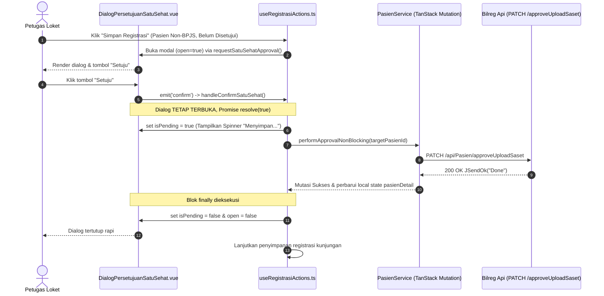

# 1. Overview

Arsitektur ini mendefinisikan realisasi teknis koreksi kecacatan sistem (*bug correction*) pada modul registrasi rawat jalan (Admisi) di antarmuka web (`c012_myhospital_web`). Koreksi ini merekayasa ulang tata kelola siklus hidup (*lifecycle*), pemisahan semantik event, serta state machine asinkron dialog konfirmasi informed consent Satu Sehat (`DialogPersetujuanSatuSehat`), sehingga penekanan tombol **Setuju** secara konsisten mengeksekusi pemanggilan endpoint `{bilreg} PATCH /api/Pasien/approveUploadSaset` dan menyimpan persetujuan pasien ke database `tc_mr_saset`.

Originating BUG ISSUE:
- [PASIEN-SATU-SEHAT-APPROVAL-BUG-002-ISSUE.md](file:///d:/project_aktif/project_MyHospitalWeb/b09-bilreg-api/docs/contexts/admisi/PASIEN-SATU-SEHAT-APPROVAL-BUG-002-ISSUE.md) (`ISSUE-ADMISI-PASIEN-SASET-BUG-002`)

Parent Architecture Reference:
- [PASIEN-SATU-SEHAT-APPROVAL-ARCHITECTURE.md](file:///d:/project_aktif/project_MyHospitalWeb/b09-bilreg-api/docs/contexts/admisi/PASIEN-SATU-SEHAT-APPROVAL-ARCHITECTURE.md) (`PASIEN-SATU-SEHAT-APPROVAL`)

---

# 2. Architectural Basis

## Business Context

- DOMAIN Rajal: [admisi-rajal-domain.md](file:///d:/project_aktif/project_MyHospitalWeb/b09-bilreg-api/docs/contexts/admisi-rajal/admisi-rajal-domain.md)
- Issue Bug: [PASIEN-SATU-SEHAT-APPROVAL-BUG-002-ISSUE.md](file:///d:/project_aktif/project_MyHospitalWeb/b09-bilreg-api/docs/contexts/admisi/PASIEN-SATU-SEHAT-APPROVAL-BUG-002-ISSUE.md)

Dalam regulasi kepatuhan Satu Sehat Kementerian Kesehatan RI, pasien dengan kelompok jaminan Non-BPJS (Umum / Asuransi Swasta) wajib memberikan persetujuan (*informed consent*) sebelum data resume medis ditransmisikan ke peladen nasional. Pada saat petugas loket mengonfirmasi persetujuan pasien melalui antarmuka pendaftaran, sistem harus menjamin bahwa rekaman persetujuan tersebut secara deterministik dicatat ke basis data rumah sakit tanpa adanya *race condition* yang membatalkan persetujuan secara diam-diam.

## Analysis Input

- BUG-INVESTIGATION: [PASIEN-SATU-SEHAT-APPROVAL-BUG-002-BUG-INVESTIGATION.md](file:///d:/project_aktif/project_MyHospitalWeb/b09-bilreg-api/docs/contexts/admisi/PASIEN-SATU-SEHAT-APPROVAL-BUG-002-BUG-INVESTIGATION.md)

Keputusan investigasi yang direalisasikan dalam arsitektur ini:
- **INV-DEC-001:** Melepaskan tombol aksi "Setuju" dari primitif auto-close dialog (`AlertDialogAction` yang membungkus `DialogClose` bawaan Reka-UI) dan menggantinya dengan tombol aksi standar (`Button`) agar klik konfirmasi tidak memicu emisi event penutupan dialog prematur.
- **INV-DEC-002:** Memperbaiki tata kelola siklus hidup modal dialog dengan menerapkan *two-phase asynchronous lifecycle*, di mana konfirmasi pengguna merefleksikan nilai Promise tanpa menutup modal dialog hingga pemanggilan endpoint selesai dieksekusi pada blok `finally`.
- **INV-DEC-003:** Mengisolasi penanganan event `cancel` hanya untuk aksi penolakan eksplisit (klik tombol "Batal" atau dismiss saat modal berada dalam kondisi idle/tidak pending).
- **INV-DEC-004:** Mempertahankan kontrak ketahanan *non-blocking fail-safe* pada `useRegistrasiActions.ts` dan visualisasi indikator loading (`isPending`) selama proses komunikasi jaringan berlangsung.

```text
ISSUE (BUG-002)
        +
BUG-INVESTIGATION (PASIEN-SATU-SEHAT-APPROVAL-BUG-002-BUG-INVESTIGATION)
        ↓
    ARCHITECTURE (PASIEN-SATU-SEHAT-APPROVAL-BUG-002-ARCHITECTURE)
```

---

# 3. Scope

## Included

1. **Frontend UI Component (`c012_myhospital_web`)**:
   - Refaktor komponen [DialogPersetujuanSatuSehat.vue](file:///d:/project_aktif/project_MyHospitalWeb/c012_myhospital_web/src/modules/Admisi/components/registrationAssistance/DialogPersetujuanSatuSehat.vue):
     - Penggantian komponen tombol "Setuju" dari `<AlertDialogAction>` menjadi `<Button>` dengan styling primer yang konsisten.
     - Penambahan proteksi pada `onOpenChange` agar tidak mengemisikan event pembatalan saat state `isPending` aktif.
     - Penjaminan tombol konfirmasi hanya memancarkan event `confirm` tanpa memicu event `cancel` atau mutasi state `open` secara sinkron.
2. **Frontend Workspace Integration (`c012_myhospital_web`)**:
   - Penyesuaian binding event pada [LegacyRegistrationWorkspace.vue](file:///d:/project_aktif/project_MyHospitalWeb/c012_myhospital_web/src/modules/Admisi/components/registrationAssistance/LegacyRegistrationWorkspace.vue):
     - Penyempurnaan listener `@update:open` agar aman terhadap siklus penutupan sukses dan tidak menimpa state `resolve` saat `isPending` sedang berjalan.
3. **Frontend Composable Orchestration (`c012_myhospital_web`)**:
   - Penegasan alur koordinasi asinkron pada [useRegistrasiActions.ts](file:///d:/project_aktif/project_MyHospitalWeb/c012_myhospital_web/src/modules/Admisi/composables/useRegistrasiActions.ts):
     - `handleConfirmSatuSehat`: Menyelesaikan Promise dengan `true`, membiarkan dialog tetap terbuka dalam status visual `isPending`.
     - `handleSubmitRegister`: Menjalankan mutasi `performApprovalNonBlocking(targetPasienId)` saat `approved === true`, mengaktifkan indikator `satuSehatDialog.isPending = true`, dan menutup dialog secara teratur di dalam blok `finally`.
     - `handleCancelSatuSehat`: Menjamin resolusi `false` hanya terjadi saat pengguna membatalkan dialog secara sengaja.
4. **Automated Testing Suite (`c012_myhospital_web`)**:
   - Pembaruan unit test [DialogPersetujuanSatuSehat.spec.ts](file:///d:/project_aktif/project_MyHospitalWeb/c012_myhospital_web/src/modules/Admisi/components/registrationAssistance/__tests__/DialogPersetujuanSatuSehat.spec.ts) untuk memverifikasi non-auto-close perilaku tombol Setuju dan isolasi event `confirm` vs `cancel`.
   - Pembaruan dan penambahan test integrasi pada [useRegistrasiActions.satuSehat.spec.ts](file:///d:/project_aktif/project_MyHospitalWeb/c012_myhospital_web/src/modules/Admisi/composables/__tests__/useRegistrasiActions.satuSehat.spec.ts) yang mensimulasikan alur klik Setuju hingga pemanggilan mutasi approval backend terverifikasi.

## Excluded

1. Modifikasi endpoint backend C# `{bilreg} PATCH /api/Pasien/approveUploadSaset` maupun DTO terkait (backend telah teruji dan fungsional).
2. Perubahan skema database atau tabel `tc_mr_saset`.
3. Perubahan alur pendaftaran jaminan BPJS (sudah berjalan dengan mekanisme *auto-approval* tanpa interaksi dialog).
4. Modifikasi fitur pendaftaran di luar konteks persetujuan Satu Sehat.

---

# 4. Technical Decisions

### TD-01: Decoupling Confirmation Action dari Primitif Modal Auto-Close
Pada arsitektur UI berbasis Reka-UI / Radix (`shadcn-vue`), primitif `<AlertDialogAction>` secara implisit membungkus komponen `<DialogClose>` yang mengeksekusi penutupan modal sinkron (`rootContext.onOpenChange(false)`). Hal ini memicu *race condition* di mana modal tertutup mendahului penyelesaian aksi asinkron.

**Keputusan Desain**:
- Ganti `<AlertDialogAction>` dengan komponen dasar `<Button>` pada footer dialog:
  ```html
  <Button
    type="button"
    class="bg-emerald-600 text-white hover:bg-emerald-700"
    :disabled="isPending"
    @click="onConfirm"
  >
    <Loader2 v-if="isPending" class="mr-2 h-4 w-4 animate-spin" />
    {{ isPending ? 'Menyimpan...' : confirmLabel }}
  </Button>
  ```
- Tombol pembatalan tetap menggunakan `<AlertDialogCancel>` atau `<Button variant="outline">` yang memanggil `onCancel`.
- Dengan pendekatan ini, klik pada tombol "Setuju" murni memicu event `@confirm` tanpa mengirimkan sinyal penutupan dialog ke root `<AlertDialog>`.

### TD-02: Guarded Modal Dismissal Lifecycle
Event handler `onOpenChange(value: boolean)` pada komponen dialog bertugas mengelola event saat pengguna menekan tombol ESC atau klik di luar modal. Jika modal sedang dalam proses eksekusi mutasi API (`isPending = true`), modal tidak boleh ditutup dan tidak boleh mengemisikan sinyal pembatalan.

**Keputusan Desain**:
```typescript
function onOpenChange(value: boolean) {
  // Cegah penutupan tidak sengaja jika operasi penyimpanan sedang berlangsung
  if (!value && props.isPending) {
    return
  }

  emit('update:open', value)
  if (!value) {
    emit('cancel')
  }
}
```
Pada parent template [LegacyRegistrationWorkspace.vue](file:///d:/project_aktif/project_MyHospitalWeb/c012_myhospital_web/src/modules/Admisi/components/registrationAssistance/LegacyRegistrationWorkspace.vue):
```html
<DialogPersetujuanSatuSehat
  :open="openDialogStates.satuSehatConfirmation"
  :patient-name="satuSehatDialog.patientName"
  :no-rm="satuSehatDialog.noRm"
  :is-pending="satuSehatDialog.isPending"
  @confirm="handleConfirmSatuSehat"
  @cancel="handleCancelSatuSehat"
  @update:open="(val) => { if (!val && !satuSehatDialog.isPending) handleCancelSatuSehat() }"
/>
```

### TD-03: Two-Phase Asynchronous Approval Lifecycle pada Composable
Alur interaksi persetujuan di dalam [useRegistrasiActions.ts](file:///d:/project_aktif/project_MyHospitalWeb/c012_myhospital_web/src/modules/Admisi/composables/useRegistrasiActions.ts) dipisahkan menjadi dua fase yang tegas:



1. **Fase 1: User Choice Resolution (Sinkron ke Promise)**
   - Saat dialog dibuka: `satuSehatDialog.resolve` menampung fungsi pemecah Promise.
   - Saat tombol "Setuju" ditekan: `handleConfirmSatuSehat()` mengeksekusi `satuSehatDialog.resolve(true)` dan mengosongkan resolver pointer (`satuSehatDialog.resolve = null`). Dialog dibiarkan tetap terbuka (`openDialogStates.satuSehatConfirmation` tetap `true`).
2. **Fase 2: Asynchronous Mutation & Controlled Teardown**
   - Di dalam `handleSubmitRegister`:
     ```typescript
     const approved = await requestSatuSehatApproval(patientName, targetPasienId)
     if (approved) {
       satuSehatDialog.isPending = true
       try {
         await performApprovalNonBlocking(targetPasienId)
       } finally {
         satuSehatDialog.isPending = false
         openDialogStates.satuSehatConfirmation = false
       }
     } else {
       openDialogStates.satuSehatConfirmation = false
     }
     ```
   - Selama `performApprovalNonBlocking` berlangsung, seluruh tombol aksi dalam modal terkunci (`disabled = true`) dan tombol aksi utama menampilkan teks `Menyimpan...` dengan indikator spinner.
   - Ketika pemanggilan API selesai (baik berhasil maupun ditangkap oleh *fail-safe non-blocking*), state `isPending` di-reset ke `false` dan visibilitas dialog diubah menjadi `false` pada blok `finally`.

---

# 5. Component Responsibilities

| Component | Responsibility |
|---|---|
| `DialogPersetujuanSatuSehat.vue` | Komponen presentasional modal informed consent Satu Sehat. Bertanggung jawab me-render data pasien, mengisolasi event emisi `confirm` vs `cancel`, menampilkan indikator `isPending`, serta mencegah dismiss saat asinkron aktif. |
| `LegacyRegistrationWorkspace.vue` | Komponen tampilan form admisi rawat jalan. Bertanggung jawab menghubungkan state reaktif modal (`openDialogStates.satuSehatConfirmation`, `satuSehatDialog`) dengan composable aksi tanpa memicu pembatalan prematur. |
| `useRegistrasiActions.ts` | Composable orkestrator bisnis registrasi admisi. Bertanggung jawab mengelola Promise `requestSatuSehatApproval`, memicu mutasi `useApproveUploadSaset`, menjamin ketahanan non-blocking, serta mengendalikan urutan penutupan dialog. |
| `PasienService.ts` (`useApproveUploadSaset`) | Client API service berbasis TanStack Query yang mengirimkan payload mutasi HTTP PATCH ke backend `/api/Pasien/approveUploadSaset`. |
| `Bilreg.Api: PasienController` | Menangani endpoint `{PATCH} /api/Pasien/approveUploadSaset` dan mengembalikan respons terstandarisasi `JSendOk("Done")`. |

---

# 6. Integration Design

| Source | Target | Purpose |
|---|---|---|
| `DialogPersetujuanSatuSehat.vue` (Tombol Setuju) | `DialogPersetujuanSatuSehat.vue` (`emit('confirm')`) | Memancarkan event konfirmasi eksplisit dari klik tombol `<Button>` tanpa memicu `reka-ui DialogClose`. |
| `DialogPersetujuanSatuSehat.vue` (`@confirm`) | `useRegistrasiActions.ts` (`handleConfirmSatuSehat`) | Menyelesaikan Promise persetujuan dengan status `true` dan mempertahankan modal tetap terbuka. |
| `useRegistrasiActions.ts` (`handleSubmitRegister`) | `PasienService.ts` (`useApproveUploadSaset`) | Mengirimkan mutasi HTTP PATCH approval Satu Sehat ke backend dengan parameter `pasienId`. |
| `useRegistrasiActions.ts` (`finally` block) | `LegacyRegistrationWorkspace.vue` (`openDialogStates`) | Menutup modal konfirmasi secara aman setelah mutasi selesai dieksekusi. |
| `DialogPersetujuanSatuSehat.vue` (Tombol Batal) | `useRegistrasiActions.ts` (`handleCancelSatuSehat`) | Menyelesaikan Promise dengan status `false` dan menutup modal konfirmasi saat pasien menolak. |

---

# 7. Data Ownership

| Data | Owner |
|---|---|
| Status Persetujuan Satu Sehat Pasien (`tc_mr_saset`) | Backend `Bilreg.Domain.PasienContext.PasienFeature` |
| Local Pasien Detail Cache (`pasienDetail.value.pasienSaset`) | Frontend Reactive State (`LegacyRegistrationWorkspace` / TanStack Query cache) |
| Dialog State Machine (`satuSehatDialog.isPending`, `resolve`, `openDialogStates`) | Frontend Composable State (`useRegistrasiActions`) |

---

# 8. Database Design

## New Tables
Tidak ada tabel baru.

## Modified Tables
Tidak ada modifikasi skema tabel database.

## Relationships
Tidak ada perubahan relasi. Relasi 1-to-1 antara `tc_mr` dan `tc_mr_saset` tetap berlaku seperti yang didefinisikan pada [PASIEN-SATU-SEHAT-APPROVAL-ARCHITECTURE.md](file:///d:/project_aktif/project_MyHospitalWeb/b09-bilreg-api/docs/contexts/admisi/PASIEN-SATU-SEHAT-APPROVAL-ARCHITECTURE.md).

## Migration Considerations
Tidak ada migrasi database atau data backfill yang diperlukan.

---

# 9. Cross-Cutting Concerns

### 1. Concurrency & Race Condition Elimination
Dengan mengganti primitif `<AlertDialogAction>` menjadi `<Button>` standar dan melindungi handler `onOpenChange(false)` dengan penjaga `!isPending`, *race condition* antara siklus penutupan modal DOM dan eksekusi handler Promise sepenuhnya dieliminasi.

### 2. UI Responsiveness & Visual Feedback
Pengguna (petugas loket) mendapatkan kepastian visual (*visual affordance*) saat menyetujui persetujuan:
- Tombol "Setuju" bertransisi menampilkan spinner `Loader2` dan teks "Menyimpan...".
- Seluruh tombol kontrol terkunci (`disabled = true`) untuk mencegah *double-submit* atau interupsi tak terduga.
- Modal tertutup secara otomatis setelah sistem selesai memproses mutasi.

### 3. Non-Blocking Resilience Preservation
Koreksi ini mempertahankan prinsip ketahanan sistem (*fail-safe non-blocking*):
- Jika koneksi HTTP ke backend `/api/Pasien/approveUploadSaset` mengalami kegagalan/timeout, kesalahan ditangkap di level `performApprovalNonBlocking`.
- Dialog tetap tertutup rapi pada blok `finally`.
- Pesan peringatan (*warning toast*) ditampilkan, dan pendaftaran rawat jalan tetap diproses hingga selesai tanpa menghambat operasional loket.

---

# 10. Implementation Constraints

1. **Kompatibilitas Komponen Primitif UI**:
   - Penggantian tombol aksi tidak boleh merusak layout footer modal. Gunakan komponen `<Button>` yang tersedia di `@/shared/components/ui/button` dengan varian atau kelas Tailwind emerald (`bg-emerald-600 hover:bg-emerald-700 text-white`).
2. **Keterisolasian State Composable**:
   - Properti `satuSehatDialog.resolve` harus selalu di-reset menjadi `null` segera setelah dieksekusi untuk mencegah kebocoran referensi memori (*memory leak*) atau eksekusi ganda.
3. **Integritas Pengujian Vitest**:
   - Seluruh pengujian unit dan integrasi pada `DialogPersetujuanSatuSehat.spec.ts` dan `useRegistrasiActions.satuSehat.spec.ts` wajib disesuaikan dengan arsitektur baru dan harus lulus 100% (*GREEN*).

---

# 11. Acceptance Conditions

1. Tombol "Setuju" pada `DialogPersetujuanSatuSehat.vue` diimplementasikan menggunakan komponen `<Button>` standar (bukan primitif auto-close `AlertDialogAction`).
2. Menekan tombol "Setuju" pada modal persetujuan Satu Sehat tidak memicu penutupan dialog seketika dan tidak memancarkan event `cancel`.
3. Modal dialog menampilkan indikator loading spinner dan tombol dalam kondisi ter-disable selama `satuSehatDialog.isPending === true`.
4. Saat petugas mengklik "Setuju" pada formulir admisi pasien Non-BPJS, sistem mengeksekusi pemanggilan HTTP PATCH ke endpoint `/api/Pasien/approveUploadSaset` dengan payload `{ pasienId }`.
5. Setelah pemanggilan endpoint approval selesai (sukses maupun gagal non-blocking), modal dialog tertutup secara teratur dan proses simpan registrasi kunjungan dilanjutkan.
6. Menekan tombol "Batal" atau menutup modal saat idle membatalkan persetujuan secara benar (tidak memanggil endpoint approval) dan melanjutkan simpan registrasi biasa.
7. Seluruh unit test pada `DialogPersetujuanSatuSehat.spec.ts` dan `useRegistrasiActions.satuSehat.spec.ts` berhasil dieksekusi dengan status *PASS*.
