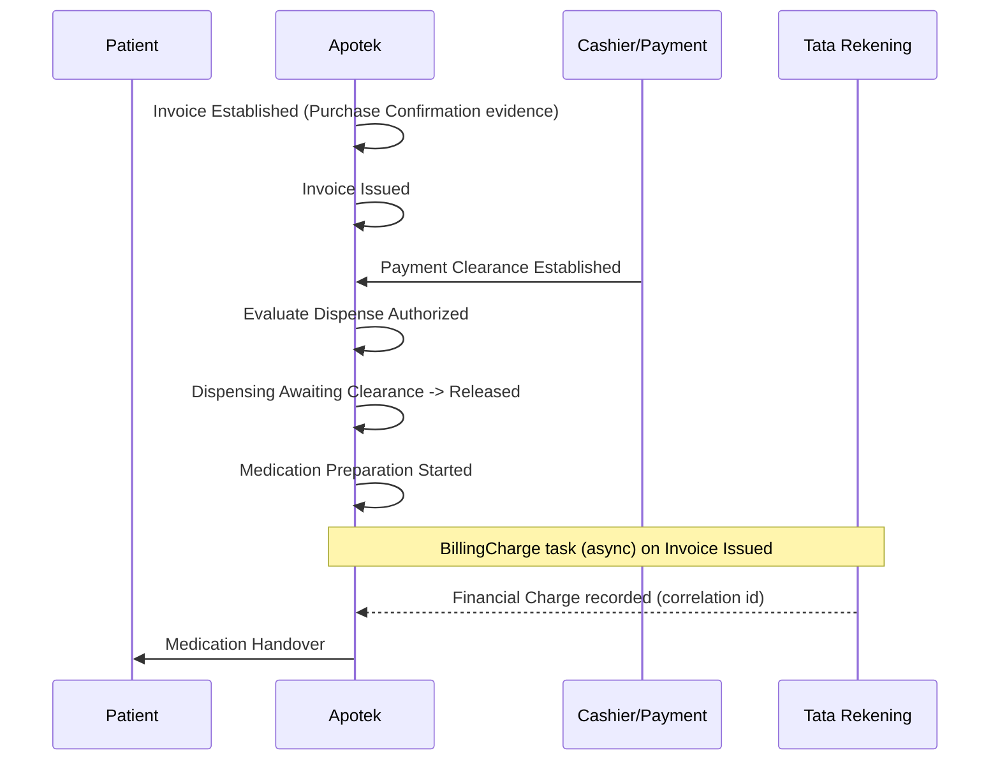
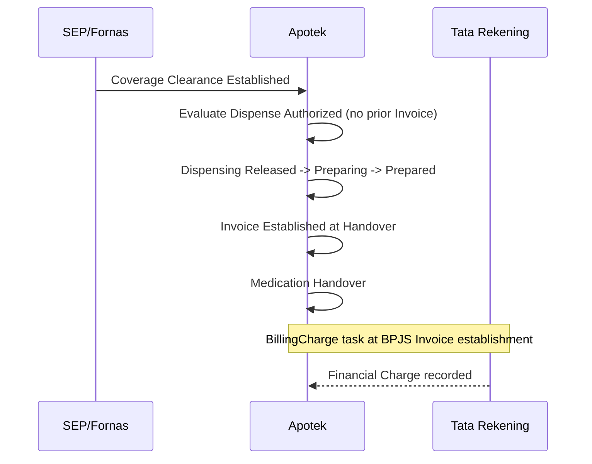

# Apotek Financial Clearance — Architecture / Domain Analysis Report

**Canonical mutability update (2026-08-18):** Section 6 below described the pre-decision Invoice freeze. That freeze is withdrawn. Invoice mutability is now governed by Tata Rekening permission (`ADR-APT-003`, **BR-APT-027**, **PD-05**). Financial Clearance remains **not** an Apotek object (BA-08). See [`APOTEK-INVOICE-MUTABILITY-ARTIFACT-UPDATE-REPORT.md`](APOTEK-INVOICE-MUTABILITY-ARTIFACT-UPDATE-REPORT.md).

**Scope:** Outpatient Apotek (`Pelayanan Obat Pasien`) — financial clearance terminology, ownership, lifecycle, and cross-context alignment with Tata Rekening, Payment, and related bounded contexts.

**Repository state:** Analyzed from canonical Apotek artifacts (2026-08-16 BA-08 ratification onward), Tata Rekening domain/SOP artifacts, Lab billing-release reference model, and persistence design. **No Apotek target implementation exists in code** (`ApotekContext` absent; legacy `PenjualanModel` / DU-Bill remains).

**Task type:** Analysis only — no code, migration, or artifact change produced.

**Related reports:** [`docs/contexts/lab/LAB_FINANCIAL-CLEARENCE-ANALYSIS-REPORT.md`](../lab/LAB_FINANCIAL-CLEARENCE-ANALYSIS-REPORT.md) (Lab release-validation model); [`docs/contexts/apotek/ALN-002-RESOLUTION-REPORT.md`](ALN-002-RESOLUTION-REPORT.md) (BA-08 terminology alignment).

---

## 1. Executive Summary

Across current artifacts, **Financial Clearance is not a canonical domain object in Apotek**. The ratified decision **BA-08** ([`outpatient-apotek-repository-gap-analysis-report.md`](outpatient-apotek-repository-gap-analysis-report.md) §BC-08, §9.1) retires both **Financial Clearance** and **Fulfillment Clearance** as aggregates, entities, persisted objects, or transaction boundaries. What exists instead is:

1. **Inbound financial/coverage evidence** owned by external authorities (Cashier/Payment, SEP/Fornas).
2. A **Pharmacy policy evaluation** — **Dispense Authorized** — that decides whether Medication Preparation may start.
3. **Invoice lifecycle states** (including **Financially Cleared**) on the Apotek `Invoice` aggregate.
4. **Registration-level financial control** owned by **Tata Rekening** (verification, adjustment, finalization, settlement initiation) — which **does not define** a term *Financial Clearance*.

The phrase *financial clearance* still appears in several Apotek rules and SOPs as an **informal condition** (“after payment or financial clearance”) meaning *payer conditions sufficient for preparation have been met*. That usage is **not** the retired object name from pre-BA-08 artifacts.

**Tata Rekening** owns **Financial Truth** at registration scope (`OPEN` → `CLOSED` → `FINALIZED` → `LUNAS`). **Apotek** owns **Medication Sale / Invoice** and evaluates whether preparation may proceed. **Payment / Cashier** owns **Payment Clearance** and **Payment Settlement**. These layers are related but **not synonymous**.

**Lab** provides a contrasting pattern: release eligibility **truth** belongs to BIL; LWF calls `ValidateReleaseEligibility` and stores **audit trace only** ([`lab-domain.md`](../lab/lab-domain.md) §8). Apotek artifacts **do not** adopt that synchronous “ask BIL before release” model for dispensing; they use **local Dispense Authorized evaluation** over snapshotted evidence.

---

## 2. Explicit Definitions Found in Artifacts

### 2.1 Apotek — ratified negative definition (BA-08)

| Source | Definition |
|--------|------------|
| [`outpatient-apotek-repository-gap-analysis-report.md`](outpatient-apotek-repository-gap-analysis-report.md) BC-08 / §9.1 | *There is no Financial Clearance or Fulfillment Clearance domain object.* Pharmacy policy evaluates financial/coverage evidence to determine **Dispense Authorized** before preparation and dispensing. |
| [`ALN-002-RESOLUTION-REPORT.md`](ALN-002-RESOLUTION-REPORT.md) | Same BA-08 wording; Dispense Authorized is a policy evaluation result, not persisted, not a source of truth, not a transaction boundary. |
| [`outpatient-apotek-persistence-design.md`](outpatient-apotek-persistence-design.md) §2.2 | **Financial Clearance / Fulfillment Clearance objects** → **No table** (BA-08). |
| [`outpatient-apotek-screen-and-aggregate-design.md`](outpatient-apotek-screen-and-aggregate-design.md) §5.3 | **Dispense Authorized (BA-08):** preparation authorization; no parallel clearance object. |

### 2.2 Apotek — canonical positive terms

| Term | Source | Explicit definition |
|------|--------|---------------------|
| **Payment Clearance** | [`apotek-domain.md`](apotek-domain.md) §2 glossary | *Evidence that the required payment condition has been satisfied.* |
| **Coverage Clearance** | [`apotek-domain.md`](apotek-domain.md) §2 glossary | *Evidence that the applicable payer authorizes fulfillment without immediate Patient payment* (outpatient BPJS: valid SEP + authoritative Fornas mapping). |
| **Dispense Authorized** | [`apotek-domain.md`](apotek-domain.md) §2 glossary | *A policy evaluation result indicating medication preparation and dispensing may start, derived from financial and coverage evidence.* Not an aggregate, entity, source of truth, or transaction boundary. |
| **Financially Cleared** | [`apotek-domain.md`](apotek-domain.md) §8.3 Invoice lifecycle | Invoice state after `Issued`; *may be supported by Payment Clearance or Coverage Clearance according to payer policy.* Payment/settlement evidence remains externally owned. |
| **Financial Charge** | [`apotek-domain.md`](apotek-domain.md) §2 glossary | *The financial consequence supplied to Tata Rekening from a Medication Sale.* |
| **Financial Adjustment** | [`apotek-domain.md`](apotek-domain.md) §2 glossary | *An accountable correction to a Medication Sale or its financial consequences.* |

### 2.3 Apotek — explicit rejection of Financial Clearance as aggregate

| Rule | Source | Wording |
|------|--------|---------|
| **BR-APT-122** | [`apotek-domain.md`](apotek-domain.md) §7.5 | Patient-Pay Sales Order requires **Payment Clearance** under the normal self-pay workflow before Dispense Authorized. *This is financial evidence evaluation, not a Financial Clearance aggregate.* |
| **BR-APT-043** | [`apotek-domain.md`](apotek-domain.md) §7.5 | Dispense Authorized shall not be persisted as aggregate, entity, source of truth, or transaction boundary. |

### 2.4 Apotek — “financial clearance” as informal condition (not object name)

These rules use the phrase descriptively for *post-payment / post-authorization* scenarios:

| Rule | Source | Meaning in context |
|------|--------|-------------------|
| **BR-APT-046** | [`apotek-domain.md`](apotek-domain.md) §7.5 | *A financial clearance followed by non-fulfillment* → requires Unfulfilled Medication Outcome + Credit Note/Refund. |
| **BR-APT-118** | [`apotek-domain.md`](apotek-domain.md) §7.9 | Shortage *after Sales Order establishment or financial clearance* → Unfulfilled outcome + commercial correction. |
| **BR-APT-045** | [`apotek-domain.md`](apotek-domain.md) §7.5 | *A paid or financially cleared Invoice* does not guarantee fulfillment. |

SOP exception text mirrors this informal usage ([`SOP-APT-RJ-003-Pelayanan-Obat-Pasien-Umum-EN.md`](sop/SOP-APT-RJ-003-Pelayanan-Obat-Pasien-Umum-EN.md) §5.2; ID companion).

### 2.5 Apotek — glossary mapping to legacy cashier language

| Term | Mapped term | Source |
|------|-------------|--------|
| Payment Clearance | Status Lunas | [`sop/DAFTAR-SOP-APT-RJ.md`](sop/DAFTAR-SOP-APT-RJ.md) glossary |

### 2.6 Tata Rekening — no “Financial Clearance” term

Tata Rekening artifacts define **Financial Verification**, **Financial Adjustment**, **Financial Responsibility Allocation**, **Finalize Financial Responsibility**, **Settlement Initiation**, and **Payment Settlement** — not Financial Clearance.

| Term | Source | Role |
|------|--------|------|
| **Financial Verification** | [`SOP-TR-04 — Financial Verification.md`](../TataRekening/SOP-TR-04 — Financial Verification.md) | Validates Billing Set completeness/consistency on **CLOSED** billing before allocation. Does not add/change/delete charges. |
| **Financial Adjustment** | [`SOP-TR-05 — Financial Adjustment.md`](../TataRekening/SOP-TR-05 — Financial Adjustment.md) | Accountable correction when verification finds discrepancies. |
| **FINALIZED** | [`02-domain.md`](../TataRekening/02-domain.md) §Lifecycle | Financial Responsibility locked. |
| **LUNAS** | [`02-domain.md`](../TataRekening/02-domain.md) §Lifecycle | *Seluruh kewajiban finansial telah diselesaikan.* |
| **Payment Settlement** | [`01-context.md`](../TataRekening/01-context.md) §Responsibility Boundary | Owned by **Cashier**, not Tata Rekening. |

Charge Source (including Apotek as medication sale originator) forms **Financial Charge**; Tata Rekening manages **Financial Truth** at registration level ([`01-context.md`](../TataRekening/01-context.md) §Operational vs Financial Truth).

### 2.7 Laboratory — explicit Financial Clearance semantics (cross-context reference)

| Source | Definition |
|--------|------------|
| [`lab-integration.md`](../lab/lab-integration.md) Rule 4 | Financial clearance determines *whether results may be released*; it is *not payment state, not workflow state.* |
| [`lab-domain.md`](../lab/lab-domain.md) §8 | Release eligibility **truth** belongs to **BIL**; LWF stores **LastBillingRelease\*** audit trace only. **OBSOLETE:** approval/reject financial clearance lifecycle. |

Lab’s canonical model is **Billing Release Validation** (`CLEAR` / `BLOCKED`), not an Apotek-style Dispense Authorized evaluation.

---

## 3. Implicit Definitions Inferred from Rules and Workflows

### 3.1 Apotek — what “financial clearance” means in practice

When artifacts say *financial clearance* without defining an object, they implicitly mean:

> **The payer-specific evidence required for Dispense Authorized has been satisfied for the applicable Sales Order Item quantities.**

Evidence paths ([`outpatient-apotek-screen-and-aggregate-design.md`](outpatient-apotek-screen-and-aggregate-design.md) §5.3; [`outpatient-apotek-workflow.md`](outpatient-apotek-workflow.md)):

| Payer path | Implicit “cleared” condition | Primary evidence | Invoice timing (outpatient) |
|------------|------------------------------|------------------|----------------------------|
| **General Patient** | Self-pay obligation met | Invoice established + **Payment Clearance** | Invoice **before** preparation ([`WF-APT-RJ-003`](outpatient-apotek-workflow.md)) |
| **BPJS covered** | Coverage obligation met | Valid SEP + **Coverage Clearance** (Fornas) | Invoice **at successful handover** ([`WF-APT-RJ-004`](outpatient-apotek-workflow.md)) |
| **Patient-Pay split (mixed)** | Per-item path | Covered → Coverage Evidence; Patient-Pay → Payment Clearance | Independent Sales Orders ([`WF-APT-RJ-005`](outpatient-apotek-workflow.md), BC-14) |

**Dispense Authorized** is the operational gate name; **Financially Cleared** is the Invoice state name after commercial settlement evidence is reflected.

### 3.2 Dispensing lifecycle encodes clearance outcome, not a clearance aggregate

[`apotek-domain.md`](apotek-domain.md) §8.4:

```text
Established
  -> Awaiting Clearance
  -> Released
  -> Preparing
  ...
```

- **Awaiting Clearance:** Dispensing exists; preparation blocked pending policy evaluation.
- **Released:** Dispense Authorized evaluation passed; `ReleasedAt` recorded ([`outpatient-apotek-persistence-design.md`](outpatient-apotek-persistence-design.md) §8.6).
- Policy is **re-evaluated** at `Release` / `PreparationStarted`; no authorization row is persisted (§11).

### 3.3 Tata Rekening — implicit relationship to Apotek “clearance”

Inferred from [`outpatient-apotek-persistence-design.md`](outpatient-apotek-persistence-design.md) §11 Integration Task `BillingCharge`:

- Apotek emits **Financial Charge** to `ta_trs_billing` when Invoice is **Issued** (General) or at **BPJS handover** (Obat module).
- **Payment Clearance** is inbound evidence snapshotted on Invoice (`PaymentClearanceReff`, `PaymentClearedAt`); Apotek does **not** emit it.
- Tata Rekening **FINALIZED / LUNAS** applies to the **registration Billing Set**, not to a single pharmacy Invoice lifecycle state. A pharmacy Invoice may be **Financially Cleared** while the registration Tata Rekening is still `OPEN` or `CLOSED`.

### 3.4 Lab contrast (not adopted by Apotek artifacts)

Lab implies: operational context **must ask BIL synchronously** on each release attempt. Apotek artifacts imply: Pharmacy **evaluates snapshotted evidence locally** at command time; Tata Rekening charge posting is **async** via Integration Task Table (BA-07).

---

## 4. Related Statuses and State Transitions

### 4.1 Apotek Invoice lifecycle

Source: [`apotek-domain.md`](apotek-domain.md) §8.3

```text
Established
  -> Issued
       -> Financially Cleared
            -> Resolved

Established or Issued
  -> Cancelled

Issued or Financially Cleared
  -> Adjusted or Credited
       -> Resolved
```

| Transition | Typical trigger | Financial-clearance relevance |
|------------|-----------------|------------------------------|
| Established → Issued | Invoice committed for collection / charge | General Patient: follows Purchase Confirmation ([`BR-APT-070`](apotek-domain.md)) |
| Issued → Financially Cleared | Payment Clearance consumed | Self-pay path; maps informally to glossary “Status Lunas” |
| Financially Cleared → Adjusted or Credited | Shortage, no-show, correction | **BR-APT-027**, **BR-APT-046**, **BR-APT-118** |
| → Cancelled | Only while lifecycle permits | Blocked preparation if payment incomplete ([`outpatient-apotek-workflow.md`](outpatient-apotek-workflow.md) WF-003 exceptions) |

### 4.2 Apotek Dispensing lifecycle (clearance gate)

Source: [`apotek-domain.md`](apotek-domain.md) §8.4

| State | Meaning |
|-------|---------|
| `Awaiting Clearance` | Waiting for Dispense Authorized evaluation |
| `Released` | Policy evaluation passed; preparation allowed |
| `Preparing` … `Completed` | Physical fulfillment progression |

Queue projection **Awaiting Clearance** (ALN-007) is a worklist label aligned to this Dispensing state, not a retired Payment Confirmation queue status.

### 4.3 Apotek domain events (evidence consumption)

| Event | Owner | Role |
|-------|-------|------|
| `Payment Clearance Established` | Payment / Cashier | Inbound evidence for self-pay Dispense Authorized |
| `Coverage Clearance Established` | SEP / Fornas authorities | Inbound evidence for BPJS Dispense Authorized |
| `Dispense Authorized Evaluated` | Apotek (observed) | Policy outcome at evaluation time; not a persisted aggregate |
| `Invoice Established` / `Invoice Issued` | Apotek | Commercial document lifecycle |

### 4.4 Tata Rekening registration lifecycle

Source: [`02-domain.md`](../TataRekening/02-domain.md), [`01-context.md`](../TataRekening/01-context.md)

```text
OPEN -> CLOSED -> FINALIZED -> LUNAS
```

| Status | Mutability of Billing Set |
|--------|---------------------------|
| OPEN | Charge Sources may still post Financial Charges |
| CLOSED | Frozen for Financial Control; verification/adjustment phase |
| FINALIZED | Financial Responsibility locked; changes require Cancel Finalization / Reopen per SOP |
| LUNAS | Payment Settlement complete (Cashier authority) |

**Financial Verification** (SOP-TR-04) is a **validation act**, not a stored “clearance” status on TrsBill.

### 4.5 End-to-end outpatient General Patient (WF-APT-RJ-003)



### 4.6 End-to-end outpatient BPJS (WF-APT-RJ-004)



---

## 5. Ownership and Authority

### 5.1 Authority matrix

| Concern | Canonical owner | Apotek role | Tata Rekening role |
|---------|-----------------|-------------|-------------------|
| **Payment Clearance** evidence | Cashier / Payment | Consumes; snapshots on Invoice | None (pre-settlement) |
| **Coverage Clearance** evidence | SEP / Fornas | Consumes for BPJS evaluation | None |
| **Dispense Authorized** decision | Apotek (policy evaluation) | Evaluates at command time; not persisted | None |
| **Invoice** commercial document | Apotek aggregate | Owns lifecycle incl. Financially Cleared | Receives Financial Charge |
| **Financial Adjustment / Credit Note / Refund** | Tata Rekening (+ Cashier for refund execution) | Initiates via accountable outcomes | Owns registration financial corrections |
| **Financial Verification / Finalization** | Tata Rekening (Verifikator) | Supplies charge facts | Owns Billing Set truth |
| **Payment Settlement** | Cashier | None | Hands off at Settlement Initiation (SOP-TR-10) |
| **Financial Clearance** as domain object | **None (retired BA-08)** | — | — |
| **Billing release validation (Lab pattern)** | BIL / Tata Rekening billing module | **Not specified** for Apotek dispensing | Lab-only canonical pattern |

### 5.2 Boundary statements (explicit)

From [`apotek-domain.md`](apotek-domain.md) §1.3:

- **Payment** owns receipts and settlement evidence.
- **Tata Rekening** owns registration-level Financial Responsibility, payer allocation, finalization, and settlement initiation.
- **Apotek** owns Invoice, Dispensing, and Dispense Authorized **evaluation** — not payment settlement or registration finalization.

From [`outpatient-apotek-persistence-design.md`](outpatient-apotek-persistence-design.md) §2.2:

- Payment settlement and Tata Rekening lifecycle → `ta_trs_billing` / `BILRG_TataRekening` only.
- Payment Clearance and SEP/Fornas → **inbound evidence**; Apotek snapshots references only.

### 5.3 Actor responsibilities (workflow)

| Actor | Authority | Cannot do |
|-------|-----------|-----------|
| Cashier | `Payment Clearance Established` | Establish medication eligibility or fulfillment quantity ([`apotek-domain.md`](apotek-domain.md) §4.5) |
| Pharmacy System | Evaluate Dispense Authorized; transition Dispensing | Emit Payment Clearance; own Tata Rekening lifecycle |
| Verifikator (Tata Rekening) | Financial Verification, Adjustment, Finalization | Operational dispensing or Apotek Invoice mutation |

---

## 6. Invoice Mutability Implications

**Superseded as current policy.** The tables in this section record the **pre-2026-08-18 freeze**. Canonical behavior is now: Invoice remains mutable while Tata Rekening still permits modification; Credit Note / Refund / Financial Adjustment are exception mechanisms when revision is no longer permitted. Apotek does not own Financial Clearance rules.

### 6.1 Apotek Invoice immutability rules (historical freeze — withdrawn)

| Phase | Mutability | Source |
|-------|------------|--------|
| `InvoiceStatus = Established` | Items/charges may rewrite (delete+insert) | [`outpatient-apotek-persistence-design.md`](outpatient-apotek-persistence-design.md) PD-05 |
| After leaving `Established` | Header and item content **immutable** | PD-05 |
| Issued or Financially Cleared | Corrections via **Credit Note**, Integration Task, Financial Adjustment — **not** silent row edit | **BR-APT-027**, PD-05 |
| Financially Cleared + non-fulfillment | Unfulfilled Medication Outcome + Credit Note/Refund | **BR-APT-046**, **BR-APT-118**, **BR-APT-080** (no-show after payment) |

### 6.2 Relationship between “financial clearance” and invoice mutability

| Scenario | Invoice state | Allowed correction path |
|----------|---------------|-------------------------|
| Payment incomplete after Issued | Issued (not Financially Cleared) | Cancel while lifecycle permits; preparation blocked |
| Paid / Financially Cleared, then shortage | Financially Cleared | Credit Note + Refund via Tata Rekening; no Sales Order Item substitution (**BR-APT-118**) |
| Issued or Financially Cleared needs amount fix | Issued or Financially Cleared | Financial Adjustment / Credit Note under Tata Rekening — *do not silently replace* ([`outpatient-apotek-workflow.md`](outpatient-apotek-workflow.md) WF-003) |
| BPJS handover fails after preparation | No Invoice yet (WF-004) | No Invoice cancellation required; no BPJS charge |
| BPJS Invoice at handover | Established/Issued at handover moment | Async `BillingCharge`; corrections follow **BR-APT-027** if later adjusted |

### 6.3 Tata Rekening mutability vs Apotek Invoice

| Layer | When frozen | Implication for pharmacy |
|-------|-------------|--------------------------|
| Apotek Invoice | After `Established` commit | Pharmacy cannot edit billed lines in place |
| Tata Rekening `CLOSED` | Close Bill | New/late charges may defer or reconcile ([`RNA-TATA-REKENING-INTEGRATION.md`](../bangsal/RNA-TATA-REKENING-INTEGRATION.md) pattern) |
| Tata Rekening `FINALIZED` | Finalize Financial Responsibility | Changes require SOP-TR-08 Cancel Finalization or SOP-TR-09 Reopen |
| `LUNAS` | Payment Settlement | Cancel Finalization blocked (SOP-TR-08) |

**Gap:** Artifacts do not fully specify how an Apotek Credit Note interacts with Tata Rekening state when registration is already `FINALIZED` or `LUNAS` (Integration Task `BillingCredit` is defined; reconciliation policy is registration-scoped but not pharmacy-specific).

### 6.4 Payment Clearance ≠ Invoice existence

**BR-APT-041:** Payment Clearance shall not be inferred solely from Invoice existence. An Issued Invoice can exist while preparation remains blocked pending Cashier evidence.

---

## 7. Gaps, Ambiguities, and Inconsistencies

### 7.1 Terminology drift (high)

| Issue | Evidence | Impact |
|-------|----------|--------|
| **Financial Clearance** retired as object but retained as phrase | **BR-APT-046**, **BR-APT-118**, SOP-003 §5.2, gap analysis BC-14 | Readers may recreate a persisted clearance entity or conflate with Dispense Authorized |
| **Fulfillment Clearance** partially retired | ALN-002 resolved EN/ID docs; historical gap-analysis text retains old name | Onboarding confusion |
| **Payment Clearance = Status Lunas** | [`DAFTAR-SOP-APT-RJ.md`](sop/DAFTAR-SOP-APT-RJ.md) | Collapses Invoice `Financially Cleared`, Cashier settlement, and registration `LUNAS` |
| Tata Rekening has **no** Financial Clearance term | Entire `docs/contexts/TataRekening/` | Cross-team vocabulary mismatch with Lab and legacy Apotek drafts |

### 7.2 Scope mismatch: Invoice vs Registration financial state (medium)

- Apotek **Financially Cleared** is **per Medication Sale / Invoice**.
- Tata Rekening **FINALIZED / LUNAS** is **per Registrasi**.
- Artifacts do not define a single cross-context “financial clearance” flag bridging these layers.

### 7.3 Lab vs Apotek release-gate models (medium)

| Aspect | Lab (canonical docs) | Apotek (canonical docs) |
|--------|----------------------|-------------------------|
| Gate name | Billing Release Validation | Dispense Authorized |
| Truth owner | BIL (synchronous) | Apotek policy over snapshotted evidence |
| Persisted gate | Trace only (`LastBillingRelease*`) | Dispensing `Released` + timestamps; no clearance row |
| BLOCKED semantics | HTTP 200 operational outcome | Preparation simply blocked (no BIL call specified) |

Implementers familiar with Lab must not import Lab’s approve/reject clearance workflow into Apotek.

### 7.4 Charge timing asymmetry (medium)

[`outpatient-apotek-persistence-design.md`](outpatient-apotek-persistence-design.md) §11:

- General Patient: `BillingCharge` on **Invoice Issued** (before handover).
- BPJS: `BillingCharge` at **handover-time Invoice**.

“Financial clearance” informal timing differs by payer path even when Dispense Authorized gates preparation earlier for both.

### 7.5 Implementation vacuum (high)

[`outpatient-apotek-repository-gap-analysis-report.md`](outpatient-apotek-repository-gap-analysis-report.md) MI-03, MI-06, MI-11:

- No target `Invoice` aggregate, Dispense Authorized policy, or Payment Clearance integration in code.
- Legacy DU uses Order Deposit as gate — contradicts BA-08 model (TD-03).

### 7.6 ALN-002 residual phrases (low)

ALN-002 marked resolved for object naming; exception SOPs and **BR-APT-046/118** still say *financial clearance* as condition text. Not a behavior conflict if read as informal, but conflicts with strict BA-08 vocabulary discipline.

### 7.7 Tata Rekening implementation gaps (contextual)

[`tata-rekening-domain-gap-analysis-report.md`](../TataRekening/tata-rekening-domain-gap-analysis-report.md) documents domain/API gaps (finalization, settlement handoff). Pharmacy Integration Tasks assume Tata Rekening charge endpoints exist; runtime behavior may not yet match artifacts.

---

## 8. Recommended Canonical Definition (Artifacts Only)

Based solely on ratified Apotek, Tata Rekening, and cross-context artifacts — **not** proposing new policy beyond what is already decided:

### 8.1 Primary definition (Apotek bounded context)

> **Financial Clearance is not a bounded-context concept, aggregate, persisted status, or integration contract in Outpatient Apotek.**  
> Preparation authorization is expressed only as **Dispense Authorized**, a **policy evaluation result** over inbound evidence, materialized operationally as Dispensing transition from **`Awaiting Clearance`** to **`Released`**.

### 8.2 Decomposed evidence model (replacing the retired object)

| Question | Canonical answer in artifacts |
|----------|--------------------------------|
| Has the patient paid for self-pay medication? | **Payment Clearance** from Cashier/Payment → Invoice may become **Financially Cleared** |
| Is BPJS coverage satisfied before preparation? | **Coverage Clearance** (SEP + Fornas) → Dispense Authorized **without** prior Invoice |
| May preparation start? | **Dispense Authorized** evaluation → Dispensing **`Released`** |
| Has the registration billing been verified and locked? | Tata Rekening **Financial Verification** → **FINALIZED** (separate concern) |
| Has money been collected at cashier? | **Payment Settlement** → registration **LUNAS** (Cashier) |
| May lab results be released? *(other context)* | **Billing Release Validation** `CLEAR`/`BLOCKED` (BIL authority; Lab only) |

### 8.3 Informal phrase guidance (for BR-APT-046 / BR-APT-118 / SOP text)

When artifacts say *financial clearance* without a defined object, read it as:

> **The applicable payer path has satisfied the evidence required for Dispense Authorized on the affected quantities** (Payment Clearance and Invoice evidence for Patient-Pay; Coverage Clearance for BPJS covered items).

Do **not** implement a `FinancialClearance` table, enum, or API command in Apotek.

### 8.4 Ownership summary (one line)

| Context | Owns |
|---------|------|
| **Apotek** | Dispense Authorized evaluation; Invoice lifecycle including Financially Cleared; Financial Charge emission |
| **Payment / Cashier** | Payment Clearance; Payment Settlement |
| **Tata Rekening** | Registration Billing Set, verification, adjustment, finalization, settlement initiation |
| **SEP / Fornas** | Coverage Clearance evidence |

---

## 9. Artifact Index (Financial Clearance Footprint)

| Area | Primary artifacts |
|------|-------------------|
| Ratified decision | [`outpatient-apotek-repository-gap-analysis-report.md`](outpatient-apotek-repository-gap-analysis-report.md) BA-08; [`ALN-002-RESOLUTION-REPORT.md`](ALN-002-RESOLUTION-REPORT.md) |
| Domain language | [`apotek-domain.md`](apotek-domain.md), [`apotek-domain-id.md`](apotek-domain-id.md) |
| Workflow / states | [`outpatient-apotek-workflow.md`](outpatient-apotek-workflow.md), [`outpatient-apotek-workflow-id.md`](outpatient-apotek-workflow-id.md) |
| Persistence | [`outpatient-apotek-persistence-design.md`](outpatient-apotek-persistence-design.md) §2.2, §8.5–§8.6, §11 |
| Screen / aggregates | [`outpatient-apotek-screen-and-aggregate-design.md`](outpatient-apotek-screen-and-aggregate-design.md) §5.3 |
| SOPs | [`sop/SOP-APT-RJ-003-*`](sop/), [`sop/SOP-APT-RJ-004-*`](sop/), [`sop/SOP-APT-RJ-005-*`](sop/), [`sop/DAFTAR-SOP-APT-RJ.md`](sop/DAFTAR-SOP-APT-RJ.md) |
| Tata Rekening | [`01-context.md`](../TataRekening/01-context.md), [`02-domain.md`](../TataRekening/02-domain.md), SOP-TR-04–TR-10 |
| Lab reference | [`lab-domain.md`](../lab/lab-domain.md) §8, [`lab-integration.md`](../lab/lab-integration.md), [`LAB_FINANCIAL-CLEARENCE-ANALYSIS-REPORT.md`](../lab/LAB_FINANCIAL-CLEARENCE-ANALYSIS-REPORT.md) |
| Code (legacy only) | No Apotek target types; Lab `FinancialClearance*` columns migrated to `LastBillingRelease*` trace in `BILRG_LabOrder_M9_*` |

---

## 10. Suggested Follow-Up (Documentation Hygiene — Out of Scope Here)

These are **not** new business rules; they reduce drift already identified:

1. Replace informal *financial clearance* in **BR-APT-046**, **BR-APT-118**, and SOP-003 §5.2 with *after Payment Clearance / Coverage Clearance sufficient for Dispense Authorized* (terminology-only).
2. Clarify in Tata Rekening integration notes how `BillingCredit` tasks behave when registration is `FINALIZED` or `LUNAS`.
3. Add `APOTEK-FINANCIAL-CLEARANCE-ANALYSIS.md` to [`docs/ARTIFACTS.md`](../../ARTIFACTS.md) Apotek table when stewards next touch the index.

---

*Report generated from repository artifacts. No implementation changes.*
