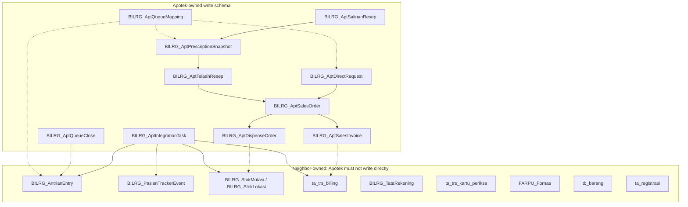
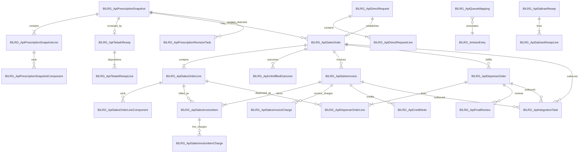
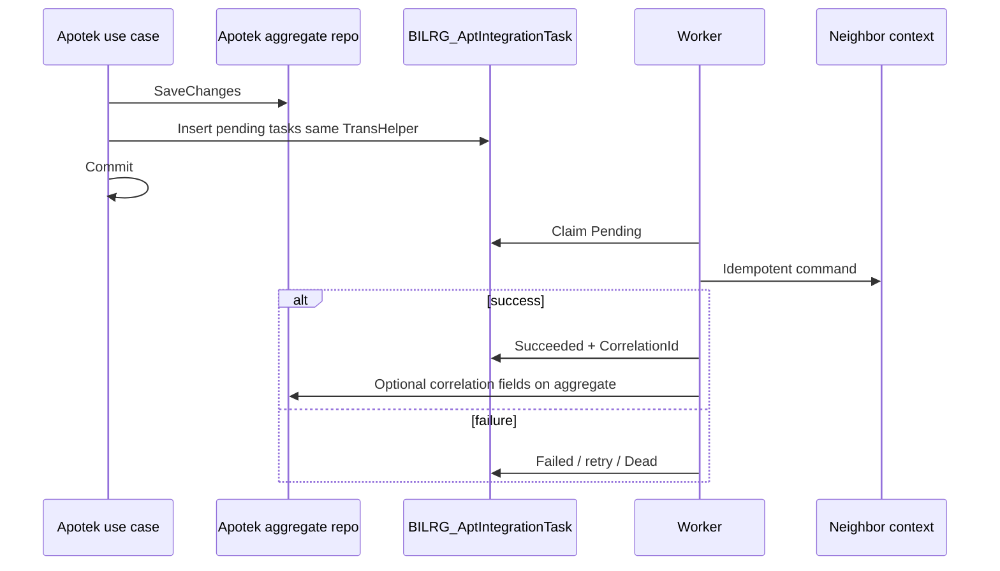

# Outpatient Apotek Persistence Design

**Artifact status:** Proposed design for architect review  
**Bounded context:** Apotek (`Pelayanan Obat Pasien`) — Outpatient Pharmacy  
**Date:** 2026-08-16  
**Audience:** Architects approving aggregate ownership, table ownership, schema reuse, database changes, and persistence implementation direction

Related artifacts:

- [Apotek Domain](./apotek-domain.md)
- [Outpatient Apotek Workflow](./outpatient-apotek-workflow.md)
- [Outpatient Apotek Screen and Aggregate Design](./outpatient-apotek-screen-and-aggregate-design.md)
- [Outpatient Apotek Repository Gap Analysis](./outpatient-apotek-repository-gap-analysis-report.md)
- [ADR-APT-001 Queue Boundary](./adr/ADR-APT-001-queu-boundary-and-pharmacy-workflow-state-ownership.md)
- [ADR-APT-002 Pharmacy and Stock Ledger Boundary](./adr/ADR-APT-002-pharmacy-stock-ledger-boundary.md)
- [DATABASE.md](../../DATABASE.md)
- [ENGINEERING.md](../../ENGINEERING.md)
- [Feature Persistence Generation Skill](../../skills/feature-persistence-generation.md)

Evidence classification used below:

| Label | Meaning |
|---|---|
| **Existing** | Verified in current schema or code |
| **Target** | Required future Apotek persistence |
| **Constraint** | Existing neighbor that Target must preserve or deliberately extend |
| **Gap** | Required capability with no conforming table, column, or repository |
| **Forbidden** | Must not be used as the new write model |

This artifact defines physical persistence. It does not define API contracts, screen layout, or an implementation roadmap.

---

## 1. Verdict

The current pharmacy write model is **not a valid persistence design for outpatient Apotek**.

Existing `SalesContext` persistence (`ta_trs_kartu_periksa*`, `tb_trs_dobill_umum*`) stores a monolithic prescription-to-DU sale. That shape cannot represent independent `TelaahResep`, `SalesOrder`, `SalesInvoice`, and `DispenseOrder` consistency boundaries, line-level commercial/fulfillment split, immutable Final Dispense Review, queue mapping, or Stock Ledger / Tata Rekening integration under BA-05 through BA-09.

**Target:** introduce a new `BILRG_Apt*` write schema owned by Apotek. Reuse neighboring tables by identity and command, never by writing their rows from Apotek DALs. Keep legacy DU and legacy Resep running as independent features. Do not dual-write.

No Apotek bounded-context project, aggregate, DTO, DAL, repository, or SQL script exists in `b09-bilreg-api` today. Persistence implementation starts from this design, not from extending `PenjualanRepo`.

---

## 2. Persistence requirements

### 2.1 What must be durable

| Requirement | Domain authority | Persistence consequence |
|---|---|---|
| Professional review of one Resep, per-line disposition, responsible Pharmacist, final outcome | `TelaahResep` aggregate; `BR-APT-003`–`007` | Header + rewriteable lines while `Under Review`; header status becomes terminal |
| Accepted demand, quantities, source traceability, unfulfilled outcomes, resolution | `SalesOrder` aggregate; `BR-APT-010`–`019` | Header + established lines; unfulfilled outcomes append-only |
| One medication sale, items, charges, pricing snapshot, payer, credit notes | `SalesInvoice` aggregate; `BR-APT-020`–`028`, `BR-APT-125`–`128` | Header + items + line charges + invoice charges + credit notes |
| Physical fulfillment, preparation, immutable reviews, education, override, dispense, handover, expiry, return | `DispenseOrder` aggregate; `BR-APT-029`–`039`, `BR-APT-096`, `BR-APT-132`–`142` | Header + lines + append-only review records; handover/education/override as header facts |
| Pharmacy operational copy of clinical intent | BA-06 Prescription Snapshot | Supporting document tables, created at intake, never silently rewritten from source |
| Accepted Direct Medication Request | `BR-APT-009`, `BR-APT-089` | Supporting document tables; decline creates no row |
| Current queue-to-demand association | BA-03; `BR-APT-062` | Association table, update in place, no history, not an aggregate |
| Pharmacy Queue Close fact | `BR-APT-143`–`145` | Append-only fact table; Tracker `Withdrawn` is requested, not owned |
| Salinan Resep | `BR-APT-054`, `BR-APT-109`–`115` | Supporting document from unfulfilled / excluded prescription lines |
| Cross-context delivery | BA-07 | Integration Task table committed atomically with the originating aggregate |
| Stock, queue, payment, SEP, Fornas, billing settlement | ADR-APT-001, ADR-APT-002, Tata Rekening | Neighbor tables remain neighbor-owned; Apotek stores correlation identities only |
| Operational worklists, attention badges, Patient Medication Journey, Pickup Expired | Screen design §3.4–§3.5 | Query projections; no write tables and no workflow states |

### 2.2 What must not be persisted as Apotek truth

| Object | Why | Allowed persistence |
|---|---|---|
| `DispenseAuthorized` | `BR-APT-043`; BA-08 | None as entity or status-of-record. Policy is evaluated at command time from evidence. Dispense Order `Released` is the resulting lifecycle state. |
| Queue lifecycle (`Waiting` / `In Service` / `Done` / `Withdrawn`) | ADR-APT-001 | Patient Tracker `BILRG_AntrianEntry` only |
| `Pickup Expired`, Serah Obat worklist categories | BA-04 | Derived from `PreparedAt` + Collection Window + handover facts |
| Purchase Confirmation | Domain §5.3 | Evidenced by Sales Invoice establishment |
| Backorder | `BR-APT-114` | No table |
| Financial Clearance / Fulfillment Clearance objects | BA-08 | No table |
| Mapping-change history | `BR-APT-062` | No table |
| Declined Direct Medication Request | `BR-APT-089` | No row |
| Stock quantity, Mutasi, Remove Stock | ADR-APT-002 | Stock Ledger only |
| Payment settlement, Tata Rekening lifecycle | Tata Rekening design | `ta_trs_billing` / `BILRG_TataRekening` only |
| Original CPOE / legacy Resep intent | `BR-APT-002` | Source remains in its authority; Apotek stores a snapshot copy |

### 2.3 Non-functional persistence rules

Follow [DATABASE.md](../../DATABASE.md) and [feature-persistence-generation.md](../../skills/feature-persistence-generation.md):

- SQL Server is durable operational state, not a rule engine.
- No database FK constraints.
- No NULL on operational columns; string `''`, numeric `0`, datetime `'3000-01-01'`.
- Transaction headers carry `CrtUser`, `CrtDate`, `UpdUser`, `UpdDate`, `VodUser`, `VodDate`.
- Workflow status stored as `INT`.
- Aggregate-root PK `VARCHAR(12)`, application-generated (`NunaId.New`).
- Detail PK `(ParentId, ItemNo)` except append-only facts that need their own id.
- Hard `DELETE` only for rewriteable details and staging; not for transaction headers or immutable facts.
- DTO maps table shape; DAL executes SQL; Repository reconstructs the aggregate.

---

## 3. Codebase and schema evidence

### 3.1 Apotek write model is absent

| Evidence | Location | Implication |
|---|---|---|
| No `ApotekContext` | `src/bilreg` search | New module, tables, and repositories are required |
| Legacy sale is one DU | `PenjualanModel.cs`; `tb_trs_dobill_umum` / `tb_trs_dobill_umum2` | Combines demand, invoice, and implied delivery; item add/remove is allowed |
| `PenjualanRepo` upserts DU | `PenjualanRepo.cs` | Header update + detail delete/insert against legacy tables |
| Checklist Telaah has no DAL | `TelaahModel.cs`; no `TelaahDal` | Name collision only; must not be reused |
| Legacy Resep | `ResepModel.cs`; `ta_trs_kartu_periksa`, `ta_trs_kartu_periksa3`, `ta_trs_kartu_periksa_resep` | Source candidate for Prescription Contract; Iter lives here |
| F-09 tracker evidence | `PharmacyQueueEvidence.cs`; `BILRG_PasienTrackerEvent` | Reusable append of `Apotek-Start` / `Apotek-Done`; must reference Tracker queue identity |
| Queue entry has one `ReffId` | `BILRG_AntrianEntry.ReffId`; `AntrianEntryModel.SetReff` | Cannot store multiple mapped demands; mapping must be an Apotek table |
| Stock movements | `BILRG_StokMutasi`, `BILRG_StokLokasi`; `PostStockTransferConsequenceCommand`; `PostSaleIssueConsequenceCommand` | Reuse commands; do not insert Mutasi from Apotek DAL |
| Tata Rekening charge ledger | `ta_trs_billing` (`fn_modul` 0 = Jasa, 1 = Obat); `BILRG_TataRekening` | Sales Invoice becomes a Charge Source into Obat |
| Fornas master | `FARPU_Fornas` | Coverage catalog only; not Coverage Clearance |
| CPOE model, no SQL | `ClinicalOrderModel.cs`; no CPOE `.sql` | Pharmacy must not wait for CPOE tables; consume Prescription Contract into a snapshot |
| Integration-task analogue | `BILRG_EmrAntrianOutboundQueue`; `BILRG_LabOwareOutboundQueue` | Pattern for BA-07: pending row, retry, unique source+type |
| Modern aggregate pattern | `BILRG_LabOrder` / `LabOrderRepo` | Header upsert + detail delete/insert; `NunaId` prefix `LBO` |

### 3.2 Validation of the current persistence design

| Claim sometimes assumed | Validation |
|---|---|
| Extend `tb_trs_dobill_umum` into Sales Invoice | **Invalid.** BA-05 forbids dual-write. The table has no Sales Order, Dispense Order, review, or handover lifecycle. |
| Store pharmacy progress on `BILRG_AntrianEntry.AntrianStatus` | **Invalid.** ADR-APT-001. Enum is only `Waiting`, `InService`, `Done`, `Withdrawn`. |
| Use `AntrianEntry.ReffId` as queue mapping | **Invalid.** One column cannot associate multiple independent demands (`BR-APT-084`). |
| Persist `TelaahModel` as `TelaahResep` | **Invalid.** Checklist semantics; no per-line accept/substitute/reject; no persistence. |
| Treat Stock Ledger `Prepared` / No Show columns as required | **Invalid.** Those facts are Pharmacy-owned. Stock has quantity and movement only. |
| Reuse `SaleIssueDu` for Outpatient Pharmacy handover | **Invalid (PD-02).** Use `DispenseIssue` for Medication Handover. `SaleIssueDu` remains the legacy DU path only. |

---

## 4. Aggregate ownership and persistence boundaries

### 4.1 Aggregate map and table ownership



### 4.2 Consistency boundary catalog

| Persistence unit | Kind | Consistency boundary | Repository | Child persistence |
|---|---|---|---|---|
| `TelaahResep` | Aggregate root | One review of one Prescription Snapshot | `ITelaahResepRepo` | Lines rewriteable until terminal |
| `SalesOrder` | Aggregate root | One accepted demand and quantity reconciliation | `ISalesOrderRepo` | Lines established then statused; unfulfilled outcomes append-only |
| `SalesInvoice` | Aggregate root | One medication sale | `ISalesInvoiceRepo` | Items + charges rewriteable until Issued; credit notes append-only |
| `DispenseOrder` | Aggregate root | One physical fulfillment instruction | `IDispenseOrderRepo` | Lines established; reviews append-only; handover facts on header |
| Prescription Snapshot | Supporting document | Intake copy of one Resep | `IPrescriptionSnapshotRepo` | Lines + components rewriteable only before first Telaah terminal outcome |
| Direct Medication Request | Supporting document | One accepted retail request | `IDirectMedicationRequestRepo` | Lines rewriteable only before Sales Order establishment |
| Outpatient Queue Mapping | Association | Current queue ↔ demand source | `IOutpatientQueueMappingRepo` | Single row per demand source; update in place |
| Pharmacy Queue Close | Operational fact | One close per queue entry | DAL + fact writer used by use case | Append-only |
| Salinan Resep | Supporting document | One copy of excluded/unfulfilled lines | `ISalinanResepRepo` or child of snapshot use case | Header + lines |
| Integration Task | Infrastructure | One durable outbound obligation | `IAptIntegrationTaskDal` coordinated by Application | Append-only; status updates in place |

One repository per aggregate root. Supporting documents have repositories because they are written before the related aggregate exists. Mapping is not an aggregate; its repository only loads/saves the current association.

Application orchestration may touch several repositories in one `TransHelper` scope. That does not merge aggregates.

### 4.3 Quantity and document cardinality

```text
Prescription Snapshot 1 ──< TelaahResep 1
Prescription Snapshot 1 ──< SalesOrder 0..2     (BPJS-covered + Patient-Pay)
Direct Request        1 ──< SalesOrder 1
SalesOrder            1 ──< SalesInvoice 0..n
SalesOrder            1 ──< DispenseOrder 0..n
SalesOrderLine        1 ──< SalesInvoiceItem 0..n
SalesOrderLine        1 ──< DispenseOrderLine 0..n
QueueEntry            1 ──< QueueMapping 0..n
Demand source         1 ──  QueueMapping 0..1   (current only)
```

Unique business indexes (application-enforced and SQL unique where listed in §7):

- At most one active Sales Order per Prescription Snapshot per Registration per payer path (`BR-APT-011`, `BR-APT-119`).
- Invoice item and dispense line quantities must not exceed Sales Order Line authority. Enforced in domain, not by database trigger.

---

## 5. Schema reuse strategy

### 5.1 Reuse without owning

| Neighbor table | Reuse mode | Apotek may | Apotek must not |
|---|---|---|---|
| `BILRG_AntrianEntry` | Canonical queue identity `(AntrianId, NoUrut)` | Read status/timestamps; request `Serve` / `Done` / `Withdraw` through Tracker commands | Add pharmacy columns; store mapping in `ReffId`; write the table from Apotek DAL |
| `BILRG_PasienTracker` / `BILRG_PasienTrackerEvent` | Journey evidence | Append `Apotek-Start` / `Apotek-Done` with queue identity as `ReffId` via Tracker port | Invent a second queue identity |
| `BILRG_AdmServicePoint` and related kiosk/display tables | Shared queue platform | Seed a pharmacy service point | Copy Admission start-service/registration-complete semantics |
| `BILRG_StokLokasi` / `BILRG_StokMutasi` | Stock quantity and journal | Call Stock Ledger transfer / remove-stock commands; store returned `StokMutasiId` as correlation | Insert/update Mutasi; store `Prepared` / No Show in stock tables |
| `tb_barang` / satuan / tipe barang | Medication catalog | Snapshot `BrgId`, name, satuan onto lines | Treat catalog mutation as pharmacy history |
| `FARPU_Fornas` | Item-level coverage catalog | Classify Covered / Not Covered at evaluation time; snapshot the outcome onto the Sales Order Line | Treat master presence as Coverage Clearance |
| `ta_registrasi` | Fulfillment boundary | Store `RegId`; enforce one active SO per registration/payer path | Extend registration schema |
| `ta_trs_kartu_periksa*` | Legacy Resep + Iter | Read through Prescription Contract adapter; Iter consume/update through that adapter | Make Kartu Periksa the Telaah or Sales Order table |
| `tb_trs_dobill_umum*` | Legacy DU | Read-only reporting union | Dual-write from new Sales Invoice |
| `ta_trs_billing` | Financial Charge ledger | Create Obat charges (`fn_modul = 1`) via Tata Rekening / billing port, with `fs_kd_trs` or source ref = Sales Invoice id | Bypass Tata Rekening lifecycle; write `BILRG_TataRekening` |
| `tz_parameter_sistem` | Operational parameter | Add `APT_COLLECTION_WINDOW_DAYS` (default `7`) | Hard-code Collection Window only |

### 5.2 Existing tables that need adjustment

These are neighbor or platform changes, not Apotek table rewrites.

| Table / contract | Adjustment | Owner | Why |
|---|---|---|---|
| Stock Ledger `MovementKindEnum` | Add `DispenseIssue` for Medication Handover (PD-02). Outpatient Pharmacy shall not use `SaleIssueDu` | Stock Ledger | BA-05 coexistence; ADR-APT-002 handover Remove Stock from DTU |
| `ta_layanan` / stock location | Designate Pharmacy Unit and Dispensing Temporary Unit `LayananId` values | Inventory / master data | `BILRG_StokLokasi` is keyed by `LayananId`; DTU is a location, not an Apotek table |
| `BILRG_AdmServicePoint` | Seed outpatient pharmacy service point | Patient Tracker / operations | Shared queue intake; no pharmacy seed exists |
| `tz_parameter_sistem` | Insert Collection Window parameter | Apotek config | `BR-APT-138` |
| Prescription Contract / Iter adapter | Consume and update Iter on legacy Resep without pharmacy writing Kartu Periksa SQL | Apotek Application + Resep port | `BR-APT-106`; Iter remains owned by Resep |
| F-09 evidence `ReffId` | Must be Tracker queue identity, not Farinv / DU id | Patient Tracker + Apotek orchestration | BA-01; `BILRG_PasienTrackerEvent.ReffId` is already `VARCHAR(40)` |
| Stock `UX_BILRG_StokMutasi_TrsReffId_MovementKind_StokLokasiId` | Apotek Integration Task must use a stable `TrsReffId` per Dispense Order Line + purpose | Apotek task key design | Existing uniqueness is the idempotency mechanism |

No alteration of `BILRG_AntrianEntry` is required or permitted for pharmacy workflow columns.

### 5.3 Existing tables that must not become the new write model

| Table | Forbidden use |
|---|---|
| `tb_trs_dobill_umum` / `tb_trs_dobill_umum2` | New Sales Invoice / Dispense Order |
| `ta_trs_kartu_periksa*` | New Telaah Resep or Sales Order |
| `BILRG_AntrianEntry` | Pharmacy progress or multi-demand mapping |
| Any Farinv queue table | Active outpatient queue identity |
| Hypothetical `Telaah` table for `TelaahModel` | Target Telaah Resep |

Legacy DU and Kartu Periksa remain for the legacy feature and as read sources for the reporting adapter and Prescription Contract.

---

## 6. Target table catalog

Module prefix: `BILRG_Apt`. New-system PK: `VARCHAR(12)` unless the row is a detail or an association that uses neighbor identity.

### 6.1 New tables — Apotek write model

| Table | Kind | PK | Owned by |
|---|---|---|---|
| `BILRG_AptPrescriptionSnapshot` | Supporting header | `PrescriptionSnapshotId` | Apotek |
| `BILRG_AptPrescriptionSnapshotLine` | Detail | `(PrescriptionSnapshotId, ItemNo)` | Snapshot |
| `BILRG_AptPrescriptionSnapshotComponent` | Detail | `(PrescriptionSnapshotId, ItemNo, ComponentNo)` | Snapshot |
| `BILRG_AptPrescriptionRevisionTask` | Operational task | `RevisionTaskId` | Apotek |
| `BILRG_AptDirectRequest` | Supporting header | `DirectRequestId` | Apotek |
| `BILRG_AptDirectRequestLine` | Detail | `(DirectRequestId, ItemNo)` | Direct request |
| `BILRG_AptTelaahResep` | Aggregate header | `TelaahResepId` | `TelaahResep` |
| `BILRG_AptTelaahResepLine` | Detail | `(TelaahResepId, ItemNo)` | `TelaahResep` |
| `BILRG_AptSalesOrder` | Aggregate header | `SalesOrderId` | `SalesOrder` |
| `BILRG_AptSalesOrderLine` | Detail | `(SalesOrderId, ItemNo)` | `SalesOrder` |
| `BILRG_AptSalesOrderLineComponent` | Detail | `(SalesOrderId, ItemNo, ComponentNo)` | `SalesOrder` |
| `BILRG_AptUnfulfilledOutcome` | Append-only detail | `(SalesOrderId, OutcomeNo)` | `SalesOrder` |
| `BILRG_AptSalesInvoice` | Aggregate header | `SalesInvoiceId` | `SalesInvoice` |
| `BILRG_AptSalesInvoiceItem` | Detail | `(SalesInvoiceId, ItemNo)` | `SalesInvoice` |
| `BILRG_AptSalesInvoiceItemCharge` | Detail | `(SalesInvoiceId, ItemNo, ChargeNo)` | `SalesInvoice` |
| `BILRG_AptSalesInvoiceCharge` | Detail | `(SalesInvoiceId, ChargeNo)` | `SalesInvoice` |
| `BILRG_AptCreditNote` | Append-only detail | `(SalesInvoiceId, CreditNoteNo)` | `SalesInvoice` |
| `BILRG_AptDispenseOrder` | Aggregate header | `DispenseOrderId` | `DispenseOrder` |
| `BILRG_AptDispenseOrderLine` | Detail | `(DispenseOrderId, ItemNo)` | `DispenseOrder` |
| `BILRG_AptFinalReview` | Append-only detail | `(DispenseOrderId, ReviewNo)` | `DispenseOrder` |
| `BILRG_AptQueueMapping` | Association | `(DemandKind, DemandId)` | Apotek (not an aggregate) |
| `BILRG_AptQueueClose` | Append-only fact | `QueueCloseId` | Apotek (not an aggregate) |
| `BILRG_AptSalinanResep` | Supporting header | `SalinanResepId` | Apotek |
| `BILRG_AptSalinanResepLine` | Detail | `(SalinanResepId, ItemNo)` | Salinan Resep |
| `BILRG_AptIntegrationTask` | Infrastructure | `IntegrationTaskId` | Apotek Application / worker |

### 6.2 New tables that are intentionally omitted

| Candidate | Decision |
|---|---|
| `BILRG_AptDispenseAuthorized` | Forbidden (`BR-APT-043`) |
| `BILRG_AptPurchaseConfirmation` | Forbidden |
| `BILRG_AptQueueMappingHistory` | Forbidden (`BR-APT-062`) |
| `BILRG_AptWorklist*` materialized tables | Not in first persistence; query existing write tables + Tracker |
| `BILRG_AptPatientJourney` | Projection only |
| `BILRG_AptBackorder` | Forbidden |
| Unified sales reporting table / view | Forbidden (PD-06). Use Query DAL / Reporting Query Adapter over `BILRG_AptSalesInvoice` ∪ `tb_trs_dobill_umum` |

### 6.3 Identifier prefixes

| Entity | `NunaId` prefix | Notes |
|---|---|---|
| Prescription Snapshot | `ARX` | Apt Resep snapshot |
| Direct Request | `ADQ` | Avoid `ADM` (Admission) |
| Telaah Resep | `ATR` | |
| Sales Order | `ASO` | |
| Sales Invoice | `ASI` | |
| Dispense Order | `ADP` | Do not use `DO` (Stock Ledger Goods Receipt) |
| Salinan Resep | `ASR` | |
| Queue Close | `AQC` | |
| Integration Task | `AIT` | |
| Revision Task | `ARV` | |
| Credit Note | uses parent `SalesInvoiceId` + `CreditNoteNo` | |

---

## 7. Logical ERD



Logical relationships only. No `FOREIGN KEY` constraints.

---

## 8. Proposed table shapes

Conventions for every header: `CrtUser VARCHAR(50)`, `CrtDate DATETIME`, `UpdUser`, `UpdDate`, `VodUser`, `VodDate`, empty date `'3000-01-01'`. Aggregate headers also carry `Version INT` for optimistic concurrency (same pattern as `BILRG_TataRekening` and `BILRG_StokLokasi`).

Column lists below are the operational shape for review. They are not a substitute for the later SQL script review.

### 8.1 Prescription Snapshot (BA-06)

Intake document. Authoritative for pharmacy processing. Source revisions never overwrite it.

`BILRG_AptPrescriptionSnapshot`

| Column | Type | Notes |
|---|---|---|
| `PrescriptionSnapshotId` | VARCHAR(12) | PK |
| `SourceKind` | INT | `0` Legacy Resep, `1` CPOE, `2` Physical/external |
| `SourcePrescriptionId` | VARCHAR(50) | Legacy `fs_kd_trs` or CPOE id; empty for physical until assigned |
| `SourceVersionToken` | VARCHAR(50) | Revision detection token; empty if unknown |
| `RegId` | VARCHAR(10) | Fulfillment boundary |
| `PasienId` | VARCHAR(15) | Snapshot |
| `PasienName` | VARCHAR(60) | Snapshot |
| `DokterId` | VARCHAR(10) | Snapshot |
| `DokterName` | VARCHAR(40) | Snapshot |
| `LayananId` | VARCHAR(5) | Originating unit snapshot |
| `Urgenitas` | INT | |
| `IterEntitled` | INT | Copied from source at intake |
| `IterConsumed` | INT | Pharmacy-visible copy; source Iter still owned by Resep |
| `CareSetting` | INT | Outpatient = 0 |
| `CaptureNote` | VARCHAR(512) | For Resep Luar: prescription origin, prescriber, facility, and other capture notes (PD-01). Empty for electronic/internal snapshots when not applicable |
| `DocumentRef` | VARCHAR(200) | Reference to the captured prescription document (PD-01). Empty when no document is stored |
| `SnapshotStatus` | INT | `0` Active, `1` SupersededForReview, `2` Voided |

`BILRG_AptPrescriptionSnapshotLine`: `ItemNo`, `SourceLineNo`, `BrgId`, `BrgName`, `SatuanId`, `SatuanName`, `Qty`, `Iter`, `Signa`, `Instruction`, `Note`, `IsRacik`.

`BILRG_AptPrescriptionSnapshotComponent`: racik components for a line.

`BILRG_AptPrescriptionRevisionTask`: `RevisionTaskId`, `PrescriptionSnapshotId`, `DetectedAt`, `SourceVersionToken`, `TaskStatus`, `ResolvedBy`, `ResolvedAt`, `ResolutionNote`. Source change creates a task; it does not mutate the snapshot.

**Save semantics:** insert at intake. Lines rewriteable only while no terminal Telaah exists. After Telaah completion, snapshot lines are frozen.

### 8.2 Direct Medication Request

Created only on accept (`BR-APT-089`).

`BILRG_AptDirectRequest`: `DirectRequestId`, `RegId`, `PasienId`, `PasienName`, `AcceptedBy`, `AcceptedAt`, `RequestStatus` (`0` Accepted, `1` ConvertedToSalesOrder`, `2` DeclinedAfterAccept — only if a later authorized cancel is needed; ordinary decline never inserts).

`BILRG_AptDirectRequestLine`: catalog line qty/signa.

### 8.3 TelaahResep aggregate

`BILRG_AptTelaahResep`

| Column | Type | Notes |
|---|---|---|
| `TelaahResepId` | VARCHAR(12) | PK |
| `PrescriptionSnapshotId` | VARCHAR(12) | Source; one active review per snapshot recommended |
| `RegId` | VARCHAR(10) | |
| `TelaahStatus` | INT | `0` Available, `1` UnderReview, `2` Approved, `3` PartiallyApproved, `4` Rejected |
| `PharmacistId` | VARCHAR(50) | Responsible Pharmacist |
| `StartedAt` | DATETIME | |
| `CompletedAt` | DATETIME | Sentinel until complete |
| `Version` | INT | |

`BILRG_AptTelaahResepLine`

| Column | Type | Notes |
|---|---|---|
| `TelaahResepId`, `ItemNo` | PK | Align `ItemNo` with snapshot line |
| `SnapshotItemNo` | INT | Source traceability |
| `Disposition` | INT | `0` Pending, `1` AcceptedAsPrescribed, `2` AcceptedSubstitute, `3` Rejected |
| `AcceptedBrgId` / `AcceptedBrgName` | | Substitute identity when disposition = 2 |
| `AcceptedQty` | DECIMAL(18,2) | |
| `Reason` | VARCHAR(200) | Required for substitute/reject |
| `PharmacistId` | VARCHAR(50) | Line decision owner |

**Save semantics:** header upsert. Lines delete+insert while `Under Review`. After terminal status, lines are frozen (update header only).

**Do not persist** clarification communications (`BR-APT-005`).

### 8.4 SalesOrder aggregate

`BILRG_AptSalesOrder`

| Column | Type | Notes |
|---|---|---|
| `SalesOrderId` | VARCHAR(12) | PK |
| `SourceKind` | INT | `0` Prescription, `1` DirectRequest |
| `SourceId` | VARCHAR(12) | Snapshot or DirectRequest id |
| `TelaahResepId` | VARCHAR(12) | Empty for Direct Request |
| `RegId` | VARCHAR(10) | Unique active key part |
| `PasienId` / `PasienName` | | Snapshot |
| `PayerPath` | INT | `0` General/PatientPay, `1` BPJS, `2` OtherInsurance |
| `PartialReason` | INT | `0` None, `1` PatientRequest, `2` StockShortage, `3` FornasNotCovered |
| `SalesOrderStatus` | INT | `0` Established, `1` Active, `2` Resolved, `3` Cancelled |
| `ResolvedReason` | INT | Includes `CollectionWindowExpired` when applicable |
| `Version` | INT | |

Unique filtered index:

```text
UX_BILRG_AptSalesOrder_ActiveSourceRegPayer
  (SourceKind, SourceId, RegId, PayerPath)
  WHERE SalesOrderStatus IN (0, 1) AND VodDate = '3000-01-01'
```

`BILRG_AptSalesOrderLine`

| Column | Type | Notes |
|---|---|---|
| `SalesOrderId`, `ItemNo` | PK | |
| `SourceLineNo` | INT | Snapshot or DMR line |
| `BrgId` / `BrgName` / `SatuanId` | | Fixed after establishment (`BR-APT-050`) |
| `AcceptedQty` | DECIMAL(18,2) | Authority |
| `InvoicedQty` | DECIMAL(18,2) | Reconciled projection maintained by SalesOrder behavior |
| `DispensedQty` | DECIMAL(18,2) | Same |
| `UnfulfilledQty` | DECIMAL(18,2) | Same |
| `LineStatus` | INT | Active / FullyInvoiced / FullyFulfilled / Cancelled / Unfulfilled |
| `FornasCoverage` | INT | `0` Unknown, `1` Covered, `2` NotCovered — evidence snapshot, not Fornas master |
| `SepNo` | VARCHAR(50) | Encounter SEP snapshot when evaluated; empty otherwise |
| `IsRacik` | BIT | |

`BILRG_AptSalesOrderLineComponent`: compounding composition copied from snapshot/DMR at establishment.

`BILRG_AptUnfulfilledOutcome`: `OutcomeNo`, `SalesOrderLineItemNo`, `Qty`, `Reason` (shortage after SO, patient decline of Patient-Pay SO, expiry, cancellation, etc.), `SalinanResepId`, `ActorId`, `EffectiveAt`. Append-only. Delete+insert is forbidden.

**Save semantics:** header upsert. Lines rewriteable only in the same transaction that establishes the order. Afterwards update quantities/status in place; never replace medication identity. Unfulfilled rows insert only.

### 8.5 SalesInvoice aggregate

`BILRG_AptSalesInvoice`

| Column | Type | Notes |
|---|---|---|
| `SalesInvoiceId` | VARCHAR(12) | PK |
| `SalesOrderId` | VARCHAR(12) | Exactly one |
| `PayerPath` | INT | Must match the Sales Order path |
| `InvoiceStatus` | INT | Established / Issued / FinanciallyCleared / AdjustedOrCredited / Resolved / Cancelled |
| `PricingSnapshotAt` | DATETIME | Immutable commercial time |
| `TipeJaminanId` / names | | Payer snapshot |
| `SubTotal`, `SumBiaya`, `SumTax`, `DiskonLain`, `BiayaLain`, `Pembulatan`, `GrandTotal` | DECIMAL(18,2) | Legacy sales totals shape (BC-08) |
| `PaymentClearanceReff` | VARCHAR(26) | External payment id; empty until known |
| `PaymentClearedAt` | DATETIME | Evidence snapshot; not cashier authority |
| `TataRekeningChargeId` | VARCHAR(26) | Correlation to `ta_trs_billing.fs_kd_trs` after task success |
| `EstablishedAt`, `IssuedAt`, `ClearedAt` | DATETIME | |
| `Version` | INT | |

`BILRG_AptSalesInvoiceItem`: `ItemNo`, `SalesOrderItemNo`, `BrgId`, `BrgName`, `ItemKind` (`0` Medication, `1` BHP), `Qty`, `HargaSatuan`, `Diskon`, `Biaya`, `Tax`, `Total`, plus etiket snapshot fields needed for reprint. Every medication/BHP item references exactly one Sales Order Line.

`BILRG_AptSalesInvoiceItemCharge`: packaging / compounding fees (`BR-APT-127`).

`BILRG_AptSalesInvoiceCharge`: rounding and other invoice-level adjustments (`BR-APT-128`).

`BILRG_AptCreditNote`: `CreditNoteNo`, `Amount`, `Reason`, `AuthorizedPharmacistId`, `EffectiveAt`, `TataRekeningChargeId`. Append-only (`BR-APT-027`).

**Save semantics (PD-05):** while `InvoiceStatus = Established`, items and charges may rewrite (delete+insert). After the invoice leaves `Established`, header commercial fields and line content are immutable. Corrections use Credit Note plus Integration Task, or other accountable financial resolution (`BR-APT-027`); they do not modify the original invoice rows.

General Patient Purchase Confirmation is not a row. Inserting the invoice **is** the confirmation evidence (`BR-APT-070`).

### 8.6 DispenseOrder aggregate

`BILRG_AptDispenseOrder`

| Column | Type | Notes |
|---|---|---|
| `DispenseOrderId` | VARCHAR(12) | PK |
| `SalesOrderId` | VARCHAR(12) | Exactly one |
| `CareSetting` | INT | Outpatient = 0 |
| `DispenseStatus` | INT | Domain §8.4: Established … Completed / Cancelled / Expired / Unfulfilled |
| `PharmacyUnitLayananId` | VARCHAR(5) | |
| `TemporaryUnitLayananId` | VARCHAR(5) | Dispensing Temporary Unit |
| `ReleasedAt` | DATETIME | Set when policy evaluation allows preparation |
| `PreparationStartedAt` | DATETIME | Causes Tracker `ServedAt` via Integration Task |
| `PreparedAt` | DATETIME | Collection Window start (`BR-APT-138`) |
| `EducationAt` | DATETIME | Patient Education Acknowledgement |
| `EducationPharmacistId` | VARCHAR(50) | |
| `EducationNote` | VARCHAR(512) | Optional (`BR-APT-134`) |
| `OverrideAt` | DATETIME | Collection Window Override |
| `OverridePharmacistId` | VARCHAR(50) | |
| `OverrideReason` | VARCHAR(200) | |
| `HandoverAt` | DATETIME | |
| `RecipientPhone` | VARCHAR(30) | Optional reference only |
| `RecipientRelationship` | VARCHAR(50) | Optional reference only |
| `CancelledAt` / `ExpiredAt` / `CancelReason` | | Terminal exception |
| `PickupCalledAt` | DATETIME | Pharmacy fact; Tracker `DoneAt` is neighbor-owned |
| `Version` | INT | |

Pickup Expired is **not** a column. Worklists compute `PreparedAt + CollectionWindow` against clock when `HandoverAt` is sentinel.

`BILRG_AptDispenseOrderLine`

| Column | Type | Notes |
|---|---|---|
| `DispenseOrderId`, `ItemNo` | PK | |
| `SalesOrderItemNo` | INT | Required |
| `BrgId`, `Qty` | | Must not exceed unresolved Accepted Qty |
| `ReserveMutasiReff` | VARCHAR(12) | Correlation to Stock Mutasi after task success |
| `RemoveStockMutasiReff` | VARCHAR(12) | `DispenseIssue` correlation after handover (PD-02) |
| `ReturnMutasiReff` | VARCHAR(12) | No Show / unused reserve return |
| `LineOutcome` | INT | Open / Dispensed / Returned / Unfulfilled |

`BILRG_AptFinalReview`: `ReviewNo`, `Outcome` (pass/fail), `Reason`, `PharmacistId`, `EffectiveAt`, `AffectedQty`. **Append-only. Never delete+insert.** Failed review does not erase earlier rows (`BR-APT-096`).

Medication Dispense is recorded by line outcome + header `HandoverAt` / `Preparation` facts. A separate dispense-event table is unnecessary for outpatient one-handover-per-order. If inpatient UDD later needs multiple dispense events per order, add an append-only table then; do not generalize it now.

**Save semantics:** header upsert. Lines rewriteable only at establishment. After release, update line correlation ids and header timestamps in place. Reviews insert only.

### 8.7 Outpatient Queue Mapping (not an aggregate)

`BILRG_AptQueueMapping`

| Column | Type | Notes |
|---|---|---|
| `DemandKind` | INT | PK part: `0` PrescriptionSnapshot, `1` DirectRequest |
| `DemandId` | VARCHAR(12) | PK part |
| `AntrianId` | VARCHAR(26) | Tracker identity |
| `NoUrut` | INT | Tracker identity |
| `PasienTrackerId` | VARCHAR(26) | Denormalized for worklist join |
| `MappingMethod` | INT | `0` Tracker, `1` Manual |
| `MappedBy` | VARCHAR(50) | |
| `MappedAt` | DATETIME | |
| `Crt*` / `Upd*` | | No `Vod*` as primary lifecycle; unmap by updating to empty queue is **not** used. Correction updates `AntrianId`/`NoUrut` in place. |

Indexes:

- `IX_BILRG_AptQueueMapping_Queue (AntrianId, NoUrut)`
- Current association uniqueness is the PK `(DemandKind, DemandId)` — one queue per demand source.

Do not map to `SalesOrderId`. After SO establishment, worklists join `DemandId` → Sales Order `SourceId`. One snapshot may produce two Sales Orders (BPJS + Patient-Pay); both remain coordinated by the same mapping row (`BR-APT-084`, `BR-APT-124`).

Do not write `BILRG_AntrianEntry.ReffId` as the mapping store.

### 8.8 Pharmacy Queue Close

`BILRG_AptQueueClose`: `QueueCloseId`, `AntrianId`, `NoUrut`, `Reason` (mandatory), `StaffId`, `EffectiveAt`, audit. Unique `(AntrianId, NoUrut)` so a queue is closed at most once.

Tracker `Withdrawn` is a separate Integration Task. This table is the Pharmacy fact (`BR-APT-144`). Tracker `WithdrawalReason` may copy the same reason through the Tracker command; Apotek still keeps its own fact.

### 8.9 Salinan Resep

`BILRG_AptSalinanResep`: `SalinanResepId`, `PrescriptionSnapshotId`, `SalesOrderId` (empty if issued before SO), `Reason` (PatientRequest / StockShortage / post-SO unfulfilled), `IssuedBy`, `IssuedAt`.

`BILRG_AptSalinanResepLine`: snapshot `ItemNo`, `BrgId`, `Qty`, `Note`.

### 8.10 Integration Task (BA-07)

Pattern taken from **Existing** `BILRG_EmrAntrianOutboundQueue` and `BILRG_LabOwareOutboundQueue`, extended with an explicit idempotency key and destination.

`BILRG_AptIntegrationTask`

| Column | Type | Notes |
|---|---|---|
| `IntegrationTaskId` | VARCHAR(12) | PK |
| `TaskType` | INT | See §11 |
| `SourceKind` | INT | SalesOrder / SalesInvoice / DispenseOrder / QueueClose / Mapping |
| `SourceId` | VARCHAR(12) | Originating document |
| `IdempotencyKey` | VARCHAR(80) | Unique; e.g. `ADP{id}:L{n}:RESERVE` |
| `Destination` | INT | Tracker / StockLedger / TataRekening / ResepIter / Reporting |
| `PayloadJson` | NVARCHAR(MAX) | Command payload |
| `TaskStatus` | INT | `0` Pending, `1` Processing, `2` Succeeded, `3` Failed, `4` Dead |
| `RetryCount` | INT | |
| `LastError` | VARCHAR(200) | |
| `LastRetryDate` | DATETIME | |
| `ProcessedDate` | DATETIME | |
| `CorrelationId` | VARCHAR(26) | Neighbor id after success (MutasiId, billing id, …) |
| `CrtDate` | DATETIME | Same transaction as business save |

Unique index: `UX_BILRG_AptIntegrationTask_Idempotency (IdempotencyKey)`.

Worker index: `IX_BILRG_AptIntegrationTask_Pending (TaskStatus, CrtDate)`.

Not a message broker. Not a distributed transaction. Not a generic domain-event store.

---

## 9. Repository implications

### 9.1 Layering

```text
Application
  ITelaahResepRepo / ISalesOrderRepo / ISalesInvoiceRepo / IDispenseOrderRepo
  IPrescriptionSnapshotRepo / IDirectMedicationRequestRepo
  IOutpatientQueueMappingRepo
  IAptIntegrationTaskDal          (port; infrastructure implements)
  IStockLedgerPort / ITrackerPharmacyPort / ITataRekeningChargePort / IPrescriptionContractPort

Infrastructure
  *Dto / *Dal / *Repo
  SQL against BILRG_Apt* only for Apotek-owned tables
```

Apotek repositories must not reference `IPenjualanDal`, `Ita_trs_kartu_periksa`, `IStokMutasiDal`, or `ITrsBillingDal` directly. Neighbor writes go through Application ports after the Apotek transaction inserts Integration Tasks, or through workers that execute those tasks.

### 9.2 Reconstruction

Follow `LabOrderRepo`:

1. Load header DTO.
2. Load details.
3. Convert details to model members.
4. `dto.ToModel(...)`.
5. Never reconstruct inside DAL.

Exceptions to delete+insert:

| Detail | Persistence |
|---|---|
| Telaah lines while Under Review | Delete + insert |
| Sales Invoice items/charges while `InvoiceStatus = Established` | Delete + insert (PD-05) |
| Snapshot / DMR / SO / DO lines at first insert | Insert; later rewrite forbidden except Telaah-under-review and Sales Invoice while `Established` |
| `BILRG_AptFinalReview` | Insert only |
| `BILRG_AptUnfulfilledOutcome` | Insert only |
| `BILRG_AptCreditNote` | Insert only |
| `BILRG_AptQueueClose` | Insert only |
| `BILRG_AptIntegrationTask` | Insert; later status/correlation update |
| `BILRG_AptQueueMapping` | Upsert in place |

### 9.3 Suggested contracts

```csharp
public interface ITelaahResepRepo :
    ISaveChange<TelaahResepModel>,
    ILoadEntity<TelaahResepModel, ITelaahResepKey> { }

public interface ISalesOrderRepo :
    ISaveChange<SalesOrderModel>,
    ILoadEntity<SalesOrderModel, ISalesOrderKey>
{
    MayBe<SalesOrderModel> LoadActiveBySource(int sourceKind, string sourceId, string regId, int payerPath);
}

public interface ISalesInvoiceRepo :
    ISaveChange<SalesInvoiceModel>,
    ILoadEntity<SalesInvoiceModel, ISalesInvoiceKey> { }

public interface IDispenseOrderRepo :
    ISaveChange<DispenseOrderModel>,
    ILoadEntity<DispenseOrderModel, IDispenseOrderKey> { }
```

Worklist queries are dedicated projection DALs returning DTO/view types. They must not load full aggregates to paint a queue card (`ENGINEERING.md` §8).

### 9.4 Concurrency

| Object | Mechanism |
|---|---|
| Aggregate headers | `Version INT` + conditional update (Tata Rekening / StokLokasi pattern) |
| Queue mapping | Last write wins on the single current row; acceptable because mapping has no lifecycle |
| Integration Task | Claim by updating `Pending → Processing` with status predicate |
| Tracker queue row | Existing Tracker rowversion / command contract; Apotek must send it on milestone commands |
| Stock location | Existing `BILRG_StokLokasi.Version` inside Stock Ledger commands |

### 9.5 Transaction ownership

Application `TransHelper.NewScope()` commits together:

1. Originating aggregate `SaveChanges`
2. Supporting document updates if in the same use case
3. Mapping upsert when the use case maps
4. Integration Task inserts for every neighbor effect

Workers run **after** commit. They call neighbor commands idempotently using `IdempotencyKey` / Stock `TrsReffId` uniqueness.

Do not wrap Apotek + Stock Ledger + Tracker + Tata Rekening writes in one distributed transaction (BA-07, BA-08).

### 9.6 Namespace / folder target

```text
Bilreg.Domain/ApotekContext/{TelaahResep|SalesOrder|SalesInvoice|DispenseOrder}Feature/
Bilreg.Application/ApotekContext/...
Bilreg.Infrastructure/ApotekContext/...
Bilreg.SqlDb/ApotekContext/...
```

Do not place target types under `SalesContext/PenjualanFeature`.

---

## 10. Read models and query sources

No projection table is required for architect approval of the write model. First implementation should query write tables.

| Projection | Consumer | Source | Must not decide |
|---|---|---|---|
| Telaah worklist | Screen Telaah Resep | Snapshot + Telaah header | Sales / dispense |
| Pelayanan Penjualan waiting queue | Screen Pelayanan Penjualan | `BILRG_AntrianEntry` (pharmacy service point) left join mapping + SO/invoice progress | Queue lifecycle |
| Exception worklist | Same screen | SO / DO / SI terminal and pending-task joins | Inventory or settlement facts |
| Dispensing worklist | Screen Dispensing | Dispense Order status in Released/Preparing | Payment |
| Serah Obat categories | Screen Serah Obat | DO `PreparedAt`, education, review, handover, parameter window, Tracker `DoneAt` | Dispense Order state |
| Patient Medication Journey | Read-only panel | Union of mapping, Telaah, SO, SI, DO facts | Commands |
| Unified sales reporting | Finance/reporting | Query DAL / Reporting Query Adapter over `BILRG_AptSalesInvoice` ∪ `tb_trs_dobill_umum` (PD-06; no table or view) | Transactional truth |
| Integration failure list | Operations | `BILRG_AptIntegrationTask` Failed/Dead | Business lifecycle |

Pickup Expired SQL sketch (not a state):

```text
DispenseStatus = Prepared or Reviewed
AND HandoverAt = '3000-01-01'
AND DATEADD(day, @CollectionWindowDays, PreparedAt) < @AsOf
AND OverrideAt = '3000-01-01'
```

---

## 11. Cross-context relationships and Integration Tasks



| TaskType | Triggering Apotek fact | Destination | Idempotency key | Neighbor effect |
|---|---|---|---|---|
| `TrackerServedAt` | First `PreparationStartedAt` | Patient Tracker | `{DispenseOrderId}:START` | `Serve` + `Apotek-Start` event |
| `TrackerDoneAtPickup` | Coordinated pickup call | Patient Tracker | `{AntrianId}:{NoUrut}:DONE` | `Done` + `Apotek-Done` if not already Done |
| `TrackerDoneAtNoShow` | No Show while `In Service` | Patient Tracker | `{AntrianId}:{NoUrut}:DONE` | Same Done path; never reverse |
| `TrackerWithdrawn` | Pharmacy Queue Close | Patient Tracker | `{QueueCloseId}:WITHDRAW` | `Withdraw` from Waiting |
| `StockReserve` | Dispensing Started | Stock Ledger transfer | `{DispenseOrderId}:L{n}:RESERVE` | Mutasi Pharmacy Unit → DTU; `TrsReffId` = key |
| `StockRemoveOnHandover` | Medication Handover | Stock Ledger `DispenseIssue` | `{DispenseOrderId}:L{n}:DISPENSE_ISSUE` | Permanent removal from DTU (PD-02); not `SaleIssueDu` |
| `StockReturnNoShow` | No Show / unused reserve | Stock Ledger transfer | `{DispenseOrderId}:L{n}:RETURN` | DTU → Pharmacy Unit |
| `BillingCharge` | Sales Invoice Issued / BPJS invoice at handover | Tata Rekening / `ta_trs_billing` | `{SalesInvoiceId}:CHARGE` | Obat Financial Charge; `fn_modul = 1` |
| `BillingCredit` | Credit Note recorded | Tata Rekening | `{SalesInvoiceId}:CN{n}` | Compensating charge |
| `IterConsume` | Sales Order established from Resep | Prescription Contract | `{SalesOrderId}:ITER` | Iter on legacy Resep |
| `EmrRealization` | Handover (later) | EMR reporting | `{DispenseOrderId}:EMR` | Out of initial write scope if EMR contract absent |

Payment Clearance and SEP/Fornas are **inbound evidence**. Apotek does not emit them. Snapshot `PaymentClearanceReff`, `SepNo`, and `FornasCoverage` onto Sales Order / Invoice lines when evaluated. Re-evaluate Dispense Authorized at `Release` / `PreparationStarted`; do not persist an authorization row.

---

## 12. Neighbor database changes (non-Apotek)

| Change | Required for outpatient go-live? | Notes |
|---|---|---|
| Stock Ledger `DispenseIssue` movement kind (PD-02) | **Yes** | Medication Handover permanent removal from DTU; Outpatient Pharmacy shall not use `SaleIssueDu` |
| Master data: Pharmacy Unit and Dispensing Temporary Unit `LayananId` | **Yes** | Location is Stock Ledger's `LayananId` |
| Pharmacy row in `BILRG_AdmServicePoint` | **Yes** | Shared kiosk/queue |
| `tz_parameter_sistem` Collection Window | **Yes** | Default 7 |
| Tracker pharmacy start/complete commands | **Yes** (application, not a new queue column) | BA-02 is decided; contract still to be implemented |
| CPOE prescription tables in this database | **No** | Snapshot + adapter; CPOE SQL is absent |
| `BILRG_AntrianEntry` new columns | **No — forbidden** | |
| Dual-write trigger from ASI → `tb_trs_dobill_umum` | **Forbidden** | |

---

## 13. Indexing (operational)

| Index | Purpose |
|---|---|
| `IX_AptTelaah_Status` `(TelaahStatus, CrtDate)` | Telaah worklist |
| `IX_AptTelaah_Snapshot` `(PrescriptionSnapshotId)` | Intake → review |
| `IX_AptSO_RegStatus` `(RegId, SalesOrderStatus)` | Registration boundary |
| `UX_AptSO_ActiveSourceRegPayer` | `BR-APT-011` |
| `IX_AptSO_Source` `(SourceKind, SourceId)` | Join from mapping |
| `IX_AptSI_SalesOrder` `(SalesOrderId, InvoiceStatus)` | Commercial progress |
| `IX_AptDO_StatusPrepared` `(DispenseStatus, PreparedAt)` | Dispensing + Serah Obat |
| `IX_AptDO_SalesOrder` `(SalesOrderId)` | Fulfillment progress |
| `IX_AptMap_Queue` `(AntrianId, NoUrut)` | Queue worklist |
| `UX_AptQueueClose_Entry` `(AntrianId, NoUrut)` | One close |
| `UX_AptIntegration_Idempotency` `(IdempotencyKey)` | BA-07 |
| `IX_AptIntegration_Pending` `(TaskStatus, CrtDate)` | Worker |

Fillfactor: default for insert-mostly journals (reviews, tasks, credit notes). Do not blindly apply `FILLFACTOR=90` on append-only tables.

---

## 14. Persistence decisions

### 14.1 Closed decisions

#### PD-01 — BC-13 Physical Prescription Capture Fields

**Status:** Closed

**Decision:** For Physical Prescription (Resep Luar), the system shall not introduce additional structured metadata fields, entities, aggregates, or tables. Prescription origin details, prescriber information, facility information, and other capture-related notes shall be recorded in `CaptureNote`. The captured prescription document shall be referenced through `DocumentRef`. Both `CaptureNote` and `DocumentRef` are part of `PrescriptionSnapshot` (`BILRG_AptPrescriptionSnapshot`).

**Rationale:** The outpatient pharmacy workflow operates on `PrescriptionSnapshot` regardless of prescription source. Resep Internal and Resep Luar share the same persistence structure. The distinction is the source of the snapshot (`SourceKind`), not the schema.

**Result:**

- No schema change required.
- No additional table required.
- No additional metadata structure required.

#### PD-02 — Stock Ledger Remove-Stock-from-DTU Command

**Status:** Closed

**Decision:** Medication Handover shall be represented by a dedicated Stock Ledger movement kind named `DispenseIssue`.

`DispenseIssue` represents permanent stock removal caused by successful medication handover to the patient. The movement shall remove stock from the Dispensing Temporary Unit (DTU) and shall not reuse `SaleIssueDu` or any other legacy DU-related movement kind.

**Lifecycle mapping:**

| Pharmacy event | Inventory action |
|---|---|
| Dispensing Started | Mutasi Pharmacy Unit → DTU |
| Dispensing Completed / `Prepared` | No inventory action |
| Medication Handed Over | `DispenseIssue` (DTU → patient consumption) |
| No Show resolution | Mutasi DTU → Pharmacy Unit |

**Rationale:** Medication Handover is a distinct pharmacy fulfillment outcome and must not depend on legacy DU semantics. A dedicated movement kind preserves the BA-05 coexistence boundary, keeps Stock Ledger independent from legacy sales concepts, and provides a clear audit trail for permanent stock removal resulting from successful fulfillment.

**Result:**

- `DispenseIssue` is the canonical inventory movement for medication handover.
- `SaleIssueDu` shall not be used by the Outpatient Pharmacy architecture.
- Stock Ledger integration contract is finalized.
- No further persistence decision required.

#### PD-04 — Call Purpose Persistence (BC-11)

**Status:** Closed

**Decision:** The system shall not persist Call Purpose, Call Type, Call Category, or Pharmacy Call History. Mapping Call and Pickup Call are operational actions only and do not establish a business record, lifecycle state, audit entity, reporting fact, or persistence requirement.

No persistence structure is required for call purpose. No field shall be added to `QueueEntry`, `OutpatientQueueMapping`, `SalesOrder`, `SalesInvoice`, `DispenseOrder`, `IntegrationTask`, or any other persistence model to record call purpose.

**Rationale:** Call actions have no independent business outcome, approval process, reporting requirement, audit requirement, or lifecycle ownership. Persisting call purpose would introduce unnecessary complexity without business value and would risk violating ADR-APT-001 ownership boundaries.

**Result:**

- No schema change required.
- No additional table required.
- No additional field required.
- No Integration Task payload extension required.
- No Pharmacy Call Fact required.

#### PD-05 — Invoice Rewrite While `Established`

**Status:** Closed

**Decision:** Invoice rewrite shall be allowed only while `InvoiceStatus = Established`.

During the `Established` state, the persistence layer may replace and rewrite invoice-line data as needed by the save operation. Once the invoice leaves the `Established` state (including `Issued`, `Paid`, `Cancelled`, `Closed`, or any later lifecycle state), invoice content becomes immutable.

Any correction after the invoice has left `Established` shall be handled through the approved business correction process (Credit Note, Refund, Financial Adjustment, or other accountable financial resolution) and shall not modify the original invoice contents.

**Rationale:** The `Established` state represents a draft-like commercial transaction that has not yet become a finalized financial document. Allowing rewrite during this state simplifies persistence implementation while preserving auditability after issuance.

**Result:**

- Invoice rewrite policy is final.
- No additional persistence decision required.

#### PD-06 — Unified Reporting Adapter Form

**Status:** Closed

**Decision:** Unified reporting shall be implemented using Query DAL / Reporting Query Adapter. No dedicated reporting table and no SQL View are required.

The adapter queries `BILRG_AptSalesInvoice` (and related Apotek line tables) together with legacy `tb_trs_dobill_umum` / `tb_trs_dobill_umum2` as read-only sources. It does not write, materialize, or synchronize a unified sales table.

**Rationale:** Unified sales reporting is a read-side coexistence concern (BA-05). A query adapter preserves independent legacy DU and Sales Invoice transactional models while avoiding extra schema and refresh logic.

**Result:**

- No schema change required.
- No additional reporting table required.
- No SQL View required.

### 14.2 Open persistence decisions

These items still constrain schema freeze. They are not permission to invent business behavior.

| ID | Item | Why it matters | Safe interim |
|---|---|---|---|
| PD-03 | Payment and SEP evidence identity formats | Column width decision for PaymentClearanceReff dan SepNo | `VARCHAR(26)` payment ref, `VARCHAR(50)` SEP; adapters parse |

BC-12 (permission matrix) does not change tables.

---

## 15. Architect approval checklist

Approve this persistence design only if all of the following are accepted:

1. **Aggregate ownership.** Write aggregates are exactly `TelaahResep`, `SalesOrder`, `SalesInvoice`, `DispenseOrder`. Mapping, Queue Close, Snapshot, Direct Request, Salinan Resep, and Integration Task are not aggregate roots.
2. **Table ownership.** Apotek writes only `BILRG_Apt*`. Neighbors remain authoritative for queue, stock, billing settlement, catalog, Fornas master, and legacy Resep Iter.
3. **Reuse.** Legacy DU and Kartu Periksa are not the new write model. Tracker `ReffId` is not the mapping store. Dispense Authorized is not a table.
4. **Coexistence.** No dual-write to `tb_trs_dobill_umum`. Unified reporting is read-side.
5. **Snapshot.** Pharmacy processes `BILRG_AptPrescriptionSnapshot`, not live CPOE/Resep rows. Revisions create tasks.
6. **Stock.** Reserve (Mutasi Pharmacy Unit → DTU), handover (`DispenseIssue` from DTU), and No Show return (Mutasi DTU → Pharmacy Unit) are Integration Tasks to Stock Ledger. `Prepared` stays on Dispense Order. `SaleIssueDu` is not used.
7. **Delivery.** BA-07 Integration Task table is the cross-context mechanism. Pattern matches existing outbound queues, with a stronger idempotency key.
8. **Schema changes elsewhere** are limited to Stock Ledger `DispenseIssue` (PD-02), DTU location master, pharmacy service-point seed, and Collection Window parameter — not queue-status expansion.
9. **Repository direction.** One repo per aggregate; Lab-style DTO/DAL/Repo; projections are queries; concurrency via `Version` on headers.

---

## 16. Implementation direction (persistence only)

When implementation is authorized:

1. Add SQL scripts under `Bilreg.SqlDb/ApotekContext/` for §6.1 tables, indexes, and the Collection Window parameter seed.
2. Generate DTO / DAL / Repo per [feature-persistence-generation.md](../../skills/feature-persistence-generation.md) using NunaLib CRUD + `MayBe` load + header upsert + explicit detail rules in §9.2.
3. Keep `SalesContext/PenjualanFeature` unchanged as the legacy DU feature.
4. Add Application ports for Tracker, Stock Ledger, Tata Rekening charge, and Prescription Contract. Workers drain `BILRG_AptIntegrationTask`.
5. Add projection DALs per screen worklist after the write tables exist.
6. Do not generate APIs, screens, or domain-event buses from this artifact.

This document is the persistence source of truth until superseded by an approved revision.
