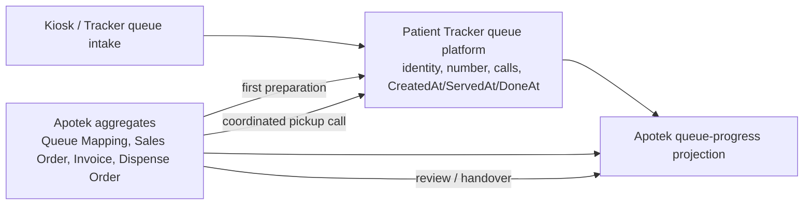

# Outpatient Apotek Queue Gap Analysis

**Artifact status:** Analysis / implementation planning input  
**Scope:** Reuse of the Patient Tracker queue platform by Outpatient Apotek  
**Compared against:** [Outpatient Apotek Screen and Aggregate Design](./outpatient-apotek-screen-and-aggregate-design.md), [Outpatient Apotek Workflow](./outpatient-apotek-workflow.md), current Admission queue UI in `c012_myhospital_web/src/modules/Admisi/views/RegistrasiRajal.vue`, and current Patient Tracker queue implementation.

## Conclusion

The Apotek design can reuse the **Patient Tracker queue platform**—queue identity, number and label, service-point session, call/display mechanism, `CreatedAt` / `ServedAt` / `DoneAt`, workstation/Loket identity, polling/refresh, and optimistic concurrency. It must **not reuse the Admission queue feature as-is**.

`RegistrasiRajal.vue` is an admission-specific workbench. Its queue actions mean “start registration” and “finish registration”; its worklist is enriched with booking and registration data; and its endpoint surface is hard-wired to `v1/admisi-rajal` and `v1/admission-queue`. Applying those actions directly in Apotek would create false clinical/fulfilment evidence and violates the design decision that pharmacy business actions, not generic queue buttons, cause queue milestone updates.

The recommended target is therefore a shared **queue-platform adapter/client contract** plus an Apotek-owned queue-progress projection and commands. Apotek business commands emit the two permitted Tracker transitions:

```text
first Medication Preparation Started
  -> Queue Service Started / ServedAt / In Service

coordinated pickup call
  -> Queue Service Completed / DoneAt / Done

Final Dispense Review and Medication Handover
  -> remain Apotek facts; do not change queue lifecycle
```

## Evidence: Current Admission Queue

The current frontend is feature-flagged and workstation-aware. `RegistrasiRajal.vue` composes `useOfficerAdmissionQueue`, the `OfficerAdmissionQueueWorkspace`, and the registration-assistance workbench. The reusable platform capabilities currently exposed through `AdmissionQueueService.ts` are:

| Capability | Current behavior | Reuse assessment |
|---|---|---|
| Queue worklist | Paged, filtered by business date, service point, status, and Loket; auto-polls; supports stale-data display and load-more. | Reuse query mechanics, not the admission item DTO/projection. |
| Queue identity and lifecycle | `antrianId` + `noUrut`; immutable label; `Waiting`, `InService`, `Done`, `Withdrawn`; timestamps included in worklist DTO. | Direct platform reuse. |
| Calling/display | `call`, `recall`, current-Loket display, call count, announcement version, one active claim per Loket. | Reuse for pharmacy administrative calls and pickup call, subject to pharmacy call semantics. |
| Workstation/Loket | Selected workstation resolves a trusted Loket; mutation headers carry workstation/Loket identity. | Direct platform reuse after pharmacy workstation configuration. |
| Concurrency/recovery | `rowVersion` is required for recall, return-to-waiting, and start-service; frontend refetches/invalidate queries after conflicts or indeterminate requests. | Direct platform pattern to retain. |
| Admission start | `start-service` changes the selected, outstanding Loket claim to `InService`; the UI immediately opens registration processing. | Do not expose as a direct Apotek operator action. |
| Admission completion | Registration workbench persists final registration outcome; `outcomes/established` completes the queue. | Do not reuse: it means registration, not pickup. |
| Admission cancellation/recovery | `return-to-waiting` and `cancel-registration` release/revert an admission claim/session. | Do not expose generically in pharmacy; use only an explicitly defined pharmacy compensation policy. |

The current `OfficerWorklistItem` is also admission-shaped: its enrichment is Patient identity plus Booking and Registration (`bookingId`, clinic, doctor, insurance, `regId`). It contains no prescription, queue mapping, Sales Order, invoice, clearance, Dispense Order, pickup, review, or handover information.

## Gap Matrix

| # | Needed by the Apotek design | Current admission implementation | Gap / risk | Required direction |
|---|---|---|---|---|
| G1 | Pharmacy service point and issuance through kiosk/tracker. | Service-point infrastructure and kiosk/display model exist, but code/routes/DTO names are admission-specific (`AdmissionServicePoint`, `admisi-rajal`). | No demonstrated pharmacy service-point configuration or pharmacy intake contract in the current Admission client. | Register/configure an outpatient pharmacy Service Point and expose pharmacy intake through the shared platform, with no admission booking/registration assumptions. |
| G2 | One pharmacy queue entry maps to zero or more independent medication demands. | Admission queue entry associates at most to one Tracker/booking/registration context; no mapping aggregate or mapping read model. | The UI has no cardinality, source, correction, or audit representation for mappings. | Implement `OutpatientQueueMapping` in Apotek and an Apotek projection grouped by queue entry but retaining each demand/Sales Order/Dispense Order identity. |
| G3 | Waiting sales worklist plus direct search for unmapped/external demand. | Admission worklist lists queue entries and filters locally by queue label, patient name, booking, and service point. Universal search resolves admission patient/booking/registration context. | It cannot find prescriptions, direct requests, Sales Orders, or unassociated external prescriptions. | Create an Apotek sales worklist/query with queue-number, patient, registration, prescription, direct-request, and Sales Order search; retain direct lookup independently of a queue association. |
| G4 | Administrative call for manual mapping must not set `ServedAt` or `DoneAt`. | `call`/`recall` correctly do not start service; only `start-service` changes to `InService`. | The current UI places “Hadir / Start Processing” beside call actions, which encourages the wrong transition if copied. | Reuse call/recall only; replace admission labels and remove direct start-service from mapping workbench. Define pharmacy call reason/presentation if display wording must distinguish mapping from pickup. |
| G5 | First **Medication Preparation Started** starts queue service exactly once. | A generic `start-service` endpoint requires an outstanding claim and is invoked by an Admission Officer before registration editing. | Preparation can begin from the Dispensing screen without a current counter claim. Requiring a call/claim first would contradict the design and make Tracker state depend on UI navigation. | Apotek `StartMedicationPreparation` must orchestrate an idempotent queue-service-start by queue identity, using concurrency protection; it must not rely on a generic button or registration session. Clarify whether the platform needs a service-origin/action reason and whether it may start without an outstanding call. |
| G6 | Dispensing worklist is per Dispense Order, optionally grouped by queue entry. | Admission worklist has exactly one queue item per patient queue; it locks the list around one Loket session. | No per-order lifecycle, partial preparation, failed-review return to `Preparing`, clearance, or stock outcome support. | Build an Apotek Dispense Order worklist/projection; call the queue platform only from the first qualifying preparation event. |
| G7 | One coordinated pickup call occurs only once every intended order is prepared or accountably resolved; it marks queue `Done`. | Admission `call` changes claim to Outstanding, while `Done` is reached only through registration outcome. There is no “call and complete queue” command. | Reusing `call` alone leaves the queue Waiting/Outstanding; reusing registration completion records a false registration outcome. The sequencing in the design (“call” then `Done`) is not represented by the existing API. | Add an Apotek-owned `CoordinatePickup` orchestration that validates readiness and records the pickup-call fact, then atomically/idempotently asks Patient Tracker to complete the queue. Decide whether a platform `complete-service` command may also create/refresh a display announcement, or expose a constrained combined pickup transition. |
| G8 | `DoneAt` means called for pickup, not handover; review/handover continue after queue completion. | Admission considers queue done when registration is conclusively established/not-established, and its UI archives/shows completed registrations. | A copied queue UI would imply service has finished and hide a patient whose medication is awaiting review/handover. | Serah Obat must have its own active projection categories—Ready for Pickup, Ready for Review, Ready for Handover, Completed—independent of Tracker `Done`; do not use the Admission “Registered” toggle. |
| G9 | Pharmacy-specific progress, attention counters, exception worklist, and Patient Medication Journey. | Admission projection exposes only queue, identity, booking, registration, call/claim data. | No data contract or ownership boundary for clinical, commercial, financial, inventory, or fulfilment facts. | Create read-only Apotek projections sourced from Apotek/external authoritative facts. Patient Tracker provides queue facts only. |
| G10 | No-show, expiry, return, correction, financial/inventory consequence handling after a pickup call. | Admission has `return-to-waiting`, withdraw, redirect, and registration cancellation paths; queue closing supports NoShow/Withdraw. | Returning a pharmacy queue to Waiting or changing `DoneAt` conflicts with the design, which preserves queue history after pickup and resolves medication via Apotek workflows. | Keep pharmacy exception commands in Apotek. Prohibit generic return/cancel/registration-outcome actions after pharmacy service starts/completes unless a later pharmacy policy explicitly defines a Tracker compensation. |
| G11 | Multiple pharmacy roles and screens can act on one queue’s independent demands. | One admission Loket claim locks the queue UI and assumes one officer’s registration session. | A single active Loket session is too restrictive as the coordination model for pharmacist review, sales, dispensing, and handover, which may happen in different places/roles. | Treat Loket claim as a display/call ownership concern only. Do not use it as an Apotek work lock; authorize Apotek commands with their own aggregate/concurrency rules. |
| G12 | Patient Tracker continuity using a real TrackerId, including manual mapping. | Admission supports anonymous queue issuance and later irreversible Tracker association. The older pharmacy integration report describes a separate Farinv queue linked by `PasienTrackerId`. | The proposed design requires both Tracker Mapping and Manual Mapping, while platform association rules and legacy Farinv queue behavior are not yet reconciled. | Specify when a pharmacy entry must have a real TrackerId, how a direct/unresolved queue becomes identified, and whether `OutpatientQueueMapping` may exist while tracker association is unresolved. Do not create a second pharmacy queue merely to obtain a TrackerId. |
| G13 | API and vocabulary usable outside Admission. | Service is named `AdmissionQueueService`; worklist endpoint is `v1/admisi-rajal/officer-worklist`; completion route is `outcomes/established`. | Reusing the client or contracts would couple Apotek to admission terminology and outcome semantics. | Extract platform-level DTOs/client operations, or add pharmacy-specific adapters/endpoints over the platform. Keep admission enrichment and registration outcome endpoints in the Admission module. |
| G14 | Accurate, reliable cross-context milestone updates. | The current Admission UI uses query invalidation, polling, row versions, and conflict recovery. Historical pharmacy integration uses HTTP evidence append and notes no outbox for `Apotek-*`. | A partial failure can leave Dispense Order/queue/timeline divergent; the design needs idempotency for first-start and coordinated pickup. | Define command idempotency keys, causal references, retry/reconciliation behavior, and preferably durable integration/outbox handling for Apotek → Tracker updates. |

## Existing Pharmacy Baseline That Must Be Reconciled

The Patient Tracker F-09 implementation report documents an existing, separate Farinv pharmacy queue. It uses `Taken → Assigned → Prepared → Delivered`, has `PasienTrackerId` and `ServedAt`, and emits `Apotek-Start` on sale confirmation and `Apotek-Done` on delivery. That baseline conflicts with the newer screen/aggregate decision in several material ways:

| Existing F-09 behavior | New design requirement | Reconciliation required |
|---|---|---|
| Separate Farinv queue session/entry, not the Admission queue platform. | Patient Tracker queue infrastructure is shared with Outpatient Admission. | Choose the canonical queue entry identity. Migrate/adapt rather than run two active queue identities for the same pharmacy interaction. |
| `ConfirmSale` causes `ServedAt` / `Apotek-Start`. | The first Medication Preparation Started causes `ServedAt`. | Move the trigger from sale confirmation to the first qualifying Dispense Order preparation event. |
| `Deliver` causes `DoneAt` / `Apotek-Done`. | Coordinated pickup call causes `DoneAt`; handover follows and is an independent fact. | Move completion evidence to pickup coordination; retain handover only in Apotek. Rename/redefine evidence if `Apotek-Done` would otherwise falsely mean handover. |
| Entry lifecycle includes `Prepared` and `Delivered`. | Tracker lifecycle remains only `Waiting`, `In Service`, `Done`; Dispense Order owns preparation/review/handover states. | Stop treating pharmacy fulfilment states as queue states. Preserve legacy data/history through an adapter or migration. |
| Active-entry deduplication is by TrackerId/session. | A common queue may map to multiple independent demands, and mapping may be manual/unresolved. | Use Queue Entry identity as the coordination key; define appropriate deduplication for entry issuance and mapping, not only TrackerId. |

This reconciliation is a prerequisite, not a cosmetic refactor. Leaving both models active would produce duplicate numbers, inconsistent `ServedAt`/`DoneAt`, and ambiguous queue display ownership.

## Target Boundary and Command Ownership



| Command / fact | Owner | Tracker effect |
|---|---|---|
| Issue pharmacy queue number | Patient Tracker | Creates `Waiting` entry and `CreatedAt`. |
| Call / recall for mapping | Patient Tracker call facility, initiated from Apotek | Call/display evidence only; no service timestamp. |
| Map / correct medication demand | Apotek `OutpatientQueueMapping` | None. |
| Start medication preparation | Apotek `DispenseOrder` orchestration | First qualifying event starts Tracker service once (`ServedAt`, `In Service`). |
| Complete medication preparation / final review / handover | Apotek aggregates | None. |
| Coordinate pickup call | Apotek orchestration after readiness validation | One call plus Tracker completion once (`DoneAt`, `Done`). |
| No-show / expiry / return / correction | Apotek and its external authorities | No reopening or rewriting of `DoneAt`. |

## Delivery Plan

1. **Resolve the canonical identity and event semantics.** Decide the migration/adapter path from the F-09 Farinv queue to the shared Patient Tracker queue. Confirm that `ServedAt` is preparation-start and `DoneAt` is pickup-call, not sale/handover.
2. **Make the queue platform pharmacy-capable.** Add pharmacy service-point/workstation configuration, pharmacy intake, and constrained service-start/complete operations with row-version/idempotency behavior. Keep admission endpoints and registration outcomes unchanged.
3. **Build the Apotek queue read model.** Implement `OutpatientQueueMapping` and queue-facing projections for Sales, Dispensing, Serah Obat, attention counters, exceptions, and Patient Medication Journey.
4. **Implement Apotek-owned orchestration.** Connect first preparation and coordinated pickup to the platform transitions, with retry/reconciliation and audit references. Do not wire UI buttons directly to generic Admission start/completion actions.
5. **Deliver screen-specific worklists.** Reuse shared queue rendering/call/display primitives only after they accept a pharmacy item contract. Keep per-demand and per-Dispense-Order actions in the Apotek workbenches.
6. **Verify the critical cases.** At minimum: unmapped direct queue; one queue with multiple demands; review before arrival; General, BPJS, and mixed clearance; preparation start once; failed final review; pickup call before handover; no-show after `DoneAt`; conflict/retry; and display refresh.

## Acceptance Criteria for Reuse

The queue integration is ready for the outpatient Apotek screens only when all of the following are true:

- A pharmacy queue number is issued through one canonical Tracker queue entry and appears on the queue display.
- Mapping and administrative calls never write `ServedAt` or `DoneAt`.
- Starting the first eligible preparation writes exactly one `ServedAt`; later orders and retries do not change it.
- A queue with multiple medication demands can show independent commercial and fulfilment progress without merging identities.
- The pickup call is permitted only after intended orders are prepared or accountably resolved, and writes exactly one `DoneAt` without asserting handover.
- Final review, education, and handover can continue after Tracker state is `Done` and remain visible in Serah Obat.
- Pharmacy exception resolution cannot use admission registration completion/cancellation/return-to-waiting actions to alter completed queue history.
- All cross-context writes are concurrency-safe, idempotent, auditable, and recoverable after a client/network failure.

## Source Evidence

- `c012_myhospital_web/src/modules/Admisi/views/RegistrasiRajal.vue`
- `c012_myhospital_web/src/modules/Admisi/composables/useOfficerAdmissionQueue.ts`
- `c012_myhospital_web/src/modules/Admisi/composables/admissionQueueActionRules.ts`
- `c012_myhospital_web/src/modules/Admisi/queries/AdmissionQueueService.ts`
- `c012_myhospital_web/src/modules/Admisi/types/admissionQueue.ts`
- `b09-bilreg-api/docs/contexts/pasien-tracker/TRACKER-ADMISSION-QUEUE-DOMAIN.md`
- `b09-bilreg-api/docs/contexts/pasien-tracker/tracker-f09-implementation-report.md`
