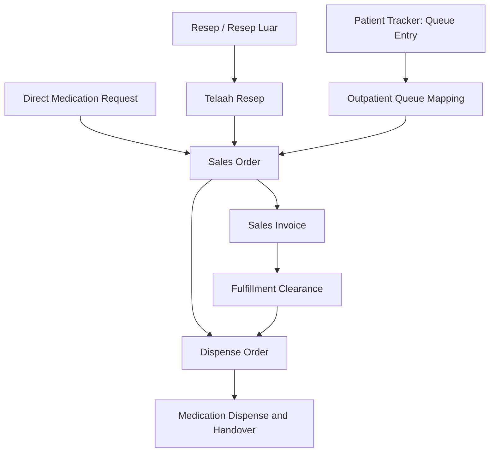

# Outpatient Apotek Screen and Aggregate Design

**Artifact status:** Proposed design decision  
**Bounded context:** Apotek (`Pelayanan Obat Pasien`)  
**Scope:** Outpatient pharmacy  
**Related artifacts:** [Apotek Domain](./apotek-domain.md), [Outpatient Apotek Workflow](./outpatient-apotek-workflow.md), [Outpatient Apotek SOP](./sop/DAFTAR-SOP-APT-RJ.md)

## 1. Decision Summary

Outpatient Apotek will use **four operational screens**. Each screen has a **worklist** for selecting work and a **workbench** for completing accountable actions.

The screens are organized by operational role and business responsibility, rather than by one screen per SOP. The General Patient, BPJS, and mixed-coverage workflows are payer-specific paths inside the same operational workbenches.

| Screen | Primary role | Worklist | Workbench outcome |
|---|---|---|---|
| Telaah Resep | Pharmacist | Outpatient electronic prescriptions and recorded external prescriptions | Professional review result and Sales Order establishment |
| Pelayanan Penjualan | Pharmacy Staff | Waiting outpatient pharmacy queue entries, with direct lookup for external demand | Queue mapping, direct-demand acceptance, payer handling, and applicable sale establishment |
| Dispensing | Pharmacy Staff | Released or in-progress Dispense Orders, grouped by pharmacy queue entry | Prepared medication and accountable preparation outcome |
| Serah Obat | Pharmacist, supported by Pharmacy Staff | Queue entries whose intended medication is ready for pickup | Final review, recipient verification, education, dispense, and handover |

This decision assumes that queue-number issuance is owned by [c013-kiosk-queue-display-web](../../../c013-kiosk-queue-display-web/) and that the queue infrastructure is shared with Outpatient Admission.

## 2. Governing Principles

1. A pharmacy queue entry groups a Patient's counter interaction; it does not merge prescriptions, Sales Orders, Sales Invoices, or Dispense Orders.
2. Sales, physical preparation, and handover are separate accountable facts. A completed payment or queue does not prove medication handover.
3. A Sales Invoice must be derived from accountable Sales Order Lines. Users must not manually create independent medication invoice items.
4. Dispensing is not a status update on a Sales Order. It is executed through a separate Dispense Order aggregate.
5. The existing Patient Tracker owns pharmacy queue identity, queue number, and queue lifecycle. Apotek owns its mapping from a queue entry to medication demand, as well as its own operational and fulfillment facts.
6. The four-screen model is an outpatient scope decision. It does not preclude inpatient, emergency, unit-dose, or future exception-focused worklists.

## 3. Screen Design

### 3.1 Screen Telaah Resep

**Primary user:** Pharmacist.

#### Worklist

- Electronic outpatient prescriptions available for review.
- External or physical prescriptions already recorded by Pharmacy Staff.
- Optional filters for urgency, originating unit, prescribing clinician, and review state.

Patient arrival and pharmacy queue mapping are not prerequisites for review. A Pharmacist may review an available prescription before the Patient is present at the pharmacy.

#### Workbench

The workbench lets the Pharmacist:

1. verify patient, prescription source, medication, dosage instruction, quantity, and available clinical information;
2. decide each prescription line as accepted as prescribed, accepted with an authorized substitute, or rejected;
3. record the substitute, reason, quantity, and responsible Pharmacist when applicable;
4. complete the review as `Approved`, `Partially Approved`, or `Rejected`; and
5. establish one Sales Order for an approved or partially approved prescription.

The original prescription remains unchanged. Clarification with the prescriber remains outside the system and does not create a special workflow state.

### 3.2 Screen Pelayanan Penjualan

**Primary user:** Pharmacy Staff.

#### Worklist

- Outpatient pharmacy queue entries in `Waiting` state.
- A direct patient, registration, prescription, or queue-number search for work that does not yet have a usable queue association.

The screen must show the separate progress of every medication demand mapped to a common queue entry. It must not merge their Sales Orders, invoices, or fulfillment work.

#### Workbench

The workbench contains four activities.

1. **Map queue number to medication demand**
   - Associate one queue entry with one or more existing prescriptions, Direct Medication Requests, or resulting Sales Orders.
   - Support both Tracker Mapping and Manual Mapping.
   - Correct an incorrect mapping without rewriting unrelated demand.

2. **Record external prescription**
   - Record the external or physical prescription as a source document.
   - Route it to Telaah Resep; it is not sold directly.

3. **Record direct medication request**
   - Record an authorized request without a prescription.
   - Accept it within Pharmacy Staff authority, route it for Pharmacist approval when required, or decline it.
   - Establish a Sales Order only after the request is accepted.

4. **Manage sale and return/correction request**
   - Determine payer allocations and show the calculated Patient-payable amount.
   - For General Patient quantities, capture verbal purchase confirmation and establish a Sales Invoice from the applicable Sales Order Lines.
   - For BPJS quantities, show SEP and Fornas coverage outcomes; do not request Patient payment or establish the BPJS Sales Invoice early.
   - For mixed coverage, keep BPJS-covered and Patient-payable allocations distinct.
   - Submit a return or correction request rather than freely reversing a sale. A post-payment or post-handover return requires the applicable supervisor, Inventory, and Tata Rekening outcomes.

Queue mapping and General Patient purchase confirmation can occur in the same counter interaction. Neither action records pharmacy `ServedAt` or `DoneAt`.

### 3.3 Screen Dispensing

**Primary user:** Pharmacy Staff.

#### Worklist

- Dispense Orders that are `Released`, `Preparing`, or returned to `Preparing` after a failed final review.
- The list may be grouped by pharmacy queue entry for operational convenience, but selection and update remain per Dispense Order.

#### Workbench

The workbench lets Pharmacy Staff:

1. view applicable Fulfillment Clearance and stock reservation outcomes;
2. begin preparation only for authorized quantities;
3. perform picking, counting, labelling, packaging, and compounding when required;
4. record preparation completion and move the Dispense Order to `Prepared`;
5. record or display shortage, backorder, cancellation, and other accountable exceptions; and
6. show prepared medication as in-transit until accountable handover or final inventory disposition.

The first `Medication Preparation Started` event is Pharmacy Service Start Evidence. It causes Patient Tracker to record `ServedAt` and move the pharmacy queue entry to `In Service`.

**Design decision:** Dispensing is a transaction represented by `Dispense Order`; it is not merely a `SalesOrder.Status` update. This preserves independent sales, payment/coverage, stock, preparation, final review, and handover lifecycles.

### 3.4 Screen Serah Obat

**Primary user:** Pharmacist. Pharmacy Staff performs the physical handover after Pharmacist authorization.

#### Worklist

- Pharmacy queue entries where every Dispense Order intended for the coordinated pickup is `Prepared` or has an accountable exception outcome.
- Each worklist item presents the per-demand and per-Dispense-Order progress beneath the common queue entry.

#### Workbench

The workbench supports the following sequence:

1. Pharmacy Staff performs one coordinated pickup call after all intended orders are ready or accountably resolved.
2. Patient Tracker records `DoneAt` and moves the queue entry to `Done`.
3. With the Patient or caregiver present, the Pharmacist verifies the Authorized Recipient.
4. The Pharmacist completes a Final Dispense Review for every prepared Dispense Order and records Patient Education.
5. A passed review moves the Dispense Order to `Reviewed`; a failed review returns only that order to `Preparing` and appends an immutable review record.
6. After Pharmacist authorization, Pharmacy Staff completes the physical handover.
7. The system records Medication Dispense and Medication Handover for every applicable quantity, requests the Inventory Issue outcome, and applies payer-specific sales consequences.

For current outpatient BPJS policy, successful handover establishes the BPJS Sales Invoice. For a General Patient, the invoice may already be financially cleared before preparation. In both cases, queue completion is not evidence of handover.

## 4. Shared Queue Integration Decision

Apotek will reuse the Patient Tracker queue infrastructure also used by Outpatient Admission. This reuse is limited to queue identity, numbering, display, calling, and lifecycle.

| Queue milestone | Apotek action | Meaning |
|---|---|---|
| `CreatedAt` / `Waiting` | Queue number issued by kiosk or tracker | Patient has a pharmacy queue entry; medication demand may still be unmapped or unreviewed |
| `ServedAt` / `In Service` | First applicable Dispense Order records `Medication Preparation Started` | Physical pharmacy preparation has started |
| `DoneAt` / `Done` | Pharmacy Staff performs coordinated pickup call | Patient has been called for pickup; it does not prove final review or handover |

Apotek must expose its own queue-facing progress projection. Patient Tracker must not become authoritative for Telaah Resep, Sales Invoice, payment/coverage clearance, Dispense Order, review, or handover status.

The Admission queue's generic actions must therefore not be reused as direct pharmacy business transitions. Pharmacy-specific actions emit the corresponding Patient Tracker queue updates at the defined milestones.

## 5. Aggregate Discovery

### 5.1 Aggregate map

### 5.2 Aggregate roots and responsibilities

| Aggregate root | Responsibility | Does not own |
|---|---|---|
| `TelaahResep` | Keeps the prescription source, per-line professional disposition, responsible Pharmacist, and final review outcome consistent | Original clinical prescription and prescriber clarification communications |
| `SalesOrder` | Owns accepted demand, Sales Order Lines, accepted quantity, fulfillment/unfulfilled progress, and overall resolution; reconciles commercial and fulfillment quantities | Payment settlement, inventory balance, physical preparation, or handover execution |
| `SalesInvoice` | Owns one medication sale, invoice items, pricing snapshot, payer, financial disposition, and commercial adjustments | Sales Order quantity authority, payment evidence, stock, or physical dispensing |
| `DispenseOrder` | Owns preparation, lines, immutable final review attempts, Medication Dispense, Medication Handover, expiry, cancellation, return, and non-fulfillment outcomes | Sales Invoice payment settlement and authoritative stock balance |
| `OutpatientQueueMapping` | Associates one externally owned queue entry with one medication-demand source; identifies Tracker or Manual Mapping | Queue identity/lifecycle and the lifecycle of the mapped prescription or Sales Order |

### 5.3 Relationships and invariants

1. `TelaahResep` completes before an accepted prescription establishes its `SalesOrder`.
2. A `SalesOrder` owns one or more Sales Order Lines. Each accepted line carries a fixed medication identity after establishment.
3. A `SalesInvoice` references exactly one Sales Order and may invoice one or more of its lines. Each invoice item references exactly one Sales Order Line.
4. A `DispenseOrder` references exactly one Sales Order and may fulfill one or more of its lines. Each dispense line references exactly one Sales Order Line.
5. Invoice quantity and dispense quantity may progress independently, but neither may exceed the applicable Sales Order Line authority.
6. A common queue entry may map to multiple medication demands. Each demand retains independent Telaah Resep, Sales Order, Sales Invoice, and Dispense Order identity and lifecycle.
7. A Sales Order becomes `Resolved` only after every accepted quantity and required commercial consequence reaches a final accountable outcome.
8. A Dispense Order becomes `Completed` only after accountable Medication Dispense and applicable Medication Handover are recorded.
9. A failed Final Dispense Review never overwrites history; it appends a review record and returns only the affected Dispense Order from `Prepared` to `Preparing`.

### 5.4 External authorities

The following are required collaborators, not Apotek aggregates:

| External authority | Apotek dependency |
|---|---|
| CPOE / clinical order authority | Original electronic prescription and clinician intent |
| Patient Tracker | Pharmacy queue entry identity, queue number, `CreatedAt`, `ServedAt`, and `DoneAt` |
| Inventory | Stock availability, reservation, issue, return eligibility, and final stock disposition |
| Payment / Cashier | Payment Clearance evidence |
| SEP and Fornas authorities | BPJS eligibility and item-level Coverage Clearance evidence |
| Tata Rekening | Financial charge, credit note, refund, and final settlement consequences |

## 6. Explicit Non-Decisions

This artifact intentionally does not define:

- physical database table design;
- API, event, or command contracts;
- detailed screen layout, component design, or navigation;
- inpatient, emergency, or unit-dose fulfillment worklists; or
- approval thresholds for direct medication requests, returns, and exceptional resolutions.

Those decisions should follow the aggregate boundaries established here.
