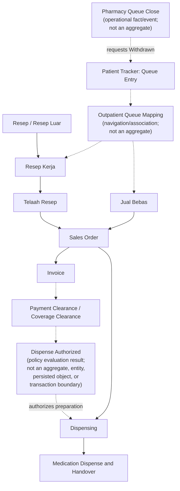

# Outpatient Apotek Screen and Aggregate Design

**Artifact status:** Proposed design decision  
**Bounded context:** Apotek (`Pelayanan Obat Pasien`)  
**Scope:** Outpatient pharmacy  
**Related artifacts:** [Apotek Domain](./apotek-domain.md), [Outpatient Apotek Workflow](./outpatient-apotek-workflow.md), [Outpatient Apotek SOP](./sop/DAFTAR-SOP-APT-RJ.md), [Outpatient Apotek Repository Gap Analysis](./outpatient-apotek-repository-gap-analysis-report.md) (BA-03), [Outpatient Apotek Persistence Design](./outpatient-apotek-persistence-design.md)

## 1. Decision Summary

Outpatient Apotek will use **four operational screens**. Each screen has a **worklist** for selecting work and a **workbench** for completing accountable actions.

The screens are organized by operational role and business responsibility, rather than by one screen per SOP. The General Patient, BPJS, and mixed-coverage workflows are payer-specific paths inside the same operational workbenches.

| Screen | Primary role | Worklist | Workbench outcome |
|---|---|---|---|
| Telaah Resep | Pharmacist | Outpatient electronic prescriptions and recorded external prescriptions | Professional review result and Sales Order establishment |
| Pelayanan Penjualan | Pharmacy Staff | Waiting outpatient pharmacy queue entries, with direct lookup for external demand; Exception Worklist for operational resolution | Queue mapping, direct-demand acceptance, payer handling, applicable sale establishment, and exception resolution |
| Dispensing | Pharmacy Staff | Released or in-progress Dispensings, grouped by pharmacy queue entry | Prepared medication and accountable preparation outcome |
| Serah Obat | Pharmacist, supported by Pharmacy Staff | Queue entries whose intended medication is ready for pickup, filtered by operational pickup categories | Final review, optional recipient reference, education, dispense, and handover |

Supporting operational decisions that do **not** add screens or aggregates:

- an **Exception Worklist** inside Pelayanan Penjualan for No-Show, expiry, return, correction, and pending financial or inventory consequences;
- optional **attention counters / filters** on each screen for prioritization;
- Serah Obat **operational worklist categories** for pickup prioritization;
- a read-only **Patient Medication Journey** projection for consolidated visibility;
- **Outpatient Queue Mapping** as a navigation/association mechanism only (BA-03); and
- **Pharmacy Queue Close** as an operational fact/event, not an aggregate.

This decision assumes that queue-number issuance is owned by c013-kiosk-queue-display-web and that the queue infrastructure is shared with Outpatient Admission.

## 2. Governing Principles

1. A pharmacy queue entry groups a Patient's counter interaction; it does not merge prescriptions, Sales Orders, Invoices, or Dispensings.
2. Sales, physical preparation, and handover are separate accountable facts. A completed payment or queue does not prove medication handover.
3. An Invoice must be derived from accountable Sales Order Items. Users must not manually create independent medication invoice items or free-form non-medication invoice items. BHP appears as a catalog sales item. Packaging and compounding fees are item-level charges. Rounding and other transaction-wide adjustments are invoice-level charges.
4. Dispensing is not a status update on a Sales Order. It is executed through a separate Dispensing aggregate.
5. The existing Patient Tracker owns pharmacy queue identity, queue number, and queue lifecycle. Outpatient Queue Mapping is a navigation/association mechanism only; it is not an aggregate root and does not own queue or medication-demand lifecycle. Apotek owns its operational and fulfillment facts on the Pharmacy aggregates (`TelaahResep`, `SalesOrder`, `Invoice`, `Dispensing`). Pharmacy Queue Close is an operational fact/event that requests Patient Tracker `Withdrawn`; it is not an aggregate.
6. The four-screen model is an outpatient scope decision. It does not preclude inpatient, emergency, unit-dose, or future exception-focused worklists.
7. Operational worklists, attention indicators, and patient-journey views are projections and UX aids. They do not introduce workflow states, aggregate roots, or alternate lifecycles.
8. Dispense Authorized is a policy evaluation result derived from financial and/or coverage evidence. It authorizes Medication Preparation and Dispensing. It is not an aggregate, entity, persisted business object, source of truth, or transaction boundary.
9. Available Stock and Current Stock serve different purposes. Current Stock answers how much inventory physically exists. Available Stock answers how much inventory can still be promised to a new Sales Order. Screens that support Sales Order establishment and shortage evaluation use Available Stock. Neither concept is an Apotek aggregate. Available Stock SHALL NOT be displayed or treated as equivalent to Current Stock.

## 3. Screen Design

### 3.1 Screen Telaah Resep

**Primary user:** Pharmacist.

#### Worklist

- Electronic outpatient prescriptions available for review.
- External or physical prescriptions already recorded by Pharmacy Staff.
- Optional filters for urgency, originating unit, prescribing clinician, and review state.

Patient arrival and pharmacy queue mapping are not prerequisites for review. A Pharmacist may review an available prescription before the Patient is present at the pharmacy.

#### Workbench

The workbench lets the Pharmacist:

1. verify patient, prescription source, medication, dosage instruction, quantity, and available clinical information;
2. decide each Baris Resep as accepted as prescribed, accepted with an authorized substitute, or rejected;
3. record the substitute, reason, quantity, and responsible Pharmacist when applicable;
4. complete the review as `Approved`, `Partially Approved`, or `Rejected`; and
5. establish one Sales Order for an approved or partially approved prescription. When Stock Shortage applies before Sales Order establishment, include only fulfillable items as determined from Available Stock, not from Current Stock.

The original prescription remains unchanged. Clarification with the prescriber remains outside the system and does not create a special workflow state. Clinical acceptance remains independent of Current Stock and Available Stock.

### 3.2 Screen Pelayanan Penjualan

**Primary user:** Pharmacy Staff.

#### Worklist

- Outpatient pharmacy queue entries in `Waiting` state.
- A direct patient, registration, prescription, or queue-number search for work that does not yet have a usable queue association.

The screen must show the separate progress of every medication demand mapped to a common queue entry. It must not merge their Sales Orders, invoices, or fulfillment work.

#### Exception Worklist

Pelayanan Penjualan also exposes an **Exception Worklist** for operational resolution. This is a worklist/projection inside the same screen, not a fifth operational screen and not a new aggregate.

The Exception Worklist surfaces cases that need accountable resolution under existing Sales Order, Invoice, Dispensing, Inventory, and Tata Rekening rules, including:

| Exception category | Typical operational concern |
|---|---|
| No Show | `Prepared` medication in Dispensing Temporary Custody was not collected; aligns with SOP APT-RJ-007 / `WF-APT-RJ-007` |
| Pickup Expired | Collection Window elapsed; awaiting override for handover or `WF-APT-RJ-007` close |
| Expired Medication | Authorized fulfillment expiry / `Collection Window Expired` and related Dispensing terminal outcomes |
| Return Request | Return of prepared, transferred, or handed-over medication awaiting Inventory disposition |
| Correction Request | Post-payment or post-handover commercial or fulfillment correction that must remain accountable. Direct Invoice revision is used when Tata Rekening still permits modification; Credit Note, Refund, or Financial Adjustment is used when it does not. Silent replacement without that permission or accountability is forbidden. |
| Financial Consequence Pending | Credit Note, Refund, or other Tata Rekening exception outcome still outstanding after expiry or return, when Invoice revision is no longer permitted |
| Inventory Disposition Pending | Return to Stock or other final Inventory disposition still outstanding |

Commands remain on the existing aggregates and external authorities. The worklist only selects and prioritizes work already governed by return/correction handling in this screen and by SOP APT-RJ-007 for uncollected medication.

#### Workbench

The workbench contains four activities.

1. **Map queue number to medication demand**
   - Associate one queue entry with one or more existing Resep Kerja or Jual Bebas. Mapping shall not target a Sales Order, Invoice, or Dispensing.
   - Support both Tracker Mapping and Manual Mapping.
   - Correct an incorrect mapping without rewriting unrelated demand.
   - Close a Queue Entry that is not progressed into the pharmacy workflow from `Waiting` with a mandatory close reason. Patient Tracker sets `Withdrawn`. This close is not available after `In Service`.

2. **Record external prescription**
   - Record the external or physical prescription as a source document.
   - Route it to Telaah Resep; it is not sold directly.

3. **Record direct medication request**
   - Record a retail-style request without a prescription, originating outside the hospital care workflow.
   - Accept or decline it. Optional Pharmacist consultation is SOP guidance only and is not an approval gate.
   - Establish a Sales Order only after the request is accepted.

4. **Manage sale and return/correction request**
   - Determine payer classification of Sales Order Items and show the calculated Patient-payable amount.
   - For General Patient quantities, capture verbal purchase confirmation and establish an Invoice from the applicable Sales Order Items.
   - For BPJS quantities, show SEP and Fornas coverage outcomes; do not request Patient payment or establish the BPJS Invoice early.
   - For mixed coverage, Fornas Not Covered items form an independent Patient-Pay Sales Order. Covered items remain on the BPJS-covered Sales Order. Do not keep uncovered lines on the BPJS fulfillment path.
   - For Partial Prescription Fulfillment, establish a Sales Order from selected or fulfillable prescription items only when Patient Request or Stock Shortage applies. For Stock Shortage, fulfillable quantity is Available Stock, not Current Stock. Excluded lines remain on the originating prescription. Issue Salinan Resep for unfulfilled items when external fulfillment is required. Pharmacist approves when professional review is required.
   - Submit a return or correction request rather than freely reversing a sale. When Tata Rekening still permits modification, the workbench may revise the same Invoice. When it does not, display the Credit Note, Refund, or Financial Adjustment exception path. A post-payment or post-handover return requires authorization by an authorized pharmacist according to operational policy, plus Inventory and Tata Rekening outcomes. No monetary approval threshold applies.
   - Resolve Exception Worklist items through the same accountable paths: No-Show / expiry under SOP APT-RJ-007, return and correction through authorized-pharmacist outcomes, and display of pending financial or inventory consequences without inventing stock or settlement facts.

Queue mapping and General Patient purchase confirmation can occur in the same counter interaction. Neither action records pharmacy `ServedAt` or `DoneAt`.

### 3.3 Screen Dispensing

**Primary user:** Pharmacy Staff.

#### Worklist

- Dispensings that are `Released`, `Preparing`, or returned to `Preparing` after a failed final review.
- The list may be grouped by pharmacy queue entry for operational convenience, but selection and update remain per Dispensing.

#### Workbench

The workbench lets Pharmacy Staff:

1. view applicable Dispense Authorized evaluation and Pharmacy Reserve (Stock Mutasi to Dispensing Temporary Unit) outcomes;
2. begin preparation only for authorized quantities;
3. perform picking, counting, labelling, packaging, and compounding when required;
4. record preparation completion and move the Dispensing to `Prepared`;
5. record or display shortage, Salinan Resep for unfulfilled items, cancellation, and other accountable exceptions; and
6. show prepared medication in Dispensing Temporary Custody until accountable handover or No Show return Mutasi.

The first `Medication Preparation Started` event is Pharmacy Service Start Evidence. It causes Patient Tracker to record `ServedAt` and move the pharmacy queue entry to `In Service`.

**Design decision:** Dispensing is a transaction represented by `Dispensing`; it is not merely a `SalesOrder.Status` update. This preserves independent sales, payment/coverage, stock, preparation, final review, and handover lifecycles.

### 3.4 Screen Serah Obat

**Primary user:** Pharmacist. Pharmacy Staff performs the physical handover after Pharmacist authorization.

#### Worklist

- Pharmacy queue entries where every Dispensing intended for the coordinated pickup is `Prepared` or has an accountable exception outcome.
- Each worklist item presents the per-demand and per-Dispense-Order progress beneath the common queue entry.

**Operational worklist categories** (projection-level filters for prioritization; not Dispensing states):

| Category | Operational meaning |
|---|---|
| Ready for Pickup | Intended medication is prepared or accountably resolved and awaiting the coordinated pickup call, within the Collection Window |
| Pickup Expired | Collection Window elapsed without Medication Handover; ordinary handover is blocked until Collection Window Override |
| Ready for Review | Patient or caregiver is present after the pickup call; Final Dispense Review is due |
| Ready for Handover | Final Dispense Review has passed and physical handover may proceed |
| Completed | Medication Dispense and Medication Handover are recorded for the intended quantities |

These categories do not change Dispensing lifecycle semantics (`Preparing`, `Prepared`, `Reviewed`, `Completed`, `Expired`, and related exception outcomes remain authoritative). The Collection Window (default 7 days) starts when the Dispensing first becomes Ready for Pickup. Pickup Expired is a projection only. The workbench structure is unchanged; categories only organize the worklist.

#### Workbench

The workbench supports the following sequence:

1. Pharmacy Staff performs one coordinated pickup call after all intended orders are ready or accountably resolved.
2. Patient Tracker records `DoneAt` and moves the queue entry to `Done`.
3. With the Patient or caregiver present, the Pharmacist operationally verifies the recipient. The system may optionally record phone number and relationship for reference; it does not validate identity, legal relationship, documents, or authorization.
4. The Pharmacist completes a Final Dispense Review for every prepared Dispensing and records Patient Education Acknowledgement (timestamp and responsible Pharmacist). Detailed counseling notes are optional.
5. A passed review moves the Dispensing to `Reviewed`; a failed review returns only that order to `Preparing` and appends an immutable review record.
6. After Pharmacist authorization, Pharmacy Staff completes the physical handover. If the worklist category is Pickup Expired, an authorized pharmacist must first record Collection Window Override with reason; ordinary handover is blocked until then.
7. The system records Medication Dispense and Medication Handover for every applicable quantity, requests Remove Stock from Dispensing Temporary Unit, and applies payer-specific sales consequences.

For current outpatient BPJS policy, successful handover establishes the BPJS Invoice. For a General Patient, the invoice may already be financially cleared before preparation. In both cases, queue completion is not evidence of handover.

If No Show Resolution (`WF-APT-RJ-007`) occurs before the pickup call, Patient Tracker may record `DoneAt` and move the still-`In Service` Queue Entry to `Done` without a pickup call. If the Queue Entry is already `Done`, `DoneAt` is retained. `DoneAt` is never reversed. No new queue status is introduced.

### 3.5 Shared operational projections

#### Attention counters / attention filters

Each operational screen may expose lightweight attention indicators for prioritization and filtering. Examples:

| Indicator | Typical screen use |
|---|---|
| Need Review | Telaah Resep or Serah Obat final review pending |
| Need Payment | Pelayanan Penjualan General Patient or mixed Patient-payable amount awaiting clearance |
| Need Preparation | Dispensing work waiting to start or continue |
| Ready Pickup | Serah Obat coordinated pickup ready |
| Need Resolution | Pelayanan Penjualan Exception Worklist items |

These indicators are optional operational productivity aids. They:

- do not represent workflow states;
- do not introduce new aggregates;
- do not alter aggregate lifecycles; and
- are UI / worklist concerns only.

Exact badge thresholds, colors, and placement remain implementation choices.

#### Patient Medication Journey projection

Apotek may expose a read-only **Patient Medication Journey** projection that consolidates one Patient's outpatient medication progress for operational visibility and troubleshooting.

It is **not**:

- a new aggregate;
- a new workflow; or
- a fifth operational screen.

It may be surfaced through a side drawer, detail panel, or contextual patient drill-down from any of the four screens. It may consolidate facts from:

- Queue Mapping;
- Telaah Resep;
- Sales Order;
- Invoice;
- Dispensing;
- Final Review; and
- Medication Handover;

together with visible payment/coverage, exception, and external disposition outcomes when already known.

The projection has no command responsibilities. All mutations continue through the screen workbenches and existing aggregates. Queue Mapping in this projection is the same navigation/association used by worklists; it is not an aggregate.

## 4. Shared Queue Integration Decision

Apotek will reuse the Patient Tracker queue infrastructure also used by Outpatient Admission. This reuse is limited to queue identity, numbering, display, calling, and lifecycle.

### 4.1 Canonical queue identity (BA-01)

**Decision:** Patient Tracker `QueueEntry` is the sole canonical outpatient-pharmacy queue identity.

| Rule | Requirement |
|---|---|
| Canonical identity | One Patient Tracker `QueueEntry` per outpatient-pharmacy interaction |
| F-09 evidence | `Apotek-Start` and `Apotek-Done` remain reusable but must reference `QueueEntryId` from Patient Tracker |
| Legacy Farinv | Deprecated; must not create active queue records |
| Historical Farinv data | Read-only |
| Dual-active model | Prohibited |

Legacy Farinv queue records may be consulted for historical reporting only. New outpatient-pharmacy intake, display, mapping, and milestone updates must use the shared Patient Tracker queue platform.

### 4.2 Queue milestones

| Queue milestone | Apotek action | Meaning |
|---|---|---|
| `CreatedAt` / `Waiting` | Queue number issued by kiosk or tracker | Patient has a pharmacy queue entry; medication demand may still be unmapped or unreviewed |
| `Withdrawn` | Pharmacy Staff records Pharmacy Queue Close with mandatory reason | Pre-service participation ended; not `In Service` or `Done`. TAKEN is not a Tracker state |
| `ServedAt` / `In Service` | First applicable Dispensing records `Medication Preparation Started` | Physical pharmacy preparation has started |
| `DoneAt` / `Done` | Pharmacy Staff performs coordinated pickup call, or authorized No Show Resolution completes an `In Service` Queue Entry | Queue service lifecycle completed; it does not prove final review or handover. `DoneAt` is never reversed. No new queue status. |

Apotek must expose its own queue-facing progress projection. Patient Tracker must not become authoritative for Telaah Resep, Invoice, payment/coverage clearance, Dispensing, review, or handover status.

The Admission queue's generic actions must therefore not be reused as direct pharmacy business transitions. Pharmacy-specific actions emit the corresponding Patient Tracker queue updates at the defined milestones.

## 5. Aggregate Discovery

### 5.1 Aggregate map

### 5.2 Aggregate roots and responsibilities

The Apotek aggregate-root list is exactly:

- `TelaahResep`
- `SalesOrder`
- `Invoice`
- `Dispensing`

| Aggregate root | Responsibility | Does not own |
|---|---|---|
| `TelaahResep` | Keeps the Resep Kerja source, per-item professional disposition, responsible Pharmacist, and final review outcome consistent | Original clinical prescription and prescriber clarification communications |
| `SalesOrder` | Owns accepted demand, Sales Order Items, accepted quantity, fulfillment/unfulfilled progress, and overall resolution; reconciles commercial and fulfillment quantities | Payment settlement, inventory balance, physical preparation, or handover execution |
| `Invoice` | Owns one medication sale, catalog sales items including BHP, item-level charges, invoice-level charges, pricing snapshot, payer, financial disposition, and commercial adjustments. Content remains mutable while Tata Rekening still permits modification. | Sales Order quantity authority, payment evidence, stock, physical dispensing, Tata Rekening permission rules, Financial Clearance, or a separate invoice-component model |
| `Dispensing` | Owns preparation, items, immutable final review attempts, Patient Education Acknowledgement, Collection Window Override when applicable, Medication Dispense, Medication Handover, expiry, cancellation, return, and non-fulfillment outcomes | Invoice payment settlement and authoritative stock balance |

`OutpatientQueueMapping` and Pharmacy Queue Close are **not** aggregate roots. They do not appear in the catalog above.

| Object | Classification | Responsibility | Does not own |
|---|---|---|---|
| `OutpatientQueueMapping` | Navigation/association mechanism only (BA-03) | Answers operational navigation and worklist questions: which queue entry is serving this Resep Kerja or Jual Bebas, and which Resep Kerja or Jual Bebas are associated with this queue entry. Identifies Tracker Mapping or Manual Mapping. The pharmacy-side endpoint is a Resep Kerja or a Jual Bebas only. Mapping shall not target a Sales Order, Invoice, or Dispensing. After a Sales Order exists, worklists join from the mapped demand to downstream Sales Order, Invoice, and Dispensing records; those joins are not mapping targets. | Business lifecycle, workflow state, approval state, operational progress, transactional consistency, or active/inactive relationship state. Queue identity and lifecycle remain owned by Patient Tracker. Medication demand lifecycle remains owned by the Pharmacy aggregates (`SalesOrder`, `Dispensing`, and related roots). No independent consistency boundary. |
| Pharmacy Queue Close | Operational fact/event | Pharmacy Staff fact that ends a Pharmacy Queue Entry not progressed into the pharmacy workflow. Records a mandatory close reason, responsible Pharmacy Staff, and effective business time. Requests Patient Tracker `Withdrawn` from `Waiting`. | Patient Tracker queue state itself (`Withdrawn` is set by Patient Tracker). Not an aggregate, not a queue state, and not a path that establishes a Sales Order, Dispensing, or Medication Handover. |
| Resep Kerja | Supporting document (BA-06) | Pharmacy operational copy of one Resep created at intake from the Prescription Contract. Telaah Resep and Sales Order establishment operate on this copy. | Original CPOE or legacy Resep authority. Source revisions create a review task and do not silently rewrite the copy. Not an aggregate root. |
| Jual Bebas (`JualBebas`) | Supporting document | One accepted retail-style medication request without a Resep. Decline creates no row. | Prescription review, Telaah Resep, or Pharmacist approval. Not an aggregate root. |

### 5.3 Dispense Authorized (not an aggregate)

**Design decision (BA-08):** Preparation authorization is **Dispense Authorized**.

Dispense Authorized is a **policy evaluation result** derived from financial and/or coverage evidence. It is not an aggregate, not an entity, not a persisted business object, not a source of truth, and not a transaction boundary.

It is required before Medication Preparation Started and physical dispensing. It is not required for Medication Handover. Handover remains governed by Prepared medication, passed Final Dispense Review, and Patient Education Acknowledgement.

Typical evidence used by the evaluation (`BR-APT-040`–`BR-APT-044`, `BR-APT-072`, `BR-APT-074`):

| Payer path | Evidence |
|---|---|
| General Patient | Invoice created; Payment Clearance |
| BPJS | Valid SEP; authoritative Fornas coverage (Coverage Clearance) |
| Other insurance | Valid coverage approval |

No parallel clearance object is introduced. The evaluation does not own Dispensing lifecycle, stock, or handover facts.

### 5.4 Relationships and invariants

1. `TelaahResep` completes before an accepted prescription establishes its `SalesOrder`.
2. A `SalesOrder` owns one or more Sales Order Items. Each accepted item carries a fixed medication identity after establishment.
3. An `Invoice` references exactly one Sales Order and may invoice one or more of its items. Each invoice item references exactly one Sales Order Item.
4. A `Dispensing` references exactly one Sales Order and may fulfill one or more of its items. Each dispensing item references exactly one Sales Order Item.
5. Invoice quantity and dispense quantity may progress independently, but neither may exceed the applicable Sales Order Item authority.
6. A common queue entry may be associated with multiple Resep Kerja or Jual Bebas through `OutpatientQueueMapping`. Mapping is a navigation/association mechanism only; it does not own lifecycle or transactional consistency. Mapping shall not target a Sales Order, Invoice, or Dispensing. Each mapped demand retains independent Telaah Resep, Sales Order, Invoice, and Dispensing identity and lifecycle.
7. A Sales Order becomes `Resolved` only after every accepted quantity and required commercial consequence reaches a final accountable outcome.
8. A Dispensing becomes `Completed` only after accountable Medication Dispense and applicable Medication Handover are recorded.
9. A failed Final Dispense Review never overwrites history; it appends a review record and returns only the affected Dispensing from `Prepared` to `Preparing`.
10. Dispense Authorized is a policy evaluation over financial and/or coverage evidence; it authorizes preparation quantity and does not own Dispensing lifecycle, stock, or handover facts.
11. Pharmacy Queue Close is an operational fact/event, not an aggregate and not a queue state. It requests Patient Tracker `Withdrawn` from `Waiting` and does not add a pharmacy state to the queue.
12. Available Stock is a fulfillment-planning concept used at Sales Order establishment and shortage evaluation. It is not an aggregate, not a persisted Apotek quantity, and not equivalent to Current Stock. Current Stock remains Inventory-owned physical inventory.

### 5.5 External authorities

The following are required collaborators, not Apotek aggregates:

| External authority | Apotek dependency |
|---|---|
| CPOE / clinical order authority | Original electronic prescription and clinician intent |
| Patient Tracker | Pharmacy queue entry identity, queue number, `CreatedAt`, `ServedAt`, `DoneAt`, and `Withdrawn` |
| Inventory / Stock Ledger | Current Stock, Stock Mutasi, Remove Stock, and movement history only. Does not own Available Stock, reservation, issue, `Prepared`, handover, or No Show status. |
| Payment / Cashier | Payment Clearance evidence |
| SEP and Fornas authorities | BPJS eligibility and item-level Coverage Clearance evidence |
| Tata Rekening | Financial permission for Invoice revision, Financial Charge, and Credit Note / Refund / Financial Adjustment exception outcomes |

### 5.6 Aggregate review of the operational decisions in this artifact

| Decision | Aggregate impact |
|---|---|
| Exception Worklist in Pelayanan Penjualan | None. Projection / worklist over existing Sales Order, Dispensing, Invoice, Inventory, and Tata Rekening outcomes |
| Attention counters / filters | None. UI prioritization only |
| Serah Obat operational categories | None. Worklist filters; Dispensing states remain authoritative |
| Dispense Authorized (BA-08) | None added. Policy evaluation result; **not** an aggregate, entity, persisted object, or transaction boundary |
| Patient Medication Journey | None. Read-only consolidation projection |
| Outpatient Queue Mapping (BA-03) | None added. Navigation/association mechanism only; **not** an aggregate root |
| Pharmacy Queue Close | None added. Operational fact/event; **not** an aggregate root |
| Available Stock vs Current Stock | None added. Available Stock is a planning concept at Sales Order establishment; Current Stock remains Inventory-owned. Neither is an Apotek aggregate |

**Conclusion:** The aggregate map in §5.1–§5.2 contains only `TelaahResep`, `SalesOrder`, `Invoice`, and `Dispensing` as aggregate roots. The operational decisions above are incorporated as screen/worklist behavior, projections, read models, UX aids, associations, or operational facts.

## 6. Explicit Non-Decisions

This artifact intentionally does not define:

- physical database table design (see [Outpatient Apotek Persistence Design](./outpatient-apotek-persistence-design.md));
- API, event, or command contracts;
- detailed screen layout, component design, or navigation;
- exact attention-badge thresholds, colors, or placement;
- detailed Patient Medication Journey drawer or panel layout;
- inpatient, emergency, or unit-dose fulfillment worklists;
- the Available Stock calculation formula (reserved for a future inventory-planning design activity).

Exception authorization for returns, corrections, expired collection overrides, and other dispensing exceptions is authority-based and is owned by the domain (`BR-APT-135`–`BR-APT-137`). This artifact does not introduce a monetary approval threshold.

Those remaining decisions should follow the aggregate boundaries established here.
