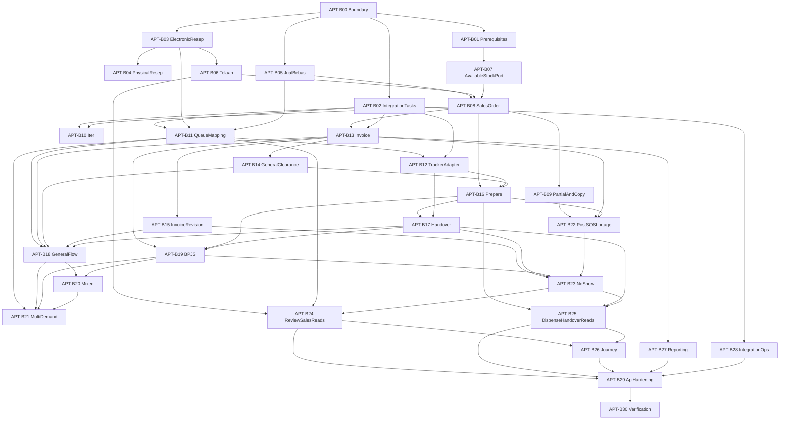

# Outpatient Apotek Implementation Master Plan and Progress Tracker

## 1. Planning analysis

### Artifact authority and evidence

Use this precedence when implementation details conflict:

1. Accepted ADRs: [ADR-APT-001](D:/Project.Aktif/MyHospitalWeb/b09-bilreg-api/docs/contexts/apotek/adr/ADR-APT-001-queu-boundary-and-pharmacy-workflow-state-ownership.md), [ADR-APT-002](D:/Project.Aktif/MyHospitalWeb/b09-bilreg-api/docs/contexts/apotek/adr/ADR-APT-002-pharmacy-stock-ledger-boundary.md), and [ADR-APT-003](D:/Project.Aktif/MyHospitalWeb/b09-bilreg-api/docs/contexts/apotek/adr/ADR-APT-003-invoice-mutability-owned-by-tata-rekening.md).
2. Canonical domain and workflow: [apotek-domain.md](D:/Project.Aktif/MyHospitalWeb/b09-bilreg-api/docs/contexts/apotek/apotek-domain.md), [outpatient-apotek-workflow.md](D:/Project.Aktif/MyHospitalWeb/b09-bilreg-api/docs/contexts/apotek/outpatient-apotek-workflow.md), and [active SOP index](D:/Project.Aktif/MyHospitalWeb/b09-bilreg-api/docs/contexts/apotek/sop/DAFTAR-SOP-APT-RJ.md).
3. Proposed implementation targets: [screen and aggregate design](D:/Project.Aktif/MyHospitalWeb/b09-bilreg-api/docs/contexts/apotek/outpatient-apotek-screen-and-aggregate-design.md) and [persistence design](D:/Project.Aktif/MyHospitalWeb/b09-bilreg-api/docs/contexts/apotek/outpatient-apotek-persistence-design.md).
4. Working artifacts only for unresolved gates and repository findings: [repository gap analysis](D:/Project.Aktif/MyHospitalWeb/b09-bilreg-api/docs/contexts/apotek/working/outpatient-apotek-repository-gap-analysis-report.md) and [Available Stock introduction](D:/Project.Aktif/MyHospitalWeb/b09-bilreg-api/docs/contexts/apotek/working/APOTEK-AVAILABLE-STOCK-CONCEPT-INTRODUCTION.md).
5. Do not use `docs/contexts/apotek/archive/` as current design.

Global implementation constraints come from [ENGINEERING.md](D:/Project.Aktif/MyHospitalWeb/b09-bilreg-api/docs/ENGINEERING.md), [WORKFLOW.md](D:/Project.Aktif/MyHospitalWeb/b09-bilreg-api/docs/WORKFLOW.md), [DATABASE.md](D:/Project.Aktif/MyHospitalWeb/b09-bilreg-api/docs/DATABASE.md), and [NAMING.md](D:/Project.Aktif/MyHospitalWeb/b09-bilreg-api/docs/NAMING.md).

### Current-state conclusion

- The target Apotek context is implementation-absent: there is no `ApotekContext`, no `BILRG_Apt*` schema, no conforming APIs, and no target tests.
- Legacy `SalesContext` Resep, Penjualan/DU, and checklist `TelaahModel` are coexistence dependencies or anti-patterns, not foundations for the new aggregates.
- Patient Tracker, Stock Ledger, Tata Rekening, integration-task patterns, and Lab aggregate repositories provide reusable platform mechanics.
- The frontend has one monolithic mock `ApotekRajal.vue`; its local queue states, deposit model, random values, and direct mutation conflict with ADR-APT-001 and the canonical workflows.
- The practical unit of delivery is therefore a business-capability vertical slice containing the minimum domain behavior, SQL, repository, application command/query, API contract, and tests needed for one measurable outcome.

### Fixed boundaries

- Four aggregate roots only: `TelaahResep`, `SalesOrder`, `Invoice`, and `Dispensing`.
- `ResepKerja`, `JualBebas`, `CopyResep`, queue mapping, and queue close are supporting documents/facts, not new aggregate roots.
- Patient Tracker owns `Waiting`, `InService`, `Done`, and `Withdrawn`; Apotek owns all pharmacy workflow states.
- `ServedAt` is caused by the first preparation start. `DoneAt` is caused by the coordinated pickup call, not handover.
- Stock Ledger owns current stock and movements. Apotek owns Available Stock as a planning concept. `Prepared` is never an inventory state.
- Invoice and Dispensing remain independent and reconcile through Sales Order Items.
- New Invoice and legacy DU coexist without dual-write. Unified reporting is read-only.
- Cross-context writes use `BILRG_AptIntegrationTask`; no distributed transaction or generic event bus.
- Do not create `BILRG_AptDispenseAuthorized`, `BILRG_AptPurchaseConfirmation`, `BILRG_AptCreditNote`, `BILRG_AptInvoiceCharge`, `BILRG_AptBackorder`, `BILRG_AptResepRevisionTask`, materialized worklists, or a unified sales table/view.

### Safe interims and release gates

Code-review `GO` means a slice meets its acceptance criteria. It does not imply production release. This distinction lets implementation proceed without allowing a planning agent to invent unresolved policy.

- `PD-03`: use the proposed interim widths (`PaymentClearanceReff VARCHAR(26)`, `SepNo VARCHAR(50)`) and preserve adapters so external formats can change without changing domain behavior.
- `PD-09`: define an `IAvailableStockPort`, use deterministic fakes in tests, and fail closed when no production evaluator is configured. Never substitute Current Stock or `GetAvailabilityAtLocationQuery` as Available Stock. Sales Order code may receive review GO; production Sales Order establishment remains release-blocked until the formula/owner is ratified.
- `PD-08`: support Invoice revision while Tata Rekening permits it and store optional `TataRekeningCorrectionReff`. Do not emit `BillingCredit` or invent an automated correction-request contract. Locked-charge correction remains an operator-driven Tata Rekening workflow until ratified.
- `BC-11`: persist no call-purpose field. Backend milestones follow the settled timing rules. Patient-facing wording and any transient announcement contract remain a conditional c013 follow-up gate.
- `BC-12`: require an authenticated actor, preserve actor identity and audit fields, and provide an authorization-policy seam. Do not invent the full role-command matrix. Production mutation endpoints remain release-blocked until the matrix is ratified.
- `BC-13`: implement only `CaptureNote` and `DocumentRef` for physical prescriptions. Do not invent image storage, retention, authenticity, or deduplication. Physical-prescription production rollout remains blocked.

### Scope

Primary plan:

- Backend domain, application, infrastructure, SQL Server schema, API contracts, projections, integrations, tests, and operational visibility in `b09-bilreg-api`.

Dependency-linked follow-up:

- Four outpatient workbenches, query/mutation clients, tests, and end-user documentation in `c012_myhospital_web`.

Conditional follow-up:

- `c013-kiosk-queue-display-web` changes only after BC-11 defines a non-persisted announcement contract. Queue lifecycle changes are not a c013 responsibility.

Out of scope:

- Inpatient, emergency, and UDD pharmacy workflows.
- New CPOE persistence; Apotek consumes a prescription contract.
- Replacing or migrating legacy DU.
- EMR realization when no receiving contract exists; retain it as a deferred integration-task type only after its contract is approved.

## 2. Recommended decomposition strategy

Use a hybrid vertical-slice strategy anchored to business outcomes, with aggregate boundaries controlling transactional scope and screen designs controlling read contracts.

Why this structure:

- A layer-first build would delay executable outcomes and force Composer 2.5 to hold the entire model in context.
- A screen-first build would reproduce the current monolithic mock and blur queue, commercial, and fulfillment ownership.
- One-SOP-per-slice would duplicate shared payer and handover mechanics and make mixed/multi-demand paths difficult to review.
- Small capability slices let Composer implement one invariant cluster at a time and let Grok issue an objective GO/NO-GO based on commands, persisted facts, and tests.
- SQL, repository, command/API, and tests should land together for each capability. The only technical foundation slices are boundaries, shared platform prerequisites, and the integration-task engine.

Execution rules for every backend slice:

- Target code lives under `Bilreg.Domain/ApotekContext/{Feature}`, `Bilreg.Application/ApotekContext/{Feature}`, `Bilreg.Infrastructure/ApotekContext/{Feature}`, `Bilreg.Api/Controllers/ApotekContext`, `Bilreg.SqlDb/ApotekContext`, and `Bilreg.Test/ApotekContext`.
- Do not place target behavior in `SalesContext/PenjualanFeature` or call neighbor DALs directly.
- Include explicit SQL and Dapper DALs; repositories reconstruct aggregates; application handlers own transactions.
- Every cross-context effect inserts an idempotent task in the same `TransHelper.NewScope()` transaction as the Apotek fact.
- Every command has optimistic-concurrency behavior where the aggregate carries `Version`.
- Every slice adds focused domain/handler/repository or contract tests; no slice defers all testing to the final phase.
- Implementation Agent moves a slice only to `IMPLEMENTED`. Review Agent alone records `GO` or `NO-GO`.
- Run affected project builds and filtered tests for each slice; run the full solution and full Apotek suite at each phase gate.

## 3. Backend implementation plan

### Phase 0 — Boundaries and reliable side effects

Why: all later slices need a clean namespace, required neighbor primitives, and one repeatable cross-context delivery mechanism. The phase stays small and does not attempt all persistence up front.

#### APT-B00 — Apotek module boundary

- Objective: establish the `ApotekContext` namespace, registration conventions, and an architecture test that prevents reuse of legacy DU/Telaah persistence.
- Dependencies: none.
- Target areas: all new `ApotekContext` roots under `src/bilreg`, DI registration, `Bilreg.Test/ApotekContext/Architecture`.
- Acceptance criteria:
  - Solution builds with the new module registered.
  - Architecture test rejects references from Apotek Application/Infrastructure to `PenjualanModel`, `IPenjualanDal`, legacy checklist `TelaahModel`, `IStokMutasiDal`, and `ITrsBillingDal`.
  - No existing legacy behavior is changed.
- Evidence: affected-project build, architecture test, file inventory.

#### APT-B01 — Neighbor prerequisites

- Objective: make required queue, stock, location, and collection-window primitives available without adding pharmacy workflow to neighbor state models.
- Dependencies: APT-B00.
- Target areas: Stock Ledger movement enum/handler tests, SQL seed/config scripts for Pharmacy Unit, Dispensing Temporary Unit, pharmacy `BILRG_AdmServicePoint`, and `APT_COLLECTION_WINDOW_DAYS` default 7.
- Acceptance criteria:
  - `DispenseIssue` is distinct from `SaleIssueDu` and has an explicit consequence path.
  - Pharmacy Unit and DTU use `LayananId`; no reservation table is introduced.
  - Pharmacy service point can be resolved by existing queue infrastructure.
  - collection-window parameter resolves to 7 when not overridden.
  - No new `BILRG_AntrianEntry` column or pharmacy queue status exists.
- Evidence: Stock Ledger tests, parameter/seed SQL review, solution build.

#### APT-B02 — Apotek Integration Task engine

- Objective: provide durable, idempotent, retryable delivery for all neighbor effects.
- Dependencies: APT-B00.
- Target areas: `BILRG_AptIntegrationTask`, task DTO/DAL, application dispatcher/worker, operational status contracts, worker tests.
- Acceptance criteria:
  - Insert enforces unique `IdempotencyKey` and records source, destination, payload, status, retry, error, and correlation.
  - Worker claims only `Pending` tasks using a status predicate and transitions deterministically to `Succeeded`, `Failed`, or `Dead`.
  - Duplicate delivery does not duplicate the neighbor effect in contract tests.
  - Tests prove a business save and task insert commit or roll back together.
  - It is not implemented as a generic domain-event store or distributed transaction.
- Evidence: DAL/worker/transaction tests and schema review.

Phase 0 gate: APT-B00 through B02 are `GO`; solution build and existing Stock Ledger/queue tests remain green.

### Phase 1 — Accept and convert medication demand

Why: this phase delivers the first observable pharmacy capability—intake, pharmacist review, and an accepted Sales Order—before billing or physical dispensing.

#### APT-B03 — Electronic and legacy Resep Kerja intake

- Objective: create an immutable pharmacy intake copy from the canonical prescription contract.
- Dependencies: APT-B00.
- Target areas: `ResepKerjaFeature` domain/supporting types, `BILRG_AptResepKerja*`, repository, `IPrescriptionContractPort`, intake command/API, tests.
- Acceptance criteria:
  - Intake supports Legacy Resep and CPOE source kinds through one application port.
  - Header, items, racik components, patient/registration, source, and Iter snapshots are stored.
  - A later source change does not silently rewrite the intake copy.
  - Items are rewriteable only before terminal Telaah; no revision-task table exists.
  - Duplicate source intake is handled deterministically by the documented source key/idempotency rule.
- Evidence: domain/repository/handler/API-contract tests.

#### APT-B04 — Physical Resep Kerja interim intake

- Objective: add the documented minimum physical/external prescription capture without inventing the unresolved BC-13 policy.
- Dependencies: APT-B03.
- Target areas: physical intake command/API and Resep Kerja validation tests.
- Acceptance criteria:
  - Physical source requires the existing patient/registration and the proposed `CaptureNote`/`DocumentRef` fields.
  - No image blob/table, retention policy, authenticity workflow, or deduplication algorithm is added.
  - API contract and tracker mark the path `RELEASE-BLOCKED: BC-13`.
  - Electronic intake remains independently usable.
- Evidence: handler/contract tests and explicit release-gate entry.

#### APT-B05 — Jual Bebas acceptance

- Objective: represent accepted direct medication demand without a pharmacist-review gate.
- Dependencies: APT-B00.
- Target areas: `JualBebasFeature`, `BILRG_AptJualBebas*`, repository, accept/decline commands/API, tests.
- Acceptance criteria:
  - Accept creates one header and catalog-backed items.
  - Ordinary decline creates no Jual Bebas row and no Sales Order.
  - Optional pharmacist consultation is not made a domain gate.
  - A later authorized cancellation is distinct from an ordinary pre-accept decline.
- Evidence: repository and command tests.

#### APT-B06 — Telaah Resep

- Objective: complete line-level professional review and expose a reviewable terminal outcome.
- Dependencies: APT-B03.
- Target areas: `TelaahResepFeature`, `BILRG_AptTelaahResep*`, repository, start/update/complete commands and APIs, tests.
- Acceptance criteria:
  - Lifecycle is `Available → UnderReview → Approved | PartiallyApproved | Rejected`.
  - Every line has an explicit disposition; substitute/reject requires reason and pharmacist identity.
  - Clarification communication is not persisted as a new entity.
  - Terminal review freezes review items and the underlying Resep Kerja items.
  - Rejected review cannot establish a Sales Order; partial review exposes only accepted quantities.
- Evidence: state-matrix domain tests, repository freeze tests, API error-contract tests.

#### APT-B07 — Available Stock contract and fail-closed adapter

- Objective: isolate the unresolved Available Stock formula so Sales Order behavior can be coded and tested without treating Current Stock as authority.
- Dependencies: APT-B01.
- Target areas: Application `IAvailableStockPort`, result/error contract, deterministic test provider, production registration behavior.
- Acceptance criteria:
  - Available Stock is evaluated at Sales Order establishment and is never persisted as a stock column or snapshot authority.
  - No production adapter returns Current Stock as Available Stock.
  - When no authoritative evaluator is configured, establishment fails with an explicit operational result and no rows are committed.
  - Test fakes support full, partial, and zero available quantities.
  - Tracker marks production Sales Order establishment `RELEASE-BLOCKED: PD-09` until an adapter is ratified.
- Evidence: contract tests proving fail-closed and no persistence.

#### APT-B08 — Sales Order establishment

- Objective: establish accepted demand with quantitative authority and source traceability.
- Dependencies: APT-B05, APT-B06, APT-B07.
- Target areas: `SalesOrderFeature`, `BILRG_AptSalesOrder*`, repository, establish command/API, tests.
- Acceptance criteria:
  - Source is exactly one Resep Kerja or Jual Bebas; prescription path requires terminal non-rejected Telaah.
  - At least one item has positive Accepted Qty.
  - Unique active key is `(SourceKind, SourceId, RegId, PayerPath)` for Established/Active rows.
  - Medication identity is fixed after establishment.
  - `InvoicedQty`, `DispensedQty`, and `UnfulfilledQty` cannot exceed Accepted Qty and reconcile objectively.
  - Establishment uses `IAvailableStockPort` and rolls back on unavailable evaluation.
- Evidence: aggregate invariant tests, filtered-index/repository tests, handler transaction tests.

#### APT-B09 — Partial fulfillment and Copy Resep

- Objective: record accountable pre-Sales-Order exclusion and external-fulfillment evidence.
- Dependencies: APT-B07, APT-B08.
- Target areas: `BILRG_AptCopyResep*`, `BILRG_AptUnfulfilledOutcome`, Copy Resep commands/API, Sales Order partial rules, tests.
- Acceptance criteria:
  - Supported partial reasons are Patient Request, Stock Shortage, and later Fornas Not Covered; no Backorder is created.
  - Stock-shortage quantity comes only from the Available Stock port.
  - Copy Resep references source lines and excluded quantities.
  - Unfulfilled outcomes are append-only and cannot be delete/insert rewritten.
  - Post-establishment shortage does not trim Sales Order identity or Accepted Qty; it is handled in APT-B22.
- Evidence: partial-path tests and append-only persistence tests.

#### APT-B10 — Iter consumption delivery

- Objective: consume legacy prescription Iter through an idempotent contract after Sales Order establishment.
- Dependencies: APT-B02, APT-B03, APT-B08.
- Target areas: prescription contract extension, `IterConsume` task handler, correlation/audit tests.
- Acceptance criteria:
  - Intake does not consume Iter.
  - Sales Order establishment enqueues one deterministic `IterConsume` task when applicable.
  - Source remains authoritative; Apotek’s copied count is visibility only.
  - Missing live adapter leaves a failed/retryable task and visible operational error, not a silent success.
- Evidence: enqueue/idempotency/adapter-failure tests.

Phase 1 gate: an API test can intake a prescription, complete approved/partial/rejected Telaah, establish an accepted Sales Order with a deterministic Available Stock test provider, and issue Copy Resep for excluded quantities.

### Phase 2 — Queue association and canonical milestones

Why: queue coordination becomes useful only after demands exist, and it must be correct before preparation and pickup workflows begin.

#### APT-B11 — Queue mapping and Pharmacy Queue Close

- Objective: associate one Patient Tracker queue entry with one or more medication demands and close untouched queue work accountably.
- Dependencies: APT-B02, APT-B03, APT-B05.
- Target areas: `BILRG_AptQueueMapping`, `BILRG_AptQueueClose`, mapping/close repositories, commands/APIs, per-demand summary contract, tests.
- Acceptance criteria:
  - Mapping target is only Resep Kerja or Jual Bebas, never Sales Order/Invoice/Dispensing.
  - One demand has one current mapping; correction updates that row in place.
  - One queue can map multiple independent demands.
  - Mapping does not write `BILRG_AntrianEntry.ReffId` and does not change `ServedAt`/`DoneAt`.
  - Close requires Waiting state and reason, inserts one close fact, and enqueues `TrackerWithdrawn` atomically.
  - Close after InService is rejected.
- Evidence: multi-demand, correction, close-state, and transaction tests.

#### APT-B12 — Patient Tracker pharmacy adapter

- Objective: deliver canonical start, pickup-complete, no-show-complete, and withdrawn milestones without Admission-specific outcomes.
- Dependencies: APT-B02, APT-B11.
- Target areas: `ITrackerPharmacyPort`, integration-task handlers, F-09 evidence adaptation, queue concurrency contracts, tests.
- Acceptance criteria:
  - `TrackerServedAt` sets Serve/`Apotek-Start` once from first preparation-start evidence.
  - `TrackerDoneAtPickup` and `TrackerDoneAtNoShow` share an idempotent queue-done key and never reverse Done.
  - `TrackerWithdrawn` works only from Waiting.
  - Commands use canonical queue-entry identity and existing row-version/concurrency behavior.
  - Admission `start-service` and registration outcome commands are not reused.
  - No call-purpose field is persisted; BC-11 wording remains a release gate.
- Evidence: adapter contract, concurrency, idempotency, and legacy F-09 regression tests.

Phase 2 gate: two demands can map to one queue; correction and close behave correctly; task delivery produces only generic Tracker lifecycle states.

### Phase 3 — General-patient commercial and physical fulfillment

Why: this phase completes the first full payer path before introducing BPJS timing and mixed coverage.

#### APT-B13 — Invoice establishment and issue

- Objective: establish one source-line-only commercial invoice and issue its Financial Charge intent.
- Dependencies: APT-B02, APT-B08.
- Target areas: `InvoiceFeature`, `BILRG_AptInvoice*`, `BILRG_AptInvoiceItemCharge`, repository, establish/issue commands/APIs, tests.
- Acceptance criteria:
  - Invoice references exactly one Sales Order and matching payer path.
  - Medication/BHP items reference Sales Order Items; no free-form medication item exists.
  - Pricing snapshot time is immutable.
  - Item charges contain item-specific packaging/compounding; transaction-wide rounding/adjustments remain header fields.
  - Inserting an Invoice is Purchase Confirmation; no confirmation table exists.
  - Issue enqueues one `BillingCharge` task; no legacy DU write occurs.
- Evidence: aggregate/repository tests, no-dual-write architecture test, task transaction test.

#### APT-B14 — Payment Clearance and General Dispense Authorized

- Objective: authorize preparation for a General/Patient-Pay order from explicit invoice and payment evidence.
- Dependencies: APT-B13.
- Target areas: inbound payment port/command, Tata Rekening charge adapter, pure `DispenseAuthorizedPolicy`, tests.
- Acceptance criteria:
  - Payment is not inferred from Invoice existence or local status alone.
  - Payment reference and timestamp use PD-03 interim shape.
  - General authorization requires issued invoice plus valid Payment Clearance.
  - authorization is reevaluated at release/start and is not persisted as a row or aggregate.
  - Duplicate BillingCharge delivery produces one charge correlation.
- Evidence: payer/evidence policy matrix and adapter idempotency tests.

#### APT-B15 — Invoice revision and Tata Rekening correction correlation

- Objective: enforce Invoice mutability from Tata Rekening permission without creating an Apotek correction aggregate.
- Dependencies: APT-B13.
- Target areas: `ITataRekeningInvoicePermissionPort`, revise command, correction-correlation command/query, tests.
- Acceptance criteria:
  - Established Invoice can rewrite items/charges and update header totals.
  - Issued Invoice rewrites only when the permission port allows it.
  - Denied revision leaves original rows unchanged.
  - Optional `TataRekeningCorrectionReff` can be recorded after an external correction.
  - No Credit Note table, BillingCredit task, or invented PD-08 request payload exists.
  - Locked-charge correction is visibly pending/manual until the correlation arrives.
- Evidence: allowed/denied transaction tests and schema review.

#### APT-B16 — Dispensing through Prepared

- Objective: create physical fulfillment, release it by policy, start preparation, and mark it Prepared with durable stock/queue effects.
- Dependencies: APT-B01, APT-B02, APT-B08, APT-B12, APT-B14.
- Target areas: `DispensingFeature`, `BILRG_AptDispensing*`, repository, establish/release/start/prepare commands/APIs, Stock Ledger adapter, tests.
- Acceptance criteria:
  - Dispensing references one Sales Order and each item references one Sales Order Item within unresolved Accepted Qty.
  - State progresses `Established → AwaitingClearance → Released → Preparing → Prepared` only through named behavior.
  - release/start re-evaluates Dispense Authorized.
  - first preparation start atomically enqueues StockReserve and TrackerServedAt tasks; repeats are idempotent.
  - StockReserve uses Pharmacy Unit → DTU Mutasi; no reservation table/state is added.
  - `PreparedAt` starts the collection window; Prepared causes no inventory removal.
- Evidence: domain transition, transaction, stock-correlation, and Tracker-timing tests.

#### APT-B17 — Final review, education, pickup, and handover

- Objective: complete accountable handover after coordinated pickup, immutable review, and patient education.
- Dependencies: APT-B02, APT-B12, APT-B16.
- Target areas: `BILRG_AptFinalReview`, review/education/pickup/handover commands/APIs, `StockRemoveOnHandover` adapter, tests.
- Acceptance criteria:
  - Pickup call is allowed only when all intended Dispensings for the queue are Prepared or accountably resolved; it records `PickupCalledAt` and enqueues TrackerDoneAtPickup.
  - Final review attempts are append-only. Failure returns only the affected Dispensing to Preparing and does not erase earlier attempts.
  - education timestamp and responsible pharmacist are required before handover; detailed note is optional.
  - ordinary handover is blocked when Pickup Expired unless override exists.
  - handover records optional recipient phone/relationship only; no identity workflow is added.
  - handover enqueues `DispenseIssue` removal from DTU and completes Dispensing after successful business commit.
- Evidence: state/action matrix, append-only review, coordinated pickup, and stock task tests.

#### APT-B18 — General Patient workflow completion

- Objective: expose and verify WF-APT-RJ-003 as one end-to-end application/API capability.
- Dependencies: APT-B11 through APT-B17.
- Target areas: orchestration handlers/contracts and scenario tests across existing features.
- Acceptance criteria:
  - Happy path proves map → Telaah → Sales Order → Invoice → Payment Clearance → preparation → pickup call → review/education → handover.
  - decline before Invoice creates no Invoice and resolves/returns any allocated stock accountably.
  - payment incomplete blocks preparation without corrupting prior facts.
  - failed final review blocks handover and returns only the affected Dispensing to Preparing.
  - Tracker Done is not treated as handover proof.
  - all cross-context failures leave retryable tasks and queryable business state.
- Evidence: WF-003 scenario suite using deterministic fake neighbor ports plus selected real adapter contract tests.

Phase 3 gate: General Patient happy path and named exceptions pass; no dual-write; queue and stock timing match the ADRs.

### Phase 4 — BPJS, mixed coverage, and multi-demand coordination

Why: these are extensions over the proven General path; implementing them earlier would force one slice to reason about every payer and coordination rule simultaneously.

#### APT-B19 — BPJS coverage and invoice-at-handover

- Objective: complete WF-APT-RJ-004 with SEP/Fornas evidence and delayed BPJS Invoice timing.
- Dependencies: APT-B13, APT-B16, APT-B17.
- Target areas: SEP/Fornas inbound ports, coverage snapshots on Sales Order Items, BPJS policy branch, handover orchestration, tests.
- Acceptance criteria:
  - Fornas master membership alone is not Coverage Clearance.
  - valid SEP and per-item Covered evidence authorize preparation without a prior Invoice or patient payment.
  - no BPJS Invoice exists before successful handover.
  - successful handover establishes/issues the BPJS Invoice and enqueues BillingCharge in the same Apotek transaction as handover facts/tasks.
  - failed final review or no-show creates no BPJS Invoice.
  - patient-payable amount remains zero on the covered path.
- Evidence: policy matrix and WF-004 happy/failure scenario tests.

#### APT-B20 — Mixed coverage

- Objective: complete WF-APT-RJ-005 with independent covered and Patient-Pay Sales Orders coordinated for pickup.
- Dependencies: APT-B18, APT-B19.
- Target areas: Sales Order payer-split orchestration, mixed read contract, tests.
- Acceptance criteria:
  - one prescription may create one BPJS Sales Order and one Patient-Pay Sales Order under the same mapping.
  - Covered and Not Covered quantities are mutually exclusive and reconcile to reviewed demand.
  - each order has independent Invoice, clearance, Dispensing, and exception state.
  - decline of Patient-Pay items does not cancel the BPJS path.
  - coordinated pickup requires every intended path Prepared or accountably resolved.
- Evidence: WF-005 scenario tests including patient decline and failed review on one arm.

#### APT-B21 — Multiple demands in one queue

- Objective: complete WF-APT-RJ-006 without merging medication records.
- Dependencies: APT-B11, APT-B18, APT-B19, APT-B20.
- Target areas: coordination query/service and tests; no new aggregate.
- Acceptance criteria:
  - two or more mapped demands keep separate Telaah/Sales Order/Invoice/Dispensing lifecycles.
  - first preparation across the queue produces only one effective ServedAt.
  - pickup call produces only one effective DoneAt after readiness/accountable-resolution checks.
  - one failed review or handover affects only its Dispensing.
  - partial pickup is rejected unless an existing payer rule explicitly permits it; no new policy is invented.
- Evidence: WF-006 multi-demand concurrency/idempotency tests.

Phase 4 gate: General, BPJS, mixed, and multi-demand scenarios pass with objective invoice timing and quantity reconciliation.

### Phase 5 — Exceptions and uncollected medication

Why: exception behavior depends on stable commercial, stock, queue, and payer paths. It is not deferred as polish because it protects patient stock and financial correctness.

#### APT-B22 — Post-establishment shortage and unfulfilled outcomes

- Objective: resolve shortages discovered after Sales Order establishment without rewriting accepted demand.
- Dependencies: APT-B09, APT-B13, APT-B16.
- Target areas: Sales Order unfulfilled command/API, Copy Resep extension, Invoice correction routing, tests.
- Acceptance criteria:
  - Accepted Qty and medication identity remain unchanged.
  - append-only Unfulfilled Outcome records affected quantity/reason/actor/time.
  - Dispensing/Invoice quantities are reconciled without exceeding Accepted Qty.
  - Copy Resep can reference the post-establishment outcome.
  - issued financial consequences follow APT-B15; no Apotek Credit Note is created.
- Evidence: quantity and mutation-protection tests.

#### APT-B23 — Collection window, override, and no-show

- Objective: complete WF-APT-RJ-007 and the uncollected-medication safety path.
- Dependencies: APT-B12, APT-B15, APT-B17, APT-B19, APT-B22.
- Target areas: Pickup Expired projection policy, override/no-show commands/APIs, stock return adapter, tests.
- Acceptance criteria:
  - Pickup Expired is computed from PreparedAt + configured window and is not persisted as a Dispensing state.
  - only an authorized-actor hook plus reason can record Collection Window Override; final role mapping remains BC-12 gated.
  - manual no-show changes Dispensing to Expired, appends unfulfilled outcomes, and enqueues StockReturnNoShow.
  - queue already Done remains Done; queue still InService receives idempotent DoneAtNoShow.
  - uninvoiced BPJS creates no Invoice; paid General/mixed paths remain commercially pending until Tata Rekening resolution/correlation.
  - inventory-return failure remains visible and prevents false Sales Order resolution.
- Evidence: WF-007 payer matrix, clock-based projection, stock-failure, and queue-timing tests.

Phase 5 gate: all SOP-APT-RJ-007 payer branches and failure outcomes are observable and reconciled.

### Phase 6 — Worklists, contracts, operations, and verification

Why: read models are built after write semantics stabilize, but before frontend work. Operational failure visibility and contract hardening are mandatory for release, not optional polish.

#### APT-B24 — Telaah and Pelayanan Penjualan read APIs

- Objective: supply the first two workbenches with stable, lightweight projections.
- Dependencies: APT-B06, APT-B11, APT-B13, APT-B22, APT-B23.
- Target areas: dedicated query DALs/DTOs/controllers; no aggregate reconstruction for cards.
- Acceptance criteria:
  - Telaah worklist shows actionable review independently of patient arrival/mapping.
  - Pelayanan worklist starts from pharmacy Tracker queue and joins mapping plus per-demand commercial/exception progress.
  - one queue entry can return multiple demands.
  - Attention labels are computed filters, not stored workflow states.
  - mapping/admin actions never appear to alter ServedAt/DoneAt.
- Evidence: SQL fixture/query-contract tests and execution-plan/index review.

#### APT-B25 — Dispensing and Serah Obat read APIs

- Objective: supply preparation, pickup, review, handover, and exception worklists from authoritative facts.
- Dependencies: APT-B16, APT-B17, APT-B23.
- Target areas: Dispensing/Serah query DALs, DTOs/controllers, tests.
- Acceptance criteria:
  - Dispensing list derives from Released/Preparing work.
  - Serah categories derive Ready for Pickup, Pickup Expired, Ready for Review, Ready for Handover, and Completed without storing those labels as aggregate states.
  - Pickup Expired uses an explicit `asOf`/clock and collection-window parameter.
  - query never decides Payment Clearance, stock truth, or lifecycle transitions.
- Evidence: category-boundary and clock tests.

#### APT-B26 — Patient Medication Journey and attention projections

- Objective: provide a read-only troubleshooting view across queue mapping and the four aggregates.
- Dependencies: APT-B24, APT-B25.
- Target areas: journey query adapter/API and tests.
- Acceptance criteria:
  - response groups facts per demand and preserves separate payer/order/dispensing identities.
  - it contains no mutation endpoint and no derived category is returned as authoritative state.
  - missing neighbor correlation is shown as pending/failed, not fabricated.
- Evidence: multi-demand/mixed journey contract tests.

#### APT-B27 — Unified sales reporting adapter

- Objective: expose a read-only union of new Invoice and legacy DU for reporting coexistence.
- Dependencies: APT-B13.
- Target areas: reporting query DAL/adapter and tests.
- Acceptance criteria:
  - results include a source discriminator and stable common fields.
  - implementation creates no table/view and writes to neither source.
  - duplicate identities across sources remain distinguishable.
- Evidence: fixtures containing both source kinds and no-write architecture test.

#### APT-B28 — Integration failure and reconciliation operations

- Objective: make failed/dead integration work observable and safely retryable.
- Dependencies: APT-B02 and all implemented task handlers.
- Target areas: failure/reconciliation queries, retry command, metrics/logging, tests.
- Acceptance criteria:
  - operators can filter by task type, source, status, and last error.
  - retry is idempotent, audited, and unavailable for Succeeded tasks.
  - business lifecycle is not silently marked complete merely because a task failed.
  - logs include correlation and source identities without exposing sensitive payload unnecessarily.
- Evidence: retry/state/observability tests.

#### APT-B29 — API, authentication seam, audit, and concurrency hardening

- Objective: make all Apotek commands consistently consumable and reviewable without inventing BC-12.
- Dependencies: APT-B24 through APT-B28 and all mutation slices.
- Target areas: API v1 contracts, validation/error mapping, authorization policy seam, audit stamping, OpenAPI, contract tests.
- Acceptance criteria:
  - all mutation APIs require an authenticated actor and use that identity for audit/clinical responsibility fields.
  - a policy hook exists per command; the unresolved role-command mapping is externalized and marked `RELEASE-BLOCKED: BC-12`.
  - concurrency conflicts return one documented response shape and do not overwrite newer versions.
  - expected operational failures are explicit 4xx results; unexpected failures remain exceptions/5xx.
  - API DTOs expose canonical names and do not expose legacy queue/deposit states.
- Evidence: OpenAPI snapshot, auth-required, audit, validation, and concurrency contract tests.

#### APT-B30 — End-to-end verification and backend release dossier

- Objective: give Grok Medium an objective final GO/NO-GO package across all backend capabilities.
- Dependencies: APT-B00 through APT-B29.
- Target areas: `Bilreg.Test/ApotekContext`, SQL smoke fixtures, documentation/tracker evidence.
- Acceptance criteria:
  - aggregate suites cover key invariants including BR-APT-011, 027, 043, 075, 086, 097, 110, 138–146.
  - scenario suites cover WF-APT-RJ-001 through 007, including General, BPJS, mixed, multi-demand, failed review, shortage, queue close, and no-show.
  - integration contracts cover Tracker, Stock Ledger, Tata Rekening charge/permission, Payment, SEP/Fornas, and Iter with idempotency/failure cases.
  - solution build and full test suite results are recorded; pre-existing unrelated failures are separately evidenced, not hidden.
  - release-gate ledger explicitly reports BC-11, BC-12, BC-13, PD-08, and PD-09 status; unresolved gates prevent production release even when code slices are GO.
- Evidence: command logs, test counts, known limitations, schema object inventory, and final review round.

Backend phase dependency summary:



Parallelism allowed after Phase 0:

- APT-B03/B05/B07 may proceed in parallel.
- APT-B11 may proceed once demand tables/contracts exist; it does not need billing.
- APT-B15 may proceed in parallel with APT-B14.
- APT-B27 and B28 may proceed before all read worklists are complete.
- Do not parallelize two slices that mutate the same aggregate behavior unless their contracts are already frozen.

## 4. Frontend follow-up plan (`c012_myhospital_web`)

Start this plan only after the corresponding backend contracts are `GO`. Frontend slices may be developed before all release gates close, but production rollout remains blocked by BC-12 and by BC-11/BC-13 where applicable.

### APT-F00 — Pharmacy type and module-shell reset

- Objective: remove the stale outpatient state model and create four routeable workbench shells.
- Dependencies: APT-B29 OpenAPI/DTO baseline.
- Target areas: `src/modules/Pharmacy/types`, `configs/tabs.ts`, `views`, `queries`; deprecate/remove inline `queueMock` use.
- Acceptance criteria:
  - no outpatient `Open/Taken/Assigned/Prepared/Delivered` queue enum or `DepositStatus` remains.
  - four outpatient views exist: Telaah Resep, Pelayanan Penjualan, Dispensing, Serah Obat.
  - Zod schemas and query keys use backend-owned DTOs and canonical field names.
  - current Ranap prototype is not changed by this slice.

### APT-F01 — Pharmacy queue and mapping client

- Objective: render generic Tracker lifecycle plus per-demand mapping without Admission command leakage.
- Dependencies: APT-B11, APT-B12, APT-B24.
- Acceptance criteria:
  - queue shows only Waiting/InService/Done/Withdrawn.
  - one queue entry renders multiple mapped demands.
  - mapping/admin call and coordinated pickup call are separate actions; only backend pickup completion can produce DoneAt.
  - concurrency conflict refresh/retry behavior is tested.
  - patient-facing BC-11 wording is not invented; production display behavior remains gated.

### APT-F02 — Telaah Resep workbench

- Objective: implement pharmacist review from worklist through terminal outcome.
- Dependencies: APT-B06, APT-B24.
- Acceptance criteria:
  - worklist works without queue mapping/patient arrival.
  - line accept/substitute/reject rules and reasons match API guards.
  - rejected review cannot offer Sales Order establishment.
  - no queue mutation occurs.

### APT-F03 — Pelayanan Penjualan workbench

- Objective: implement mapping, Jual Bebas, payer/commercial actions, and exception visibility.
- Dependencies: APT-F01, APT-B08 through B15, APT-B19/B20, APT-B24.
- Acceptance criteria:
  - General, BPJS, and mixed paths show independent evidence and timing.
  - BPJS does not show/create an early Invoice.
  - physical Resep entry is clearly release-gated by BC-13.
  - queue close is available only from Waiting and requires reason.
  - no random price/quantity generation or local item deletion remains.

### APT-F04 — Dispensing workbench

- Objective: implement preparation actions per Dispensing.
- Dependencies: APT-B16, APT-B25.
- Acceptance criteria:
  - actions are derived from current Dispensing state and authorization result.
  - preparation remains blocked until backend authorization succeeds.
  - first-start queue effects are shown from refreshed server state, not local mutation.
  - stock errors are visible and retryable through backend operations.

### APT-F05 — Serah Obat and no-show workbench

- Objective: implement pickup, review, education, override, handover, and uncollected resolution.
- Dependencies: APT-B17, APT-B23, APT-B25.
- Acceptance criteria:
  - worklist categories are projections, not stored states.
  - coordinated pickup is unavailable until all intended demands are ready/resolved.
  - failed review returns only the affected Dispensing to preparation.
  - Pickup Expired requires override before handover.
  - payer-specific no-show consequences are displayed without pretending Tata Rekening/stock tasks succeeded.

### APT-F06 — Journey and attention UI

- Objective: add read-only medication journey and actionable attention filters.
- Dependencies: APT-B26, APT-F02 through F05.
- Acceptance criteria:
  - journey preserves multiple demands and payer paths.
  - attention badges filter work; they never trigger transitions or become statuses.
  - pending/failed integration consequences are visible.

### APT-F07 — Frontend verification and documentation

- Objective: make the frontend independently reviewable and replace stale operator guidance.
- Dependencies: APT-F00 through F06.
- Target areas: Pharmacy Vitest suites and `docs/modules/pharmacy` end-user documentation.
- Acceptance criteria:
  - tests cover Zod contracts, action guards, concurrency recovery, and one General/BPJS/multi-demand/no-show UI path.
  - `pnpm tc:app`, targeted unit tests, `pnpm lint`, and `pnpm build` results are recorded.
  - Pharmacy README and SOP guidance describe the four workbenches in business language.
  - legacy OPEN/TAKEN/ASSIGNED and Order Deposit wording is removed from active outpatient docs.

### Conditional APT-C01 — c013 pharmacy announcement contract

- Objective: implement differentiated non-persisted pharmacy announcements only if BC-11 ratifies a snapshot/template contract.
- Dependencies: BC-11 resolved, APT-B12, APT-F01.
- Acceptance criteria:
  - no pharmacy workflow state is added to c013.
  - announcement remains snapshot-first and keyed by `announcementVersion`.
  - any new text/template field is transient/configured according to the ratified contract, not persisted as Apotek call history.
  - existing admission kiosk/display behavior remains compatible.
- Until BC-11 closes, keep this slice `PLANNED-BLOCKED`; generic queue identity and milestones need no c013 code change.

## 5. Verification and review protocol

For each backend slice:

1. Implementation Agent records exact changed files, migration objects, commands run, test counts, assumptions used, and deferred items.
2. Run affected project builds plus `dotnet test src/bilreg/Bilreg.Test/Bilreg.Test.csproj --filter "FullyQualifiedName~ApotekContext"` narrowed further when useful.
3. At phase gate run `dotnet build src/bilreg/b09-bilreg-api.sln` and the full Apotek suite plus affected neighbor suites.
4. Review Agent checks only the slice objective, dependencies, authority references, acceptance criteria, regression risk, and evidence. Findings must cite file/line or failing test.
5. Any unmet criterion is `NO-GO`; severity labels do not override objective acceptance.
6. Remediation changes only the recorded findings; adjacent refactors become new planned slices.

For each frontend slice:

1. Format modified files only with `npx prettier --write <files>`.
2. Run targeted Vitest, `pnpm tc:app`, and `pnpm lint`; run `pnpm build` at phase/final gates.
3. Update end-user docs when workflow-visible behavior changes.

## 6. Progress tracker template

Maintain one tracker at `docs/contexts/apotek/outpatient-apotek-progress-tracker.md` when execution begins. Keep history append-only; edit current status fields, never erase prior attempts.

### Allowed slice lifecycle

```text
PLANNED
→ IN IMPLEMENTATION
→ IMPLEMENTED
→ IN REVIEW
→ GO

or

PLANNED
→ IN IMPLEMENTATION
→ IMPLEMENTED
→ IN REVIEW
→ NO-GO
→ REMEDIATION
→ IMPLEMENTED
→ IN REVIEW
→ GO
```

Additional non-terminal marker: `BLOCKED`, with `blockedBy` required. A blocked slice returns to its prior lifecycle status when the blocker closes. `DEFERRED` is allowed only when this plan explicitly labels the slice/path deferred.

### Gate registry

Track policy/design gates separately from code slices so a reviewed implementation can be GO while production release remains NO-GO.

```yaml
gates:
  - id: PD-09
    title: Available Stock formula and production owner
    status: OPEN
    safeInterim: IAvailableStockPort with deterministic tests and fail-closed production behavior
    blocksProduction:
      - APT-B08
      - APT-B09
      - APT-B18
      - APT-B19
      - APT-B20
      - APT-B21
      - APT-F03
    decisionArtifact: null
    resolvedAt: null
    resolvedBy: null
  - id: PD-08
    title: Tata Rekening automated exception-correction request
    status: OPEN
    safeInterim: Manual Tata Rekening workflow plus optional correction correlation
    blocksProduction:
      - automated-post-issue-correction
  - id: BC-11
    title: Call purpose and patient-facing wording
    status: OPEN
    safeInterim: No persistence; canonical ServedAt and DoneAt timing only
    blocksProduction:
      - APT-C01
      - differentiated-pharmacy-announcements
  - id: BC-12
    title: Command role and permission matrix
    status: OPEN
    safeInterim: Authenticated actor, audit, and policy seam; no invented matrix
    blocksProduction:
      - all-mutation-endpoints
      - APT-F07-rollout
  - id: BC-13
    title: Physical prescription capture policy
    status: OPEN
    safeInterim: CaptureNote and DocumentRef only
    blocksProduction:
      - APT-B04
      - physical-prescription-ui
```

### Slice record

Create one record for every APT-Bxx, APT-Fxx, and APT-Cxx slice.

```yaml
slice:
  id: APT-B00
  phase: 0
  title: Apotek module boundary
  objective: Establish isolated ApotekContext namespace and dependency guard
  status: PLANNED
  dependencies: []
  releaseGates: []
  implementationAgent: Composer 2.5
  reviewAgent: Grok Medium
  baseCommit: null
  currentCommit: null
  startedAt: null
  implementedAt: null
  reviewedAt: null
  currentOwner: null
  acceptance:
    - id: AC-01
      text: Solution builds with ApotekContext registered
      status: PENDING
      evidence: null
    - id: AC-02
      text: Architecture test rejects legacy DU and neighbor DAL references
      status: PENDING
      evidence: null
  verification:
    commands: []
    passed: null
    testCount: null
    knownUnrelatedFailures: []
  implementationHistory: []
  reviewHistory: []
  remediationHistory: []
  blockers: []
  notes: []
```

### Implementation history event

```yaml
- attempt: 1
  actor: Composer 2.5
  startedAt: 2026-08-20T09:00:00+07:00
  completedAt: 2026-08-20T12:00:00+07:00
  baseCommit: abc123
  resultCommit: def456
  changedFiles:
    - path
  schemaObjects:
    - object
  summary: One measurable outcome, not a generic activity list
  tests:
    - command: dotnet test ...
      result: PASS
      count: 12
  assumptionsUsed:
    - PD-03 interim
  deferred:
    - item and gate id
  outcome: IMPLEMENTED
```

### Review history event

```yaml
- round: 1
  actor: Grok Medium
  reviewedCommit: def456
  startedAt: 2026-08-20T13:00:00+07:00
  completedAt: 2026-08-20T14:00:00+07:00
  acceptanceResults:
    - criterionId: AC-01
      result: PASS
      evidence: build/test/file reference
  findings:
    - id: APT-B00-R1-F01
      severity: HIGH
      criterionId: AC-02
      location: file:line
      problem: Objective defect statement
      requiredOutcome: Observable correction
      status: OPEN
  decision: NO-GO
  rationale: At least one acceptance criterion failed
```

### Remediation history event

```yaml
- round: 1
  basedOnReviewRound: 1
  actor: Composer 2.5
  startedAt: 2026-08-20T15:00:00+07:00
  completedAt: 2026-08-20T16:00:00+07:00
  remediatedFindings:
    - APT-B00-R1-F01
  resultCommit: ghi789
  changedFiles:
    - path
  tests:
    - command: dotnet test ...
      result: PASS
  unresolvedFindings: []
  outcome: IMPLEMENTED
```

### Status-transition rules

- A slice may enter `IN IMPLEMENTATION` only when every dependency is `GO`; documented parallel branches are the only exception.
- Composer records `IMPLEMENTED` only after every command listed in the slice evidence has run or a concrete environmental blocker is recorded.
- Moving to `IN REVIEW` freezes the reviewed commit SHA.
- Grok records `GO` only when every acceptance criterion is PASS and no actionable finding remains.
- `NO-GO` must contain at least one finding with evidence and required outcome.
- Remediation must reference finding IDs; it may not silently broaden scope.
- A re-review reviews the new commit plus all still-open findings and appends a new review round.
- Closing a release gate never rewrites prior slice history; append a gate-resolution event and identify which production blocks are removed.

### Roll-up views

The tracker should maintain four generated/manual summaries:

- Current phase: slices GO / in progress / blocked / planned.
- Critical path: first non-GO slice along B00 → B02/B03/B06/B07/B08 → B13/B14/B16/B17/B18 → B19/B20/B21 → B23 → B24/B25/B29/B30.
- Release readiness: code-review GO count separately from unresolved production gates.
- Coverage: each WF-APT-RJ-001–007, MI-01–15, EC-01–09, and TD-01–11 mapped to at least one slice, gate, or explicit out-of-scope/deferred record.

## 7. Completion definition

Backend implementation is complete when APT-B00 through APT-B30 are GO, every workflow and key invariant has objective test evidence, and the final release dossier lists no hidden integration failure. Backend production release additionally requires PD-09 and BC-12, plus BC-13 for physical prescriptions and PD-08 for automated locked-charge correction if that automation is included in the release.

Frontend implementation is complete when APT-F00 through APT-F07 are GO against a frozen backend API contract. Frontend production release additionally requires BC-12 and the relevant BC-11/BC-13 gates.

c013 is complete for current generic queue behavior without changes. APT-C01 is required only if the ratified BC-11 solution adds a transient announcement field/template contract.