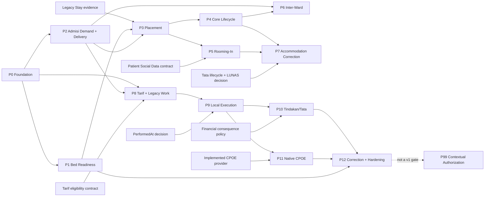

# RNA Implementation Plan

**Context:** RUANG RANAP Operational Management (RNA/Bangsal)

**Artifact role:** Planning — technical sequencing and implementation handoff

**Status:** Ready for phased implementation, subject to the explicit phase gates in this plan

**Business authority:** `docs/contexts/bangsal/RNA-DOMAIN.md` and the SOPs indexed by `docs/contexts/bangsal/rna-sop/RNA-SOP-INDEX.md`

**Technical authority:** `docs/contexts/bangsal/RNA-ARCHITECTURE.md` and the three approved integration artifacts under `docs/contexts/bangsal/`

This plan is based on the repository as inspected on 2026-07-17. It does not implement RNA production behavior.

## 1. Planning conclusion

Implementation can begin with **P0 — Executable foundation and compatibility baseline** and then **P1 — Bed Readiness**. Production accommodation placement, native CPOE intake, and financial delivery are not ready to cut over until their named external contracts and data evidence exist. Missing implementation is not treated as a business-design gap.

The recommended strategy is incremental vertical delivery in two branches after a small common foundation:

- the **Accommodation branch** proves Bed Readiness, durable Admisi demand delivery, standard placement, accommodation variants, inter-ward release, and correction in that order;
- the **Service Execution branch** proves Tarif eligibility and legacy work coexistence, then local execution truth, financial delivery, native CPOE collaboration, and correction/recovery;
- every production mutation is protected by a feature flag, stable request identity, explicit transaction, optimistic or lock-based concurrency, and append-only history;
- cross-context calls use sender outbox, receiver inbox, stable acknowledgements, and authoritative reconciliation queries. A direct in-process call is only a transport optimization behind those durable records.

This refines the preliminary increments in `docs/contexts/bangsal/RNA-ARCHITECTURE.md` for four codebase-specific reasons:

1. `ta_bed` has no readiness field or history, so Bed Readiness must be proven before placement can enforce Mandatory Bed Assignability.
2. No legacy Accommodation Stay model, table contract, stable key, or application boundary exists in this repository, so standard placement has an evidence gate before its persistence schema is finalized.
3. The current Admisi Ward gateway is a no-op and the Lab retry queue is not safe enough for RNA concurrency; the first real Admisi contract must establish the durable delivery pattern.
4. Native `CpoeContext` is absent and current `TdkCreateTindakanCmd` couples Tindakan, billing, and journal creation. Local execution truth, financial consequence, and CPOE cutover therefore need separate phases.

### 1.1 Major technical risks

| Risk | Consequence | Planning response |
|---|---|---|
| Legacy Stay authority is not represented in the repository | A guessed key or dual write could corrupt current accommodation truth | P0 records the evidence gap; P3 cannot start until the data owner confirms the exact stable key, field authority, row/update token, and writable application boundary |
| Bed master stores only active/reference data | Treating `fb_aktif` as Ready would allow unsafe assignment | RNA stores readiness history and its current projection in RNA-owned tables; no `ta_bed` change is required for v1 |
| Admisi `Accepted` currently drives Journey projections but is not placement proof | Responsibility and patient location could move on the wrong fact | Preserve current behavior until the gated migration; normalize/migrate `Accepted` only under the approved Admisi contract and derive `IN_WARD` only from RNA assignment |
| Concurrent assignment/transfer/readiness operations target the same bed and registration | Double placement or two active clinical locations | Per-bed operational row/epoch, registration guard, stable bed lock order, expected aggregate version, and real-SQL race tests |
| Existing retry precedent has no lease or atomic claim | Duplicate delivery or stuck `Processing` work | Implement an RNA-local claim/lease/outbox pattern with stale recovery; do not clone the Lab queue unchanged |
| Current JWT actor extraction can return the configured application subject for every user | Audit and clinical fact actor identity may be wrong | P0 adds a per-user `NameIdentifier` contract and regression tests before any RNA write route is enabled |
| `OrderTdk` lacks occurrence/revision/execution evidence | Legacy status could be mistaken for execution truth | Read through a labeled anti-corruption adapter; never convert `Executed` status into an RNA execution fact |
| Tindakan creation currently creates Tindakan, TrsBill, and Jurnal in one handler | RNA could accidentally take financial authority or duplicate charges | A Tindakan-owned idempotent consumer is required; RNA never invokes the legacy command as its integration adapter |
| CPOE is design-only in this repository | RNA could ship against an imaginary provider | Contract fixtures and fakes may be built early, but native intake/cutover waits for an implemented CPOE provider and joint acceptance tests |

### 1.2 V1 scope

V1 includes the approved UC-RNA use cases: Admisi-owned Waiting List review and rejection; successful Bed Assignment and responsibility transition; Clinical, Companion, Retained, and Mother-Baby accommodation; internal transfer; inter-ward Release-to-Waiting-List; ordinary release; Bed Readiness; append-only accommodation correction; ordered/legacy/ad hoc/independent RNA work and execution facts; billable/non-billable classification; append-only execution correction; CPOE and Tindakan/Tata Rekening delivery; operational projections; and visible recovery.

V1 explicitly excludes Temporary Absence, BOR/LOS/census calculation, room/accommodation charging, copied Service definitions, CPOE Generic Fulfilment for RNA-routed work, NERS/EMR documentation ownership, distributed transactions, a generic event bus, event sourcing, bulk legacy backfill, and automatic reversal of committed history.

Fine-grained contextual authorization is **P99**. V1 requires JWT authentication, coarse application access, a stable authenticated actor identifier, and explicit audit; P99 Ward scope, professional privilege, assignment, correction authority, service-principal scope, and contextual denial tests do not block v1.

## 2. Codebase assessment

### 2.1 Current implementation evidence

| Area | Current evidence | Implication for RNA |
|---|---|---|
| Layering | `src/bilreg/Bilreg.Domain/Bilreg.Domain.csproj`, `src/bilreg/Bilreg.Application/Bilreg.Application.csproj`, `src/bilreg/Bilreg.Infrastructure/Bilreg.Infrastructure.csproj`, `src/bilreg/Bilreg.Api/Bilreg.Api.csproj` | Add `RnaContext` to the existing Domain/Application/Infrastructure/API projects; do not introduce another runtime or reverse a project reference |
| RNA | Empty `src/bilreg/Bilreg.Domain/AkomodasiContext/HousekeepingFeature` and `src/bilreg/Bilreg.Domain/AkomodasiContext/PakaiBedFeature`; no RNA Application, Infrastructure, SQL, API, or tests | These folders are not behavior. New code uses `RnaContext`; do not extend the empty scaffolding as if it were a legacy aggregate |
| Admisi Waiting List | `src/bilreg/Bilreg.Domain/AdmisiRanapContext/WaitingListFeature/WaitingListStatusEnum.cs`; `src/bilreg/Bilreg.Domain/AdmisiRanapContext/WaitingListFeature/WaitingListModel.cs`; `src/bilreg/Bilreg.Application/AdmisiRanapContext/WaitingListFeature/UseCases/AdmCreateWaitingListCmd.cs`; `src/bilreg/Bilreg.Application/AdmisiRanapContext/WaitingListFeature/UseCases/AdmCloseWaitingListCmd.cs`; `src/bilreg/Bilreg.SqlDb/AdmisiRanapContext/WaitingListFeature/BILRG_BedWaitingList.sql` | Current `Accepted` and actor-driven `Close` conflict with the approved no-acceptance placement flow. The table lacks source revision, placement correlation, rejection history, optimistic version, and a uniqueness guarantee for active demand |
| Admisi integration | `src/bilreg/Bilreg.Application/AdmisiRanapContext/Integration/IWardAccommodationGateway.cs`; `src/bilreg/Bilreg.Infrastructure/AdmisiRanapContext/Integration/WardAccommodationGateway.cs` | `NotifyHandOver` is deliberately a no-op. It must be replaced by durable sender/receiver behavior, not a best-effort direct notification |
| Admisi Journey | `src/bilreg/Bilreg.Application/AdmisiRanapContext/JourneyFeature/Release1JourneyStageResolver.cs`; `src/bilreg/Bilreg.Infrastructure/AdmisiRanapContext/JourneyFeature/JourneyDal.cs` | Existing Release 1 correctly refuses to infer placement. P3 may add optional RNA placement facts; `Accepted` or `Closed` alone must never produce `IN_WARD` |
| Registration | `src/bilreg/Bilreg.Domain/AdmisiContext/RegFeature/RegInapModel.cs`; `src/bilreg/Bilreg.SqlDb/AdmisiContext/RegFeature/ta_reg_inap.sql`; `docs/contexts/admisi-ranap/ta-reg-inap-persistence-contract.md` | `ta_reg_inap` has registration/doctor/procedure data and a blank booking-bed reference, not an Accommodation Stay model. RNA accesses registration and discharge facts through an Application read port |
| Ward/Bed master | `src/bilreg/Bilreg.Domain/BedUsageContext/WardFeature/BedModel.cs` declares `BedType`; `src/bilreg/Bilreg.SqlDb/BedUsageContext/WardFeature/ta_bed.sql` | Bed master has Bed/Kamar/Bangsal/active only. `fb_aktif` is not readiness, occupancy, or a concurrency token |
| Bangsal to Layanan | `src/bilreg/Bilreg.Domain/BedUsageContext/WardFeature/BangsalModel.cs`; `src/bilreg/Bilreg.SqlDb/BedUsageContext/WardFeature/ta_bangsal.sql` | Reuse the authoritative `BangsalType.Layanan` mapping; RNA must not maintain another Bangsal-to-Layanan table |
| Legacy Accommodation Stay | No implementation or schema match for `LegacyStayId` outside `docs/contexts/bangsal/`; repository-wide accommodation searches find no stable Stay aggregate | This is an external data/application-boundary dependency, not an open business decision. Never guess that `ta_reg_inap.fs_kd_trs_booking_bed` is the Stay key |
| CPOE | `docs/contexts/cpoe/CPOE-ARCHITECTURE.md` states that `CpoeContext` is not implemented; no `src/bilreg/*/CpoeContext` exists | RNA may define and contract-test its side, but P11 native intake cannot cut over until CPOE exists |
| Legacy orders | `src/bilreg/Bilreg.Domain/ChargeContext/TindakanFeature/OrderTdkModel.cs`; `src/bilreg/Bilreg.SqlDb/ChargeContext/BILRG_OrderTdk.sql`; empty `TdkCreateTindakanByOrderCmd.cs` | `OrderTdk` has Ordered/Executed/Cancelled only, no occurrence, revision, actual performer, performed time, or RNA fact identity. It remains a labeled read-only source after cutover |
| Tarif/Service | `src/bilreg/Bilreg.Domain/ChargeContext/TarifFeature/TarifType.cs`; `src/bilreg/Bilreg.Infrastructure/ChargeContext/TarifFeature/TarifDal.cs`; `src/bilreg/Bilreg.Infrastructure/ChargeContext/TarifFeature/NilaiTarifDal.cs`; `src/bilreg/Bilreg.Application/ChargeContext/TarifFeature/UseCases/TrfSearchTarifBrgQuery.cs` | Stable RNA `ServiceId` maps to `TarifId`, not `NilaiTarifId`. `ta_tarif4` already links Tarif to Layanan, but no current Application contract returns active Services allowed for a Layanan; the search query ignores Layanan for Tarif rows |
| Tindakan | `src/bilreg/Bilreg.Domain/ChargeContext/TindakanFeature/TindakanModel.cs`; `src/bilreg/Bilreg.Application/ChargeContext/TindakanFeature/UseCases/TdkCreateTindakanCmd.cs`; `src/bilreg/Bilreg.Infrastructure/ChargeContext/TindakanFeature/TindakanDal.cs`; `src/bilreg/Bilreg.SqlDb/ChargeContext/BILRG_Tindakan.sql` | Current Tindakan has no `ServiceExecutionFactId`, occurrence, revision, or performer, and DAL still exposes physical delete. RNA integration needs a new Tindakan-owned idempotent consumer and append/void semantics |
| Tata Rekening | `src/bilreg/Bilreg.Domain/PaymentContext/TataRekeningFeature/TataRekeningModel.cs`; `src/bilreg/Bilreg.Domain/PaymentContext/TataRekeningFeature/TataRekeningStatusEnum.cs`; `src/bilreg/Bilreg.Application/PaymentContext/TataRekeningFeature/UseCases/OpenTataRekeningQuery.cs`; `src/bilreg/Bilreg.SqlDb/PaymentContext/TataRekeningFeature/BILRG_TataRekening.sql`; `src/bilreg/Bilreg.Api/Controllers/PaymentContext/TataRekeningFeature/TataRekeningController.cs` | OPEN/CLOSED/FINALIZED/LUNAS and `Version` exist. The current public summary omits Version, the controller's class-level `[Authorize]` is commented out, and its Open read is anonymous, so this is not an authenticated service contract. Add a narrow Application lifecycle query port |
| Billing coupling | `src/bilreg/Bilreg.Application/PaymentContext/TrsBillingFeature/AddBillAppService.cs`; `src/bilreg/Bilreg.Application/ChargeContext/TindakanFeature/UseCases/TdkCreateTindakanCmd.cs` | Existing creation resolves Tata Rekening and writes Tindakan, TrsBill, and Jurnal together. Reuse domain factories only after the Tata owner defines the RNA fact policy; do not call the actor command from an inbox consumer |
| Patient Social Data | `src/bilreg/Bilreg.Domain/PasienContext/PasienFeature/PasienModel.cs` and its DTOs expose mother name/family contact, not Baby MR → Mother MR identity | Name matching is prohibited. P5 waits for a stable relationship query from the Patient Social Data owner |
| Authentication | `src/bilreg/Bilreg.Api/Controllers/UserController.cs`; `src/bilreg/Bilreg.Api/Authorization/HttpCurrentUserContext.cs` | JWT `sub` is currently an application subject while `HttpCurrentUserContext` prefers `sub`. P0 must issue/use per-user `NameIdentifier` (`PegId`) before material RNA audit |
| Audit | `docs/shared/audit-log.md`; `src/bilreg/Bilreg.Domain/Shared/AuditLogFeature/AuditLog.cs`; `src/bilreg/Bilreg.SqlDb/Shared/AuditLogFeature/BILRG_AuditLog.sql` | Reuse explicit append-only `AuditLog`; commit it in the same local transaction as aggregate history and mandatory outbox work |
| Transactions | `src/bilreg/Bilreg.Application/Shared/IUnitOfWork.cs`; `src/bilreg/Bilreg.Infrastructure/Shared/TransHelperUnitOfWork.cs` | New RNA Application handlers depend on `IUnitOfWork`; do not add direct `Nuna.Lib.TransactionHelper` dependencies to new handlers |
| Idempotency precedent | `src/bilreg/Bilreg.Application/AdmisiRanapContext/AdmissionFeature/CoordinatedCancellationPersistence.cs`; `src/bilreg/Bilreg.Application/AdmisiRanapContext/AdmissionFeature/UseCases/AdmCoordinatedCancelCmd.cs`; `src/bilreg/Bilreg.Infrastructure/AdmisiRanapContext/AdmissionFeature/CoordinatedCancellationRepo.cs`; `src/bilreg/Bilreg.SqlDb/AdmisiRanapContext/AdmissionFeature/BILRG_AdmCoordinatedCancellationRequest.sql` | Reuse request fingerprint, prior-response replay, `UPDLOCK/HOLDLOCK`, and request-ID reuse conflict semantics |
| Retry precedent | `src/bilreg/Bilreg.Domain/LabContext/LabOwareFeature/LabOwareOutboundQueueModel.cs`; corresponding processor, DAL, SQL, and tests | Reuse operational visibility and manual retry ideas only. It lacks atomic claim, lease, stale recovery, version checks, and UTC time, so it is not an RNA delivery implementation |
| Reconciliation precedent | `src/bilreg/Bilreg.Application/AdmisiRanapContext/JourneyFeature/JourneyIntegrityValidator.cs` and projection tests | Reuse explicit issue codes and purpose-built reconciliation views; do not mutate source truth to make a projection look consistent |

### 2.2 Safe reuse and rejected reuse

Safe reuse:

- MediatR command/query organization, repositories that reconstruct aggregates, explicit DAL SQL, `IUnitOfWork`, `AuditLog`, JSend responses, JWT `[Authorize]`, Scrutor registration for standard repository interfaces, and purpose-built projection DALs.
- `BedType`/`KamarType`/`BangsalType` as master references; `BangsalType.Layanan` for the Layanan mapping.
- Admisi cancellation's request ledger semantics as a tested model for actor replay.
- Tata Rekening lifecycle and Version as the authority queried by RNA.
- `TarifId` plus minimum name snapshot as the Service reference after a new Tarif-owned eligibility query validates `ta_tarif.fb_aktif` and `ta_tarif4`.

Do not reuse as-is:

- the no-op `WardAccommodationGateway`, Lab Oware queue claim behavior, direct `TransHelper.NewScope()` in new handlers, body-supplied `UserId`, `OrderTdk.StatusOrder` as execution evidence, `TrfSearchTarifBrgQuery` as eligibility validation, Tindakan physical delete, or `TdkCreateTindakanCmd` as an integration consumer.

### 2.3 Approved-artifact inconsistencies

These inconsistencies must be visible to implementers. Later explicit closed decisions are followed where they unambiguously supersede stale prose; genuine semantic conflicts remain gates.

| Inconsistency | Classification and plan |
|---|---|
| `docs/contexts/bangsal/CPOE-RNA-INTEGRATION.md` says RNA has no accept/reject decision and `CPOE-RNA-OD-002` is CLOSED, but its state table still names `SubmitDestinationAcceptance` and `SubmitDestinationRejection` | Editorial contradiction resolved by the closed decision. P11 implements no RNA acceptance/rejection endpoints and requires the CPOE contract owner to remove the stale rows before joint acceptance |
| The same CPOE contract says `PerformedAt` is save time, while `docs/contexts/bangsal/RNA-DOMAIN.md` BR-RNA-038/045/046 and SOP-RNA-S01/S02 require actual Performed At, distinct Recorded At, and late entry | **Genuine unresolved v1 business/contract decision.** P9 write/API activation waits for CPOE + RNA Clinical Governance to choose and correct the artifacts. Persistence must keep the two instants distinct either way |
| `docs/contexts/bangsal/ADMISI-RNA-INTEGRATION.md` calls responsibility reversal after Entered in Error unresolved, while `ADM-RNA-OD-005/006` are CLOSED | Editorial contradiction resolved by the closed decisions: preserve facts, mark `ReconciliationRequired`, and never automatically reopen/cancel Waiting List state |
| `docs/contexts/bangsal/RNA-TATA-REKENING-INTEGRATION.md` states that the LUNAS accommodation-correction gate is open, while its conclusion says all v1 decisions are closed | **Genuine unresolved v1 decision.** Until resolved, LUNAS returns an explicit safe block/dependency outcome and is not represented as a newly invented business rule |
| The same Tata integration states the OPEN eligible-to-charge workflow is unresolved, but later decisions prescribe one linked Tindakan and describe no design block | **Genuine unresolved v1 financial decision.** Tindakan linkage is settled; whether/how an RNA billable fact creates or defers TrsBill/Jurnal in OPEN and CLOSED is not. P10 production delivery waits for the Tata Rekening/Charge Source owner |
| SOP-RNA-A01 places physical receipt wording after bed choice, while the fixed ownership rule and UC-RNA-004 move responsibility on successful Bed Assignment | Resolved by the fixed decision. Assignment commits the allocation and responsibility; any later receipt observation is not a second ownership transition and must not delay allocation creation |

## 3. Target technical direction

### 3.1 Module and feature boundaries

Create `RnaContext` in each existing layer:

```text
Bilreg.Domain/RnaContext
  AccommodationFeature
  BedOperationalFeature
  ServiceExecutionFeature
  IntegrationFeature

Bilreg.Application/RnaContext
  <same feature families>/UseCases
  Projections
  Integration

Bilreg.Infrastructure/RnaContext
  <feature repositories, DTOs, DALs, adapters>

Bilreg.Api/Controllers/RnaContext
Bilreg.SqlDb/RnaContext
Bilreg.Test/RnaContext
```

The existing empty `AkomodasiContext` folders remain untouched until a separate cleanup proves they are unused. They are not an alias for `RnaContext`.

Domain owns behavior and invariant decisions. Application loads authorities, performs coarse v1 access checks, orchestrates transactions, persists audit/outbox, and maps deterministic outcomes. Infrastructure reconstructs aggregates and owns SQL/adapters. API owns HTTP validation, authenticated actor extraction, feature filters, and JSend mapping only.

### 3.2 Aggregate and repository boundaries

| Aggregate | Boundary | Repository decision |
|---|---|---|
| `AccommodationAllocationModel` | One declared allocation and its purpose, occupant role, clinical designation, start/end, continuity, legacy reference, and append-only fact/correction history | One `IAccommodationAllocationRepo`; registration-wide and multi-bed policies are coordinated by an Application transaction, not a giant registration aggregate |
| `BedOperationalModel` | One bed's readiness history, current readiness projection, blocker state, and concurrency epoch | Name is deliberately distinct from existing `BedUsageContext.WardFeature.BedType`; one `IBedOperationalRepo` |
| `RnaServiceExecutionModel` | One source obligation/ad hoc authority record and its assignment, execution fact(s), source revisions, and append-only correction links | One `IRnaServiceExecutionRepo`; external order, Tarif, documentation, and financial aggregates remain references |

Repositories do not expose child CRUD. Commands call aggregate behavior; corrections append a new fact. Cross-allocation uniqueness, bed capacity, and source ordering are Application policies executed under explicit locks.

### 3.3 Persistence

- New SQL belongs under `src/bilreg/Bilreg.SqlDb/RnaContext` and is included in `src/bilreg/Bilreg.SqlDb/Bilreg.SqlDb.sqlproj` in dependency order.
- Use application-generated opaque `VARCHAR(12)` IDs by default, integer enums, PascalCase columns, standard `Crt/Upd/Vod` columns, explicit `Version`, no database foreign keys, and no physical deletion of business history.
- External IDs need contract-sized columns (normally up to 50 characters); do not truncate 26-character legacy ULIDs into a local 12-character field.
- Required UTC business and recorded instants use explicit columns. `RecordedAt` is server-generated; `OccurredAt` is authoritative. SQL audit columns remain compatible with `docs/DATABASE.md`.
- Root/header rows carry current projection and Version. Detail/fact/correction rows are append-only. Updating a header never erases the fact that produced its current state.
- Purpose-built read DALs may join RNA tables to master/reference tables. They do not decide assignability or business authority.

Initial bed readiness is not fabricated: a master bed with no readiness fact is returned as `READINESS_NOT_VERIFIED` in the availability projection and is not assignable. A pilot verifier must create the first explicit Ready fact.

The exact Accommodation extension key/schema is a P3 gate. No script may create a guessed `LegacyStayId`. Once the data owner confirms the real key, the extension must use it as a unique logical anchor and retain a separate RNA opaque identity only where stable fact/correction references require one.

### 3.4 API, authentication, and actor identity

- Routes use versionable resource families under `/api/rna/...`; commands are action-oriented and queries are bounded/paginated.
- Every RNA endpoint is `[Authorize]`; none is anonymous. Actor-facing commands obtain the actor from `ICurrentUserContext`, not request JSON.
- P0 changes token issuance so `ClaimTypes.NameIdentifier` contains the stable per-user `PegId`; a regression test proves two users resolve to two actor IDs. The configured application subject may remain for token/application identity, but it is not the human actor.
- V1 uses authenticated, coarse application access and feature flags. Controllers and audit must not claim that Ward role/scope, professional privilege, or recovery-role enforcement exists. Those policies are P99.
- Mutable actor commands include `RequestId` and `ExpectedVersion` where state can race. Reusing a RequestId with the same normalized fingerprint returns the stored outcome; a different fingerprint returns conflict.
- The standard response includes a stable machine error code and correlation/request identity. Use 422 for malformed input, 404 for missing authority, 409 for stale version/request reuse/business concurrency, 400 for an evaluated business block, 401/403 for authentication/coarse access, and 503 for an unavailable mandatory authority. Exact payload shape is frozen by phase-local API contract tests.

### 3.5 Integration, idempotency, and recovery

Do not build a shared generic event platform. Build feature-local sender/receiver components behind explicit contracts. The minimum SQL-backed pattern is:

- inbox uniqueness by source system + contract + source fact + revision, with payload fingerprint and stored prior outcome;
- immutable outbox payload per source fact revision + destination, with status, attempt number, next attempt, lease owner/expiry, last error, acknowledgement, and Version;
- request ledger by caller/operation/request ID with fingerprint and serialized deterministic response;
- source mapping for legacy/native identities without relabeling their origin;
- reconciliation issue records/projection with stable issue codes and evidence references.

Worker sequence:

1. Atomically claim bounded work using SQL locking such as `UPDLOCK`, `READPAST`, and a lease.
2. Commit the claim, then call the destination outside the transaction.
3. Persist the attempt and acknowledgement in a new short transaction.
4. Reclaim expired leases safely; back off retries; move permanent/stale/conflicting work to visible reconciliation rather than retrying forever.
5. Retry the committed obligation only. Never rerun bed assignment, release, execution, or correction behavior.

Other bounded contexts own their corresponding inbox/outbox tables. RNA never writes Admisi, CPOE, Tindakan, Tata Rekening, Tarif, or Patient Social Data tables directly.

### 3.6 Transactions and concurrency

- New handlers use `IUnitOfWork`. Aggregate state, append-only history, shared AuditLog, request outcome, and mandatory outbox rows commit together.
- No remote call occurs inside a local transaction.
- Every aggregate mutation compares `ExpectedVersion`. Repository update SQL uses `WHERE Id=@Id AND Version=@ExpectedVersion` and requires one affected row.
- Placement locks the registration guard and target bed operational row, validates current master/registration/readiness/allocation facts, writes the allocation/facts, bumps bed epoch, and writes audit/outbox atomically.
- Internal transfer locks source and target bed IDs in ordinal stable order plus the registration guard. Failure leaves the source allocation unchanged.
- SQL uniqueness protects one active Clinical Accommodation designation per registration and unique inbox/outbox/request identities. Occupancy policy still runs under bed lock; it is not reduced to a misleading single `IsOccupied` flag.
- Facts are ordered by `OccurredAt` plus the source's explicit revision. Arrival time and `RecordedAt` never replace owner revision or business chronology.

### 3.7 Legacy coexistence and cutover

Accommodation uses legacy-core plus RNA-extension only after P0/P3 evidence confirms the real Stay. Legacy-owned fields are changed through its application boundary. RNA-owned history is never overwritten by a legacy refresh. If the legacy boundary cannot enlist in the same local SQL transaction, production mutation stays disabled until the team defines and tests a durable intent/reconciliation approach; partial dual writes are not acceptable by convention.

Existing legacy rows are composed on read without inventing missing history. The first RNA mutation may create an extension from a current authoritative snapshot, but may not backdate a purpose, assignment, or readiness fact.

For service orders, facility/unit `CutoverAt` is forward-only:

- before cutover, approved legacy `OrderTdk` may create labeled RNA work through the adapter;
- after cutover, native CPOE creates new work and historical `OrderTdk` is read-only;
- no dual creation is allowed;
- rollback disables new native intake but preserves CPOE orders, RNA facts, source mappings, and Tindakan links already committed.

### 3.8 Testing philosophy

Domain rules are unit-tested without SQL/framework dependencies. Application tests prove orchestration, transaction membership, actor derivation, and no external call inside the transaction. Repository tests use real SQL for reconstruction, uniqueness, optimistic concurrency, lock order, claim/lease, and replay. Contract tests use fixed JSON/message fixtures at both producer and consumer. End-to-end tests follow SOP workflows and inject failures between every local commit and remote acknowledgement.

## 4. Phased implementation roadmap

### P0 — Executable foundation and compatibility baseline

| Item | Plan |
|---|---|
| Objective | Establish a buildable `RnaContext`, safe default-off rollout controls, stable actor/time/request conventions, and concrete compatibility evidence without exposing RNA behavior |
| Scope / rules | Cross-cutting foundation for all BR/UC groups; no business use case is declared implemented |
| Main decisions | `RnaContext` naming; `TimeProvider`/UTC time passed into Domain; per-user `NameIdentifier=PegId`; body `UserId` prohibited; feature flags default false; no generic bus; no guessed legacy key |
| Code areas | New anchors/options/shared types under `src/bilreg/Bilreg.Domain/RnaContext`, `Bilreg.Application/RnaContext`, `Bilreg.Infrastructure/RnaContext`, and tests under `Bilreg.Test/RnaContext`; narrow auth changes in `Bilreg.Api/Controllers/UserController.cs` and `Bilreg.Api/Authorization/HttpCurrentUserContext.cs`; DI/options in `Bilreg.Api/Configurations` |
| Dependencies | Approved RNA artifacts; current shared auth/audit/transaction code; data-owner participation is requested but absence does not prevent scaffold completion |
| Persistence / migration | None. Do not create RNA SQL in P0 |
| Integration impact | Define transport-independent envelope/result test fixtures only; no endpoint, worker, direct call, or delivery table |
| Tests / verification | Layer dependency/build tests; UTC/OccurredAt-vs-RecordedAt value tests; request fingerprint semantics; actor identity regression with two users; option defaults prove every RNA mutation/intake/delivery flag is off |
| Exit criteria | Solution builds/tests; no RNA route or SQL write exists; actor ID is demonstrably per-user; a compatibility evidence note records the absent legacy Stay contract, current Bed/Waiting List/OrderTdk/Tindakan facts, and owners required for later gates |
| Deferred | Aggregates, tables, controllers, workers, legacy adapter, all business behavior, and P99 authorization |

### P1 — Bed Readiness vertical slice

| Item | Plan |
|---|---|
| Objective | Deliver RNA-owned append-only Bed Readiness and advisory availability before any RNA placement is enabled |
| Scope / rules | UC-RNA-016–018 actor path; BR-RNA-012, 015, 023–025b; SOP-RNA-A07. Housekeeping/Maintenance service ingestion is completed in P12 |
| Main decisions | `BedOperationalModel`; no readiness fact means not verified/not assignable; Ready requires an explicit verified fact; current projection is stored in RNA, not `ta_bed`; active master is necessary but not Ready |
| Code areas | `RnaContext/BedOperationalFeature` in all layers; Bed master read adapter over existing WardFeature; `/api/rna/beds/...` controller/filter; projection DAL and DI |
| Dependencies | P0; existing Bed/Kamar/Bangsal repositories; pilot verifier operating procedure |
| Persistence / migration | Add RNA bed operational header, append-only readiness fact, request-ledger rows needed by these commands, indexes by Bed/Ward/status/time, Version/epoch, and SQL project entries; no `ta_bed` alter |
| Integration impact | Direct read port to Bed master only. External recovery evidence is an optional reference on actor commands until P12 authenticated source intake |
| Tests / verification | Domain transition/required evidence tests; first-Ready and duplicate-request tests; real-SQL reconstruction; two concurrent Mark Ready/Block operations; master inactive/missing; availability projection reasons; API auth/error contract |
| Exit criteria | History reconstructs deterministically; Ready always has a fact; missing history never appears Ready; stale Version conflicts; all write endpoints remain pilot-flagged |
| Deferred | Occupancy-aware checks are re-run with real allocations in P3; placement, accommodation release, external recovery intake, P99 verifier role enforcement |

### P2 — Admisi demand collaboration and durable delivery kernel

| Item | Plan |
|---|---|
| Objective | Replace the no-op handover seam with durable Waiting List demand/rejection collaboration and prove inbox/outbox recovery before placement |
| Scope / rules | UC-RNA-001–003; BR-RNA-016a rejection/ownership portion; SOP-RNA-A01 review/rejection; `docs/contexts/bangsal/ADMISI-RNA-INTEGRATION.md` |
| Main decisions | Admisi remains Waiting List authority; receipt/view/rejection does not transfer responsibility; rejection is free-text accountable fact; first real contract establishes the RNA-local and Admisi-local claim/lease pattern |
| Code areas | Admisi WaitingList model/use cases/DAL/SQL and integration folder; RNA IntegrationFeature, WaitingListReview projection/use cases/API; `InfrastructureService.cs` explicit worker/projection registrations |
| Dependencies | P0; Admisi owner agrees message fixtures and coarse authenticated in-process/HTTP host; worker host/config |
| Persistence / migration | Add Waiting List Version/revision and Admisi sender outbox; RNA inbox/review/rejection/outbox/request/reconciliation stores; Admisi result inbox/history. Keep existing status values during shadow mode; create an Accepted migration dry-run report only |
| Integration impact | Demand push + authoritative `GetWaitingListById`; rejection push + acknowledgement/outcome query. In-process adapter still writes both durable sides and never shares repositories |
| Tests / verification | Contract fixtures; duplicate/stale/different-payload replay; rejection leaves demand active; outbox claim/lease/stale reclaim; receiver committed but ack lost; source unavailable; recovery query; no allocation row; no responsibility change |
| Exit criteria | New/updated Admisi demand appears once in RNA; rejection is durable and idempotent; failed work is visible/recoverable; the legacy gateway is no longer the enabled production path; no placement behavior exists |
| Deferred | Accepted data migration, Waiting List close-on-assignment, allocation, Journey placement, inter-ward release, P99 source/Ward scope |

### P3 — Standard and Companion placement plus accommodation read authority

| Item | Plan |
|---|---|
| Objective | Make successful Bed Assignment the first authoritative RNA allocation and responsibility transition while preserving legacy Stay coexistence |
| Scope / rules | UC-RNA-004–005; BR-RNA-001–004, 006, 008, 012–016b; SOP-RNA-A01; Companion assignment portion of the approved design |
| Main decisions | Assignment, allocation fact, bed epoch, request result, audit, and Admisi outbox commit atomically; no intermediate acceptance/receipt state; Companion uses the same assignability path but no Waiting List close and no clinical-location change |
| Code areas | `RnaContext/AccommodationFeature` all layers; legacy Stay adapter; registration/Bed master ports; Admisi assignment consumer; Journey optional placement adapter; accommodation/history and bed availability projections/API |
| Dependencies | P1 and P2; **hard gate:** data owner supplies exact legacy Stay key, schema, field ownership, update token, and application boundary, with transaction behavior proven; Admisi migration/runbook approved |
| Persistence / migration | Add allocation header/extension and append-only fact/history tables using the confirmed legacy anchor; registration clinical guard; bed occupancy epoch integration; filtered/unique guards appropriate to confirmed schema; assignment source mapping. Dry-run and then migrate legacy `Accepted` to approved review state, quarantining contradictions rather than inferring placement |
| Integration impact | `AccommodationAssigned` outbox; Admisi idempotently closes the matching authoritative Waiting List revision and returns acknowledgement. RNA remains authoritative even while delivery is pending |
| Tests / verification | Mandatory assignability matrix and optional-policy non-enforcement; parallel same-bed and same-registration assignment; stale Waiting List revision; allocation committed/ack lost; Companion capacity and reporting flag; legacy boundary rollback/row-token mismatch; Journey never infers placement from Accepted/Closed |
| Exit criteria | One successful request creates one allocation and one assignment fact; at most one active Clinical designation per registration; no conflicting primary occupant; Waiting List closure is idempotent consequence; existing legacy production behavior remains enabled outside pilot scope |
| Deferred | Retained, Rooming-In, transfers, release, correction, bulk migration (never planned), P99 contextual placement authority |

### P4 — Core accommodation lifecycle, Retained, internal transfer, and release

| Item | Plan |
|---|---|
| Objective | Complete non-Rooming-In local accommodation lifecycle with historical continuity and atomic post-use readiness |
| Scope / rules | UC-RNA-006–007, 010, 014 and expanded UC-RNA-005; BR-RNA-002–007b, 012–017, 020–025; SOP-RNA-A02, A04, A06 |
| Main decisions | Retained remains Active/capacity-consuming until explicit/discharge closure; release never means discharge or Ready; release appends Cleaning Required (or approved post-use non-Ready condition); internal transfer locks beds in stable order and atomically decides source release/retention/reclassification |
| Code areas | Accommodation aggregate/policies/use cases, BedOperational integration, registration/discharge read port, projections, controllers, legacy adapter extensions |
| Dependencies | P3; Registration/Patient Administration supplies authoritative active/discharge facts; Operations confirms pilot release/recovery workflow |
| Persistence / migration | Extend allocation fact types and projection indexes; no destructive status rewrite. All source/target facts and bed projection changes share one transaction |
| Integration impact | Registration/discharge query or authoritative transition fact only; no inter-ward delivery yet |
| Tests / verification | Multiple simultaneous purposes; current clinical derivation; retained capacity; discharge blocked until retained released; transfer deadlock/race; target failure leaves source unchanged; release-not-discharge; release-not-Ready; legacy bypass version mismatch |
| Exit criteria | Every current state derives from preserved facts; internal transfer is all-or-nothing; released beds cannot be reassigned until explicit Ready; accommodation detail shows clinical vs retained/companion clearly |
| Deferred | Rooming-In, inter-ward release, correction, accommodation billing, P99 role enforcement |

### P5 — Mother-Baby Rooming-In

| Item | Plan |
|---|---|
| Objective | Add the approved one-Mother-primary plus one-Baby-associated occupancy without merging registrations or increasing capacity |
| Scope / rules | UC-RNA-008–009; BR-RNA-008–014; SOP-RNA-A03 |
| Main decisions | Relationship must be an authoritative Baby MR → Mother MR identity; store only stable evidence/reference and observation metadata; never match mother name, family contact, or UI selection alone |
| Code areas | Accommodation rooming-in behavior/use cases/projections/API; Patient Social Data Application port and adapter |
| Dependencies | P3; Patient Social Data owner provides a stable relationship query and test fixtures; both registrations resolvable |
| Persistence / migration | Append association/start/end facts and evidence reference to RNA allocation history; no patient table changes, no capacity increment, no BOR/billing columns |
| Integration impact | Synchronous authoritative relationship query; unavailable/mismatch blocks activation safely |
| Tests / verification | distinct registrations; correct/missing/mismatched relation; second associated Baby conflict; primary occupant race; end association with explicit Baby outcome; no capacity/BOR/financial side effect |
| Exit criteria | Separate patient and allocation histories remain visible; one bed has at most one Primary plus one verified Baby association; no copied Patient Social Data |
| Deferred | Any non-Mother-Baby sharing, room charge decision, P99 Nurse/Head Nurse role enforcement |

### P6 — Inter-ward Release-to-Waiting-List

| Item | Plan |
|---|---|
| Objective | Return responsibility to Admisi through source release and reuse ordinary destination placement |
| Scope / rules | UC-RNA-011–013; BR-RNA-005–007, 016–019b, 023–025b; SOP-RNA-A05; Admisi integration contract |
| Main decisions | No RNA-to-RNA transfer, destination acceptance, destination responsibility, or RNA transfer queue; optional destination Ward is carried only when already authoritative |
| Code areas | RNA release use case/outbox/recovery; Admisi release consumer and Waiting List create/reuse behavior; Journey timeline/projection extensions |
| Dependencies | P2, P3, P4; Admisi owner; EMR content remains out of scope |
| Persistence / migration | Add inter-ward release fact/outbox identity and Admisi inbox outcome. Admisi reuses an active matching Waiting List or creates one idempotently |
| Integration impact | `InterWardAccommodationReleased`, acknowledgement, result query, replay/reconciliation. Destination later uses P2/P3 ordinary flow |
| Tests / verification | atomic source release + Cleaning Required + outbox; duplicate delivery; active matching Waiting List reuse; pending delivery responsibility; optional/no destination; cancellation returns through Admisi; no destination state in RNA |
| Exit criteria | Source RNA owns no active Clinical Accommodation after commit; Admisi eventually has exactly one appropriate demand or visible reconciliation; no special destination workflow exists |
| Deferred | Clinical handoff content, direct RNA transfer, correction consequence (P7), P99 scope enforcement |

### P7 — Accommodation and Bed Readiness correction

| Item | Plan |
|---|---|
| Objective | Append Head-Nurse-governed correction facts without erasing original allocation/readiness history or silently reversing Admisi state |
| Scope / rules | UC-RNA-015; BR-RNA-049–049c; relevant assignment/transfer/release/retained/rooming-in/readiness facts; SOP-RNA-A06 correction path |
| Main decisions | Query Tata lifecycle immediately before commit; OPEN/CLOSED passes this gate, FINALIZED blocks, unknown/stale/unavailable blocks; LUNAS returns explicit unresolved-policy block until owner decision; correction recomputes only RNA projection and publishes new correction obligations |
| Code areas | correction behavior and use case, Tata lifecycle read port/adapter, correction projection/outbox, Admisi correction consumer/reconciliation |
| Dependencies | P1, P3–P6 as applicable; Tata Rekening service query exposes status, Version, observed time; LUNAS decision required for complete v1 acceptance |
| Persistence / migration | Append correction fact/replacement link; never update original fact. Store lifecycle observation and original fact Ward. Recompute current projections deterministically from valid history |
| Integration impact | Assignment/release correction produces new Admisi correction fact; closed OD-005/006 means `ReconciliationRequired`, no automatic Waiting List reopen/cancel. Accommodation facts are not sent to financial billing in v1 |
| Tests / verification | original immutable; same-Ward fact validation; FINALIZED/unknown/outage block; explicit LUNAS behavior test after decision; correction replay; wrong original; downstream partial failure; readiness projection after corrected latest fact |
| Exit criteria | Correction history is complete and replay-safe; no original/Waiting List is deleted or silently reversed; lifecycle query has no transition side effect |
| Deferred | Contextual Head Nurse/Ward membership enforcement to P99; post-FINALIZED administrative process outside RNA |

### P8 — Tarif eligibility and legacy service-work intake

| Item | Plan |
|---|---|
| Objective | Establish Service identity/eligibility and a truthful pending-work model without yet recording execution or enabling native CPOE cutover |
| Scope / rules | UC-RNA-019–023, 025 for approved legacy source; BR-RNA-026–044, 050–052, 060–063a; SOP-RNA-S01 work-coordination portion |
| Main decisions | `ServiceId = TarifId`; eligibility query uses authoritative Bangsal→Layanan plus active Tarif allowed by `ta_tarif4`; `NilaiTarifId` is never Service identity; `OrderTdk` remains explicitly legacy and its status is not execution evidence |
| Code areas | Tarif-owned Application eligibility contract/Infrastructure SQL; RNA ServiceExecution aggregate/work projections/inbox/source mapping; legacy OrderTdk adapter; work API |
| Dependencies | P0 and durable pattern proven in P2; Tarif owner approves the read contract; Registration/Bangsal references; legacy cutover configuration schema |
| Persistence / migration | Add Service work/execution header, source revision/history, inbox/source mapping, projection indexes, and cutover configuration. No execution fact or Tindakan link yet |
| Integration impact | Legacy adapter maps `OrderTdkId` without creating fake CPOE IDs; ambiguous/missing revisions are quarantined. Native CPOE fixtures may be compiled but not enabled |
| Tests / verification | active/inactive and allowed/disallowed Tarif; service unavailable vs no eligible service; Bangsal mapping; repeated legacy polling; cancellation before execution; assignment not execution; legacy Executed status creates no fact; source label preserved |
| Exit criteria | Work appears once with stable legacy identity; eligible Service query is authoritative and save-reusable; no financial or execution fact is created |
| Deferred | Execution write, financial delivery, native CPOE intake, exceptional authorization, P99 assignment/performer authority |

### P9 — Local RNA Service Execution facts

| Item | Plan |
|---|---|
| Objective | Record ordered, ad hoc, and independent RNA execution truth locally with append-only chronology, while outbound production delivery remains gated |
| Scope / rules | UC-RNA-024, 026 and local history part of 022; BR-RNA-029–038, 042–046, 050–058; SOP-RNA-S01/S02 execution portion |
| Main decisions | Billable requires eligible Service revalidated at save; non-billable requires description and creates no financial outbox; actual Performer comes from authenticated actor; `OccurredAt`/Performed At and `RecordedAt` are stored separately; no execution is inferred from work status |
| Code areas | Service execution behavior/use cases/history projections/API, Tarif revalidation port, audit/request ledger, destination-specific outbox creation behind disabled delivery flags |
| Dependencies | P8; **hard gate before write API activation:** resolve actual-time versus save-time contradiction; stable actor identity from P0 |
| Persistence / migration | Append immutable execution fact/authority evidence, minimum Service snapshot, request outcome, and per-destination immutable obligations. Unique request/fact identities; occurrence guards allow distinct real executions but prevent replay duplicates |
| Integration impact | No live delivery. Billable facts may create disabled/held outbox records only in non-production tests; non-billable creates no Tata obligation. CPOE exceptional obligation shape remains contract-tested |
| Tests / verification | billable/non-billable validation; save-time eligibility race; performer capture; actual vs recorded chronology and late reason according to resolved decision; duplicate/reused RequestId; occurrence replay vs distinct execution; withdrawal race; no Tindakan/TrsBill/Jurnal write |
| Exit criteria | RNA history is authoritative, append-only, reconstructable, and independent of downstream availability; all delivery/intake flags remain off in production |
| Deferred | Tata/Tindakan processing, native CPOE, execution correction, contextual authorization |

### P10 — Tindakan/Tata Rekening consumer and billable delivery

| Item | Plan |
|---|---|
| Objective | Deliver billable execution facts to an owning idempotent Tindakan/Tata boundary without giving RNA financial authority |
| Scope / rules | UC-RNA-031; BR-RNA-054–059, 063b–063c; SOP-RNA-S04; `docs/contexts/bangsal/RNA-TATA-REKENING-INTEGRATION.md` |
| Main decisions | Receiver owns inbox and Tindakan creation; unique `ServiceExecutionFactId`; non-billable never delivered; RNA only stores acknowledgement/TindakanId; existing actor command is not the consumer |
| Code areas | Tindakan model/DTO/DAL/SQL extension and new Application consumer; Tata lifecycle/policy service; RNA adapter/worker/outcome query/recovery projection |
| Dependencies | P9; **hard business gate:** Tata/Charge Source defines OPEN and CLOSED eligible-to-charge/TrsBill/Jurnal behavior; Tindakan/Tata owners approve table and acknowledgement contracts |
| Persistence / migration | Add nullable source correlation columns and filtered unique index to `BILRG_Tindakan`; add receiver inbox/outcome/correction-ready history in its owning context; deploy forward-only before enabling RNA delivery |
| Integration impact | At-least-once billable fact delivery; acknowledgements `Created`, `AlreadyExists`, `RejectedTechnical`, `ReconciliationRequired`; outcome query. FINALIZED/LUNAS preserve receipt and reconcile with no automatic reopen/reversal |
| Tests / verification | duplicate fact and same-ID/different-payload conflict; one Tindakan maximum; transaction rollback across receiver inbox/Tindakan/approved financial effects; OPEN/CLOSED/FINALIZED/LUNAS matrix; ack lost; RNA retry; no direct RNA table write; non-billable absence |
| Exit criteria | Joint contract tests pass; one billable fact has at most one linked Tindakan; financial effects follow an approved Tata-owned policy; delivery failures never alter RNA truth |
| Deferred | Correction handling to P12; accommodation charging; automatic post-finalization reversal; P99 service-principal scope |

### P11 — Native CPOE collaboration and asymmetric cutover

| Item | Plan |
|---|---|
| Objective | Enable native ordered work, changes, execution association, and exceptional authorization while preserving legacy history and forward-only cutover |
| Scope / rules | Native portions of UC-RNA-019–020, 025, 027, 030; BR-RNA-026–046, 060–063c; SOP-RNA-S01/S02; `docs/contexts/bangsal/CPOE-RNA-INTEGRATION.md` |
| Main decisions | Valid dispatch automatically creates work; no RNA acceptance/rejection; clarification only; CPOE supplies order/occurrence/obligation/revision but not ServiceId; amendments/terminations use revision + EffectiveAt; execution remains RNA truth |
| Code areas | CPOE provider contracts/inbox/outbox/outcome queries, RNA CPOE adapter/work change handlers/delivery worker/source mapping, CutoverAt resolver/runbook, projections |
| Dependencies | P8/P9; implemented `CpoeContext` provider and joint team; stale acceptance/rejection table corrected; PerformedAt contract resolved; facility/unit CutoverAt and rollback ownership approved |
| Persistence / migration | CPOE-owned durable stores plus RNA source mappings/revisions; no conversion of historical OrderTdk into native IDs; CutoverAt/config audit |
| Integration impact | Dispatch/change inbound, clarification request, execution/exception outbound, subsequent-authorization status inbound, authoritative state queries, durable acknowledgements |
| Tests / verification | dispatch replay; missing/out-of-order revision; cancellation before/after PerformedAt; execution-after-termination reconciliation; clarification not amendment; one occurrence/multiple distinct executions; no accept/reject API; cutover boundary, no dual create, rollback preserves facts |
| Exit criteria | Native orders after CutoverAt come only from CPOE; legacy orders remain readable/labeled; every uncertain delivery is queryable/recoverable; joint contract/E2E tests pass |
| Deferred | Execution correction and consolidated recovery hardening to P12; P99 contextual/service-principal enforcement |

### P12 — Execution correction, complete recovery, and v1 hardening

| Item | Plan |
|---|---|
| Objective | Complete append-only execution correction and operationally safe recovery across every enabled collaborator, then close v1 release gates |
| Scope / rules | UC-RNA-028, 032–033 and remaining external-source part of 016; BR-RNA-045–049, 052–053, 059, 062–063c; SOP-RNA-S03 and exception/recovery paths across all SOPs |
| Main decisions | Correction is a new version/fact; per-destination delivery is independent; Entered in Error never deletes; support recovery replays delivery, not behavior; Housekeeping/Maintenance ingestion uses the proven inbox pattern |
| Code areas | execution correction behavior/API/outboxes; CPOE/Tata correction consumers; integration recovery query/command/API; worker scheduling, metrics, health, runbooks; authenticated recovery evidence adapter |
| Dependencies | P1–P11 for enabled features; correction authority evidence from approved GAP-RNA-011; Operations owns worker and alerting configuration |
| Persistence / migration | Append correction/replacement/review facts, destination delivery attempts, reconciliation issue history, worker lease indexes, retention/archival policy for technical payloads without deleting business facts |
| Integration impact | Correction to CPOE and Tata in chain order; missing original quarantine/retrieval; manual retry/reconcile; Housekeeping/Maintenance facts; authoritative outcome queries across collaborators |
| Tests / verification | wrong patient/service, duplicate, replacement, Entered in Error, second-review evidence; correction-before-original; partial destination success; stale leases; poison/permanent rejection; recovery authorization baseline; end-to-end outage at every boundary; metrics/health/backlog age |
| Exit criteria | All v1 traceability rows and release gates pass; no silent backlog; rollback disables new intake/delivery without deleting committed history; operations runbook and ownership are accepted |
| Deferred | P99 contextual authorization, future contract versions, broker/Taksaka hosting changes, accommodation charging, BOR/reporting calculations |

### P99 — Contextual authorization (non-blocking for v1)

P99 maps the approved capabilities to stable identity, Ward/facility membership, professional privilege, current care relationship, assignment, correction/review authority, recovery role, and service-principal scope. It adds denial and row-scoping tests without changing aggregate semantics. It is planned after route/contract stabilization and is explicitly excluded from v1 release gating.

## 5. Dependency and sequencing map



P1 and P2 may proceed in parallel after P0. P5 may wait for Patient Social Data while P6 and the Service branch continue. P8/P9 do not require native CPOE because legacy and contract fakes prove the local work/execution model. P10 and P11 may proceed in parallel after P9. P12 requires whichever integrations are enabled in the release candidate.

### 5.1 External coordination gates

| Dependency | Provider/owner | Required before |
|---|---|---|
| Exact legacy Stay table/key, legacy-owned fields, update token, active-row semantics, write application boundary, and ambient transaction behavior | Legacy inpatient data/application owner | P3 schema and any placement write |
| Waiting List revision, durable sender/consumer, Accepted migration and Journey extension | Admisi Ranap owner | P2/P3 rollout |
| Stable per-user PegId claim | Authentication/Usman owner; narrow code is local | Any RNA actor write (P1 pilot onward) |
| Authoritative discharge/active-registration read or transition fact | Registration/Patient Administration owner | Retained discharge closure in P4 |
| Baby MR → Mother MR query | Patient Social Data owner | P5 |
| Active Service allowed for Layanan query | Tarif owner | P8/P9 billable execution |
| Lifecycle snapshot including Version/ObservedAt | Tata Rekening owner | P7 |
| OPEN/CLOSED financial consequence policy and idempotent Tindakan consumer | Tata Rekening/Tindakan/Charge Source owners | P10 production delivery |
| Native order provider, revisions, state queries, CutoverAt ownership | CPOE + Operations | P11 |
| Worker scheduling, lease/backoff settings, alerts, backlog ownership | Operations | Any production integration worker; final gate P12 |

## 6. Testing and release gates

### 6.1 Test layers

| Layer | Required coverage |
|---|---|
| Domain | Allocation purpose/current-location rules; Retained/Companion/Rooming-In; readiness transitions; work vs execution; billable/non-billable; time; correction/Entered in Error; no destructive history |
| Application | Authority ports called at the correct time; authenticated actor used; expected Version/request ledger; explicit `IUnitOfWork`; audit/outbox membership; no remote call in transaction; deterministic error outcomes |
| Persistence | Complete aggregate reconstruction; contradictory rows rejected; append-only detail; no FK; unique guards; one-row optimistic updates; source/revision uniqueness; query ordering and pagination |
| Concurrency | Same-bed assignment; same-registration clinical designation; source/target transfer lock order; readiness versus assignment; execution versus cancellation; outbox claim and stale lease recovery |
| Idempotency | Same request/same fingerprint replay; same request/different fingerprint conflict; inbox duplicate; missing/out-of-order revision; ack loss; destination query recovery; no repeated aggregate behavior |
| Integration | Producer/consumer fixture compatibility; source authority; immutable payload; durable acknowledgement; partial destination success; permanent rejection/reconciliation; dependency outage |
| API | `[Authorize]`; actor not accepted from body; validation and stable error code/status; request/correlation identity; version conflict; feature flag default-off; no anonymous RNA route |
| Legacy coexistence | Read with missing extension; first mutation without fabricated backfill; row-token bypass; legacy/native source labels; cutover boundary; no dual create; rollback preserves records |
| Migration | SQL apply on production-like snapshot; Accepted dry-run counts; uniqueness/contradiction report; forward schema with old code/flags off; backup and forward-fix/disable procedure |
| End-to-end | Each SOP happy path and exception; failure after local commit/before receiver; receiver commit/ack loss; worker restart; final projections and recovery state |

Mock-only tests do not satisfy concurrency, uniqueness, migration, or claim/lease gates. Those tests must run against SQL Server using the existing integration-test conventions in `src/bilreg/Bilreg.Test`.

### 6.2 V1 release gates

1. All existing tests plus the enabled phase tests pass with `dotnet test`.
2. New SQL deploys with every RNA feature flag off and old paths still usable.
3. Per-user actor identity and append-only audit are proven in API integration tests.
4. Every enabled write has RequestId replay, expected-version/concurrency behavior, and a documented recovery path.
5. No bed is assignable without an explicit verified Ready fact; pilot beds are operationally verified before placement enablement.
6. Accepted migration has dry-run counts, contradiction quarantine, owner approval, and rollback-by-disable rather than data deletion.
7. Legacy Stay composition and row-token tests pass on production-like data before P3 pilot.
8. Enabled outboxes have claim/lease/stale recovery, bounded retry, visible permanent failure, metrics, health, and named support ownership.
9. Financial delivery and native CPOE intake remain off until joint contract, lifecycle/cutover, replay, and rollback tests pass.
10. End-to-end SOP evidence covers assignment, retained/internal/release, Rooming-In when enabled, inter-ward flow, readiness recovery, service execution, financial/CPOE delivery, correction, and reconciliation.
11. Rollback toggles stop new intake/write/delivery without deleting or relabeling committed facts.

P99 contextual authorization capabilities and denial tests are tracked separately and do not block these v1 gates. V1 tests must accurately assert baseline authentication/coarse access, not pretend contextual scope exists.

## 7. Traceability

| Business/design group | Use cases and SOP/contracts | Phase(s) | Primary stabilizing tests |
|---|---|---|---|
| BR-RNA-001–004, 012–016b | UC-RNA-001–005; SOP-RNA-A01; Admisi contract | P2–P3 | demand replay, no responsibility on receipt/rejection, Mandatory Assignability, same-bed/registration race, assignment/ack loss, Companion semantics |
| BR-RNA-002–007b, 012–017, 020–025 | UC-RNA-005–007, 010, 014; SOP-RNA-A02/A04/A06 | P4 | simultaneous purposes, retained capacity/discharge closure, atomic transfer, release-not-discharge/not-Ready, history reconstruction |
| BR-RNA-008–014 | UC-RNA-008–009; SOP-RNA-A03 | P5 | authoritative relationship, distinct registrations, one Primary + one Baby, no capacity/BOR/financial effect |
| BR-RNA-016–019b, 023–025b | UC-RNA-011–013; SOP-RNA-A05; Admisi contract | P6 | atomic release/outbox, Waiting List reuse, duplicate/failed delivery, no destination responsibility/queue |
| BR-RNA-023–025b | UC-RNA-016–018; SOP-RNA-A07 | P1, P12 external intake | first Ready fact, state transition, verifier evidence capture, allocation race, source replay, recovery projection |
| BR-RNA-049–049c | UC-RNA-015; SOP-RNA-A06; Admisi and Tata lifecycle contracts | P7 | immutable original, lifecycle gate, LUNAS decision, correction replay, reconciliation without automatic reversal |
| BR-RNA-026–044, 050–052, 060–063a | UC-RNA-019–025; SOP-RNA-S01; CPOE contract | P8, P11 | source/revision dedupe, assignment-not-execution, legacy label, eligible Service query, amendments/withdrawal, no RNA accept/reject |
| BR-RNA-029–046, 050–058 | UC-RNA-024/026/027; SOP-RNA-S01/S02 | P9, P11 | billable/non-billable, Performer/time, late chronology, ad hoc authority, subsequent authorization association, no false prospective order |
| BR-RNA-052, 054–059, 063b–063c | UC-RNA-030–031; SOP-RNA-S04; CPOE and Tata contracts | P10–P11 | immutable payload, one Tindakan/fact, non-billable absence, lifecycle matrix, per-destination retry, cutover/rollback |
| BR-RNA-045–049, 052–053, 059, 062 | UC-RNA-028, 032–033; SOP-RNA-S03 and recovery paths | P12 | immutable correction chain, Entered in Error, missing original, partial success, stale claim, replay without repeated behavior |
| ARCH-020 / deferred contextual rules | Target capability families in all SOPs/contracts | P99 | Ward/facility/professional/assignment/correction/recovery/service-principal allow/deny and row scoping; explicitly not a v1 test gate |

There is intentionally no UC-RNA-029 in the approved architecture; implementation must not invent one to fill the numbering gap.

## 8. Risks and unresolved matters

### 8.1 Classification register

| Classification | Matter | Required handling |
|---|---|---|
| Resolved technical planning decision | Use `RnaContext`; three aggregate repositories; RNA-owned readiness current projection; `ServiceId=TarifId`; `IUnitOfWork`; feature-local durable delivery; stable RequestId fingerprint; explicit UTC times; authenticated actor from NameIdentifier | Implement as stated unless later code evidence invalidates a mechanical detail |
| Resolved technical planning decision | A master bed with no readiness fact is not assignable; do not seed fabricated Ready history | Pilot operation explicitly verifies beds before placement |
| Resolved technical planning decision | Closed Admisi correction decisions supersede stale “unresolved reversal” prose | Preserve facts and mark reconciliation; never auto-reopen/cancel Waiting List |
| Implementation dependency | All RNA aggregates, persistence, projections, API, workers, and adapters are absent | Delivered by P0–P12; absence is not a business decision |
| Implementation dependency | Current Admisi/Tata summaries do not expose revisions needed by contracts | Extend their owning Application contracts, not direct-read their tables from RNA |
| External coordination dependency | Exact legacy Stay persistence/application contract | Hard P3 gate; no guessed key or dual write |
| External coordination dependency | Patient Social Data relationship, Tarif eligibility, Registration discharge, Tata consumer/lifecycle, CPOE provider | Gate their named phases; independent work continues on other branches |
| Production rollout dependency | Accepted data quality, first Ready verification, pilot Ward selection, CutoverAt, worker hosting/backoff/alerts, backup and rollback runbooks | Dry-run, canary, monitor, and disable-forward rollback; never clean up by deleting facts |
| Deferred P99 work | Ward/facility scope, professional privilege, assignment/care relationship, Head Nurse/correction authority, final verifier, service principal, support role | Preserve evidence and target capability names in v1; implement/enforce/test later without changing business state machines |
| Genuine unresolved v1 business decision | Is ordered execution PerformedAt actual actor-supplied time or always save time? | RNA Operations + CPOE Clinical Governance must correct Domain/SOP/integration consistency before P9 write API and P11 contract acceptance |
| Genuine unresolved v1 business decision | Does LUNAS block ordinary Accommodation Correction, and with which explicit outcome? | Tata Rekening + RNA business owners decide before P7 v1 completion; safe interim is explicit deny/dependency block |
| Genuine unresolved v1 business decision | After a billable RNA fact is received, what approved Charge Source workflow creates/defers TrsBill and Jurnal in Tata OPEN and CLOSED? | Tata Rekening/Tindakan/Charge Source owners decide before P10 production delivery; do not inherit `TdkCreateTindakanCmd` behavior silently |

### 8.2 Additional operational risks

- Current production data may contain multiple active Waiting Lists or `Accepted` rows inconsistent with real placement. Migration must report and quarantine, not choose a patient location.
- `DATETIME` precision is not a concurrency mechanism. Every new aggregate and work record needs explicit Version/epoch/revision.
- A same-process adapter can conceal partial failure if it bypasses outbox/inbox. Contract tests must exercise both direct and delayed/retried transport with identical outcomes.
- Cached master names are display snapshots only. Commands always re-read stable IDs and authoritative active/eligibility state.
- Technical payload retention must protect clinical/free-text data. Routine logs use IDs and outcome codes, not patient names or narratives.

## 9. First-phase handoff — P0

Use the following as the starting brief for a separate implementation agent.

### Goal

Create the executable RNA foundation and remove the actor-identity ambiguity, while leaving every RNA business feature and integration disabled.

### Required reading

- `docs/ARTIFACTS.md`
- `docs/INSTRUCTION.md`
- `docs/ENGINEERING.md`
- `docs/DATABASE.md`
- `docs/NAMING.md`
- `docs/WORKFLOW.md`
- `docs/concepts/operational-events.md`
- every artifact under `docs/contexts/bangsal/`
- this plan, especially sections 2.3, 3, and P0
- `src/bilreg/Bilreg.Api/Controllers/UserController.cs`
- `src/bilreg/Bilreg.Api/Authorization/HttpCurrentUserContext.cs`
- `src/bilreg/Bilreg.Application/Shared/User/UserGetUserUsmanQuery.cs`
- `src/bilreg/Bilreg.Api/Configurations/PresentationService.cs`
- `src/bilreg/Bilreg.Api/Configurations/InfrastructureService.cs`
- `src/bilreg/Bilreg.Application/Shared/IUnitOfWork.cs`
- `src/bilreg/Bilreg.Domain/Shared/AuditLogFeature/AuditLog.cs`

### Scope and deliverables

1. Add minimal `RnaContext` namespace/folder anchors to Domain, Application, Infrastructure, and tests. Add API configuration only where needed; expose no controller.
2. Add explicit RNA option flags with safe defaults. At minimum separate overall visibility, Bed Readiness writes, Accommodation writes, Service Execution writes, native CPOE intake, financial delivery, and integration worker enablement. Every default is false.
3. Add the smallest shared value/contract types needed to standardize:
   - opaque local identity and external source identity without truncation;
   - `OccurredAt` and `RecordedAt` UTC validation, including `OccurredAt = RecordedAt` when business time is unknown;
   - RequestId plus normalized fingerprint and expected-version conventions;
   - correlation/causation identity for future facts.
   Do not create a generic event bus, generic aggregate base, or generic repository framework.
4. Make authenticated actor identity unambiguous: issue a per-user `ClaimTypes.NameIdentifier` from `UserGetUserUsmanResponse.PegId`, and keep `ICurrentUserContext` returning that stable user identifier. Do not treat the configured JWT subject as the clinical actor.
5. Add regression tests proving two authenticated users resolve to different actor IDs, missing actor fails, and caller-supplied UserId is not part of the future RNA command convention.
6. Add architecture/options/time/request tests. Do not add SQL, RNA endpoints, workers, or production behavior.
7. Create `docs/contexts/bangsal/RNA-PHASE0-COMPATIBILITY-EVIDENCE.md` containing only verified evidence and named owners for:
   - missing legacy Stay key/schema/application boundary;
   - `ta_bed` having no readiness field;
   - current Waiting List Accepted/Close behavior;
   - absent CPOE implementation;
   - current Tarif/Tindakan/Tata/Patient Social Data seams;
   - the three genuine decisions in section 8.1.
   Do not propose new business resolutions in that evidence note.

### Verification

- `dotnet build` succeeds for the Bilreg projects/solution used by the repository.
- `dotnet test src/bilreg/Bilreg.Test/Bilreg.Test.csproj` succeeds.
- Tests prove all RNA feature flags default to false.
- Tests prove UTC/time validation and request fingerprint replay/conflict semantics.
- Authentication regression proves `PegId` is the actor and two users cannot collapse to the same configured subject.
- Repository search confirms there is no `/api/rna` controller, RNA SQL table, background worker, or enabled integration after P0.

### Completion criteria

P0 is complete only when the repository is buildable/testable, has no changed production behavior except the corrected per-user actor claim contract, exposes no RNA capability, and documents the compatibility evidence without inventing a legacy Stay identity or a business decision.

### Explicit exclusions

Do not implement Bed Readiness, Waiting List ingestion, allocation, Service work/execution, inbox/outbox tables, delivery workers, legacy adapters, CPOE/Tata consumers, migrations, contextual authorization, or UI. Do not delete/rename `AkomodasiContext`. Do not alter `ta_bed`, `BILRG_BedWaitingList`, `BILRG_OrderTdk`, `BILRG_Tindakan`, or Tata Rekening tables in P0.
