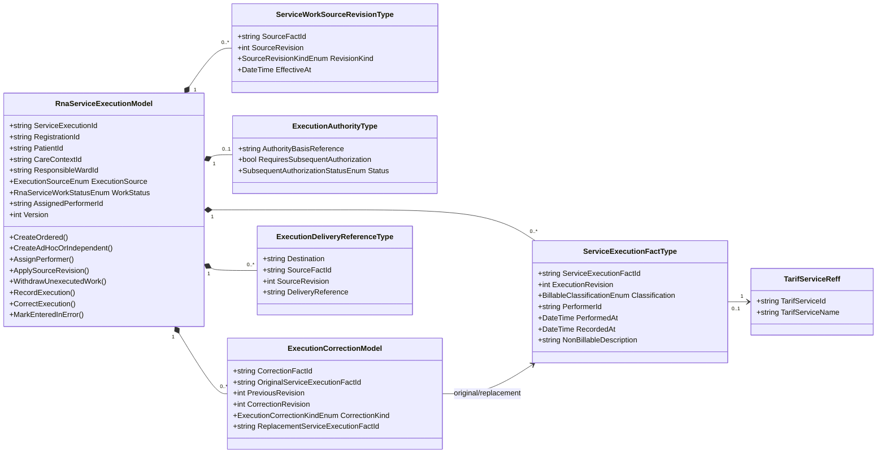

# RNA Service Execution Model

**Context:** RUANG RANAP Operational Management (RNA)  
**Code location:** `src/bilreg/Bilreg.Domain/BedUsageContext/RnaServiceExecutionFeature`  
**Status:** Domain-model implementation baseline

## Purpose and boundary

`RnaServiceExecutionModel` represents one ordered work obligation or one Ad Hoc/Independent service-execution instance. It preserves the operational truth that a service was performed; it does not own Clinical Order intent, Tarif Service definition, clinical documentation, or billing decisions.

The aggregate owns its source identity and revisions, optional performer assignment, immutable execution facts, authority record, correction chain, and delivery references. A recurring Clinical Order uses separate aggregate instances for separate occurrences/execution instances.

## Property explanation

| Property/group | Meaning |
|---|---|
| `ServiceExecutionId`, `Version` | Aggregate identity and optimistic-concurrency version. |
| `RegistrationId`, `PatientId`, `CareContextId`, `ResponsibleWardId` | Stable references identifying the patient care context and RNA Ward that owns the operational record. |
| `ExecutionSource` | `Ordered`, `AdHoc`, or `Independent`; RNA never fabricates a prospective order for the latter two. |
| Order/source references | `ClinicalOrderId`, `OrderOccurrenceId`, `FulfilmentObligationId`, `SourceContext`, `SourceFactId`, and `SourceRevision` preserve ordered-work correlation and deduplication identity. |
| `AssignedPerformerId`, `WorkStatus` | Optional coordination assignment and the pending/assigned/executed/withdrawn/cancelled/error lifecycle. Assignment is not execution evidence. |
| `ExecutionAuthority` | Ad Hoc/Independent authority basis and CPOE-owned subsequent-authorization status reference. It does not make RNA the authorization owner. |
| `ListExecutionFact` | Append-only execution facts. Every fact records actual performer, `PerformedAt`, server `RecordedAt`, and either a billable eligible Service or non-billable description. |
| `ListCorrection` | Append-only correction/replacement/Entered-in-Error chain that preserves the original fact. |
| `ListSourceRevision` | Source amendment, cancellation, or discontinuation history. A later cancellation never erases an already-recorded execution. |
| `ListDeliveryReference` | References to delivery obligations/outcomes. Delivery metadata never changes business facts. |

## Behaviour explanation

| Method | Business meaning |
|---|---|
| `CreateOrdered` | Creates pending work from an authoritative order occurrence/obligation. |
| `CreateAdHocOrIndependent` | Creates pending non-prospective work with its declared authority basis. |
| `AssignPerformer` | Records coordination responsibility only while the work is pending. |
| `ApplySourceRevision` | Records a newer ordered-source revision; cancellation/discontinuation closes only unexecuted work. |
| `WithdrawUnexecutedWork` | Ends pending/assigned work without creating an execution fact. |
| `RecordExecution` | Records the first truthful execution fact. Billable requires service; non-billable requires description. |
| `AssociateSubsequentAuthorization` | Associates a CPOE-provided authority status without changing execution truth. |
| `CorrectExecution` | Appends a replacement execution fact and correction link; the original remains immutable. |
| `MarkEnteredInError` | Appends an Entered-in-Error correction with an independent reviewer; it never deletes the original fact. |

`PerformedAt` is actual performer-supplied execution time. It is distinct from `RecordedAt`; a late entry requires a reason. All business timestamps are UTC.

## Class diagram

## Explicit exclusions

The aggregate does not call CPOE, Tarif, Tata Rekening, Tindakan, NERS, repositories, SQL, or an outbox. Application validates eligible Service and authority before invoking aggregate behaviour; Infrastructure persists and delivers the committed facts.
