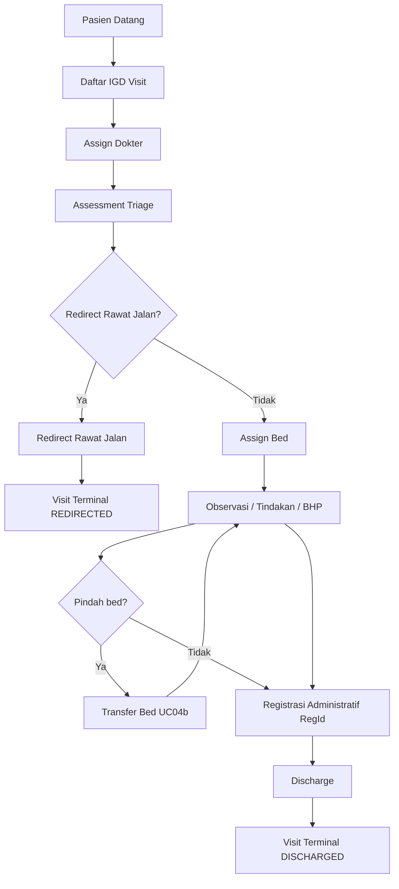

# 01-context.md — IGD Visit

## FEATURE NAME

IGD Visit (`IgdVisit`)

## PURPOSE

Menyediakan identitas operasional tunggal (`IgdVisitId`) untuk seluruh pelayanan pasien di Instalasi Gawat Darurat (IGD), sehingga alur klinis emergensi dapat berjalan tanpa menunggu registrasi administratif, sambil tetap mendukung billing dan legalitas administrasi setelah `RegId` tersedia.

## BUSINESS PROBLEM

Sistem legacy mengutamakan `RegId` sebagai identitas kunjungan. Di IGD, pasien sering membutuhkan triage, observasi, tindakan, dan BHP sebelum registrasi administratif selesai. Tanpa identitas operasional terpisah, pelayanan medis tertunda atau data klinis terfragmentasi.

## FEATURE SCOPE

| In scope | Out of scope (lihat OUT OF SCOPE) |
| -------- | --------------------------------- |
| Pendaftaran visit IGD (`Daftar`) | Master pasien penuh |
| Assign dokter jaga | Billing engine legacy |
| Triage ATS (assessment, re-assessment, monitoring) | LIS / radiologi |
| Assign bed, check-out bed, **transfer bed** (satu bed aktif per visit), occupancy | Rawat inap / ICU transfer penuh |
| Tindakan medis IGD | Death handling / medical resume |
| Pemakaian BHP | Nursing notes / vital sign monitoring |
| Link registrasi administratif (`RegId`) | BPJS / asuransi orchestration |
| Redirect ke rawat jalan | Queue dashboard terpusat (future) |
| Discharge dan void visit | |

## USER ROLE

| Role | Tanggung jawab operasional |
| ---- | -------------------------- |
| Dokter jaga IGD | Triage (assessment klinis), keputusan redirect, tindakan |
| Perawat IGD | Input triage, observasi, BHP |
| Admin IGD | Daftar visit, assign dokter, registrasi tertunda, discharge |
| Operator / DBA | Reconciliation data occupancy (hanya saat insiden) |

## OPERATIONAL FLOW

Alur operasional standar (clinical flow first):

1. Pasien datang → **Daftar IGD Visit** (identitas awal `Visitor`).
2. **Assign Dokter** jaga.
3. **Assessment Triage** (wajib sebelum assign bed).
4. Keputusan klinis:
   - **Redirect Rawat Jalan** → visit terminal (`REDIRECTED`), tanpa bed aktif.
   - Lanjut IGD → **Assign Bed** → observasi / tindakan / BHP.
   - Saat observasi: **Transfer Bed** (UC04b) jika salah tempat bed atau prioritas ulang ke bed lain — **bukan** multi-bed (tetap satu bed aktif per visit).
5. **Registrasi Administratif** (`RegId`) dapat dilakukan setelah layanan medis dimulai.
6. **Discharge** setelah `RegId` ada dan pasien tidak menempati bed.

Void visit hanya jika belum ada transaksi tindakan atau BHP.

## BUSINESS RULE

| Rule | Ringkasan |
| ---- | --------- |
| Clinical flow first | Triage, bed, tindakan, BHP boleh sebelum `RegId` |
| Operational identity | Semua aktivitas IGD mengacu `IgdVisitId`, bukan `RegId` |
| Delayed registration | Registrasi administratif boleh mengikuti layanan medis |
| Billing gate | Billing legacy hanya jika visit sudah punya `RegId` |
| Triage before bed | Assign bed ditolak jika belum triage |
| Bed occupancy | Satu bed satu pasien aktif; satu visit hanya satu bed aktif; transfer bed memindahkan occupancy tanpa mengakhiri visit |
| Redirect constraint | Redirect tidak diperbolehkan saat masih menempati bed |
| Discharge gate | Discharge wajib `RegId` dan tidak ada bed aktif |
| Void gate | Void ditolak jika sudah ada tindakan atau BHP |
| Re-assessment | Setiap re-triage menambah histori; assessment lama tidak diubah |

## TERMINOLOGY

| Term | Makna operasional |
| ---- | ----------------- |
| IgdVisit | Identitas operasional pelayanan IGD |
| IgdVisitId | Primary key operasional (prefix `IGV`) |
| Visitor | Identitas awal pasien sebelum registrasi penuh |
| Register / RegId | Registrasi administratif resmi (legacy HIS) |
| Triage | Assessment tingkat kegawatan (ATS aktif) |
| ATS1–ATS5 | Level triage; dipetakan ke Red / Yellow / Green |
| Black | Override manual dokter (bukan hasil scoring ATS) |
| Bed IGD | Resource observasi/tindakan terbatas |
| Observed / HasObserved | Pasien sedang menempati bed |
| PakaiBedIgd | Histori penggunaan bed (check-in/check-out) |
| Transfer bed (UC04b) | Pindah occupancy ke bed lain tanpa check-out administratif terpisah; satu event `TRANSFER_BED` |
| Redirect Rawat Jalan | Pengalihan ke layanan rawat jalan |
| Discharge | Penyelesaian pelayanan IGD |
| Void Visit | Pembatalan visit (audit `VodDate`) |
| Tindakan IGD | Transaksi tindakan medis |
| BHP | Barang habis pakai medis |

## EXTERNAL DEPENDENCY

| Sistem | Peran |
| ------ | ----- |
| Legacy HIS — Register | Sumber `RegId` / `PasienId`; IGD menyimpan referensi |
| Legacy HIS — Billing | Otoritas billing; membutuhkan `RegId` dan data tindakan/BHP/occupancy |
| Admisi `Reg` aggregate | Validasi dan link `RegId` ke visit |
| Admisi `Ppa` (dokter) | Validasi dokter jaga |

## NON FUNCTIONAL REQUIREMENT

| Area | Requirement |
| ---- | ----------- |
| Availability | Mendukung operasi IGD 24/7; state realtime untuk dashboard aktif |
| Auditability | Timeline operasional per visit; histori triage append-only |
| Medico-legal | Histori triage tidak boleh diubah setelah tercatat |
| Consistency | Bed occupancy dan visit state harus konsisten dalam transaksi aplikasi |
| Maintainability | Monolith eksplisit; tanpa event sourcing / saga terdistribusi |

## OUT OF SCOPE

- Take over dokter, bed reservation, **multi-bed occupancy** (satu visit beberapa bed sekaligus)
- Transfer rawat inap / ICU, death handling, medical resume
- Nursing notes, vital sign monitoring terintegrasi
- Integrasi BPJS / asuransi, queue dashboard terpusat
- Engine workflow generik; multiple triage method selain ATS (konsep ada, implementasi aktif ATS)
