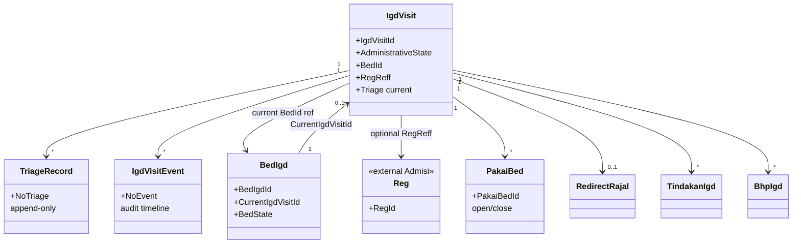
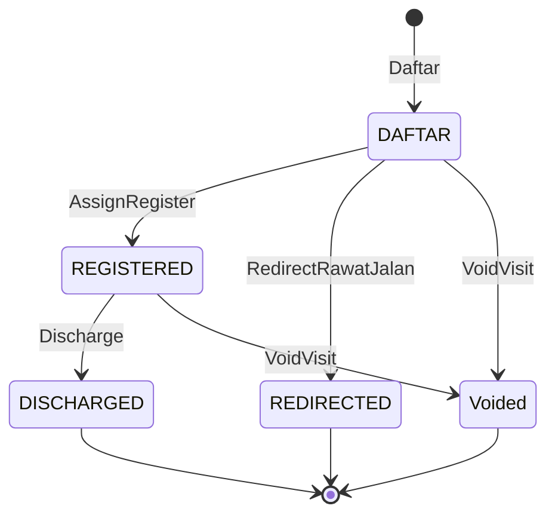

# 02-domain.md — IGD Visit

## FEATURE NAME

IGD Visit (`IgdVisit`)

## DOMAIN OVERVIEW

Bounded context **IGD Visit** mengelola siklus operasional pasien gawat darurat: identitas kunjungan, triage, occupancy bed, transaksi klinis pendukung, state administratif, dan penutupan visit.

Prinsip domain:

- **Clinical flow first** — layanan medis tidak menunggu `RegId`.
- **IgdVisitId** sebagai identitas operasional; **RegId** untuk administrasi/billing.
- **Current state + transaction history** — state realtime di aggregate root; histori di entitas transaksi terpisah.
- **Operational events** — audit timeline, bukan event sourcing.

## AGGREGATE

| Aggregate | Root | Source of truth |
| --------- | ---- | ---------------- |
| IgdVisit | `IgdVisitModel` | State pelayanan pasien, dokter aktif, triage terkini, bed aktif, state administratif, redirect |
| BedIgd | `BedIgdModel` | Occupancy bed (`CurrentIgdVisitId`, `BedState`) |

`TindakanIgd`, `BhpIgd`, `RedirectRajal` dimodelkan sebagai transaksi terikat `IgdVisitId` (bukan root terpisah untuk orkestrasi visit).

## ENTITY

| Entity / record | Milik aggregate | Peran |
| ------------- | --------------- | ----- |
| TriageRecord (`IgdVisitTriageType`) | IgdVisit (collection) | Histori assessment append-only |
| IgdVisitEvent (`IgdVisitEventType`) | IgdVisit (collection) | Timeline audit operasional |
| PakaiBed (`PakaiBedModel`) | Transaksi occupancy | Histori check-in/check-out per bed |
| RedirectRajal (`RedirectRajalModel`) | Transaksi redirect | Bukti pengalihan rawat jalan |
| TindakanIgd (`TindakanIgdModel`) | Transaksi klinis | Tindakan medis |
| BhpIgd (`BhpIgdModel`) | Transaksi klinis | Pemakaian BHP |

## VALUE OBJECT

| Value object | Konteks |
| ------------ | ------- |
| `VisitorType` | Identitas awal pasien (nama, gender, tgl lahir, kontak) |
| `PpaReff` / dokter aktif | Dokter jaga |
| `RegReff` | Referensi registrasi (`RegId`, `PasienId`) |
| `RedirectionType` | `RedirectRajalId`, waktu, alasan |
| `IgdVisitTriageType` | Satu baris assessment (skor ATS, level, warna, override Black) |
| `AtsAssessmentType` | Komponen skor: Airways, Breathing, Circulation, GCS |
| `AuditTrailType` / `AuditInfoType` | Audit create/update/void/discharge |
| `AdministrativeStateEnum` | State administratif visit |
| `BedStateEnum` | Active, Occupied, Maintenance, Dirty |

## DOMAIN RELATIONSHIP

## DOMAIN FLOW

| Kode | Use case domain | Efek utama pada model |
| ---- | --------------- | --------------------- |
| UC01 | DaftarIgdVisit | Create visit, state `DAFTAR`, event Daftar |
| UC02 | AssignDokter | Set `Dokter`, validasi terminal & role dokter |
| UC03 | AssessTriage | Append `TriageRecord`, update current triage & `NextReTriageAt` |
| UC03a | ReAssessTriage | Sama UC03; histori tetap |
| UC04 | AssignBed | `BedId` terisi; requires `HasTriage`; koordinasi `BedIgd` + `PakaiBed` |
| UC04a | CheckOut | Kosongkan `BedId`; release bed + close `PakaiBed` |
| UC04b | TransferBed | Pindah occupancy ke bed lain tanpa mengakhiri visit; tutup `PakaiBed` lama (update checkout), buka `PakaiBed` baru; `BedId` ke bed tujuan; event `TRANSFER_BED` |
| UC05 | RedirectRawatJalan | `REDIRECTED`, `Redirection`; tidak boleh `HasObserved` |
| UC06 | Tindakan | Transaksi + event AddTindakan |
| UC07 | PakaiObatBhp | Transaksi + event AddBhp |
| UC08 | AssignRegister | Link `Reg`, state `REGISTERED` |
| UC09 | Discharge | `DISCHARGED`; requires `HasReg`; cascade clear bed |
| UC10 | VoidVisit | `AuditTrail` void; blokir jika ada tindakan/BHP |

## STATE TRANSITION

### Administrative state (`IgdVisit`)

| State | Code | Masuk | Keluar umum |
| ----- | ---- | ----- | ----------- |
| Daftar | `DAFTAR` | Create visit | AssignRegister → Registered; Redirect → Redirected; Void |
| Registered | `REGISTERED` | AssignRegister | Discharge; Void |
| Redirected | `REDIRECTED` | RedirectRawatJalan | Terminal |
| Discharged | `DISCHARGED` | Discharge | Terminal |

Void tidak mengubah `AdministrativeState` enum; ditandai `AuditTrail.IsVoided` (`VodDate`).

### Derived operational flags

| Flag | Definisi domain |
| ---- | ---------------- |
| HasObserved | `BedId` bukan empty (`"-"`) |
| HasReg | `RegId` bukan empty |
| IsTerminal | Discharged, Redirected, atau Voided |
| HasNextReTriage | `NextReTriageAt` terisi (bukan sentinel `3000-01-01`) |

### Bed state (`BedIgd`)

| State | Makna |
| ----- | ----- |
| Active | Siap ditempati |
| Occupied | `CurrentIgdVisitId` terisi |
| Dirty | Setelah release, menunggu cleaning |
| Maintenance | Tidak tersedia operasional |

## DOMAIN EVENT

| Jenis | Nama | Catatan |
| ----- | ---- | ------- |
| Operational timeline | `IgdVisitEvent` (`IgdEventEnum`) | Daftar, AssignDokter, AssessTriage, AssignBed, CheckOut, TransferBed, ClearBed, AssignRegister, Redirect, AddTindakan, AddBhp, Discharge, Void |

Bukan domain event untuk event sourcing. Lihat [`docs/concepts/operational-events.md`](../../concepts/operational-events.md) §1.

## DOMAIN RULE

| ID | Rule |
| -- | ---- |
| DR-01 | Triage oleh dokter jaga; input sistem oleh dokter/perawat/admin IGD |
| DR-02 | `TriageRecord` immutable; re-assessment hanya menambah record |
| DR-03 | ATS aktif: level ATS1–5 → Red/Yellow/Green; Black hanya manual override dokter |
| DR-04 | Re-assessment interval: ATS1 continuous; ATS2 15m; ATS3 30m; ATS4 60m; ATS5 120m |
| DR-05 | Assign bed ditolak tanpa triage |
| DR-06 | Satu bed satu visit aktif (`BedIgd` occupancy) |
| DR-07 | Redirect ditolak jika masih observed |
| DR-08 | Discharge wajib `HasReg` dan tidak observed (bed dilepas dulu atau cascade) |
| DR-09 | Void ditolak jika `hasTindakan` atau `hasBhp` |
| DR-10 | Billing eksternal hanya dengan `RegId` |
| DR-11 | Transfer bed (UC04b): hanya jika visit **observed** dan **non-terminal**; bed tujuan **tersedia** (DR-06) dan **bukan** bed saat ini; tutup `PakaiBed` terbuka di bed asal + release asal + occupy tujuan + buka `PakaiBed` baru + update `BedId` dalam **satu** transaksi aplikasi; baris `PakaiBed` tertutup tidak diubah; bukan multi-bed occupancy |

## BOUNDED CONTEXT INTERACTION

| Context | Arah | Kontrak domain |
| ------- | ---- | -------------- |
| Admisi — Reg | IGD → Reg | Load `RegModel` by `RegId`; simpan `RegReff` di visit |
| Admisi — Ppa | IGD → Ppa | Validasi dokter untuk assign dokter |
| Pasien | Reg | `PasienId` via registrasi |
| Legacy HIS | Referensi | Register dan billing di luar BILRG; IGD menyediakan data operasional |

## KNOWN DOMAIN COMPLEXITY

| Area | Kompleksitas |
| ---- | ------------ |
| Dual write bed | `IgdVisit.BedId` (current) dan `BedIgd.CurrentIgdVisitId` (source of truth occupancy) harus selaras via use-case |
| Triage engine | Multiple method (ATS, ESI, CTAS, MTS) dirancang; produksi memakai ATS + `AtsTriageEngine` |
| Terminal vs void | Void tidak set administrative enum; query aktif harus filter `VodDate` |
| Priority bed | Aturan prioritas kegawatan operasional; enforcement utama di proses klinis, bukan auto-preempt di domain saat ini |
