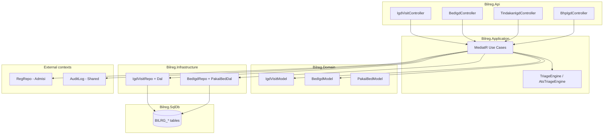

# 03-design.md — IGD Visit

## FEATURE NAME

IGD Visit (`IgdVisit`)

## DESIGN OVERVIEW

Implementasi mengikuti Clean Architecture + Pragmatic Tactical DDD: rich domain model di `Bilreg.Domain/IgdContext`, use-case orchestration di `Bilreg.Application`, persistence eksplisit di `Bilreg.Infrastructure` + `Bilreg.SqlDb`, API tipis di `Bilreg.Api`.

Pola inti: **current state** (`BILRG_IgdVisit`, `BILRG_BedIgd`) + **transaction history** (`BILRG_IgdVisitTriage`, `BILRG_PakaiBed`, `BILRG_TindakanIgd`, dll.) dalam **explicit transaction** (`TransHelper.NewScope`).

## ARCHITECTURE

Layer dependency: Api → Application → Domain; Infrastructure implements repository/DAL contracts.

## AGGREGATE IMPLEMENTATION

| Aggregate | Domain type | Repository | Load pattern |
| --------- | ----------- | ---------- | ------------ |
| IgdVisit | `IgdVisitModel` | `IIgdVisitRepo` / `IgdVisitRepo` | `LoadEntity` + `AttachTriages` / `AttachEvents` |
| BedIgd | `BedIgdModel` | `IBedIgdRepo` / `BedIgdRepo` | Snapshot fields (`BedStateSnapshot`, `CurrentIgdVisitIdSnapshot`) untuk optimistic concurrency |
| PakaiBed | `PakaiBedModel` | `IPakaiBedRepo` | `LoadOpenForBed` pada discharge/void/checkout/**transfer** |

Domain behaviour tetap di model (`AssignBed`, `TransferBed`, `Discharge`, `Void`, dll.); handler hanya orchestrasi, validasi cross-aggregate, dan persist.

## PERSISTENCE DESIGN

| Table | Feature folder | Peran |
| ----- | -------------- | ----- |
| `BILRG_IgdVisit` | `IgdVisitFeature` | Current visit state |
| `BILRG_IgdVisitTriage` | `IgdVisitFeature` | Append-only triage history |
| `BILRG_IgdVisitEvent` | `IgdVisitFeature` | Operational event timeline |
| `BILRG_BedIgd` | `BedIgdFeature` | Bed master + occupancy |
| `BILRG_PakaiBed` | `BedIgdFeature` | Bed usage history; open row `CheckOutDateTime = 3000-01-01` |
| `BILRG_RedirectRajal` | `RedirectRajalFeature` | Redirect transaction |
| `BILRG_TindakanIgd` | `TindakanIgdFeature` | Tindakan lines |
| `BILRG_BhpIgd` | `BhpIgdFeature` | BHP lines |

Konvensi sentinel: `3000-01-01` untuk tanggal kosong; `VodDate` untuk void; `IgdVisitId` prefix `IGV` via `NunaId.New`.

Index penting:

- `IX_BILRG_IgdVisit_State`, `IX_BILRG_IgdVisit_NextReTriageAt`
- `UQ_BILRG_BedIgd_VisitActive` — satu visit tidak boleh occupy dua bed (`BedState = OCCUPIED`)

Mapping: DTO (`IgdVisitDto`, `BedIgdDto`, …) ↔ model di Infrastructure; SQL-first scripts di `Bilreg.SqlDb/IgdContext/`.

## TRANSACTION STRATEGY

Use-case yang menulis lebih dari satu aggregate memakai `TransHelper.NewScope()`:

| Use case | Writes dalam satu transaksi |
| -------- | --------------------------- |
| AssignBed | `BedIgd` + `PakaiBed` + `IgdVisit` |
| CheckOut | `BedIgd` + `PakaiBed` + `IgdVisit` |
| TransferBed (UC04b) | `BedIgd` asal + `PakaiBed` tutup + `BedIgd` tujuan + `PakaiBed` buka + `IgdVisit` (lima entitas persist, satu scope) |
| Discharge | optional bed release + `IgdVisit` |
| Void | optional bed release + `IgdVisit` + compliance `AuditLog` |
| Redirect | `RedirectRajal` + `IgdVisit` (bed harus sudah kosong) |

Tidak ada distributed saga; kegagalan parcial ditangani operasional (orphan sweep).

## CONCURRENCY STRATEGY

- `BedIgd` menyimpan snapshot state pada load; `SaveChanges` memvalidasi occupancy belum berubah.
- Filtered unique index `UQ_BILRG_BedIgd_VisitActive` mencegah double active occupancy di DB.
- Assign bed handler: validasi `bed.IsAvailable` dan `visit` belum observed sebelum `Occupy`.
- Transfer bed: dua bed dalam satu transaksi; bed **tujuan** memakai CAS yang sama — race ke bed kosong yang sama akan gagal pada `SaveChanges` tujuan (*occupancy stale*).

## QUERY STRATEGY

| Query | Handler | Catatan |
| ----- | ------- | ------- |
| Get visit | `IgdVisitGetQuery` | Load aggregate + attachments |
| List aktif | `IgdVisitListAktifQuery` | Filter non-terminal, non-void |
| Triage history | `IgdVisitGetTriageHistoryQuery` | By visit |
| Triage monitoring | `IgdVisitGetTriageMonitoringQuery` | `NextReTriageAt` untuk dashboard |
| Bed available | `BedIgdListAvailableQuery` | `BedState = Active` |
| Orphan PakaiBed | `PakaiBedListOrphanQuery` | Read-only reconciliation sweep |

Perhitungan `NextReTriageAt` di backend (`AtsTriageEngine` / domain); frontend hanya menampilkan countdown.

## INTEGRATION DESIGN

| Integrasi | Implementasi |
| --------- | ------------ |
| Reg link | `IgdVisitAssignRegisterCmd` → `IRegRepo.LoadEntity` → `visit.AssignRegister` |
| Tindakan / BHP | Controller terpisah; handler cek visit tidak terminal; `RecordTindakanEvent` / `RecordBhpEvent` |
| Void audit | `IgdVisitVoidCmd` → snapshot JSON + `IAuditRepo` (compliance) |
| Legacy billing | Out of process; konsumsi data dari tabel transaksi + `RegId` |

## SECURITY DESIGN

- API menerima `UserId` pada body command ( pola existing BILRG).
- Void menangkap `ClientIpAddress` dan `UserAgent` dari HTTP context untuk audit log.
- Authorization policy mengikuti konfigurasi global API (tidak feature-specific di domain).

## PERFORMANCE CONSIDERATION

- Index pada `AdministrativeState`, `NextReTriageAt`, `BedIgdId`, `RegId`.
- List aktif dan triage monitoring adalah read query terarah; hindari load full event history pada list.
- Append-only triage/event: insert batch pada `SaveChanges` visit.

## ERROR HANDLING STRATEGY

- Domain: `InvalidOperationException` / `ArgumentException` dengan pesan operasional Bahasa Indonesia.
- Application: `GetValueOrThrow` untuk not-found.
- API: `JSendOk` wrapper; tidak ada retry otomatis pada conflict bed (client harus refresh dan ulangi).

## AI IMPLEMENTATION NOTE

Saat menambah use case IGD:

1. Baca [`igd-01-context.md`](igd-01-context.md) untuk gate bisnis, [`igd-02-domain.md`](igd-02-domain.md) untuk invariant.
2. Ubah `IgdVisitModel` / `BedIgdModel` terlebih dahulu, lalu handler + repo + SQL script.
3. Bed + visit dual-write wajib satu `TransHelper.NewScope` jika keduanya berubah.
4. Operational timeline: tambah `IgdEventEnum` + emit di model, persist via `IgdVisitEventDal`.
5. Jangan mengubah baris `TriageRecord` historis; hanya append.
6. Skills: [`docs/skills/feature-model-generation.md`](../../skills/feature-model-generation.md), [`feature-persistence-generation.md`](../../skills/feature-persistence-generation.md), [`use-case-generation.md`](../../skills/use-case-generation.md).

## TESTING STRATEGY

| Area | Lokasi test |
| ---- | ----------- |
| Domain invariant | `Bilreg.Test/IgdContext/IgdVisitFeature/IgdVisitModelTest.cs` |
| Handlers | `IgdVisitDaftarHandlerTest`, `DischargeHandlerTest`, `VoidHandlerTest`, … |
| DAL / orphan | `PakaiBedDalTest`, `BedIgdRepoConcurrencyTest` (assign + transfer target CAS) |
| Triage | `IgdVisitTriageDalTest` |

Uji minimal: assign bed tanpa triage (gagal), discharge tanpa reg (gagal), void dengan tindakan (gagal), concurrent bed assign.

## DEPLOYMENT / ROLLOUT NOTE

- **API surface (routes, bodies, responses):** [`igd-04-api-contract.md`](igd-04-api-contract.md)
- **Operational usage, troubleshooting, orphan PakaiBed recovery:** [`igd-05-runbook.md`](igd-05-runbook.md)

## FUTURE EXTENSION POINT

| Area | Hook |
| ---- | ---- |
| Triage methods | `ITriageMethodEngine` + `TriageMethodEngineResolver` (ESI, CTAS, MTS) |
| Bed | `MarkClean`, `MarkMaintenance`, reservation |
| Visit | Take-over dokter, transfer RANAP/ICU, death handling |
| Observability | Real-time occupancy dashboard, queue integration |

Perubahan harus memperbarui [`igd-01-context.md`](igd-01-context.md) (scope), [`igd-02-domain.md`](igd-02-domain.md) (invariant), [`igd-04-api-contract.md`](igd-04-api-contract.md) / [`igd-05-runbook.md`](igd-05-runbook.md) bila surface atau ops berubah, lalu implementasi di layer Application/Infrastructure.
