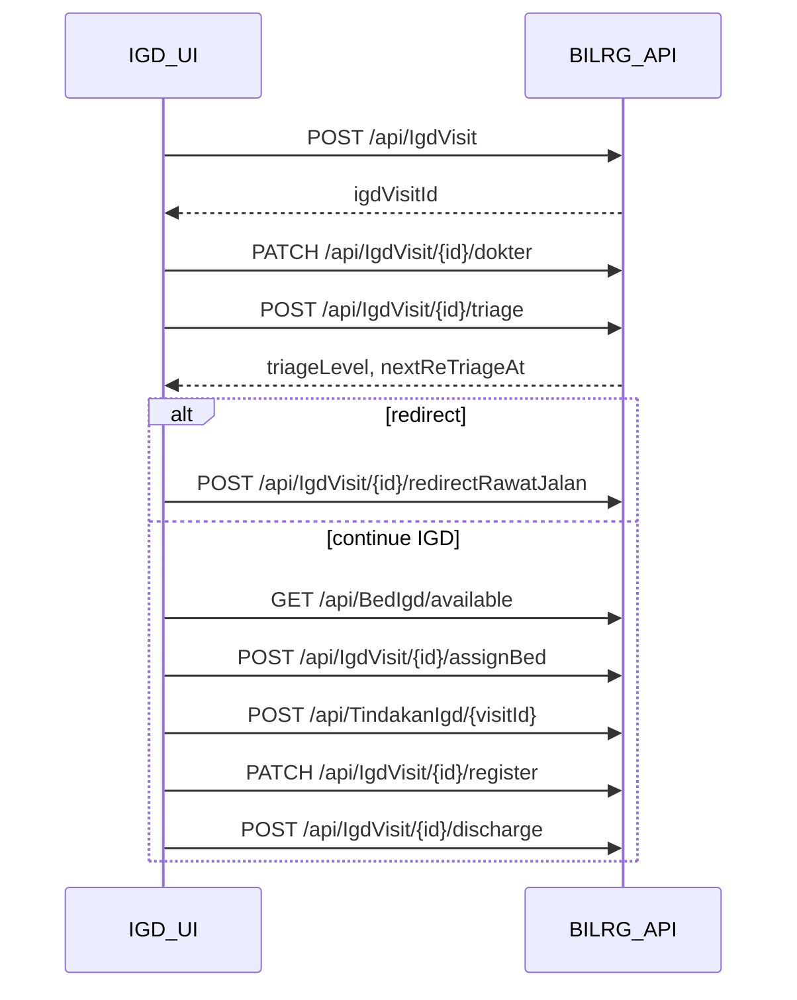

# igd-04-api-contract.md — IGD Visit API

> **Status:** Implementation-aligned contract — update when controllers or MediatR command/response shapes change.  
> **Canonical location:** `docs/contexts/igd/igd-04-api-contract.md`  
> **Related:** [`igd-02-domain.md`](igd-02-domain.md) (domain gates DR-*), [`igd-03-design.md`](igd-03-design.md) (error handling), [`igd-05-runbook.md`](igd-05-runbook.md) (operations)

---

## Response envelope

All endpoints return `200 OK` with `JSendOk` wrapper:

```json
{ "status": "success", "data": { ... } }
```

Command failures surface as HTTP errors with exception message text (operational Bahasa Indonesia from domain/application). No feature-specific error code enum on the API surface today.

---

## Base paths

| Controller | Base route |
| ---------- | ---------- |
| IgdVisit | `/api/IgdVisit` |
| BedIgd | `/api/BedIgd` |
| TindakanIgd | `/api/TindakanIgd` |
| BhpIgd | `/api/BhpIgd` |

`{id}` / `{visitId}` = `IgdVisitId` (prefix `IGV`).

---

## IgdVisit — write

### Daftar (create visit)

| | |
|--|--|
| **Route** | `POST /api/IgdVisit` |
| **Body** | `UserId`, `VisitorName`, `VisitorGender`, `TglLahirYmd` (`yyyyMMdd`), `VisitorKontak` |
| **Response `data`** | `{ "igdVisitId": "IGV..." }` |

### Assign dokter

| | |
|--|--|
| **Route** | `PATCH /api/IgdVisit/{id}/dokter` |
| **Body** | `DokterId`, `UserId` |
| **Response `data`** | `"Done"` |
| **Gate** | Visit not terminal; `DokterId` must be dokter PPA (DR-01 context) |

### Assess triage (first)

| | |
|--|--|
| **Route** | `POST /api/IgdVisit/{id}/triage` |
| **Body** | `AirwaysScore` (0–2), `BreathingScore` (0–5), `BloodCirculationScore` (0–4), `GcsEyeScore` (1–4), `GcsMotorScore` (1–6), `GcsVoiceScore` (1–5), `IsManualOverrideBlack`, `OverrideReason`, `Notes`, `UserId` |
| **Response `data`** | `IgdVisitId`, `NoTriage`, `TriageMethod`, `TriageLevel`, `TriageColor`, `LastTriageAt`, `NextReTriageAt` |
| **Gate** | Visit not terminal; ATS engine computes level/color and `NextReTriageAt` |

### Re-assess triage

| | |
|--|--|
| **Route** | `POST /api/IgdVisit/{id}/re-triage` |
| **Body** | Same as triage |
| **Response `data`** | Same as triage |
| **Gate** | Appends new triage record (DR-02) |

### Assign bed

| | |
|--|--|
| **Route** | `POST /api/IgdVisit/{id}/assignBed` |
| **Body** | `BedIgdId`, `UserId` |
| **Response `data`** | `IgdVisitId`, `BedIgdId`, `PakaiBedId` |
| **Gate** | DR-05 (has triage), DR-06 (bed available), visit not terminal, not already observed |

### Check out bed

| | |
|--|--|
| **Route** | `POST /api/IgdVisit/{id}/checkOut` |
| **Body** | `UserId` |
| **Response `data`** | `"Done"` |
| **Gate** | Visit must be observed; releases bed + closes open `PakaiBed` |

### Redirect rawat jalan

| | |
|--|--|
| **Route** | `POST /api/IgdVisit/{id}/redirectRawatJalan` |
| **Body** | `Reason`, `UserId` |
| **Response `data`** | `IgdVisitId`, `RedirectRajalId` |
| **Gate** | DR-07 (no active bed); visit not terminal |

### Link register

| | |
|--|--|
| **Route** | `PATCH /api/IgdVisit/{id}/register` |
| **Body** | `RegId`, `UserId` |
| **Response `data`** | `"Done"` |
| **Gate** | `RegId` must exist in Admisi; visit not terminal; not already registered |

### Discharge

| | |
|--|--|
| **Route** | `POST /api/IgdVisit/{id}/discharge` |
| **Body** | `UserId` |
| **Response `data`** | `IgdVisitId`, `AdministrativeState`, `DischargeDateTime`, `BedReleased` |
| **Gate** | DR-08 (`HasReg`, no active bed — cascade release if observed) |

### Void visit

| | |
|--|--|
| **Route** | `POST /api/IgdVisit/{id}/void` |
| **Body** | `UserId`, `VoidReason` |
| **Response `data`** | `IgdVisitId`, `IsVoided`, `BedReleased` |
| **Server** | Captures client IP and User-Agent for compliance audit |
| **Gate** | DR-09 (no tindakan/BHP); not discharged |

---

## IgdVisit — read

### Get visit detail

| | |
|--|--|
| **Route** | `GET /api/IgdVisit/{id}` |
| **Response `data`** | `IgdVisitGetResponse`: visit header, triage summary, `AdministrativeState`, `RegId`, `PasienId`, `BedIgdId`, `IsVoided`, `ListTriage[]`, `ListEvent[]` |

### List aktif

| | |
|--|--|
| **Route** | `GET /api/IgdVisit/aktif` |
| **Response `data`** | `IgdVisitView[]`: `IgdVisitId`, `DaftarDateTime`, `VisitorName`, `Gender`, `DokterId`, `DokterName`, `HasTriage`, `TriageLevel`, `TriageColor`, `LastTriageAt`, `NextReTriageAt`, `AdministrativeState`, `RegId`, `BedIgdId`, `BedIgdName` |

### Triage monitoring

| | |
|--|--|
| **Route** | `GET /api/IgdVisit/triage-monitoring` |
| **Response `data`** | `IgdVisitTriageMonitoringItem[]`: `IgdVisitId`, `VisitorName`, `TriageLevel`, `TriageColor`, `LastTriageAt`, `NextReTriageAt`, `IsOverdue` |
| **Note** | Backend computes overdue; UI displays countdown from `NextReTriageAt` |

### Triage history

| | |
|--|--|
| **Route** | `GET /api/IgdVisit/{id}/triage-history` |
| **Response `data`** | `TriageHistoryItem[]` ordered by `NoTriage` descending |

---

## BedIgd

### List available beds

| | |
|--|--|
| **Route** | `GET /api/BedIgd/available` |
| **Response `data`** | `BedIgdView[]`: `BedIgdId`, `BedIgdName`, `KamarName`, `BedState`, `CurrentIgdVisitId`, `OccupyDateTime` |
| **Note** | Only beds in `Active` state with no occupancy |

### List orphan PakaiBed (reconciliation)

| | |
|--|--|
| **Route** | `GET /api/BedIgd/pakaiBed/orphan` |
| **Response `data`** | `PakaiBedOrphanView[]`: `PakaiBedId`, `IgdVisitId`, `BedIgdId`, `BedIgdName`, `CheckInDateTime`, `OrphanReason`, `VisitState`, `BedState`, `BedCurrentIgdVisitId` |
| **Audience** | Operator / DBA — see [`igd-05-runbook.md`](igd-05-runbook.md) |

---

## TindakanIgd

| | |
|--|--|
| **Route** | `POST /api/TindakanIgd/{visitId}` |
| **Body** | `TarifId`, `TarifName`, `Qty`, `Price`, `UserId` |
| **Response `data`** | `TindakanIgdId`, `IgdVisitId`, `Subtotal` |
| **Gate** | Visit not terminal |

---

## BhpIgd

| | |
|--|--|
| **Route** | `POST /api/BhpIgd/{visitId}` |
| **Body** | `BhpItemId`, `BhpItemName`, `Qty`, `Price`, `UserId` |
| **Response `data`** | `BhpIgdId`, `IgdVisitId`, `Subtotal` |
| **Gate** | Visit not terminal |

---

## Typical UI workflow (sequence)



---

## Validation summary

| Area | Rule |
| ---- | ---- |
| Triage scores | Ranges enforced in `IgdVisitAssessTriageHandler` (see assess triage body) |
| UserId | Required on all write bodies |
| Void | `VoidReason` required |
| Register | `RegId` must resolve in Admisi `Reg` aggregate |
| Idempotency | Discharge on already-discharged visit returns current state without error |

---

## Authorization

No IGD-specific authorization attributes on controllers. Follow global API authentication/authorization configuration. `UserId` in body is the operational actor id for audit trails.

---

## Pagination / filtering

List endpoints (`aktif`, `triage-monitoring`, `available`, `orphan`) return full result sets — no paging parameters on current surface.
