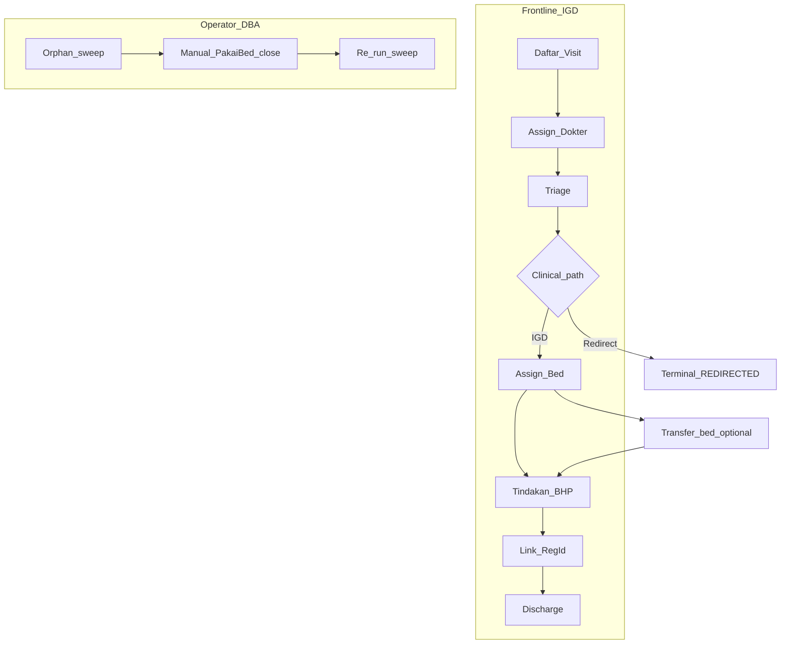

# igd-05-runbook.md — IGD Visit Operations

> **Canonical location:** `docs/contexts/igd/igd-05-runbook.md`  
> **Related:** [`igd-01-context.md`](igd-01-context.md) (roles, operational flow), [`igd-04-api-contract.md`](igd-04-api-contract.md) (API routes for checks)

---

## PURPOSE

Operational guide for frontline IGD staff, admins, and operators/DBA reconciling bed occupancy data. Does not describe internal architecture or source code.

---

## USER WORKFLOW CHECKLIST

Standard visit (clinical flow first — registrasi boleh mengikuti layanan medis):

| Step | Action | Verification |
| ---- | ------ | ------------ |
| 1 | Daftar IGD Visit (`Visitor` identity) | `IgdVisitId` (`IGV*`) received |
| 2 | Assign dokter jaga | Dokter aktif on visit |
| 3 | Assessment triage (ATS) | `HasTriage` true; note `NextReTriageAt` |
| 4a | **Redirect rawat jalan** — only if clinical decision | Visit `REDIRECTED`; **no active bed** |
| 4b | **Continue IGD** — assign bed from available list | Bed `Occupied`; patient observed |
| 4c | **Transfer bed** (UC04b) — salah bed atau prioritas ulang | Satu transaksi; timeline `TRANSFER_BED`; histori `PakaiBed` tetap |
| 5 | Tindakan / BHP as needed | Transactions linked to visit |
| 6 | Registrasi administratif (`RegId`) | State `REGISTERED` |
| 7 | Check-out bed if still observed (optional before discharge) | `BedIgdId` empty on visit |
| 8 | Discharge | State `DISCHARGED`; requires `RegId` |

**Void visit** only before any tindakan or BHP transaction.

**Re-triage:** repeat triage assessment per clinical need; histori prior assessments remains read-only.



---

## MASTER DATA / CONFIGURATION

| Prerequisite | Requirement |
| ------------ | ----------- |
| Bed IGD master | `BedIgd` rows exist; state `Active` for assign |
| Dokter PPA | Valid `DokterId` in Admisi PPA master |
| Registrasi | `RegId` exists in Admisi before link (step 6) |
| Sentinel dates | Open `PakaiBed` uses `CheckOutDateTime = 3000-01-01` |

Bed lifecycle after release: `Occupied` → `Dirty` → cleaning → `Active` (via application bed maintenance use-cases when used).

---

## OPERATIONAL VALIDATION

After deploy or incident:

| Check | How |
| ----- | --- |
| Active visits load | `GET /api/IgdVisit/aktif` returns expected rows |
| Triage dashboard | `GET /api/IgdVisit/triage-monitoring`; overdue flags sensible |
| Available beds | `GET /api/BedIgd/available` lists only assignable beds |
| Orphan sweep clean | `GET /api/BedIgd/pakaiBed/orphan` returns **empty array** |
| No double occupancy | Same visit cannot hold two beds (DB index `UQ_BILRG_BedIgd_VisitActive`) |

---

## TROUBLESHOOTING

| Symptom | Likely cause | Action |
| ------- | ------------ | ------ |
| Assign bed rejected — belum triage | DR-05 | Complete triage first |
| Assign bed rejected — bed occupied | DR-06 | Pick another bed or check-out current patient from bed |
| Transfer bed rejected — belum di bed / visit terminal | DR-11 | Assign bed dulu; transfer tidak untuk visit selesai |
| Transfer bed rejected — bed tujuan sama | DR-11 | Pilih bed lain |
| Transfer bed rejected — bed tujuan tidak `Active` / sudah terisi | DR-06 / cleaning | `GET /api/BedIgd/available`; bersihkan bed (`MarkClean` internal) jika `Dirty` |
| Transfer bed — concurrent failure | Race ke bed tujuan | Refresh daftar bed; ulangi transfer |
| Discharge rejected — belum registrasi | DR-08 | Link `RegId` via register endpoint |
| Discharge rejected — masih di bed | DR-08 | Check-out bed or use discharge (cascade releases bed) |
| Void rejected — ada tindakan/BHP | DR-09 | Cannot void; use discharge path if appropriate |
| Redirect rejected — masih di bed | DR-07 | Check-out bed first |
| Orphan rows after incident | Partial DML / historical bug | Follow **Orphan PakaiBed recovery** below |
| Concurrent assign bed failure | Another user took bed | Refresh available list and retry |

---

## ORPHAN PAKAIBED RECOVERY

### What is an orphan?

A `PakaiBed` row is **open** (`CheckOutDateTime = 3000-01-01`) but visit/bed state indicates occupancy ended:

| OrphanReason | Condition (open PakaiBed + ...) |
| ------------ | ------------------------------- |
| `VISIT_NOT_FOUND` | `IgdVisitId` missing from `BILRG_IgdVisit` |
| `VISIT_VOIDED` | Visit `VodDate` filled |
| `VISIT_TERMINAL` | `AdministrativeState` is `DISCHARGED` or `REDIRECTED` |
| `BED_NOT_FOUND` | `BedIgdId` missing from `BILRG_BedIgd` |
| `BED_REASSIGNED` | Bed `CurrentIgdVisitId` ≠ PakaiBed visit |
| `BED_NOT_OCCUPIED` | Bed `BedState` is not `OCCUPIED` |

Steady-state operation writes `IgdVisit`, `BedIgd`, and `PakaiBed` in one application transaction; orphans imply historical bug, manual SQL, or rare mid-transaction failure.

### Playbook

> Run in low-traffic window. Use explicit DB transaction; backup affected rows before update.

1. **Snapshot** — `GET /api/BedIgd/pakaiBed/orphan`; save JSON in incident ticket.
2. **Per `OrphanReason` — default action** (sanity-check against incident):

| OrphanReason | Default action |
| ------------ | -------------- |
| `VISIT_TERMINAL` | Close PakaiBed using visit discharge audit timestamps |
| `VISIT_VOIDED` | Close using visit `VodDate` / `VodUser` |
| `VISIT_NOT_FOUND` | Close `CheckOutDateTime` ← `CheckInDateTime`, `CheckOutUserId` ← `SYSTEM`; investigate missing visit |
| `BED_NOT_FOUND` | Same as `VISIT_NOT_FOUND`; ticket for missing bed master |
| `BED_REASSIGNED` | Close using previous visit discharge audit (bed re-occupied) |
| `BED_NOT_OCCUPIED` | Close using bed `UpdDate` / `UpdUser` |

3. **Manual close template** (SQL — operator only):

```sql
BEGIN TRAN;

UPDATE BILRG_PakaiBed
SET CheckOutDateTime = @CheckOutDateTime,
    CheckOutUserId   = @CheckOutUserId
WHERE PakaiBedId = @PakaiBedId
  AND CheckOutDateTime = '3000-01-01';

-- COMMIT after verification
```

4. **Re-run sweep** — orphan endpoint must return empty before closing incident.

### Anti-procedures

- Do **not** delete `PakaiBed` rows (billing/audit history).
- Do **not** mutate `BedIgd` directly — use application routes (`checkOut`, `discharge`, `void`).
- Do **not** drop `UQ_BILRG_BedIgd_VisitActive`.
- Do **not** reopen closed `PakaiBed`; re-admit via `POST .../assignBed` atau **transfer** via `POST .../transferBed` (bukan mengedit baris lama).

---

## ROLLOUT CHECKLIST

- [ ] SQL scripts for `BILRG_IgdVisit*` / `BILRG_BedIgd` / `BILRG_PakaiBed` applied
- [ ] Bed master seeded and `Active`
- [ ] Smoke: daftar → triage → assign bed → **transfer bed** (opsional) → register → discharge
- [ ] Orphan sweep empty on production after cutover
- [ ] Frontend uses `IgdVisitId` as operational key (not `RegId` until billing)

---

## FAQ

| Question | Answer |
| -------- | ------ |
| Can triage/BHP run before `RegId`? | Yes — clinical flow first; billing legacy needs `RegId` later |
| Can patient occupy bed without triage? | No (DR-05) |
| Can visit void after tindakan? | No (DR-09) |
| Where is triage history? | `GET /api/IgdVisit/{id}/triage-history` — append-only |
| Can patient move bed without ending visit? | Yes — `POST .../transferBed` (UC04b); satu bed aktif; bukan check-out + assign terpisah untuk narasi audit |
