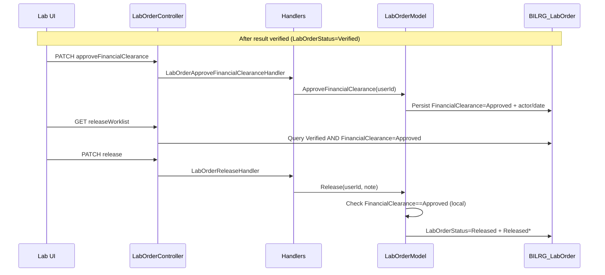
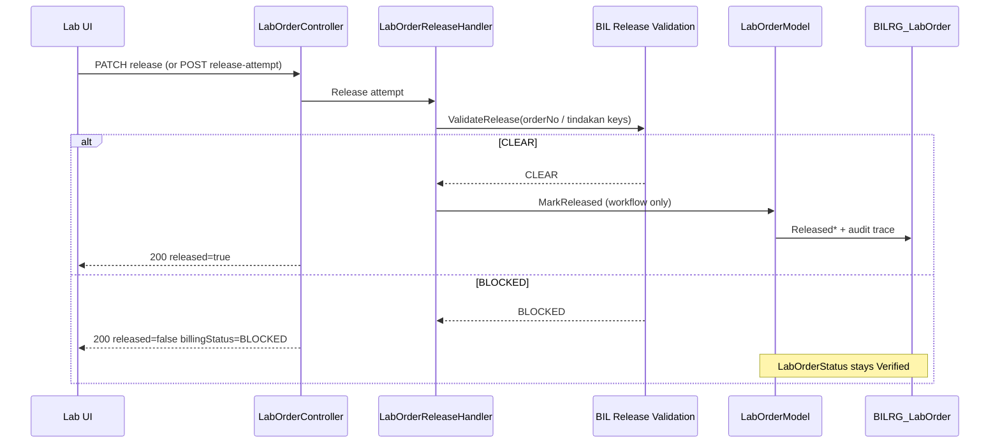

# LAB Financial Clearance — Architecture / Domain Analysis Report

**Scope:** Laboratory Workflow Feature (LWF) — financial clearance and result release  
**Repository state:** Analyzed as of 2026-05-21 (post–M8 slice; pre-release LWF per [`LAB_API_CONTRACT.md`](LAB_API_CONTRACT.md))  
**Canonical decision (external to repo):** Billing authority = **BIL**. LWF asks BIL for release validation, executes release workflow, stores audit/integration trace only.  
**Task type:** Analysis only — **no code, migration, or patch produced.**

---

## 1. Executive Summary

The repository implements **Phase 8 (financial clearance + release)** as a **local approval workflow** owned by the `LabOrder` aggregate. Financial clearance is persisted on `BILRG_LabOrder`, mutated via `ApproveFinancialClearance` / `RejectFinancialClearance`, exposed through dedicated API endpoints, and enforced at release time by reading **cached** `FinancialClearance == Approved`.

**There is no BIL release-validation integration in code.** `ILabBillingIntegration` only supports charge (`CreateTindakan`) with a fake stub. The documented BIL endpoint `GET /api/bil/financial-clearance/{orderNo}` ([`lab-integration.md`](lab-integration.md)) is **not implemented** anywhere in this solution.

**Blocked release is modeled as `InvalidOperationException`**, which surfaces as a failed command (typical HTTP 4xx/5xx via unhandled exception), **not** as canonical operational outcome (`HTTP 200`, `released = false`, `billingStatus = BLOCKED`).

**Documentation is internally split:** [`lab-agent.md`](lab-agent.md) / [`lab-integration.md`](lab-integration.md) state BIL owns billing and LWF “checks financial clearance,” while [`lab-implementation-plan.md`](lab-implementation-plan.md) Open Question #4 explicitly defaults V1 to **manual clearance via LWF commands** — a transitional note that **does not match** the newer canonical CLEAR/BLOCKED model.

**Amendment path amplifies risk:** amending a **Released** order downgrades `LabOrderStatus` to `Recorded` but **retains** `ReleasedDate` / `ReleasedUserId` / `ReleaseNote` and **does not reset** `FinancialClearance`. After re-verification, **release can run again** without re-asking BIL, producing inconsistent release metadata.

**Recommended strategy:** **Hybrid compatibility transition (E)** — not branch abandonment. LWF is unreleased; the wrong model is concentrated in one vertical slice (M8) with clear boundaries. Safest path: add real-time BIL validation on release, introduce operational BLOCKED responses, deprecate approve/reject APIs, migrate persisted columns to audit/trace, and fix amendment/re-release invariants in the same program of work.

---

## 2. Current Ownership Analysis

| Concern | Canonical owner | Current owner in repo | Verdict |
|--------|-----------------|----------------------|---------|
| Financial lifecycle (paid/unpaid/settlement) | BIL | Not in LWF (correct) | OK |
| Release eligibility **truth** | BIL | `LabOrder.FinancialClearance` enum + approval actor/timestamp | **Violation** |
| Approval / reject **workflow** | BIL (or BIL UI) | LWF `ApproveFinancialClearance` / `RejectFinancialClearance` + PATCH endpoints | **Violation** |
| Result release **execution** | LWF | `LabOrder.Release` + `LabOrderReleaseHandler` | OK (execution) |
| Billing charge creation | BIL (via integration) | `ILabBillingIntegration.CreateTindakan` (stub) | OK (orchestration only; BIL not ready) |
| Release audit / integration trace | LWF (non-authoritative snapshot) | `FinancialClearanceDate/UserId/Reason` used as **authority** | **Wrong role** |

**Aggregate responsibility drift:** [`lab-domain.md`](lab-domain.md) and [`lab-agent.md`](lab-agent.md) list `LabOrder` responsibilities as including **“release eligibility”** and store `FinancialClearance` on the aggregate. That conflates **operational release act** (LWF) with **financial gate truth** (BIL).

**Partial alignment:** Domain docs correctly say financial clearance is not payment status and not workflow status — but the **implementation stores it on the order header** and gates `Release()` on it exactly like workflow state.

---

## 3. Financial-Clearance Footprint

### 3.1 Domain layer

| Artifact | Path | Role |
|----------|------|------|
| `FinancialClearanceEnum` | `Bilreg.Domain/LabContext/LabOrderFeature/FinancialClearanceEnum.cs` | `Pending=0`, `Approved=1`, `Rejected=2` |
| `LabOrderModel` | `Bilreg.Domain/LabContext/LabOrderFeature/LabOrderModel.cs` | Properties + `ApproveFinancialClearance`, `RejectFinancialClearance`, `Release` (clearance gate), `ReturnToRecordedAfterResultAmendment` (no clearance reset) |

### 3.2 Application layer

| Artifact | Path | Role |
|----------|------|------|
| `LabOrderApproveFinancialClearanceCmd` / `Handler` | `Bilreg.Application/.../LabOrderApproveFinancialClearanceCmd.cs` | Loads order, calls `ApproveFinancialClearance`, saves |
| `LabOrderRejectFinancialClearanceCmd` / `Handler` | `Bilreg.Application/.../LabOrderRejectFinancialClearanceCmd.cs` | Loads order, calls `RejectFinancialClearance`, saves |
| `LabOrderReleaseCmd` / `Handler` | `Bilreg.Application/.../LabOrderReleaseCmd.cs` | Loads order, calls `Release` (no BIL call) |
| `LabOrderGetQuery` response | `Bilreg.Application/.../LabOrderGetQuery.cs` | Exposes clearance + approval metadata |
| `LabOrderGetByEmrOrderIdQuery` | `Bilreg.Application/.../LabOrderGetByEmrOrderIdQuery.cs` | EMR status includes `FinancialClearance` |
| `ILabOrderWorklistDal` / `LabOrderWorklistView` | `Bilreg.Application/.../ILabOrderWorklistDal.cs` | Worklist projection includes `FinancialClearance` |
| `ILabOrderReleaseWorklistDal` / `LabReleaseView` | `Bilreg.Application/.../ILabOrderReleaseWorklistDal.cs` | Release queue filtered by `FinancialClearance = Approved` |
| `LabOrderReleaseWorklistQuery` | `Bilreg.Application/.../LabOrderReleaseWorklistQuery.cs` | Handler for release worklist |
| `ILabBillingIntegration` | `Bilreg.Application/.../Integration/ILabBillingIntegration.cs` | **Charge only** — no clearance API |

### 3.3 Infrastructure layer

| Artifact | Path | Role |
|----------|------|------|
| `LabOrderDto` / `LabOrderDal` | `Bilreg.Infrastructure/.../LabOrderDto.cs`, `LabOrderDal.cs` | CRUD for clearance columns |
| `LabOrderWorklistDal` | `Bilreg.Infrastructure/.../LabOrderWorklistDal.cs` | Selects `FinancialClearance` |
| `LabOrderReleaseWorklistDal` | `Bilreg.Infrastructure/.../LabOrderReleaseWorklistDal.cs` | SQL `AND o.FinancialClearance = @ClearanceApproved` |
| `LabBillingIntegration` | `Bilreg.Infrastructure/.../LabBillingIntegration.cs` | Fake `TDK-FAKE-xxxx` only |

### 3.4 API layer

| Endpoint | Path | Method |
|----------|------|--------|
| `approveFinancialClearance` | `Bilreg.Api/Controllers/.../LabOrderController.cs` | `PATCH .../approveFinancialClearance` |
| `rejectFinancialClearance` | same | `PATCH .../rejectFinancialClearance` |
| `release` | same | `PATCH .../release` |
| `releaseWorklist` | same | `GET .../releaseWorklist` |
| `GET {orderId}` / worklist | same | Exposes clearance fields |

### 3.5 Persistence

| Artifact | Path |
|----------|------|
| Table `BILRG_LabOrder` columns | `FinancialClearance`, `FinancialClearanceDate`, `FinancialClearanceUserId`, `FinancialClearanceReason`, `ReleasedDate`, `ReleasedUserId`, `ReleaseNote` |
| Base DDL | `Bilreg.SqlDb/LabContext/LabOrderFeature/BILRG_LabOrder.sql` |
| M8 alter script | `Bilreg.SqlDb/LabContext/LabOrderFeature/BILRG_LabOrder_M8_Alter.sql` |

### 3.6 Tests

| Test class | Covers |
|------------|--------|
| `LabOrderModelTest` | Approve/reject/release invariants, amendment from Released |
| `LabOrderM8HandlersTest` | Approve/reject/release handlers |
| `LabOrderDalTest` | Clearance + release column round-trip |
| `LabOrderWorklistDalTest`, `LabCollectionPreparationDalTest` | Fixture includes clearance columns |
| `LabResultAmendHandlerTest` | Amendment does not assert clearance/release reset |

### 3.7 Documentation (non-code)

| Doc | Financial clearance content |
|-----|----------------------------|
| `docs/contexts/lab/lab-domain.md` | §8 — eligibility concept; aggregate lists `FinancialClearance` |
| `docs/contexts/lab/lab-workflow.md` | §8 — “belum approved” blocks release |
| `docs/contexts/lab/lab-agent.md` | §11–12 — `Approved` required; LWF checks clearance |
| `docs/contexts/lab/lab-integration.md` | BIL `GET .../financial-clearance/{orderNo}` |
| `docs/contexts/lab/lab-implementation-plan.md` | M8 slice; `UpdateFinancialClearance`; manual V1; enum `Blocked=2` |
| `docs/contexts/lab/lab-test-scenarios.md` | §12–13 — release blocked via **BIL returns Pending** (canonical-ish) |
| `docs/contexts/lab/LAB_API_CONTRACT.md` | Pre-release; **does not document** approve/reject/release routes yet |

### 3.8 Explicitly absent

- BIL application service / handler for `financial-clearance` in this repo  
- `ILabBillingIntegration` (or similar) **release validation** method  
- Domain/application **events** named `FinancialClearanceApproved` (no event bus usage found)  
- Frontend code in this repository  

---

## 4. Ownership Violations

### 4.1 LWF owns financial approval lifecycle

**Evidence:**

```471:525:Bilreg.Domain/LabContext/LabOrderFeature/LabOrderModel.cs
    public void ApproveFinancialClearance(string userId)
    {
        // ...
        FinancialClearance = FinancialClearanceEnum.Approved;
        FinancialClearanceDate = DateTime.Now;
        FinancialClearanceUserId = userId;
        // ...
    }

    public void RejectFinancialClearance(string reason, string userId)
    {
        // ...
        FinancialClearance = FinancialClearanceEnum.Rejected;
        // ...
    }
```

```104:116:Bilreg.Api/Controllers/LabContext/LabOrderFeature/LabOrderController.cs
    [HttpPatch("approveFinancialClearance")]
    public async Task<IActionResult> ApproveFinancialClearance(...)
    [HttpPatch("rejectFinancialClearance")]
    public async Task<IActionResult> RejectFinancialClearance(...)
```

**Why this violates bounded-context ownership:** Approve/reject encodes **who decided**, **when**, and **persistent eligibility state** inside LWF. That is a billing/finance decision workflow. BIL is the only context that can know receivable status, packages, exemptions, or post-amendment billing changes.

**Canonical replacement:** BIL exposes synchronous release validation (e.g. CLEAR / BLOCKED). LWF may persist **last check trace** (timestamp, correlation id, snapshot code) for audit/UI — not authoritative enum transitions driven by lab staff PATCH commands.

### 4.2 Release authority stored locally and cached

**Evidence:**

```544:546:Bilreg.Domain/LabContext/LabOrderFeature/LabOrderModel.cs
        if (FinancialClearance != FinancialClearanceEnum.Approved)
            throw new InvalidOperationException(
                $"LabOrder {OrderId} memerlukan FinancialClearance Approved untuk release.");
```

```26:43:Bilreg.Infrastructure/LabContext/LabOrderFeature/LabOrderReleaseWorklistDal.cs
        const int clearanceApproved = (int)FinancialClearanceEnum.Approved;
        // ...
              AND o.FinancialClearance = @ClearanceApproved
```

**Violation:** Release eligibility is **read from DB** set earlier by LWF approval, not from BIL at attempt time.

### 4.3 Implementation plan encodes manual LWF ownership (documented drift)

[`lab-implementation-plan.md`](lab-implementation-plan.md) Open Question #4: *“Financial clearance is manually updated in V1 through administrative command/use-case.”* That documents the **current code path** but conflicts with the **canonical decision** described in this analysis task.

---

## 5. Semantic Drift Findings

| Drift | Where | Problem |
|-------|-------|---------|
| **Approved / Rejected** vs **CLEAR / BLOCKED** | `FinancialClearanceEnum`, handlers, tests | “Approved” implies LWF/finance **granted permission**; canonical BLOCKED is **operational outcome** at release attempt, not a stored approval workflow terminal state |
| **Rejected** vs **Blocked** | Enum value `Rejected=2`; plan appendix says `Blocked=2` | Naming mismatch between code (`Rejected`) and plan appendix (`Blocked`) — integration hazard |
| **ApproveFinancialClearance** / **RejectFinancialClearance** | Domain + API route names | Reads as **authority verbs** owned by lab API; should be BIL-side or removed |
| **FinancialClearanceUserId / Date / Reason** | DB + DTOs | Semantics of **approval actor** in LWF; canonical model stores **release validation trace**, not finance approver on lab order |
| **releaseWorklist** SQL filter | `LabOrderReleaseWorklistDal` | Queue means “already approved in LWF”; canonical UX may be “verified, pending BIL check on release click” |
| **Exception on block** | `Release()` throws if not Approved | Canonical: BLOCKED is **not** validation error; HTTP 200 + `released=false` |
| **UpdateFinancialClearance(status)** | `lab-implementation-plan.md` §5.2 | Doc mentions generic update; code uses approve/reject methods — doc/code skew |
| **lab-test-scenarios §13** | BIL returns Pending, status stays Verified | **Target behavior**; implementation throws on release without prior approve |
| **lab-integration HTTP path** | `GET /api/bil/financial-clearance/{orderNo}` | Documented as HTTP; [`lab-implementation-plan.md`](lab-implementation-plan.md) forbids HTTP **between LWF and BIL inside solution** — should be `ILabBillingIntegration` in-process call |

---

## 6. Release Workflow Analysis

### 6.1 Actual current sequence



**Characteristics:**

- **Two-step** human process: approve clearance, then release  
- **No BIL** participation at release  
- **Eligibility cached** in `FinancialClearance` column  
- **Failure:** `InvalidOperationException` → failed PATCH (see tests: `*Approved*`, `*Released*`)

### 6.2 Canonical target sequence



### 6.3 Gap analysis

| Area | Current | Target | Gap |
|------|---------|--------|-----|
| Validation timing | On prior approve + at release (local enum) | Real-time at release | **High** |
| BIL integration | None for clearance | `ILabBillingIntegration.ValidateRelease` (name TBD) | **High** |
| BLOCKED semantics | Exception | Operational 200 response | **High** |
| Approve/reject endpoints | Exist | Removed or BIL-only | **High** |
| Worklist | Pre-approved only | Verified + release action | **Medium** |
| Audit | Approval actor on order | Last BIL check trace | **Medium** |

---

## 7. Amendment / Revalidation Analysis

### 7.1 What happens today

`LabResultAmendHandler` ([`LabResultAmendCmd.cs`](../../../src/bilreg/Bilreg.Application/LabContext/LabResultFeature/UseCases/LabResultAmendCmd.cs)):

- Allowed when order is **Verified** or **Released**
- Calls `order.ReturnToRecordedAfterResultAmendment` → sets `LabOrderStatus = Recorded`
- Does **not** modify `FinancialClearance`, `ReleasedDate`, `ReleasedUserId`, or `ReleaseNote`

**Test explicitly accepts stale release metadata:**

```429:438:Bilreg.Test/LabContext/LabOrderFeature/LabOrderModelTest.cs
    public void ReturnToRecordedAfterResultAmendment_FromReleased_SetsRecorded()
    {
        // ... Release ...
        order.ReturnToRecordedAfterResultAmendment("UAMEND");
        order.LabOrderStatus.Should().Be(LabOrderStatusEnum.Recorded);
        order.ReleasedUserId.Should().Be("REL1");  // unchanged
    }
```

### 7.2 Re-verify and re-release

After amend → `Recorded`, user can `LabResultVerify` → `MarkVerified` → `Verified` again.

`FinancialClearance` remains **Approved** (stale vs BIL reality).

`Release()` only checks `LabOrderStatus != Released` — **not** prior `ReleasedDate`. So **second release is allowed**, overwriting release metadata.

### 7.3 Canonical violation summary

| Issue | Severity |
|-------|----------|
| Stale cached approval after amend | **High** — bypasses BIL revalidation |
| Released metadata orphaned while status Recorded/Verified | **High** — audit/reporting corruption |
| Double release possible | **High** — “release is final” invariant broken in practice |
| Amend from Released without BIL notification | **Medium** — BIL may still think result was released |

**Conclusion:** Amendment workflow **already violates** canonical release semantics, independent of BIL integration maturity.

---

## 8. API Contract Impact

### 8.1 Affected endpoints

| Route | Current contract | Risk |
|-------|------------------|------|
| `PATCH .../approveFinancialClearance` | Body: `orderId`, `userId`; 200 `"Done"` | Frontend may build finance queue on this — **remove/replace** |
| `PATCH .../rejectFinancialClearance` | Body: `orderId`, `userId`, `reason` | Same |
| `PATCH .../release` | 200 on success; **exception** if pending clearance | **Breakage** when switching to 200 + `released:false` |
| `GET .../releaseWorklist` | Returns only pre-approved orders | Filter semantics change |
| `GET .../{orderId}` | Full clearance + approval fields | Field rename/semantic change (`billingStatus` vs `financialClearance`) |
| `GET .../worklist` | Includes `FinancialClearance` int | UI gates actions on enum — **coupling** |
| `GET .../byEmrOrderId/{emrOrderId}` | EMR sees `FinancialClearance` | EMR may misinterpret as BIL truth |

### 8.2 HTTP status usage

| Scenario | Current (typical) | Canonical |
|----------|-------------------|-----------|
| Release blocked (financial) | `InvalidOperationException` → error response | **HTTP 200**, payload indicates not released |
| Release success | HTTP 200 `"Done"` | HTTP 200 + `released: true` |
| BIL transport/infra failure | N/A today | Distinct from BLOCKED (likely 503/502 or structured error — **needs explicit rule**; not same as BLOCKED) |

[`LAB_API_CONTRACT.md`](LAB_API_CONTRACT.md) does not yet document release/clearance routes — **low backward-compat constraint** if contract is updated before frontend integration.

### 8.3 Alignment with test scenarios

[`lab-test-scenarios.md`](lab-test-scenarios.md) §13 (*BIL returns Pending*, status stays Verified) matches **canonical** behavior, not current throws-after-verify-without-approve behavior.

---

## 9. Persistence Impact

### 9.1 Columns (BILRG_LabOrder)

| Column | Current role | Classification |
|--------|--------------|----------------|
| `FinancialClearance` | Authority enum | **Replace** → trace/snapshot only, or drop after transition |
| `FinancialClearanceDate` | Approval timestamp | **Transform** → `LastBillingCheckAt` or similar |
| `FinancialClearanceUserId` | LWF approver | **Deprecate** — misleading post-canonical |
| `FinancialClearanceReason` | Reject reason | **Deprecate** or map to last BLOCKED reason from BIL |
| `ReleasedDate` / `ReleasedUserId` / `ReleaseNote` | LWF release act | **Preserve** — operational truth |

### 9.2 Indexes

No index on `FinancialClearance` today. Release worklist filters `LabOrderStatus` + `FinancialClearance` — any new access pattern (Verified-only queue) should be revisited if volume warrants.

### 9.3 Migration implications (analysis only)

| Action | Notes |
|--------|-------|
| **Removable** (after transition) | Authority meaning of `FinancialClearance` as approve/reject; dependency in `LabOrderReleaseWorklistDal` filter |
| **Replaceable** | Enum stored on order → last BIL response code + check time |
| **Transformable** | Historical rows: `Approved` could map to “legacy manual approval” in reports |
| **Must preserve for history** | `Released*` columns; audit trail; existing `Approved` rows for orders already released |

**Do not run migration in this task.**

---

## 10. Frontend Coupling Risk

No frontend exists in this repo. Coupling risk is **contractual**:

| Risk | Cause | Mitigation |
|------|-------|------------|
| Two-step UX (approve then release) | Separate PATCH endpoints | Single release-attempt action with inline BLOCKED handling |
| Enum-driven action buttons | `financialClearance` on GET/worklist | Drive off `labOrderStatus` + release-attempt response, not cached enum |
| Error toast on blocked release | Exception-based API | Teach UI: BLOCKED = normal branch, not error |
| Finance worklist in lab app | `approveFinancialClearance` | Move to BIL module; lab UI only shows last check hint |
| EMR status misread | `LabOrderEmrStatusResponse.FinancialClearance` | Expose BIL-sourced snapshot or remove field from EMR contract |

[`lab-implementation-plan.md`](lab-implementation-plan.md) §13 explicitly ties UI actions to `FinancialClearance` — **high coupling risk** if frontend follows plan before this refactor.

---

## 11. Recommended Reimplementation Strategy

**Choice: E — Hybrid compatibility transition** (with selective rewrite of M8 slice internals)

| Option | Fit for this repo | Rationale |
|--------|-------------------|-----------|
| A Incremental refactor | Partial | Good if phased with feature flags; insufficient alone without contract change |
| B Selective rewrite | Partial | Release handler + domain gate deserve rewrite; not whole Lab context |
| C Branch abandonment | **Poor** | M8 is cohesive; unreleased product; cost >> benefit |
| D Compatibility transition | Partial | Needed for enum/API/DB |
| **E Hybrid** | **Best** | Phased: BIL validation → operational response → deprecate approve/reject → schema trace → amendment fix |

**Why not C:** Wrong ownership is **localized** (~15 production files + tests). Master-test and result slices are independent. No widespread BIL clearance spillover into PaymentContext.

**Prerequisites:** BIL must expose in-process validation (per integration plan: no HTTP inside solution). Stub can return CLEAR/BLOCKED for dev until real BIL logic exists.

---

## 12. Refactor Map

### 12.1 Remove

| Component | Notes |
|-----------|-------|
| `LabOrderApproveFinancialClearanceCmd` / Handler | After transition period |
| `LabOrderRejectFinancialClearanceCmd` / Handler | After transition period |
| `LabOrderModel.ApproveFinancialClearance` / `RejectFinancialClearance` | Domain approval workflow |
| Controller routes `approveFinancialClearance`, `rejectFinancialClearance` | API surface |
| `LabOrderM8HandlersTest` approve/reject tests | Replace with BIL-mock release tests |
| Release worklist filter on `FinancialClearance = Approved` | Replace with Verified (+ optional “not released”) |

### 12.2 Rename / reshape

| From | To (conceptual) |
|------|-----------------|
| `FinancialClearanceEnum.Approved/Rejected` | BIL-facing `ReleaseValidationCode` CLEAR/BLOCKED; LWF trace optional |
| `FinancialClearanceUserId` | `LastBillingCheckCorrelation` or remove |
| `PATCH release` response | Structured `LabOrderReleaseResult` (`released`, `billingStatus`, `message`) |
| `ILabBillingIntegration` | Add `ValidateReleaseForLabOrder(...)` (name per NAMING.md) |

### 12.3 Preserve

| Component | Notes |
|-----------|-------|
| `LabOrder.Release` operational transition | Rewrite guard logic, not delete |
| `ReleasedDate` / `ReleasedUserId` / `ReleaseNote` | Operational delivery audit |
| `LabOrderReleaseHandler` structure | MediatR + repo pattern stays |
| Charge flow `LabOrderChargeCmd` + `CreateTindakan` | Orthogonal slice |
| Verification / amend versioning | Keep; fix amend side-effects |

### 12.4 Rewrite

| Component | Notes |
|-----------|-------|
| `LabOrderReleaseHandler` | Call BIL, map CLEAR/BLOCKED, no exception for BLOCKED |
| `LabOrderModel.Release` | Remove cached enum gate; optional “already released” guard only |
| `LabOrderReleaseWorklistDal` | Verified orders eligible for release attempt |
| `ReturnToRecordedAfterResultAmendment` | Clear or supersede release metadata; invalidate billing trace |
| `LabBillingIntegration` | Implement validation stub + future real BIL |

### 12.5 Contracts to adapt

| Contract | Change |
|----------|--------|
| `LabOrderGetResponse` | Replace authority enum with `lastBillingCheck*` or remove |
| `LabOrderEmrStatusResponse` | Do not expose LWF-local approval as finance truth |
| `LAB_API_CONTRACT.md` | Document release-attempt response (pre-release allowed) |
| `lab-agent.md` §11–12 | Remove `Approved` requirement; document BIL check |
| `lab-implementation-plan.md` Open Q #4 | Mark superseded by BIL validation |

### 12.6 Schema to deprecate

- `FinancialClearance` as authority (post-migration: nullable trace or dropped)
- `FinancialClearanceUserId` as approver

### 12.7 Tests to rewrite

| Test area | Focus |
|-----------|-------|
| `LabOrderModelTest` | Release blocked → no throw in handler layer; amend clears stale release |
| `LabOrderM8HandlersTest` | BIL mock CLEAR/BLOCKED |
| Integration tests | Release worklist SQL predicates |
| `lab-test-scenarios.md` alignment | §13 as acceptance criteria |

---

## 13. Technical Debt

Remaining debt **after** ownership correction:

| Debt | Description |
|------|-------------|
| Dual documentation | Plan says manual V1; agent says BIL checks — reconcile |
| Enum numbering | `Rejected=2` vs planned `Blocked=2` — stable enum policy vs rename |
| Amendment / release finality | Must be designed explicitly (re-release policy) |
| EMR exposure of clearance | Risk of cross-context leakage |
| Worklist duplication | General worklist + release worklist with different filters |
| No distinction infra failure vs BLOCKED | Needs contract for BIL down vs business block |
| Historical data | Legacy `Approved` rows without BIL audit trail |
| `lab-integration.md` HTTP example | Update to in-process integration service |

---

## 14. Risk Assessment

| Risk | Likelihood | Impact | Mitigation |
|------|------------|--------|------------|
| Frontend built on approve/reject | Medium | High | Document contract early; pre-release freeze |
| BLOCKED treated as error in UI | High | High | Contract + UX spec in LAB_API_CONTRACT |
| Stale approval after amend | **Already present** | High | Fix in same release as BIL validation |
| Double release after amend | **Already present** | High | Reset release metadata or forbid re-release without policy |
| BIL not ready | High | Medium | Stub validation; feature flag |
| Migration conflates Approved with CLEAR | Medium | Medium | Legacy flag column or one-time backfill script (later) |
| Regression in M8 tests | Medium | Low | Rewrite tests with BIL mock |
| Merge conflict on M8 files | Medium | Medium | Single owner slice; short-lived branch |

---

## 15. Recommended Execution Order

1. **Freeze contract** — Update [`LAB_API_CONTRACT.md`](LAB_API_CONTRACT.md) with target release-attempt response (200 + `released` + `billingStatus`), deprecate approve/reject.  
2. **BIL boundary** — Add `ValidateRelease` to `ILabBillingIntegration` + stub (CLEAR/BLOCKED scenarios).  
3. **Release handler rewrite** — Real-time BIL call; operational BLOCKED; persist trace + conditional `Release()`.  
4. **Domain invariant fix** — Amendment: clear `Released*` or block re-release; reset billing trace on amend from Released/Verified.  
5. **Deprecate approve/reject** — Remove endpoints after stub period (or 410 with message if needed).  
6. **Worklist / GET projections** — Stop filtering on cached Approved; adjust DTOs.  
7. **Tests** — Align with [`lab-test-scenarios.md`](lab-test-scenarios.md) §12–13.  
8. **Schema migration** (separate task) — Transform columns to audit-only; preserve history.  
9. **Doc sweep** — `lab-agent`, `lab-domain`, `lab-implementation-plan` appendix enum, `lab-integration` in-process wording.

---

## Appendix A — Occurrence Classification Summary

| Class | Meaning | Count (representative) |
|-------|---------|-------------------------|
| **A Canonical / Safe** | Charge integration stub; release execution concept; docs saying BIL owns billing | Few |
| **B Mixed responsibility** | GET/worklist exposing clearance; release handler structure; docs §8 eligibility | Several |
| **C Wrong ownership** | Approve/reject, enum authority, SQL filter, PATCH endpoints | **Majority of M8** |
| **D Legacy obsolete** | `BILRG_LabOrder_M8_Alter.sql` (one-time); plan `UpdateFinancialClearance`; manual V1 note | Docs + migration script |
| **E Uncertain** | Whether `Rejected` should map to BLOCKED for UI; EMR field retention | Policy decisions |

---

## Appendix B — Key Code References

**Enum (authority model):**

```3:8:Bilreg.Domain/LabContext/LabOrderFeature/FinancialClearanceEnum.cs
public enum FinancialClearanceEnum
{
    Pending = 0,
    Approved = 1,
    Rejected = 2
}
```

**Release gate (cached approval):**

```544:546:Bilreg.Domain/LabContext/LabOrderFeature/LabOrderModel.cs
        if (FinancialClearance != FinancialClearanceEnum.Approved)
            throw new InvalidOperationException(
                $"LabOrder {OrderId} memerlukan FinancialClearance Approved untuk release.");
```

**Release handler (no BIL):**

```20:28:Bilreg.Application/LabContext/LabOrderFeature/UseCases/LabOrderReleaseCmd.cs
        var order = _labOrderRepo.LoadEntity(request).GetValueOrThrow(...);
        order.Release(request.UserId, request.ReleaseNote);
        _labOrderRepo.SaveChanges(order);
```

**Billing integration (charge only):**

```10:12:Bilreg.Application/LabContext/LabOrderFeature/Integration/ILabBillingIntegration.cs
public interface ILabBillingIntegration
{
    string CreateTindakan(LabBillingChargeRequest request);
}
```

---

*End of report.*
