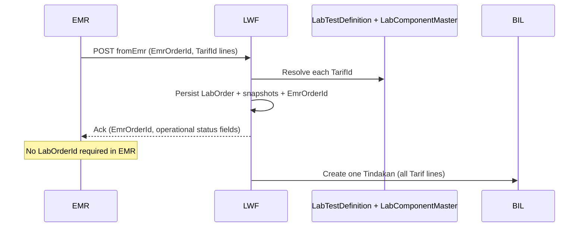

# LAB_MASTER_TEST_IMPLEMENTATION_PLAN.md — Laboratory Master & LabTest Definition

> **Status:** Design + implementation planning only — **no code, migrations, or API implementation** in this document.  
> **Revision:** 1.2 — terminology, naming, ID format, pre-release contract simplification (architecture unchanged)  
> **Canonical location:** `docs/contexts/lab/LAB_MASTER_TEST_IMPLEMENTATION_PLAN.md`  
> **Audience:** Backend developers, product owners  
> **Related:** [`lab-domain.md`](lab-domain.md), [`lab-workflow.md`](lab-workflow.md), [`lab-integration.md`](lab-integration.md), [`lab-agent.md`](lab-agent.md), [`lab-implementation-plan.md`](lab-implementation-plan.md), [`LAB_API_CONTRACT.md`](LAB_API_CONTRACT.md)  
> **Skills (when implementing):** [`docs/skills/feature-model-generation.md`](../../skills/feature-model-generation.md), [`docs/skills/feature-persistence-generation.md`](../../skills/feature-persistence-generation.md)

**Pre-release note:** LWF has **not** been released. This plan assumes **no** backward compatibility, dual APIs, or migration-period contracts. Implement **one** authoritative shape per endpoint.

**API documentation:** [`LAB_API_CONTRACT.md`](LAB_API_CONTRACT.md) is an **evolving** implementation-aligned artifact during pre-release. Backend owns the contract; update the contract doc when endpoints change — do not treat it as a frozen public specification.

---

## Executive Summary

The current LWF (Laboratory Workflow Feature) backend is **workflow-complete** but **master-incomplete**. Orders and results persist **snapshots only**, with structure supplied ad hoc by EMR and free-form at result entry. There is no authoritative **`LabComponentMaster`**, no **`LabTestDefinition`** (Tarif → component set + operational metadata), and no persistent Tarif ↔ lab-test mapping.

This plan introduces three master layers:

| Entity | Owner | Mutability |
|--------|-------|------------|
| `LabComponentMaster` | Product / vendor | Hospital cannot edit; full seed replace on release |
| `LabTestDefinition` | LWF (hospital-configurable) | Hospital admin |
| `LabTestComponent` | LWF (child of `LabTestDefinition`) | Hospital admin |

**Operational rule:** In LWF, a **lab test** (short: **LabTest**) means **`LabTestDefinition`** = Tarif mapping + `LabTestComponent` set + specimen/operational metadata — **not** a single analyte and **not** a software/QA “test.”

**Terminology for AI-safe docs and code:**

| Use | Avoid |
|-----|-------|
| `LabComponentMaster`, `LabTestDefinition`, `LabTestComponent`, `LabTest` (short) | Bare **Test**, bare **Master**, bare **Definition** |

**Non-negotiables preserved:**

- Immutable snapshot on `LabOrderItem`, `LabOrderItemComponent`, `LabResultItem` (per version)
- LWF = workflow authority; BIL = billing authority
- No database FK constraints; application-enforced logical relationships
- **Workflow-first** — LOINC optional metadata only; analyzer/HL7/FHIR are **deferred**, not drivers

### Stabilization principles (implementation restart)

| Principle | Rule |
|-----------|------|
| **`LabOrderItemComponent`** | Snapshot persistence only — not aggregate, not CRUD feature, no workflow behaviour |
| **Result structure** | **Server-owned** from `LabOrderItemComponent`; **values only** from client |
| **EMR contract** | `EmrOrderId` + `TarifId` (+ optional `TarifName`) per line — LWF resolves specimen, vacutainer, components |
| **External identity** | EMR owns `EmrOrderId`; status lookup by `EmrOrderId` — do **not** require EMR to store internal `LabOrderId` |
| **Billing target** | 1 LWF order → 1 BIL Tindakan transaction → many Tarif lines (do not model 1 order → many Tindakan) |
| **LOINC / OWR** | Optional / backlog — workflow correctness is primary |

```text
Result structure: server generates → client edits values only
NOT: client sends structure → server reconciles
```

---

## 1. Problem Analysis

### 1.1 Current architectural state (as implemented)

LWF today implements:

- **`LabOrderModel`** — workflow lifecycle, patient snapshot, billing orchestration hook, OWR queue
- **`LabOrderItemModel`** — per-line snapshot including EMR-supplied `TestId`, `TestCode`, `TestName`, Tarif fields, vacutainer/specimen (to be **removed from EMR contract**)
- **`LabResultDocumentModel`** + **`LabResultItemModel`** — versioned result with free-form component lines

**Order creation (`LabOrderCreateFromEmrCmd`)** today accepts structure from EMR. Target: **replace** with Tarif-only lines + `EmrOrderId`; LWF resolves all lab structure.

**Result recording (`LabResultRecordCmd`)** accepts arbitrary component lists. Target: **server-owned structure**, values-only client input.

**Persistence** — no `LabComponentMaster`, no `LabTestDefinition`, no `TestDefinitionId` on order items, no `LabOrderItemComponent` table.

**Billing (`ILabBillingIntegration`)** is stubbed. Target charge model: **one Tindakan per LWF order** containing **all Tarif lines** (future BIL shape — do not entrench “one Tindakan per line” in LWF design).

### 1.2 Why snapshot-only structure is insufficient

| Gap | Consequence |
|-----|-------------|
| No `LabComponentMaster` | Same analyte under different codes/names |
| No `LabTestDefinition` | Same Tarif maps to different panels per site |
| EMR sends lab structure | Catalog drift; rework on every EMR change |
| Free-form result lines | Weak validation and flagging |
| No Tarif ↔ `LabTestDefinition` | Billing Tarif disconnected from lab work |

Snapshots remain **mandatory for history**; masters are **mandatory for operational template**.

### 1.3 Operational risks

- Collection prep uses EMR-supplied tube/specimen instead of `LabTestDefinition`.
- EMR may omit panel components; LWF cannot scaffold results.
- Amendment without server-owned structure allows panel drift between versions.

### 1.4 Billing risks

- BIL owns Tarif and Tindakan authority.
- Without `LabTestDefinition` per `TarifId`, LWF cannot fail fast at order create.
- **Future BIL:** single Tindakan transaction per order with multiple Tarif detail lines — LWF must not assume multiple Tindakan headers per order.

### 1.5 Code stability risks (workflow-first)

- Unstable `ComponentCode` on snapshots breaks worklists and PDF consistency.
- OWR matching on free-form codes is unreliable until server-owned structure exists (Phase 4+).

### 1.6 Result consistency risks

- Free-form entry breaks auto-flagging and pathologist review consistency.

### 1.7 Audit conclusion (target state)

| Capability | Current | Target |
|------------|---------|--------|
| `LabComponentMaster` | No | Vendor full-seed |
| `LabTestComponent` set per `LabTestDefinition` | No | Hospital config |
| Tarif ↔ `LabTestDefinition` | No | Persistent |
| EMR sends lab structure | Yes | **Tarif lines + `EmrOrderId` only** |
| LWF resolves & snapshots | No | At order create |
| EMR uses internal `LabOrderId` | Possible | **`EmrOrderId` only externally** |

---

## 2. New Domain Model

### 2.1 Terminology (AI-safe)

| Term | Meaning in LWF |
|------|----------------|
| **Lab component** | Single observable — `LabComponentMaster` |
| **Lab test** / **LabTest** | Operational package — `LabTestDefinition` + `LabTestComponent` children |
| **Lab order item** | One resolved `LabTestDefinition` line on `LabOrder` — snapshot at order time |
| **Lab result item** | One component line on `LabResultDocument` — snapshot at scaffold time |

Do **not** use bare “test” in domain docs, DTO names, or examples without `Lab` prefix.

### 2.2 LabComponentMaster

**Purpose:** Vendor-owned standardized observation catalog.

**Ownership:** Product / vendor. **No** hospital API mutations.

**Lifecycle:** Updated only via publish pipeline — **full table replace** (see §9).

**ID:** `ComponentId` `VARCHAR(7)` — format `MLC` + 4 uppercase hex (e.g. `MLC0001`, `MLC00AF`). Deterministic sequential allocation in seed tooling.

**Responsibilities:** `ComponentCode`, `ComponentName`, `ResultType`, `DefaultUnit`, optional `LoincCode` (metadata only), `IsSystem`, `IsActive`.

**Domain type:** `LabComponentMasterModel` — read-only; no hospital behaviour methods.

**Not responsible for:** panel membership, hospital reference-range policy, billing, workflow.

### 2.3 LabTestDefinition

**Purpose:** Hospital-operational **lab test** definition bound to BIL `TarifId`.

**Ownership:** LWF / hospital lab admin.

**ID:** `TestDefinitionId` `VARCHAR(7)` — format `LTD` + 4 uppercase hex (e.g. `LTD0001`).

**Responsibilities:**

- `TarifId` (+ cached `TarifCode` / `TarifName` for admin UI)
- `LabTestCode`, `LabTestName` (operational names on order snapshot — avoid ambiguous `TestCode` in new code)
- `SpecimenType`, `VacutainerType` — **resolved by LWF**, not EMR
- `IsActive`

**Invariants:** One active `LabTestDefinition` per `TarifId`; ≥1 `LabTestComponent` when active; all components reference active `LabComponentMaster`.

### 2.4 LabTestComponent

**Purpose:** Child rows: which `LabComponentMaster` entries belong to a `LabTestDefinition`, sequence, overrides.

**Ownership:** Part of `LabTestDefinitionModel` aggregate — bulk replace on save.

| Field | Role |
|-------|------|
| `TestDefinitionId` | Parent `LTDxxxx` |
| `ComponentId` | `MLCxxxx` |
| `SequenceNo` | Server-owned display order |
| `ReferenceRangeOverride` | Text only in V1 |
| `RequiredFlagging`, `IsMandatory` | Validation / flagging |

### 2.5 Aggregate boundaries (unchanged)

```text
LabComponentMasterModel   — read catalog (vendor seed)
LabTestDefinitionModel    — aggregate root
  └── LabTestComponentModel
LabOrderModel             — workflow aggregate (separate)
LabResultDocumentModel    — result aggregate (separate)
```

Masters are consumed at **order create** and **result scaffold** time, then **snapshotted**.

### 2.6 `LabOrderItem` and `LabOrderItemComponent`

**`LabOrderItemModel` (Phase 3):**

- Snapshots resolved `LabTestDefinition`: `TestDefinitionId` (`LTDxxxx`), `LabTestCode`, `LabTestName`, Tarif snapshot, specimen/vacutainer from definition
- **Remove** EMR authority over `TestId`, `TestCode`, `TestName`, tube/specimen fields on create

**`LabOrderItemComponent` — lightweight snapshot child only:**

```text
LabOrderItemComponent is:
  - snapshot persistence structure only
  - NOT an aggregate
  - NOT a workflow entity
  - NOT a CRUD feature
  - NOT an independent lifecycle object
```

It exists to:

- preserve expected component structure at order time,
- support **server-generated** result scaffold (Phase 4),
- support immutable historical rendering,
- optional future analyzer alignment from stable snapshotted codes.

**Implementation:** plain record + table; `LabOrderRepo` delete+bulk-insert with order; **no** `LabOrderItemComponentFeature`, handlers, or public mutation APIs.

**`LabResultItemModel` (Phase 4):** Structure from `LabOrderItemComponent`; client supplies **values only**.

### 2.7 `EmrOrderId` on `LabOrder`

| Field | Ownership |
|-------|-----------|
| `EmrOrderId` | EMR supplies; LWF persists; **external** correlation key |
| `OrderId` / `OrderNo` | LWF internal/operational (worklist, OWR, lab UI) — **not** returned as EMR integration dependency |

**Status lookup (EMR):** `GET` by `EmrOrderId` → workflow/result summary. Avoid bidirectional ID sync.

---

## 3. Data Ownership Analysis

| Data | Owner | LWF role |
|------|-------|----------|
| **Tarif** | **BIL** | Reference `TarifId`; cache labels on `LabTestDefinition` |
| **`LabTestDefinition`** | **LWF** | Operational lab-test authority |
| **`LabComponentMaster`** | **Vendor** | Read-only; full seed replace |
| **`EmrOrderId`** | **EMR** | Stored on `LabOrder`; lookup key for EMR |
| **Lab order/result snapshots** | **LWF** | Historical SOt after capture |
| **Tindakan / payment** | **BIL** | One Tindakan per order (multi-Tarif lines inside) |
| **Patient** | **REG** | Snapshot on order |
| **OWR transport** | **OWR** | Async; not SOt |

```text
EMR ── EmrOrderId + TarifId[] ──► LWF ── resolve LabTestDefinition ──► snapshots
                                      ├──► BIL (1 Tindakan, N Tarif lines)
                                      └──► OWR (async, internal OrderNo)
```

---

## 4. LOINC (optional metadata only)

- `LoincCode` nullable on `LabComponentMaster` — **not** validated, **not** workflow driver.
- **Do not** plan terminology server, HL7/FHIR export, or analyzer mapping in Phases 1–4.
- Operational identifier: **`ComponentCode`** on snapshots.

---

## 5. Database Design Plan

### 5.1 Naming and grouping

- Prefix **`BILRG_`**, PascalCase columns, **no SQL FK constraints**.
- Master/config tables use **`Lab*`** prefix for SSMS/tool alphabetical grouping:
  - `BILRG_LabComponentMaster`
  - `BILRG_LabTestDefinition`
  - `BILRG_LabTestComponent`
- **ID lengths:** `LabComponentMaster` and `LabTestDefinition` roots use **`VARCHAR(7)`** (`MLCxxxx`, `LTDxxxx`). Existing `LabOrder` / `LabResult` roots may retain current internal IDs; logical refs to master use `VARCHAR(7)`.

### 5.2 `BILRG_LabComponentMaster`

| Column | Type | Notes |
|--------|------|-------|
| `ComponentId` | VARCHAR(7) PK | `MLC` + 4 hex |
| `LoincCode` | VARCHAR(20) | Optional metadata |
| `ComponentCode` | VARCHAR(30) | Unique among active |
| `ComponentName` | VARCHAR(120) | |
| `ResultType` | INT | |
| `DefaultUnit` | VARCHAR(30) | |
| `IsSystem` | BIT | |
| `IsActive` | BIT | |
| Audit + void | per DATABASE.md | |

**Indexes:** `IX_LabComponentMaster_Code`, `IX_LabComponentMaster_Active`.

### 5.3 `BILRG_LabTestDefinition`

| Column | Type | Notes |
|--------|------|-------|
| `TestDefinitionId` | VARCHAR(7) PK | `LTD` + 4 hex |
| `TarifId` | VARCHAR(12) | BIL logical ref |
| `TarifCode` | VARCHAR(20) | Cached |
| `TarifName` | VARCHAR(100) | Cached |
| `LabTestCode` | VARCHAR(20) | |
| `LabTestName` | VARCHAR(100) | |
| `SpecimenType` | VARCHAR(30) | |
| `VacutainerType` | INT | |
| `IsActive` | BIT | |
| Audit + void | | |

### 5.4 `BILRG_LabTestComponent`

| Column | Type | Notes |
|--------|------|-------|
| `TestDefinitionId` | VARCHAR(7) | PK part 1 |
| `SequenceNo` | INT | PK part 2 |
| `ComponentId` | VARCHAR(7) | `MLCxxxx` |
| `ReferenceRangeOverride` | VARCHAR(200) | |
| `RequiredFlagging` | BIT | |
| `IsMandatory` | BIT | |

### 5.5 `BILRG_LabOrder` (alter — Phase 3)

| Column | Purpose |
|--------|---------|
| `EmrOrderId` | VARCHAR — EMR correlation; indexed for lookup |

### 5.6 `BILRG_LabOrderItem` (replace shape — Phase 3)

| Column | Purpose |
|--------|---------|
| `TestDefinitionId` | `LTDxxxx` snapshot |
| `LabTestCode`, `LabTestName` | From definition |
| Tarif snapshot columns | From definition cache |
| Specimen/vacutainer | From definition — **not EMR** |
| Drop EMR-driven `TestId` / ambiguous test fields from contract | |

### 5.7 `BILRG_LabOrderItemComponent`

Persistence-only child; PK `(OrderId, ItemNo, ComponentNo)`; `ComponentId` `VARCHAR(7)`; snapshot code/name/unit/range/`SequenceNo`/`IsMandatory`.

### 5.8 `BILRG_LabResultItem` (Phase 4)

Add `ComponentId` `VARCHAR(7)`, `SequenceNo` — copied at scaffold generation.

### 5.9 Snapshot strategy

| Event | Action |
|-------|--------|
| Order create | Write `LabOrderItem` + `LabOrderItemComponent` once; immutable |
| Result scaffold | Server builds `LabResultItem` from order component snapshots |
| Result save | Client **values** only; reject unknown/extra/missing mandatory keys |
| Amendment | New version; server regenerates structure from order snapshots |

**Forbidden:** client-defined structure; merge/reconciliation engines; joins to `BILRG_LabComponentMaster` for historical PDF.

---

## 6. Backend Architecture Plan

### 6.1 Feature folders

```text
LabComponentMasterFeature/   — LabComponentMasterModel (read)
LabTestDefinitionFeature/    — LabTestDefinitionModel + LabTestComponentModel
LabOrderFeature/             — ILabTestResolutionService; LabOrderRepo + item components
```

No `LabMasterFeature`, no `MasterLabComponent*`, no `ILabOrderItemComponentRepo`.

### 6.2 Aggregates

| Model | Role |
|-------|------|
| `LabComponentMasterModel` | Read-only catalog |
| `LabTestDefinitionModel` | Config aggregate |
| `LabOrderItemComponentModel` | **Not aggregate** — snapshot child |
| `LabOrderModel` | Workflow — `CreateFromEmr(...)` with resolution |
| `LabResultDocumentModel` | Server scaffold + value validation |

### 6.3 Repositories

| Interface | Role |
|-----------|------|
| `ILabComponentMasterRepo` | List/load — no hospital save |
| `ILabTestDefinitionRepo` | CRUD aggregate |
| `ILabOrderRepo` | Order + items + item components |
| `ILabTestResolutionService` | `ResolveByTarifIds` → order factory DTO |

### 6.4 Resolver input (EMR)

```text
EmrOrderId
Items[]: { TarifId, TarifName? }
Patient snapshot fields (unchanged)
```

LWF resolves: `LabTestDefinition`, `LabTestComponent` expansion, specimen, vacutainer, component snapshots.

### 6.5 Billing orchestration

| Current (stub) | Target |
|----------------|--------|
| Charge by internal order id only | Pass **all Tarif lines** for one Tindakan creation |
| — | Store single `BillingTindakanId` on order header |
| — | **Do not** design for N Tindakan per order |

Stub implementation is temporary; domain handlers should not assume one-Tindakan-per-line.

### 6.6 OWR (deferred)

Not Phase 1–4. Existing payload unchanged until optional enrichment backlog.

---

## 7. Order Flow Design

### 7.1 Sequence



### 7.2 Steps

| Step | Action |
|------|--------|
| 1 | EMR sends `EmrOrderId`, patient context, `Items[]` with **`TarifId`** (+ optional `TarifName`) |
| 2 | LWF resolves each Tarif → `LabTestDefinition` + components + specimen/vacutainer |
| 3 | LWF persists order, items, `LabOrderItemComponent`, **`EmrOrderId`** |
| 4 | EMR receives acknowledgment keyed by **`EmrOrderId`** (not internal `LabOrderId`) |
| 5 | Lab staff uses LWF worklist (`OrderNo` / internal id) |
| 6 | Charge → **one** BIL Tindakan with all Tarif lines |
| 7 | Result entry → server scaffold, values only (Phase 4) |

### 7.3 EMR contract (authoritative)

**EMR sends:**

```text
EmrOrderId
TarifId
optional TarifName
```

**EMR does not send:** `TestId`, `TestCode`, `TestName`, `TubeType`, `SpecimenType`, `RequiredTubeCount`, component lists, or any lab structure.

**LWF resolves:** specimen, vacutainer, `LabTestComponent` expansion, operational metadata, order/result snapshots.

**EMR does not store:** internal `LabOrderId` (LWF `OrderId`). Future status: query by **`EmrOrderId`**.

### 7.4 External patient orders

Same Tarif-only resolution; `EmrOrderId` may be hospital-generated external key; patient snapshot rules per [`lab-domain.md`](lab-domain.md).

---

## 8. Result Recording (server-owned structure)

### 8.0 Principle

```text
Result structure → server-owned (immutable per result version after scaffold)
Result values     → client-editable
```

**Server owns:** line count, `ComponentId`, codes, names, `SequenceNo`, `ResultType`, `Unit`, `ReferenceRangeText`, mandatory flags.

**Client may edit:** numeric/text/option/narrative **values** (notes/comments later if product allows).

**Explicitly forbidden in V1:**

- Arbitrary component insert/remove
- Client-owned component identity or ordering
- Merge engine, reconciliation engine, dynamic structure merge

### 8.1–8.5 (unchanged behaviour, strict ownership)

- Scaffold from `LabOrderItemComponent` on record/amend.
- Values keyed by `ComponentNo` or `ComponentId` from scaffold.
- Amendment regenerates structure from **order** snapshots.
- Analyzer import automation — **deferred**.

---

## 9. Seeding Strategy

### 9.1 `LabComponentMaster` — full replace

Vendor ships **complete** dataset per product release.

```sql
-- Publish pattern (conceptual)
DELETE FROM BILRG_LabComponentMaster;
INSERT INTO BILRG_LabComponentMaster (...) VALUES (... full catalog ...);
```

| Rationale | |
|-----------|--|
| Deterministic state | No `IF NOT EXISTS` merge |
| Simple support | Full replace aligns with vendor ownership |
| No FK blocks | Safe replace on master-only table |

**IDs in seed:** explicit `MLC0001` … sequential hex in seed file — **no** `NunaId` for master rows.

**Folder:** `Bilreg.SqlDb/LabContext/LabComponentMasterFeature/Data/`

### 9.2 `LabTestDefinition`

Hospital-configured via admin UI — **not** full vendor replace. Hospital owns mappings.

### 9.3 Release process

1. Deploy `BILRG_LabComponentMaster` full seed script  
2. Hospital configures `LabTestDefinition` / `LabTestComponent`  
3. Staging: sample EMR orders with `EmrOrderId` + Tarif only  

### 9.4 Master data changes

| Change | Effect |
|--------|--------|
| Vendor catalog update | Full replace on release; **new orders** see new seed; old snapshots unchanged |
| Hospital panel edit | Affects **new** orders only |
| Semantic component change | New `MLCxxxx` row; deactivate old in seed |

---

## 10. API Design Strategy

### 10.1 `LabTestDefinitionFeature` (hospital admin)

CRUD + activate/deactivate + `GET byTarif/{tarifId}` preview — routes under `/api/LabContext/LabTestDefinitionFeature/...`.

### 10.2 `LabComponentMasterFeature` (read-only)

- `GET .../components` — list/search  
- `GET .../components/{componentId}` — detail (`MLCxxxx`)  

**No** hospital mutations.

Update [`LAB_API_CONTRACT.md`](LAB_API_CONTRACT.md) when implemented — **co-evolve** with code.

### 10.3 Order create (single contract)

| Endpoint | Body |
|----------|------|
| `POST .../LabOrderFeature/fromEmr` | `EmrOrderId`, patient fields, `Items[]: { TarifId, TarifName? }` |

**Replace** current handler/DTO shape in place — product unreleased, no parallel endpoint.

**Response to EMR:** success + `EmrOrderId` + workflow status fields — **omit** internal `LabOrderId` from EMR integration DTO.

### 10.4 EMR status

| Endpoint | Purpose |
|----------|---------|
| `GET .../LabOrderFeature/byEmrOrderId/{emrOrderId}` | Status for EMR (new) |

### 10.5 Result record (Phase 4)

`LabResultRecordValueDto[]` — values per scaffold line key only.

### 10.6 No API versioning

- No `fromEmrV2`, no `/v1`, no deprecated parallel routes.
- One authoritative endpoint per operation.

---

## 11. Risks & Tradeoffs

| Risk | Mitigation |
|------|------------|
| Hospital `LabTestDefinition` workload | Admin UI + `byTarif` preview |
| EMR `EmrOrderId` uniqueness | LWF reject duplicate active order per `EmrOrderId` if required |
| Accidental merge engine | Phase 4 code review; values-only DTO |
| BIL stub vs future single-Tindakan | Charge adapter interface accepts line collection |
| Over-engineering | No LOINC/analyzer in core phases |

---

## 12. Phased Implementation

### Phase 0 — Alignment

- [ ] Field list, error codes, `MLC`/`LTD` allocator rules  
- [ ] EMR payload: `EmrOrderId` + Tarif only  
- [ ] BIL target: one Tindakan / many Tarif lines  

### Phase 1 — `LabComponentMaster`

| Deliverable | Notes |
|-------------|-------|
| `BILRG_LabComponentMaster` | VARCHAR(7) PK |
| Full DELETE+INSERT seed | |
| `LabComponentMasterModel`, `ILabComponentMasterRepo` | Read-only |
| GET list/detail | Update `LAB_API_CONTRACT.md` |

### Phase 2 — `LabTestDefinition`

| Deliverable | Notes |
|-------------|-------|
| `BILRG_LabTestDefinition`, `BILRG_LabTestComponent` | |
| `LabTestDefinitionModel` + admin APIs | |

### Phase 3 — Order resolution (simplified)

| Deliverable | Notes |
|-------------|-------|
| `ILabTestResolutionService` | |
| `EmrOrderId` on order | |
| `BILRG_LabOrderItemComponent` via `LabOrderRepo` | |
| **Replace** `fromEmr` DTO/handler — Tarif-only | |
| `GET byEmrOrderId` | |
| **Out of scope:** result handler, OWR, item-component feature/API | |

### Phase 4 — Result standardization

| Deliverable | Notes |
|-------------|-------|
| Server scaffold from `LabOrderItemComponent` | |
| Values-only `LabResultRecordCmd` | |
| **Replace** free-form record contract in place | |

### Phase 5 — Optional enrichment (backlog)

OWR component codes, analyzer maps — **only if** hospital requests; not go-live blocker.

### Post-phase backlog

Structured reference ranges, BIL live charge, BIL financial clearance, STAT/fasting flags, HL7/FHIR, terminology platform.

---

## Appendix A — EMR vs LWF fields

| EMR sends | LWF resolves |
|-----------|--------------|
| `EmrOrderId` | Persisted |
| `TarifId`, optional `TarifName` | `LabTestDefinition` + snapshots |
| — | Specimen, vacutainer, components, ranges |

## Appendix B — Error codes

| Code | When |
|------|------|
| `LAB_TEST_DEFINITION_NOT_FOUND` | No active `LabTestDefinition` for Tarif |
| `LAB_TEST_DEFINITION_INACTIVE` | Definition inactive |
| `LAB_COMPONENT_INACTIVE` | Inactive `MLCxxxx` on definition |
| `LAB_EMR_ORDER_ID_DUPLICATE` | Optional duplicate guard |
| `LAB_MANDATORY_COMPONENT_MISSING` | Missing value for mandatory line |
| `LAB_RESULT_UNKNOWN_LINE` | Value key not on scaffold |
| `LAB_RESULT_EXTRA_LINE` | Too many value keys vs scaffold |

## Appendix C — Document history

| Version | Notes |
|---------|-------|
| 1.0 | Initial blueprint |
| 1.1 | Stabilization: lightweight item component; server-owned result |
| 1.2 | `LabComponentMaster` naming; `VARCHAR(7)` IDs; pre-release single contract; `EmrOrderId`; billing clarification; full seed replace |

## References

- `Bilreg.Domain/LabContext/LabOrderFeature/LabOrderItemModel.cs` (to be aligned)  
- `LabOrderCreateFromEmrCmd.cs`, `LabResultRecordCmd.cs` (to be replaced in place)  
- [`lab-agent.md`](lab-agent.md) snapshot philosophy  
