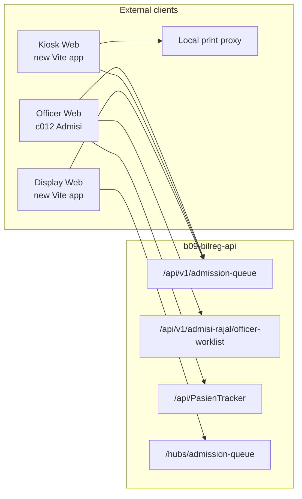
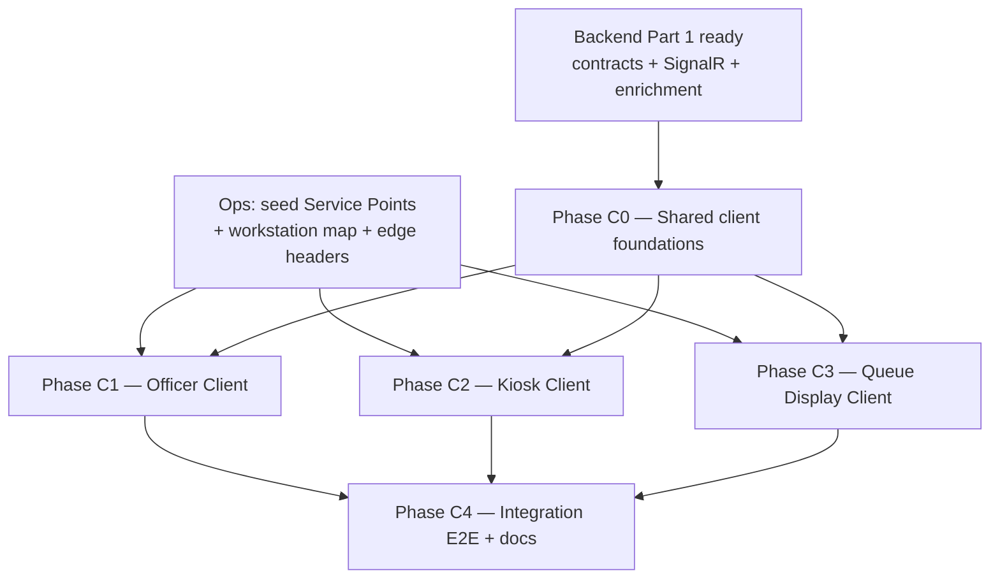

# Patient Tracker — Admission Queue External Clients Implementation Plan

**Status:** Planning only — this document does not authorize feature implementation.  
**Scope:** Officer Client, Kiosk Client, and Queue Display Client that consume Bilreg Admission Queue v1.  
**Relationship:** Part 2 of Admission Queue delivery. Part 1 (backend) is [TRACKER-ADMISSION-QUEUE-IMPLEMENTATION-PLAN.md](./TRACKER-ADMISSION-QUEUE-IMPLEMENTATION-PLAN.md).  
**Evidence date:** 2026-07-23

**Primary references**

| Artifact | Role |
|----------|------|
| [TRACKER-ADMISSION-QUEUE-DOMAIN.md](./TRACKER-ADMISSION-QUEUE-DOMAIN.md) | Business capabilities and invariants |
| [TRACKER-DOMAIN.md](./TRACKER-DOMAIN.md) | Parent Patient Tracker domain |
| [../admisi-rajal/admisi-rajal-domain.md](../admisi-rajal/admisi-rajal-domain.md) | Admisi Rajal Work List composition boundary |
| [TRACKER-ADMISSION-QUEUE-SOP.md](./TRACKER-ADMISSION-QUEUE-SOP.md) | Target operational procedure |
| [TRACKER-ADMISSION-QUEUE-API-V1.md](./TRACKER-ADMISSION-QUEUE-API-V1.md) | Versioned REST / SignalR / error contract |
| [TRACKER-ADMISSION-QUEUE-RUNBOOK.md](./TRACKER-ADMISSION-QUEUE-RUNBOOK.md) | Workstation mapping, seed, smoke |
| Code under `c012_myhospital_web` (Admisi) and `Bilreg.Api` Admission Queue v1 | Executable client and API evidence |

**Out of scope of this plan:** Backend authority redesign, R-02 claims-derived actor, R-05B Kiosk transport idempotency, R-14 automations, HiDok Self-Registration decision ownership, production SignalR scale-out.

---

## 1. Executive summary

Backend Admission Queue Pragmatic V1 is present and client-consumable: v1 REST under `/api/v1/admission-queue`, Admisi-composed `GET /api/v1/admisi-rajal/officer-worklist`, journey APIs on `/api/PasienTracker`, SignalR hub `/hubs/admission-queue` (`RefreshHint`), and workstation header validation. No Officer, Kiosk, or Queue Display client consumes these contracts today.

Recommended platforms (they need **not** share one technology):

| Client | Recommended platform | One-line rationale |
|--------|----------------------|--------------------|
| **Officer** | **Web — Vue 3 in `c012_myhospital_web`** | Replaces the existing Admisi Rajal worklist inside the Registration workspace; reuses auth, form, print, and Bilreg API patterns |
| **Kiosk** | **Web (Vite) + local print proxy**; optional thin WebView2/WPF shell later | Bilreg is JWT/REST; silent thermal print already exists via c012 local proxy; legacy `X1\kiosk_wpf` is SQL-direct .NET 4.6.1 and not a fit to port |
| **Queue Display** | **Web (Vite fullscreen)** | Passive snapshot + SignalR hint + polling; Taksaka.Web already proves Vue+SignalR; lobby TVs run browsers; no Bilreg WPF display exists |

**First implementation slice:** Officer Client worklist replacement + Call / Recall / Start Service / 409 refresh inside `RegistrasiRajal`, against composed officer-worklist and workstation headers — before Kiosk or Display packaging.

---

## 2. Codebase investigation findings

### 2.1 Repositories in scope

| Location | Finding |
|----------|---------|
| `MyHospitalWeb/b09-bilreg-api` | Backend + docs; SignalR hub implemented; no desktop clients |
| `MyHospitalWeb/c012_myhospital_web` | Vue 3 HIS frontend; Admisi Rawat Jalan officer workspace exists |
| `Project.Aktif/X1/kiosk_wpf` | Legacy WPF kiosk (.NET 4.6.1, SQL direct, BarTender) — UX/print patterns only |
| `Project.Aktif/X1/antres_display*`, `X1/queue/*` | Legacy VB6 lobby display + sound — do not port to Bilreg |
| `Project.Aktif/_Published/A025_DisplayAntrian_SmartTV` | Android TV display reference — optional later TV track |
| `b09-bilreg-api/src/taksaka.frontend/Taksaka.Web` | Vue + `@microsoft/signalr` ops console — **pattern only**; hub is `/hubs/operations`, unrelated |

### 2.2 Officer surface today (`c012`)

| Asset | Path | Verdict |
|-------|------|---------|
| Registrasi Rajal workspace | `src/modules/Admisi/views/RegistrasiRajal.vue` | **Keep shell**; replace left worklist + selection workflow |
| Sidebar worklist | `SidebarAntrianPasien.vue` + `useRegistrasiPasien.ts` | **Replace** — today reads `GET Antrian/pasien/{tgl}` (BOK/REG/IGD), not Admission Queue |
| Registration form stack | `useRegistrasiForm`, `useRegistrasiLayanan`, `useRegistrasiJaminan`, `useRegistrasiActions`, BillingBase forms | **Preserve** |
| Registrasi API hooks | `queries/RegistrasiService.ts` | **Preserve** for walk-in / booking registration mutations |
| Admission Queue API client | — | **Missing** |
| Workstation / Loket headers | — | **Missing** in `global_config` and ApiService |
| PasienTracker journey client | — | **Missing** (Ranap journey UI is a different pipeline) |
| SignalR | `@microsoft/signalr` in package.json | **Installed, unused** in `src/` |
| Print | `PrintService.ts`, `antrian_registrasi.html`, localProxy | **Reusable** for registration tickets; Kiosk needs a dedicated queue-label template |

### 2.3 Backend contracts available to clients

| Surface | Status |
|---------|--------|
| `GET/POST /api/v1/admission-queue/*` | Implemented |
| `GET /api/v1/admisi-rajal/officer-worklist` | Implemented — queue truth + nullable Identity/Booking/Registration |
| `GET/POST /api/PasienTracker/...` (candidates, resolve/select) | Implemented — requires anonymous **InService** entry for select |
| SignalR `/hubs/admission-queue` → `RefreshHint { loketKey }` | Implemented; disable via `SignalRRefreshEnabled` |
| Loket mutations: `X-Loket-Key` + `X-Workstation-Key` | Implemented; default `Workstations: []` must be provisioned |
| ReasonCode catalog | Pass-through non-blank only — **no approved Ops list** |
| Role policies Officer/Kiosk/Display | **Deferred (R-02)** — any JWT may hit routes |
| Kiosk `ClientRequestId` | **Deferred (R-05B)** — intake non-idempotent |

### 2.4 Naming collision to avoid

“Antrian” in the frontend today means (a) Admisi BOK/REG/IGD worklist, (b) Outpatient poli waiting list, (c) pharmacy mock loket. New Admission Queue UI language must use **Queue Label / Service Point / Loket / Call** from the domain docs, not overload `SidebarAntrianPasien` semantics.

---

## 3. Platform recommendations

### 3.1 Officer Client → Web (Vue 3 in `c012_myhospital_web`)

**Rationale**

- Officers already authenticate and work in Admisi `registrasi_rajal`.
- Domain and SOP define the Admission Module as the place that composes queue actions with Registration Assistance.
- Existing form, jaminan, print, and Bilreg TanStack Query patterns are the highest-value reuse.
- No WPF officer admission app exists for Bilreg v1.

**Reject:** Separate WPF officer client; pharmacy loket mock; Outpatient poli `AntrianService`.

### 3.2 Kiosk Client → Web + local print proxy (preferred)

**Rationale**

| Criterion | Web + proxy | New WPF | Legacy `kiosk_wpf` port |
|-----------|-------------|---------|-------------------------|
| API fit | JWT REST matches Bilreg | Possible | SQL-direct — wrong authority |
| Print | Existing local proxy contract in c012 (`localhost:5050/5800`) | Native `PrintDocument` | BarTender/GDI — hospital-specific |
| Maintainability | Same Vue/TS stack as HIS | Second stack | .NET 4.6.1 dead-end |
| Recovery / retry UX | Easy to ship pending-button + deliberate retry | Same | Would need rewrite anyway |
| Kiosk lockdown | Browser kiosk mode or later WebView2 shell | Strong | Already has chrome patterns |
| Reusable code | PrintService patterns, templates, auth login | None in MyHospitalWeb | UX only |

**Decision:** Build a **dedicated lightweight Vite web app** (not embedded in the officer workspace chrome). Add a thin **WebView2/WPF host later only if** silent USB print or OS kiosk lockdown fails with browser + proxy.

**Reject:** Client-side queue allocation; porting VB6 `kiosk_reg_ticketing` or SQL-direct `kiosk_wpf` as the product.

### 3.3 Queue Display Client → Web fullscreen (preferred)

**Rationale**

| Criterion | Web fullscreen | WPF | Android A025 |
|-----------|----------------|-----|--------------|
| Authority model | Snapshot GET + SignalR hint + poll | Same APIs | Same APIs |
| Reconnect / stale recovery | Browser + SignalR reconnect + poll | Possible | Possible |
| Audio | Web Speech / pre-recorded clips keyed by `AnnouncementVersion` | MediaElement | MediaPlayer (proven) |
| Maintainability | Vue + existing SignalR package | New stack | Separate mobile CD |
| Deployment | Chrome/Edge kiosk on lobby PC/TV stick | ClickOnce-style | APK |
| Existing Bilreg UI | None — greenfield | None | Closest TV UX reference |

**Decision:** Dedicated Vite **Display** web app, fullscreen. Treat Android TV as a **later optional track** if hospital TVs are already Android-only. Do not start a WPF display for V1.

**Authority rule (non-negotiable):** Persisted `GET .../displays/current` is recovery truth. SignalR `RefreshHint` only triggers reload. Audio plays only when reloaded `AnnouncementVersion` increases.

---

## 4. Architecture and repository / project placement



### 4.1 Placement decisions

| Client | Repository | Project / path |
|--------|------------|----------------|
| Officer | `c012_myhospital_web` | Replace worklist inside `src/modules/Admisi/views/RegistrasiRajal.vue`; new `queries/AdmissionQueueService.ts`, `components/admissionQueue/*`, composables, types |
| Kiosk | **New** repo or folder under `MyHospitalWeb`, e.g. `c013_admission_kiosk` (recommended) | Minimal Vite + Vue 3 app; depends only on Bilreg JWT + print proxy |
| Display | **New** sibling, e.g. `c014_admission_display` (recommended) | Minimal Vite + Vue 3 + SignalR; no officer chrome |
| Shared types (optional later) | Publish OpenAPI/Zod from API-V1, or thin shared npm package | Do **not** couple Kiosk/Display to full HIS `c012` |

**Why not put Kiosk/Display inside `c012` tabs:** Different auth lifecycle (long-lived device JWT vs officer session), fullscreen/kiosk chrome, and independent IIS applications. Officer stays in HIS; devices stay lean.

**Why not put clients inside `b09-bilreg-api`:** Backend plan and architecture treat clients as external; Bilreg solutions are API-only.

### 4.2 Client-layer architecture (all three)

1. **Transport adapters only** — Zod-validated REST via existing `ApiService`/`queryFactory` patterns (Officer) or a small fetch client (Kiosk/Display).
2. **No second queue ledger** — Officer UI state is selection + mutation in-flight; membership and queue fields come from `officer-worklist` / worklist responses.
3. **Workstation identity** — Officer and trusted edge supply Loket; Kiosk does not send Loket headers on intake.
4. **Presentation state only** — Display keeps `lastAnnouncementVersion` and connection status; never invents Call/Recall.

---

## 5. Reuse versus replace decisions

### 5.1 Officer Client

| Decision | Asset | Action |
|----------|-------|--------|
| **Replace** | `SidebarAntrianPasien` BOK/REG/IGD workflow as the primary Admisi Rajal worklist | New Admission Queue worklist (Queue Label, Service Point, Priority, call state, enrichment) |
| **Replace** | `useRegistrasiPasien` data source (`Antrian/pasien/{tgl}`) for active assistance | `GET /api/v1/admisi-rajal/officer-worklist` |
| **Preserve** | Registration form, layanan/jaminan composables, submit actions | Wire after **Start Service** (+ journey resolve when Booking path) |
| **Preserve** | Auth store, bilreg Bearer interceptor, roles tabs | Extend interceptor for workstation headers on AQ mutations |
| **Preserve** | Print preview for registration/booking tickets | Unchanged |
| **Add** | Loket banner, Call/Recall/Start/Withdraw/No-Show/Redirect/Outcome actions, 409 reload | New components |
| **Add** | Journey candidate search + `resolve/select` | New thin client; do not invent Tracker creation from Queue Label |
| **Do not reuse** | Pharmacy `RajalQueueSidebar`, Outpatient `AntrianService`, Ranap UnifiedWorkList | Wrong domain |

**IGD / legacy REG rows:** Product must decide whether V1 officer worklist is **Admission Queue only** (recommended for this feature) or dual-mode with a temporary legacy accordion. This plan recommends **Admission Queue as the sole active assistance worklist** on `registrasi_rajal`, with a feature flag to fall back to legacy sidebar during rollout.

### 5.2 Kiosk Client

| Decision | Action |
|----------|--------|
| **Reuse patterns** | c012 `PrintService` / thermal template pipeline; JWT login; JSend error codes |
| **Reuse UX ideas only** | Legacy `kiosk_wpf` touch layout, maximized chrome, printer-name config |
| **Build new** | Service Point selection, pending intake, Queue Label screen, print/retry, error screens |
| **Never** | Allocate numbers client-side; treat local clock as Business Date; auto-retry intake loops |

### 5.3 Queue Display Client

| Decision | Action |
|----------|--------|
| **Reuse patterns** | Taksaka.Web `signalrClient.ts` reconnect style; `@microsoft/signalr` |
| **Reuse UX ideas only** | Legacy antres digit-audio, Android A025 fullscreen |
| **Build new** | Snapshot renderer, AnnouncementVersion audio gate, poll fallback, config screen |
| **Never** | Treat SignalR payload as display fields; call entries; clear display without snapshot |

---

## 6. Implementation phases and dependency order



| Phase | Purpose | Depends on | Parallelism |
|-------|---------|------------|-------------|
| **C0** Shared foundations | Zod DTOs from API-V1; error-code handling; workstation config shape; JSend helpers | Published API-V1 | Before all clients |
| **C1** Officer Client | Replace worklist; Call→Start→Registration→Outcome; conflict UX; journey resolve | C0 + seeded workstations + ReasonCode interim | Critical path for assisted registration |
| **C2** Kiosk Client | Service Point → intake → label → print → recovery | C0 + active Service Points | Parallel with C1 after C0 |
| **C3** Queue Display | Snapshot + SignalR + poll + audio | C0 + Phase 4 SignalR backend | Parallel; needs Call from C1 for full E2E |
| **C4** Integration closure | Cross-client E2E, runbook client sections, feature-flag cutover | C1–C3 | Sequential gate |

**Backend soft prerequisites (already largely done; verify before C1):** Part 1 Phases 1–5 exit evidence, non-empty `Workstations`, edge header protection, at least one seeded Service Point. Officer enrichment and SignalR are already in source.

---

## 7. Principal screens and workflows

### 7.1 Officer Client (Admisi Rawat Jalan Work List)

**Screen composition (single workspace)**

1. **Loket header** — configured `LoketKey` / workstation (read-only); connection/refresh status.
2. **Service Point filter** — active Service Points; V1 no per-Loket matrix.
3. **Composed worklist** — Queue Label, Priority indicator, call/service state, CallCount, optional identity/booking/registration enrichment; operator selects row (no auto-call).
4. **Queue action bar** — Call, Recall, Start Service, Withdraw, No-Show, Redirect (target Service Point), outcomes.
5. **Registration form** — existing RegistrasiRajal main pane (preserved).
6. **Journey resolution panel** — candidates → select (Booking / existing Walk-In path).
7. **Conflict toast** — on `409 AQ_CONCURRENCY_CONFLICT`, reload worklist + current Loket claim; do not force the failed mutation.

**Primary happy path (SOP §4.2–4.6)**

```text
Open Registrasi Rajal
  → Verify workstation Loket
  → Filter Service Point / load officer-worklist
  → Select Waiting entry → Call
  → Patient presents → Start Service
  → Resolve journey (Booking/existing) or continue Walk-In anonymous
  → Complete registration form → Established(RegId) or NotEstablished(ReasonCode)
  → Queue becomes Done via outcome endpoints
  → Loket free → next Call
```

**Exception paths:** Recall; No-Show; Withdraw; Redirect (new Priority label); 409 stale claim; inactive filter empty list.

### 7.2 Kiosk Client

| Screen | Behavior |
|--------|----------|
| Boot / config error | Missing API URL, auth, or empty offerings |
| Service Point selection | From `GET service-points?activeOnly=true` intersected with **local offering allow-list** (BR-AQO-005) |
| Pending intake | Button disabled; no second submit |
| Success | Show committed Queue Label; print once |
| Print failed | Show label + reprint of **same** result; never re-intake for reprint |
| Uncertain response | Deliberate retry CTA only; warn possible duplicate (R-05B deferred) |
| Inactive Service Point | `AQ_OPERATION_NOT_ALLOWED` / not found — remove from UI after refresh |
| Sequence exhausted | `503 AQ_SEQUENCE_EXHAUSTED` — stop intake; show supervisor message |

**Do not design:** Offline number minting; client Business Date; automatic retry storms.

### 7.3 Queue Display Client

| Screen / mode | Behavior |
|---------------|----------|
| Config | API base URL, auth token/device login, optional Loket filter, poll interval, audio on/off |
| Main display | Current Queue Label(s) + LoketKey from snapshot |
| Audio | Play only when `AnnouncementVersion` > last processed |
| Reconnect | On SignalR disconnect, keep last snapshot; reconnect; always GET snapshot |
| Poll fallback | Periodic `GET displays/current` even when SignalR healthy |
| Stale recovery | On focus/visibility/reboot → snapshot first |

---

## 8. Backend / API prerequisites and detected gaps

### 8.1 Ready for client consumption

- Officer mutations + worklist + enrichment composition
- Kiosk intake + service-points
- Display snapshot + SignalR refresh hint
- Journey get / candidates / resolve/select
- Error taxonomy `AQ_*` and 409 conflict semantics
- Rollout preflight `GET .../rollout/status`

### 8.2 Gaps that block or degrade clients (owners outside pure UI)

| Gap | Impact | Suggested owner |
|-----|--------|-----------------|
| Empty / unprovisioned `AdmissionQueueApi:Workstations` | Officer Call/Recall/Start fail 400 | Ops + runbook |
| Edge does not strip spoofable Loket headers | Accountability hole | Ops / infra |
| No approved ReasonCode catalog | NotEstablished UX has free-text codes only | Ops / Admisi product |
| No Officer/Kiosk/Display role policies (R-02) | Any JWT can call any route | Platform security (deferred) |
| Kiosk JWT provisioning story undefined | Device login / long-lived token | Product + security |
| Display JWT provisioning story undefined | Same | Product + security |
| HiDok AssistanceRequired → `booking-assistance` wiring | Assistance entries may be missing | HiDok / Admisi (outside this plan) |
| Frontend workstation config schema missing | Officer cannot send headers | C1 in `global_config` |
| No queue-label thermal template for Kiosk | Print UX incomplete | C2 templates |
| Pass-through ReasonCode | Interim: UI dropdown from Ops JSON until catalog API exists | C1 interim |

### 8.3 Explicit non-gaps (do not reinvent)

- Do not add client-side sequencers or Queue Label formatters as authority (display formatting of returned `queueLabel` only).
- Do not create an Admisi-owned queue table or cache that mutates membership.
- Do not use legacy `POST /api/Antrian/anonymous-intake` or `POST /api/Antrian/start`.

---

## 9. Testing strategy

### 9.1 Officer (`c012`)

| Layer | Focus |
|-------|-------|
| Unit | Composables: action enablement by queue/claim state; 409 → reload; header attachment |
| Component | Worklist row Priority/call state; action bar; feature-flag legacy sidebar |
| Contract | Zod schemas match API-V1 shapes; mutation payloads include `userId` + `loketKey` |
| Integration (manual/staging) | Call → Display announcement → Start → Reg Established → Done; Redirect; No-Show |
| Regression | Existing RegistrasiRajal form tests still pass for preserved form paths |

### 9.2 Kiosk

| Layer | Focus |
|-------|-------|
| Unit | Pending-button lock; uncertain-response does not auto-retry; reprint uses last committed label |
| Contract | Intake success/error mapping; exhaustion 503; inactive Service Point |
| Device | Print proxy health; reprint without second intake |
| Negative | Double-click does not dual-submit while pending |

### 9.3 Display

| Layer | Focus |
|-------|-------|
| Unit | AnnouncementVersion gate; hint with null loketKey refreshes all; filter by loketKey |
| Integration | SignalR disabled → poll-only still correct; reconnect after hub restart |
| Audio | No replay on ordinary service-state change without version bump |

### 9.4 Cross-client E2E (Phase C4)

1. Kiosk issues `A0001` → appears on officer-worklist.  
2. Officer Call → Display shows label + audio.  
3. Start Service → Display stops outstanding presentation after snapshot.  
4. Established outcome → entry leaves active worklist; Loket free.  
5. Kill SignalR → Display still recovers via poll.  
6. Concurrent second Call on same Loket → 409 → officer reload.

---

## 10. Deployment and configuration approach

### 10.1 Officer (`c012`)

Extend `public/global_config.json` (and typed `config.ts`) with something like:

```json
"admissionQueue": {
  "enabled": true,
  "useLegacySidebarFallback": false,
  "workstationKey": "ADM-01",
  "loketKey": "L1",
  "worklistPollMs": 15000,
  "reasonCodes": []
}
```

- ApiService attaches `X-Workstation-Key` / `X-Loket-Key` on Admission Queue **mutations** only.
- Server `AdmissionQueueApi:Workstations` must contain the same mapping.
- Feature flag allows temporary legacy sidebar during cutover.
- Deploy as existing IIS app `/MyHospital/`.

### 10.2 Kiosk (new Vite app)

Per-device config (file or env):

- `api.bilregApi.baseUrl`, device credentials / JWT bootstrap
- `offeredServicePointIds[]` (local presentation allow-list)
- `printing.localProxy.url`, printer name / copies
- Idle timeout back to Service Point screen

Deploy as separate IIS application (e.g. `/AdmissionKiosk/`) or dedicated host; run Chrome/Edge in kiosk mode; print proxy installed on the kiosk PC.

### 10.3 Display (new Vite app)

Per-display config:

- API base URL + JWT
- Optional `loketKey` filter (null = all Lokets in snapshot)
- `pollIntervalMs` (e.g. 5000–10000)
- `signalREnabled`, hub URL `/hubs/admission-queue`
- Audio pack path / Web Speech locale

Deploy as `/AdmissionDisplay/`; fullscreen autostart on lobby PC or TV stick.

### 10.4 Shared ops checklist (client-facing)

Before go-live: runbook seed + workstation uniqueness + edge header protection + `rollout/status` green + one smoke Call that moves Display AnnouncementVersion.

---

## 11. Major risks and unresolved decisions

| Risk / decision | Why it matters | Mitigation / question for owners |
|-----------------|----------------|----------------------------------|
| Legacy BOK/REG/IGD sidebar cutover | Operators may still depend on `Antrian/pasien` rows | Feature flag dual-mode; product date for Admission-Queue-only |
| Non-idempotent Kiosk intake | Double tickets under uncertainty | Pending lock + deliberate retry copy; R-05B later |
| Spoofable workstation headers | Wrong Loket accountability | Edge strip/overwrite mandatory |
| ReasonCode catalog missing | Inconsistent NotEstablished reporting | Interim config list; block inventing codes in Tracker |
| Device auth model | Kiosk/Display need long-lived JWT without officer UX | Decide service account vs kiosk login before C2/C3 harden |
| Audio technology | Web Speech vs recorded clips | Spike in C3; AnnouncementVersion gate is fixed either way |
| Print proxy repo location | Proxy “moved out of c012” | Confirm install package for kiosk PCs before C2 exit |
| Whether Officer and Kiosk share one deployable | Different lifecycles | Keep separate (this plan) |
| Android TV track | Some sites already on A025 | Defer; Web Display first |
| HiDok assistance wiring | Worklist may miss Booking assistance entries | Tracked outside client plan; Officer still works for walk-in intake |

---

## 12. First implementation slice (start here)

**Slice C1.0 — Officer worklist + Call / Start Service on `RegistrasiRajal`**

**Goal:** Make the Admisi Rawat Jalan page operate from Patient Tracker queue truth (composed) for one configured Loket, without shipping Kiosk or Display yet.

**In scope**

1. `AdmissionQueueService.ts` + Zod types for:
   - `GET /api/v1/admisi-rajal/officer-worklist`
   - `GET /api/v1/admission-queue/service-points`
   - `POST .../call`, `.../recall`, `.../start-service`
2. `global_config` workstation keys + ApiService header injection for those mutations.
3. Replace left rail with new Admission Queue worklist component (Queue Label, Priority, state, enrichment).
4. Action bar: Call → Recall → Start Service; on success enable existing registration form selection path for the In Service entry.
5. On `409`, invalidate/refetch worklist and show conflict message.
6. Feature flag `admissionQueue.enabled` / `useLegacySidebarFallback`.
7. Unit tests for composable action rules and header attachment.

**Out of scope for C1.0**

- Withdraw / No-Show / Redirect / Outcomes (C1.1)
- Journey resolve UI (C1.2)
- Kiosk / Display apps
- SignalR on officer (polling sufficient initially)
- ReasonCode catalog API

**Exit criteria**

1. Seeded integration environment: officer sees waiting entries from intake (manual API or temporary script).
2. Call claims Loket; second Call on same Loket returns 409 and UI recovers.
3. Start Service moves entry to In Service; existing registration form remains usable.
4. No second queue ledger written from the client.
5. Legacy sidebar available only behind fallback flag.

**Immediate next slices after C1.0**

- **C1.1** — Withdraw, No-Show, Redirect, Established / NotEstablished outcomes wired to form submit success/failure.
- **C1.2** — Journey candidates + `resolve/select` before/during Booking-path registration.
- **C2.0** — Kiosk Service Point → intake → label screen (print can follow C2.1).
- **C3.0** — Display snapshot renderer + poll (SignalR + audio in C3.1).

---

## 13. Traceability to Part 1 (backend plan)

| Backend Part 1 item | Client Part 2 consumer |
|---------------------|------------------------|
| Phase 1 real-SQL proof | Assumed before production client cutover |
| Phase 2 officer contracts + enrichment | Officer C1 uses `officer-worklist` |
| Phase 3 booking-assistance API | Kiosk does not own it; HiDok caller does; Officer sees resulting entries |
| Phase 4 SignalR hub | Display C3 |
| Phase 5 rollout / workstations | All clients; Officer/Kiosk blocked without maps/seeds |
| External Client section in Part 1 | Superseded for planning detail by **this** document |

Update Part 1’s “External Client Deliverables” section to link here when this artifact is accepted.

---

## 14. Document control

| Field | Value |
|-------|-------|
| Artifact | `docs/contexts/pasien-tracker/TRACKER-ADMISSION-QUEUE-EXTERNAL-CLIENTS-IMPLEMENTATION-PLAN.md` |
| Companion backend plan | `TRACKER-ADMISSION-QUEUE-IMPLEMENTATION-PLAN.md` |
| Implementation authorization | Not granted by this document alone |
| Preferred first code change | Slice C1.0 in `c012_myhospital_web` Admisi module |
