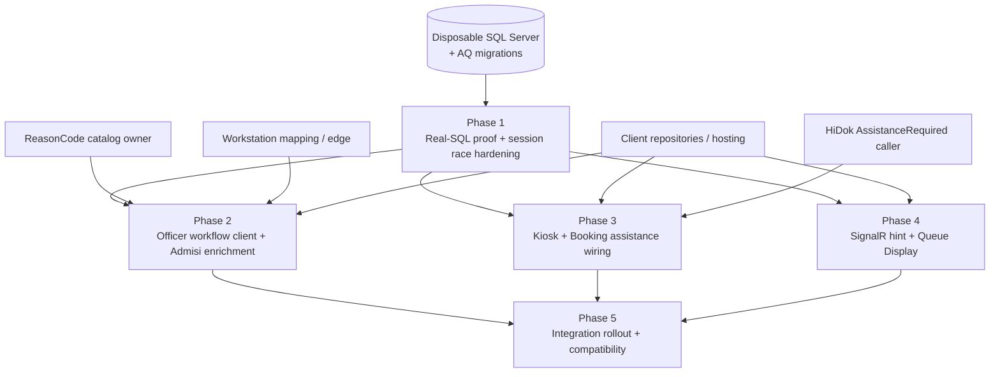

# Patient Tracker — Admission Queue Implementation Plan

**Status:** Planning only — this document does not authorize feature implementation.  
**Verdict basis:** [TRACKER-ADMISSION-QUEUE-ARCHITECTURE-RECONCILIATION.md](./TRACKER-ADMISSION-QUEUE-ARCHITECTURE-RECONCILIATION.md) (`ARCHITECTURE UPDATED — READY FOR IMPLEMENTATION PLANNING`)  
**Evidence date:** 2026-07-23

**Primary references**

| Artifact | Role |
|----------|------|
| [TRACKER-ADMISSION-QUEUE-DOMAIN.md](./TRACKER-ADMISSION-QUEUE-DOMAIN.md) | Business capabilities and invariants |
| [TRACKER-ADMISSION-QUEUE-SOP.md](./TRACKER-ADMISSION-QUEUE-SOP.md) | Target operational procedure |
| [TRACKER-ADMISSION-QUEUE-ARCHITECTURE.md](./TRACKER-ADMISSION-QUEUE-ARCHITECTURE.md) | Target technical design and ADRs |
| [TRACKER-ADMISSION-QUEUE-ARCHITECTURE-RECONCILIATION.md](./TRACKER-ADMISSION-QUEUE-ARCHITECTURE-RECONCILIATION.md) | Current-state matrix and remaining slices |
| [TRACKER-ADMISSION-QUEUE-IMPLEMENTATION-ROADMAP.md](./TRACKER-ADMISSION-QUEUE-IMPLEMENTATION-ROADMAP.md) | Historical R-00–R-14 delivery order |
| [TRACKER-ADMISSION-QUEUE-API-V1.md](./TRACKER-ADMISSION-QUEUE-API-V1.md) | Versioned API / error / security boundary |
| [TRACKER-ADMISSION-QUEUE-R04-LOKET-CLAIM-CONTRACT.md](./TRACKER-ADMISSION-QUEUE-R04-LOKET-CLAIM-CONTRACT.md) | Active Loket claim concurrency contract |
| Code under `src/bilreg/**/AdmisiContext/AntrianFeature/` and related RegFeature | Executable source of truth |

**Physical location (unchanged):** `AdmisiContext/AntrianFeature` across Domain / Application / Infrastructure / Api. Logical owner remains Patient Tracker.

---

## 1. Executive summary

Admission Queue Pragmatic V1 backend is **substantially present in source**: Service Point master, bounded sequencer, anonymous intake, Loket claim + Call/Recall/Start/Withdraw/No-Show/Redirect, queue-only projections, Registration Outcomes, Booking-assistance intake, v1 API, workstation mapping, and additive SQL scripts all exist. Focused mocked/unit tests cover most handlers.

The feature is **not delivered end to end**. Remaining work is not another architecture redesign. It is:

1. prove the existing backend on a disposable migrated SQL Server (real race/rollback/volume gate, plus narrow daily-session conflict recovery);
2. deliver officer, Kiosk, and Queue Display clients against the published v1 contract;
3. wire external HiDok AssistanceRequired and Admisi read-only enrichment;
4. close integration rollout with migration/seed/workstation evidence.

No owner decision blocks **backend** Phase 1. Client delivery, ReasonCode catalog, HiDok call-site, deployment topology, and production authorization remain external dependencies for later phases. Explicitly deferred by accepted decision: claims-derived actor (R-02), Kiosk transport idempotency (R-05B), automatic queue policies (R-14), and production SignalR scale-out/retention/monitoring platforms.

---

## 2. Current implementation status by business capability

Status meanings:

| Status | Meaning |
|--------|---------|
| **Implemented** | Executable backend path exists and is usable for new data when schema is applied; remaining gaps are deployment/client/proof, not missing core logic |
| **Partially implemented** | Core write/read path exists, but concurrency proof, integration journey, or a required consumer is missing |
| **Foundation only** | Schema/API/port/scaffolding exists; not operationally usable without migration, seed, client, or transport |
| **Not implemented** | No executable capability in available source |
| **Deferred** | Explicitly out of V1 by accepted decision |

### 2.1 Domain capabilities (from Domain §3)

| Capability | Status | Code / artifact evidence | Remaining to make real |
|---|---|---|---|
| Admission Service Point Management | Foundation only | `AdmissionServicePointModel`, `AdmissionServicePointCommands`, `BILRG_AdmServicePoint.sql`, v1 GET/PUT | Applied migration, approved seed, operational ownership |
| Admission Queue Intake (anonymous) | Partially implemented | `QueAnonymousIntakeCmd`, factory, v1 `POST .../intake` | Transparent concurrent first-session reload; real-SQL race proof; Kiosk client |
| Queue Number Allocation and Labelling | Implemented (new sessions) | `ISequencer` / `Sequencer`, `AddAdmissionEntry`, prefix snapshot alter, allocation tests | Applied schema; historical sessions intentionally null label |
| Configured Loket operation | Foundation only | `AdmissionQueueApiOptions` + validator; header checks in `AdmissionQueueV1Controller` | Per-install workstation mapping; trusted edge; officer client |
| Queue Call Coordination | Partially implemented | `AdmissionQueueOperationalCommands`, `AdmissionQueueOperationRepo`, `BILRG_AdmLoketCurrentCall.sql`, focused tests | Real-SQL claim races; officer client; refresh delivery |
| Admission Queue Exception Resolution | Partially implemented | Withdraw / No-Show / Redirect handlers + provenance fields + tests | Real-SQL redirect rollback; officer UX; ReasonCode catalog for completion path |
| Admission Queue Worklist Projection | Foundation only | `AdmissionQueueOperationalQueries`, projection DAL, v1 `GET .../worklist` | Volume/query-plan proof; officer UI; Admisi enrichment composition |

### 2.2 Supporting / delivery capabilities

| Capability | Status | Evidence | Remaining |
|---|---|---|---|
| Queue aggregate + composite entry identity | Implemented | `AntrianModel`, `AntrianEntryModel`, `BILRG_Antrian*.sql` | Keep `(AntrianId, NoUrut)`; do not add QueueEntryId |
| Authoritative Business Date intake | Implemented | `QueAnonymousIntakeCmd` uses `ITglJamProvider`; no client date | — |
| Lazy daily Queue Session | Partially implemented | Unique `SequenceTag` path + intake create/load | One-winner reload on unique conflict; real-SQL proof |
| Active Loket claim / current display row | Partially implemented | `BILRG_AdmLoketCurrentCall`, operation repo, projection | Real concurrent acquire/release proof |
| Registration Outcome (Established / NotEstablished) | Partially implemented | `RegistrationOutcomeCommands`, `BILRG_RegOutcome.sql`, v1 outcome routes, tests | Reason catalog; integrated migrated-DB journey; officer workflow |
| Journey association / late identify | Implemented (backend) | `TrkJourneyResolveSelectCmd`, `AdmissionQueueIdentify`, CAS repo/tests | Client composition (routes may live outside v1 controller) |
| Booking assistance business dedup | Partially implemented | `BookingAssistanceIntake`, `BookingAssistanceRepo`, `BILRG_AdmBookingAssistance.sql` | External AssistanceRequired caller; unique-race real-SQL proof |
| v1 Admission Queue API | Partially implemented | `AdmissionQueueV1Controller`, API contract tests, API-V1 doc | Deployed contract verification; confirmed consumers |
| Best-effort refresh hint | Foundation only | `IAdmissionQueueRefreshPublisher` → `NullAdmissionQueueRefreshPublisher` | SignalR hub/adapter; display client |
| Authentication | Foundation only | Controller `[Authorize]` | Production policy remains deferred with R-02 |
| Actor identity / contextual roles | Deferred | Payload `UserId` convention accepted | Platform security phase (R-02) |
| Kiosk request idempotency | Deferred | ADR-AQO-020 / R-05B | Future reliability phase; UI deliberate retry only |
| Admisi enriched worklist | Not implemented | No composing query found | Admisi-owned read composition; no second ledger |
| Kiosk client | Not implemented | Not in this repo | External client |
| Officer queue client | Not implemented | Not in this repo | External client |
| Queue Display client | Not implemented | Not in this repo | External client |
| Production migrations / seeds / rollout evidence | Not implemented | Scripts + reports only | Ops deployment package |
| Real-SQL operational gate (R-13) | Foundation only (documented expectation) | Focused unit/mocked tests; no disposable migration fixture suite | Phase 1 executable gate |
| Automatic No-Show / aging / auto-select / auto-route | Deferred | R-14 | Policy approval required before any automation |

### 2.3 Closed roadmap increments (context only)

R-00, R-01, R-04 (design), R-05A, R-06–R-13 source work, and R-14 guardrail are closed or accepted as documented. R-02 and R-05B remain deferred. This plan does **not** reopen closed increments unless a Phase 1 real-SQL test proves a defect.

---

## 3. Implementation phases (recommended execution order)

Phases reuse the reconciliation remaining slices. They are implementation-oriented delivery units, not document work.

### Phase 1 — Migrated-database operational proof and daily-session race hardening

**Purpose:** Prove the already-present backend is concurrency-safe and migration-reproducible on a disposable SQL Server before any client is operationally approved.

**Scope**

- Isolated integration-test fixture that applies exact Admission Queue scripts in dependency order; fail closed without an explicit integration connection; never target production.
- Real-SQL tests: same-Loket/two-entry, two-Loket/one-entry, stale RowVersion, release-vs-Recall, concurrent first daily-session create, Redirect rollback, outcome rollback, Booking-assistance unique race, 9999 exhaustion.
- Representative-volume worklist / current-display query-plan evidence.
- Narrow production fix only if concurrent first-session test exposes loser failure: one-winner reload in ordinary intake (no second allocator, no lock table).
- Slice verification report (DB version, script order, commands, results).

**Expected outcome:** Reproducible clean migrate; mandatory races/rollbacks pass repeatedly; no orphan active claim or double-active entry; focused regression still green.

**Out of scope:** UI, SignalR, roles, ClientRequestId, monitoring, retention, production DB changes.

### Phase 2 — Officer operational workflow

**Purpose:** Let an Admission Officer complete the queue-assisted Registration journey using v1 APIs.

**Scope**

- Officer client against published v1 contract (worklist, Call, Recall, Start, Redirect, No-Show/Withdraw, journey resolve, Established / NotEstablished).
- Loket sourced only from controlled workstation setup / headers.
- Reload on HTTP 409; preserve manual entry selection (Priority sort only).
- Admisi-owned read-only Booking/identity/Registration enrichment composition (no queue ledger).
- Supply approved ReasonCodes; instrument legacy endpoint usage and migrate confirmed consumers.
- Backend defect fixes only when contract/E2E tests prove them.

**Expected outcome:** Full officer workflow on migrated integration environment; conflicts recover by reload; composed worklist is not a second authority.

**Out of scope:** Automatic selection, role redesign, display client, Kiosk idempotency.

### Phase 3 — Kiosk intake and Booking Self-Registration assistance

**Purpose:** Self-service intake issues a committed Queue Label; Booking assistance is created only from an accountable AssistanceRequired result.

**Scope**

- Kiosk client: list active Service Points; pending-button / deliberate-retry UX; print only after success.
- Connect `POST .../booking-assistance` to approved HiDok/Admisi AssistanceRequired branch.
- Treat `Existing=true` as success; successful self-registration and transient errors create no assistance entry.
- Integration tests for success/no-entry, new/existing assistance, uncertain response, print failure, exhaustion, inactive Service Point, concurrent duplicate assistance.

**Expected outcome:** Successful self-registration never queues; assistance does; business duplicates converge; operators understand uncertain retry behavior.

**Out of scope:** Generic Kiosk `ClientRequestId` idempotency, backend print telemetry, automatic routing.

### Phase 4 — Recoverable passive Queue Display

**Purpose:** Passive displays show persisted current-Loket truth with best-effort refresh and version-driven audio.

**Scope**

- Minimal SignalR refresh-hint adapter/hub replacing `NullAdmissionQueueRefreshPublisher` for post-commit hints only.
- Display client: initial load, reconnect reload, configured polling, per-Loket last `AnnouncementVersion`, audio only when version advances.
- Tests: publish-after-commit, no publish on rollback, missed-hint recovery, reconnect/polling, Recall audio vs ordinary state change.

**Expected outcome:** Disabling SignalR does not lose queue truth; polling recovers; display never mutates queue state.

**Out of scope:** Display timing/clear policy, durable outbox, managed display master, Redis/backplane scale-out.

### Phase 5 — Integration rollout and compatibility closure

**Purpose:** Make the complete V1 workflow reproducibly deployable to an integration environment and retire unsafe legacy consumers.

**Scope**

- Migration/seed order manifest, preflight schema checks, rollback boundary.
- Workstation provisioning and protected header edge configuration.
- Health checks, client configuration, smoke tests, legacy usage observation, go/no-go checklist.
- Full operational journey, restart/reconnect, rollback rehearsal, compatibility, load smoke, security-edge checks.

**Expected outcome:** Signed integration evidence; reproducible rollback; seeded Service Points; unique workstation mappings; no unresolved severity-one concurrency/data issue.

**Out of scope:** Production cutover execution as part of this planning task; platform actor redesign; retention/monitoring platform build-out.

### Explicitly not phased for V1 feature delivery

| Item | Why |
|------|-----|
| R-02 claims-derived actor / contextual roles | Accepted platform deferral |
| R-05B Kiosk transport idempotency | Accepted deferral; client deliberate retry only |
| R-14 automations | Explicit officer/patient action required |
| Retention / archive / purge / dashboards / monitoring infra | Ops follow-up after feature works |
| Production SignalR scale-out / Redis backplane | R-12B operations follow-up |

---

## 4. Dependency diagram between phases

**Critical path:** Phase 1 → (Phases 2 ∥ 3 ∥ 4) → Phase 5.

**Safe parallelism after Phase 1 contract/fixtures are stable**

| Parallel track | May start after | Notes |
|----------------|-----------------|-------|
| Officer UI + Admisi enrichment composition | Phase 1 | Mutation clients must not be operationally approved before Phase 1 exit |
| Kiosk UI + HiDok assistance wiring | Phase 1 | Independent of officer UI once intake/assistance contracts are stable |
| SignalR adapter + display client | Phase 1 | Single-instance delivery first; scale-out deferred |
| Rollout manifest / seed / workstation prep docs | Anytime (draft) | Final Phase 5 gate remains sequential after clients |
| Contract fixture reading / consumer inventory | Anytime | Does not replace Phase 1 SQL gate |

**Do not parallelize with Phase 1:** production schema application, officer/Kiosk mutation go-live, or claiming concurrency safety from unit tests alone.

---

## 5. Risks and prerequisites per phase

### Phase 1

| Prerequisites | Risks |
|---------------|-------|
| Disposable SQL Server connection via test configuration | Fixture accidentally pointed at shared/prod DB |
| All R-06–R-13 additive scripts available in repo order | Script order drift vs environments |
| Preserve uncommitted workspace intake/factory changes unless proved defective | Over-broad “hardening” that invents lock tables or second allocators |
| R-04 claim contract remains authoritative | Incomplete race matrix leaves silent double-active claims |

### Phase 2

| Prerequisites | Risks |
|---------------|-------|
| Phase 1 exit | Building UI on unproven concurrency |
| Approved client repository ownership | Dual ledgers if Admisi enrichment writes queue truth |
| Approved ReasonCode catalog | NotEstablished UI blocked or invents codes |
| Installation workstation → Loket mapping | Spoofed/mismatched Loket headers undermine accountability |
| Published v1 API contract | Legacy `start` / anonymous routes silently redefine semantics |

### Phase 3

| Prerequisites | Risks |
|---------------|-------|
| Phase 1 exit | Duplicate assistance under race without real-SQL proof |
| External HiDok/Admisi AssistanceRequired call-site | Assistance created on success or transient error paths |
| Kiosk client ownership | Operators treat uncertain responses as auto-retry (violates R-05B) |
| Active Service Point seed | Intake against inactive/missing masters |

### Phase 4

| Prerequisites | Risks |
|---------------|-------|
| Phase 1 exit (persisted snapshot trust) | Treating SignalR messages as write authority |
| Display hosting / access decision | Audio replay on every refresh if AnnouncementVersion rules ignored |
| Minimal hub in Bilreg.Api (not Taksaka reuse as queue authority) | Coupling display to unrelated Operations hub semantics |

### Phase 5

| Prerequisites | Risks |
|---------------|-------|
| Phases 1–4 delivered for intended workflow set | Partial client readiness presented as full V1 |
| Ops access to integration environment | Irreversible prod migration without rollback rehearsal |
| Consumer inventory for legacy endpoints | Unknown consumers break on compatibility gates |
| Seeded Service Points + unique workstation keys | Label collisions / wrong-Loket operations |

### Cross-cutting assumptions

1. Clean Architecture and physical `AntrianFeature` location stay; no namespace migration.
2. `(AntrianId, NoUrut)`, `ISequencer`, accepted sequence gaps, and local transaction boundaries remain.
3. Source presence ≠ applied schema; reports ≠ real-SQL gate.
4. Payload `UserId` + `[Authorize]` remain until platform R-02; do not claim production actor proof.
5. Historical prefix non-backfill is intentional; null historical labels are not a Phase 1–5 blocker for new sessions.

### External dependencies (owners outside this plan’s code slices)

| Dependency | Blocks |
|------------|--------|
| Disposable / integration SQL Server | Phase 1 exit |
| ReasonCode catalog | Phase 2 NotEstablished UX |
| Workstation mapping + edge header protection | Phase 2/5 Call accountability |
| HiDok Self-Registration AssistanceRequired branch | Phase 3 assistance path |
| Officer / Kiosk / Display client repositories | Phases 2–4 |
| Deployment topology / seed approval | Phase 5 |

---

## 6. Recommendation for the first implementation phase

**Start with Phase 1 — Migrated-database operational proof and daily-session race hardening.**

**Why first**

- Unlocks officer, Kiosk, and display work without redesign.
- Closes the largest remaining integrity risk (unproven CAS/claim/session races) before clients write production-like traffic.
- Scope is backend-only, dependency-light, and already specified with an executable prompt in the reconciliation artifact §7.
- Avoids building UI on a foundation that may still lose the concurrent first-session create or leave orphan claims.

**First concrete task:** use the Slice 1 implementation prompt in [TRACKER-ADMISSION-QUEUE-ARCHITECTURE-RECONCILIATION.md](./TRACKER-ADMISSION-QUEUE-ARCHITECTURE-RECONCILIATION.md) §7 unchanged unless the integration-database mechanism has changed.

**Phase 1 exit gate (must all be true)**

1. Clean disposable database migrates reproducibly with recorded script order.
2. All mandatory real-SQL race/rollback/exhaustion tests pass repeatedly.
3. No double-active claim or orphan active entry remains in failure cases.
4. Representative worklist/current-display query evidence is acceptable.
5. Existing focused Admission Queue regression suite still passes.
6. Any production-code fix is limited to demonstrated defects (permitted: narrow concurrent first-session one-winner reload).

After Phase 1 exits, run Phases 2, 3, and 4 in parallel under separate owners, then close with Phase 5.
