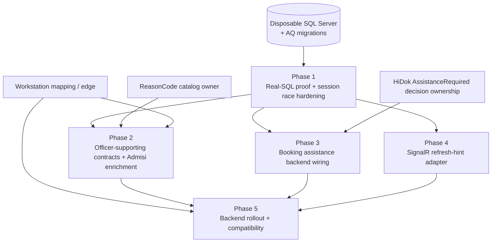

# Patient Tracker — Admission Queue Implementation Plan

**Status:** Planning only — this document does not authorize feature implementation.  
**Scope:** Backend implementation in this repository only (`Bilreg.*` Admission Queue / Patient Tracker).  
**Verdict basis:** [TRACKER-ADMISSION-QUEUE-ARCHITECTURE-RECONCILIATION.md](./TRACKER-ADMISSION-QUEUE-ARCHITECTURE-RECONCILIATION.md) (`ARCHITECTURE UPDATED — READY FOR IMPLEMENTATION PLANNING`)  
**Evidence date:** 2026-07-23

**Primary references**

| Artifact | Role |
|----------|------|
| [TRACKER-ADMISSION-QUEUE-DOMAIN.md](./TRACKER-ADMISSION-QUEUE-DOMAIN.md) | Business capabilities and invariants |
| [TRACKER-ADMISSION-QUEUE-SOP.md](./TRACKER-ADMISSION-QUEUE-SOP.md) | Target operational procedure |
| [TRACKER-ADMISSION-QUEUE-ARCHITECTURE.md](./TRACKER-ADMISSION-QUEUE-ARCHITECTURE.md) | Target technical design and ADRs |
| [TRACKER-ADMISSION-QUEUE-ARCHITECTURE-RECONCILIATION.md](./TRACKER-ADMISSION-QUEUE-ARCHITECTURE-RECONCILIATION.md) | Current-state matrix and remaining slices |
| [TRACKER-ADMISSION-QUEUE-IMPLEMENTATION-ROADMAP.md](./TRACKER-ADMISSION-QUEUE-IMPLEMENTATION-ROADMAP.md) | Historical R-00–R-14 delivery order |
| [TRACKER-ADMISSION-QUEUE-API-V1.md](./TRACKER-ADMISSION-QUEUE-API-V1.md) | Versioned API / error / security boundary |
| [TRACKER-ADMISSION-QUEUE-R04-LOKET-CLAIM-CONTRACT.md](./TRACKER-ADMISSION-QUEUE-R04-LOKET-CLAIM-CONTRACT.md) | Active Loket claim concurrency contract |
| Code under `src/bilreg/**/AdmisiContext/AntrianFeature/` and related RegFeature | Executable source of truth |

**Physical location (unchanged):** `AdmisiContext/AntrianFeature` across Domain / Application / Infrastructure / Api. Logical owner remains Patient Tracker.

**Out of scope of this plan:** Officer Queue Client, Kiosk Client, and Queue Display Client (screens, navigation, UI workflows, printing UX, reconnect/polling UX, display rendering). Those are planned in Part 2: [TRACKER-ADMISSION-QUEUE-EXTERNAL-CLIENTS-IMPLEMENTATION-PLAN.md](./TRACKER-ADMISSION-QUEUE-EXTERNAL-CLIENTS-IMPLEMENTATION-PLAN.md). A short summary remains under [External Client Deliverables](#external-client-deliverables-out-of-scope-of-this-implementation-plan).

---

## 1. Executive summary

Admission Queue Pragmatic V1 **backend** is substantially present in source: Service Point master, bounded sequencer, anonymous intake, Loket claim + Call/Recall/Start/Withdraw/No-Show/Redirect, queue-only projections, Registration Outcomes, Booking-assistance intake, v1 REST API, workstation mapping validation, and additive SQL scripts. Focused mocked/unit tests cover most handlers.

Remaining **backend** work is not an architecture redesign. It is:

1. prove the existing backend on a disposable migrated SQL Server (real race/rollback/volume gate, plus narrow daily-session conflict recovery);
2. harden officer- and Kiosk-supporting backend contracts (Admisi read enrichment, outcome/ReasonCode integration boundary, Booking AssistanceRequired wiring, legacy API compatibility);
3. implement the SignalR refresh-hint publisher/hub behind the existing refresh port;
4. close backend integration rollout with migration/seed/workstation/config evidence and API-level verification.

No owner decision blocks Phase 1. External clients, ReasonCode catalog ownership, HiDok call-site ownership, deployment topology, and production authorization remain dependencies that gate end-to-end product delivery but are not frontend tasks inside these phases. Explicitly deferred: claims-derived actor (R-02), Kiosk transport idempotency (R-05B), automatic queue policies (R-14), and production SignalR scale-out/retention/monitoring platforms.

---

## 2. Current implementation status by business capability

Status meanings (backend-focused):

| Status | Meaning |
|--------|---------|
| **Implemented** | Executable backend path exists and is usable for new data when schema is applied; remaining gaps are deployment/proof, not missing core logic |
| **Partially implemented** | Core write/read path exists, but concurrency proof, integration wiring, or a required backend consumer is missing |
| **Foundation only** | Schema/API/port/scaffolding exists; not operationally usable without migration, seed, transport, or verification |
| **Not implemented** | No executable capability in available source |
| **Deferred** | Explicitly out of V1 by accepted decision |
| **External client** | Not backend work in this repository |

### 2.1 Domain capabilities (from Domain §3)

| Capability | Status | Code / artifact evidence | Remaining backend work |
|---|---|---|---|
| Admission Service Point Management | Foundation only | `AdmissionServicePointModel`, `AdmissionServicePointCommands`, `BILRG_AdmServicePoint.sql`, v1 GET/PUT | Applied migration, approved seed, operational ownership |
| Admission Queue Intake (anonymous) | Partially implemented | `QueAnonymousIntakeCmd`, factory, v1 `POST .../intake` | Transparent concurrent first-session reload; real-SQL race proof |
| Queue Number Allocation and Labelling | Implemented (new sessions) | `ISequencer` / `Sequencer`, `AddAdmissionEntry`, prefix snapshot alter, allocation tests | Applied schema; historical sessions intentionally null label |
| Configured Loket operation | Foundation only | `AdmissionQueueApiOptions` + validator; header checks in `AdmissionQueueV1Controller` | Per-install workstation mapping; trusted-edge header protection |
| Queue Call Coordination | Partially implemented | `AdmissionQueueOperationalCommands`, `AdmissionQueueOperationRepo`, `BILRG_AdmLoketCurrentCall.sql`, focused tests | Real-SQL claim races; SignalR refresh publisher (Phase 4) |
| Admission Queue Exception Resolution | Partially implemented | Withdraw / No-Show / Redirect handlers + provenance fields + tests | Real-SQL redirect rollback; ReasonCode catalog boundary for NotEstablished |
| Admission Queue Worklist Projection | Foundation only | `AdmissionQueueOperationalQueries`, projection DAL, v1 `GET .../worklist` | Volume/query-plan proof; Admisi-owned read enrichment composition (no second ledger) |

### 2.2 Supporting / delivery capabilities

| Capability | Status | Evidence | Remaining backend work |
|---|---|---|---|
| Queue aggregate + composite entry identity | Implemented | `AntrianModel`, `AntrianEntryModel`, `BILRG_Antrian*.sql` | Keep `(AntrianId, NoUrut)`; do not add QueueEntryId |
| Authoritative Business Date intake | Implemented | `QueAnonymousIntakeCmd` uses `ITglJamProvider`; no client date | — |
| Lazy daily Queue Session | Partially implemented | Unique `SequenceTag` path + intake create/load | One-winner reload on unique conflict; real-SQL proof |
| Active Loket claim / current display row | Partially implemented | `BILRG_AdmLoketCurrentCall`, operation repo, projection | Real concurrent acquire/release proof |
| Registration Outcome (Established / NotEstablished) | Partially implemented | `RegistrationOutcomeCommands`, `BILRG_RegOutcome.sql`, v1 outcome routes, tests | Reason catalog integration boundary; migrated-DB journey proof |
| Journey association / late identify | Implemented (backend) | `TrkJourneyResolveSelectCmd`, `AdmissionQueueIdentify`, CAS repo/tests | Keep API/compatibility stable for consumers |
| Booking assistance business dedup | Partially implemented | `BookingAssistanceIntake`, `BookingAssistanceRepo`, `BILRG_AdmBookingAssistance.sql` | AssistanceRequired call-site wiring; unique-race real-SQL proof |
| v1 Admission Queue API | Partially implemented | `AdmissionQueueV1Controller`, API contract tests, API-V1 doc | Deployed contract verification; legacy consumer inventory/gates |
| Best-effort refresh hint | Foundation only | `IAdmissionQueueRefreshPublisher` → `NullAdmissionQueueRefreshPublisher` | SignalR hub/adapter binding; publish-after-commit / no-publish-on-rollback tests |
| Authentication | Foundation only | Controller `[Authorize]` | Documented requirements; production policy remains deferred with R-02 |
| Actor identity / contextual roles | Deferred | Payload `UserId` convention accepted | Platform security phase (R-02) |
| Kiosk request idempotency | Deferred | ADR-AQO-020 / R-05B | Future reliability phase |
| Admisi enriched worklist | Not implemented | No composing query found | Admisi-owned read composition; no second ledger |
| Officer / Kiosk / Queue Display clients | External client | Not in this repo | See [External Client Deliverables](#external-client-deliverables-out-of-scope-of-this-implementation-plan) |
| Production migrations / seeds / rollout evidence | Not implemented | Scripts + reports only | Ops deployment package in this repo’s SQL/config surface |
| Real-SQL operational gate (R-13) | Foundation only (documented expectation) | Focused unit/mocked tests; no disposable migration fixture suite | Phase 1 executable gate |
| Automatic No-Show / aging / auto-select / auto-route | Deferred | R-14 | Policy approval required before any automation |

### 2.3 Closed roadmap increments (context only)

R-00, R-01, R-04 (design), R-05A, R-06–R-13 source work, and R-14 guardrail are closed or accepted as documented. R-02 and R-05B remain deferred. This plan does **not** reopen closed increments unless a Phase 1 real-SQL test proves a defect.

---

## 3. Implementation phases (recommended execution order)

Phases are **backend delivery units** for this repository. They reuse the reconciliation remaining-slice order with client UI work removed.

### Phase 1 — Migrated-database operational proof and daily-session race hardening

**Purpose:** Prove the already-present backend is concurrency-safe and migration-reproducible on a disposable SQL Server before dependent backend integrations or external clients rely on it operationally.

**Scope (backend)**

- Isolated integration-test fixture that applies exact Admission Queue scripts in dependency order; fail closed without an explicit integration connection; never target production.
- Real-SQL tests: same-Loket/two-entry, two-Loket/one-entry, stale RowVersion, release-vs-Recall, concurrent first daily-session create, Redirect rollback, outcome rollback, Booking-assistance unique race, 9999 exhaustion.
- Representative-volume worklist / current-display query-plan evidence.
- Narrow production fix only if concurrent first-session test exposes loser failure: one-winner reload in ordinary intake (no second allocator, no lock table).
- Slice verification report (DB version, script order, commands, results).

**Expected outcome:** Reproducible clean migrate; mandatory races/rollbacks pass repeatedly; no orphan active claim or double-active entry; focused regression still green.

**Out of scope:** SignalR transport, roles, ClientRequestId, monitoring, retention, production DB changes, any client UI.

### Phase 2 — Officer-supporting backend contracts and Admisi enrichment

**Purpose:** Complete backend contracts and integrations required for an Admission Officer journey without implementing the officer client.

**Scope (backend)**

- Preserve and, where needed, harden v1 REST contracts for worklist, Call, Recall, Start Service, Redirect, No-Show/Withdraw, journey association, and Established / NotEstablished outcomes (error taxonomy, 409 conflict semantics, workstation header validation).
- Implement Admisi-owned **read-only** Booking/identity/Registration enrichment composition that consumes queue-only projection without creating a second queue ledger (Application/Infrastructure in owning context).
- Integrate the approved ReasonCode boundary for NotEstablished (accept/validate against owned catalog contract; do not invent codes in Patient Tracker).
- Inventory legacy admission queue endpoints; add compatibility gates / observation hooks; migrate confirmed in-repo consumers to v1 semantics where required.
- Backend defect fixes only when contract or integration tests prove them.
- API/contract and integration tests for the above (no UI E2E).

**Expected outcome:** Officer-facing backend surface is stable on a migrated integration database; enrichment is read-only and non-authoritative for queue state; legacy mutation paths are inventoried and gated.

**Out of scope:** Officer screens, navigation, button workflows, 409 reload UX, manual selection UX, display/Kiosk clients, automatic selection, role redesign, Kiosk idempotency.

### Phase 3 — Booking Self-Registration assistance backend wiring

**Purpose:** Ensure assistance Queue Entries are created only from an accountable AssistanceRequired result, using existing intake/dedup APIs.

**Scope (backend)**

- Wire the approved HiDok/Admisi Self-Registration decision branch (in-repo call-site) to `BookingAssistanceIntake` / v1 `POST .../booking-assistance`.
- Enforce: successful self-registration creates no assistance entry; AssistanceRequired creates/ensures one; `Existing=true` is a successful duplicate business result; transient failures create no entry.
- Backend integration tests: success/no-entry, AssistanceRequired/new, AssistanceRequired/existing, exhausted sequence, inactive Service Point, concurrent duplicate assistance race.
- Keep Kiosk intake REST contracts stable (`GET` service points, `POST` intake); no transport idempotency (`ClientRequestId`) in V1.

**Expected outcome:** Accountable assistance orchestration is server-side correct and race-safe; successful registration never queues assistance.

**Out of scope:** Kiosk screens, pending-button UX, deliberate-retry UX, print UX, uncertain-response operator messaging, backend print telemetry, automatic routing, generic Kiosk request idempotency.

### Phase 4 — SignalR refresh-hint backend adapter

**Purpose:** Deliver best-effort post-commit refresh hints so Queue Display (and other listeners) can reload persisted current-Loket truth without treating messages as authority.

**Scope (backend)**

- Implement one minimal SignalR hub/adapter bound to `IAdmissionQueueRefreshPublisher`, replacing `NullAdmissionQueueRefreshPublisher` for post-commit hints only.
- Keep messages non-authoritative; persisted `GET .../displays/current` remains the recovery path.
- Backend tests: publisher-after-commit, no publish on rollback, message shape/contract stability; AnnouncementVersion semantics remain owned by claim/display persistence (no display timing policy).
- Document authentication/access requirements for the hub relative to existing `[Authorize]` / deployment edge.

**Expected outcome:** Committed mutations can emit refresh hints; rollback emits none; disabling SignalR does not change queue write truth.

**Out of scope:** Display client rendering, reconnect UX, polling UX, audio replay UX, display timing/clear rules, durable outbox, managed display master, Redis/backplane scale-out.

### Phase 5 — Backend integration rollout and compatibility closure

**Purpose:** Make the V1 backend reproducibly deployable to an integration environment with migration, configuration, and API verification evidence.

**Scope (backend)**

- Codify migration/seed order, preflight schema checks, and rollback boundary for Admission Queue scripts.
- Workstation → Loket static configuration provisioning guidance and protected-header edge requirements for the API host.
- Health checks, API smoke tests, restart/recovery checks against persisted snapshots, load smoke on worklist/current-display queries.
- Legacy endpoint usage observation and explicit go/no-go checklist for backend compatibility.
- Security-edge checks for workstation/Loket header validation (spoofing/mismatch rejection at API boundary as currently designed).

**Expected outcome:** Signed backend integration evidence; reproducible rollback; seeded Service Points; unique workstation mappings; no unresolved severity-one data/concurrency issue in backend proofs.

**Out of scope:** Production cutover execution as part of this planning task; external client packaging; platform actor redesign; retention/monitoring platform build-out; SignalR multi-node scale-out.

### Explicitly not phased for V1 backend delivery

| Item | Why |
|------|-----|
| R-02 claims-derived actor / contextual roles | Accepted platform deferral |
| R-05B Kiosk transport idempotency | Accepted deferral |
| R-14 automations | Explicit officer/patient action required |
| Retention / archive / purge / dashboards / monitoring infra | Ops follow-up after feature works |
| Production SignalR scale-out / Redis backplane | R-12B operations follow-up |
| Officer / Kiosk / Queue Display UI | External client deliverables |

---

## 4. Dependency diagram between phases

**Critical path:** Phase 1 → (Phases 2 ∥ 3 ∥ 4) → Phase 5.

**Safe parallelism after Phase 1 fixtures are stable**

| Parallel track | May start after | Notes |
|----------------|-----------------|-------|
| Phase 2 officer-supporting backend + Admisi enrichment | Phase 1 | Contract fixtures must remain stable |
| Phase 3 Booking assistance wiring | Phase 1 | Independent of Phase 2 once intake/assistance APIs are stable |
| Phase 4 SignalR adapter | Phase 1 | Single-instance delivery first; scale-out deferred |
| Phase 5 migration/seed/workstation prep drafts | Anytime | Final Phase 5 gate remains sequential after Phases 2–4 backend exits |
| External client development against published contracts | After Phase 1 (recommended) | Informational only; not a phase in this plan |

**Do not parallelize with Phase 1:** production schema application, or claiming concurrency safety from unit tests alone.

---

## 5. Risks and prerequisites per phase

### Phase 1

| Prerequisites | Risks |
|---------------|-------|
| Disposable SQL Server connection via test configuration | Fixture accidentally pointed at shared/prod DB |
| All R-06–R-13 additive scripts available in repo order | Script order drift vs environments |
| Preserve uncommitted workspace intake/factory changes unless proved defective | Over-broad “hardening” that invents lock tables or second allocators |
| R-04 claim contract remains authoritative | Incomplete race matrix leaves silent double-active claims |

### Phase 2

| Prerequisites | Risks |
|---------------|-------|
| Phase 1 exit | Hardening contracts on unproven concurrency |
| Approved ReasonCode catalog (external owner) | NotEstablished boundary blocked or invents codes |
| Installation workstation → Loket mapping for API validation | Spoofed/mismatched Loket headers undermine accountability |
| Published v1 API contract | Legacy `start` / anonymous routes silently redefine semantics |
| Admisi ownership of enrichment composition | Dual ledgers if enrichment writes queue truth |

### Phase 3

| Prerequisites | Risks |
|---------------|-------|
| Phase 1 exit | Duplicate assistance under race without real-SQL proof |
| External HiDok/Admisi AssistanceRequired decision ownership | Assistance created on success or transient error paths |
| Active Service Point seed | Intake/assistance against inactive/missing masters |

### Phase 4

| Prerequisites | Risks |
|---------------|-------|
| Phase 1 exit (persisted snapshot trust) | Treating SignalR messages as write authority |
| Hub access/deployment decision for Bilreg.Api | Coupling to unrelated Taksaka Operations hub semantics |
| Existing refresh port call sites after commit | Publishing on rolled-back transactions |

### Phase 5

| Prerequisites | Risks |
|---------------|-------|
| Phases 1–4 backend exits for intended workflow set | Partial backend readiness presented as full V1 product delivery |
| Ops access to integration environment | Irreversible prod migration without rollback rehearsal |
| Consumer inventory for legacy endpoints | Unknown consumers break on compatibility gates |
| Seeded Service Points + unique workstation keys | Label collisions / wrong-Loket operations |

### Cross-cutting assumptions

1. Clean Architecture and physical `AntrianFeature` location stay; no namespace migration.
2. `(AntrianId, NoUrut)`, `ISequencer`, accepted sequence gaps, and local transaction boundaries remain.
3. Source presence ≠ applied schema; reports ≠ real-SQL gate.
4. Payload `UserId` + `[Authorize]` remain until platform R-02; do not claim production actor proof.
5. Historical prefix non-backfill is intentional; null historical labels are not a Phase 1–5 blocker for new sessions.
6. External clients may develop against published contracts in parallel after Phase 1, but client work is not tracked as phases here.

### External dependencies (owners outside these backend phases)

| Dependency | Blocks |
|------------|--------|
| Disposable / integration SQL Server | Phase 1 exit |
| ReasonCode catalog | Phase 2 NotEstablished boundary |
| Workstation mapping + edge header protection | Phase 2/5 Call accountability |
| HiDok Self-Registration AssistanceRequired decision ownership | Phase 3 assistance wiring |
| Deployment topology / seed approval | Phase 5 |
| Officer / Kiosk / Display client repositories | End-to-end product delivery only (not backend phase exit) |

---

## 6. Recommendation for the first implementation phase

**Start with Phase 1 — Migrated-database operational proof and daily-session race hardening.**

**Why first**

- Unlocks later backend integration and safe external client consumption without redesign.
- Closes the largest remaining integrity risk (unproven CAS/claim/session races) before production-like traffic.
- Scope is backend-only, dependency-light, and already specified with an executable prompt in the reconciliation artifact §7.
- Avoids building integrations or clients on a foundation that may still lose concurrent first-session create or leave orphan claims.

**First concrete task:** use the Slice 1 implementation prompt in [TRACKER-ADMISSION-QUEUE-ARCHITECTURE-RECONCILIATION.md](./TRACKER-ADMISSION-QUEUE-ARCHITECTURE-RECONCILIATION.md) §7 unchanged unless the integration-database mechanism has changed.

**Phase 1 exit gate (must all be true)**

1. Clean disposable database migrates reproducibly with recorded script order.
2. All mandatory real-SQL race/rollback/exhaustion tests pass repeatedly.
3. No double-active claim or orphan active entry remains in failure cases.
4. Representative worklist/current-display query evidence is acceptable.
5. Existing focused Admission Queue regression suite still passes.
6. Any production-code fix is limited to demonstrated defects (permitted: narrow concurrent first-session one-winner reload).

After Phase 1 exits, run backend Phases 2, 3, and 4 in parallel, then close with Phase 5.

---

# External Client Deliverables (Out of Scope of This Implementation Plan)

Informational only. Not part of the backend implementation phases above.

**Canonical client plan (Part 2):** [TRACKER-ADMISSION-QUEUE-EXTERNAL-CLIENTS-IMPLEMENTATION-PLAN.md](./TRACKER-ADMISSION-QUEUE-EXTERNAL-CLIENTS-IMPLEMENTATION-PLAN.md) — platform choices, placement, reuse/replace, phases, gaps, and first slice C1.0.

These clients consume backend capabilities already present or completed by the phases above. Codebase evidence shows Officer, Kiosk, and Queue Display applications are **not** in this repository.

### Officer Client

**Backend capabilities that must already exist before development**

- Phase 1 concurrency/migration proof for claim, transition, redirect, and outcome paths.
- v1 REST: officer worklist, Call, Recall, Start Service, Withdraw, No-Show, Redirect, outcome finalization; journey association APIs.
- Workstation → Loket validation via controlled headers/configuration; HTTP 409 conflict contract for stale claims.
- Queue-only worklist projection; Admisi read-only enrichment composition (Phase 2) without a second ledger.
- Approved ReasonCode catalog available to the client for NotEstablished selection (catalog ownership external; backend accepts the boundary).
- Authentication: authenticated access as currently required (`[Authorize]`); accountable claims-derived actor remains deferred (R-02).

**Client-owned (not in this plan):** officer screens, interaction flows, conflict reload UX, manual selection UX, composed worklist presentation.

### Kiosk Client

**Backend capabilities that must already exist before development**

- Phase 1 proof for intake allocation, daily-session creation, and sequence exhaustion behavior.
- v1 REST: list active Service Points; anonymous intake returning committed Queue Label; Booking assistance ensure API with business deduplication (`Existing=true` success).
- Phase 3 AssistanceRequired wiring so successful self-registration creates no assistance entry.
- Explicit non-idempotent intake contract (R-05B deferred); no `ClientRequestId` uniqueness in V1.
- Inactive Service Point and exhaustion error contracts.

**Client-owned (not in this plan):** Kiosk interaction, pending-button / deliberate-retry UX, print-after-success UX, uncertain-response messaging.

### Queue Display Client

**Backend capabilities that must already exist before development**

- Phase 1 proof that persisted current-per-Loket snapshot is recoverable truth.
- v1 REST: `GET .../displays/current` snapshot with `AnnouncementVersion` / display fields.
- Phase 4 SignalR refresh-hint hub/adapter (best-effort, non-authoritative); disabling SignalR must not lose queue truth.
- Documented hub access and authentication/deployment requirements.

**Client-owned (not in this plan):** display rendering, reconnect UX, polling UX, audio replay UX, timing/clear presentation policy.
