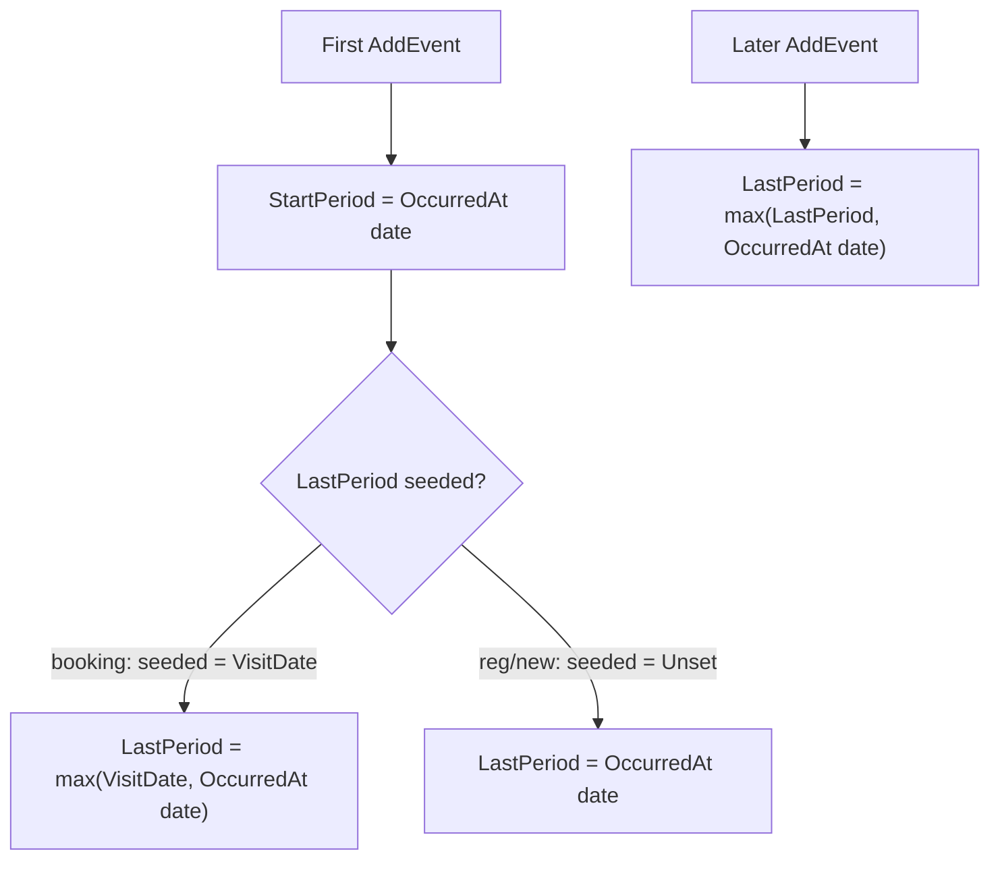

# F-01 Implementation Report — Explicit Tracking Period

**Artifact status:** Implementation summary (closed)
**Bounded context:** Patient Tracker / Admisi Antrian
**Authoritative domain:** [`TRACKER-DOMAIN.md`](TRACKER-DOMAIN.md)
**Source gap:** F-01 in [`tracker-codebase-gap-report.md`](tracker-codebase-gap-report.md)
**Commit:** `aa449aeb` — "Add StartPeriod/LastPeriod to PasienTracker for journey eligibility (F-01)"
**Branch:** `jude-refactor-tracker`
**Rules closed:** BR-TRK-005, BR-TRK-006, BR-TRK-007, BR-TRK-008; foundation for BR-TRK-021

---

## 1. TL;DR for agents

The `PasienTracker` aggregate now owns an explicit **Tracking Period** (`StartPeriod`, `LastPeriod`) instead of a single `VisitDate`.

- `StartPeriod` = calendar date of the **first** Tracker Event; never rewritten.
- `LastPeriod` = initialized per source rule, then extended forward-only as evidence is appended.
- `VisitDate` is **retained unchanged** as a legacy/compatibility field (no rename, no removal).
- Candidate/duplicate listing now uses **period overlap** (`StartPeriod <= @Tgl2 AND LastPeriod >= @Tgl1`) instead of `VisitDate BETWEEN`.

This slice is **additive**: new nullable-free columns with defaults, evidence-based backfill, no destructive schema change. It does not implement append-only event persistence (F-03), Journey Resolution (F-04), identity stability across cancel/reschedule (F-02), or milestone separation (F-07) — those are separate commits later in the series.

---

## 2. Domain rules encoded

| Rule | Behavior implemented | Where |
|---|---|---|
| BR-TRK-005 | `StartPeriod` = date of first Tracker Event; set once on first `AddEvent`, never changed | `PasienTrackerModel.AddEvent` |
| BR-TRK-006 | Booking create: `LastPeriod = max(StartPeriod, VisitDate)` where `VisitDate = TglBerobat` | `PasienTrackerModel.Create(BookingModel)` + `AddEvent` |
| BR-TRK-007 | Non-booking create: `LastPeriod` initially equals `StartPeriod` | `PasienTrackerModel.Create(RegModel)` + `AddEvent` |
| BR-TRK-008 | `AddEvent`: `LastPeriod = max(current, OccurredAt.date)`; never moves backward | `PasienTrackerModel.AddEvent` |
| BR-TRK-021 (foundation) | Temporal eligibility = relevant date inclusively in `[StartPeriod, LastPeriod]` | `PasienTrackerDal.ListData` overlap predicate |

### Period derivation logic

Implementation detail: the constructor seeds `LastPeriod` (booking → `VisitDate`, reg/new → `UnsetPeriod = DateOnly.MinValue`). `AddEvent` treats `UnsetPeriod` as "take the event date", otherwise takes `max`. This keeps all period logic inside the aggregate — the repository does no derivation.

---

## 3. Files changed

### Domain
- [`PasienTrackerModel.cs`](../../../src/bilreg/Bilreg.Domain/AdmisiContext/AntrianFeature/PasienTrackerModel.cs)
  - Constructor extended with `startPeriod` / `lastPeriod`.
  - `StartPeriod` / `LastPeriod` exposed as `{ get; private set; }`; `VisitDate` kept as `init`.
  - `Create(BookingModel)`, `Create(RegModel)`, `Default`, `Key` updated.
  - `AddEvent` sets `StartPeriod` on first evidence and extends `LastPeriod` forward-only.
  - Note: a third factory `Create(PersonType, visitDate, eventName, reffId, occurredAt)` on this file was added later by **F-04** (candidate/new-tracker establishment); it reuses the same period logic.

### Application contract
- [`IPasienTrackerRepo.cs`](../../../src/bilreg/Bilreg.Application/AdmisiContext/AntrianFeature/IPasienTrackerRepo.cs)
  - `PasienTrackerView` extended with `StartPeriod` and `LastPeriod` (kept `VisitDate`).

### Persistence (Infrastructure)
- [`PasienTrackerDto.cs`](../../../src/bilreg/Bilreg.Infrastructure/AdmisiContext/AntrianFeature/PasienTrackerDto.cs) — maps both period fields (`DateOnly ↔ DateTime` at midnight).
- [`PasienTrackerDal.cs`](../../../src/bilreg/Bilreg.Infrastructure/AdmisiContext/AntrianFeature/PasienTrackerDal.cs) — Insert/Update/GetData/ListData include the new columns; `ListData` switched to the overlap predicate.
- [`PasienTrackerRepo.cs`](../../../src/bilreg/Bilreg.Infrastructure/AdmisiContext/AntrianFeature/PasienTrackerRepo.cs) — projects periods into `PasienTrackerView`. The header `Update` already runs on every `SaveChanges`, so later `LastPeriod` extensions persist without repo redesign.

### SQL (Bilreg.SqlDb)
- [`BILRG_PasienTracker.sql`](../../../src/bilreg/Bilreg.SqlDb/AdmisiContext/AntrianFeature/BILRG_PasienTracker.sql) — greenfield DDL adds `StartPeriod`, `LastPeriod` (`DATETIME NOT NULL DEFAULT '3000-01-01'`) and index `IX_BILRG_PasienTracker_TrackingPeriod (StartPeriod, LastPeriod)`.
- [`BILRG_PasienTracker_M1_TrackingPeriod_Alter.sql`](../../../src/bilreg/Bilreg.SqlDb/AdmisiContext/AntrianFeature/BILRG_PasienTracker_M1_TrackingPeriod_Alter.sql) — **new** idempotent migration for existing DBs: `IF COL_LENGTH ... ADD`, evidence-based backfill, guarded index create.
- [`Bilreg.SqlDb.sqlproj`](../../../src/bilreg/Bilreg.SqlDb/Bilreg.SqlDb.sqlproj) — registers the alter as `<None>` alongside the other AntrianFeature scripts.

### Tests (Bilreg.Test)
- [`PasienTrackerModelTest.cs`](../../../src/bilreg/Bilreg.Test/AdmisiContext/AntrianFeature/PasienTrackerModelTest.cs) — period derivation + non-shrinking extension (UT2–UT7). UT8/UT9 added later by F-02/F-04.
- [`PasienTrackerDalTest.cs`](../../../src/bilreg/Bilreg.Test/AdmisiContext/AntrianFeature/PasienTrackerDalTest.cs) — faker/round-trip updated for new columns; overlap `ListData` case.
- [`PasienTrackerEventDalTest.cs`](../../../src/bilreg/Bilreg.Test/AdmisiContext/AntrianFeature/PasienTrackerEventDalTest.cs) — faker key aligned to new constructor via `PasienTrackerModel.Key`.

---

## 4. Before / after

| Aspect | Before (pre-F-01) | After (F-01) |
|---|---|---|
| Period state | single `VisitDate` (`DateOnly`) | `VisitDate` + `StartPeriod` + `LastPeriod` |
| First-evidence truth | not retained separately | `StartPeriod` fixed from first event date |
| Cross-date booking | `VisitDate` only | `[StartPeriod .. LastPeriod]` spans booking→visit |
| Later evidence | never affected any period | extends `LastPeriod` forward-only |
| Candidate/duplicate query | `VisitDate BETWEEN @Tgl1 AND @Tgl2` | `StartPeriod <= @Tgl2 AND LastPeriod >= @Tgl1` |
| Table | `BILRG_PasienTracker(... VisitDate ...)` | `+ StartPeriod, LastPeriod, IX_..._TrackingPeriod` |

---

## 5. Migration & backfill

Run [`BILRG_PasienTracker_M1_TrackingPeriod_Alter.sql`](../../../src/bilreg/Bilreg.SqlDb/AdmisiContext/AntrianFeature/BILRG_PasienTracker_M1_TrackingPeriod_Alter.sql) on existing databases before exercising DAL integration tests.

Backfill rules (evidence-based, deterministic; `VisitDate` never rewritten):

- `StartPeriod` = `MIN(BILRG_PasienTrackerEvent.EventDate)` for the tracker, else `VisitDate`.
- `LastPeriod` = `MAX(VisitDate, MAX(EventDate))`, else `VisitDate`.

Properties:
- Idempotent — `COL_LENGTH` guards the `ADD`; index create is `IF NOT EXISTS`; the `UPDATE` only touches rows still at the `'3000-01-01'` default.
- Additive — no column drop/rename; `VisitDate` and its index remain.

---

## 6. Verification

- `dotnet test ... --filter FullyQualifiedName~PasienTrackerModelTest` → **passed** (period rules BR-TRK-005..008, non-shrinking `LastPeriod`).
- `dotnet build src/bilreg/Bilreg.Test/Bilreg.Test.csproj` → **0 errors**.
- DAL/EventDal integration tests require a live test DB with the M1 alter applied.

---

## 7. Downstream consumers & caveats for future work

- **F-04 (Journey Candidate Resolution)** builds directly on `ListData`'s period-overlap predicate and the `StartPeriod`/`LastPeriod` fields on `PasienTrackerView`. Any change to overlap semantics here affects candidate eligibility.
- **`VisitDate` is intentionally still present.** Do not treat it as redundant; the index `IX_BILRG_PasienTracker_VisitDate` and legacy read paths still depend on it. Removal is a separate compatibility decision (see [`TRACKER-COMPATIBILITY.md`](TRACKER-COMPATIBILITY.md)).
- **`AddEvent` uses `OccurredAt` as-is.** If `occurredAt = default` (`DateTime.MinValue`) is passed, `StartPeriod`/`LastPeriod` derive from `MinValue`. Callers must supply the source business time (`ITglJamProvider.Now`); this is enforced at call sites, not inside `AddEvent`. Event append-only durability is addressed by F-03, not here.
- **Sentinels:** `UnsetPeriod = DateOnly.MinValue` (internal seed marker only, never persisted after first event); `Default`/`Key` use `3000-01-01` consistent with existing table defaults.

---

## 8. Related artifacts

- Domain spec: [`TRACKER-DOMAIN.md`](TRACKER-DOMAIN.md) §7.1, §8.1
- Gap report finding: [`tracker-codebase-gap-report.md`](tracker-codebase-gap-report.md) §5 F-01
- Compatibility contract: [`TRACKER-COMPATIBILITY.md`](TRACKER-COMPATIBILITY.md)
