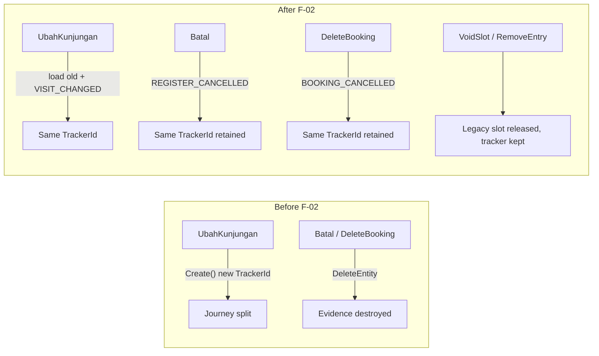

# F-02 Implementation Report — Stable Journey Identity

**Artifact status:** Implementation summary (closed)
**Bounded context:** Patient Tracker / Admisi Antrian
**Authoritative domain:** [`TRACKER-DOMAIN.md`](TRACKER-DOMAIN.md)
**Source gap:** F-02 in [`tracker-codebase-gap-report.md`](tracker-codebase-gap-report.md) (Severity: Critical)
**Commit:** `27dad573` — "Keep PasienTrackerId stable across visit change and cancellations (F-02)"
**Parent commit:** `aa449aeb` (F-01) · **Branch:** `jude-refactor-tracker`
**Rules closed:** BR-TRK-001, BR-TRK-002, BR-TRK-009 · **Rules added to domain:** BR-TRK-009a, BR-TRK-009b, BR-TRK-009c

---

## 1. TL;DR for agents

Three workflows used to **break one logical journey into multiple `TrackerId`s or destroy Tracker evidence entirely**. They are now identity-stable and append-only:

| Workflow | Before (broken) | After (F-02) |
|---|---|---|
| Visit change (`RegJalanUbahKunjungan`) | `PasienTrackerModel.Create(reg)` → **new** `TrackerId`, then `_trackerRepo.DeleteEntity(newKey)` | Loads the old queue entry's tracker, appends `VISIT_CHANGED`, **reuses** the same `TrackerId` |
| Registration cancel (`RegJalanBatal`) | `_pasienTrackerRepo.DeleteEntity(trackerKey)` | Appends `REGISTER_CANCELLED`, **retains** the tracker |
| Booking delete (`DeleteBookingWorkflow`) | `_pasienTrackerRepo.DeleteEntity(...)` | Appends `BOOKING_CANCELLED`, **retains** the tracker |

Legacy slot release (`AntrianMap.VoidSlot`) and queue-entry removal (`AntrianModel.RemoveEntry`) are **unchanged** — they run exactly as before. F-02 only decouples them from Tracker deletion (BR-TRK-009c).

This slice is behavior-only inside three Application use-cases plus one new domain-adjacent helper. **No schema change, no DAL change.** It depends on F-01 (period fields already present) and is made durable by **F-03** (append-only event persistence).

---

## 2. Domain rules encoded

| Rule | Behavior implemented | Where |
|---|---|---|
| BR-TRK-001 | One tracker = one logical journey; visit change no longer forks a second tracker | `RegJalanUbahKunjunganCmd.ResolveTrackerForVisitChange` |
| BR-TRK-002 | `TrackerId` stays stable; identity snapshot not re-minted | `PasienTrackerStableIdentity.ForVisitChange` |
| BR-TRK-009 | Source-transaction lifecycle events (reschedule/cancel/delete) never replace `TrackerId` | all three use-cases |
| **BR-TRK-009a** (new) | `TrackerId` immutable across visit change, registration cancellation, booking deletion — append events, never delete the aggregate | domain doc §7.1 + all three use-cases |
| **BR-TRK-009b** (new) | Canonical event descriptions/references for these workflows (`VISIT_CHANGED`/RegId, `REGISTER_CANCELLED`/RegId, `BOOKING_CANCELLED`/BookingId) | domain doc §7.1 |
| **BR-TRK-009c** (new) | Legacy slot / queue-entry cleanup is independent of Tracker retention | domain doc §7.1 |

### Cancellation / reschedule evidence policy

`TRACKER-DOMAIN.md` did not define cancel/reschedule states (gap report §7.1). Per the F-02 *Recommended Direction*, this slice **defines and appends** operational evidence rather than deleting history:



---

## 3. Files changed

### Domain documentation
- [`TRACKER-DOMAIN.md`](TRACKER-DOMAIN.md) §7.1 — added `BR-TRK-009a/b/c` (immutability, event table, slot-release independence).

### New Application helper
- [`PasienTrackerStableIdentity.cs`](../../../src/bilreg/Bilreg.Application/AdmisiContext/AntrianFeature/PasienTrackerStableIdentity.cs) — **new** static helper, single source of truth for identity stability:
  - `IsRealTrackerId(string?)` — sentinel guard (`null` / `""` / `"-"` are not real).
  - `ForVisitChange(existingTracker, reg, occurredAt)` — reuse-or-create + append `VISIT_CHANGED`.

### Application use-cases (behavior only)
- [`RegJalanUbahKunjunganCmd.cs`](../../../src/bilreg/Bilreg.Application/AdmisiContext/RegFeature/UseCases/RegJalanUbahKunjunganCmd.cs)
  - `LoadAntrianOldContext` extended to also return the old queue entry's `IPasienTrackerKey`.
  - BUILD resolves the tracker via `ResolveTrackerForVisitChange(oldTrackerKey, reg, occurredAt)` instead of `PasienTrackerModel.Create(reg)`.
  - `VoidAntrian` signature reduced to `(AntrianModel, int noUrut)` — the `_trackerRepo.DeleteEntity(...)` call was **removed**; it still does `RemoveEntry` + save.
- [`RegJalanBatalCmd.cs`](../../../src/bilreg/Bilreg.Application/AdmisiContext/RegFeature/UseCases/RegJalanBatalCmd.cs)
  - `VoidAntrian(ctx, regId, occurredAt)` — removed `DeleteEntity`; loads tracker, appends `REGISTER_CANCELLED`, `SaveChanges`.
  - Compliance `AuditLog` creation unchanged (BR-TRK-050).
- [`DeleteBookingWorkflow.cs`](../../../src/bilreg/Bilreg.Application/AdmisiContext/BookingFeature/DeleteBookingWorkflow.cs)
  - Injected `ITglJamProvider` for source business time.
  - New `RetainTrackerWithCancellation(entry, bookingId, occurredAt)` — replaces `DeleteEntity` with load + `BOOKING_CANCELLED` + `SaveChanges`.
  - Booking delete, `AntrianMap.VoidSlot`, and `RemoveEntry` all unchanged.

### Tests (Bilreg.Test)
- [`PasienTrackerStableIdentityTest.cs`](../../../src/bilreg/Bilreg.Test/AdmisiContext/AntrianFeature/PasienTrackerStableIdentityTest.cs) — **new**; reuse-existing keeps id + `VISIT_CHANGED`; no-existing falls back to `Create` (`REGISTER`, `VISIT_CHANGED`).
- [`DeleteBookingWorkflowTest.cs`](../../../src/bilreg/Bilreg.Test/AdmisiContext/BookingFeature/DeleteBookingWorkflowTest.cs) — **new**; asserts `DeleteEntity` never called, booking deleted once, `BOOKING_CANCELLED` saved with stable id.
- [`RegJalanBatalHandlerTest.cs`](../../../src/bilreg/Bilreg.Test/AdmisiContext/RegFeature/RegJalanBatalHandlerTest.cs) — **new**; asserts tracker retained, `REGISTER_CANCELLED` appended, queue/reg saved, audit written once.
- [`PasienTrackerModelTest.cs`](../../../src/bilreg/Bilreg.Test/AdmisiContext/AntrianFeature/PasienTrackerModelTest.cs) — added `UT8`: `TrackerId` stable across `VISIT_CHANGED` → `REGISTER_CANCELLED` → `BOOKING_CANCELLED`.

---

## 4. Behavioral contract (what callers can now rely on)

- A registration's `TrackerId` observed before a visit change equals the `TrackerId` on the new physician queue entry after it.
- Cancelling a registration or deleting a booking leaves the `PasienTracker` header + event history readable; a cancellation event with the correct source reference is appended.
- A stored queue entry or external reference never points at a deleted tracker as a result of these three flows.
- Sentinel trackers (`"-"`) are skipped safely: no load, no event, no throw (`IsRealTrackerId` guard).

---

## 5. Verification

Focused suite (mock repos; no DB required):

```text
dotnet test src/bilreg/Bilreg.Test/Bilreg.Test.csproj --filter "FullyQualifiedName~DeleteBookingWorkflowTest|FullyQualifiedName~RegJalanBatalHandlerTest|FullyQualifiedName~PasienTrackerStableIdentityTest|FullyQualifiedName~PasienTrackerModelTest"
```

Result at commit time: **passed** (identity stability, `DeleteEntity` never invoked on the three paths, correct cancellation events).
Caveat: `PasienTrackerDalTest` (integration) requires a live test DB with the F-01 `M1_TrackingPeriod` alter applied; unrelated to F-02 behavior.

---

## 6. Scope boundaries

**In scope:** identity stability + cancellation/reschedule evidence for the three named workflows; the `PasienTrackerStableIdentity` helper; `BR-TRK-009a/b/c` documentation.

**Explicitly out of scope (handled elsewhere):**
- Append-only event durability — the repo still diffed delete/update at F-02 time; fixed by **F-03** (`1ac10bf7`). The retained evidence from F-02 only becomes tamper-safe once F-03 lands.
- Registration-vs-consultation milestone semantics (`Serve` at registration) — **F-07** (`3def0ded`).
- A formal Queue Entry `Void`/`Cancelled` status — F-02 still uses physical `RemoveEntry`.
- Walk-in / booking **create** paths — they correctly establish a new `TrackerId` and were left as-is.

---

## 7. Downstream consumers & caveats for future work

- **`PasienTrackerStableIdentity.IsRealTrackerId` became the canonical sentinel guard** and is now reused by later slices — `AdmissionQueueIdentify`, `AdmissionQueueComplete`, `PhysicianQueueEvidence` (F-08), `PharmacyQueueEvidence` (F-09), and `RegJalanWalkInCommand`. Changing its sentinel rules affects all of them.
- **`VoidAntrian` in `RegJalanUbahKunjungan`/`RegJalanBatal` no longer touches the tracker repo.** Any future need to react to cancellation on the Tracker side must go through `AddEvent`, never `DeleteEntity`.
- **Business time is caller-supplied.** `DeleteBookingWorkflow` now takes `ITglJamProvider`; the cancellation events use `occurredAt`, not `DateTime.MinValue`. Preserve this when refactoring (BR-TRK-019).
- **Legacy compatibility preserved:** `AntrianMap` slot release and EMR/queue projections are unchanged; see [`TRACKER-COMPATIBILITY.md`](TRACKER-COMPATIBILITY.md).

---

## 8. Related artifacts

- Domain spec: [`TRACKER-DOMAIN.md`](TRACKER-DOMAIN.md) §7.1 (BR-TRK-001/002/009 + 009a/b/c)
- Gap report finding: [`tracker-codebase-gap-report.md`](tracker-codebase-gap-report.md) §5 F-02
- Prior slice: [`tracker-f01-implementation-report.md`](tracker-f01-implementation-report.md)
- Compatibility contract: [`TRACKER-COMPATIBILITY.md`](TRACKER-COMPATIBILITY.md)
