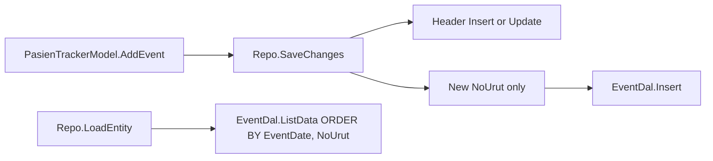

# F-03 Implementation Report — Append-Only Tracker Event Persistence

**Artifact status:** Implementation summary (closed)
**Bounded context:** Patient Tracker / Admisi Antrian
**Authoritative domain:** [`TRACKER-DOMAIN.md`](TRACKER-DOMAIN.md)
**Source gap:** F-03 in [`tracker-codebase-gap-report.md`](tracker-codebase-gap-report.md) (Severity: Critical)
**Commit:** `1ac10bf7` — `fix(pasien-tracker): make Tracker Event persistence append-only (F-03)`
**Parent commit:** `27dad573` (F-02) · **Next commit in series:** `ab93e77f` (F-04)
**Branch series:** `jude-refactor-tracker` (F-01 → F-13)
**Rules closed:** BR-TRK-017, BR-TRK-018, BR-TRK-019 (OccurredAt preserved as `EventDate`; no rewrite path)

---

## 1. TL;DR for agents

Before F-03, Tracker Event persistence **mutated history**: `PasienTrackerRepo.SaveChanges` sync-compared events and ran Insert/Update/Delete; `Update` targeted every row for a tracker; aggregate `Delete` executed `SELECT` (orphans); reads had no `ORDER BY`; PK `(PasienTrackerId, EventDate)` blocked equal timestamps.

After F-03:

| Concern | Rule for agents |
|---|---|
| Persist new evidence | `model.AddEvent(...)` then `_trackerRepo.SaveChanges(model)` — **insert-only** for events |
| Mutate / rewrite an event | **Forbidden** — no Update API on `IPasienTrackerEventDal` |
| Delete tracker / events | **Forbidden** — `DeleteEntity` throws `NotSupportedException`; cancel via append (F-02) |
| Recorded-order identity | `NoUrut` (max+1 in aggregate); SQL PK `(PasienTrackerId, NoUrut)` |
| Timeline order | `ORDER BY EventDate, NoUrut` (BR-TRK-018) |
| Equal `OccurredAt` | Allowed once M2 PK is applied on the target DB |
| Orphan events | Profile only in M2; **never auto-delete** |

This slice makes F-02 cancellation/reschedule appends **durable**. Later slices that append milestones (F-05 identify, F-07/F-08 consultation, F-09 pharmacy) all depend on this persistence contract.



---

## 2. Domain rules encoded

| Rule | Behavior implemented | Where |
|---|---|---|
| BR-TRK-017 | Events cumulative; save never removes/replaces prior rows | `PasienTrackerRepo.SaveChanges`; DAL has no Update/Delete |
| BR-TRK-018 | Chronological by `OccurredAt` (`EventDate`) with deterministic tie via `NoUrut` | `PasienTrackerEventDal.ListData`; PK `(PasienTrackerId, NoUrut)` |
| BR-TRK-019 | Source business time stored as `EventDate`; no rewrite path | Insert-only; callers still must pass real `occurredAt` (F-02+) |

### Persistence contract

```text
Header: upsert on SaveChanges (period / snapshot may change — F-01 LastPeriod extension).
Events: insert rows whose NoUrut is absent in DB; never update; never delete.
DeleteEntity(IPasienTrackerKey): throws NotSupportedException.
```

`NoUrut` is assigned in-memory by `PasienTrackerModel.AddEvent` (`max(existing)+1`). F-03 does **not** introduce a separate Event ULID — recorded order reuses the existing sequence column (same pattern as IGD `NoEvent` / `DATABASE.md` §17).

---

## 3. Files changed (exactly commit `1ac10bf7`)

### SQL (Bilreg.SqlDb)
- [`BILRG_PasienTrackerEvent.sql`](../../../src/bilreg/Bilreg.SqlDb/AdmisiContext/AntrianFeature/BILRG_PasienTrackerEvent.sql) — greenfield PK changed from `(PasienTrackerId, EventDate)` to `(PasienTrackerId, NoUrut)`.
- [`BILRG_PasienTrackerEvent_M2_AppendOnlyKey_Alter.sql`](../../../src/bilreg/Bilreg.SqlDb/AdmisiContext/AntrianFeature/BILRG_PasienTrackerEvent_M2_AppendOnlyKey_Alter.sql) — **new** idempotent alter for existing DBs.
- [`Bilreg.SqlDb.sqlproj`](../../../src/bilreg/Bilreg.SqlDb/Bilreg.SqlDb.sqlproj) — registers M2 as `<None Include=...>`.

### Infrastructure
- [`PasienTrackerEventDal.cs`](../../../src/bilreg/Bilreg.Infrastructure/AdmisiContext/AntrianFeature/PasienTrackerEventDal.cs)
  - Interface: `IInsert` + `IListData` + `GetData` only.
  - Removed `IUpdate`, `IDelete`, per-row `Delete(string,int)`, and broken aggregate `Delete` (`SELECT`).
  - `ListData`: `ORDER BY EventDate, NoUrut`.
- [`PasienTrackerRepo.cs`](../../../src/bilreg/Bilreg.Infrastructure/AdmisiContext/AntrianFeature/PasienTrackerRepo.cs)
  - `SaveChanges`: header upsert unchanged; events = insert missing `NoUrut` only.
  - Removed `CompareCollections` / `AreEqual`.
  - `DeleteEntity`: throws `NotSupportedException` (append-only message).

### Tests (Bilreg.Test)
- [`PasienTrackerEventDalTest.cs`](../../../src/bilreg/Bilreg.Test/AdmisiContext/AntrianFeature/PasienTrackerEventDalTest.cs) — drop Update/Delete-all; add ordered list + equal-`EventDate` insert (uses in-transaction `EnsureAppendOnlyPrimaryKey` so shared test DB need not be permanently migrated).
- [`PasienTrackerRepoTest.cs`](../../../src/bilreg/Bilreg.Test/AdmisiContext/AntrianFeature/PasienTrackerRepoTest.cs) — **new** Moq suite: first save inserts header+event; append inserts only new `NoUrut`; load preserves order; `DeleteEntity` throws and never calls header `Delete`.

---

## 4. Before / after

| Aspect | Before (pre-F-03) | After (F-03 @ `1ac10bf7`) |
|---|---|---|
| Save strategy | Sync-compare: insert + update + delete by `NoUrut` | Insert-only for events whose `NoUrut` is new |
| Event DAL | Full CRUD | Insert + GetData + ordered ListData |
| `Update` predicate | `WHERE PasienTrackerId = @id` only (all rows) | Method removed |
| Aggregate event delete | Executed `SELECT` (orphans) | Method removed; repo `DeleteEntity` throws |
| Load order | Unordered | `EventDate`, then `NoUrut` |
| SQL PK | `(PasienTrackerId, EventDate)` | `(PasienTrackerId, NoUrut)` |
| Equal timestamps | PK collision | Allowed after M2 |
| Orphans | Accidental; no profile | M2 reports orphans; no auto purge |

---

## 5. Migration & deploy

Run [`BILRG_PasienTrackerEvent_M2_AppendOnlyKey_Alter.sql`](../../../src/bilreg/Bilreg.SqlDb/AdmisiContext/AntrianFeature/BILRG_PasienTrackerEvent_M2_AppendOnlyKey_Alter.sql) on each existing database **before** relying on equal-`EventDate` inserts in production/integration.

Script behavior:
1. **Profile (read-only):** orphan events (no header); duplicate `(PasienTrackerId, NoUrut)`.
2. **If duplicates exist:** renumber within tracker by `EventDate`, then old `NoUrut` (join on `EventDate` under old PK uniqueness).
3. **Guarded PK swap:** only when current PK still includes `EventDate`; then `PRIMARY KEY (PasienTrackerId, NoUrut)`.
4. **Never** deletes orphan rows — reconciliation is a separate operational decision.

Idempotent: re-running after PK is already on `NoUrut` is a no-op for the alter batch.

---

## 6. Verification

Focused suite at commit time:

```text
dotnet test src/bilreg/Bilreg.Test/Bilreg.Test.csproj --filter "FullyQualifiedName~PasienTrackerEventDalTest|FullyQualifiedName~PasienTrackerRepoTest"
```

Result: **9 passed** (5 DAL + 4 repo).

Caveats:
- DAL equal-timestamp cases temporarily ensure the append-only PK inside the ambient `TransHelper` transaction (rolls back with the test). Environments that never apply M2 will still reject equal `EventDate` outside that helper.
- Header DAL / period tests remain dependent on F-01 M1 being applied separately.

---

## 7. Position in the Tracker fix series

Git order on the tracker refactor branch (each gap ≈ one commit):

| Commit | Gap | Role relative to F-03 |
|---|---|---|
| `aa449aeb` | F-01 | Period fields; header Update still needed so `LastPeriod` extends |
| `27dad573` | F-02 | Stop deleting trackers; append cancel/reschedule events — **needs F-03 to be durable** |
| **`1ac10bf7`** | **F-03** | **This slice — append-only event store** |
| `ab93e77f` | F-04 | Candidate resolution; appends/creates trackers via same SaveChanges |
| `cb07cd59` … `bc1fe81d` | F-05 … F-13 | Later evidence/API/pharmacy/compat; all must append events, never mutate |

**Agent rule:** do not reintroduce event Update/Delete, sync-compare SaveChanges, or a successful `DeleteEntity` path. F-02 already stopped calling delete from cancel flows; F-03 makes accidental delete fail loudly.

---

## 8. Downstream consumers & caveats

- **`IPasienTrackerRepo` still declares `IDeleteEntity`.** Implementations must keep throwing; removing the interface member is a separate cleanup. Call sites must use `AddEvent` + `SaveChanges`.
- **Header upsert is intentional.** Do not treat “append-only” as “header never updates” — `StartPeriod`/`LastPeriod` and identity snapshot live on the header (F-01).
- **`ReffId` length at F-03 commit was `VARCHAR(26)`.** Later commits in the same series may widen it (e.g. queue evidence composites). Prefer current DDL over the F-03 snapshot when implementing reference formats; F-03’s contract change is the **PK and insert-only semantics**, not `ReffId` width.
- **Gap-report finding text:** the detailed F-03 bullet in [`tracker-codebase-gap-report.md`](tracker-codebase-gap-report.md) may still describe pre-fix evidence. Treat **this report + commit `1ac10bf7` + current code** as closed-source truth for append-only persistence. Overview lines that mention append-only/`NoUrut` (e.g. after F-12 docs pass) align with this close-out.
- **Orphan reconciliation is still open.** M2 only profiles. Do not add automatic orphan DELETE in a “cleanup” PR without an explicit product decision.
- **Pattern reuse:** insert-only shape mirrors `AuditLogDal`; ordered sequence PK mirrors IGD/`OpCaseStateHist`. Prefer those over resurrecting Antrian-style sync-compare for Tracker events.

---

## 9. Scope boundaries

**In scope:** event insert-only persistence; PK/`NoUrut` recorded order; ordered reads; non-destructive M2; repo `DeleteEntity` hard-block; tests.

**Explicitly out of scope (other commits):**
- Tracking Period columns — **F-01** (`aa449aeb`)
- Stable TrackerId + cancel evidence content — **F-02** (`27dad573`)
- Candidate resolution — **F-04**
- Later milestone event content (admission/consult/pharmacy) — **F-05 / F-07 / F-08 / F-09**
- Widening evidence-reference representation — later slices / F-12 persistence shape docs

---

## 10. Related artifacts

- Domain spec: [`TRACKER-DOMAIN.md`](TRACKER-DOMAIN.md) §3.2, §5 Tracker Event, BR-TRK-017..019
- Gap report finding: [`tracker-codebase-gap-report.md`](tracker-codebase-gap-report.md) §5 F-03; recommended sequence §8 step 3
- Prior / next slices: [`tracker-f01-implementation-report.md`](tracker-f01-implementation-report.md), [`tracker-f02-implementation-report.md`](tracker-f02-implementation-report.md), [`tracker-f04-implementation-report.md`](tracker-f04-implementation-report.md)
- Compatibility: [`TRACKER-COMPATIBILITY.md`](TRACKER-COMPATIBILITY.md) (slot release ≠ Tracker deletion; evidence stays cumulative)
- Operational vs audit events: [`docs/concepts/operational-events.md`](../../concepts/operational-events.md)
