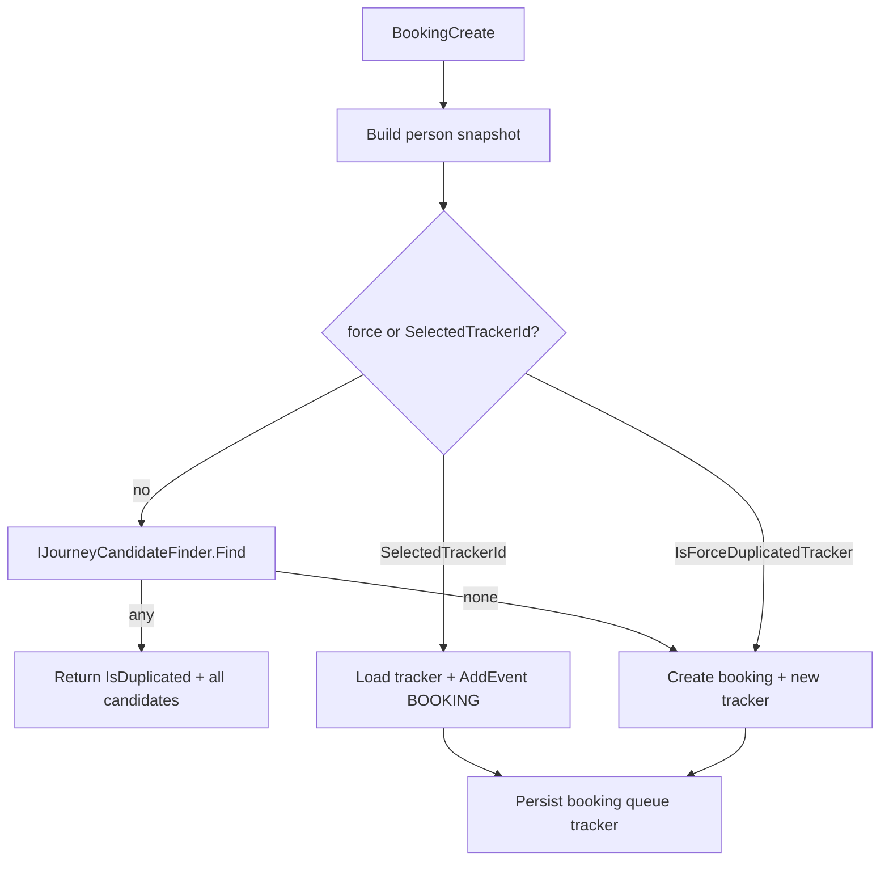

# F-04 Implementation Report — Journey Candidate Resolution

**Artifact status:** Implementation summary (closed)
**Bounded context:** Patient Tracker / Admisi Antrian
**Authoritative domain:** [`TRACKER-DOMAIN.md`](TRACKER-DOMAIN.md)
**Source gap:** F-04 in [`tracker-codebase-gap-report.md`](tracker-codebase-gap-report.md) (Severity: Critical)
**Commit:** `ab93e77f` — `fix(pasien-tracker): ganti penolakan duplikat dengan resolusi kandidat journey (F-04)`
**Parent commit:** `1ac10bf7` (F-03) · **Next commit in series:** `cb07cd59` (F-05)
**Branch series:** `jude-refactor-tracker` (F-01 → F-13)
**Rules closed:** BR-TRK-020, BR-TRK-021 (via F-01 period overlap), BR-TRK-022, BR-TRK-023, BR-TRK-024, BR-TRK-025; workflow 10.7 (candidate presentation + accountable select/new)

---

## 1. TL;DR for agents

Before F-04, Booking treated demographic matches as **hard rejection**: `ThrowExceptionIfTrackerExists` used `FirstOrDefault` on period+DOB+EYD-name matches and threw unless `IsForceDuplicatedTracker` forced a **new** tracker. Operators never saw all candidates or their evidence, and could not select an existing journey.

After F-04:

| Concern | Rule for agents |
|---|---|
| Find candidates | `IJourneyCandidateFinder.Find(name, dob, relevantDate)` — **all** EYD-name matches inside Tracking Period, each with events |
| Temporal eligibility | Reuse F-01 `ListData` overlap: `StartPeriod <= date <= LastPeriod` (BR-TRK-021) |
| Silent pick / auto-merge | **Forbidden** — never `FirstOrDefault` to decide identity (BR-TRK-022, BR-TRK-024) |
| Booking when candidates exist | Soft-duplicate: return `IsDuplicated=true` + candidates; **do not create** |
| Booking reuse existing journey | Pass `SelectedTrackerId` → load tracker, `AddEvent("BOOKING", …)`, keep same TrackerId |
| Booking establish new despite matches | `IsForceDuplicatedTracker=true` → create new tracker (explicit) |
| Standalone resolve APIs | `GET …/candidates`, `POST …/resolve/select`, `POST …/resolve/new` (see §8 for F-05 shape change) |
| Accountable actor | Commands require `UserId` |

**Business intent clarification (confirmed with domain owner):** a later booking for a **different VisitDate outside** an existing journey’s Tracking Period is a **new journey** and correctly creates a new TrackerId (candidates empty). Soft-duplicate only fires when the requested date falls **inside** an existing period (e.g. same-day double booking). Do not “fix” soft-duplicate by reusing TrackerId across control visits on later dates.



---

## 2. Domain rules encoded

| Rule | Behavior implemented | Where |
|---|---|---|
| BR-TRK-020 | Search by name, DOB, relevant business date | `JourneyCandidateFinder.Find`; `TrkJourneyCandidateListQry` |
| BR-TRK-021 | Temporal eligibility via Start/LastPeriod | `PasienTrackerDal.ListData` overlap (F-01); finder uses that `ListData` |
| BR-TRK-022 | Return every match; no silent choice | Finder returns all EYD matches; Booking soft-duplicate returns full list |
| BR-TRK-023 | Accountable operator decides | Resolve cmds + Booking create require `UserId`; select vs new / force vs SelectedTrackerId |
| BR-TRK-024 | Equal demographics ≠ merge/proof | Soft advisory only; force-new or select is explicit |
| BR-TRK-025 | Establish new when no applicable candidate | Empty finder → Booking creates new; resolve-new / force creates new |

### Name matching policy (F-04 decision)

- **Exact normalized EYD** (`ToEyd()`), same as pre-F-04 Booking duplicate gate — **not** `PersonType.IsSimilar` (Jaro-Winkler).
- Applied **after** period+DOB filter; returns **all** name matches (replaces `FirstOrDefault`).
- Gap report §7.1 still lists fuzzy/phonetic as an open product decision; changing match policy must update finder + Booking soft path together.

### Soft-duplicate Booking contract

```text
If !IsForceDuplicatedTracker && SelectedTrackerId empty
  && finder returns ≥1 candidate
    → BookingCreateResponse("-", 0, IsDuplicated=true, IsCreated=false, "-", candidates)
    → no booking / queue / tracker / EMR side effects

Else if SelectedTrackerId set
  → create booking; load tracker; AddEvent("BOOKING", bookingId, occurredAt); persist

Else (no candidates, or force)
  → create booking; PasienTrackerModel.Create(booking, occurredAt); persist
```

`SelectedTrackerId` wins over force when both are set (explicit select takes precedence in handler order: soft gate skipped when either flag/id is present; then `ResolveTracker` uses SelectedTrackerId if non-empty).

---

## 3. Files changed (exactly commit `ab93e77f`)

### Application
- [`IJourneyCandidateFinder.cs`](../../../src/bilreg/Bilreg.Application/AdmisiContext/AntrianFeature/IJourneyCandidateFinder.cs) — **new** interface + `JourneyCandidateFinder` (period ListData → EYD filter → LoadEntity for events).
- [`TrkJourneyCandidateDto.cs`](../../../src/bilreg/Bilreg.Application/AdmisiContext/AntrianFeature/TrkJourneyCandidateDto.cs) — **new** shared projection DTOs.
- [`TrkJourneyCandidateListQry.cs`](../../../src/bilreg/Bilreg.Application/AdmisiContext/AntrianFeature/TrkJourneyCandidateListQry.cs) — **new** MediatR query.
- [`TrkJourneyResolveSelectCmd.cs`](../../../src/bilreg/Bilreg.Application/AdmisiContext/AntrianFeature/TrkJourneyResolveSelectCmd.cs) — **new** (shape at `ab93e77f`: validate tracker exists + `UserId`; **no** queue association yet).
- [`TrkJourneyResolveNewCmd.cs`](../../../src/bilreg/Bilreg.Application/AdmisiContext/AntrianFeature/TrkJourneyResolveNewCmd.cs) — **new** (shape at `ab93e77f`: identity + `EventName`/`ReffId` + `UserId`; persist via new factory).
- [`BookingCreateCmd.cs`](../../../src/bilreg/Bilreg.Application/AdmisiContext/BookingFeature/UseCases/BookingCreateCmd.cs) — remove throw gate; soft-duplicate; `SelectedTrackerId`; extended response.

### Domain
- [`PasienTrackerModel.cs`](../../../src/bilreg/Bilreg.Domain/AdmisiContext/AntrianFeature/PasienTrackerModel.cs) — `Create(PersonType, visitDate, eventName, reffId, occurredAt)` for establish-new with first evidence (BR-TRK-004/025).

### API
- [`PasienTrackerController.cs`](../../../src/bilreg/Bilreg.Api/Controllers/AdmisiContext/AntrianFeature/PasienTrackerController.cs) — **new** `GET candidates`, `POST resolve/select`, `POST resolve/new`.
- [`ApplicationService.cs`](../../../src/bilreg/Bilreg.Api/Configurations/ApplicationService.cs) — register `IJourneyCandidateFinder` → `JourneyCandidateFinder`.

### Tests
- [`JourneyCandidateFinderTest.cs`](../../../src/bilreg/Bilreg.Test/AdmisiContext/AntrianFeature/JourneyCandidateFinderTest.cs) — **new**
- [`TrkJourneyResolveHandlerTest.cs`](../../../src/bilreg/Bilreg.Test/AdmisiContext/AntrianFeature/TrkJourneyResolveHandlerTest.cs) — **new**
- [`BookingCreateSoftDuplicateHandlerTest.cs`](../../../src/bilreg/Bilreg.Test/AdmisiContext/BookingFeature/BookingCreateSoftDuplicateHandlerTest.cs) — **new**
- [`PasienTrackerModelTest.cs`](../../../src/bilreg/Bilreg.Test/AdmisiContext/AntrianFeature/PasienTrackerModelTest.cs) — UT9 for person+evidence factory

**No SQL / DAL change in F-04** — relies on F-01 period columns and F-03 append-only `SaveChanges`.

---

## 4. Before / after

| Aspect | Before (pre-F-04) | After (F-04 @ `ab93e77f`) |
|---|---|---|
| Booking duplicate | `ThrowExceptionIfTrackerExists` → throw | Soft-duplicate response with all candidates + evidence |
| Match cardinality | `FirstOrDefault` (one row) | All EYD matches |
| Reuse existing TrackerId from Booking | Impossible (force always created new) | `SelectedTrackerId` + append `BOOKING` |
| Force flag | Skip throw, still always new tracker | Same create-new semantics, but after advisory UI path |
| Candidate API | None | `GET api/PasienTracker/candidates` |
| Select / new commands | None | `resolve/select`, `resolve/new` (+ `UserId`) |
| Evidence for operators | Headers only / none | Events projected on each candidate |
| `BookingCreateFromHidok` | No duplicate check | Unchanged at F-04 (still no soft-duplicate) |

---

## 5. API surface (at F-04; see §8 for later)

| Method | Route | Use case |
|---|---|---|
| GET | `api/PasienTracker/candidates?personName&tglLahir&relevantDate` | `TrkJourneyCandidateListQry` |
| POST | `api/PasienTracker/resolve/select` | `TrkJourneyResolveSelectCmd` |
| POST | `api/PasienTracker/resolve/new` | `TrkJourneyResolveNewCmd` |
| POST | `api/Booking` | `BookingCreateCmd` — response now includes `IsDuplicated`, `IsCreated`, `PasienTrackerId`, `Candidates` |

Dates on query/cmds: `yyyy-MM-dd`. Auth: `[Authorize]` on controller (same house style as other Admisi APIs).

---

## 6. Verification

Focused suite at F-04 implementation time:

```text
dotnet test src/bilreg/Bilreg.Test/Bilreg.Test.csproj --filter "FullyQualifiedName~JourneyCandidateFinderTest|FullyQualifiedName~TrkJourneyResolveHandlerTest|FullyQualifiedName~BookingCreateSoftDuplicateHandlerTest|FullyQualifiedName~PasienTrackerModelTest"
```

Result: **18 passed** (finder + resolve + Booking soft/force/select + model UT including UT9).

Caveat: resolve-handler tests at `ab93e77f` asserted the F-04 command shapes (select = tracker+UserId; new = EventName/ReffId). **F-05 changed those command contracts** — re-run current tests against HEAD, not the F-04-only assertions, when validating later work.

---

## 7. Position in the Tracker fix series

Git order on the tracker refactor branch (each gap ≈ one commit):

| Commit | Gap | Role relative to F-04 |
|---|---|---|
| `aa449aeb` | F-01 | Period overlap `ListData` — **required** for BR-TRK-021 eligibility |
| `27dad573` | F-02 | Stable TrackerId so “select existing” remains meaningful after cancel/reschedule |
| `1ac10bf7` | F-03 | Append-only events so candidate evidence and Booking `AddEvent` are durable |
| **`ab93e77f`** | **F-04** | **This slice — candidate projection + soft-duplicate + select/new** |
| `cb07cd59` | F-05 | Wires resolve select/new to anonymous admission identify + queue evidence |
| `5b7627df` | F-10 | Broader Tracker HTTP contracts (e.g. GET by id); controller grows beyond F-04 routes |
| `…` `bc1fe81d` | F-06…F-13 | Milestones, pharmacy, EMR outbox, persistence/compat |

**Agent rule:** do not restore hard throw/`FirstOrDefault` duplicate rejection on Booking. Keep soft-duplicate advisory. Do not treat EYD name+DOB as automatic identity merge.

---

## 8. Downstream consumers & caveats

- **F-05 reshaped resolve commands.** At HEAD, `TrkJourneyResolveSelectCmd` / `TrkJourneyResolveNewCmd` require `AntrianId` + `NoUrut` and call `AdmissionQueueIdentify` (anonymous → identified + evidence). F-04’s standalone “validate tracker / create tracker only” shapes were **superseded** for admission resolution. Booking soft-duplicate + `SelectedTrackerId` remain the Booking-path resolution mechanism.
- **F-10** added more routes on the same `PasienTrackerController` (e.g. GET `{pasienTrackerId}`, pharmacy evidence). Prefer current controller over the F-04-only file snapshot when documenting HTTP.
- **Gap-report finding text** for F-04 in [`tracker-codebase-gap-report.md`](tracker-codebase-gap-report.md) §5 may still describe pre-fix evidence (“throw / force”). Treat **this report + commit `ab93e77f` + current Booking soft path** as closed-source truth for Journey Candidate Resolution; F-05 closes the queue-association half of workflow 10.7.
- **`BookingCreateFromHidok`** still does not run candidate soft-duplicate (same as at F-04). Changing it is a separate product decision.
- **N+1 LoadEntity** in finder is intentional for V1 candidate set size; do not “optimize” by dropping evidence from the projection.
- **House pattern analogues:** soft-duplicate mirrors `BokGenPasienFromBookingCmd` / `OkCreateOrderOpByPasienCmd` (`IsDuplicated` / force-create). Prefer those over inventing a new rejection style.
- **DI:** `IJourneyCandidateFinder` is manually registered in `ApplicationService` (not Scrutor). Removing registration breaks Booking and candidate query.

---

## 9. Scope boundaries

**In scope at `ab93e77f`:** evidence-bearing candidate finder/query; Booking soft-duplicate + SelectedTrackerId reuse; accountable select/new commands (tracker-level); person+evidence factory; controller candidates/select/new; unit tests.

**Explicitly out of scope (other commits):**
- Tracking Period persistence — **F-01**
- Stable identity / cancel append — **F-02**
- Append-only event store — **F-03**
- Anonymous admission intake + identify + queue evidence on resolve — **F-05**
- Queue lifecycle invariants — **F-06**
- Registration vs physician milestone separation — **F-07**
- Consultation / pharmacy evidence content — **F-08 / F-09**
- Full Tracker API surface beyond F-04 routes — **F-10**
- Fuzzy name matching product policy — still open (§7.1 gap report)

---

## 10. Related artifacts

- Domain spec: [`TRACKER-DOMAIN.md`](TRACKER-DOMAIN.md) §3.4 Journey Candidate Resolution; §4.2 Journey Resolution Operator; BR-TRK-020..025; workflow §10.7
- Gap report finding: [`tracker-codebase-gap-report.md`](tracker-codebase-gap-report.md) §5 F-04; recommended sequence §8 step 5
- Prior slices: [`tracker-f01-implementation-report.md`](tracker-f01-implementation-report.md), [`tracker-f02-implementation-report.md`](tracker-f02-implementation-report.md), [`tracker-f03-implementation-report.md`](tracker-f03-implementation-report.md)
- Compatibility / later queue authority: [`TRACKER-COMPATIBILITY.md`](TRACKER-COMPATIBILITY.md), [`tracker-f13-implementation-report.md`](tracker-f13-implementation-report.md)
- Operational vs audit events: [`docs/concepts/operational-events.md`](../../concepts/operational-events.md)
