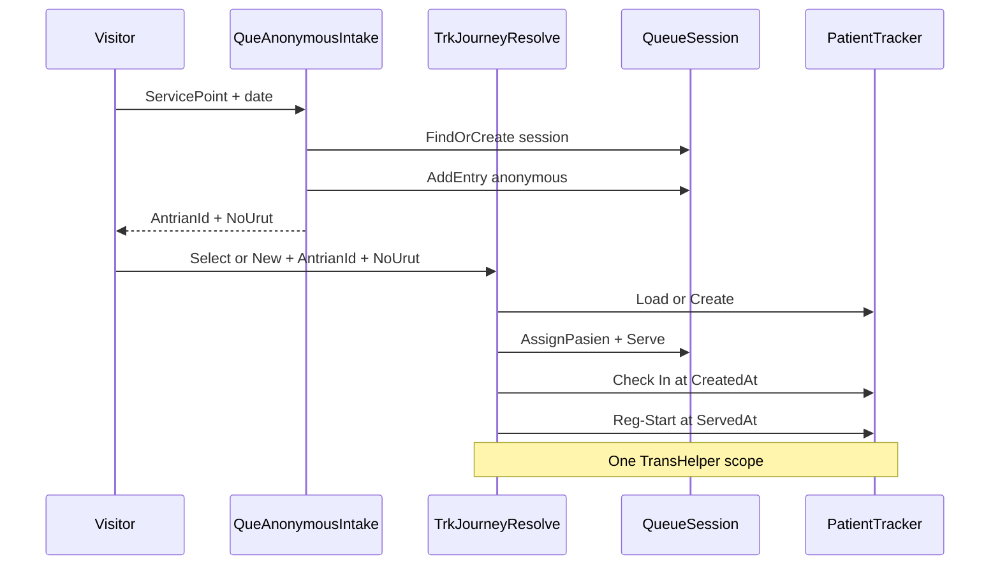

# F-05 Implementation Report — Anonymous Admission Intake & Identification

**Artifact status:** Implementation summary (closed)  
**Bounded context:** Patient Tracker / Admisi Antrian  
**Authoritative domain:** [`TRACKER-DOMAIN.md`](TRACKER-DOMAIN.md)  
**Source gap:** F-05 in [`tracker-codebase-gap-report.md`](tracker-codebase-gap-report.md) (Severity: Critical)  
**Commit:** `cb07cd59` — `feat(pasien-tracker): aktifkan anonymous admission intake & identifikasi (F-05)`  
**Parent commit:** `ab93e77f` (F-04) · **Next commit in series:** `a3232c56` (F-06)  
**Branch series:** `jude-refactor-tracker` (F-01 → F-13)  
**Rules closed:** BR-TRK-029, BR-TRK-031, BR-TRK-013 (Queue Evidence Reference for check-in / reg-start), lifecycle §8.4; workflows §10.2 and identification slice of §10.3 (through Reg-Start; Registration Done deferred)

---

## 1. TL;DR for agents

Before F-05, the **anonymous → identified** bridge did not work:

- Anonymous admission intake had only a **commented-out** handler (`QueGetNoAntrianByServicePointCmd`).
- `AssignPasien` copied **Visitor name only** and never set `Tracker` → entry stayed sentinel `PasienTrackerId = "-"`.
- `AntrianRepo.AreEqual` **omitted** `PasienTrackerId` → TrackerId-only updates would not flush.
- No `QueueEvidenceReference`; no Check In / Reg-Start append on identify.
- Event `ReffId` was `VARCHAR(26)` — too short for `{AntrianId}/No.{NoUrut}`.

After F-05:

| Concern | Rule for agents |
|---|---|
| Take anonymous admission number (10.2) | `POST api/Antrian/anonymous-intake` → `QueAnonymousIntakeCmd` — find/create Service Point session, `AddEntry(occurredAt)` only; **do not** touch Tracker / append evidence |
| Identify anonymous entry (10.3 slice) | `POST api/PasienTracker/resolve/select` or `resolve/new` with **required** `AntrianId` + `NoUrut` |
| Atomic identify orchestration | One `TransHelper` scope via `AdmissionQueueIdentify`: `AssignPasien` → `Serve(servedAt)` → Check In (`CreatedAt`) + Reg-Start (`ServedAt`) → save queue + tracker |
| Queue Evidence Reference | `QueueEvidenceReference.Create(antrianId, noUrut).Value` → `{AntrianId}/No.{NoUrut}` as event `ReffId` (BR-TRK-013) |
| AssignPasien | Must set **Tracker + Visitor**; reject sentinel tracker; reject already-identified entry |
| Persist TrackerId change | `AntrianRepo.AreEqual` includes `PasienTrackerId` |
| ReffId width | Deploy M3 alter: `BILRG_PasienTrackerEvent.ReffId` → `VARCHAR(40)` |

**Real case (walk-in “Sinta”):** 06:51 anonymous number at Loket BPJS → 06:57 operator resolves candidates (F-04) then resolve select/new identifies entry No.1, starts admission service, appends Check In @ CreatedAt and Reg-Start @ ServedAt.



---

## 2. Domain rules encoded

| Rule | Behavior implemented | Where |
|---|---|---|
| BR-TRK-029 | Anonymous Queue Entry may be created when journey unknown | `AntrianModel.AddEntry(DateTime)`; `QueAnonymousIntakeHandler` |
| BR-TRK-031 | Anonymous → Identified only after Journey Resolution | `AssignPasien` + resolve select/new require prior select/new of tracker; intake never identifies |
| BR-TRK-032 | At most one TrackerId per entry | `AssignPasien` throws if entry already has real TrackerId |
| BR-TRK-013 | Queue Evidence Reference when no primary source txn | `QueueEvidenceReference`; Check In / Reg-Start `ReffId` |
| BR-TRK-004 / 025 | New tracker established with first evidence | Resolve-new: `PasienTrackerModel.Create(..., "Check In", queueRef, entry.CreatedAt)` |
| Lifecycle 8.4 | Anonymous → Identified via resolution | `AdmissionQueueIdentify.IdentifyAndRecordEvidence` |
| Workflow 10.2 | Intake records number + CreatedAt only; no tracker evidence | `QueAnonymousIntakeHandler` saves queue only |
| Workflow 10.3 (partial) | Identify + Serve + Check In + Reg-Start | Resolve handlers + `AdmissionQueueIdentify` |

### Identification contract (agent-facing)

```text
Entry must be: anonymous (non-real TrackerId) AND Waiting
Then in one transaction:
  AssignPasien(tracker)          → TrackerId + Person snapshot
  Serve(servedAt)                → InService + ServedAt
  AddEvent("Check In", queueRef, entry.CreatedAt)   // skip if Create already added same
  AddEvent("Reg-Start", queueRef, servedAt)
  SaveChanges(queue) + SaveChanges(tracker)
```

Event description strings are free text (BR-TRK-016) but **this slice standardizes** `"Check In"` and `"Reg-Start"` (narrative / 10.3). Do not invent alternate spellings in new callers without updating `AdmissionQueueIdentify` constants.

### Queue Evidence Reference serialization (F-05 decision)

- Format: `{AntrianId}/No.{NoUrut}` (matches narrative `AN002/No.1`).
- Factory: `QueueEvidenceReference.Create` — non-empty AntrianId, `NoUrut > 0`.
- Gap report §7.1 still lists serialization/versioning as an open product ambiguity; **do not change format** without a migration for existing event rows and an update to this report.

---

## 3. Files changed (exactly commit `cb07cd59`)

18 paths: 6 added, 11 modified, 1 deleted.

### Domain
- [`AntrianEntryModel.cs`](../../../src/bilreg/Bilreg.Domain/AdmisiContext/AntrianFeature/AntrianEntryModel.cs) — `AssignPasien` sets `Tracker` + `Visitor`; guards sentinel / already-identified.
- [`AntrianModel.cs`](../../../src/bilreg/Bilreg.Domain/AdmisiContext/AntrianFeature/AntrianModel.cs) — anonymous `AddEntry(DateTime)` returns `AntrianEntryModel`.
- [`QueueEvidenceReference.cs`](../../../src/bilreg/Bilreg.Domain/AdmisiContext/AntrianFeature/QueueEvidenceReference.cs) — **new** VO.

### Application
- [`QueAnonymousIntakeCmd.cs`](../../../src/bilreg/Bilreg.Application/AdmisiContext/AntrianFeature/QueAnonymousIntakeCmd.cs) — **new** intake command/handler.
- [`AdmissionQueueIdentify.cs`](../../../src/bilreg/Bilreg.Application/AdmisiContext/AntrianFeature/AdmissionQueueIdentify.cs) — **new** shared identify + evidence helper (`internal`).
- [`TrkJourneyResolveSelectCmd.cs`](../../../src/bilreg/Bilreg.Application/AdmisiContext/AntrianFeature/TrkJourneyResolveSelectCmd.cs) — **breaking shape:** requires `AntrianId`, `NoUrut`; loads queue; atomic identify.
- [`TrkJourneyResolveNewCmd.cs`](../../../src/bilreg/Bilreg.Application/AdmisiContext/AntrianFeature/TrkJourneyResolveNewCmd.cs) — **breaking shape:** requires `AntrianId`, `NoUrut`; drops client `EventName`/`ReffId` (derived from queue).
- [`QueGetNoAntrianByServicePointCmd.cs`](../../../src/bilreg/Bilreg.Application/AdmisiContext/AntrianFeature/QueGetNoAntrianByServicePointCmd.cs) — **deleted** (was fully commented dormant code).

### Infrastructure / SQL
- [`AntrianRepo.cs`](../../../src/bilreg/Bilreg.Infrastructure/AdmisiContext/AntrianFeature/AntrianRepo.cs) — `AreEqual` includes `PasienTrackerId`.
- [`BILRG_PasienTrackerEvent.sql`](../../../src/bilreg/Bilreg.SqlDb/AdmisiContext/AntrianFeature/BILRG_PasienTrackerEvent.sql) — greenfield `ReffId VARCHAR(40)`.
- [`BILRG_PasienTrackerEvent_M3_ReffIdWiden_Alter.sql`](../../../src/bilreg/Bilreg.SqlDb/AdmisiContext/AntrianFeature/BILRG_PasienTrackerEvent_M3_ReffIdWiden_Alter.sql) — **new** additive alter for existing DBs.
- [`Bilreg.SqlDb.sqlproj`](../../../src/bilreg/Bilreg.SqlDb/Bilreg.SqlDb.sqlproj) — registers M3 as `<None Include=...>`.

### API
- [`AntrianController.cs`](../../../src/bilreg/Bilreg.Api/Controllers/AdmisiContext/AntrianFeature/AntrianController.cs) — `POST anonymous-intake`.
- [`PasienTrackerController.cs`](../../../src/bilreg/Bilreg.Api/Controllers/AdmisiContext/AntrianFeature/PasienTrackerController.cs) — unchanged routes; **request bodies** for resolve select/new follow new command records (still `POST resolve/select`, `POST resolve/new`).

### Tests
- [`AntrianEntryAssignPasienTest.cs`](../../../src/bilreg/Bilreg.Test/AdmisiContext/AntrianFeature/AntrianEntryAssignPasienTest.cs) — **new** (AssignPasien + QueueEvidenceReference + anonymous AddEntry).
- [`QueAnonymousIntakeHandlerTest.cs`](../../../src/bilreg/Bilreg.Test/AdmisiContext/AntrianFeature/QueAnonymousIntakeHandlerTest.cs) — **new**
- [`AntrianRepoAreEqualTest.cs`](../../../src/bilreg/Bilreg.Test/AdmisiContext/AntrianFeature/AntrianRepoAreEqualTest.cs) — **new**
- [`TrkJourneyResolveHandlerTest.cs`](../../../src/bilreg/Bilreg.Test/AdmisiContext/AntrianFeature/TrkJourneyResolveHandlerTest.cs) — rewritten for identify orchestration.
- [`AntrianEntryModelTest.cs`](../../../src/bilreg/Bilreg.Test/AdmisiContext/AntrianFeature/AntrianEntryModelTest.cs) — Serve/Done timestamps fixed (stale defaults).

---

## 4. Before / after

| Aspect | Before (pre-F-05) | After (F-05 @ `cb07cd59`) |
|---|---|---|
| Anonymous intake API | Commented dead code | `POST api/Antrian/anonymous-intake` |
| Intake → Tracker | Dormant code wrongly touched Default tracker | **No** tracker write at intake (10.2) |
| `AssignPasien` | Visitor name only | TrackerId + Visitor; guards |
| Resolve select/new | Tracker-only (`UserId`; new needed EventName/ReffId) | **Must** pass `AntrianId`+`NoUrut`; identify + Serve + evidence |
| Queue Evidence Reference | Missing | `{AntrianId}/No.{NoUrut}` |
| Check In / Reg-Start | Missing | Appended with CreatedAt / ServedAt |
| `AreEqual` | Skipped PasienTrackerId | Includes PasienTrackerId |
| Event `ReffId` column | `VARCHAR(26)` | `VARCHAR(40)` (+ M3 alter) |

---

## 5. API surface (F-05)

| Method | Route | Use case | Notes |
|---|---|---|---|
| POST | `api/Antrian/anonymous-intake` | `QueAnonymousIntakeCmd` | Body: `ServicePointCode`, `ServicePointName`, optional `TglYmd` (`yyyy-MM-dd`); else business date from `ITglJamProvider` |
| POST | `api/PasienTracker/resolve/select` | `TrkJourneyResolveSelectCmd` | `PasienTrackerId`, `AntrianId`, `NoUrut`, `UserId` |
| POST | `api/PasienTracker/resolve/new` | `TrkJourneyResolveNewCmd` | `PersonName`, `TglLahir`, `VisitDate`, `AntrianId`, `NoUrut`, `UserId` |
| GET | `api/PasienTracker/candidates` | `TrkJourneyCandidateListQry` | Unchanged from F-04 — find candidates **before** resolve |

Auth: `[Authorize]` on controllers (house style).

**Agent rule:** Prefer F-04 candidate list → then F-05 resolve select/new with the anonymous `AntrianId`/`NoUrut` from intake. Do not call resolve without queue keys (contract is admission-identify, not tracker-only validate).

---

## 6. Verification

Focused suite at F-05 implementation time:

```text
dotnet test src/bilreg/Bilreg.Test/Bilreg.Test.csproj --filter "FullyQualifiedName~AntrianEntryAssignPasienTest|FullyQualifiedName~QueueEvidenceReferenceTest|FullyQualifiedName~AntrianAnonymousAddEntryTest|FullyQualifiedName~QueAnonymousIntakeHandlerTest|FullyQualifiedName~TrkJourneyResolveHandlerTest|FullyQualifiedName~AntrianRepoAreEqualTest|FullyQualifiedName~AntrianEntryModelTest"
```

Result: **15 passed**.

**Deploy prerequisite:** apply `BILRG_PasienTrackerEvent_M3_ReffIdWiden_Alter.sql` (and prior M1/M2 as needed) before production identify paths write composite `ReffId` values. Deployed schema state remains **Unable to Verify** from source alone.

**Downstream note:** F-06 (`a3232c56`) hardened `Serve`/`Done` invariants (required business times, Waiting→InService→Done). F-05 already passed explicit `servedAt`; HEAD callers must not use parameterless `Serve()`/`Done()`.

---

## 7. Position in the Tracker fix series

Git order on the tracker refactor branch (each gap ≈ one commit):

| Commit | Gap | Role relative to F-05 |
|---|---|---|
| `aa449aeb` | F-01 | Tracking Period so candidates (F-04) are temporally eligible |
| `27dad573` | F-02 | Stable TrackerId so identify does not orphan history |
| `1ac10bf7` | F-03 | Append-only events so Check In / Reg-Start are durable |
| `ab93e77f` | F-04 | Candidate list + Booking soft-duplicate; resolve cmds introduced (tracker-only) |
| **`cb07cd59`** | **F-05** | **This slice — anonymous intake + resolve-as-identify + queue evidence** |
| `a3232c56` | F-06 | Queue lifecycle invariants (`Serve`/`Done` guards) |
| `3def0ded` | F-07 | Separate admission vs physician milestones; Registration Done path |
| `fb73201b`…`bc1fe81d` | F-08…F-13 | Consultation evidence, pharmacy, API surface, outbox, persistence/compat |

**Agent rule:** Do not resurrect commented `QueGetNoAntrianByServicePointCmd`. Do not “fix” identify by only updating `PersonName`. Do not append tracker evidence at anonymous intake. Do not shrink `ReffId` back to 26.

---

## 8. Downstream consumers & caveats

- **Breaking vs F-04 resolve shapes.** F-04 select/new were tracker-scoped. F-05 **superseded** them for admission: `AntrianId`+`NoUrut` required; resolve-new no longer accepts client `EventName`/`ReffId`. See [`tracker-f04-implementation-report.md`](tracker-f04-implementation-report.md) §8.
- **Registration Done / DoneAt** not closed here — workflow 10.3 completion when registration saves is **F-07** (and related evidence F-08). Do not treat Reg-Start as registration completion.
- **`IServicePointDal` / master catalogue** still absent — intake carries `ServicePointCode` + `ServicePointName` on the request (V1). Session uniqueness still via `SequenceTag` (`GenSequenceTag` + date list).
- **Physician AntrianMap** is orthogonal — admission sessions coexist; do not allocate admission numbers through the F-13 physician map adapter.
- **`UserId`** is required for accountability (BR-TRK-023) but this slice does not expand compliance `AuditLog` rows for identify — Tracker Events are operational evidence only ([`docs/concepts/operational-events.md`](../../concepts/operational-events.md)).
- **Gap-report body** for F-05 historically described pre-fix evidence; treat **this report + commit `cb07cd59`** as closed-source truth. Gap report §5 F-05 is updated to **Closed in source**.
- **F-10** may document broader Antrian/PasienTracker HTTP surface; prefer current controllers over F-05-only snapshot when listing all routes.

---

## 9. Scope boundaries

**In scope at `cb07cd59`:** AssignPasien Tracker association; anonymous intake command/API; QueueEvidenceReference; ReffId widen M3; AreEqual PasienTrackerId; resolve select/new identify orchestration (AssignPasien + Serve + Check In + Reg-Start); focused unit tests.

**Explicitly out of scope (other commits / open):**
- Journey candidate finder / Booking soft-duplicate — **F-04** (prerequisite)
- Queue Serve/Done invariant hardening — **F-06** (immediate next)
- Registration Done + physician milestone separation — **F-07**
- Consultation / pharmacy evidence — **F-08 / F-09**
- Full Tracker API expansion — **F-10**
- Service Point master DAL — deferred
- Fuzzy name matching policy — still open (§7.1 gap report)

---

## 10. Related artifacts

- Domain spec: [`TRACKER-DOMAIN.md`](TRACKER-DOMAIN.md) §3.3 Queue Coordination; §8.4 identification lifecycle; BR-TRK-013, 029, 031; workflows §10.2–10.3  
- Narrative walk-through: [`pasien-tracker-narrative-explanation.md`](pasien-tracker-narrative-explanation.md) (Skenario take number + panggil admisi)  
- Gap report finding: [`tracker-codebase-gap-report.md`](tracker-codebase-gap-report.md) §5 F-05; recommended sequence §8 step 5  
- Prior slices: [`tracker-f01-implementation-report.md`](tracker-f01-implementation-report.md), [`tracker-f02-implementation-report.md`](tracker-f02-implementation-report.md), [`tracker-f03-implementation-report.md`](tracker-f03-implementation-report.md), [`tracker-f04-implementation-report.md`](tracker-f04-implementation-report.md)  
- Later queue authority: [`TRACKER-COMPATIBILITY.md`](TRACKER-COMPATIBILITY.md), [`tracker-f13-implementation-report.md`](tracker-f13-implementation-report.md)  
- Operational vs audit events: [`docs/concepts/operational-events.md`](../../concepts/operational-events.md)
