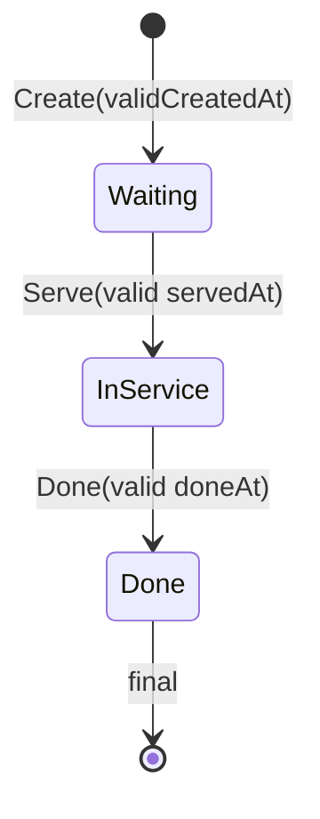

# F-06 Implementation Report — Queue Aggregate Identity & Lifecycle Invariants

**Artifact status:** Implementation summary (closed; amended for Fixed Business Date timestamp policy)
**Bounded context:** Patient Tracker / Admisi Antrian  
**Authoritative domain:** [`TRACKER-DOMAIN.md`](TRACKER-DOMAIN.md)  
**Source gap:** F-06 in [`tracker-codebase-gap-report.md`](tracker-codebase-gap-report.md) (Severity: High)  
**Commit:** `a3232c56` — `fix(antrian): tegakkan invariant Queue aggregate (F-06, BR-TRK-026..039)`  
**Parent commit:** `cb07cd59` (F-05) · **Next commit in series:** `3def0ded` (F-07)  
**Branch series:** `jude-refactor-tracker` (F-01 → F-13)  
**Rules closed:** BR-TRK-026 (Service Point owned on session), BR-TRK-027 (in-session number uniqueness in aggregate), BR-TRK-035–039 (create/serve/done lifecycle + valid-time checks + Done finality).
**Concurrency closed lightly:** unique `SequenceTag` index + existing entry PK `(AntrianId, NoUrut)` — **not** RowVersion / optimistic token.

---

## 1. TL;DR for agents

Before F-06, the Queue Session / Queue Entry aggregate **did not protect** identity and service lifecycle invariants:

- `AddEntry(int noUrut, …)` did not reject duplicate numbers in memory (only SQL PK failed late).
- `Serve()` had no Waiting/status check and could reopen **Done → In Service**.
- `Done()` checked ServedAt sentinel only, not `AntrianStatus == InService`, and rejected equal Done/Served (`ServedAt >= doneAt`).
- `Create` / `Serve` / `Done` accepted `default` / `MinValue` times (invalid durations).
- Service Point was only encoded in `SequenceTag` / description — no owned property or column.

After F-06:

| Concern | Rule for agents |
|---|---|
| Create queue entry | Always pass a **real** `createdAt` (not `default` / `MinValue` / sentinel `3000-01-01`). Status = Waiting; ServedAt/DoneAt = sentinel. |
| Start service | `entry.Serve(servedAt)` only when **Waiting**; `servedAt` must be a real business time. It may precede `CreatedAt`. |
| Complete service | `entry.Done(doneAt)` only when **InService**; `doneAt` must be a real business time. It may precede `ServedAt`. |
| After Done | **Do not** call `Serve` again — throws `InvalidOperationException` (BR-TRK-039). |
| Assign number | All `AddEntry` overloads call `EnsureUniqueNoUrut`; duplicate → `InvalidOperationException`. DB PK remains safety net. |
| Session Service Point | `AntrianModel.ServicePoint` (`ServicePointType`) required on construct/factory; persist `ServicePointCode`. |
| Lookup session | Still by `SequenceTag` (Booking/Reg/Anonymous). Unique index `UX_BILRG_Antrian_SequenceTag` after M1. |
| Rehydrate from DB | Public constructor stays **permissive** for historical bad rows; **behaviour methods** enforce rules. |
| Parameterless Serve/Done | **Removed** — callers must pass explicit business time (F-05 identify already did). |

**Real case (why it matters):** Two FO clerks almost simultaneously reserve physician queue number **7** → without aggregate guard, only a late PK error appears. Separately, after the doctor finishes (`Done`), a stray `Serve` could revive In Service and corrupt waiting-time / duration reports. F-06 makes both failures **domain-level**. Timestamp precedence is intentionally not enforced so a retained simulation dataset remains operable when Fixed Business Date changes.



---

## 2. Domain rules encoded

| Rule | Behavior implemented | Where |
|---|---|---|
| BR-TRK-026 | Session owns explicit `ServicePoint` (+ date/start/end already present) | `AntrianModel.ServicePoint`; factory sets from dokter / `ServicePointType` |
| BR-TRK-027 | Queue number unique within session | `AntrianModel.EnsureUniqueNoUrut` on every `AddEntry`; PK `(AntrianId, NoUrut)` |
| BR-TRK-035 | New entry Waiting; CreatedAt recorded; Served/Done absent (sentinel) | `AntrianEntryModel.Create` + `EnsureBusinessTime(createdAt)` |
| BR-TRK-036 | Only Waiting → In Service; records ServedAt | `Serve` status guard |
| BR-TRK-037 | Only In Service → Done; records DoneAt | `Done` status guard |
| BR-TRK-038 | Lifecycle timestamps must be valid business times | Precedence checks are intentionally omitted; reverse timestamps are accepted for Fixed Business Date simulation. |
| BR-TRK-039 | Done is final | `Serve` rejects non-Waiting (includes Done) |

### Lifecycle contract (agent-facing)

```text
Create(noUrut, …, createdAt):
  require business time; status=Waiting; ServedAt=DoneAt=sentinel(3000-01-01)

Serve(servedAt):
  require AntrianStatus == Waiting
  require business time
  → InService + ServedAt

Done(doneAt):
  require AntrianStatus == InService
  require business time
  → Done + DoneAt
```

This is a pragmatic simulation policy. `CreatedAt`, `ServedAt`, and `DoneAt` can therefore form negative waiting or service intervals. Any report, projection, integration, or tracker timeline consumer that assumes chronological timestamps must tolerate or exclude those intervals according to its own policy.

Sentinel absent milestones: `DateTime(3000, 1, 1)` — same convention as other Antrian/Tracker types. Do not treat sentinel as “served”.

### Service Point derivation (F-06 decision)

| Factory path | `ServicePointCode` | `ServicePointName` |
|---|---|---|
| Jadwal / Effective dokter | `dokter.PpaId` with spaces → `$` (matches `SequenceTag` suffix) | `"Praktek Dokter {PpaId}"` |
| `Create(ServicePointType, date)` | request code as-is | `ServicePointName` |
| Rehydrate DTO | column `ServicePointCode`, else `ServicePointCodeFromSequenceTag(SequenceTag)` | `AntrianDescription` |

`SequenceTag` format unchanged: `AN{yyMMdd}{HHmm}_{code}`. Do not reinterpret tag as the sole identity — **persist and read `ServicePointCode`**.

### Concurrency (light — not optimistic locking)

| Risk | Protection at F-06 |
|---|---|
| Duplicate session for same operational tag | `UX_BILRG_Antrian_SequenceTag` (M1 refuses create if duplicates already exist) |
| Duplicate number in one session | Aggregate guard + PK `(AntrianId, NoUrut)` |
| RowVersion / concurrency token | **Not introduced** (repo has no such pattern; deferred) |

Natural uniqueness on `(ServicePointCode, AntrianDate, StartTime, EndTime)` remains an open domain decision (§7.1.5) — see F-12 residual.

---

## 3. Files changed (commit `a3232c56`)

Primary paths (domain + persistence + focused tests). Call-site test compiles for `AntrianModel(…, ServicePoint, …)` and required `createdAt` are included in the same commit.

### Domain
- [`AntrianEntryModel.cs`](../../../src/bilreg/Bilreg.Domain/AdmisiContext/AntrianFeature/AntrianEntryModel.cs) — business-time Create; guarded Serve/Done; Done finality; equal timestamps allowed.
- [`AntrianModel.cs`](../../../src/bilreg/Bilreg.Domain/AdmisiContext/AntrianFeature/AntrianModel.cs) — `ServicePoint` property; `EnsureUniqueNoUrut`; `ServicePointCodeFromSequenceTag` helper; `AddEntry` requires `createdAt`.
- [`AntrianFactory.cs`](../../../src/bilreg/Bilreg.Domain/AdmisiContext/AntrianFeature/AntrianFactory.cs) — sets `ServicePoint` on create/load/default.

### Infrastructure
- [`AntrianDto.cs`](../../../src/bilreg/Bilreg.Infrastructure/AdmisiContext/AntrianFeature/AntrianDto.cs) — `ServicePointCode` on record; FromModel/ToModel (+ dual-read fallback from tag).
- [`AntrianDal.cs`](../../../src/bilreg/Bilreg.Infrastructure/AdmisiContext/AntrianFeature/AntrianDal.cs) — INSERT/UPDATE/SELECT include `ServicePointCode`.

### SQL
- [`BILRG_Antrian.sql`](../../../src/bilreg/Bilreg.SqlDb/AdmisiContext/AntrianFeature/BILRG_Antrian.sql) — greenfield `ServicePointCode VARCHAR(50)`.
- [`BILRG_Antrian_M1_ServicePointCode_Alter.sql`](../../../src/bilreg/Bilreg.SqlDb/AdmisiContext/AntrianFeature/BILRG_Antrian_M1_ServicePointCode_Alter.sql) — **new** additive alter + backfill + unique `SequenceTag` with duplicate THROW.
- [`Bilreg.SqlDb.sqlproj`](../../../src/bilreg/Bilreg.SqlDb/Bilreg.SqlDb.sqlproj) — registers M1 as `<None Include=...>`.

### Tests (representative)
- [`AntrianEntryModelTest.cs`](../../../src/bilreg/Bilreg.Test/AdmisiContext/AntrianFeature/AntrianEntryModelTest.cs) — Waiting-only Serve, InService-only Done, Done final, reverse timestamps accepted, reject default times.
- [`AntrianModelTest.cs`](../../../src/bilreg/Bilreg.Test/AdmisiContext/AntrianFeature/AntrianModelTest.cs) — fixed stale SequenceTag expectations (`AN{yyMMdd}{HHmm}_{code}`); ServicePoint assertions; duplicate NoUrut.
- [`AntrianDalTest.cs`](../../../src/bilreg/Bilreg.Test/AdmisiContext/AntrianFeature/AntrianDalTest.cs) — DTO shape + `EnsureServicePointCodeColumn` inside ambient transaction.
- Related compile fixes: resolve/identify, booking/reg cancel, soft-duplicate, etc. (createdAt / ServicePoint ctor).

---

## 4. Before / after

| Aspect | Before (pre-F-06) | After (F-06 @ `a3232c56`) |
|---|---|---|
| Duplicate `NoUrut` in memory | Allowed until SQL PK | `InvalidOperationException` in aggregate |
| `Serve` from Done | Allowed (reopens InService) | Rejected |
| `Done` without InService | Sentinel ServedAt check only | Requires `AntrianStatus == InService` |
| Timestamp precedence | Enforced | Not enforced; valid timestamps may be earlier than the preceding lifecycle timestamp for Fixed Business Date simulation. |
| Default / MinValue times | Accepted on Create/Serve/Done | Rejected |
| Service Point | Encoded in SequenceTag only | Model property + `ServicePointCode` column |
| Session create race | Duplicate SequenceTag possible | Unique index after M1 (if no existing dupes) |
| Optimistic RowVersion | Absent | Still absent (by design for this slice) |

---

## 5. API surface

F-06 is **domain/persistence hardening** — no new HTTP routes.

Agents must still use existing callers with **valid times**:

| Caller pattern | Time source |
|---|---|
| Anonymous intake `AddEntry` | `ITglJamProvider.Now` as CreatedAt |
| Identify `Serve` (F-05) | `servedAt` from provider in resolve handlers |
| Registration paths that `Serve` physician entry | source `occurredAt` (semantics corrected in **F-07**, not here) |
| `QueSelesaiPeriksa` `Done` | provider `Now` |

**Agent rule:** Do not reintroduce optional `Serve(DateTime servedAt = default)` / `Done(… = default)`. Any new orchestration must pass accountable business time.

---

## 6. Verification

Focused suite used when closing F-06:

```text
dotnet test src/bilreg/Bilreg.Test/Bilreg.Test.csproj --filter "FullyQualifiedName~AntrianEntryModelTest|FullyQualifiedName~AntrianFactoryTests|FullyQualifiedName~AntrianAnonymousAddEntryTest|FullyQualifiedName~AntrianRepoAreEqualTest|FullyQualifiedName~AntrianDalTest|FullyQualifiedName~TrkJourneyResolveHandlerTest|FullyQualifiedName~AntrianEntryAssignPasienTest"
```

Result at implementation time: **40 passed**. Related booking/reg compile tests also green.

**Deploy prerequisite:** apply [`BILRG_Antrian_M1_ServicePointCode_Alter.sql`](../../../src/bilreg/Bilreg.SqlDb/AdmisiContext/AntrianFeature/BILRG_Antrian_M1_ServicePointCode_Alter.sql) **before** API builds that INSERT/UPDATE/SELECT `ServicePointCode`. If duplicate `SequenceTag` rows exist, M1 **THROW**s — profile and resolve before uniqueness. Deployed schema state remains **Unable to Verify** from source alone.

**Downstream note:** F-07 (`3def0ded`) separates **which** queue entry gets `Serve`/`Done` (admission vs physician). F-06 only defines **legal transitions** on any entry. F-05 identify already supplies explicit `servedAt`; it is accepted even when it precedes `CreatedAt`, which allows retained data to be exercised under a changed Fixed Business Date.

---

## 7. Position in the Tracker fix series

Git order on the tracker refactor branch (each gap ≈ one commit):

| Commit | Gap | Role relative to F-06 |
|---|---|---|
| `aa449aeb` | F-01 | Tracking Period |
| `27dad573` | F-02 | Stable TrackerId |
| `1ac10bf7` | F-03 | Append-only events |
| `ab93e77f` | F-04 | Journey candidates |
| `cb07cd59` | F-05 | Anonymous intake + identify + Serve on admission entry |
| **`a3232c56`** | **F-06** | **This slice — aggregate guards + ServicePointCode + light uniqueness** |
| `3def0ded` | F-07 | Do not Serve physician at registration; admission Done |
| `fb73201b` | F-08 | Consultation evidence on timeline |
| `b03895cd` / `be331b42` | F-09 | Pharmacy journey integration |
| `5b7627df` | F-10 | Tracker HTTP contracts |
| `02da90ac` | F-11 | EMR outbox slice |
| `0256688d` | F-12 | Persistence-shape docs/close (includes ServicePointCode residual notes) |
| `bc1fe81d` | F-13 | Legacy AntrianMap number authority adapter |

**Agent rule:** Prefer this report + commit `a3232c56` over the historical F-06 “open gap” wording in older gap-report snapshots. Do not weaken Serve/Done guards to “fix” F-07 orchestration bugs — change **which** entry is transitioned, not the invariant.

---

## 8. Downstream consumers & caveats

- **F-05 identify** depends on F-06: `AdmissionQueueIdentify` → `Serve(servedAt)` must satisfy Waiting + valid business time; timestamp precedence is not required.
- **F-07** depends on F-06: admission Done and physician Serve use the same state machine; wrong entry choice is a workflow bug, not a reason to bypass guards.
- **F-12 / F-13:** ServicePointCode column is part of persistence shape; physician number allocation still goes through compatibility adapter — do not bypass session uniqueness when projecting legacy map numbers into `AddEntry(int,…)`.
- **`AntrianDal.ListData(DateTime)`** view join may omit `ServicePointCode` (derivable from tag) — do not assume every list DTO carries the column.
- **Public ctor rehydration** can still load illegal historical combinations; do not “fix” by relaxing Create/Serve/Done.
- **Physical RemoveEntry / cancel delete** of queue rows is orthogonal (F-02 retains Tracker evidence; queue row removal policies remain separate).
- Gap-report body §5 F-06 historically described pre-fix evidence; treat **this report + `a3232c56`** as closed-source truth. Status in gap report should read **Closed in source** for aggregate invariants / ServicePointCode / SequenceTag UX; residuals (natural session tuple UX, RowVersion) stay deferred under F-12 notes.

---

## 9. Scope boundaries

**In scope at `a3232c56`:** Entry lifecycle + business-time guards; in-session duplicate number prevention; explicit `ServicePoint` on aggregate; additive `ServicePointCode` + M1 backfill + unique SequenceTag; DTO/DAL mapping; domain unit tests.

**Explicitly out of scope (other commits / open):**
- Anonymous intake / identify orchestration — **F-05** (prerequisite)
- Registration vs consultation milestone **semantics** (when to Serve physician) — **F-07**
- Consultation / pharmacy evidence — **F-08 / F-09**
- Broader Tracker HTTP surface — **F-10**
- Natural `(ServicePointCode, Date, Start, End)` uniqueness policy — deferred (§7.1.5 / F-12)
- Optimistic concurrency token / RowVersion — deferred
- `IServicePointDal` master catalogue — deferred
- Production deploy verification of M1 — Unable to Verify

---

## 10. Related artifacts

- Domain spec: [`TRACKER-DOMAIN.md`](TRACKER-DOMAIN.md) §7.4–7.5 (BR-TRK-026–039); lifecycle §8.3 Queue Entry  
- Gap report finding: [`tracker-codebase-gap-report.md`](tracker-codebase-gap-report.md) §5 F-06; recommended sequence §8 step 4  
- Prior slices: [`tracker-f05-implementation-report.md`](tracker-f05-implementation-report.md) (identify uses Serve)  
- Next workflow semantics: F-07 commit `3def0ded` (registration/consultation milestone split)  
- Persistence residuals: F-12 notes in gap report / [`TRACKER-COMPATIBILITY.md`](TRACKER-COMPATIBILITY.md) for map number authority (F-13)  
- Operational vs audit events: [`docs/concepts/operational-events.md`](../../concepts/operational-events.md)
