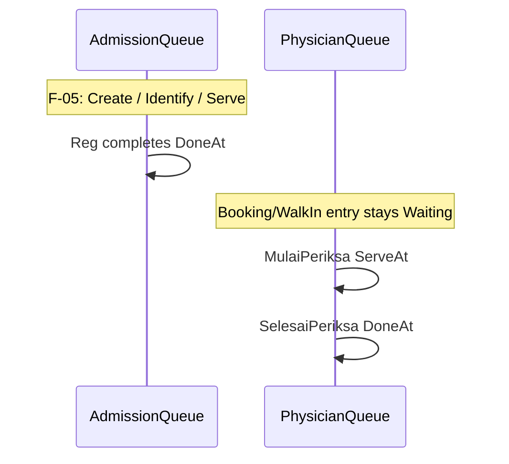

# F-07 Implementation Report — Registration vs Consultation Milestone Separation

> **Historical behavior superseded — 2026-07-27:** References below to create-on-registration,
> the default `ADM` Service Point, and optional Service Point override fields describe the original
> delivery only. Current Rajal registration without queue context is queue-less. Queue-linked
> completion accepts any Service Point present in the Admission Service Point master and is
> authorized by the server-resolved Loket claim.

**Artifact status:** Implementation summary (closed)  
**Bounded context:** Patient Tracker / Admisi Antrian + Registration orchestration  
**Authoritative domain:** [`TRACKER-DOMAIN.md`](TRACKER-DOMAIN.md)  
**Source gap:** F-07 in [`tracker-codebase-gap-report.md`](tracker-codebase-gap-report.md) (Severity: Critical)  
**Commit:** `3def0ded` — `fix(tracker): pisahkan milestone registrasi dari konsultasi dokter (F-07)`  
**Parent commit:** `a3232c56` (F-06) · **Next commit in series:** `fb73201b` (F-08)  
**Branch series:** `jude-refactor-tracker` (F-01 → F-13)  
**Rules closed:** BR-TRK-040–043 (operational time interpretation intervals); workflows §10.3 (Registration Done on admission), §10.4 (physician Serve deferred until real consult start), foundation for §10.8  
**Depends on:** F-05 (admission intake/identify + Serve on admission), F-06 (Serve/Done guards)

---

## 1. TL;DR for agents

Before F-07, **one physician Queue Entry** recorded **two** business moments:

1. Registration finished at the admission counter, and  
2. Physician consultation started.

Registration handlers called `Serve(occurredAt)` on the **physician** row. `QueSelesaiPeriksa` later called `Done` on the **same** row. There was **no** admission entry Completed at Reg. Therefore:

| Interval | Measured (wrong) | Domain meaning (correct) |
|---|---|---|
| Physician ServedAt → DoneAt | Reg time → consult end | Consultation duration (BR-TRK-043) |
| Post-reg consult wait | ~0 (Serve at Reg) | Admission DoneAt → Physician ServedAt (BR-TRK-042) |
| Registration wait / duration | Missing | Admission Created→Served / Served→Done (BR-TRK-040/041) |

After F-07:

| Concern | Rule for agents |
|---|---|
| At Registration | **Never** `Serve` the physician Queue Entry. Only `SetReff(regId, "REG")` (legacy projection) + complete **admission** entry. |
| Admission complete path A | Optional `AdmissionAntrianId` + `AdmissionNoUrut` present (post F-05 identify, entry InService) → `Done(occurredAt)` only. |
| Admission complete path B | Keys absent (legacy desktop) → **create-on-reg**: identified admission entry Serve+Done at same `occurredAt` (wait/duration may be ~0; semantics still separated). |
| Physician Waiting | Booking/walk-in physician entry stays **Waiting** until `QueMulaiPeriksa`. |
| Physician service start | `PATCH api/Antrian/mulaiPeriksa/{antrianId}/{noUrut}` → `Serve(Now)` on **physician** session entry. |
| Physician service done | `PATCH api/Antrian/selesaiPeriksa/...` → `Done(Now)` (must already be InService — F-06). |
| Legacy “active at Reg” | `ReffDesc=REG`, AntrianMap occupied, EMR payload — **not** physician `ServedAt` / InService. |
| REGISTER evidence | `AdmissionQueueComplete` appends `"REGISTER"` + RegId if missing (walk-in `Create(reg)` already has it). |

**Real case (why it matters):** Bu Siti books at **20:00** (physician A-15 Waiting). **08:05** registers → old code `Serve(08:05)` on physician. Doctor calls **08:40** (unrecorded). **09:10** selesai → Done. Reports claimed “consultation 65 min” and “post-reg wait 0” instead of ~30 min consult and ~35 min wait; loket metrics absent.



---

## 2. Domain rules encoded

| Rule | Behavior implemented | Where |
|---|---|---|
| BR-TRK-040 | Registration wait = admission CreatedAt → ServedAt | Admission entry milestones (F-05 Serve + F-07 complete); create-on-reg may collapse interval |
| BR-TRK-041 | Registration duration = admission ServedAt → DoneAt | `AdmissionQueueComplete.CompleteInServiceEntry` / `CreateServeAndComplete` |
| BR-TRK-042 | Post-reg consult wait = admission DoneAt → physician ServedAt | Physician not Served at Reg; Served only via MulaiPeriksa |
| BR-TRK-043 | Consultation duration = physician ServedAt → DoneAt | MulaiPeriksa + SelesaiPeriksa on physician entry |
| Workflow 10.3 | Registration Done on admission | `AdmissionQueueComplete` |
| Workflow 10.4 | Physician Serve after registration | `QueMulaiPeriksaCmd` |

### Orchestration contract (agent-facing)

```text
RegJalanByBooking / RegJalanWalkIn (successful Reg):
  physicianEntry.SetReff(RegId, "REG")     // legacy only; status unchanged
  AdmissionQueueComplete.CompleteAtRegistration(...)
    if AdmissionAntrianId + AdmissionNoUrut:
      require identified + InService + same TrackerId → Done + REGISTER if missing
    else:
      resolve/create SP session (default ADM / Loket Admisi)
      AddEntry(tracker) → Serve → Done (same occurredAt) + REGISTER if missing
  // do NOT physicianEntry.Serve

QueMulaiPeriksa(antrianId, noUrut):
  physician entry must be Waiting (F-06)
  Serve(Now)
  // F-08 also appends Consult-Start evidence (see §7)

QueSelesaiPeriksa(antrianId, noUrut):
  physician entry must be InService (F-06)
  Done(Now)
  // F-08 also appends Consult-Done evidence
```

### Optional Reg command fields (additive)

| Command | Optional fields |
|---|---|
| `RegJalanByBookingCmd` | `AdmissionAntrianId`, `AdmissionNoUrut`, `AdmissionServicePointCode`, `AdmissionServicePointName` |
| `RegJalanWalkInCommand` | same |

Walk-in with admission keys: load Tracker from the identified admission entry (do **not** invent a second Tracker via `Create(reg)` alone). Create-on-reg path may still use `PasienTrackerModel.Create(reg, …)`.

Default create-on-reg Service Point: code `"ADM"`, name `"Loket Admisi"` (`AdmissionQueueComplete` constants). Override via optional SP fields.

---

## 3. Files changed (commit `3def0ded`)

Full hash: `3def0dedc74dd99ac86003f3bd5af577d7193663` (2026-07-21).

### Application
- [`AdmissionQueueComplete.cs`](../../../src/bilreg/Bilreg.Application/AdmisiContext/AntrianFeature/AdmissionQueueComplete.cs) — **new**; CompleteAtRegistration / create-on-reg / REGISTER append.
- [`QueMulaiPeriksaCmd.cs`](../../../src/bilreg/Bilreg.Application/AdmisiContext/AntrianFeature/QueMulaiPeriksaCmd.cs) — **new** at F-07 (Serve only); later commits extend behavior (see §7).
- [`RegJalanByBookingCmd.cs`](../../../src/bilreg/Bilreg.Application/AdmisiContext/RegFeature/UseCases/RegJalanByBookingCmd.cs) — remove physician Serve; admission complete; inject tracker/factory; optional Admission*.
- [`RegJalanWalkInCommand.cs`](../../../src/bilreg/Bilreg.Application/AdmisiContext/RegFeature/UseCases/RegJalanWalkInCommand.cs) — same; ResolveTrackerForWalkIn when admission keys present.
- [`RegJalanUbahKunjunganCmd.cs`](../../../src/bilreg/Bilreg.Application/AdmisiContext/RegFeature/UseCases/RegJalanUbahKunjunganCmd.cs) — new physician entry Waiting (no Serve).
- [`Bilreg.Application.csproj`](../../../src/bilreg/Bilreg.Application/Bilreg.Application.csproj) — `InternalsVisibleTo` Bilreg.Test (helper tests).

### API
- [`AntrianController.cs`](../../../src/bilreg/Bilreg.Api/Controllers/AdmisiContext/AntrianFeature/AntrianController.cs) — `PATCH mulaiPeriksa/...`; `selesaiPeriksa` **await**ed.

### Tests
- [`AdmissionQueueCompleteAndMulaiPeriksaTest.cs`](../../../src/bilreg/Bilreg.Test/AdmisiContext/AntrianFeature/AdmissionQueueCompleteAndMulaiPeriksaTest.cs) — create-on-reg Done+REGISTER; existing InService → Done; Mulai→Selesai; physician stays Waiting after SetReff.

---

## 4. Before / after

| Aspect | Before (pre-F-07) | After (F-07 @ `3def0ded`) |
|---|---|---|
| Physician `Serve` at Reg (booking/walk-in) | Yes, at registration `occurredAt` | **No** — remains Waiting |
| Physician `Serve` at visit change | Yes | **No** |
| Admission Queue Entry at Reg | Not completed / often absent | Done (existing) or create-on-reg Serve+Done |
| Physician ServedAt meaning | Registration time | MulaiPeriksa time |
| How dokter enters InService | Implicit at Reg | Explicit `mulaiPeriksa` |
| Legacy active signal | Often physician InService | `ReffDesc=REG` / AntrianMap / EMR (unchanged intent) |
| `selesaiPeriksa` dispatch | Fire-and-forget (`_mediator.Send` without await) | Awaited |

---

## 5. API surface

| Method | Route | Command | Notes |
|---|---|---|---|
| PATCH | `api/Antrian/mulaiPeriksa/{antrianId}/{noUrut}` | `QueMulaiPeriksaCmd` | Physician Serve; introduced F-07 |
| PATCH | `api/Antrian/selesaiPeriksa/{antrianId}/{noUrut}` | `QueSelesaiPeriksaCmd` | Physician Done; await fixed at F-07 |

Reg HTTP bodies accept optional Admission* fields (additive; callers omitting them use create-on-reg).

**Later contract shape (F-10, not F-07):** Mulai/Selesai return `QueAntrianEntryActionResponse` (`AntrianId`, `NoUrut`, `PasienTrackerId`, `Status`) instead of opaque `"InService"`/`"Done"` strings. Prefer current HEAD behavior over F-07-only response strings when writing new clients.

**Agent rule:** Do not reintroduce `itemQueue.Serve(occurredAt)` in any Reg* handler “to make the doctor queue look active.” Use MulaiPeriksa or a dedicated compatibility projection if UI needs an active flag.

---

## 6. Verification

Focused suite at F-07 close:

```text
dotnet test src/bilreg/Bilreg.Test/Bilreg.Test.csproj --filter "FullyQualifiedName~AdmissionQueueComplete|FullyQualifiedName~QueMulaiPeriksa|FullyQualifiedName~PhysicianQueueMilestone"
```

Result at implementation time: **7 passed**. Api + Application build green.

Subsequent F-08/F-10 edits to the same test file remain compatible with F-07 semantics (Waiting until Mulai; Done requires InService).

---

## 7. Position in the Tracker fix series

Git order on the tracker refactor branch (each gap ≈ one commit):

| Commit | Gap | Role relative to F-07 |
|---|---|---|
| `aa449aeb` | F-01 | Tracking Period |
| `27dad573` | F-02 | Stable TrackerId |
| `1ac10bf7` | F-03 | Append-only events |
| `ab93e77f` | F-04 | Journey candidates |
| `cb07cd59` | F-05 | Anonymous intake + identify + **admission Serve** (Reg-Start) |
| `a3232c56` | F-06 | Legal Serve/Done transitions on **any** entry |
| **`3def0ded`** | **F-07** | **This slice — which entry is transitioned at Reg vs consult** |
| `fb73201b` | F-08 | Appends `Consult-Start` / `Consult-Done` on Mulai/Selesai via `PhysicianQueueEvidence` |
| `b03895cd` / `be331b42` | F-09 | Pharmacy journey |
| `5b7627df` | F-10 | HTTP response contracts for Mulai/Selesai (+ Tracker controller) |
| `02da90ac` | F-11 | EMR outbox |
| `0256688d` | F-12 | Persistence-shape docs |
| `bc1fe81d` | F-13 | AntrianMap number adapter (walk-in/booking may use adapter; still no physician Serve at Reg) |

**Agent rule:** Prefer this report + commit `3def0ded` over historical F-07 “open gap” wording in older gap-report snapshots. Do **not** weaken F-06 guards to “fix” orchestration — change **which** entry is Served/Done.

### Downstream mutations of F-07 files (do not attribute to `3def0ded`)

| Commit | Change on F-07 surface |
|---|---|
| `fb73201b` (F-08) | `QueMulaiPeriksa` / `QueSelesaiPeriksa` also append Tracker Consult-* evidence |
| `5b7627df` (F-10) | Typed `QueAntrianEntryActionResponse`; controller returns JSend data object |
| `bc1fe81d` (F-13) | Walk-in/booking may project numbers via compatibility adapter; F-07 “no Serve at Reg” still holds |

---

## 8. Downstream consumers & caveats

- **F-05:** Identify path already `Serve`s admission; F-07 only `Done`s that entry when Admission* keys are supplied.
- **F-06:** MulaiPeriksa fails if not Waiting; Selesai fails if not InService — after F-07, callers **must** Mulai before Selesai (previously Reg had already Served).
- **F-08:** Timeline Consult-* events hang off Mulai/Selesai; do not duplicate Serve for evidence alone.
- **F-10:** Clients should read structured Mulai/Selesai responses.
- **F-13:** Legacy map reservation ≠ physician InService.
- **Create-on-reg:** Operational loket wait/duration may be zero for callers that skip anonymous intake — correct for transitional compatibility; prefer F-05 intake + resolve + Admission* keys for real loket metrics.
- **Historical data:** Rows with physician `ServedAt` = registration time are **not** backfilled by F-07.
- **Duration projection API** (workflow 10.8 read model): still out of scope (noted under F-10 remaining / sequence step 9).
- Gap-report §5 F-07 historically described pre-fix evidence; treat **this report + `3def0ded`** as closed-source truth for milestone separation.

---

## 9. Scope boundaries

**In scope at `3def0ded`:** Stop physician Serve at Reg/visit-change; complete admission at Reg (Done or create-on-reg); MulaiPeriksa command + route; await SelesaiPeriksa; optional Admission* on Reg cmds; REGISTER append-if-missing; focused tests; InternalsVisibleTo for helper tests.

**Explicitly out of scope (other commits / open):**
- Anonymous intake / identify — **F-05** (prerequisite)
- Aggregate Serve/Done legality — **F-06** (prerequisite)
- Consult-Start/Done Tracker Events — **F-08**
- Pharmacy — **F-09**
- Richer HTTP DTO / Tracker controller — **F-10**
- Dedicated BR-TRK-040..046 projection endpoints — deferred (workflow 10.8)
- Historical ServedAt backfill — not done
- Changing AntrianMap/EMR payload shape — preserved as legacy projection

---

## 10. Related artifacts

- Domain spec: [`TRACKER-DOMAIN.md`](TRACKER-DOMAIN.md) §7.6 (BR-TRK-040–043); workflows §10.3, §10.4, §10.8  
- Gap report finding: [`tracker-codebase-gap-report.md`](tracker-codebase-gap-report.md) §5 F-07; recommended sequence §8 step 6  
- Prior slices: [`tracker-f05-implementation-report.md`](tracker-f05-implementation-report.md), [`tracker-f06-implementation-report.md`](tracker-f06-implementation-report.md)  
- Next: F-08 commit `fb73201b` (consultation evidence on Mulai/Selesai)  
- Compatibility: [`TRACKER-COMPATIBILITY.md`](TRACKER-COMPATIBILITY.md) / F-13 for map vs queue authority  
- Operational vs audit events: [`docs/concepts/operational-events.md`](../../concepts/operational-events.md)
