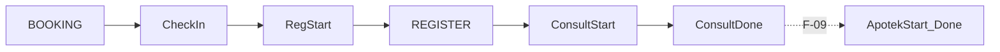

# F-08 Implementation Report — Consultation Evidence on Patient Tracker Timeline

**Artifact status:** Implementation summary (closed)  
**Bounded context:** Patient Tracker / Admisi Antrian (physician Queue Session)  
**Authoritative domain:** [`TRACKER-DOMAIN.md`](TRACKER-DOMAIN.md)  
**Source gap:** F-08 in [`tracker-codebase-gap-report.md`](tracker-codebase-gap-report.md) (Severity: High)  
**Commit:** `fb73201b` — `feat(tracker): catat evidence konsultasi ke timeline journey (F-08)`  
**Full hash:** `fb73201baabeb112bdfd2a2cedceb171622f65d6` (2026-07-21)  
**Parent commit:** `3def0ded` (F-07) · **Next commit in series:** `b03895cd` / `be331b42` (F-09)  
**Branch series:** `jude-refactor-tracker` (F-01 → F-13)  
**Rules / workflows closed:** workflow §10.4 consultation-start and consultation-done Tracker Events; BR-TRK-010–016 (event shape + free-text description + provenance via Queue Evidence Reference); BR-TRK-013 (queue ref when primary source absent); BR-TRK-017–019 durability via F-03 insert-only path  
**Depends on:** F-03 (append-only persistence), F-05 (`QueueEvidenceReference` + `IsRealTrackerId`), F-06 (Serve/Done guards), F-07 (physician Serve only via MulaiPeriksa)

---

## 1. TL;DR for agents

Before F-08, physician Mulai/Selesai **changed queue milestones only**. The Patient Tracker timeline typically stopped after Booking / admission / Registration evidence. Operators opening a journey saw loket activity but **no Consult-* rows**, even when the physician entry was already InService or Done.

After F-08 (commit `fb73201b`):

| Concern | Rule for agents |
|---|---|
| Consultation start evidence | `QueMulaiPeriksa` → `Serve` **then** append `Consult-Start` with `ReffId = QueueEvidenceReference` (`{AntrianId}/No.{NoUrut}`) and `OccurredAt = servedAt` |
| Consultation done evidence | `QueSelesaiPeriksa` → `Done` **then** append `Consult-Done` with the same Queue Evidence Reference and `OccurredAt = doneAt` |
| Medical Chart as ReffId | **Not available in Bilreg** — do **not** invent a Chart ID. Queue ref is the intentional BR-TRK-013 fallback until a Medical Chart contract exists |
| Unidentified physician entry | `PhysicianQueueEvidence.RequireTracker` throws if TrackerId is sentinel/`-`/empty — **no fake evidence** |
| Idempotency | Skip append if same `EventName` + `ReffId` already present |
| Physical movement events | **Forbidden** — never append “walked to poli” / arrival inference |
| Pharmacy evidence | **Not this commit** — `Apotek-Start` / `Apotek-Done` are **F-09** (`PharmacyQueueEvidence`) |

**Real case (why it matters):** Bu Siti books THT Monday night (`BOOKING`). Tuesday she checks in and registers (`Check In`, `Reg-Start`, `REGISTER` via F-05/F-07). At **09:00** doctor starts (`Serve`); at **09:25** consult ends (`Done`). Pre-F-08, timeline still ended at loket — Journey Resolution lacked consult proof and `LastPeriod` could not extend from clinic time. Post-F-08, timeline continues with `Consult-Start` / `Consult-Done`.



```text
QueMulaiPeriksa(antrianId, noUrut):
  load physician Queue Session entry
  Serve(Now)                         // F-06/F-07 queue milestone
  tracker = RequireTracker(entry)    // F-08
  AppendConsultStart(tracker, queueRef, servedAt)
  SaveChanges(queue); SaveChanges(tracker)

QueSelesaiPeriksa(antrianId, noUrut):
  Done(Now)
  tracker = RequireTracker(entry)
  AppendConsultDone(tracker, queueRef, doneAt)
  SaveChanges(queue); SaveChanges(tracker)
```

---

## 2. Domain rules encoded

| Rule / workflow | Behavior implemented | Where |
|---|---|---|
| Workflow 10.4 start | Consultation-start evidence at physician Serve | `PhysicianQueueEvidence.AppendConsultStart` from `QueMulaiPeriksaHandler` |
| Workflow 10.4 done | Consultation-done evidence at physician Done | `AppendConsultDone` from `QueSelesaiPeriksaHandler` |
| BR-TRK-010 | Event has description, reference, OccurredAt under one Tracker | `AddEvent(Consult-*, queueRef, time)` |
| BR-TRK-013 | Queue Evidence Reference when no primary source transaction | `QueueEvidenceReference.Create(AntrianId, NoUrut).Value` |
| BR-TRK-016 | EventName is free text / display — not a behavioral switch | Constants `"Consult-Start"` / `"Consult-Done"` are orchestration labels only |
| BR-TRK-017–019 | Append-only; preserve business time; no rewrite | Relies on F-03 `PasienTrackerRepo`; handlers only `AddEvent` + `SaveChanges` |
| BR-TRK-047 | Do not infer unobserved movement | No transit/arrival events added |

### Event name catalogue (agent-facing, outpatient journey)

| EventName | Typical ReffId | Produced by |
|---|---|---|
| `BOOKING` | BookingId | Booking create / soft-dup append |
| `Check In` | `{AntrianId}/No.{n}` | F-05 Identify |
| `Reg-Start` | `{AntrianId}/No.{n}` | F-05 Identify |
| `REGISTER` | RegId | F-07 `AdmissionQueueComplete` |
| **`Consult-Start`** | **`{AntrianId}/No.{n}`** | **F-08 MulaiPeriksa** |
| **`Consult-Done`** | **`{AntrianId}/No.{n}`** | **F-08 SelesaiPeriksa** |
| `Apotek-Start` / `Apotek-Done` | drug-sale or pharmacy queue ref | F-09 |
| `VISIT_CHANGED` / `*_CANCELLED` | source ids | F-02 |

---

## 3. Files changed (exactly commit `fb73201b`)

### Application
- [`PhysicianQueueEvidence.cs`](../../../src/bilreg/Bilreg.Application/AdmisiContext/AntrianFeature/PhysicianQueueEvidence.cs) — **new**; `Consult-Start` / `Consult-Done` constants; `QueueRef`; `RequireTracker`; idempotent append helpers.
- [`QueMulaiPeriksaCmd.cs`](../../../src/bilreg/Bilreg.Application/AdmisiContext/AntrianFeature/UseCases/QueMulaiPeriksaCmd.cs) — inject `IPasienTrackerRepo`; after `Serve`, append Consult-Start; save queue + tracker.
- [`QueSelesaiPeriksaCmd.cs`](../../../src/bilreg/Bilreg.Application/AdmisiContext/AntrianFeature/UseCases/QueSelesaiPeriksaCmd.cs) — same for `Done` + Consult-Done.

### Tests
- [`AdmissionQueueCompleteAndMulaiPeriksaTest.cs`](../../../src/bilreg/Bilreg.Test/AdmisiContext/AntrianFeature/AdmissionQueueCompleteAndMulaiPeriksaTest.cs) — Mulai asserts `Consult-Start` + QueueRef + time; Selesai after Mulai asserts `Consult-Done`; unidentified entry throws without `SaveChanges(tracker)`.

**Not in `fb73201b`:** API controller routes (already from F-07), Medical Chart integration, pharmacy evidence, HTTP response DTO reshape.

---

## 4. Before / after

| Aspect | Before (post-F-07, pre-F-08) | After (`fb73201b`) |
|---|---|---|
| Physician `Serve` / `Done` | Queue milestones only | Queue milestones **+** Tracker Events |
| Timeline after REGISTER | Stops (no consult rows) | Continues with `Consult-Start` / `Consult-Done` |
| Consult ReffId | N/A | Queue Evidence Reference (not Medical Chart) |
| Anonymous / sentinel physician entry on Mulai | Could Serve if Waiting (F-06) without tracker evidence | Throws — must be Identified |
| LastPeriod on consult day | Not extended by Mulai/Selesai | Extended via `AddEvent` (F-01 rules) when event date is later |

---

## 5. API surface

Same routes as F-07; F-08 changes **handler side effects**, not path shape:

| Method | Route | Command | F-08 effect |
|---|---|---|---|
| PATCH | `api/Antrian/mulaiPeriksa/{antrianId}/{noUrut}` | `QueMulaiPeriksaCmd` | Also appends `Consult-Start` |
| PATCH | `api/Antrian/selesaiPeriksa/{antrianId}/{noUrut}` | `QueSelesaiPeriksaCmd` | Also appends `Consult-Done` |

**Later contract shape (F-10, not F-08):** both commands return `QueAntrianEntryActionResponse` (`AntrianId`, `NoUrut`, `PasienTrackerId`, `Status`). Prefer HEAD behavior when writing clients. Timeline read: `GET` Tracker by id (F-10 `TrkGetQuery`) shows chronological `ListEvent` including Consult-*.

**Agent rule:** Do not append Consult-* from Registration handlers, Taksaka repair, or “status sync” jobs. Evidence must come from the accountable Mulai/Selesai interaction (or a future Medical Chart completion command that still uses real source time/reference).

---

## 6. Verification

Focused suite at F-08 close (and still valid with later F-10 response typing):

```text
dotnet test src/bilreg/Bilreg.Test/Bilreg.Test.csproj --filter "FullyQualifiedName~QueMulaiPeriksaHandlerTest|FullyQualifiedName~AdmissionQueueCompleteTest"
```

Result at implementation time: **7 passed** (includes Consult-* assertions + unidentified rejection).

---

## 7. Position in the Tracker fix series

Git order on the tracker refactor branch (each gap ≈ one commit):

| Commit | Gap | Role relative to F-08 |
|---|---|---|
| `aa449aeb` | F-01 | LastPeriod extends when Consult-* appended |
| `27dad573` | F-02 | Stable TrackerId; `IsRealTrackerId` reused by RequireTracker |
| `1ac10bf7` | F-03 | Insert-only event persistence (required before milestone appends) |
| `ab93e77f` | F-04 | Candidates show evidence — Consult-* becomes visible after F-08 |
| `cb07cd59` | F-05 | QueueEvidenceReference + Check In / Reg-Start |
| `a3232c56` | F-06 | Legal Serve/Done before evidence append |
| `3def0ded` | F-07 | Physician Serve deferred to MulaiPeriksa (correct moment for Consult-Start) |
| **`fb73201b`** | **F-08** | **This slice — Consult-Start / Consult-Done on Mulai/Selesai** |
| `b03895cd` / `be331b42` | F-09 | Apotek-* evidence (parallel helper pattern) |
| `5b7627df` | F-10 | Typed Mulai/Selesai responses; Tracker GET timeline |
| `02da90ac` | F-11 | EMR outbox (does not rewrite Consult-*) |
| `0256688d` | F-12 | Persistence-shape docs |
| `bc1fe81d` | F-13 | AntrianMap number adapter (orthogonal) |

**Agent rule:** Prefer this report + commit `fb73201b` over historical F-08 “open gap” wording that claims consultation evidence is absent. Do **not** attribute F-10 response DTOs or F-09 Apotek-* events to `fb73201b`.

### Downstream mutations of F-08 files (do not attribute to `fb73201b`)

| Commit | Change on F-08 surface |
|---|---|
| `5b7627df` (F-10) | `QueMulaiPeriksaCmd` / `QueSelesaiPeriksaCmd` return `QueAntrianEntryActionResponse`; Consult-* append logic retained |
| `b03895cd` / `be331b42` (F-09) | Separate `PharmacyQueueEvidence` — do not merge into `PhysicianQueueEvidence` |

---

## 8. Downstream consumers & caveats

- **F-07 prerequisite:** If Reg still Served the physician entry, Consult-Start would fire at the wrong business moment. Keep “no Serve at Reg.”
- **F-03 prerequisite:** Without insert-only persistence, Consult-* could be mutated/deleted by SaveChanges — do not reintroduce event Update/Delete.
- **F-09:** Pharmacy continues the timeline after Consult-Done; F-08 intentionally stopped at consultation.
- **F-10:** Clients reading timeline use Tracker GET; Mulai/Selesai return TrackerId for correlation.
- **Medical Chart:** Domain prefers Chart ref for Consult-Done; Bilreg has no Chart contract — queue ref is correct until one exists. When Chart lands, prefer additive optional Chart ReffId rather than rewriting historical queue-ref rows.
- **Idempotent re-entry:** Same Mulai retry after partial failure should not duplicate Consult-Start for the same queueRef (guard in helper). Serve itself still fails if already InService (F-06).
- **Historical data:** Past Mulai/Selesai before `fb73201b` have queue milestones without Consult-* rows — **not backfilled**. Reconciliation must not invent times.
- Gap-report §5 F-08 historically described pre-fix evidence; treat **this report + `fb73201b`** as closed-source truth for consultation timeline evidence (workflow 10.4).

---

## 9. Scope boundaries

**In scope at `fb73201b`:** `PhysicianQueueEvidence`; Mulai → Consult-Start; Selesai → Consult-Done; Queue Evidence Reference as ReffId; reject unidentified entries; idempotent append; focused unit tests.

**Explicitly out of scope (other commits / open):**
- Append-only persistence — **F-03** (prerequisite)
- Admission Check In / Reg-Start / REGISTER — **F-05 / F-07**
- Physician Serve deferred from Reg — **F-07** (prerequisite)
- Pharmacy Apotek-* / Farinv integration — **F-09**
- HTTP response DTO / Tracker controller timeline GET — **F-10**
- Medical Chart source reference — deferred (no Bilreg contract)
- Inferring physical movement / location — forbidden (BR-TRK-047)
- Backfill of Consult-* for historical Done rows — not done
- Workflow 10.8 duration projection API — deferred

---

## 10. Related artifacts

- Domain spec: [`TRACKER-DOMAIN.md`](TRACKER-DOMAIN.md) workflow §10.4; BR-TRK-010–019; BR-TRK-013; BR-TRK-047  
- Gap report finding: [`tracker-codebase-gap-report.md`](tracker-codebase-gap-report.md) §5 F-08; recommended sequence §8 step 7  
- Prior slices: [`tracker-f03-implementation-report.md`](tracker-f03-implementation-report.md), [`tracker-f05-implementation-report.md`](tracker-f05-implementation-report.md), [`tracker-f07-implementation-report.md`](tracker-f07-implementation-report.md)  
- Next: F-09 commits `b03895cd` / `be331b42` (pharmacy journey evidence)  
- Operational vs audit events: [`docs/concepts/operational-events.md`](../../concepts/operational-events.md) (`PasienTrackerEvent` = operational timeline, not compliance audit)
