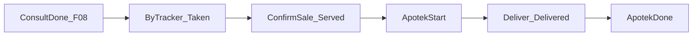

# F-09 Implementation Report — Pharmacy Queue Integrated into Patient Journey

> **Supersession (BA-01, 2026-08-15):** This report documents the legacy Farinv-integrated implementation. The canonical outpatient-pharmacy queue identity is now Patient Tracker `QueueEntry`. Farinv queue identity is deprecated for new interactions; historical Farinv data is read-only. F-09 `Apotek-Start` / `Apotek-Done` evidence remains reusable but must reference `QueueEntryId` from Patient Tracker. See [Apotek Domain](../apotek/apotek-domain.md) (`BR-APT-097`) and [ADR-APT-001](../apotek/adr/ADR-APT-001-queu-boundary-and-pharmacy-workflow-state-ownership.md).

**Artifact status:** Implementation summary (closed; queue identity superseded by BA-01)  
**Bounded context:** Patient Tracker (Bilreg) + Farinv Sales Antrian (pharmacy Queue Session)  
**Authoritative domain:** [`TRACKER-DOMAIN.md`](TRACKER-DOMAIN.md)  
**Source gap:** F-09 in [`tracker-codebase-gap-report.md`](tracker-codebase-gap-report.md) (Severity: High)  
**Primary commits (same subject, split trees):**
- `b03895cd` — Bilreg Tracker pharmacy evidence append API  
- `be331b42` — Farinv pharmacy entry `PasienTrackerId` / `ServedAt` + controller routes  
**Full hashes:**
- `b03895cda4f99fc34f055fb36641074fd1e4a514` (2026-07-21 14:51:17 +07)  
- `be331b42ee9921182ba77815fd438ee4144359fc` (2026-07-21 14:51:40 +07)  
**Parent of slice:** `fb73201b` (F-08) · **Immediate child:** `5b7627df` (F-10)  
**Branch series:** `jude-refactor-tracker` (F-01 → F-13)  
**Rules / workflows closed:** BR-TRK-044–046; workflows §10.5 (establish pharmacy work) and §10.6 (sale start / handover done); foundation for pharmacy interval in §10.8  
**Depends on:** F-01 (`LastPeriod` extend on append), F-02 (stable TrackerId), F-03 (append-only events), F-08 (`PhysicianQueueEvidence` pattern for Consult-*; F-09 mirrors as `PharmacyQueueEvidence`)

**Companion commit (required for Farinv application orchestration):** `5b7627df` (labeled F-10) introduced the Farinv MediatR commands, `IAppendTrackerEvidenceService` HTTP client, `PharmacyTrackerIdentity`, `PharmacyQueueEvidenceReference`, alter script, and Farinv unit tests that `be331b42`’s controller/domain already reference. Agents reading pharmacy *handlers* must use **HEAD ≥ `5b7627df`**, not stop at `be331b42`.

---

## 1. TL;DR for agents

Before F-09, the outpatient Patient Journey timeline typically ended at consultation (`Consult-Done` from F-08). Farinv owned a **separate** pharmacy queue (`FARIN_Antrian*`) keyed by `RegId` only — no `TrackerId`, no Bilreg evidence append, and domain transitions `AssignSlot` / `PrepareSlot` / `DeliverSlot` had **no** application callers from drug-sale or handover.

After F-09 (+ F-10 companion application files):

| Concern | Rule for agents |
|---|---|
| Same journey | Pharmacy Queue Entry must carry the **same** `PasienTrackerId` as booking/reg/consult |
| Establish pharmacy work (10.5) | `POST api/Antrian/ByTracker` → identified Farinv entry `Taken`; **do not** append Tracker Events (BR-TRK-044 — not physical arrival) |
| Trigger for create | Explicit command (resep/KP/chart caller) — **not** automatic from `QueSelesaiPeriksa` |
| Sale confirm (10.6 start) | `POST api/Antrian/ConfirmSale` → set Farinv `ServedAt` + advance to `Prepared`; HTTP append Bilreg `Apotek-Start` with `ReffId = PenjualanId` |
| Handover (10.6 done) | `POST api/Antrian/Deliver` → `DeliverSlot` → `Delivered`; HTTP append `Apotek-Done` with queue evidence `{AntrianId}/No.{NoAntrian}` |
| Farinv lifecycle | Keep `Taken → Assigned → Prepared → Delivered` — **do not** collapse into Bilreg Waiting/InService/Done |
| Canonical mapping | Taken≈CreatedAt (no event); sale confirm≈ServedAt+`Apotek-Start`; Delivered≈DoneAt+`Apotek-Done` |
| Bilreg append port | `POST api/PasienTracker/pharmacy/evidence` (`TrkAppendPharmacyEvidenceCmd`) — Farinv calls via `AppendTrackerEvidenceService` |
| Idempotency | Create: reuse active entry for same TrackerId in session; evidence: skip if same `EventName`+`ReffId` exists |
| Cancel / partial delivery | Farinv-local only for now — **no** Tracker cancel evidence yet (domain ambiguity 7.1.10) |

**Real case (why it matters):** Sinta books → registers → consults Dr. Agus (`Consult-Done`). Doctor generates resep/KP. Pre-F-09, apotek queue knew only `RegId`; RS could not answer “berapa lama Sinta dilayani di apotek dalam journey yang sama dengan poli.” Post-F-09, apotek entry shares TrackerId; DU save → `Apotek-Start`; serah obat → `Apotek-Done`; pharmacy service duration = ServedAt → DoneAt (BR-TRK-046).



```text
QueAddAntrianByTracker(regId, trackerId, servicePoint, noAntrian, createdAt?):
  LoadOrCreate Farinv session(servicePoint)
  AddEntryByTracker(...)   // Taken; PasienTrackerId set; NO tracker event
  SaveChanges(antrian)

QueConfirmPharmacySale(trackerId, servicePoint, penjualanId, occurredAt):
  entry = GetActiveEntryByTracker(trackerId)
  ConfirmPharmacySale → ServedAt + Prepared
  HTTP Append Apotek-Start(reff=penjualanId, occurredAt)
  SaveChanges(antrian)

QueDeliverAntrian(trackerId, servicePoint, occurredAt):
  DeliverSlot → Delivered
  HTTP Append Apotek-Done(reff={AntrianId}/No.{n}, occurredAt)
  SaveChanges(antrian)
```

---

## 2. Domain rules encoded

| Rule / workflow | Behavior implemented | Where |
|---|---|---|
| Workflow 10.5 | Identified pharmacy entry for same TrackerId; CreatedAt = TakenAt; no arrival inference | `AntrianModel.AddEntryByTracker` / `QueAddAntrianByTrackerCmd` |
| BR-TRK-044 | Queue creation ≠ physical pharmacy arrival — **no** Tracker Event on ByTracker | Handler saves queue only |
| Workflow 10.6 / BR-TRK-045 | Confirmed drug sale establishes ServedAt + service-start evidence | `ConfirmSale` + `Apotek-Start` |
| Workflow 10.6 / BR-TRK-046 | Pharmacy duration Served→Done; handover completes | `Deliver` + `Apotek-Done` |
| BR-TRK-013 | Queue Evidence Reference when no stronger completion tx | `PharmacyQueueEvidenceReference.Create(AntrianId, NoAntrian)` |
| BR-TRK-016 | EventName display-only | `"Apotek-Start"` / `"Apotek-Done"` orchestration labels |
| BR-TRK-017–019 | Append-only + preserve business time | Bilreg F-03 path via `PharmacyQueueEvidence.AddEvent` |
| BR-TRK-047 | No inferred movement between poli and apotek | No transit events |

### Farinv ↔ Tracker mapping (do not collapse Farinv states)

```text
Farinv Taken (+ TakenAt)           → Tracker CreatedAt   | no event
Farinv sale confirm (+ ServedAt)   → Tracker ServedAt    | Apotek-Start (PenjualanId)
Farinv Assigned / Prepared         → Farinv-internal only
Farinv Delivered (+ DeliveredAt)   → Tracker DoneAt      | Apotek-Done (queue reff)
```

### Event name catalogue (agent-facing, outpatient journey)

| EventName | Typical ReffId | Produced by |
|---|---|---|
| `BOOKING` … `Consult-Done` | (prior gaps) | F-01–F-08 |
| **`Apotek-Start`** | **`PenjualanId` (DU)** | **F-09 ConfirmSale → Bilreg pharmacy/evidence** |
| **`Apotek-Done`** | **`{AntrianId}/No.{n}`** | **F-09 Deliver → Bilreg pharmacy/evidence** |
| `VISIT_CHANGED` / `*_CANCELLED` | source ids | F-02 |

---

## 3. Files by commit (exact attribution)

### `b03895cd` — Bilreg evidence port

| Path | Change |
|---|---|
| [`PharmacyQueueEvidence.cs`](../../../src/bilreg/Bilreg.Application/AdmisiContext/AntrianFeature/PharmacyQueueEvidence.cs) | **A** — `Apotek-Start`/`Apotek-Done`; `RequireTracker`; idempotent append |
| [`TrkAppendPharmacyEvidenceCmd.cs`](../../../src/bilreg/Bilreg.Application/AdmisiContext/AntrianFeature/UseCases/TrkAppendPharmacyEvidenceCmd.cs) | **A** — MediatR command + handler |
| [`PasienTrackerController.cs`](../../../src/bilreg/Bilreg.Api/Controllers/AdmisiContext/AntrianFeature/PasienTrackerController.cs) | **M** — `POST pharmacy/evidence` |
| [`PharmacyQueueEvidenceTest.cs`](../../../src/bilreg/Bilreg.Test/AdmisiContext/AntrianFeature/PharmacyQueueEvidenceTest.cs) | **A** |

### `be331b42` — Farinv domain + persistence + controller routes

| Path | Change |
|---|---|
| `AntrianEntryModel.cs` | **M** — `PasienTrackerId`, `ServedAt`, `CreateIdentified`, `ConfirmSale` |
| `AntrianModel.cs` | **M** — `AddEntryByTracker`, `ConfirmPharmacySale`, find-by-tracker |
| `FARIN_AntrianEntry.sql` | **M** — additive columns in CREATE |
| DTO/DAL/Repo/ViewDto/`AntrianDal` list projection | **M** — map new columns |
| `AntrianController.cs` | **M** — routes `ByTracker` / `ConfirmSale` / `Deliver` (refs cmds landed in F-10) |
| `Farinv.Sqldb.sqlproj` / `Farinv.Test.csproj` | **M** |

**Note:** At `be331b42` alone, controller/domain reference types (`Que*Cmd`, `PharmacyTrackerIdentity`) that are **missing from that tree**. Treat `be331b42` as incomplete without `5b7627df`.

### `5b7627df` (F-10) — Farinv application orchestration completing F-09

| Path | Change |
|---|---|
| `QueAddAntrianByTrackerCmd.cs` | **A** |
| `QueConfirmPharmacySaleCmd.cs` | **A** |
| `QueDeliverAntrianCmd.cs` | **A** |
| `IAppendTrackerEvidenceService.cs` / `AppendTrackerEvidenceService.cs` | **A** — HTTP to Bilreg `pharmacy/evidence` |
| `PharmacyTrackerIdentity.cs` / `PharmacyQueueEvidenceReference.cs` | **A** |
| `FARIN_AntrianEntry_M1_TrackerServed_Alter.sql` | **A** — additive migration for live DB |
| `AntrianEntryModelPharmacyTest.cs` / `PharmacyQueueHandlerTest.cs` | **A** |
| `PasienTrackerController.cs` | **M** — F-10 also adds `GET {pasienTrackerId}` (orthogonal); pharmacy route retained |

**Agent rule:** Do **not** attribute Que*/AppendTrackerEvidence solely to F-09 commit hashes. Prefer this report’s “closed behavior at HEAD” + commits `b03895cd`+`be331b42`+`5b7627df` for pharmacy journey integration.

---

## 4. Before / after

| Aspect | Before (post-F-08) | After (HEAD ≥ `5b7627df`) |
|---|---|---|
| Pharmacy queue identity | `RegId` only | `PasienTrackerId` (+ Reg snapshot) |
| Same journey continuity | Stops at Consult-Done | Continues with Apotek-* |
| Create apotek entry | Manual/Reg-only; unused transitions | `ByTracker` identified Taken |
| Sale → Tracker Served | Not implemented | ConfirmSale + `Apotek-Start` |
| Handover → Tracker Done | `DeliverSlot` unused | Deliver + `Apotek-Done` |
| Farinv states | Taken…Delivered (orphan) | Same states + canonical ServedAt column |
| Bilreg append from Farinv | None | HTTP `pharmacy/evidence` |

---

## 5. API surface

### Farinv (`AntrianController`)

| Method | Route | Command | Tracker effect |
|---|---|---|---|
| POST | `api/Antrian/ByTracker` | `QueAddAntrianByTrackerCmd` | **None** (BR-TRK-044) |
| POST | `api/Antrian/ConfirmSale` | `QueConfirmPharmacySaleCmd` | `Apotek-Start` via Bilreg HTTP |
| POST | `api/Antrian/Deliver` | `QueDeliverAntrianCmd` | `Apotek-Done` via Bilreg HTTP |

Response shape: `PharmacyQueueEntryResponse` (`AntrianId`, `NoAntrian`, `PasienTrackerId`).

### Bilreg (`PasienTrackerController`)

| Method | Route | Command |
|---|---|---|
| POST | `api/PasienTracker/pharmacy/evidence` | `TrkAppendPharmacyEvidenceCmd` (`PasienTrackerId`, `EventName`, `ReffId`, `OccurredAt`) |

**Agent rules:**
- Callers that generate resep/KP must invoke Farinv `ByTracker` with the journey TrackerId (not invent a new one).
- Do **not** auto-create apotek queue from `QueSelesaiPeriksa`.
- Do **not** append Apotek-* from Bilreg physician handlers.
- Farinv ConfirmSale/Deliver fail if entry lacks real TrackerId or no active entry exists.

---

## 6. Verification

```text
dotnet test src/bilreg/Farinv.Test/Farinv.Test.csproj --filter "FullyQualifiedName~Pharmacy|FullyQualifiedName~AntrianEntryModelPharmacy|FullyQualifiedName~AntrianModelPharmacy"
dotnet test src/bilreg/Bilreg.Test/Bilreg.Test.csproj --filter "FullyQualifiedName~PharmacyQueueEvidence"
```

Result at implementation time: **8 passed** (Farinv) + **3 passed** (Bilreg).

**DB migration (ops):** run `FARIN_AntrianEntry_M1_TrackerServed_Alter.sql` on Farinv database before deploying ConfirmSale/`ServedAt` persistence.

---

## 7. Position in the Tracker fix series

| Commit | Gap | Role relative to F-09 |
|---|---|---|
| `aa449aeb` | F-01 | LastPeriod extends when Apotek-* appended |
| `27dad573` | F-02 | Stable TrackerId reused across apotek |
| `1ac10bf7` | F-03 | Insert-only event persistence (required) |
| `fb73201b` | F-08 | Consult-* ends clinic; pattern for PharmacyQueueEvidence |
| **`b03895cd` / `be331b42`** | **F-09** | **Bilreg evidence API + Farinv domain/SQL/routes** |
| **`5b7627df`** | **F-10** | **Completes Farinv Que*/HTTP client/tests/alter (F-09 operational)** + broader Tracker HTTP contracts |
| `02da90ac` | F-11 | EMR outbox (does not rewrite Apotek-*) |
| `0256688d` | F-12 | Persistence-shape docs |
| `bc1fe81d` | F-13 | AntrianMap adapter (orthogonal to pharmacy) |

**Agent rule:** Prefer this report over historical gap-report wording that pharmacy integration is “Not Implemented.” Do **not** claim F-09 alone introduced `QueConfirmPharmacySaleCmd` if citing only `be331b42`.

---

## 8. Downstream consumers & caveats

- **F-03 prerequisite:** Without append-only persistence, Apotek-* could be mutated — do not reintroduce event Update/Delete.
- **F-08 prerequisite:** Timeline before apotek should already include Consult-* when clinic completed; F-09 does not invent consult evidence.
- **PenjualanModel:** Still stubbed/commented in Farinv. ConfirmSale is an **explicit application command** ready to hook from DU save — do not revive full Penjualan aggregate solely for Tracker.
- **Cross-context reliability:** Farinv appends Bilreg evidence via HTTP *before/around* SaveChanges; failures throw. No outbox for Apotek-* yet (F-11 Slice 1 covers EMR antrian only). Agents adding resilience should not silently skip evidence.
- **Historical rows:** Pre-migration Farinv entries have `PasienTrackerId='-'` — ConfirmSale/Deliver correctly reject until identified ByTracker flow is used. **No backfill** of Apotek-* for past Delivered rows.
- **Cancel:** `CancelSlot` remains Farinv-only; no `Apotek-Cancelled` Tracker event.
- Gap-report §5 F-09 historically described pre-fix state; treat **this report + commits above** as closed-source truth for workflows 10.5–10.6.

---

## 9. Scope boundaries

**In scope (closed behavior at HEAD):** TrackerId on pharmacy entry; ServedAt column; ByTracker create without event; ConfirmSale → Served + Apotek-Start; Deliver → Delivered + Apotek-Done; Bilreg pharmacy/evidence API; idempotent create/evidence; Farinv lifecycle preserved; focused tests; alter script.

**Explicitly out of scope:**
- Auto-create apotek from `QueSelesaiPeriksa` — deferred to resep/KP caller
- Collapsing Farinv states into Bilreg Waiting/InService/Done
- Full Penjualan aggregate revival
- Cancel / partial delivery Tracker evidence
- Pharmacy duration projection API (workflow 10.8) — deferred
- Inferring physical movement to apotek — forbidden (BR-TRK-047)
- Backfill of Apotek-* for historical Delivered rows

---

## 10. Related artifacts

- Domain spec: [`TRACKER-DOMAIN.md`](TRACKER-DOMAIN.md) workflows §10.5–10.6; BR-TRK-044–047  
- Gap report finding: [`tracker-codebase-gap-report.md`](tracker-codebase-gap-report.md) §5 F-09; recommended sequence §8 step 8  
- Prior: [`tracker-f08-implementation-report.md`](tracker-f08-implementation-report.md) (Consult-* pattern)  
- Companion HTTP contracts: F-10 commit `5b7627df` (Tracker GET timeline includes Apotek-* once written)  
- Operational vs audit events: [`docs/concepts/operational-events.md`](../../concepts/operational-events.md)
