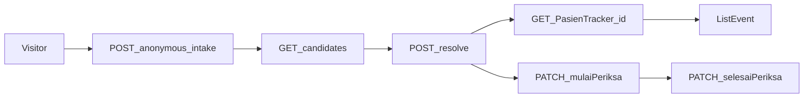

# F-10 Implementation Report — Core Tracker HTTP / Application Contracts

> **Superseded admission API note (2026-07-22):** `POST api/PasienTracker/resolve/new` has been removed. `POST api/Antrian/start` starts anonymous admission service, and `resolve/select` now associates only an anonymous `InService` entry. See [`tracker-admission-queue-late-identification-gap-analysis.md`](tracker-admission-queue-late-identification-gap-analysis.md).

**Artifact status:** Implementation summary (closed)  
**Bounded context:** Patient Tracker / Admisi Antrian (Bilreg HTTP + MediatR)  
**Authoritative domain:** [`TRACKER-DOMAIN.md`](TRACKER-DOMAIN.md)  
**Source gap:** F-10 in [`tracker-codebase-gap-report.md`](tracker-codebase-gap-report.md) (Severity: High)  
**Primary commit:** `5b7627df` — `feat(pasien-tracker): expose core Tracker HTTP/application contracts (F-10)`  
**Full hash:** `5b7627dfb224d06addb03c8befe84bceae04f218` (2026-07-21 14:59:29 +07)  
**Parent commit:** `be331b42` (F-09 Farinv domain/routes) · **Next commit in series:** `02da90ac` (F-11 Slice 1 EMR outbox)  
**Branch series:** `jude-refactor-tracker` (F-01 → F-13)  
**Rules / capabilities closed:** domain §3 capabilities operable via HTTP — Journey Candidate Resolution, Operational Evidence Timeline **read**, anonymous intake/identification, queue service start/complete with observable TrackerId; Recommended Direction F-10 applied  
**Depends on:** F-04 (candidates + resolve cmds), F-05 (anonymous intake + identify), F-07 (mulaiPeriksa await + physician Serve), F-08 (Consult-* side effects), F-09 Bilreg pharmacy/evidence port (`b03895cd`)

**Important split inside the same commit:** `5b7627df` also lands Farinv application orchestration that **completes F-09** (`QueAddAntrianByTrackerCmd`, `QueConfirmPharmacySaleCmd`, `QueDeliverAntrianCmd`, `AppendTrackerEvidenceService`, alter script, Farinv tests). That pharmacy half is documented in [`tracker-f09-implementation-report.md`](tracker-f09-implementation-report.md). This report focuses on **Bilreg Tracker HTTP/application contracts**; see §3.2 for Farinv attribution so agents do not mis-own those files.

---

## 1. TL;DR for agents

Before F-10, several Tracker **application** intents already existed from earlier gaps (candidates, resolve, anonymous intake, mulai/selesai with Consult-* evidence), but the **HTTP observation surface** was incomplete for web-platform operators:

- No first-class **GET tracker + chronological timeline**.
- `mulaiPeriksa` / `selesaiPeriksa` returned opaque strings `"InService"` / `"Done"` — **no** `PasienTrackerId` / stable queue-entry identity.
- `QueGetAntrianResponse` omitted TrackerId and service milestones.

After F-10 (commit `5b7627df`, Bilreg half):

| Concern | Rule for agents |
|---|---|
| Get journey + timeline | `GET api/PasienTracker/{pasienTrackerId}` → `TrkGetQuery` → header + `ListEvent` ordered by `EventDate` then `NoUrut` |
| No separate `/timeline` route | Timeline **is** `ListEvent` on GET; do not invent a second resource unless a future gap asks for it |
| Mulai / Selesai response | Return `QueAntrianEntryActionResponse(AntrianId, NoUrut, PasienTrackerId, Status)` — **BREAKING** vs string literals |
| Queue get enrichment | `QueGetAntrianResponse` includes `PasienTrackerId`, `ServedAt?`, `DoneAt?` (sentinel/`≥3000` → null) |
| Await | All Tracker/Antrian MediatR dispatches on these controllers must remain awaited (fixed earlier for Selesai at F-07; keep it) |
| Additive routes | Keep existing Antrian routes; add Tracker GET; do not rename identify to a new verb — `resolve/select` + `resolve/new` remain Journey Resolution |
| Duration projection API | **Out of scope** — BR-TRK-040..046 / workflow 10.8 not introduced by F-10 |
| Pharmacy Que* in this commit | Attribute to **F-09 companion** — see F-09 report; do not re-document as F-10 business rules |

**Real case (why it matters):** Ibu Ani arrives without booking. Loket gives anonymous number (`anonymous-intake`). At registration, two trackers match name+DOB in Tracking Period — system must **not** guess; operator reviews candidate evidence then `resolve/select` or `resolve/new`. At poli, doctor Mulai/Selesai — UI needs TrackerId + AntrianId/NoUrut in the response. Supervisor opens journey detail — needs GET tracker with Booking → Check In → REGISTER → Consult-* → Apotek-* timeline. Pre-F-10, web could not observe GET/timeline or action identity; post-F-10 it can.



```text
TrkGet(pasienTrackerId):
  tracker = LoadEntity(key) or throw
  ListEvent = OrderBy(EventDate).ThenBy(NoUrut) → TrkJourneyCandidateEventDto
  return header + ListEvent

QueMulaiPeriksa / QueSelesaiPeriksa:
  Serve/Done + Consult-* (F-08) as before
  return QueAntrianEntryActionResponse(AntrianId, NoUrut, TrackerId, Status)
```

---

## 2. Domain rules / intents encoded

F-10 is primarily a **contract/operability** gap, not new aggregate invariants. It makes prior domain work callable and observable.

| Intent | Status before F-10 | F-10 contribution | Where |
|---|---|---|---|
| Journey candidates | App + HTTP from F-04 | Retained | `GET candidates` / `TrkJourneyCandidateListQry` |
| Resolve select/new | App + HTTP from F-04/F-05 | Retained | `POST resolve/select`, `resolve/new` |
| Anonymous intake | App + HTTP from F-05 | Retained | `POST api/Antrian/anonymous-intake` |
| Service start / complete | HTTP from F-07; evidence F-08 | **Response shape** carries TrackerId + entry id | `QueAntrianEntryActionResponse` |
| Timeline evidence **read** | Only nested in candidate DTO | **First-class GET** | `TrkGetQuery` / `GET {id}` |
| Pharmacy evidence append | Bilreg HTTP from F-09 (`b03895cd`) | Route retained; Farinv callers completed in same commit (F-09 companion) | `POST pharmacy/evidence` |
| Operational time interpretation API | Not implemented | Still deferred (workflow 10.8) | — |

### Recommended Direction F-10 — applied checklist

| Direction item | Applied? |
|---|---|
| Additive Tracker/Queue contracts around domain intents | Yes — GET added; existing routes kept |
| Await all commands | Yes (Selesai await already F-07; Mulai/Selesai return awaited response) |
| Return TrackerId + stable queue-entry identity where required | Yes — Mulai/Selesai + enriched QueGet |

---

## 3. Files by commit attribution

### 3.1 Bilreg F-10 HTTP / application contracts (`5b7627df`)

| Path | Change |
|---|---|
| [`TrkGetQuery.cs`](../../../src/bilreg/Bilreg.Application/AdmisiContext/AntrianFeature/TrkGetQuery.cs) | **A** — `TrkGetQuery` / `TrkGetResponse` / `TrkGetHandler` |
| [`QueAntrianEntryActionResponse.cs`](../../../src/bilreg/Bilreg.Application/AdmisiContext/AntrianFeature/QueAntrianEntryActionResponse.cs) | **A** — shared Mulai/Selesai response |
| [`QueMulaiPeriksaCmd.cs`](../../../src/bilreg/Bilreg.Application/AdmisiContext/AntrianFeature/QueMulaiPeriksaCmd.cs) | **M** — `IRequest<QueAntrianEntryActionResponse>` |
| [`QueSelesaiPeriksaCmd.cs`](../../../src/bilreg/Bilreg.Application/AdmisiContext/AntrianFeature/QueSelesaiPeriksaCmd.cs) | **M** — same |
| [`QueGetAntrianQuery.cs`](../../../src/bilreg/Bilreg.Application/AdmisiContext/AntrianFeature/QueGetAntrianQuery.cs) | **M** — `PasienTrackerId`, `ServedAt?`, `DoneAt?` |
| [`PasienTrackerController.cs`](../../../src/bilreg/Bilreg.Api/Controllers/AdmisiContext/AntrianFeature/PasienTrackerController.cs) | **M** — `GET {pasienTrackerId}` |
| [`AntrianController.cs`](../../../src/bilreg/Bilreg.Api/Controllers/AdmisiContext/AntrianFeature/AntrianController.cs) | **M** — Mulai/Selesai return response object |
| [`TrkGetHandlerTest.cs`](../../../src/bilreg/Bilreg.Test/AdmisiContext/AntrianFeature/TrkGetHandlerTest.cs) | **A** |
| [`AdmissionQueueCompleteAndMulaiPeriksaTest.cs`](../../../src/bilreg/Bilreg.Test/AdmisiContext/AntrianFeature/AdmissionQueueCompleteAndMulaiPeriksaTest.cs) | **M** — assert response fields |
| [`tracker-codebase-gap-report.md`](tracker-codebase-gap-report.md) | **M** — F-10 marked closed |

### 3.2 Farinv F-09 companion (same commit `5b7627df` — do not treat as F-10 domain)

Documented for agents so they do not invent a second “pharmacy F-10”:

| Path | Role |
|---|---|
| `QueAddAntrianByTrackerCmd.cs` / `QueConfirmPharmacySaleCmd.cs` / `QueDeliverAntrianCmd.cs` | Farinv MediatR handlers (workflows 10.5–10.6) |
| `IAppendTrackerEvidenceService.cs` / `AppendTrackerEvidenceService.cs` | HTTP client → Bilreg `pharmacy/evidence` |
| `PharmacyTrackerIdentity.cs` / `PharmacyQueueEvidenceReference.cs` | Farinv identity / queue reff helpers |
| `FARIN_AntrianEntry_M1_TrackerServed_Alter.sql` | Additive live-DB alter |
| `AntrianEntryModelPharmacyTest.cs` / `PharmacyQueueHandlerTest.cs` | Farinv tests |

**Agent rule:** Prefer [`tracker-f09-implementation-report.md`](tracker-f09-implementation-report.md) for pharmacy behavior. Prefer **this report** for Bilreg Tracker GET/timeline and Antrian action response shapes. Prefer HEAD ≥ `5b7627df` when reading Farinv Que* handlers.

---

## 4. Before / after

| Aspect | Before (post-F-09 Bilreg evidence port, pre-F-10 contracts) | After (`5b7627df` Bilreg half) |
|---|---|---|
| GET tracker by id | Missing | `GET api/PasienTracker/{id}` + chronological `ListEvent` |
| Timeline as first-class read | Only inside candidate DTO | Dedicated GET response |
| Mulai/Selesai JSON data | `"InService"` / `"Done"` strings | Object with AntrianId, NoUrut, PasienTrackerId, Status |
| QueGetAntrian TrackerId | Absent | Present (+ ServedAt/DoneAt nullable) |
| Operator accountable resolution via web | Partial (candidates/resolve existed) | Full observation path including timeline GET |
| Duration / wait-time projection API | Missing | Still missing (explicit out of scope) |

---

## 5. API surface (closed F-10 intent map)

### Bilreg `PasienTrackerController` (`api/PasienTracker`)

| Method | Route | MediatR | Introduced |
|---|---|---|---|
| GET | `{pasienTrackerId}` | `TrkGetQuery` | **F-10** |
| GET | `candidates` | `TrkJourneyCandidateListQry` | F-04 |
| POST | `resolve/select` | `TrkJourneyResolveSelectCmd` | F-04/F-05 |
| POST | `resolve/new` | `TrkJourneyResolveNewCmd` | F-04/F-05 |
| POST | `pharmacy/evidence` | `TrkAppendPharmacyEvidenceCmd` | F-09 (`b03895cd`) |

`TrkGetResponse`: `PasienTrackerId`, `PersonName`, `TglLahir`, `VisitDate`, `StartPeriod`, `LastPeriod`, `ListEvent` (`TrkJourneyCandidateEventDto`: NoUrut, EventName, EventDate, ReffId).

### Bilreg `AntrianController` (`api/Antrian`) — Tracker-relevant

| Method | Route | MediatR | F-10 note |
|---|---|---|---|
| POST | `anonymous-intake` | `QueAnonymousIntakeCmd` | F-05; retained |
| PATCH | `mulaiPeriksa/{antrianId}/{noUrut}` | `QueMulaiPeriksaCmd` | **Response object** (BREAKING) |
| PATCH | `selesaiPeriksa/{antrianId}/{noUrut}` | `QueSelesaiPeriksaCmd` | **Response object** (BREAKING); await since F-07 |
| GET | `{id}` | `QueGetAntrianQuery` | **Enriched** response fields |

`QueAntrianEntryActionResponse`:

```csharp
(string AntrianId, int NoUrut, string PasienTrackerId, string Status)
```

**Agent rules:**
- New UI clients must consume the object shape for Mulai/Selesai — do not parse data as a bare status string.
- Do not remove `PasienTrackerId` from QueGet or action responses to “simplify” DTOs.
- Do not add inferred movement events when building timeline UI — only render `ListEvent` evidence (BR-TRK-047).
- Route order: keep `candidates` / `resolve/*` / `pharmacy/evidence` as literal routes; `{pasienTrackerId}` is the id GET (ASP.NET matches literals first when registered — verify if adding new literal routes).

---

## 6. Verification

Focused suite at F-10 close (Bilreg):

```text
dotnet test src/bilreg/Bilreg.Test/Bilreg.Test.csproj --filter \
  "FullyQualifiedName~TrkGetHandlerTest|FullyQualifiedName~QueMulaiPeriksaHandlerTest|FullyQualifiedName~TrkJourneyResolveHandlerTest|FullyQualifiedName~JourneyCandidateFinderTest|FullyQualifiedName~PharmacyQueueEvidenceTest"
```

Result at implementation time: **15 passed**.

Farinv companion tests (same commit; F-09 operational):

```text
dotnet test src/bilreg/Farinv.Test/Farinv.Test.csproj --filter "FullyQualifiedName~Pharmacy|FullyQualifiedName~AntrianEntryModelPharmacy"
```

---

## 7. Position in the Tracker fix series

Git order on the tracker refactor branch (each gap ≈ one commit; F-09 split across two trees + F-10 companion):

| Commit | Gap | Role relative to F-10 |
|---|---|---|
| `aa449aeb` | F-01 | Period fields appear on GET response |
| `27dad573` | F-02 | Stable TrackerId returned by actions |
| `1ac10bf7` | F-03 | Timeline read is durable append-only history |
| `ab93e77f` | F-04 | Candidates + resolve HTTP exist |
| `cb07cd59` | F-05 | Anonymous intake + identify |
| `a3232c56` | F-06 | Serve/Done guards behind Mulai/Selesai |
| `3def0ded` | F-07 | MulaiPeriksa route + Selesai await |
| `fb73201b` | F-08 | Consult-* on Mulai/Selesai (timeline content) |
| `b03895cd` / `be331b42` | F-09 | Pharmacy evidence port + Farinv domain/routes |
| **`5b7627df`** | **F-10** | **GET timeline + action/get response contracts**; Farinv Que* companion |
| `02da90ac` | F-11 | EMR outbox (does not change Tracker GET shape) |
| `0256688d` | F-12 | Persistence-shape docs |
| `bc1fe81d` | F-13 | AntrianMap adapter (orthogonal to HTTP Tracker contracts) |

**Agent rule:** Prefer this report over historical gap-report wording that “no Tracker controller or service-start endpoint exists.” Those claims describe **pre-fix** state. Prefer HEAD for response shapes; F-07 reports that Mulai/Selesai returned strings are **superseded** by F-10.

---

## 8. Downstream consumers & caveats

- **BREAKING CHANGE:** Any client that expected JSend `data` to be the string `"InService"` or `"Done"` must switch to `QueAntrianEntryActionResponse`. Prefer documenting this when generating OpenAPI/frontend types.
- **F-04/F-05 prerequisite:** GET timeline does not replace Journey Resolution — candidates still required when demographics are ambiguous.
- **F-08/F-09 prerequisite:** Timeline content for Consult-*/Apotek-* depends on those gaps; empty timeline after only Booking is still valid if later stages never ran.
- **Workflow 10.8:** Do not claim F-10 closed registration wait / post-reg consult wait / pharmacy duration **projection APIs**. Those remain sequence step 9.
- Gap-report §5 F-10 historically described missing await and missing Tracker controller; treat **this report + `5b7627df`** as closed-source truth for core HTTP contracts.

---

## 9. Scope boundaries

**In scope (closed at HEAD for F-10):**
- `TrkGetQuery` + `GET api/PasienTracker/{id}` with chronological `ListEvent`
- Mulai/Selesai typed response with TrackerId + queue identity
- QueGet enrichment (`PasienTrackerId`, ServedAt, DoneAt)
- Gap-report F-10 marked closed for core intent contracts
- Tests for TrkGet + response asserts

**Explicitly out of scope:**
- BR-TRK-040..046 duration/wait projection endpoints (workflow 10.8)
- Changing legacy Antrian quota/genNumber/list route meanings
- Inventing a separate `/timeline` route
- Section-9 domain-fact bus / EMR outbox (F-11)
- Pharmacy business rules (owned by F-09; only companion files share this commit)

---

## 10. Related artifacts

- Domain spec: [`TRACKER-DOMAIN.md`](TRACKER-DOMAIN.md) §3 capabilities; workflows §10.2–10.4, §10.7; §10.8 deferred  
- Gap report finding: [`tracker-codebase-gap-report.md`](tracker-codebase-gap-report.md) §5 F-10; recommended sequence §8 steps 5–9  
- Prior contracts: [`tracker-f04-implementation-report.md`](tracker-f04-implementation-report.md), [`tracker-f05-implementation-report.md`](tracker-f05-implementation-report.md), [`tracker-f07-implementation-report.md`](tracker-f07-implementation-report.md)  
- Timeline writers: [`tracker-f08-implementation-report.md`](tracker-f08-implementation-report.md), [`tracker-f09-implementation-report.md`](tracker-f09-implementation-report.md)  
- Operational vs audit events: [`docs/concepts/operational-events.md`](../../concepts/operational-events.md)
