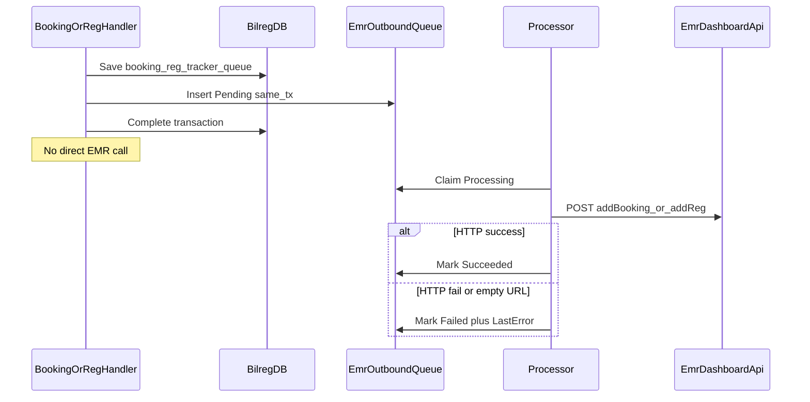

# F-11 Implementation Report — EMR Antrian Outbox (Slice 1)

**Artifact status:** Implementation summary (Slice 1 closed; full F-11 still partial)  
**Bounded context:** Patient Tracker §9 facts + Admisi Booking/Reg → EMR Dashboard (cross-context delivery)  
**Authoritative domain:** [`TRACKER-DOMAIN.md`](TRACKER-DOMAIN.md) §9 Domain Events (stable business facts)  
**Engineering stance:** [`docs/ENGINEERING.md`](../../ENGINEERING.md) §14 — Direct Orchestration First; no generic event bus  
**Source gap:** F-11 in [`tracker-codebase-gap-report.md`](tracker-codebase-gap-report.md) (Severity: High)  
**Primary commit:** `02da90ac` — `feat(pasien-tracker): outbox EMR antrian Booking/Reg Jalan (F-11 Slice 1)`  
**Full hash:** `02da90ac7c540832a63c32a1dab31db5ec828b9d` (2026-07-21 15:19:20 +07)  
**Parent commit:** `5b7627df` (F-10) · **Next commit in series:** `0256688d` (F-12 persistence-shape docs)  
**Branch series:** `jude-refactor-tracker` (F-01 → F-13)  
**Pattern reused:** Lab OWARE outbound queue (`LabOwareOutboundQueue*` / `LabOwareQueueProcessor`) — feature-local SQL outbox, not a shared platform bus  
**Depends on:** F-10 only for series order; behaviorally independent of Tracker GET contracts. Local Booking/Reg writes already existed; this gap fixes **durable publication** of queue-number assignment to EMR.

---

## 1. TL;DR for agents

Before F-11 Slice 1, Booking/Reg Jalan committed Tracker + queue + booking/reg locally, then called EMR `addBooking` / `addReg` **after** `trans.Complete()`. HTTP success was ignored; empty `BaseApiUrl` was a silent no-op. There was no durable obligation, retry, or reconciliation for the section-9 fact **Booking Queue Number Assigned** (and the Reg-side EMR publish).

After F-11 Slice 1 (`02da90ac`):

| Concern | Rule for agents |
|---|---|
| Enqueue timing | Outbox row **must** be inserted in the **same** `TransHelper` scope as Booking/Reg/Tracker/Antrian saves — never after commit |
| No direct EMR from handlers | `BookingCreate` / `RegJalanWalkIn` / `RegJalanByBooking` must **not** call `_addAntrianEmr*Service.Execute` after commit |
| Delivery | Ops/worker calls `POST api/AdmisiContext/EmrAntrianOutboundFeature/process` → `EmrAntrianOutboundProcessor` → `IEmrAntrianOutboundIntegration.Send` |
| Message types | `AddBooking` (SourceId = BookingId) · `AddReg` (SourceId = RegId) |
| Idempotent enqueue | Skip if active row exists for `(SourceId, MessageType)` with status Pending/Processing/Succeeded |
| Idempotent process | If status already Succeeded → return success and **do not** re-send |
| HTTP reliability | `Send()` inspects `IsSuccessful`; empty `BaseApiUrl` → **Failed** with `"EMR BaseApiUrl empty"` (visible, not silent) |
| Retry | Manual retry only from **Failed** (`AssertCanManualRetry` → ProcessOne) |
| Pattern | Feature-local outbox (mirror Lab OWARE). **Do not** introduce MediatR `INotification` fact bus for Tracker §9 |
| Taksaka | `AntrianConsistencyRepairWorker` remains legacy BOK→REG projection repair (F-14) — **not** EMR publish truth |
| Slice 1 scope | BookingCreate + RegJalan WalkIn/ByBooking only |

**Real case (why it matters):** Bu Siti books dokter pagi. Bilreg saves tracker + nomor antrian. Pre-F-11, EMR call after commit could fail or skip silently — Bilreg shows nomor, EMR desktop does not. Post-F-11, Pending outbox row is durable; worker retries until Succeeded or Failed is visible on worklist.



```text
BookingCreate / RegJalan* (in TransHelper scope):
  SaveChanges(booking|reg, antrian, tracker, ...)
  EmrAntrianOutboundEnqueueService.TryEnqueueAddBooking|AddReg(payload, occurredAt)
  Complete()

EmrAntrianOutboundProcessor.ProcessOne(queueId):
  if Succeeded → return (no send)
  MarkProcessing + commit
  integration.Send(MessageType, PayloadJson)
  MarkSucceeded | MarkFailed + commit
```

---

## 2. Domain / engineering intents encoded

F-11 is a **cross-context reliability** gap. Section 9 names are **stable business facts**, not MediatR notifications and not Tracker Event descriptions (`EventName`).

| Fact / concern | Slice 1 status | How represented |
|---|---|---|
| Booking Queue Number Assigned | **Durable obligation** | Outbox `AddBooking` + BookingId; payload = `AddAntrianEmrByBookingCmd` |
| Reg-side EMR queue publish | **Durable obligation** | Outbox `AddReg` + RegId; payload = `AddAntrianEmrByRegCommand` |
| Patient Tracker Established | Local orchestration only | Still implicit in Booking/Reg factories — no outbox row |
| Tracker Evidence Recorded | Local append (F-03) | Not an EMR outbox message |
| Queue Service Started/Completed | Local Serve/Done (F-06–F-08) | Not EMR outbox |
| Pharmacy Apotek-* | F-09 HTTP Farinv→Bilreg | **Not** outbox-backed (Slice 2 candidate) |
| Remaining §9 facts | Open | No explicit fact contracts yet |

### Recommended Direction F-11 — applied checklist (Slice 1)

| Direction item | Applied? |
|---|---|
| Explicit direct orchestration and/or outbox-style fact record | Yes — outbox for EMR effects that can fail after commit |
| Idempotency for each cross-context fact | Yes — enqueue skip + process skip Succeeded + filtered unique index |
| Reconciliation visible | Yes — worklist Pending/Failed; HTTP errors persisted in `LastError` |
| Generic event framework | **No** — deliberately avoided |
| Keep Taksaka until proven | Yes — not replaced |

---

## 3. Files by commit attribution (`02da90ac`)

### 3.1 New feature — EmrAntrianOutbound

| Layer | Path | Role |
|---|---|---|
| SQL | [`BILRG_EmrAntrianOutboundQueue.sql`](../../../src/bilreg/Bilreg.SqlDb/AdmisiContext/EmrAntrianOutboundFeature/BILRG_EmrAntrianOutboundQueue.sql) | Table + status index + filtered unique `(SourceId, MessageType)` for active statuses 0/1/2 |
| Domain | `EmrAntrianOutboundQueueModel.cs`, `EmrAntrianOutboundQueueStatusEnum.cs`, `IEmrAntrianOutboundQueueKey.cs` | Pending → Processing → Succeeded/Failed; `CreatePending`, `Mark*`, `AssertCanManualRetry` |
| Application | `EmrAntrianOutboundEnqueueService.cs` | `TryEnqueueAddBooking` / `TryEnqueueAddReg` |
| Application | `EmrAntrianOutboundProcessor.cs` | Claim → send → persist outcome (two short txs) |
| Application | `EmrAntrianOutboundPayloadBuilder.cs` | JSON camelCase serialize/deserialize existing EMR DTOs |
| Application | `UseCases/EmrAntrianOutboundProcessCmd.cs`, `RetryCmd.cs`, `WorklistQuery.cs` | Ops MediatR surface |
| Infrastructure | `EmrAntrianOutboundQueueDal/Dto/Repo.cs`, `WorklistDal.cs`, `EmrAntrianOutboundIntegration.cs` | Persistence + dispatch by MessageType |
| API | [`EmrAntrianOutboundController.cs`](../../../src/bilreg/Bilreg.Api/Controllers/AdmisiContext/EmrAntrianOutboundFeature/EmrAntrianOutboundController.cs) | process / retry / worklist |
| DI | [`InfrastructureService.cs`](../../../src/bilreg/Bilreg.Api/Configurations/InfrastructureService.cs) | Register integration, worklist DAL, processor, enqueue service |

### 3.2 Handlers wired in-transaction

| Path | Change |
|---|---|
| [`BookingCreateCmd.cs`](../../../src/bilreg/Bilreg.Application/AdmisiContext/BookingFeature/UseCases/BookingCreateCmd.cs) | Replace post-commit EMR with `TryEnqueueAddBooking` inside tx |
| [`RegJalanWalkInCommand.cs`](../../../src/bilreg/Bilreg.Application/AdmisiContext/RegFeature/UseCases/RegJalanWalkInCommand.cs) | Same for `TryEnqueueAddReg` |
| [`RegJalanByBookingCmd.cs`](../../../src/bilreg/Bilreg.Application/AdmisiContext/RegFeature/UseCases/RegJalanByBookingCmd.cs) | Same for `TryEnqueueAddReg` |

### 3.3 EMR HTTP services (reliability)

| Path | Change |
|---|---|
| `IAddAntrianEmrByBookingService` / `IAddAntrianEmrByRegService` | Add `Send(...) → EmrAntrianSendResult` |
| `AddAntrianEmrByBookingService` / `AddAntrianEmrByRegService` | Inspect HTTP; empty URL → Failed |

`Execute` remains for legacy callers (`RegDaruratCreateCmd`) and delegates to `Send`.

### 3.4 Tests + gap note

| Path | Role |
|---|---|
| `EmrAntrianOutboundQueueModelTest.cs` | Status transitions / retry guard |
| `EmrAntrianOutboundEnqueueServiceTest.cs` | Insert vs skip active |
| `EmrAntrianOutboundProcessorTest.cs` | Success / fail / skip Succeeded |
| `BookingCreateSoftDuplicateHandlerTest.cs` | Soft-duplicate path does not enqueue |
| `AddAntrianEmrByRegServiceTest.cs` | `Send` success + empty URL failure |
| [`tracker-codebase-gap-report.md`](tracker-codebase-gap-report.md) | F-11 marked Slice 1 applied |

---

## 4. Before / after

| Aspect | Before | After (`02da90ac`) |
|---|---|---|
| EMR call site (Booking/Reg Jalan) | After `trans.Complete()` | Enqueue Pending **inside** tx |
| HTTP result | Ignored | `IsSuccessful` → Succeeded/Failed |
| Empty `BaseApiUrl` | Silent return | Failed + `"EMR BaseApiUrl empty"` |
| Retry | None | Process batch + Failed→Retry |
| Reconciliation | Invisible divergence | Worklist by status / SourceId |
| `RegDaruratCreateCmd` | Post-commit Execute | **Unchanged** (still fire-and-forget) |
| `BookingCreateFromHidok` | No EMR call (BookSync path) | **Unchanged** (injects service unused) |

---

## 5. Persistence & API surface

### Table `BILRG_EmrAntrianOutboundQueue`

| Column | Meaning |
|---|---|
| `QueueId` | PK (`EAQ…` via `NunaId`) |
| `SourceId` | BookingId or RegId |
| `MessageType` | `AddBooking` \| `AddReg` |
| `PayloadJson` | Serialized EMR command body |
| `QueueStatus` | 0 Pending, 1 Processing, 2 Succeeded, 3 Failed |
| `RetryCount` / `LastRetryDate` / `ProcessedDate` / `LastError` / `CrtDate` | Delivery telemetry |

Indexes: `(QueueStatus, CrtDate)`; filtered unique `UX_…_ActiveSource` on `(SourceId, MessageType)` WHERE status IN (0,1,2).

**Deploy:** run [`BILRG_EmrAntrianOutboundQueue.sql`](../../../src/bilreg/Bilreg.SqlDb/AdmisiContext/EmrAntrianOutboundFeature/BILRG_EmrAntrianOutboundQueue.sql) before API that enqueues. Schedule periodic `POST .../process` (ops/Taksaka-style worker) or Pending rows stall.

### Controller `api/AdmisiContext/EmrAntrianOutboundFeature`

| Method | Route | MediatR |
|---|---|---|
| POST | `process?batchSize=&userId=` | `EmrAntrianOutboundProcessCmd` |
| PATCH | `retry` body `{ queueId, userId }` | `EmrAntrianOutboundRetryCmd` |
| GET | `worklist?queueStatus=&searchTerm=&date1=&date2=` | `EmrAntrianOutboundWorklistQuery` |

External EMR endpoints unchanged: `/api/Dashboard/addBooking`, `/api/Dashboard/addReg`.

---

## 6. Verification

Focused suite at Slice 1 close:

```text
dotnet test src/bilreg/Bilreg.Test/Bilreg.Test.csproj --filter \
  "FullyQualifiedName~EmrAntrianOutbound|FullyQualifiedName~BookingCreateSoftDuplicate|FullyQualifiedName~AddAntrianEmrByRegService"
```

Result at implementation time: **17 passed**.

Build: `Bilreg.Api` succeeded after the change.

---

## 7. Position in the Tracker fix series

Git order on the tracker refactor branch (each gap ≈ one commit; F-09 split; F-11 is Slice 1 only):

| Commit | Gap | Role relative to F-11 |
|---|---|---|
| … | F-01–F-08 | Local journey/queue/evidence truth |
| `b03895cd` / `be331b42` / `5b7627df` | F-09 / F-10 | Pharmacy evidence still sync HTTP (not this outbox) |
| **`02da90ac`** | **F-11 Slice 1** | **EMR Booking/Reg Jalan durable publish** |
| `0256688d` | F-12 | Persistence-shape docs (orthogonal) |
| `bc1fe81d` | F-13 | AntrianMap number authority (orthogonal to EMR delivery) |

**Agent rule:** Prefer this report over historical gap-report wording that “Booking/Reg call EMR after commit and ignore HTTP.” That describes **pre-`02da90ac`** for the three Slice-1 handlers. Prefer HEAD for those handlers; treat `RegDaruratCreateCmd` as **still** fire-and-forget until a later slice.

---

## 8. Downstream consumers & caveats

- **Ops dependency:** Without a scheduled `process` caller, Pending rows accumulate and EMR never receives numbers — local Bilreg truth still looks fine.
- **Do not** treat Succeeded outbox as Tracker Event evidence — outbox is delivery telemetry for EMR Dashboard, not `PasienTrackerEvent`.
- **Do not** replace Taksaka BOK→REG repair with this outbox (F-14); different concern.
- **Do not** add MediatR notifications “because §9 says Domain Events” — ENGINEERING prefers direct orchestration; §9 facts are business names.
- **Pharmacy F-09:** Farinv→Bilreg `AppendTrackerEvidenceService` remains request/response HTTP without outbox — known remaining reliability hole (Slice 2).
- **Payload identity:** Keep using existing EMR DTO fields; do not invent TrackerId in EMR payload unless EMR contract is versioned separately.

---

## 9. Scope boundaries

**In scope (closed at HEAD for F-11 Slice 1):**
- Feature-local EMR antrian outbox table/model/repo/processor
- In-tx enqueue from BookingCreate, RegJalanWalkIn, RegJalanByBooking
- HTTP success inspection + empty-URL Failed policy
- Process / Retry / Worklist API
- Unit tests + gap-report Slice 1 note

**Explicitly out of scope (still open under F-11 / follow-ups):**
- `RegDaruratCreateCmd` EMR path (still post-commit `Execute`)
- `BookingCreateFromHidok` EMR (intentionally unused; BookSync may publish elsewhere)
- Pharmacy Farinv→Bilreg evidence outbox (Slice 2)
- Explicit contracts/handlers for all ten §9 facts
- Background hosted worker inside Bilreg.Api (ops polls process endpoint)
- Replacing Taksaka consistency repair

---

## 10. Related artifacts

- Domain facts: [`TRACKER-DOMAIN.md`](TRACKER-DOMAIN.md) §9  
- Gap finding: [`tracker-codebase-gap-report.md`](tracker-codebase-gap-report.md) §5 F-11; sequence §8 step 10  
- Engineering: [`docs/ENGINEERING.md`](../../ENGINEERING.md) §14 Direct Orchestration First  
- Pattern template: Lab OWARE (`BILRG_LabOwareOutboundQueue`, `LabOwareQueueProcessor`)  
- Operational vs audit vs DDD events: [`docs/concepts/operational-events.md`](../../concepts/operational-events.md)  
- Adjacent gaps: [`tracker-f10-implementation-report.md`](tracker-f10-implementation-report.md) (prior), F-14 (Taksaka projection), F-09 (pharmacy HTTP still sync)  
- Compatibility number authority: [`TRACKER-COMPATIBILITY.md`](TRACKER-COMPATIBILITY.md) / [`tracker-f13-implementation-report.md`](tracker-f13-implementation-report.md) — orthogonal to EMR delivery
