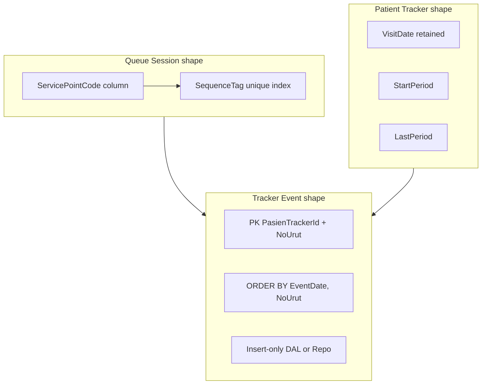

# F-12 Implementation Report — Persistence Shape (Queue Session + Deterministic Evidence)

**Artifact status:** Implementation summary (closed in source; deploy/residuals deferred)  
**Bounded context:** Patient Tracker / Admisi Antrian  
**Authoritative domain:** [`TRACKER-DOMAIN.md`](TRACKER-DOMAIN.md) — Queue Session (BR-TRK-026..028), Tracking Period (BR-TRK-005..008), evidence order (BR-TRK-017..018)  
**Source gap:** F-12 in [`tracker-codebase-gap-report.md`](tracker-codebase-gap-report.md) (Severity: High → closed in source)  
**Closing commit:** `0256688d` — `docs(pasien-tracker): close F-12 persistence shape in gap report`  
**Full hash:** `0256688d6a88e5676634c339bab1a1887631bc5d` (2026-07-21 16:03:03 +07)  
**Parent commit:** `02da90ac` (F-11 Slice 1) · **Next commit in series:** `bc1fe81d` (F-13)  
**Branch series:** `jude-refactor-tracker` (F-01 → F-13)  
**Nature of this gap:** **Cross-cutting persistence shape** — schema/mapping mostly delivered in earlier commits (F-01, F-03, F-05, F-06); F-12 closing commit is verification + gap-report truth + DalTest harden.

---

## 1. TL;DR for agents

F-12 is **not** a greenfield feature commit. It is the **durable storage contract** that makes Queue Session identity and Tracker evidence representable without encoded strings, sentinels-as-schema, or timestamp-collision PK failure.

### Real case (why the shape matters)

RS morning ops: Loket Admisi A and Loket Admisi B both open 07:00–12:00. Bu Siti takes anonymous number **A-15**, later resolved to a booking-created `TrackerId`. Two Tracker Events may share the same second (check-in + Reg-Start).

| Failure mode before durable shape | Business symptom |
|---|---|
| Service Point only in `SequenceTag` / description | Wrong loket ownership; concurrent create of “same” session |
| Only `VisitDate` on tracker header | Cross-date booking omitted from candidate eligibility |
| Event PK `(PasienTrackerId, EventDate)` | Second event at equal `OccurredAt` rejected |
| Event Update/Delete in repo | Timeline rewrite / corrupt reconciliation |

### Agent rules after F-12 (source-closed)

| Concern | Rule |
|---|---|
| Persist Queue Session | Write **`ServicePointCode`** explicitly; keep `SequenceTag` as operational lookup key (`UX_BILRG_Antrian_SequenceTag`) |
| Rehydrate Service Point | Prefer column; if empty, `AntrianModel.ServicePointCodeFromSequenceTag(SequenceTag)` (dual-read) |
| Persist Tracking Period | Header has `StartPeriod` + `LastPeriod`; **do not** remove `VisitDate` |
| Candidate / period list | Overlap: `StartPeriod <= @Tgl2 AND LastPeriod >= @Tgl1` — not `VisitDate BETWEEN` |
| Persist Tracker Event | **Insert-only**; PK `(PasienTrackerId, NoUrut)`; load `ORDER BY EventDate, NoUrut` |
| Equal timestamps | Allowed after M2; tie-break = `NoUrut` |
| Queue Evidence `ReffId` | Format `{AntrianId}/No.{NoUrut}` needs `ReffId VARCHAR(40)` (M3) |
| Anonymous entry tracker | Still **NOT NULL + sentinel** `"-"` / `""` — do not assume NULL means anonymous |
| Natural session UX | **Not** on `(ServicePointCode, AntrianDate, StartTime, EndTime)` — deferred (§7.1.5) |
| Deploy | Apply M1–M3 alters per environment before relying on new columns/PK; production deploy = **Unable to Verify** from repo alone |



---

## 2. Recommended Direction F-12 — applied checklist

From gap-report F-12 recommended direction:

| Direction item | Applied? | Where |
|---|---|---|
| Additive `ServicePointCode` | **Yes** | F-06 `a3232c56` — green DDL + `BILRG_Antrian_M1_ServicePointCode_Alter.sql` |
| Additive `StartPeriod` / `LastPeriod` | **Yes** | F-01 `aa449aeb` — green DDL + `BILRG_PasienTracker_M1_TrackingPeriod_Alter.sql` |
| Event identity / order allowing equal `OccurredAt` | **Yes** | F-03 `1ac10bf7` — PK `(PasienTrackerId, NoUrut)` + M2 alter |
| Session uniqueness / concurrency policy (light) | **Partial** | `UX_BILRG_Antrian_SequenceTag` (F-06); natural tuple UX deferred |
| Profile before constraints | **Yes in scripts** | M1 SequenceTag duplicate THROW; M2 orphan/duplicate profile queries |
| Widen `ReffId` for Queue Evidence Reference | **Yes** | F-05 `cb07cd59` — M3 alter + green `VARCHAR(40)` |
| Verify mapping + close gap-report | **Yes** | F-12 `0256688d` |

---

## 3. Commit attribution (git history)

F-12 **closes** a shape that was built across separate commits on `jude-refactor-tracker`. Prefer this table over assuming all DDL landed in `0256688d`.

| Commit | Gap label | Contribution to F-12 shape |
|---|---|---|
| `aa449aeb` | **F-01** | `StartPeriod`/`LastPeriod` model+DTO+DAL; overlap list filter; M1 TrackingPeriod alter + index |
| `27dad573` | F-02 | Stable TrackerId / no physical delete of journey — consumer of append-only shape |
| `1ac10bf7` | **F-03** | Event PK → `(PasienTrackerId, NoUrut)`; insert-only Event DAL/Repo; `ORDER BY EventDate, NoUrut`; M2 alter |
| `ab93e77f` | F-04 | Candidates use period overlap (depends on F-01 columns) |
| `cb07cd59` | **F-05** | Queue Evidence Reference + **M3** `ReffId` → `VARCHAR(40)` |
| `a3232c56` | **F-06** | Explicit `ServicePoint` + **`ServicePointCode`** column; M1 Antrian alter; `UX_BILRG_Antrian_SequenceTag` |
| `3def0ded` … `02da90ac` | F-07…F-11 | Workflow/API/outbox consumers of the durable shape (not schema authors) |
| **`0256688d`** | **F-12** | **Closing:** gap-report rewrite to closed-in-source; sync executive summary/matrix/BR-TRK-018/021; `PasienTrackerDalTest.EnsureTrackingPeriodColumns` |
| `bc1fe81d` | F-13 | Compatibility adapter for number authority — must still reserve into canonical session uniqueness |

### Files in closing commit `0256688d` only

| Path | Change |
|---|---|
| [`tracker-codebase-gap-report.md`](tracker-codebase-gap-report.md) | F-12 status → Mostly Implemented / Closed in source; residual list; High severity count 7→6; sync stale overview/matrix |
| [`PasienTrackerDalTest.cs`](../../../src/bilreg/Bilreg.Test/AdmisiContext/AntrianFeature/PasienTrackerDalTest.cs) | `EnsureTrackingPeriodColumns()` inside ambient test transaction (same pattern as `AntrianDalTest.EnsureServicePointCodeColumn`) |

**Do not** treat `0256688d` as the inventing commit for `ServicePointCode` or period columns — those are F-06 / F-01.

---

## 4. Durable schema inventory (agent map)

### 4.1 `BILRG_Antrian` (Queue Session)

| Artifact | Role |
|---|---|
| [`BILRG_Antrian.sql`](../../../src/bilreg/Bilreg.SqlDb/AdmisiContext/AntrianFeature/BILRG_Antrian.sql) | Greenfield includes `ServicePointCode VARCHAR(50)` |
| [`BILRG_Antrian_M1_ServicePointCode_Alter.sql`](../../../src/bilreg/Bilreg.SqlDb/AdmisiContext/AntrianFeature/BILRG_Antrian_M1_ServicePointCode_Alter.sql) | Additive column + backfill from `SequenceTag` suffix + `UX_BILRG_Antrian_SequenceTag` |
| [`AntrianDto.cs`](../../../src/bilreg/Bilreg.Infrastructure/AdmisiContext/AntrianFeature/AntrianDto.cs) / [`AntrianDal.cs`](../../../src/bilreg/Bilreg.Infrastructure/AdmisiContext/AntrianFeature/AntrianDal.cs) | Insert/Update/Get/List(Periode) map `ServicePointCode` |

**Residual:** `ListData(DateTime)` entry view may omit `ServicePointCode` (still derivable from tag).

### 4.2 `BILRG_PasienTracker` (Tracking Period)

| Artifact | Role |
|---|---|
| [`BILRG_PasienTracker.sql`](../../../src/bilreg/Bilreg.SqlDb/AdmisiContext/AntrianFeature/BILRG_PasienTracker.sql) | Greenfield `StartPeriod`/`LastPeriod` + `IX_BILRG_PasienTracker_TrackingPeriod` |
| [`BILRG_PasienTracker_M1_TrackingPeriod_Alter.sql`](../../../src/bilreg/Bilreg.SqlDb/AdmisiContext/AntrianFeature/BILRG_PasienTracker_M1_TrackingPeriod_Alter.sql) | Additive columns + evidence-based backfill; `VisitDate` never rewritten |
| [`PasienTrackerModel.cs`](../../../src/bilreg/Bilreg.Domain/AdmisiContext/AntrianFeature/PasienTrackerModel.cs) | Period derivation on `AddEvent` (BR-TRK-005..008) |
| [`PasienTrackerDal.cs`](../../../src/bilreg/Bilreg.Infrastructure/AdmisiContext/AntrianFeature/PasienTrackerDal.cs) | CRUD + overlap list filter |

**Residual:** unused header `RegId` column still in DDL; not mapped in DTO.

### 4.3 `BILRG_PasienTrackerEvent` (deterministic evidence)

| Artifact | Role |
|---|---|
| [`BILRG_PasienTrackerEvent.sql`](../../../src/bilreg/Bilreg.SqlDb/AdmisiContext/AntrianFeature/BILRG_PasienTrackerEvent.sql) | PK `(PasienTrackerId, NoUrut)`; `ReffId VARCHAR(40)` |
| [`BILRG_PasienTrackerEvent_M2_AppendOnlyKey_Alter.sql`](../../../src/bilreg/Bilreg.SqlDb/AdmisiContext/AntrianFeature/BILRG_PasienTrackerEvent_M2_AppendOnlyKey_Alter.sql) | Migrate PK off `EventDate`; profile orphans/dupes; no auto-delete |
| [`BILRG_PasienTrackerEvent_M3_ReffIdWiden_Alter.sql`](../../../src/bilreg/Bilreg.SqlDb/AdmisiContext/AntrianFeature/BILRG_PasienTrackerEvent_M3_ReffIdWiden_Alter.sql) | Widen `ReffId` for `{AntrianId}/No.{NoUrut}` |
| [`PasienTrackerEventDal.cs`](../../../src/bilreg/Bilreg.Infrastructure/AdmisiContext/AntrianFeature/PasienTrackerEventDal.cs) | Insert + ordered ListData only |
| [`PasienTrackerRepo.cs`](../../../src/bilreg/Bilreg.Infrastructure/AdmisiContext/AntrianFeature/PasienTrackerRepo.cs) | Append missing `NoUrut`; `DeleteEntity` throws |

### 4.4 `BILRG_AntrianEntry` (optional Tracker association — residual)

| Aspect | Current contract |
|---|---|
| Column | `PasienTrackerId VARCHAR(26) NOT NULL` |
| Anonymous | Sentinel `"-"` / empty — **not** SQL NULL |
| App helper | Treat `""` and `"-"` as non-real tracker (`IsRealTrackerId` pattern) |

Nullable column + dual-read was **deferred** by F-12 option C (verify/docs only).

### 4.5 SqlDb project registration

All green DDL + M1/M2/M3 alters are `<None Include=...>` in [`Bilreg.SqlDb.sqlproj`](../../../src/bilreg/Bilreg.SqlDb/Bilreg.SqlDb.sqlproj) (project-wide pattern — not SSDT Build deploy).

---

## 5. Domain rules covered by the shape

| Rule | Persistence consequence | Delivered in |
|---|---|---|
| BR-TRK-005..008 | Durable `StartPeriod`/`LastPeriod` on header | F-01 |
| BR-TRK-017 | Events insert-only; no normal Update/Delete | F-03 |
| BR-TRK-018 | Order by `EventDate`, `NoUrut`; equal times OK | F-03 |
| BR-TRK-021 (foundation) | List by period overlap | F-01 |
| BR-TRK-026 | Explicit Service Point on session | F-06 |
| BR-TRK-013 (width) | `ReffId` can hold Queue Evidence Reference | F-05 M3 |
| BR-TRK-027 (DB net) | Entry PK `(AntrianId, NoUrut)`; session lookup uniqueness via SequenceTag | F-06 + existing entry PK |

Detailed behavioral encoding lives in sibling reports: [`tracker-f01-implementation-report.md`](tracker-f01-implementation-report.md), [`tracker-f03-implementation-report.md`](tracker-f03-implementation-report.md), [`tracker-f05-implementation-report.md`](tracker-f05-implementation-report.md), [`tracker-f06-implementation-report.md`](tracker-f06-implementation-report.md).

---

## 6. Before / after (persistence shape)

| Aspect | Before F-12 shape | After (source-closed) |
|---|---|---|
| Service Point | Encoded in `SequenceTag`/description only | Column `ServicePointCode` + dual-read |
| Session uniqueness | None at DB for operational lookup | `UX_BILRG_Antrian_SequenceTag` (natural tuple still open) |
| Tracking Period | Single `VisitDate` | `StartPeriod` + `LastPeriod` (+ keep `VisitDate`) |
| Candidate filter | `VisitDate BETWEEN` | Period overlap predicate |
| Event PK | `(PasienTrackerId, EventDate)` | `(PasienTrackerId, NoUrut)` |
| Event mutation | Repo update/delete sync | Insert-only + `DeleteEntity` throws |
| Event order | Unordered reads | `ORDER BY EventDate, NoUrut` |
| Queue Evidence ReffId | Often too short (`VARCHAR(26)`) | `VARCHAR(40)` |
| Gap-report F-12 | Partially Implemented / stale evidence | Closed in source + residuals |

---

## 7. Verification

Closing verification (F-12 option C), filter used with commit `0256688d`:

```text
dotnet test src/bilreg/Bilreg.Test/Bilreg.Test.csproj --filter \
  "FullyQualifiedName~PasienTrackerModelTest|\
FullyQualifiedName~PasienTrackerDalTest|\
FullyQualifiedName~PasienTrackerEventDalTest|\
FullyQualifiedName~PasienTrackerRepoTest|\
FullyQualifiedName~AntrianModelTest|\
FullyQualifiedName~AntrianDalTest"
```

**Result:** 29 passed (after `EnsureTrackingPeriodColumns` so shared test DB without permanent M1 TrackingPeriod still exercises period DAL).

Related in-transaction ensure helpers:

| Test | Helper |
|---|---|
| `AntrianDalTest` | `EnsureServicePointCodeColumn` (F-06) |
| `PasienTrackerEventDalTest` | `EnsureAppendOnlyPrimaryKey` (F-03) |
| `PasienTrackerDalTest` | `EnsureTrackingPeriodColumns` (F-12 close) |

---

## 8. Deploy / ops checklist (agents & DBA)

Apply in dependency order on **existing** DBs (idempotent scripts; profile first):

1. [`BILRG_PasienTracker_M1_TrackingPeriod_Alter.sql`](../../../src/bilreg/Bilreg.SqlDb/AdmisiContext/AntrianFeature/BILRG_PasienTracker_M1_TrackingPeriod_Alter.sql) — F-01  
2. [`BILRG_PasienTrackerEvent_M2_AppendOnlyKey_Alter.sql`](../../../src/bilreg/Bilreg.SqlDb/AdmisiContext/AntrianFeature/BILRG_PasienTrackerEvent_M2_AppendOnlyKey_Alter.sql) — F-03 (resolve duplicate `NoUrut` if THROW path)  
3. [`BILRG_PasienTrackerEvent_M3_ReffIdWiden_Alter.sql`](../../../src/bilreg/Bilreg.SqlDb/AdmisiContext/AntrianFeature/BILRG_PasienTrackerEvent_M3_ReffIdWiden_Alter.sql) — F-05  
4. [`BILRG_Antrian_M1_ServicePointCode_Alter.sql`](../../../src/bilreg/Bilreg.SqlDb/AdmisiContext/AntrianFeature/BILRG_Antrian_M1_ServicePointCode_Alter.sql) — F-06 (resolve duplicate `SequenceTag` before UX)

**Do not** auto-delete orphan events reported by M2. Deployed production/staging state remains **Unable to Verify** until these scripts are run and profiled in that environment.

---

## 9. Residuals (intentionally open under F-12)

| Residual | Why deferred | Follow-up hint |
|---|---|---|
| Unique `(ServicePointCode, AntrianDate, StartTime, EndTime)` | Domain §7.1.5 does not decide duplicate/overlap sessions | Decide policy, then profile + additive UX |
| Nullable `PasienTrackerId` | Legacy consumers may rely on sentinel `"-"` | Dual-read NULL/`"-"` if changing; backfill carefully |
| `AntrianDal.ListData(DateTime)` without `ServicePointCode` | View still tag-derivable | Additive SELECT when list consumers need explicit SP |
| Header `RegId` unused | Compatibility leftover | Optional cleanup; do not repurpose for TrackerId |
| RowVersion / optimistic concurrency | Not in Antrian/Tracker repo pattern | Separate decision |
| Production alter applied? | Out of repo | Ops verification |

---

## 10. Position in the Tracker fix series

| Commit | Gap | Role relative to F-12 |
|---|---|---|
| `aa449aeb` | F-01 | **Period columns** |
| `27dad573` | F-02 | Identity retention (uses append-only) |
| `1ac10bf7` | F-03 | **Event PK + append-only** |
| `ab93e77f` | F-04 | Consumes period overlap |
| `cb07cd59` | F-05 | **ReffId M3** + Queue Evidence Reference |
| `a3232c56` | F-06 | **ServicePointCode + SequenceTag UX** |
| `3def0ded` | F-07 | Milestone semantics on durable queues |
| `fb73201b` | F-08 | Consultation evidence rows |
| `b03895cd` / `be331b42` | F-09 | Pharmacy evidence |
| `5b7627df` | F-10 | HTTP contracts over durable shape |
| `02da90ac` | F-11 | EMR outbox (separate table) |
| **`0256688d`** | **F-12** | **Shape verification + gap-report close** |
| `bc1fe81d` | F-13 | Legacy number adapter vs session uniqueness |

**Agent rule:** When fixing “schema can’t express Tracker/Queue,” read **this report** first; for *how* period/events/Service Point behave, open the sibling F-01/F-03/F-05/F-06 reports. Prefer closed-source wording in gap-report §F-12 over historical “no ServicePointCode / EventDate PK” evidence.

---

## 11. Scope boundaries

**In scope for F-12 (as a gap):** Faithful persistence representation of Queue Session identity, Tracking Period, deterministic event order, and related additive migration/profile policy — verified and documented as closed in source at `0256688d`.

**Explicitly out of scope / other gaps:**
- Journey Resolution UX — F-04  
- Anonymous intake orchestration — F-05  
- Serve/Done lifecycle guards (behavior) — F-06 (schema piece attributed above)  
- Registration vs consultation milestone *semantics* — F-07  
- Evidence *content* for consult/pharmacy — F-08/F-09  
- HTTP surface — F-10  
- EMR outbox reliability — F-11  
- Legacy AntrianMap number authority — F-13  
- Natural session-tuple uniqueness, nullable TrackerId, RowVersion — residuals above  

---

## 12. Quick file index for agents

| Need | Start here |
|---|---|
| Business truth | [`TRACKER-DOMAIN.md`](TRACKER-DOMAIN.md) |
| Gap status + residuals | [`tracker-codebase-gap-report.md`](tracker-codebase-gap-report.md) §F-12 |
| Period rules | [`tracker-f01-implementation-report.md`](tracker-f01-implementation-report.md) |
| Append-only events | [`tracker-f03-implementation-report.md`](tracker-f03-implementation-report.md) |
| Queue Evidence + ReffId width | [`tracker-f05-implementation-report.md`](tracker-f05-implementation-report.md) |
| ServicePointCode + SequenceTag UX | [`tracker-f06-implementation-report.md`](tracker-f06-implementation-report.md) |
| Legacy number dual-write | [`TRACKER-COMPATIBILITY.md`](TRACKER-COMPATIBILITY.md) / F-13 report |
| Global SQL standards | [`docs/DATABASE.md`](../../DATABASE.md) |
