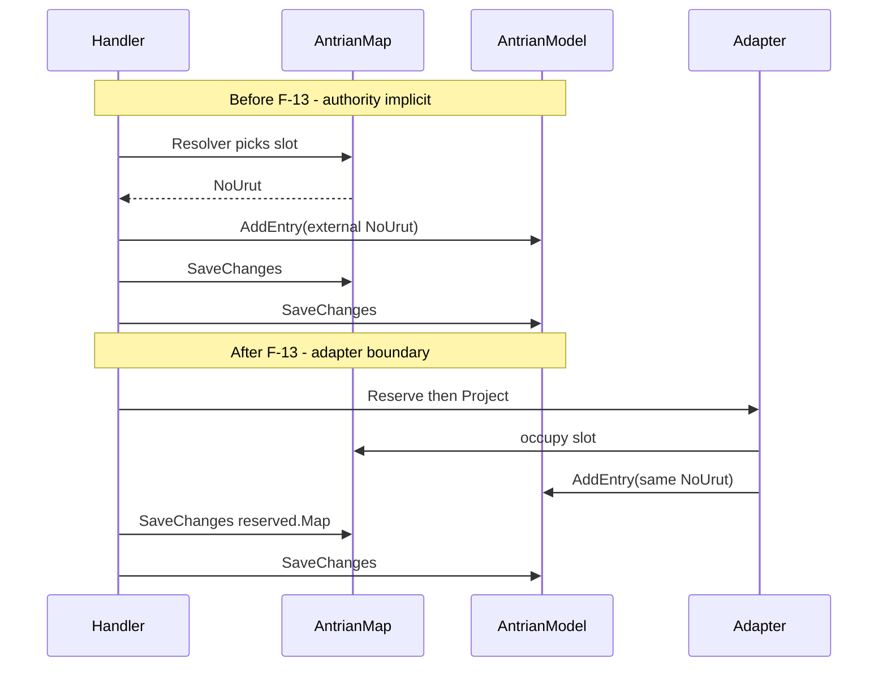

# F-13 Implementation Report — Compatibility Adapter & Authority Map

**Artifact status:** Implementation summary (closed in source; cutover deferred)  
**Bounded context:** Patient Tracker / Admisi Antrian  
**Authoritative domain:** [`TRACKER-DOMAIN.md`](TRACKER-DOMAIN.md)  
**Compatibility contract:** [`TRACKER-COMPATIBILITY.md`](TRACKER-COMPATIBILITY.md)  
**Source gap:** F-13 in [`tracker-codebase-gap-report.md`](tracker-codebase-gap-report.md) (Severity: Medium)  
**Date closed in source:** 2026-07-21  
**Rules reinforced:** BR-TRK-026–039 (Queue Session owns numbers/milestones), BR-TRK-009c (slot release ≠ Tracker deletion)

---

## 1. TL;DR for agents

Before F-13, **queue-number authority was split and undocumented**: legacy `AntrianMap` (`ta_no_antrian_map`) picked the physician `NoUrut`, then Booking/Reg handlers dual-wrote that number into `AntrianModel` inline. `IsTerpakai` was easy to misread as Waiting/In Service/Done.

After F-13:

| Concern | Owner now | Agent rule |
|---|---|---|
| Pick physician `NoUrut` (transition) | Legacy map via **`IQueueNumberCompatibilityAdapter`** | Do **not** call map resolvers or `AddEntry(externalNo)` from handlers directly |
| Queue uniqueness + milestones | Queue Session (`AntrianEntry`) | Waiting/InService/Done only via `Serve`/`Done` |
| Slot occupancy | Map `IsTerpakai` / Flag / ReffId | **Never** map to Waiting/InService/Done |
| Journey identity | `PasienTrackerId` | Never encode into map `fs_kd_trs_gen` or EMR BookingId/RegId |

**One transaction pattern:** `Reserve*` → `ProjectIntoQueueSession` → save map + queue (+ source) in the same `TransHelper` scope. Failure of `AddEntry` rolls back map occupancy.

**Cutover not live:** `QueueNumber:Authority` defaults to `LegacyMap`. Setting `QueueSession` throws `NotSupportedException` until parity is proven.

---

## 2. Problem this closed



Business risk without the adapter: concurrent/divergent allocation across desktop map, Bilreg queue, sequencer-only APIs, and Hidok caller numbers; operators treating `IsTerpakai` as “sedang dilayani.”

---

## 3. Domain / compatibility rules encoded

| Rule / decision | Behavior | Where |
|---|---|---|
| Queue Session owns uniqueness + milestones | `ProjectIntoQueueSession` → `AntrianModel.AddEntry(noUrut, …)` | `QueueNumberCompatibilityAdapter` |
| Legacy map is transitional allocator | `ReserveForBooking` / `ReserveForRegistration` delegate to existing resolvers | adapter + `AntrianMapWith*Resolver` |
| `IsTerpakai` ≠ lifecycle | Documented non-equivalence; no status mapping code | `TRACKER-COMPATIBILITY.md` §4 |
| Free-slot predicate single | `IsFreeSlot()` = `!IsTerpakai && ReffId.Trim()==""` | `AntrianMapDetilModel` + both resolvers |
| Void re-free for reuse | `Void()` clears reff to `""`, `IsTerpakai=false`, Flag=`AUTO` | `AntrianMapDetilModel.Void` |
| BR-TRK-009c | `Release` voids map only; never deletes Tracker | adapter `Release` + cancel/delete handlers |
| Reg-by-booking map parity | Project map Reff Booking→Reg | `ProjectSourceReffForRegistration` |
| Hidok exception | External number → queue only, no map write | `AcceptExternalNumber` |
| Future cutover | Config gate; QueueSession not implemented | `QueueNumberCompatibilityOptions` |

---

## 4. Files changed

### Documentation
| Path | Role |
|---|---|
| [`TRACKER-COMPATIBILITY.md`](TRACKER-COMPATIBILITY.md) | **New** — authority map, crosswalk, non-mapping, cutover, exception paths |
| [`tracker-codebase-gap-report.md`](tracker-codebase-gap-report.md) | F-13 marked closed in source |
| [`docs/ARTIFACTS.md`](../../ARTIFACTS.md) | Indexes compatibility + this report |

### Application — adapter surface (new)
| Path | Role |
|---|---|
| `src/bilreg/Bilreg.Application/AdmisiContext/AntrianFeature/IQueueNumberCompatibilityAdapter.cs` | Port |
| `.../QueueNumberCompatibilityAdapter.cs` | Implementation |
| `.../ReservedQueueNumber.cs` | Result: `NoUrut`, `Map`, `MapDetil` (no status fields) |
| `.../QueueNumberCompatibilityOptions.cs` | Section `QueueNumber`; `Authority`, optional `CutoverAt` |
| `.../QueueNumberAuthority.cs` | `LegacyMap` \| `QueueSession` |
| `.../PhysicianAntrianMapLookup.cs` | Load map header for booking/reg projection |

### Domain
| Path | Change |
|---|---|
| `AntrianMapDetilModel.cs` | `IsFreeSlot()`; `Void()` frees slot (`ReffId=""`, `IsTerpakai=false`) |

### Application — resolvers (predicate only)
| Path | Change |
|---|---|
| `AntrianMapWithBookingResolver.cs` | free slot via `IsFreeSlot()` |
| `AntrianMapWiithRegResolver.cs` | same |

### Application — orchestration (handlers use adapter)
| Path | Adapter ops |
|---|---|
| `BookingCreateCmd.cs` | `ReserveForBooking` + `ProjectIntoQueueSession` |
| `RegJalanWalkInCommand.cs` | `ReserveForRegistration` + `ProjectIntoQueueSession` |
| `RegJalanUbahKunjunganCmd.cs` | `Release` old + `Reserve` + `Project` new |
| `RegJalanBatalCmd.cs` | `Release` on cancel |
| `DeleteBookingWorkflow.cs` | `Release` on booking delete |
| `RegJalanByBookingCmd.cs` | `ProjectSourceReffForRegistration` (+ map save) |
| `BookingCreateFromHidokCommand.cs` | `AcceptExternalNumber` |

### DI
| Path | Change |
|---|---|
| `Bilreg.Api/Configurations/DomainService.cs` | `Configure<QueueNumberCompatibilityOptions>` + `AddScoped<IQueueNumberCompatibilityAdapter, …>` |

Resolvers remain registered; they are **internal dependencies of the adapter**, not the public handler contract.

### Tests
| Path | Role |
|---|---|
| `QueueNumberCompatibilityAdapterTest.cs` | **New** — same NoUrut reserve+project; occupied map + Waiting valid; Release frees; QueueSession authority throws |
| `AntrianMapModelTest.cs` | VoidSlot expects `ReffId=""`, `IsTerpakai=false` |
| `BookingCreateSoftDuplicateHandlerTest.cs` | Injects adapter mock |
| `DeleteBookingWorkflowTest.cs` | Injects adapter mock |
| `RegJalanBatalHandlerTest.cs` | Injects adapter mock |

---

## 5. Behavioral contract (what callers can rely on)

1. **Single reservation identity:** After Booking/Walk-in/Ubah, `reserved.NoUrut == AntrianEntry.NoUrut == booking/reg NoAntrian` for that transaction.
2. **Valid post-booking state:** map `IsTerpakai=true` **and** entry `AntrianStatus=Waiting` is correct, not a bug.
3. **Released slots are reusable:** after `Release`/`VoidSlot`, resolvers see the slot again via `IsFreeSlot()`.
4. **Reg-by-booking:** queue entry retags `BOK`→`REG`; map `fs_kd_trs_gen` also moves to RegId when the map header is found.
5. **Hidok:** may create a queue entry without a map dual-write; documented exception, not a peer allocator policy.
6. **Cancels:** map release + queue `RemoveEntry` do not delete Tracker (F-02 / BR-TRK-009c still hold).

---

## 6. Configuration

```json
"QueueNumber": {
  "Authority": "LegacyMap",
  "CutoverAt": null
}
```

| Value | Runtime |
|---|---|
| `LegacyMap` (default) | Map allocates; dual-write via adapter |
| `QueueSession` | **Rejected** — `NotSupportedException` until cutover implementation lands |

Agents: do not flip production to `QueueSession` without implementing canonical-first allocation + map projection + parity metrics (see `TRACKER-COMPATIBILITY.md` §6).

---

## 7. Verification

```text
dotnet test src/bilreg/Bilreg.Test/Bilreg.Test.csproj --filter "FullyQualifiedName~QueueNumberCompatibilityAdapterTest|FullyQualifiedName~BookingCreateSoftDuplicateHandlerTest|FullyQualifiedName~DeleteBookingWorkflowTest|FullyQualifiedName~RegJalanBatalHandlerTest|FullyQualifiedName~AntrianMapModelTest.VoidSlot"
```

Result at close: **9 passed** (adapter unit + handler DI wiring + VoidSlot semantics).

---

## 8. Scope boundaries

**In scope:** documented authority map; Application compatibility adapter; atomic reserve+project in named handlers; free-slot/Void alignment; Reg-by-booking map reff projection; Hidok exception path; deferred cutover config.

**Explicitly out of scope:**
- Enabling `QueueSession` as live allocator.
- Adding `TrackerId` to `ta_no_antrian_map` or EMR payloads.
- Removing legacy tables or Taksaka repair (**F-14**).
- Changing Serve/Done timing (**F-07** already separate).
- Sequencer-only `AntrianGenNewNumber` becoming the sole allocator (still an exception path; see compatibility §7).

---

## 9. Agent guardrails (do / don't)

**Do**
- Inject `IQueueNumberCompatibilityAdapter` for any new physician queue number reservation or slot release.
- Keep reserve + project + persist inside one DB transaction.
- Read [`TRACKER-COMPATIBILITY.md`](TRACKER-COMPATIBILITY.md) before changing map↔queue coupling.
- Preserve F-02 Tracker retention when releasing slots.

**Don't**
- Call `AntrianMapWithBookingResolver` / `AntrianMapWithRegResolver` from new handlers (adapter owns that).
- Infer `InService`/`Done` from `IsTerpakai` or Flag.
- Replace map `ReffId` with `TrackerId`.
- Delete Tracker headers because a map slot was voided.
- Enable `QueueNumber:Authority=QueueSession` without a dedicated cutover slice.

---

## 10. Downstream / follow-ups

| Follow-up | Why |
|---|---|
| QueueSession cutover implementation | Flip allocator; map becomes projection-only |
| Dual-write parity metrics | Gate for cutover |
| TrackerId on EMR / optional map crosswalk column | Reconciliation across platforms |
| F-14 classification | Taksaka repair remains legacy projection, not Tracker truth |
| Align `AntrianGenNewNumber` policy | Avoid peer authority without adapter |

---

## 11. Related artifacts

- Domain: [`TRACKER-DOMAIN.md`](TRACKER-DOMAIN.md) BR-TRK-026–039, BR-TRK-009c  
- Compatibility contract: [`TRACKER-COMPATIBILITY.md`](TRACKER-COMPATIBILITY.md)  
- Gap finding: [`tracker-codebase-gap-report.md`](tracker-codebase-gap-report.md) §5 F-13, §6.3  
- Prior identity slice: [`tracker-f02-implementation-report.md`](tracker-f02-implementation-report.md)  
- Period slice: [`tracker-f01-implementation-report.md`](tracker-f01-implementation-report.md)  
