# Stock Ledger — Brief untuk Programmer Maintenance

**Status:** Panduan onboarding (bukan spesifikasi kanonik)

**Audiens:** Programmer maintenance yang sudah lama bekerja dengan pola *transaction script* (VB6 / `clbGenStokX1` dan sejenisnya), dan mulai mengenal Object Oriented, SOLID, DDD, serta Clean Architecture.

**Sumber kebenaran bisnis/teknis (lebih lengkap):**

| Dokumen | Isi |
|---|---|
| [stok-ledger-domain-id.md](./stok-ledger-domain-id.md) | Aturan bisnis (Bahasa Indonesia) |
| [stok-ledger-domain.md](./stok-ledger-domain.md) | Spesifikasi bisnis kanonik (English) |
| [stok-ledger-architecture.md](./stok-ledger-architecture.md) | Desain teknis, tabel, use case, ADR |
| [stok-ledger-implementation-plan.md](./stok-ledger-implementation-plan.md) | Rencana Slice 1 (kartu kerja implementasi) |

Dokumen summary `stok-ledger-S1-*-implementation-summary.md` adalah log pengerjaan slice — berguna untuk jejak perubahan, **bukan** bahan onboarding utama.

### Slide sosialisasi (PNG)

Infografik 16:9 untuk presentasi (isi selaras dengan brief ini):

| Slide | File |
|---|---|
| Gambaran besar | [slides/stok-ledger-slide-01-gambaran-besar.png](./slides/stok-ledger-slide-01-gambaran-besar.png) |
| Coexistence / dual-write | [slides/stok-ledger-slide-02-coexistence.png](./slides/stok-ledger-slide-02-coexistence.png) |
| Peta tabel | [slides/stok-ledger-slide-03-peta-tabel.png](./slides/stok-ledger-slide-03-peta-tabel.png) |
| Storyboard qty | [slides/stok-ledger-slide-04-storyboard-qty.png](./slides/stok-ledger-slide-04-storyboard-qty.png) |
| Void & aturan | [slides/stok-ledger-slide-05-void-dan-aturan.png](./slides/stok-ledger-slide-05-void-dan-aturan.png) |
| Alur proses + rekonsiliasi | [slides/stok-ledger-slide-06-alur-rekonsiliasi.png](./slides/stok-ledger-slide-06-alur-rekonsiliasi.png) |
| Mengapa perlu Stock Ledger | [slides/stok-ledger-slide-07-mengapa-perlu.png](./slides/stok-ledger-slide-07-mengapa-perlu.png) |

---

## 1. Gambaran besar: Stock Ledger itu apa?

Bayangkan alur lama di rumah sakit:

1. User menyelesaikan transaksi bisnis (penerimaan barang, jual obat, mutasi antar unit, pakai barang, …).
2. Program stok **mencatat akibatnya** ke `tb_stok` / `tb_buku` (qty berubah, jurnal bertambah).

Stock Ledger adalah modul yang mengerjakan **langkah ke-2 itu**, dengan model data yang lebih rapi dan bisa ditelusuri per sumber penerimaan (biasanya nomor DO / `BrgMasukReffId`).

Yang penting diingat:

| Stock Ledger **YA** | Stock Ledger **BUKAN** |
|---|---|
| Mencatat akibat stok setelah transaksi sumber sudah sah | Membuat/approve faktur jual, PO, atau surat mutasi |
| Memilih batch/ED saat pengeluaran (FEFO / FIFO / ED eksplisit) | Menentukan “boleh jual atau tidak” dari sisi bisnis resep |
| Menjaga qty tidak negatif dan jejak asal barang | UI untuk user gudang/apotek |
| Saat periode paralel: menulis juga ke `tb_stok`/`tb_buku` | Mengganti total otoritas data legacy selama flag coexistence masih on |

Kalimat kunci:

> Modul lain memutuskan **apa yang terjadi**. Stock Ledger hanya mencatat **akibat stoknya**.

Tidak ada layar khusus Stock Ledger untuk end-user. Pemanggilan dilakukan **dari dalam proses** (command/handler MediatR), mirip memanggil class helper dari modul lain — bukan lewat HTTP API produk.

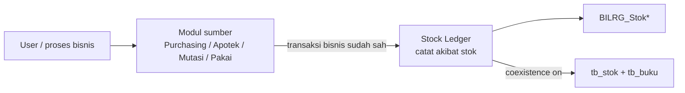

### 1.1 Mengapa legacy perlu diubah menuju Stock Ledger?

Legacy (`tb_stok` + `tb_buku`, biasanya digenerate lewat pola seperti `clbGenStokX1`) **sudah cukup untuk operasional harian lama**. Masalahnya bukan “tidak bisa jalan”, melainkan **sulit memenuhi kebutuhan akuntabilitas stok modern** di Bilreg: jejak sumber penerimaan, pengeluaran ber-ED yang konsisten, pembatalan yang bisa diaudit, dan rekonsiliasi yang bisa dibuktikan.

Penting: selama masa paralel (**coexistence**), legacy **tetap otoritas data tersimpan**. Stock Ledger tidak “membuang” legacy semalam; ia menambah representasi yang lebih kaya, menulis keduanya dulu, lalu cutover setelah yakin.

#### Kekurangan legacy yang ingin diperbaiki

| # | Kekurangan / risiko di pola legacy | Apa yang diperbaiki Stock Ledger |
|---|---|---|
| 1 | **Jejak sumber penerimaan lemah sebagai model utama.** Stok sering dipikirkan per barang + lokasi; membedakan “barang yang sama dari DO berbeda” tidak selalu menjadi agregat resmi. | Model **Batch** = satu `BrgId` + satu `BrgMasukReffId` (DO). Semua qty harus bisa ditelusuri ke sumber penerimaan. |
| 2 | **Aturan pengeluaran (FEFO/FIFO/ED) tersebar.** Logika pemilihan stok sering ikut form/modul masing-masing → mudah beda perilaku antar layar. | **Outbound Allocation** dipusatkan di satu tempat: ED eksplisit → FEFO → FIFO. |
| 3 | **ED belum jadi dimensi saldo yang tegas.** Sulit menjamin “satu lokasi, banyak ED” diperlakukan sebagai saldo terpisah yang konsisten. | `BILRG_StokLokasi` unik per `(Batch, Layanan, TglEd)`; alokasi dan rekonsiliasi memakai dimensi itu. |
| 4 | **Saldo habis (qty 0) mudah “hilang” dari perhatian.** Kartu/posisi nol sering tidak dipertahankan → jejak audit putus. | **Saldo habis tetap disimpan**; rekonsiliasi wajib menghitungnya. |
| 5 | **Pembatalan tidak seragam.** Ada pola hapus jurnal, update balik, atau void ad-hoc → sulit audit “apa yang terjadi dulu”. | **Void = jurnal balik** (baris baru + `ReversesMutasiId`). Mutasi lama tidak dihapus; tidak pakai `Vod*` di tabel inti ledger. |
| 6 | **Sulit membuktikan angka masih konservatif.** Tidak ada cek baku: total batch = Σ lokasi = net jurnal (± legacy). | **Reconcile Scope** tahap A–D; selisih dilaporkan eksplisit, tidak “diperbaiki diam-diam”. |
| 7 | **Logika stok menempel di banyak transaction script bisnis.** Setiap modul jual/mutasi/pakai cenderung punya cabang stok sendiri → maintenance mahal. | Modul bisnis hanya kirim **akibat stok yang sudah diotorisasi**; aturan stok tinggal di Stock Ledger. |
| 8 | **Idempotensi & bentrok update lemah/tidak seragam.** Retry atau double-post berisiko jurnal dobel; update bersamaan sulit dikontrol. | Kunci unik mutasi + Binding; **OCC `Version`** di lokasi; satu Unit of Work dual-write. |
| 9 | **Cutover besar berisiko tinggi.** Mengganti langsung `tb_stok`/`tb_buku` di semua jalur = big-bang. | **Coexistence**: dual-write + hydrate/catch-up + gate; cutover bertahap setelah reconcile aman. |

#### Yang *bukan* alasan mengganti

- Bukan karena “SQL Server lama salah” atau “VB6 tidak bisa hitung qty”.
- Bukan untuk membuat UI stok baru di Slice 1 (Stock Ledger memang tanpa layar end-user).
- Bukan untuk mengambil alih approve jual/beli/mutasi — itu tetap milik modul sumber.

#### Ringkas untuk sosialisasi

```text
Legacy bagus sebagai buku operasional yang sudah dikenal.
Stock Ledger dibutuhkan agar stok bisa:
  - ditelusuri per sumber penerimaan (DO),
  - dikeluarkan dengan aturan ED yang sama di semua jalur,
  - dibatalkan dengan jejak audit (jurnal balik),
  - dibuktikan selaras lewat rekonsiliasi,
  - diganti secara bertahap tanpa mematikan legacy sekaligus.
```

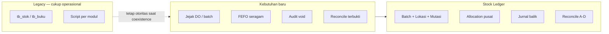

---

## 2. Cara berpikir: dari transaction script ke Stock Ledger

Di VB6, pola yang biasa dipakai kira-kira:

```text
Begin Trans
  INSERT / UPDATE tb_stok
  INSERT tb_buku
  ... tabel lain bila perlu ...
Commit / Rollback
```

Stock Ledger **masih memakai pola yang sama di level database**: satu transaksi SQL, beberapa INSERT/UPDATE, kalau gagal semua di-rollback.

Yang berubah terutama:

1. **Ada “tabel baru” di samping legacy** (`BILRG_Stok*`) supaya jejak batch, lokasi, dan ED lebih jelas.
2. **Aturan pemilihan stok keluar** (FEFO/FIFO) dipusatkan di satu tempat, bukan tersebar di banyak form.
3. **Void tidak menghapus jurnal lama** — selalu menambah baris jurnal balik (reverse).
4. Kode dipisah layer (Domain / Application / Infrastructure), tetapi **hasil akhirnya tetap mutasi tabel**.

Jadi: kalau Anda membaca handler Stock Ledger, anggap itu *transaction script yang lebih terstruktur* — bukan “magi object oriented”.

Alur generik setiap posting stok (saat coexistence on):

```text
1. Pastikan data ledger untuk scope terkait sudah sejalan dengan legacy
   (hydrate / catch-up bila perlu — "freshness gate")
2. Hitung di memory: batch mana, lokasi mana, qty berapa, jurnal apa
3. BEGIN TRAN
     - tulis tb_buku / tb_stok          (mirror legacy)
     - tulis BILRG_StokBatch / Lokasi / Mutasi
     - tulis Binding + update Scope
   COMMIT  (atau ROLLBACK semua)
```

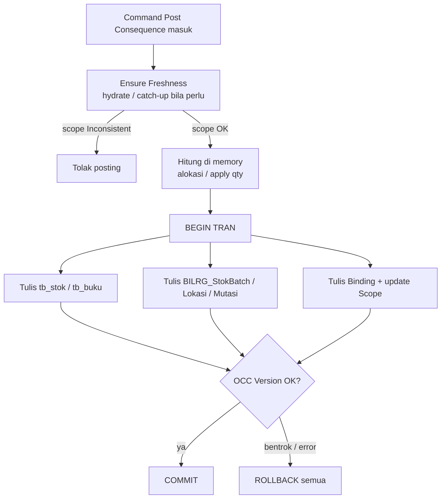

---

## 3. Dua “buku stok” yang jalan berdampingan

Selama periode paralel (**coexistence**), ada dua representasi:

| Representasi | Tabel | Peran saat ini |
|---|---|---|
| Legacy Stock Record | `tb_stok`, `tb_buku` | **Otoritas data tersimpan** — sistem lama dan pembaca legacy masih mengandalkan ini |
| Stock Ledger | `BILRG_StokBatch`, `BILRG_StokLokasi`, `BILRG_StokMutasi` (+ 2 tabel bantu) | Representasi target yang lebih kaya; harus bisa direkonsiliasi dengan legacy |

Analoginya: ledger baru seperti buku pembantu yang lebih detail; selama masa transisi, **buku utama yang “sah” untuk angka operasional tetap legacy**. Posting lewat Stock Ledger menulis **keduanya dalam satu transaksi** (dual-write).

Flag: `StockLedger:CoexistenceEnabled`

- `true` → wajib freshness + dual-write ke legacy
- `false` (setelah cutover) → cukup tulis ledger; adapter legacy dimatikan

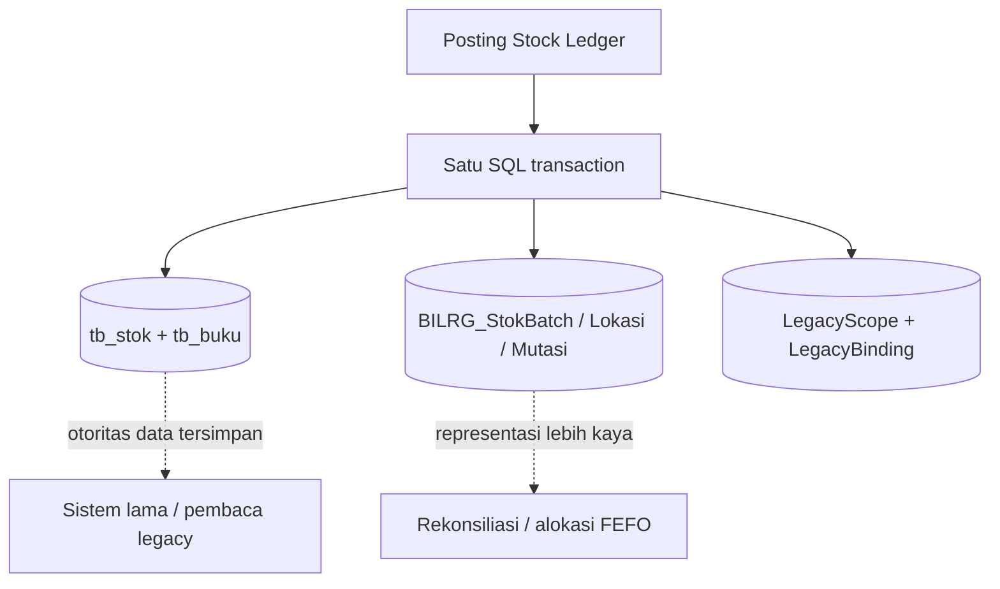

---

## 4. Peta tabel (apa isi masing-masing)

### 4.1 Legacy (sudah dikenal)

| Tabel | Isi praktis |
|---|---|
| `tb_stok` | Saldo stok per kartu/posisi (qty sisa di lokasi / identitas stok legacy) |
| `tb_buku` | Jurnal mutasi stok (masuk/keluar) — mirip buku stok harian |

### 4.2 Stock Ledger inti (permanen)

| Tabel | Analogi mudah | Isi praktis |
|---|---|---|
| `BILRG_StokBatch` | Kartu batch rumah sakit | Satu baris per pasangan **barang + sumber penerimaan** (`BrgId` + `BrgMasukReffId`). `QtySisa` = sisa di seluruh RS. Ada `Hpp`, `TglMasuk`. |
| `BILRG_StokLokasi` | Saldo per lokasi (+ ED) | Sisa qty satu batch di satu layanan/lokasi untuk satu tanggal ED. Unik di `(StokBatchId, LayananId, TglEd)`. **Qty = 0 tetap disimpan** (tidak dihapus). Ada kolom `Version` untuk OCC. |
| `BILRG_StokMutasi` | Baris jurnal (append-only) | Setiap masuk/keluar: `QtyIn` atau `QtyOut`, `MovementKind`, `TrsReffId` (nomor transaksi sumber). Pembatalan = baris baru yang menunjuk `ReversesMutasiId`. |

Hubungan:

```text
Barang + Sumber penerimaan (mis. DO)
   └── 1 StokBatch
          └── banyak StokLokasi (per layanan + TglEd)
                 └── banyak StokMutasi (riwayat masuk/keluar)
```

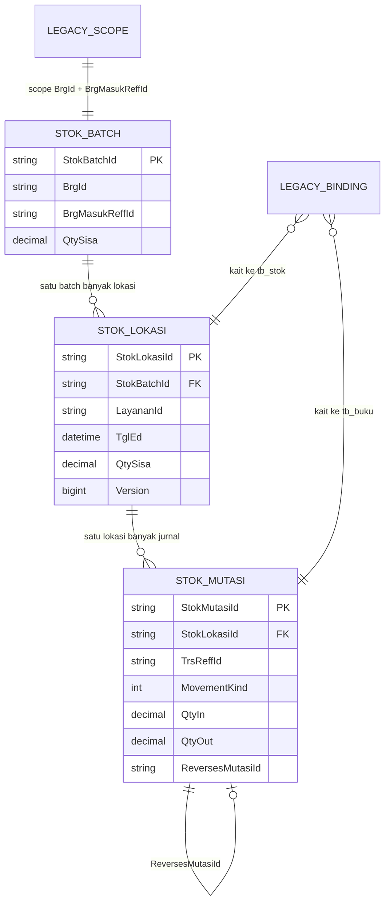

### 4.3 Tabel bantu coexistence (boleh dibuang setelah cutover)

| Tabel | Kegunaan |
|---|---|
| `BILRG_StokLegacyScope` | Status selaras-tidaknya satu scope `(BrgId, BrgMasukReffId)` dengan legacy; menyimpan watermark jurnal terakhir yang sudah di-replay |
| `BILRG_StokLegacyBinding` | Peta “baris ledger ↔ `fs_kd_trs` di `tb_buku`/`tb_stok`” — wajib untuk void yang aman |

---

## 5. Siapa yang memanggil Stock Ledger?

Modul bisnis sumber memanggil command Stock Ledger **setelah** transaksi bisnisnya sendiri sah. Contoh arah pemanggilan Slice 1:

| Peristiwa bisnis | Command (use case) | Jenis akibat stok |
|---|---|---|
| Penerimaan barang (DO) | Post Goods Receipt | Masuk stok |
| Mutasi antar lokasi | Post Stock Transfer | Keluar lokasi A + masuk lokasi B |
| Penjualan | Post Sale Issue | Keluar stok (FEFO/FIFO/ED) |
| Batal jual | Post Sale Void | Jurnal balik penjualan |
| Retur jual | Post Sales Return | Masuk kembali qty yang pernah keluar |
| Pakai internal | Post Internal Consumption | Keluar stok (bukan jual) |

Yang **belum** masuk Slice 1 (jangan dikira sudah ada): retur beli, pemusnahan, adjustment/opname, repack, batal penerimaan, batal transfer, reserved order, serah obat (`DS`).

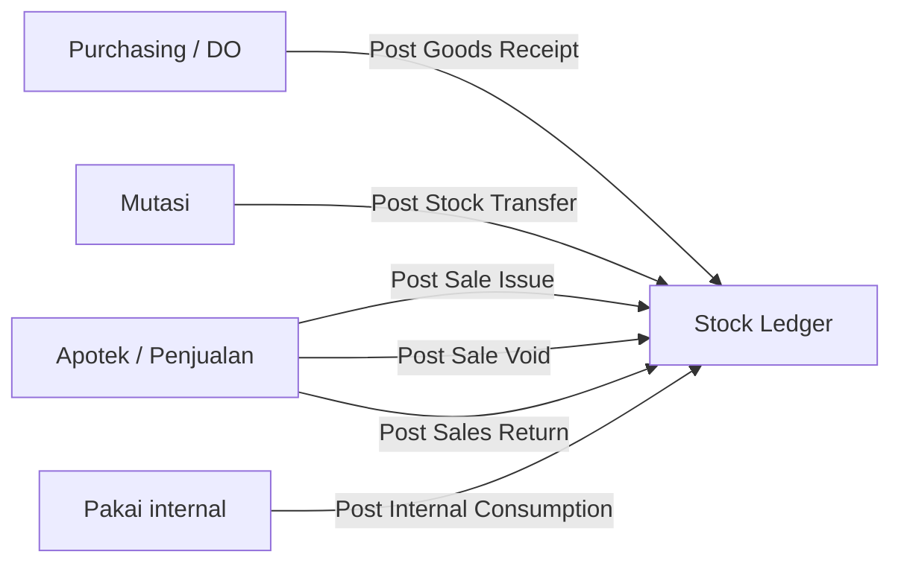

---

## 6. Aturan bisnis yang paling sering kena maintenance

Hafalkan dulu tujuh ini:

1. **Qty sisa tidak boleh negatif.**
2. **Pengeluaran di satu lokasi:** ada ED eksplisit dari pemanggil → pakai ED itu; kalau tidak, FEFO (ED paling dekat dulu); kalau tidak ada ED → FIFO (yang masuk lebih dulu).
3. **Saldo habis (qty 0) tidak dihapus** dari `BILRG_StokLokasi`.
4. **Mutasi selesai tidak dihapus / tidak di-soft-void pakai kolom `Vod*`.** Koreksi = insert jurnal balik.
5. **Void jual** mencari baris asli lewat **Binding**, bukan menebak dari qty.
6. **Selama coexistence on**, jangan anggap ledger sudah “menggantikan” `tb_stok`/`tb_buku`.
7. **Jangan panggil DAL/tabel milik modul lain sebagai API publik** — panggil use case / port yang disediakan.

---

## 7. End-to-end: mutasi tabel dari event ke event

Bagian ini ditulis seperti membaca *transaction script*: “kalau event X terjadi, tabel apa yang berubah”.

Asumsi contoh:

- Barang `BRG01`
- Sumber penerimaan / DO `DO001`
- Lokasi gudang `G001`, apotek `A001`
- Coexistence **on** (dual-write aktif)

Nilai contoh disederhanakan; nama kolom legacy mengikuti pola `tb_stok` / `tb_buku` yang sudah ada.

**Storyboard qty** untuk contoh §7.1–§7.4 (batch `DO001`):

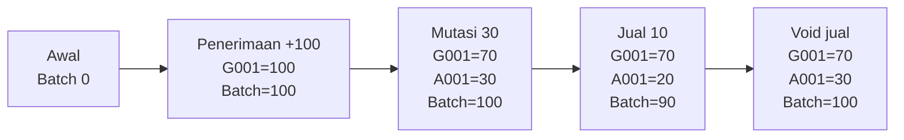

### 7.0 Sebelum posting native: “rapikan dulu” (freshness)

Setiap posting yang menyentuh scope `(BRG01, DO001)` akan memastikan ledger belum ketinggalan dari jurnal legacy:

| Langkah | Baca / tulis | Keterangan |
|---|---|---|
| Hydrate (pertama kali) | Baca `tb_buku` untuk scope → bangun `BILRG_StokBatch` / `StokLokasi` / `StokMutasi` | Baseline dari sejarah legacy |
| Catch-up | Baca `tb_buku` yang lebih baru dari watermark di `BILRG_StokLegacyScope` → append mutasi ledger | Menyalin perubahan yang datang dari jalur lama |
| Gate | Cek status scope | Kalau `Inconsistent` → **posting ditolak** (jangan dipaksa) |

Ini mirip kebiasaan “cek saldo dulu sebelum kurangi” — bedanya yang dicek adalah **keselarasan dua buku**.

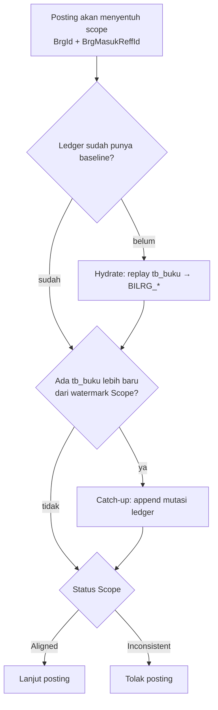

---

### 7.1 Event: Penerimaan barang 100 di Gudang

**Pemicu bisnis:** penerimaan DO selesai di modul Purchasing.  
**Command:** Post Goods Receipt Consequence (`TrsReffId` = nomor transaksi penerimaan, mis. `TR001`).

**Perubahan data (satu transaksi):**

| Tabel | Aksi | Isi ringkas |
|---|---|---|
| `BILRG_StokBatch` | INSERT (atau UPDATE qty bila batch sudah ada) | `BrgId=BRG01`, `BrgMasukReffId=DO001`, `QtySisa=100`, `Hpp=...`, `TglMasuk=...` |
| `BILRG_StokLokasi` | INSERT | Batch di atas, `LayananId=G001`, `TglEd=...` atau sentinel `3000-01-01` bila tanpa ED, `QtySisa=100`, `Version=1` |
| `BILRG_StokMutasi` | INSERT | `QtyIn=100`, `QtyOut=0`, `MovementKind=GoodsReceipt (1 / DO)`, `TrsReffId=TR001` |
| `tb_stok` | INSERT/UPDATE | Mirror qty di kartu stok legacy |
| `tb_buku` | INSERT | Jurnal masuk legacy (`fs_kd_trs` baru compact `BK...`) |
| `BILRG_StokLegacyBinding` | INSERT | Kaitkan mutasi/lokasi ledger ↔ id `tb_buku`/`tb_stok` |
| `BILRG_StokLegacyScope` | UPSERT | Scope `(BRG01, DO001)` Aligned; watermark maju |

**Idempotensi:** posting ulang dengan kunci yang sama `(TrsReffId, MovementKind, StokLokasiId)` tidak menambah jurnal dobel — dianggap sukses ulang.

**Keadaan setelah commit:**

```text
Batch DO001: QtySisa 100
  Lokasi G001: 100
Legacy tb_stok/tb_buku: juga mencerminkan masuk 100
```

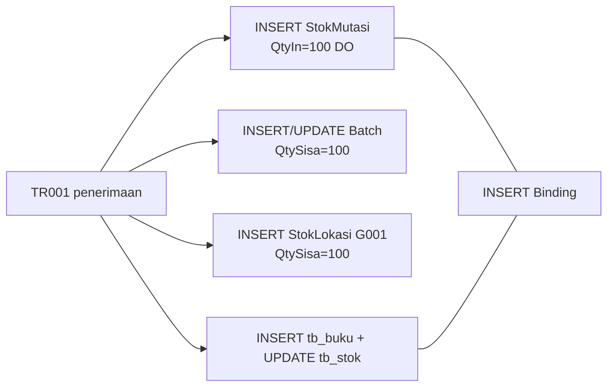

---

### 7.2 Event: Mutasi 30 dari Gudang ke Apotek

**Pemicu:** surat mutasi disetujui.  
**Command:** Post Stock Transfer Consequence.

Di memory: alokasi keluar dari saldo di `G001` (bisa lebih dari satu baris lokasi bila ED berbeda), lalu masuk ke `A001` dengan **sumber penerimaan yang sama** (`DO001` tetap), Hpp dan TglEd ikut.

**Perubahan data (satu transaksi, bisa multi-baris):**

| Tabel | Aksi | Isi ringkas |
|---|---|---|
| `BILRG_StokLokasi` (G001) | UPDATE | `QtySisa` 100 → 70; `Version` naik |
| `BILRG_StokLokasi` (A001) | INSERT atau UPDATE | `QtySisa` +30 (ED sama dengan yang keluar) |
| `BILRG_StokBatch` | (biasanya qty RS tetap) | Total rumah sakit tetap 100; hanya pindah lokasi |
| `BILRG_StokMutasi` | INSERT ×2 (per potongan alokasi) | Satu `TransferOut` (`QtyOut=30`) + satu `TransferIn` (`QtyIn=30`) |
| `tb_stok` / `tb_buku` | UPDATE/INSERT | Mirror keluar di gudang + masuk di apotek |
| Binding + Scope | INSERT/UPDATE | Jejak id legacy + watermark |

**Cek kesehatan:** Σ qty lokasi = qty batch; OUT transfer = IN transfer.

```text
Batch DO001: QtySisa 100
  G001: 70
  A001: 30
```

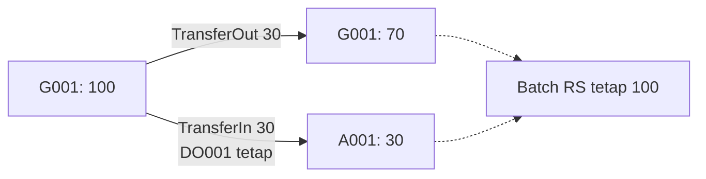

---

### 7.3 Event: Penjualan 10 dari Apotek

**Pemicu:** penjualan/apotik selesai.  
**Command:** Post Sale Issue Consequence.

Di memory: **Outbound Allocation** memilih baris `BILRG_StokLokasi` di `A001` yang `QtySisa > 0`:

1. Kalau pemanggil minta ED tertentu → hanya ED itu.
2. Else kalau ada ED → FEFO (ED paling awal dulu; seri → yang `TglMasuk` lebih lama).
3. Else → FIFO menurut urutan masuk.

Bisa memotong lebih dari satu batch/lokasi sampai qty terpenuhi. Kurang stok → gagal (rollback; tidak boleh negatif).

**Perubahan data:**

| Tabel | Aksi | Isi ringkas |
|---|---|---|
| `BILRG_StokLokasi` (A001) | UPDATE | mis. 30 → 20; `Version` naik |
| `BILRG_StokBatch` | UPDATE | mis. 100 → 90 |
| `BILRG_StokMutasi` | INSERT | `QtyOut=10`, `MovementKind` jual (`DB`/`DU`/`DT` sesuai jenis), `TrsReffId` = no penjualan |
| `tb_stok` / `tb_buku` | UPDATE/INSERT | Mirror pengeluaran |
| Binding + Scope | INSERT/UPDATE | Wajib tersimpan — nanti dipakai batal jual |

```text
Batch DO001: QtySisa 90
  G001: 70
  A001: 20
```

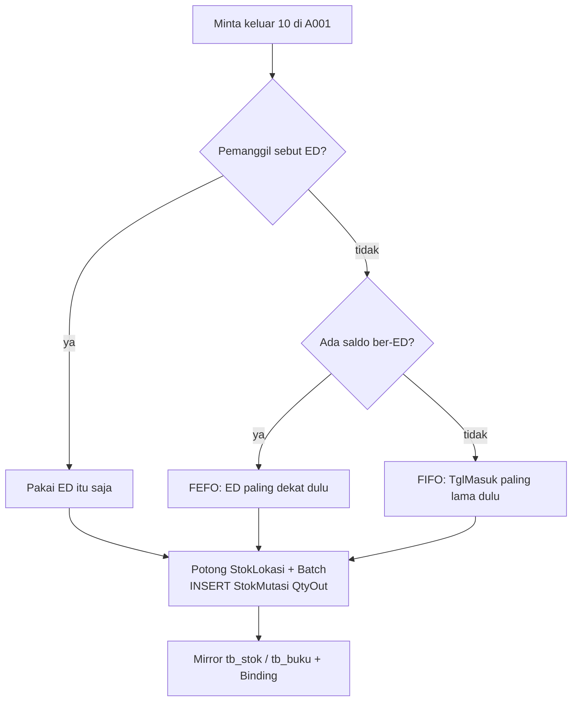

---

### 7.4 Event: Batal jual (void) untuk penjualan di 7.3

**Pemicu:** modul penjualan membatalkan transaksi jual.  
**Command:** Post Sale Void Consequence.

**Bukan** menghapus baris `tb_buku` lama dan **bukan** `UPDATE ... Vod = 1` di tabel ledger.

Alur transaction-script-nya:

1. Cari Binding untuk `TrsReffId` penjualan asli → dapat `StokMutasiId` / lokasi / batch yang dulu dipakai.
2. Kalau Binding tidak ada → **tolak** (jangan menebak dari sisa qty).
3. INSERT mutasi balik (`SaleVoid*`, `QtyIn=10`, `ReversesMutasiId` = mutasi jual lama).
4. Naikkan lagi `QtySisa` di lokasi & batch.
5. INSERT jurnal balik di `tb_buku` + update `tb_stok` (mirror); baris buku lama tetap ada.

```text
Batch DO001: QtySisa 100
  G001: 70
  A001: 30
Riwayat: tetap ada mutasi jual + mutasi void (bukan “seolah tidak pernah jual”)
```

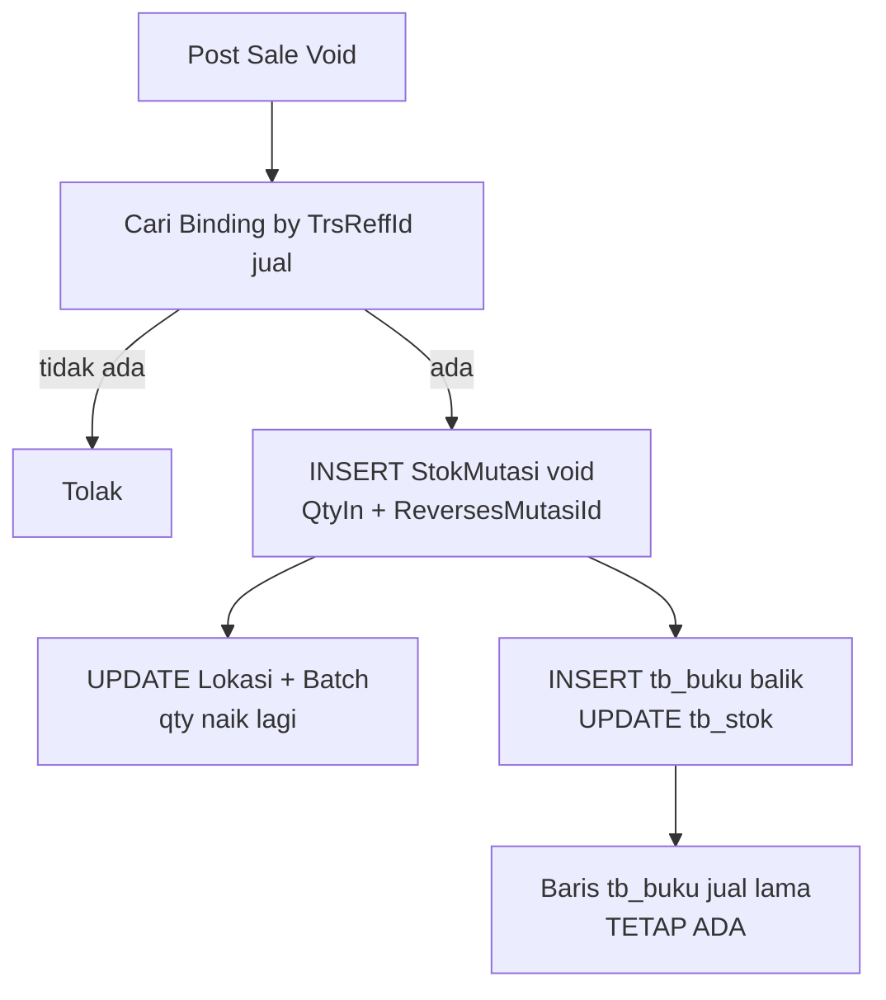

---

### 7.5 Event: Retur jual 5

**Pemicu:** retur penjualan diotorisasi.  
**Command:** Post Sales Return Consequence.

Secara tabel mirip **penerimaan terbatas**: menambah `QtyIn` ke lokasi yang relevan, menaikkan batch, mirror ke legacy. Jenis mutasi: `SalesReturn*` (`RJ`/`RU`/`RT`).

Bedanya dengan void: retur adalah transaksi bisnis baru (barang kembali), bukan pembalikan 1:1 seluruh penjualan lewat Binding void — meskipun sama-sama menaikkan stok.

---

### 7.6 Event: Pakai internal 5 dari Apotek

**Pemicu:** pemakaian barang internal.  
**Command:** Post Internal Consumption Consequence.

Mirip penjualan dari sisi stok (alokasi FEFO/FIFO + `QtyOut`), beda `MovementKind` (`InternalConsumption` / `PK`) dan konteks pemanggilnya.

---

### 7.7 Event baca: Rekonsiliasi & ketersediaan

Ini **tidak mengubah tabel**:

| Query | Kegunaan maintenance |
|---|---|
| Reconcile Scope | Bandingkan: qty batch vs Σ lokasi vs net mutasi (± legacy). Termasuk lokasi qty 0. |
| Get Availability At Location | Lihat kandidat saldo `QtySisa > 0` di satu lokasi, urutan mirip alokasi — **bukan** otorisasi jual. |

Pakai ini saat curiga angka “aneh” atau scope `Inconsistent`.

### 7.8 Alur proses stok lengkap + tahap rekonsiliasi

Diagram di bawah menggabungkan **jalur tulis** (posting akibat stok) dan **jalur baca rekonsiliasi**. Rekonsiliasi tidak memperbaiki data diam-diam — hanya melaporkan selisih (`IsConsistent` + daftar perbedaan).

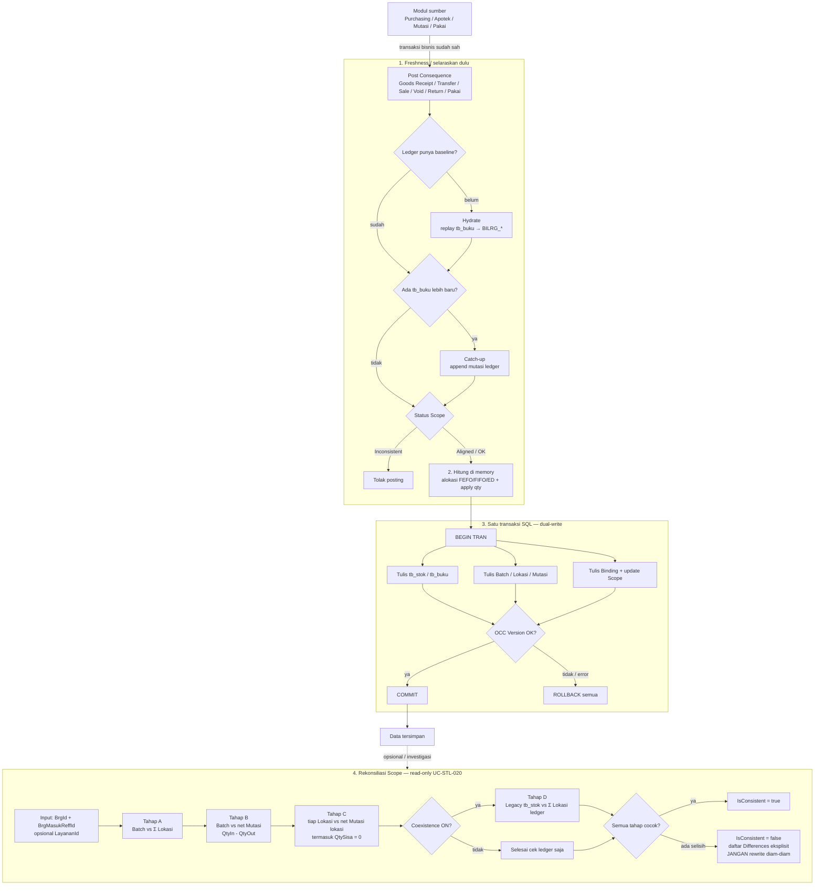

**Tahap rekonsiliasi (apa yang dibandingkan):**

| Tahap | Bandingkan | Arti praktis |
|---|---|---|
| A | `BILRG_StokBatch.QtySisa` vs Σ `BILRG_StokLokasi.QtySisa` | Total RS = jumlah semua lokasi? |
| B | `QtySisa` batch vs Σ `(QtyIn − QtyOut)` di mutasi scope | Saldo batch = jejak jurnal? |
| C | Tiap lokasi: `QtySisa` vs net mutasi lokasi | Saldo per lokasi selaras jurnal? (termasuk saldo habis) |
| D | Σ qty `tb_stok` legacy vs Σ lokasi ledger (jika coexistence on) | Buku lama vs buku baru selaras? |

Kalau filter `LayananId` diisi, cek rumah-sakit-lebar (A/B) diganti cek scoped: Σ lokasi di layanan itu vs net mutasi di layanan itu.

**Kapan dipakai:**

- Setelah dugaan bug posting / dual-write
- Saat Scope berstatus `Inconsistent`
- Sebelum cutover / audit sample per `(BrgId, BrgMasukReffId)`

---

## 8. Satu transaksi = semua atau tidak sama sekali

Saat coexistence on, posting native membungkus:

- tulis legacy (`tb_*`)
- tulis ledger (`BILRG_Stok*`)
- binding + scope
- OCC: `UPDATE BILRG_StokLokasi ... WHERE Version = <versi yang dibaca>`

dalam **satu** SQL transaction (Unit of Work).

Kalau OCC bentrok (orang lain mengubah lokasi yang sama), seluruh posting gagal → ulangi dari baca ulang. Jangan “teruskan setengah”.

---

## 9. Jenis mutasi Slice 1 (`MovementKind`)

Disimpan sebagai angka di `BILRG_StokMutasi.MovementKind`. String lama di `tb_buku` (seperti `DO`, `MT_OUT`, …) dipetakan di adapter — jangan menebak mapping di query ad-hoc.

| Angka | Arti | String legacy (acuan) |
|---|---|---|
| 1 | Penerimaan | `DO` |
| 2 | Transfer keluar | `MT_OUT` |
| 3 | Transfer masuk | `MT_IN` |
| 4–6 | Pengeluaran jual | `DB` / `DU` / `DT` |
| 7 | Pakai internal | `PK` |
| 8–10 | Retur jual | `RJ` / `RU` / `RT` |
| 11–13 | Void jual | `DB_V` / `DU_V` / `DT_V` |

Jenis lain (adjustment, pemusnahan, dll.) belum masuk Slice 1.

---

## 10. Di mana kode-nya di solution?

Semua di bawah `InventoryContext/StockLedgerFeature`:

| Layer | Folder | Isinya (cara baca ala transaction script) |
|---|---|---|
| Domain | `Bilreg.Domain/.../StockLedgerFeature` | Aturan murni: apply masuk/keluar, alokasi FEFO/FIFO, factory mutasi — **tanpa SQL** |
| Application | `Bilreg.Application/.../StockLedgerFeature/UseCases` | “Script” orkestrasi: freshness → hitung → panggil UoW |
| Infrastructure | `Bilreg.Infrastructure/.../StockLedgerFeature` | SQL konkret: DAL/Repo, baca/tulis `tb_*` dan `BILRG_*` |
| SqlDb | `Bilreg.SqlDb/.../StockLedgerFeature` | Script CREATE tabel |
| Test | `Bilreg.Test/.../StockLedgerFeature` | Contoh perilaku yang diharapkan |

Api project untuk fitur ini terutama **registrasi DI** — bukan controller bisnis stok.

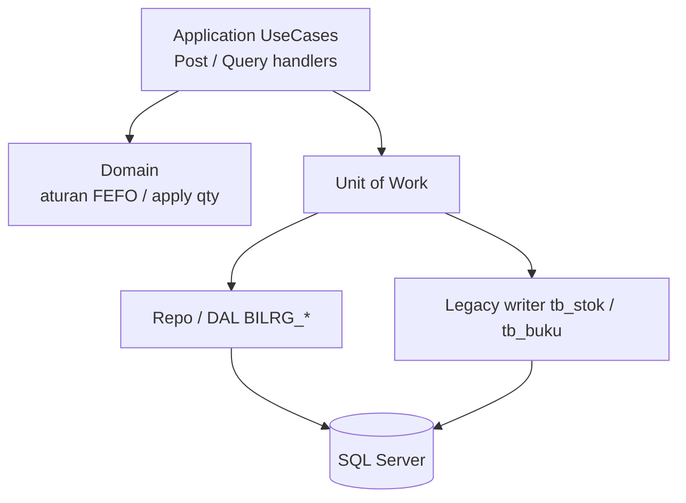

Cara debug yang biasanya paling cepat:

1. Cari handler use case (`Post*ConsequenceCommand.cs`, `*Query.cs`).
2. Ikuti pemanggilan ke Unit of Work / legacy writer.
3. Lihat INSERT/UPDATE di DAL yang sesuai nama tabel.

---

## 11. Checklist “boleh / jangan” saat maintenance

**Boleh**

- Menambah pemanggilan use case dari modul sumber (setelah bisnis sumber jelas).
- Memperbaiki mapping / bug dual-write dengan tetap satu transaksi.
- Menambah jenis `MovementKind` secara **additive** setelah disepakati di domain/architecture.
- Memakai Reconcile / Availability untuk investigasi.

**Jangan**

- Menghapus baris `BILRG_StokMutasi` atau `tb_buku` untuk “mengoreksi” transaksi.
- Hard-delete `BILRG_StokLokasi` hanya karena `QtySisa = 0`.
- Menambah kolom `Vod*` di tabel inti ledger sebagai pengganti void.
- Memindahkan aturan FEFO/FIFO ke trigger SQL atau form UI.
- Menulis langsung ke tabel modul lain tanpa lewat use case.
- Menghidupkan kembali desain Stock Ledger **v1** (enam tabel lama) — sudah diganti model v2 ini.
- Menganggap coexistence off tanpa keputusan cutover yang jelas.

---

## 12. Urutan belajar yang disarankan

1. Baca dokumen ini sampai §7 (event end-to-end).
2. Baca ringkas [stok-ledger-domain-id.md](./stok-ledger-domain-id.md) bagian gambaran + batas kewenangan.
3. Baca [stok-ledger-architecture.md](./stok-ledger-architecture.md) §5 (use case), §8 (tabel), §13 (transaksi/dual-write).
4. Ikuti satu test: Goods Receipt → Sale Issue → Sale Void di `Bilreg.Test/.../StockLedgerFeature`.
5. Baru baca ADR di architecture bila akan mengubah perilaku.

Kalau suatu perubahan bertentangan dengan domain/architecture, **hentikan dan klarifikasi** — jangan “diakali” di DAL agar kelihatan jalan.

---

## 13. Glosarium singkat (istilah yang sering muncul)

| Istilah | Arti praktis |
|---|---|
| Source / `TrsReffId` | Nomor transaksi bisnis asal (faktur, mutasi, dll.) |
| `BrgMasukReffId` | Identitas sumber penerimaan (sering = DO) |
| Batch | Agregat stok satu barang dari satu sumber penerimaan |
| Lokasi / `LayananId` | Tempat stok (gudang, apotek, unit) |
| FEFO / FIFO | Urutan pengeluaran: ED terdekat dulu / masuk terawal dulu |
| Dual-write | Satu posting menulis ledger + legacy bersama |
| Freshness / gate | Pastikan ledger tidak stale vs `tb_buku` sebelum tulis |
| Binding | Peta id ledger ↔ id legacy untuk void/sync |
| OCC / `Version` | Pengaman update bersamaan: update hanya jika versi masih sama |
| Jurnal balik / reverse | Koreksi dengan baris baru, bukan hapus baris lama |
| Slice 1 (S1) | Paket kemampuan inti yang sudah diimplementasikan dulu |

---

**Ringkasan satu kalimat:** Stock Ledger adalah *transaction script stok yang terstruktur* — menerima peristiwa bisnis yang sudah sah, lalu dalam satu transaksi mengubah `BILRG_Stok*` dan (selama coexistence) `tb_stok`/`tb_buku`, dengan jejak batch/ED yang bisa direkonsiliasi dan dibatalkan lewat jurnal balik.
