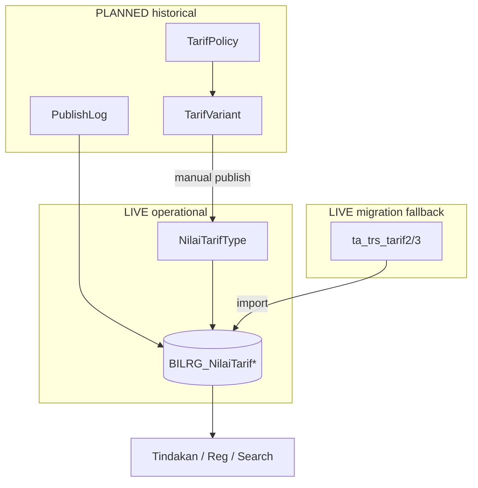

# TARIF_IMPLEMENTATION_PLAN.md — Tarif Policy & Publish Rollout

> **Status:** Planning only — **no production code** in this document.  
> **Canonical location:** `docs/contexts/tarif/TARIF_IMPLEMENTATION_PLAN.md`  
> **Scope root:** `{Layer}/ChargeContext/TarifFeature/` (extend existing folders)  
> **Evidence:** `docs/tarif/tarif-codebase-retrieval-report.md`

---

## Legend

| Label | Meaning |
| ----- | ------- |
| **LIVE** | Implemented and used operationally today |
| **PARTIAL** | Code exists but incomplete or unused path |
| **PLANNED** | Target design; not in codebase |

---

## Primary references (read before any slice)

| Artifact | Use when |
| -------- | -------- |
| `docs/contexts/tarif/tarif-01-context.md` | Why, scope, operational intent |
| `docs/contexts/tarif/tarif-02-domain.md` | Aggregates, invariants, publish semantics |
| `docs/contexts/tarif/tarif-03-design.md` | Import, persistence, integration |
| `docs/contexts/tarif/tarif-04-api-contract.md` | LIVE vs proposed HTTP |
| `docs/contexts/tarif/tarif-05-runbook.md` | Import, validation, recovery |
| `docs/INSTRUCTION.md`, `docs/ENGINEERING.md` | Global architecture stance |
| `docs/DATABASE.md`, `docs/NAMING.md` | SQL and naming |
| `docs/skills/feature-model-generation.md` | Domain models |
| `docs/skills/feature-persistence-generation.md` | DTO/DAL/Repo |
| `docs/skills/use-case-generation.md` | Cmd/Query/Handler |
| `docs/tarif/tarif-codebase-retrieval-report.md` | File index, factual gaps |

**Approved reference patterns (ChargeContext):**

| Pattern | Reference | Notes |
| ------- | --------- | ----- |
| Read projection + MediatR | `TrfImportNilaiTarifHandler`, `NilaiTarifRepo` | **LIVE** — extend, do not replace consumers |
| Transactional orchestration | `TdkCreateTindakanCmd` (`TransHelper.NewScope`) | Billing boundary — publish should mirror explicit scope |
| Header + detail persistence | `NilaiTarifRepo.SaveChanges` (delete child + insert) | **PARTIAL** — reuse for variant upsert |
| Child bulk replace | `OpCaseRepo` (Lab/Igd patterns per `lab-implementation-plan.md`) | Detail delete + bulk insert |

---

## 1. Current State Analysis

### 1.1 LIVE operational path

```text
Legacy ta_trs_tarif2/3  →  POST /api/NilaiTarif/import  →  BILRG_NilaiTarif*
                                                              ↓
                    Tindakan / Reg / Search / Lab  (INilaiTarifRepo)
                                                              ↓
                    TrsBilling snapshot (immutable after post)
```

| Component | Status | Notes |
| --------- | ------ | ----- |
| `TarifType`, `KomponenType`, lookups | **LIVE** | Read-oriented master |
| `NilaiTarifType` + `BILRG_*` | **LIVE** | Operational projection |
| `NilaiTarifRepo.Import()` | **LIVE** | Legacy read + transactional clear/BCP (Phase 0) |
| `NilaiTarifRepo.SaveChanges` | **PARTIAL** | Per-variant upsert path; **no** application caller |
| Master HTTP admin (`BillContext/TindakanSub/*`) | **PARTIAL** | Controllers commented; DAL/Repo exist |
| `TarifPolicy`, `TarifVariant`, publish | **PLANNED** | Documented only |

### 1.2 Known LIVE risks (must address in rollout)

| Risk | Source | Mitigation phase |
| ---- | ------ | ---------------- |
| Empty/partial `BILRG_*` after failed import | — | **LIVE** Phase 0: transactional import |
| Duplicate `(TarifId, TipeTarifId, KelasId)` | — | **LIVE** Phase 0: cleanup scripts + UX index |
| `KomponenRepo.SaveChanges` skips SatTugas children | — | **LIVE** Phase 0: delete+insert SatTugas |
| New `NilaiTarifId` on every import | ULID regen per import | Accept for import; publish uses **stable** id per variant |
| No structured Tarif error catalog | `tarif-04-api-contract.md` | Phase 4 API hardening |

### 1.3 Consumer contract (frozen)

Downstream code **must not** change load pattern during migration:

| Consumer | Load key | Repo |
| -------- | -------- | ---- |
| Tindakan create/save | `NilaiTarifId` | `INilaiTarifRepo.LoadEntity` |
| Reg karcis/booking/ubah | Composite `Tarif + TipeTarif + Kelas` | `KeyComposite` |
| Lab test definition | `TarifId` on master | `ITarifRepo` |
| Billing | Snapshot from tindakan | **PaymentContext** — out of Tarif scope |

**Invariant:** projection refresh changes **future** loads only; never mutates posted `TrsBilling`.

---

## 2. Target Architecture

### 2.1 Ubiquitous language

| Concept | Meaning |
| ------- | ------- |
| **TarifPolicy** | Pricing decision container / SK |
| **TarifVariant** | One pricing variant combination `(Tarif + Kelas + TipeTarif)` under a policy |
| **TarifVariantKomponen** | Komponen breakdown line on a policy variant |
| **NilaiTarif** | Operational published projection (`BILRG_*`) |
| **PublishLog** | Publish activation history |

```text
TarifPolicy
 └── TarifVariant
      └── TarifVariantKomponen
```

Do **not** use `TarifVersion`, `PolicyVersion`, or `RevisionVersion` — RS staff may confuse them with SK revision or policy generation.

### 2.2 Separation (do not collapse)

```text
TarifType           → catalog identity (LIVE)
NilaiTarifType      → operational projection (LIVE) — fast lookup, NOT historical SoT
TarifPolicyType     → business change container (PLANNED)
TarifVariantType    → immutable pricing variant under policy (PLANNED)
Publish log         → audit + idempotency anchor (PLANNED)
```



### 2.3 Publish semantics (non-negotiable)

| Rule | Detail |
| ---- | ------ |
| Manual activation | Operator `POST .../publish`; **no** scheduler by effective date |
| Effective date | Informational (`EffectiveDateInfo`); SK/reporting only |
| Non-retroactive | Existing billing/tindakan snapshots unchanged |
| Explicit audit | User, timestamp, policy id, variant count, optional note |
| Copy policy | New **independent** draft; **no** lineage/revision chain |
| Idempotent publish | Re-publish same policy id → no-op or deterministic replace (define in publish artifact) |

### 2.4 What stays unchanged

- `BILRG_*` as operational projection store (`DATABASE.md` module prefix).
- `INilaiTarifRepo` public surface for consumers (extend internally only).
- `POST /api/NilaiTarif/import` during migration (**dual authority** period).
- Legacy `ta_*` master tables for komponen/tarif until master admin API restored.

---

## 3. Aggregate & Domain Finalization

### 3.1 Aggregate boundary decision

| Aggregate | Root | Children | Consistency boundary |
| --------- | ---- | -------- | -------------------- |
| **TarifPolicy** | `TarifPolicyType` | `TarifVariantType` lines (draft edit) | Policy lifecycle + draft variants; **does not** own `BILRG_*` rows |
| **TarifVariant** | *(child of policy)* | `TarifVariantKomponenType` lines | Variant uniqueness **within policy** |
| **NilaiTarif** | `NilaiTarifType` | `NilaiTarifKomponenType` | **Separate** aggregate — projection only |
| **Komponen** | `KomponenType` | `SatTugas` refs | Master; fix SatTugas persistence in Phase 0 |
| **Tarif** | `TarifType` | — | Catalog read model |

**Rationale:** Policy publish **projects into** NilaiTarif; coupling policy aggregate with projection violates `tarif-02-domain.md` ownership table and complicates rollback (historical policy must survive bad publish attempts).

### 3.2 Domain finalization checklist (PLANNED types)

Implement per `docs/skills/feature-model-generation.md`:

| Type | Key interface | Core behaviour |
| ---- | ------------- | -------------- |
| `TarifPolicyType` | `ITarifPolicyKey` | `Create`, `CopyFrom`, `AddVariant`, `MassAdjust`, `MarkReviewed`, `Publish` (validates only — projection in app service) |
| `TarifVariantType` | `ITarifVariantKey` | `Create`, `SetKomponenLines`, immutable after parent published |
| `TarifVariantKomponenType` | — | `NoUrut`, `KomponenReff`, `Nilai` |
| `TarifPolicyStatusEnum` | — | `Draft`, `Reviewed`, `Published`, `Archived` |

**Domain invariants to implement in model:**

| Invariant | Enforce in |
| --------- | ---------- |
| ≥ 1 komponen line per variant | `TarifVariantType` + publish validator |
| Σ komponen = header nilai | `TarifVariantType` + publish validator |
| Unique `(TarifId, KelasId, TipeTarifId)` per policy draft | `TarifPolicyType.AddVariant` |
| Cannot edit variants after `Published` | `TarifPolicyType` behaviour |
| Cannot publish empty policy | `TarifPolicyType.Publish` |
| Copy creates new `PolicyId`, cloned variants, status `Draft` | `TarifPolicyType.CopyFrom` |

**Explicitly NOT in domain:**

- SQL, DTO, `BILRG_*` mutation
- Billing/tindakan recalculation
- Auto effective-date activation

### 3.3 Overlap policy (PLANNED)

Define in publish validator (application), not projection table:

| Scenario | Recommended rule |
| -------- | ---------------- |
| Two **draft** policies contain same variant | Allowed; publish-time check warns or blocks per RS policy |
| Publish variant already in projection from **other** published policy | **Allow** — latest publish wins (operational truth); log superseded policy ref in publish log detail |
| Re-publish same policy | Idempotent: replace projection rows sourced from that policy's variants only |

Avoid "effective date overlap" engine — contradicts manual publish principle.

---

## 4. Persistence & Table Design Strategy

### 4.1 Table naming (`DATABASE.md`)

| Table | Role | Prefix |
| ----- | ---- | ------ |
| `BILRG_TarifPolicy` | Policy header + workflow status | BILRG |
| `BILRG_TarifVariant` | Variant lines (historical SoT) | BILRG |
| `BILRG_TarifVariantKomponen` | Variant komponen detail | BILRG |
| `BILRG_TarifPublishLog` | Publish audit header | BILRG |
| `BILRG_TarifPublishLogDetail` | Optional per-variant audit | BILRG |
| `BILRG_NilaiTarif` | **LIVE** — extend, do not rename | BILRG |
| `BILRG_NilaiTarifKomponen` | **LIVE** | BILRG |

### 4.2 Suggested columns (PLANNED — detail in future schema artifact)

**`BILRG_TarifPolicy`:** `TarifPolicyId` PK VARCHAR(12), `PolicyNo`, `PolicyName`, `EffectiveDateInfo` DATETIME sentinel `3000-01-01`, `Description`, `PolicyStatus` INT, audit columns (`Crt*`, `Upd*`, `Vod*`).

**`BILRG_TarifVariant`:** composite PK `(TarifPolicyId, ItemNo)`; `TarifId`, `KelasId`, `TipeTarifId`, `Nilai` header; optional `PublishedNilaiTarifId` snapshot link after publish.

**`BILRG_TarifVariantKomponen`:** PK `(TarifPolicyId, ItemNo, NoUrut)`; `KomponenId`, `Nilai`.

**`BILRG_TarifPublishLog`:** `PublishLogId`, `TarifPolicyId`, `PublishedBy`, `PublishedDate`, `VariantCount`, `Note`.

### 4.3 LIVE projection hardening (Phase 0)

```sql
-- After duplicate cleanup in each environment
CREATE UNIQUE NONCLUSTERED INDEX UX_BILRG_NilaiTarif_Variant
ON BILRG_NilaiTarif (TarifId, TipeTarifId, KelasId);
```

Optional traceability column (non-breaking):

```text
SourcePolicyId VARCHAR(12) DEFAULT('')  -- last publish source; empty for import-only rows
```

### 4.4 Persistence patterns

| Operation | Pattern |
| --------- | ------- |
| Policy save | Header insert/update + variant bulk replace (delete detail + SqlBulkCopy) per `feature-persistence-generation.md` |
| Publish | **Application transaction:** write log → upsert `BILRG_*` per variant → mark policy `Published` |
| Import | Wrap existing clear+BCP in `TransHelper.NewScope()`; keep behaviour |

**No database FK constraints** — logical refs enforced in repository/use-case (`DATABASE.md` §8).

### 4.5 NilaiTarifId stability on publish

| Mechanism | Import (LIVE) | Publish (PLANNED) |
| --------- | ------------- | ----------------- |
| `NilaiTarifId` | New ULID each run | **Reuse** existing id when variant exists; insert new ULID only for new variant |
| Tindakan impact | Old ids orphaned in DB, not in active use if re-imported | **Stable ids** — preferred for audit trails |

---

## 5. Publish Engine Design

### 5.1 Component placement

```text
Application: ITarifPublishService (or TrfPublishTarifPolicyHandler orchestration)
Infrastructure: TarifPublishRepo / extends NilaiTarifRepo projection writers
Domain: TarifPolicyType.Publish() validation only
```

Prefer **explicit orchestration** over domain events (`ENGINEERING.md` §14).

### 5.2 Publish algorithm (deterministic)

```text
1. Load TarifPolicy aggregate (Draft or Reviewed only)
2. Validate all variants (komponen sum, master refs, duplicate variant in policy)
3. BEGIN TRANSACTION
4. Insert BILRG_TarifPublishLog (+ optional details)
5. FOR EACH TarifVariant:
     a. Resolve composite key (TarifId, TipeTarifId, KelasId)
     b. Load existing NilaiTarif by composite (MayBe)
     c. Upsert header (preserve NilaiTarifId if exists)
     d. Replace komponen children (delete + bulk insert)
     e. Set SourcePolicyId on projection row
6. Transition policy → Published (immutable variants)
7. COMMIT
8. Return publish summary (counts, log id)
```

### 5.3 Scope modes (choose one in implementation artifact)

| Mode | Use case | Risk |
| ---- | -------- | ---- |
| **A. Variant upsert only** | Default; publish N variants | Low; leaves unrelated variants untouched |
| **B. Policy-scoped full replace** | Policy contains full catalog snapshot | Medium; accidental omission drops variants |
| **C. Global replace** | Equivalent to import | High — only for import path |

**Recommendation:** Mode **A** for policy publish; keep Mode **C** exclusively for `Import()`.

### 5.4 Failure handling

| Failure point | Behaviour |
| ------------- | --------- |
| Validation | No transaction; structured error (`DUPLICATE_VARIANT`, `INVALID_KOMPONEN_SUM`, …) |
| Mid-transaction SQL | Full rollback; projection unchanged |
| Post-commit | Publish log is SoT; corrective **new policy** + publish (never mutate published variants) |

### 5.5 Concurrency

| Concern | Mitigation |
| ------- | ---------- |
| Two operators publish different policies concurrently | Last commit wins per variant; publish log preserves order |
| Draft edit during publish | Optimistic check: `UpdDate` on policy header or status gate |
| Import during publish | **Operational lock:** runbook — disallow parallel import/publish (mutex flag or ops procedure until Phase 5) |

---

## 6. Transaction Boundary Strategy

| Operation | Transaction owner | Scope |
| --------- | ----------------- | ----- |
| Policy draft save | Handler `TransHelper.NewScope()` | Policy header + variant replace |
| Policy publish | Handler / `ITarifPublishService` | Log + all affected `BILRG_*` rows + policy status |
| NilaiTarif import | Handler (add scope) | Clear both tables + bulk insert |
| Single variant `SaveChanges` | Repo method | One header + child replace |
| Tindakan + billing | Tindakan handler | **Separate** — Tarif does not join |

**Rule:** Tarif publish **must not** open billing transactions or call `TrsBilling` APIs.

---

## 7. API & Workflow Phase Plan

Align routes with `tarif-04-api-contract.md` **[Proposed]** section.

| Phase | Deliverable | HTTP (PLANNED unless noted) |
| ----- | ----------- | --------------------------- |
| 4a | Policy CRUD draft | `POST /api/tarif-policy`, `GET`, `PATCH` draft metadata |
| 4b | Variant lines | `POST .../tarif-variant`, `PUT`, `DELETE` (draft only) |
| 4c | Copy + mass adjust | `POST .../copy`, `POST .../mass-adjustment` |
| 4d | Review transition | `POST .../review` (optional approval gate) |
| 4e | Publish | `POST .../publish` |
| 4f | Publish history | `GET .../publish-log` |
| — | **LIVE retained** | `POST /api/NilaiTarif/import`, `GET` nilai/search |

**Authorization (PLANNED):** Keuangan = draft/edit; Supervisor = publish; DBA = import (`tarif-04-api-contract.md`).

**Workflow UI:** queue of draft policies + contextual workspace per `WORKFLOW.md` — not CRUD forms.

---

## 8. Migration Strategy

### 8.1 Dual-authority phases

| Period | Authoritative for new ops | Historical read |
| ------ | ------------------------- | --------------- |
| **M0** (now) | Legacy + import → `BILRG_*` | `ta_trs_tarif*` |
| **M1** | Import + optional policy publish (pilot) | + `TarifVariant` after first publish |
| **M2** | Policy publish primary; import fallback | `TarifVariant` + publish log |
| **M3** | Policy publish only (import restricted) | Full `TarifVariant` archive |

### 8.2 Data migration sequencing

1. Deploy `BILRG_Tarif*` tables (empty).
2. Deploy unique index + transactional import (no behaviour change for users).
3. **Optional backfill:** one-time job: import current `BILRG_*` → initial `Published` policy "BASELINE-{date}" for audit anchor (ops decision).
4. Enable draft/policy APIs in UAT.
5. Pilot: Keuangan recreates next SK as policy publish instead of legacy-only.
6. Reduce import frequency per runbook §Rollout.

### 8.3 Compatibility rules

| Rule | Detail |
| ---- | ------ |
| Consumers unchanged | Same `INilaiTarifRepo` contracts |
| Legacy tables | Continue as master + import source until M3 |
| Lab/Tindakan | No TarifPolicy awareness |
| Effective date | Never auto-triggers cutover |

### 8.4 Copy-policy migration helper

RS teams using "copy last SK" → `POST .../copy` produces independent draft; operators must verify `PolicyNo` and variant list before publish (runbook checklist).

---

## 9. Rollback & Recovery Strategy

| Scenario | Action |
| -------- | ------ |
| Failed publish (transaction rollback) | Retry after fix; no projection change |
| Bad publish committed | New corrective policy + publish; **do not** UPDATE published `TarifVariant` rows |
| Bad import | Restore `BILRG_*` backup or re-import (`tarif-05-runbook.md`) |
| Wrong billing posted | Billing correction — **outside** Tarif |
| Need nilai at transaction time | Tindakan/`TrsBilling` snapshot, not projection |
| Roll back software version | DB forward-only; feature flags disable publish API, revert to import |

**Disaster:** empty `BILRG_*` — stop tindakan creation, restore backup, run import (`tarif-05-runbook.md`).

---

## 10. Validation & Invariant Enforcement

| Layer | Responsibility |
| ----- | -------------- |
| Handler `Guard` | Primitive null/empty |
| `TarifPolicyType` / `TarifVariantType` | Draft lifecycle, immutability after publish |
| Publish validator (app) | Master refs (`Tarif`, `Kelas`, `TipeTarif`, `Komponen`), sums, duplicate variant |
| DB unique index | `(TarifId, TipeTarifId, KelasId)` on projection |
| Billing | Tarif/jaminan alignment at tindakan — unchanged |

**Structured errors (PLANNED):** `DUPLICATE_VARIANT`, `POLICY_NOT_DRAFT`, `INVALID_KOMPONEN_SUM`, `PUBLISH_EMPTY_POLICY` per `tarif-04-api-contract.md`.

---

## 11. Concurrency & Duplicate Variant Prevention

| Layer | Mechanism |
| ----- | --------- |
| Policy draft | Reject duplicate `(TarifId, KelasId, TipeTarifId)` on `AddVariant` |
| Publish | Re-read projection; upsert by composite key |
| Projection | Unique index `UX_BILRG_NilaiTarif_Variant` |
| Load by composite | `LoadEntity(INilaiTarifCompositKey)` — must be deterministic after index |
| Import | Pre-import SQL report for legacy duplicates; fail import if duplicates in source |

**Audit:** `CrtUser`/`UpdUser` on policy tables; publish log for activation; optional `docs/shared/audit-log.md` for compliance events on publish.

---

## 12. Testing Strategy

Priority per `ENGINEERING.md` §22:

| Level | Focus |
| ----- | ----- |
| **Domain** | `TarifPolicyType` state transitions, copy independence, immutability after publish, mass adjust math |
| **Use-case** | Publish happy path, validation failures, transaction rollback (mock repo) |
| **Infrastructure** | `TarifPublishRepo` upsert preserves `NilaiTarifId`; import transactional |
| **Integration** | Publish → `LoadEntity` composite → tindakan create uses new nilai |
| **Regression** | Import still works; search/tarif-brg unchanged |

**Scenarios (minimum):**

1. Publish single variant updates projection; second load returns new nilai.
2. Publish does not change existing `TrsBilling` fixture.
3. Duplicate variant in draft rejected.
4. Published policy reject variant edit.
5. Copy policy → new id, same variant count, independent publish.
6. Concurrent publish two policies — last wins per variant with two log entries.
7. Import wrapped in transaction rolls back on failure.

Use `Bilreg.Test` + `TransHelper` pattern from existing Dal/Repo tests.

---

## 13. Operational Rollout Sequence

| Step | Engineering | Operations |
| ---- | ----------- | ---------- |
| 1 | Phase 0 hardening (index, transactional import) | Backup procedure verified |
| 2 | Deploy schema `BILRG_Tarif*` | No user impact |
| 3 | UAT policy draft + publish pilot | Keuangan training |
| 4 | Parallel run: legacy edit → import **and** policy publish on UAT | Compare spot-checks |
| 5 | Prod: enable publish API (flag) | Maintenance window for first publish |
| 6 | Monitor publish log + tindakan errors | Support playbook |
| 7 | Deprecate routine import (M3) | Runbook update |

Coordinate with `tarif-05-runbook.md` checklists for import sign-off and publish sign-off.

---

## 14. Engineering Risk Analysis

| Risk | Likelihood | Impact | Mitigation |
| ---- | ---------- | ------ | ---------- |
| Partial `BILRG_*` after import | Medium | High | Phase 0 transaction |
| Publish/import race | Medium | High | Ops lock; later app mutex |
| Orphan `NilaiTarifId` on tindakan after import | High (known) | Low | Stable ids on publish path |
| Scope error in mass adjust | Medium | High | Preview endpoint; draft-only adjust |
| Komponen SatTugas not saved | High | Medium | Phase 0 Komponen fix |
| Over-engineered policy overlap | Low | Medium | Manual publish; no date engine |
| Agent implements billing side effects | Low | Critical | Explicit boundary in slices |
| Dual authority confusion | Medium | Medium | Migration phases M0–M3 documented in runbook |

---

## 15. Recommended Implementation Order

Agentic slices — each slice = one PR, one vertical concern, tests where valuable.

### Phase 0 — Operational safety (**LIVE**)

| # | Slice | Status |
| - | ----- | ------ |
| 0.1 | Transactional `Import()` | **LIVE** — `TrfImportNilaiTarifHandler` + `TransHelper` |
| 0.2 | Unique index + duplicate scripts + composite load | **LIVE** — SQL scripts + `OrderByDescending NilaiTarifId` |
| 0.3 | `KomponenRepo` SatTugas persistence | **LIVE** — delete+insert on save/delete |
| 0.4 | `SourcePolicyId` on `BILRG_NilaiTarif` | **LIVE** — alter + DTO/DAL; empty on import |

**Gate:** `dotnet test --filter FullyQualifiedName~TarifFeature`; deploy SQL order in `tarif-05-runbook.md`. Report: `TARIF_PHASE0_REPORT.md`.

### Phase 1 — Domain model (PLANNED)

| # | Slice | Outcome |
| - | ----- | ------- |
| 1.1 | `TarifPolicyType`, `TarifVariantType`, enums, keys | Domain tests green |
| 1.2 | Mass adjust + copy behaviour | Business rules in model |

**Gate:** no Infrastructure/API yet.

### Phase 2 — Persistence (PLANNED)

| # | Slice | Outcome |
| - | ----- | ------- |
| 2.1 | SQL scripts `BILRG_TarifPolicy*`, publish log | `Bilreg.SqlDb` |
| 2.2 | Dto/Dal/Repo policy aggregate | Load/save draft |
| 2.3 | Publish projection writer (extends nilai child replace) | Unit-tested upsert |

**Gate:** repo tests; no HTTP.

### Phase 3 — Publish engine (PLANNED)

| # | Slice | Outcome |
| - | ----- | ------- |
| 3.1 | `TrfPublishTarifPolicyHandler` + transaction | End-to-end publish in test DB |
| 3.2 | Publish validator + structured errors | Contract alignment |
| 3.3 | Idempotency + publish log read | Audit trail |

**Gate:** publish updates `BILRG_*`; consumers unchanged.

### Phase 4 — Admin API & workflow (PLANNED)

| # | Slice | Outcome |
| - | ----- | ------- |
| 4.1 | Policy CRUD + variant lines | `tarif-04-api-contract` |
| 4.2 | Copy + mass adjustment | Keuangan workflow |
| 4.3 | Review + publish endpoints + auth | Supervisor gate |
| 4.4 | Publish history query | Ops visibility |

**Gate:** UAT checklist from runbook.

### Phase 5 — Migration & decommission (PLANNED)

| # | Slice | Outcome |
| - | ----- | ------- |
| 5.1 | Baseline backfill script (optional) | Audit anchor |
| 5.2 | Feature flag: publish vs import | M1–M2 |
| 5.3 | Runbook + `ARTIFACTS.md` index update | Ops M3 |

**Dependency graph:**

```text
Phase 0 ──► Phase 1 ──► Phase 2 ──► Phase 3 ──► Phase 4 ──► Phase 5
              │                      ▲
              └──────────────────────┘ (publish needs domain + persistence)
```

---

## 16. Suggested Future Artifact Additions

| Artifact | Path (proposed) | Purpose |
| -------- | --------------- | ------- |
| Publish engine spec | `docs/contexts/tarif/tarif-06-publish-engine.md` | Algorithm, idempotency, scope mode A/B, error codes |
| Persistence schema | `docs/contexts/tarif/tarif-07-persistence-schema.md` | Full DDL, indexes, migration scripts |
| Policy state machine | `docs/contexts/tarif/tarif-08-policy-state-machine.md` | States, transitions, forbidden actions |
| Publish sequence diagram | embed in publish-engine or `tarif-03-design.md` § | Agent + integrator reference |
| Rollout checklist | `docs/contexts/tarif/tarif-09-rollout-checklist.md` | M0–M3 ops + engineering gates |
| Agent guardrails | `docs/contexts/tarif/tarif-agent.md` | Forbidden: auto-publish, billing mutation, policy lineage |
| Test scenarios | `docs/contexts/tarif/tarif-test-scenarios.md` | Given/when/then for publish/import |

**Index:** add row to `docs/ARTIFACTS.md` § Tarif when Phase 1 starts.

**Missing detail bridged from existing docs:**

| Topic | Currently in | Gap filled by |
| ----- | ------------ | ------------- |
| Aggregate split policy/variant vs nilai | `tarif-02-domain.md` | §3 boundary table |
| Publish steps | `tarif-03-design.md` §Projection refresh | §5 algorithm |
| Transaction import | `tarif-03-design.md` gap | Phase 0 |
| API routes | `tarif-04-api-contract.md` | §7 phase map |
| Ops recovery | `tarif-05-runbook.md` | §9 + §13 |

---

## Agent implementation notes

When executing a slice:

1. Read **Primary references** table for slice.
2. Respect **LIVE vs PLANNED** — never assume `TarifPolicy` exists in code.
3. Do not modify `TrsBilling`, tindakan snapshot logic, or consumer handler signatures without explicit slice.
4. Follow `feature-*-generation.md` skills for code shape.
5. One aggregate per PR where possible; publish engine after persistence.
6. Update `tarif-05-runbook.md` only when operational procedure changes (separate doc PR).

---

## Document control

| Field | Value |
| ----- | ----- |
| Version | 1.0 |
| Created | 2026-05-26 |
| Steward | Feature Knowledge Steward / Tarif bounded context |
| Next review | After Phase 0 complete or first publish UAT |
