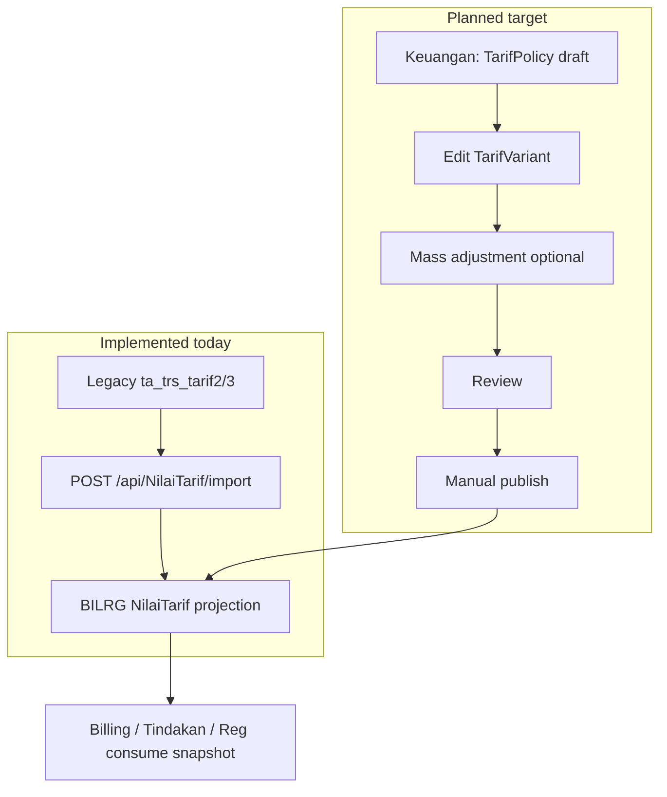

# Tarif Subsystem — Context

**Bounded context:** `ChargeContext` / Tarif  
**Artifact role:** WHY — business problem, scope, operational intent  
**Evidence:** `docs/tarif/tarif-codebase-retrieval-report.md`

---

## Implementation status (read first)

| Label | Meaning |
| ----- | ------- |
| **Implemented** | Present in codebase and used operationally |
| **Partial** | Present but incomplete or unused path |
| **Planned** | Target design; **not** in codebase |

| Concept | Status |
| ------- | ------ |
| `TarifType`, `NilaiTarifType`, `KomponenType`, masters (`TipeTarif`, `Kelas`, `SatTugas`, …) | **Implemented** |
| Operational projection (`BILRG_NilaiTarif*`) | **Implemented** (via legacy import today) |
| `TarifPolicy` / `TarifVariant` domain + `BILRG_Tarif*` persistence | **Implemented** (Phase 1 domain + Phase 2 persistence) |
| Manual publish orchestration (`TrfPublishTarifPolicyHandler`) | **Implemented** (Phase 3) |
| Policy HTTP workflow | **Planned** (Phase 4) |

Do not treat **Planned** concepts as already built when operating or integrating.

---

## Purpose

Tarif Subsystem exists to:

- define hospital **service tariff master** (`TarifType`),
- maintain **current operational tariff value** (`NilaiTarifType`) for billing and tindakan,
- **distribute** tariff into accounting and medical-fee components (`KomponenType`),
- support flexible, auditable hospital pricing changes (target: `TarifPolicy` / publish),
- preserve **immutability** of historical billing transactions.

Tarif provides **projection and breakdown only**. Billing owns transaction lifecycle; it **consumes** published `NilaiTarif` snapshot at transaction time.

---

## Business background

Hospital tariff is not static. Values change because of inflation, competition, management policy, jaminan negotiation, or unit strategy. A change may affect one tariff, one layanan, dozens of tariffs, or the whole catalog.

RS operations require:

- **flexibility** — activate immediately when needed, not only on calendar effective date,
- **auditability** — who published what, when, and from which policy,
- **mass maintenance** — periodic SK may touch hundreds of lines.

Legacy pain: weak audit trail, painful mass adjustment, duplicated updates, policy changes forcing full rewrites.

---

## Core terminology

| Term | Operational meaning |
| ---- | ------------------- |
| **Tarif** | Master layanan/jasa (catalog identity); **no** monetary value on master |
| **NilaiTarif** | **Current** operational price for variant **Tarif + Kelas + TipeTarif**, with komponen breakdown |
| **Komponen** | Breakdown unit: **COA** (accounting) + **SatTugas** (jasa/PPA eligibility) |
| **TipeTarif** | Variant dimension (e.g. umum vs jaminan channel) |
| **Kelas** | Patient class variant (owned by Ward context) |
| **TarifPolicy** | **Implemented** — business container for a pricing change (SK, draft, mass edit) |
| **TarifVariant** | **Implemented** — one pricing variant under a policy: `(Tarif + Kelas + TipeTarif)` + komponen breakdown |
| **TarifVariantKomponen** | **Implemented** — komponen line on a policy variant |
| **PublishLog** | **Implemented** — publish activation audit (who, when, which policy) |
| **Publish** | **Implemented** — `TrfPublishTarifPolicyHandler` refreshes `NilaiTarif` projection (manual; no scheduler) |

---

## Architectural intent (business view)

Four concepts stay **separate** (do not collapse):

```text
TarifPolicy
 └── TarifVariant
      └── TarifVariantKomponen

TarifType          → service tariff master (catalog)
NilaiTarifType     → operational published projection (fast lookup)
TarifPolicy        → pricing decision container / SK (planned)
TarifVariant       → one variant combination under policy (planned)
```

**Projection rule:** `NilaiTarif` is operational truth for **new** transactions; **not** historical source. History belongs to `TarifPolicy` + `TarifVariant` when implemented.

**Publish rule (target):** manual, explicit, auditable. Effective date is **informational only** — no auto-publish or auto-switch by date.

**Transaction rule:** published tariff affects **future** transactions only; existing billing lines stay immutable.

**Policy copy rule:** loading a previous policy is an **operational helper** — new independent draft, **no** inheritance/revision chain.

---

## Scope

### In scope

| Area | Notes |
| ---- | ----- |
| Tarif master | Catalog identity, grouping, classification |
| NilaiTarif projection | Variant pricing + komponen lines |
| Komponen master | COA, group, SatTugas eligibility |
| Supporting masters | TipeTarif, GroupKomponen, Jenis/Group tarif (catalog) |
| Publish / policy workflow | **Planned** |
| Projection refresh | **Implemented** (import); **Planned** (publish service) |

### Out of scope

| Area | Owner |
| ---- | ----- |
| Billing transaction lifecycle | Payment / `TrsBilling` |
| Journal posting, payment, settlement | Payment / accounting |
| Patient billing state machine | Billing |

---

## User roles

| Role | Responsibility |
| ---- | ---------------- |
| Keuangan | Draft policy, mass adjustment, komponen/COA validation (**Planned** workflow) |
| Supervisor / Direktur | Optional approval before publish (**Planned**) |
| Operator tarif | Run import, verify projection, spot-check nilai (**Implemented** today) |
| Admin master | Komponen, TipeTarif, GroupKomponen (**Partial** — persistence exists; HTTP admin mostly commented) |

---

## High-level operational flow

**Today (implemented):** legacy `ta_trs_tarif*` → **import** → `BILRG_*` projection → consumers (Reg, Tindakan, Lab).

**Target (planned):** policy draft → edit variants → review → **manual publish** → projection refresh → consumers.



---

## Related artifacts

| Path | Role |
| ---- | ---- |
| `docs/contexts/tarif/tarif-02-domain.md` | WHAT — aggregates, invariants |
| `docs/contexts/tarif/tarif-03-design.md` | HOW — persistence, import, migration |
| `docs/contexts/tarif/tarif-04-api-contract.md` | INTEGRATION — endpoints |
| `docs/contexts/tarif/tarif-05-runbook.md` | OPERATION — import, validation, recovery |
