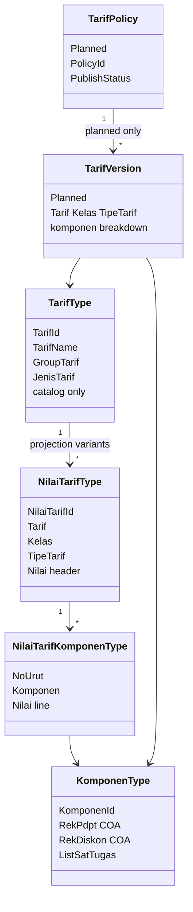
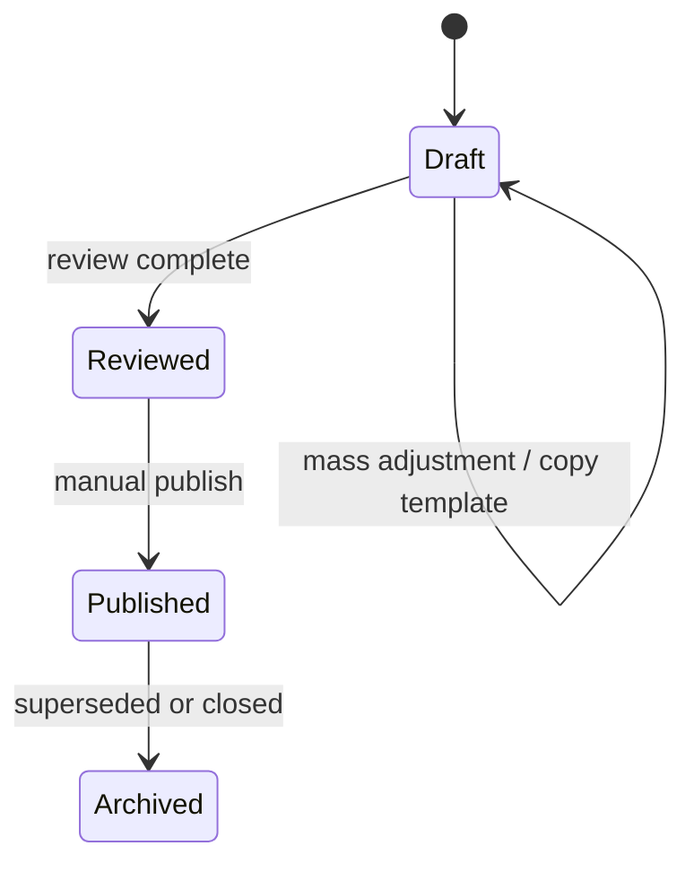

# Tarif Subsystem — Domain

**Bounded context:** `ChargeContext` / Tarif  
**Artifact role:** WHAT — aggregates, invariants, state, cross-context rules  
**Code reference:** `Bilreg.Domain/ChargeContext/TarifFeature/`

---

## Implementation map

| Aggregate / concept | Status | Domain type (code) |
| ------------------- | ------ | ------------------ |
| Tarif master | **Implemented** | `TarifType` |
| NilaiTarif projection | **Implemented** | `NilaiTarifType`, `NilaiTarifKomponenType` |
| Komponen | **Implemented** | `KomponenType` |
| Group komponen, tipe/jenis/group tarif, tipe rek | **Implemented** (lookups) | `GroupKomponenType`, `TipeTarifType`, … |
| Kelas | **External** (Ward) | `KelasType` / `KelasReff` |
| SatTugas | **External** (Admisi/PPA) | `SatTugasType` |
| COA on komponen | **External** (Payment) | `CoaType` on `KomponenType` |
| TarifPolicy | **Planned** | — |
| TarifVersion | **Planned** | — |

---

## Domain model



---

## Aggregate ownership

| Aggregate | Owns | Does not own |
| --------- | ---- | ------------ |
| **TarifType** | Service catalog identity, classification refs (`GroupTarif`, `JenisTarif`, `RekapCetak`) | Money amounts, history |
| **NilaiTarifType** | One operational variant: header `Nilai` + child komponen lines | Billing lines, policy audit |
| **KomponenType** | Distribution definition: COA pair, group, SatTugas eligibility set | Tarif header nilai |
| **TarifPolicy** *(planned)* | Policy metadata, draft/publish lifecycle, mass-edit scope | Live projection rows |
| **TarifVersion** *(planned)* | Immutable published pricing rows under a policy | Runtime lookup table |

**Lookup masters** (`TipeTarifType`, `GroupKomponenType`, …): owned as Charge/Tarif reference data; not full aggregates in tactical sense.

**External masters:** `Kelas` (Ward), `SatTugas` (Admisi), `Coa` (Payment) — referenced, not owned by Tarif.

---

## Concept definitions

### TarifType — service catalog

- Stable **`TarifId`**; business identity for layanan (Hecting, Lab test link, karcis, etc.).
- **No** direct monetary field; pricing lives in `NilaiTarifType`.
- **Implemented:** read-oriented at application boundary (`ITarifRepo` load/list only).

**Target rules (not all enforced in code today):** code immutable; soft-inactive via `IsAktif`; no hard delete.

### NilaiTarifType — operational projection

- Variant key: **`Tarif` + `TipeTarif` + `Kelas`** (`INilaiTarifCompositKey`).
- Header **`Nilai`** plus **`ListKomponen`** (`NilaiTarifKomponenType`: `NoUrut`, `KomponenReff`, line `Nilai`).
- **Not** historical source of truth; optimized for transaction lookup.
- **Implemented:** persisted in `BILRG_NilaiTarif` / `BILRG_NilaiTarifKomponen`; populated today primarily by **import**, not policy publish.

### KomponenType — dual distribution unit

| Role | Meaning |
| ---- | ------- |
| **Accounting** | `RekPdpt`, `RekDiskon` (`CoaType`) — consumed when building `TrsBilling` from tindakan |
| **Medical fee / jasa** | `ListSatTugas` — gates PPA assignment via `IsValidPpa(PpaType)` |

At least one komponen line per `NilaiTarif` is a **business** requirement; domain does not yet enforce sum(header) = sum(lines).

### TarifPolicy — business change container *(planned)*

- May hold **1** or **hundreds** of tariff versions.
- Represents SK, operational adjustment, or draft revision.
- **Independent** policies — no revision chain.
- **Copy previous policy** → new draft only; **no** inheritance.

### TarifVersion — historical pricing *(planned)*

- Records value + komponen breakdown for a variant under a policy.
- Immutable after publish.
- Publish refreshes matching **`NilaiTarifType`** projection row(s).

---

## Invariants

### Implemented in domain code

| Invariant | Where |
| --------- | ----- |
| Komponen id/name and group required | `KomponenType` constructor |
| GroupKomponen id/name on create | `GroupKomponenType.Create` |
| TipeTarif id/name; `NoUrut` ≥ 0 | `TipeTarifType.Create` |
| PPA valid only if komponen SatTugas intersects PPA SatTugas | `KomponenType.IsValidPpa` |
| PPA tindakan line requires valid komponen–PPA pairing | `TindakanKomponenWithPpaType.Create` |

### Business rules (target / partial enforcement)

| Rule | Status |
| ---- | ------ |
| ≥ 1 komponen per NilaiTarif | Business; **not** domain-enforced |
| Unique (Tarif, Kelas, TipeTarif) per projection | Business; **no** DB unique index today |
| Header nilai = Σ komponen nilai | **Not** enforced |
| Published nilai affects future transactions only | Billing boundary; Tarif agnostic |
| TarifPolicy overlap / publish audit | **Planned** |
| Effective date does not auto-activate | **Planned** publish semantics |

### Komponen / PPA

- Every komponen has COA fields (may map to legacy `t_rek`).
- Komponen line nilai may be zero.
- SatTugas restriction: if komponen has **no** SatTugas, `IsValidPpa` is false.

### Transaction boundary (domain)

- Tarif exposes **snapshot** (`NilaiTarifType`) at tindakan/reg creation time.
- Tarif does **not** mutate `TrsBilling` or posted transactions when projection changes later.

---

## Projection lifecycle

```mermaid
stateDiagram-v2
    direction LR

    state legacy as Legacy ta_trs_tarif2/3
    state bilrg as BILRG projection
    state consumed as Consumed by transaction

    [*] --> legacy : historical RS data
    legacy --> bilrg : Import implemented
    note right of bilrg : Planned: Policy publish refresh

    bilrg --> consumed : Load at tindakan/reg create
    consumed --> [*] : immutable billing snapshot

    bilrg --> bilrg : Import replaces all rows
```

| Stage | Implemented | Planned |
| ----- | ----------- | ------- |
| Authoring | Legacy tables + external RS tools | `TarifPolicy` draft + `TarifVersion` edit |
| Activation | `POST /api/NilaiTarif/import` (full replace) | Manual `publish` |
| Operational read | `INilaiTarifRepo` → `BILRG_*` | Same projection store |
| Historical read | Legacy `ta_trs_tarif*` only | `TarifVersion` store |

---

## TarifPolicy state *(planned)*



Publish (**planned**): explicit operator action; writes audit log; refreshes `NilaiTarif` projection; does **not** reschedule by effective date alone.

---

## Publish semantics *(planned — preserve in design)*

| Principle | Detail |
| --------- | ------ |
| Manual | No auto-publish by calendar |
| Auditable | Operator, timestamp, policy ref, note, affected count |
| Idempotent refresh | Replace variant row deterministically |
| Non-retroactive | Existing `TrsBilling` / tindakan lines unchanged |

**Today:** “publish” operationally equals **import** into `BILRG_*` (destructive full reload) — see runbook.

---

## Operational helpers *(planned)*

| Helper | Behavior |
| ------ | -------- |
| Copy policy | New `TarifPolicy` + cloned versions; **independent** draft |
| Mass % adjust | Recalculate draft versions only |
| Component-only adjust | Scope by komponen group/type |

Helpers do **not** create policy inheritance or automatic lineage.

---

## External context interaction

| Context | Provides | Tarif uses for |
| ------- | -------- | -------------- |
| Ward (`Kelas`) | `KelasReff` | NilaiTarif variant |
| Admisi (`SatTugas`, `Ppa`) | SatTugas master, PPA lists | Komponen eligibility |
| Payment (`Coa`, `TrsBilling`) | COA master, billing aggregate | Komponen accounts; **downstream** consumer of nilai snapshot |
| Tindakan / Reg | — | `LoadEntity` NilaiTarif by id or composite key |
| Lab | — | `TarifId` on test definition |

---

## Distinction table

| Concept | Role |
| ------- | ---- |
| `TarifType` | **What** service is being priced (catalog) |
| `NilaiTarifType` | **What** it costs **now** operationally (projection) |
| `TarifPolicy` | **Why/how** a batch of changes is grouped (planned) |
| `TarifVersion` | **What** was decided historically under that policy (planned) |
| `KomponenType` | **How** amount splits for accounting and jasa |
