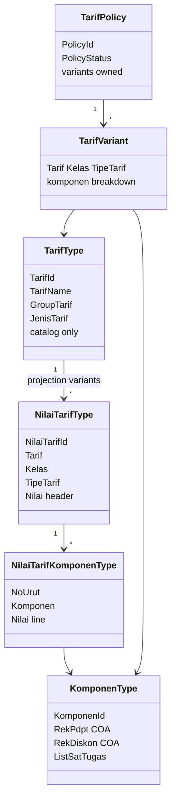
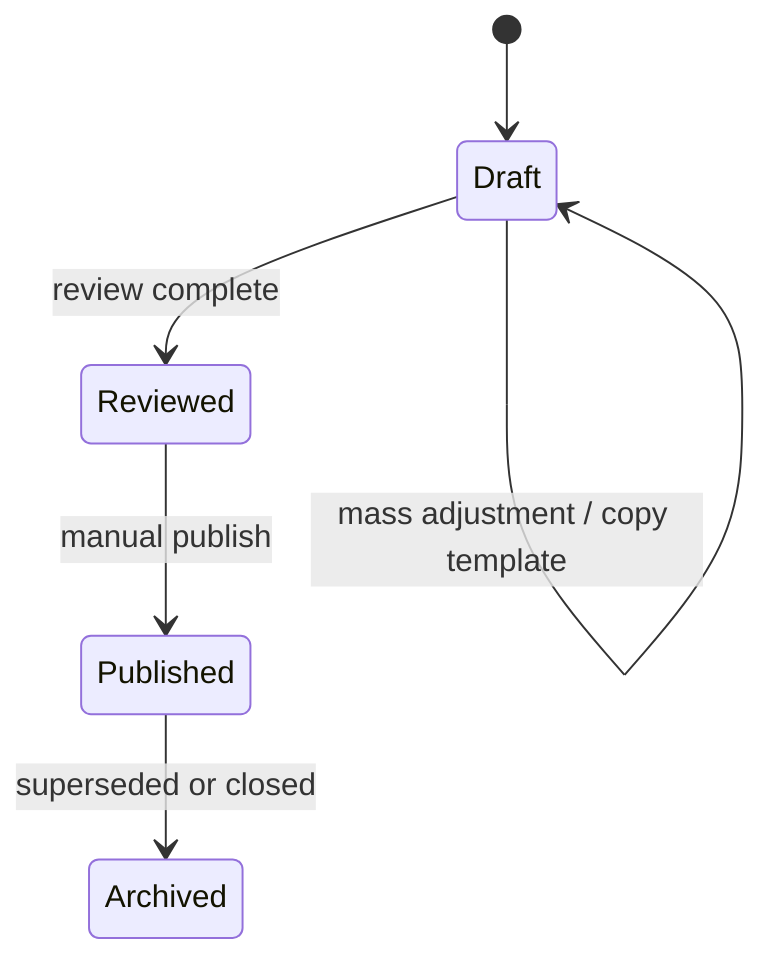

# Tarif Subsystem — Domain

**Bounded context:** `ChargeContext` / Tarif  
**Artifact role:** WHAT — aggregates, invariants, state, cross-context rules  
**Code reference:** `Bilreg.Domain/ChargeContext/TarifFeature/`

---

## Implementation map

| Aggregate / concept | Status | Domain type (code) |
| ------------------- | ------ | ------------------ |
| Tarif master | **Implemented** | `TarifType` |
| NilaiTarif projection | **Implemented** | `NilaiTarifType`, `NilaiTarifKomponenType` |
| Komponen | **Implemented** | `KomponenType` |
| Group komponen, tipe/jenis/group tarif, tipe rek | **Implemented** (lookups) | `GroupKomponenType`, `TipeTarifType`, … |
| Kelas | **External** (Ward) | `KelasType` / `KelasReff` |
| SatTugas | **External** (Admisi/PPA) | `SatTugasType` |
| COA on komponen | **External** (Payment) | `CoaType` on `KomponenType` |
| TarifPolicy | **Implemented** (domain Phase 1; persistence Phase 2) | `TarifPolicyType`, `TarifPolicyStatus` |
| TarifVariant | **Implemented** (child of policy) | `TarifVariantType`, `TarifVariantKomponenType` |
| PublishLog | **Implemented** (audit + Phase 3 write path) | `TarifPublishLogType`, `TarifPublishLogDetailType` |

---

## Domain model



---

## Aggregate ownership

| Aggregate | Owns | Does not own |
| --------- | ---- | ------------ |
| **TarifType** | Service catalog identity, classification refs (`GroupTarif`, `JenisTarif`, `RekapCetak`) | Money amounts, history |
| **NilaiTarifType** | One operational variant: header `Nilai` + child komponen lines | Billing lines, policy audit |
| **KomponenType** | Distribution definition: COA pair, group, SatTugas eligibility set | Tarif header nilai |
| **TarifPolicy** | Policy metadata, draft/publish lifecycle, mass-edit scope; variants owned in aggregate | Live `BILRG_NilaiTarif*` rows; publish orchestration |
| **TarifVariant** | One `(Tarif, Kelas, TipeTarif)` + komponen lines; immutable after parent published | Operational projection rows (separate aggregate) |
| **PublishLog** | Publish activation audit header + optional per-variant detail | Policy variant editing |

**Lookup masters** (`TipeTarifType`, `GroupKomponenType`, …): owned as Charge/Tarif reference data; not full aggregates in tactical sense.

**External masters:** `Kelas` (Ward), `SatTugas` (Admisi), `Coa` (Payment) — referenced, not owned by Tarif.

---

## Concept definitions

### TarifType — service catalog

- Stable **`TarifId`**; business identity for layanan (Hecting, Lab test link, karcis, etc.).
- **No** direct monetary field; pricing lives in `NilaiTarifType`.
- **Implemented:** read-oriented at application boundary (`ITarifRepo` load/list only).

**Target rules (not all enforced in code today):** code immutable; soft-inactive via `IsAktif`; no hard delete.

### NilaiTarifType — operational projection

- Variant key: **`Tarif` + `TipeTarif` + `Kelas`** (`INilaiTarifCompositKey`).
- Header **`Nilai`** plus **`ListKomponen`** (`NilaiTarifKomponenType`: `NoUrut`, `KomponenReff`, line `Nilai`).
- **Not** historical source of truth; optimized for transaction lookup.
- **Implemented:** persisted in `BILRG_NilaiTarif` / `BILRG_NilaiTarifKomponen`; populated today primarily by **import**, not policy publish.

### KomponenType — dual distribution unit

| Role | Meaning |
| ---- | ------- |
| **Accounting** | `RekPdpt`, `RekDiskon` (`CoaType`) — consumed when building `TrsBilling` from tindakan |
| **Medical fee / jasa** | `ListSatTugas` — gates PPA assignment via `IsValidPpa(PpaType)` |

At least one komponen line per `NilaiTarif` is a **business** requirement; domain does not yet enforce sum(header) = sum(lines).

### TarifPolicy — business change container

- May hold **1** or **hundreds** of tariff variants.
- Represents SK, operational adjustment, or draft revision.
- **Independent** policies — no revision chain.
- **Copy previous policy** → new draft only; **no** inheritance (`CopyFrom`).
- Domain behaviour: `Create`, `AddVariant`, `CopyFrom`, `MassAdjust`, `MarkReviewed`, `ValidateForPublish`, `MarkPublished` (status only — no projection/log).
- `PublishedNilaiTarifId` on variant is a **post-publish snapshot link** to `BILRG_NilaiTarif`; set by Phase-3 handler, cleared on copy.

### TarifVariant — pricing variant under policy

- One operational combination: **`Tarif` + `Kelas` + `TipeTarif`** with header nilai and **`TarifVariantKomponen`** lines.
- `VariantCompositeKey` for uniqueness within policy.
- Immutable after parent policy published (enforced via `TarifPolicyType.EnsureEditable`).
- Publish refreshes matching **`NilaiTarifType`** projection row(s) via `INilaiTarifProjectionWriter` orchestrated in **`TrfPublishTarifPolicyHandler`** (not in domain).

---

## Invariants

### Implemented in domain code

| Invariant | Where |
| --------- | ----- |
| Komponen id/name and group required | `KomponenType` constructor |
| GroupKomponen id/name on create | `GroupKomponenType.Create` |
| TipeTarif id/name; `NoUrut` ≥ 0 | `TipeTarifType.Create` |
| PPA valid only if komponen SatTugas intersects PPA SatTugas | `KomponenType.IsValidPpa` |
| PPA tindakan line requires valid komponen–PPA pairing | `TindakanKomponenWithPpaType.Create` |
| Unique variant per policy `(Tarif, Kelas, TipeTarif)` | `TarifPolicyType.AddVariant` |
| Cannot edit published/archived policy | `TarifPolicyType.EnsureEditable` |
| Cannot publish empty policy | `TarifPolicyType.ValidateForPublish` |
| ≥ 1 komponen per policy variant; header = Σ komponen (±0.01) | `TarifVariantType` constructor / `EnsureValidForPublish` |
| Copy policy → new id, Draft, cleared `PublishedNilaiTarifId` | `TarifPolicyType.CopyFrom` |
| Mass % adjust on draft variants only | `TarifPolicyType.MassAdjust` |
| Review transition Draft → Reviewed only | `TarifPolicyType.MarkReviewed` |
| Publish validation (status Draft/Reviewed) | `TarifPolicyType.ValidateForPublish` |
| Re-publish validation (status Published) | `TarifPolicyType.ValidateForRepublish` |

### Business rules (target / partial enforcement)

| Rule | Status |
| ---- | ------ |
| ≥ 1 komponen per NilaiTarif projection | Business; **not** domain-enforced on `NilaiTarifType` |
| Unique (Tarif, Kelas, TipeTarif) per projection | **LIVE** — `UX_BILRG_NilaiTarif_Variant` (Phase 0) |
| Header nilai = Σ komponen on projection | **Not** domain-enforced on `NilaiTarifType` |
| Published nilai affects future transactions only | Billing boundary; Tarif agnostic |
| TarifPolicy overlap at publish time | **Planned** — Phase 3 application validator |
| Effective date does not auto-activate | **Design** — manual publish only |
| Master ref existence (Tarif, Kelas, TipeTarif, Komponen) at publish | **Implemented** — `TrfPublishTarifPolicyHandler.EnsureMasterReferences` |

### Komponen / PPA

- Every komponen has COA fields (may map to legacy `t_rek`).
- Komponen line nilai may be zero.
- SatTugas restriction: if komponen has **no** SatTugas, `IsValidPpa` is false.

### Transaction boundary (domain)

- Tarif exposes **snapshot** (`NilaiTarifType`) at tindakan/reg creation time.
- Tarif does **not** mutate `TrsBilling` or posted transactions when projection changes later.

---

## Projection lifecycle

```mermaid
stateDiagram-v2
    direction LR

    state legacy as Legacy ta_trs_tarif2/3
    state bilrg as BILRG projection
    state consumed as Consumed by transaction

    [*] --> legacy : historical RS data
    legacy --> bilrg : Import implemented
    note right of bilrg : Policy publish refresh (Phase 3 LIVE)

    bilrg --> consumed : Load at tindakan/reg create
    consumed --> [*] : immutable billing snapshot

    bilrg --> bilrg : Import replaces all rows
```

| Stage | Implemented | Planned |
| ----- | ----------- | ------- |
| Authoring | Legacy tables + external RS tools | `TarifPolicy` draft + `TarifVariant` edit |
| Activation | `POST /api/NilaiTarif/import` (full replace) | `TrfPublishTarifPolicyCmd` (MediatR; HTTP Phase 4) |
| Operational read | `INilaiTarifRepo` → `BILRG_*` | Same projection store |
| Historical read | Legacy `ta_trs_tarif*` only | `TarifVariant` store |

---

## TarifPolicy state



Domain `MarkPublished` transitions status only. **Publish orchestration** (audit log, `BILRG_*` upsert) is **LIVE** in `TrfPublishTarifPolicyHandler` — explicit operator action; does **not** reschedule by effective date alone.

---

## Publish semantics *(orchestration LIVE — see tarif-06-publish-engine.md)*

| Principle | Detail |
| --------- | ------ |
| Manual | No auto-publish by calendar |
| Auditable | Operator, timestamp, policy ref, note, affected count |
| Idempotent refresh | Replace variant row deterministically |
| Non-retroactive | Existing `TrsBilling` / tindakan lines unchanged |

**Today:** “publish” operationally equals **import** into `BILRG_*` (destructive full reload) — see runbook.

---

## Operational helpers

| Helper | Domain | Status |
| ------ | ------ | ------ |
| Copy policy | `TarifPolicyType.CopyFrom` | **Implemented** |
| Mass % adjust | `TarifPolicyType.MassAdjust` (`percentFactor` = e.g. `10` → +10%) | **Implemented** |
| Component-only adjust | Scope by komponen group/type | **Planned** (Phase 4) |

Helpers do **not** create policy inheritance or automatic lineage.

---

## External context interaction

| Context | Provides | Tarif uses for |
| ------- | -------- | -------------- |
| Ward (`Kelas`) | `KelasReff` | NilaiTarif variant |
| Admisi (`SatTugas`, `Ppa`) | SatTugas master, PPA lists | Komponen eligibility |
| Payment (`Coa`, `TrsBilling`) | COA master, billing aggregate | Komponen accounts; **downstream** consumer of nilai snapshot |
| Tindakan / Reg | — | `LoadEntity` NilaiTarif by id or composite key |
| Lab | — | `TarifId` on test definition |

---

## Distinction table

| Concept | Role |
| ------- | ---- |
| `TarifType` | **What** service is being priced (catalog) |
| `NilaiTarifType` | **What** it costs **now** operationally (projection) |
| `TarifPolicy` | **Why/how** a batch of changes is grouped |
| `TarifVariant` | **Which** `(Tarif, Kelas, TipeTarif)` combination and nilai under that policy |
| `TarifVariantKomponen` | Komponen breakdown on a policy variant |
| `PublishLog` | **When** a policy was activated to projection (`TrfPublishTarifPolicyHandler`) |
| `KomponenType` | **How** amount splits for accounting and jasa |
