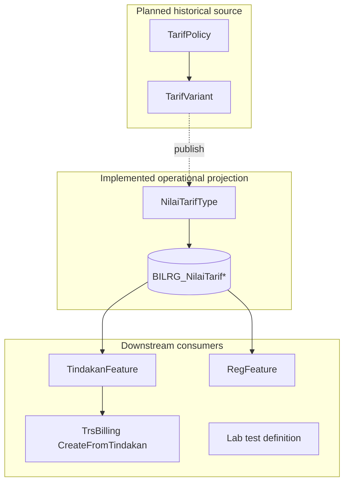
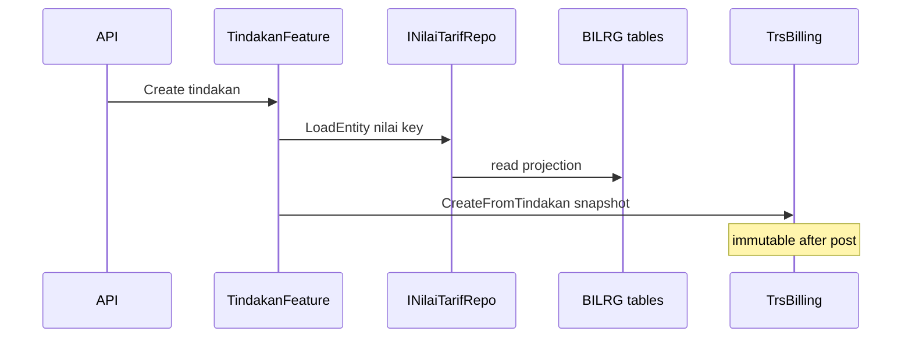

# Tarif Subsystem — Design

**Bounded context:** `ChargeContext`  
**Artifact role:** HOW — architecture, persistence, integration, migration  
**Evidence:** `docs/tarif/tarif-codebase-retrieval-report.md`

---

## Layering (implemented)

```text
Bilreg.Api (NilaiTarifController, TarifController)
    → Bilreg.Application (MediatR Trf*, I*Repo)
        → Bilreg.Domain (TarifFeature records, keys, minimal behavior)
    Bilreg.Infrastructure (Repo + Dal + Dto) → SQL Server
```

- **DI:** Scrutor assembly scan (`InfrastructureService`, `ApplicationService`).
- **Patterns:** Repository + DAL, explicit DTO mapping, Dapper + SqlBulkCopy, `MayBe` for missing entities.
- **No** EF for Tarif; **no** domain events for tarif changes today.

**Feature folders:** `Bilreg.Domain/ChargeContext/TarifFeature/`, matching Application/Infrastructure/SqlDb paths.

---

## Architectural separation



Historical pricing must **not** be resolved by scanning projection alone once `TarifVariant` exists. Until then, legacy `ta_trs_tarif*` + import is the de-facto upstream.

---

## Hybrid persistence (current state)

### Dual-schema era

| Store | Role today |
| ----- | ---------- |
| `TA_TARIF`, `ta_detil_tarif`, `ta_tarif_tipe`, `ta_kelas`, … | Masters (legacy names, Dapper) |
| `ta_trs_tarif2` / `ta_trs_tarif3` | **Import source only** (not runtime read path) |
| `BILRG_NilaiTarif`, `BILRG_NilaiTarifKomponen` | **Runtime operational projection** |

### Import pipeline (implemented)

`NilaiTarifRepo.Import()`:

1. Read `ta_trs_tarif3` joined to `ta_trs_tarif2` where parent `fd_tgl_expired = '3000-01-01'` and `fn_nilai > 0`.
2. **Clear** both `BILRG_*` tables.
3. Bulk insert header (ULID `NilaiTarifId`) and komponen lines; header `Nilai` = **sum** of line values per (tarif, kelas, tipe).

**Not implemented:** continuous sync from legacy; date-based auto-cutover.

**LIVE (Phase 0):** `TrfImportNilaiTarifHandler` wraps `NilaiTarifRepo.Import()` write phase in `TransHelper.NewScope()` — failed import rolls back `BILRG_*` changes. `Import()` clears komponen before header, then bulk inserts.

### Projection read path (implemented)

- `LoadEntity` by `NilaiTarifId` or `INilaiTarifCompositKey`.
- `Search(layananId, variant, keyword)` for barang/tarif picker.
- `INilaiTarifRepo.SaveChanges` exists; **no application caller** (grep) — maintenance today is import-only.

### Policy persistence (Phase 2 — implemented)

| Table | Role |
| ----- | ---- |
| `BILRG_TarifPolicy` | Policy header + `PolicyStatus` + audit columns |
| `BILRG_TarifVariant` | Variant lines `(TarifPolicyId, ItemNo)` + optional `PublishedNilaiTarifId` |
| `BILRG_TarifVariantKomponen` | Komponen breakdown per variant line |
| `BILRG_TarifPublishLog` | Publish audit header |
| `BILRG_TarifPublishLogDetail` | Optional per-variant publish snapshot |

**Repositories:** `ITarifPolicyRepo` (load/save draft + list summary), `ITarifPublishLogRepo` (insert/load/list by policy).

**Child replace:** policy save deletes all variant/komponen rows for the policy id, then bulk re-inserts (deterministic `ItemNo` / `NoUrut` ordering).

**Projection writer (Phase 2 helper, no orchestration):** `INilaiTarifProjectionWriter.Upsert` — upserts one `NilaiTarifType` into `BILRG_NilaiTarif*`, **preserves** existing `NilaiTarifId` when composite `(TarifId, TipeTarifId, KelasId)` exists, sets `SourcePolicyId` on header. Intended for Phase-3 publish handler inside an explicit transaction.

`INilaiTarifRepo` consumer surface is **unchanged** (import, load, search).

### Migration direction (remaining)

1. Keep `BILRG_*` as operational projection store.
2. ~~Add `TarifPolicy` / `TarifVariant` / publish log tables.~~ **Done (Phase 2).**
3. Implement publish service (Phase 3) → call `INilaiTarifProjectionWriter` per variant + write publish log.
4. Reduce reliance on destructive full import; legacy import remains fallback during transition.
5. Preserve `TarifType`, `NilaiTarifType`, `KomponenType` and consumer contracts.

---

## Component responsibilities (code)

| Piece | Location | Responsibility |
| ----- | -------- | ---------------- |
| `TarifRepo` / `TarifDal` | Infrastructure | Read tarif master |
| `NilaiTarifRepo` / `NilaiTarifDal` | Infrastructure | Import, load, search projection |
| `KomponenRepo` / `KomponenDal` | Infrastructure | Komponen CRUD path (API mostly off) |
| `TrfImportNilaiTarifHandler` | Application | MediatR → `Import()` |
| `TrfGetNilaiTarifHandler` | Application | Load composite + enrich SatTugas ids |
| `TrfListTarifBrgHandler` | Application | Search + stok linkage |
| `TarifPolicyRepo` / `*Dal` | Infrastructure | Policy aggregate persistence (Phase 2) |
| `TarifPublishLogRepo` | Infrastructure | Publish log insert/load (Phase 2) |
| `NilaiTarifProjectionWriter` | Infrastructure | Single-variant projection upsert for future publish (Phase 2) |

**Cross-context domain references (compile-time):** `KomponenType` → `CoaType` (Payment), `SatTugasType` (Admisi); `NilaiTarifType` → `KelasReff` (Ward).

---

## Integration: how consumers load nilai

| Flow | Key used | Repo call |
| ---- | -------- | --------- |
| Tindakan create/save | `NilaiTarifId` on command | `LoadEntity(INilaiTarifKey)` |
| Reg karcis / booking / ubah kunjungan / jaminan | Composite | `LoadEntity(INilaiTarifCompositKey)` via `NilaiTarifType.KeyComposite` |
| Lab | `TarifId` on master | Tarif linkage only |

Billing: `TrsBillingType.CreateFromTindakan` validates tarif/jaminan alignment and maps komponen COA — **PaymentContext**, explicit call site, outside Tarif feature.



---

## Projection refresh strategies

| Mechanism | Status | Characteristics |
| --------- | ------ | ----------------- |
| Full import | **LIVE** | Destructive global replace inside `TransactionScope`; rolls back on failure |
| Per-variant save | **Partial** | Repo `SaveChanges` + child replace; unused |
| Policy publish | **Planned** | Transactional batch; variant-level upsert; audit log |

**Planned publish steps:**

1. Validate policy (draft, no illegal overlap).
2. Write publish log (user, time, policy id, counts).
3. Refresh `BILRG_*` rows for affected variants only (or full replace per policy scope — TBD in implementation).
4. Do **not** touch existing `TrsBilling` rows.

---

## Transaction boundaries

| Operation | Boundary |
| --------- | -------- |
| Tindakan + billing create | `TransHelper.NewScope()` in `TdkCreateTindakanCmd` / save |
| NilaiTarif import | **LIVE** — `TransHelper.NewScope()` in `TrfImportNilaiTarifHandler`; komponen cleared before header |
| Tarif publish (planned) | Should be single transactional unit for log + projection |

Tarif subsystem **ends** at: published projection row + komponen metadata available to loaders. It does **not** open billing or payment transactions.

---

## Effective date (design decision)

- Stored on policy/variant as **information** for RS reporting and SK reference.
- **No** scheduler auto-activating projection by date.
- Operator **publish** selects moment of operational switch.

Legacy import filter uses fixed expiry `'3000-01-01'` on `ta_trs_tarif2` — not equivalent to planned effective-date engine.

---

## Security and API surface

- JWT configured globally; Tarif controllers have **no** per-endpoint `[Authorize]` attributes today.
- Planned: role split Keuangan (draft) vs Supervisor (publish) — see api-contract.

---

## Known engineering gaps (factual)

| Gap | Impact |
| --- | ------ |
| `KomponenRepo` master HTTP still mostly off | Admin via DB/legacy tools |
| Import regenerates ULIDs each run | Tindakan ids from prior import orphaned in DB |
| TarifPolicy publish orchestration | Domain + persistence **live**; `TrfPublishTarifPolicyHandler` **planned** (Phase 3) |
| `KelasDal.Update` SQL mismatch | Ward master update defect (adjacent) |
| Master HTTP controllers commented (`BillContext/TindakanSub/*`) | Admin via DB/legacy tools |
| Policy CRUD/review HTTP | **Planned** (Phase 4) |

---

## Performance notes

- Projection tables exist for **fast lookup** by id/composite and layanan-scoped search (`ta_tarif4.fs_kd_layanan` join in search).
- Full import acceptable for batch maintenance windows; not for per-second updates.
- SqlBulkCopy requires DTO column alignment with table definitions.

---

## Related artifacts

| Path | Content |
| ---- | ------- |
| `docs/contexts/tarif/tarif-02-domain.md` | Business invariants |
| `docs/contexts/tarif/tarif-04-api-contract.md` | HTTP contracts |
| `docs/contexts/tarif/tarif-05-runbook.md` | Import and validation ops |
