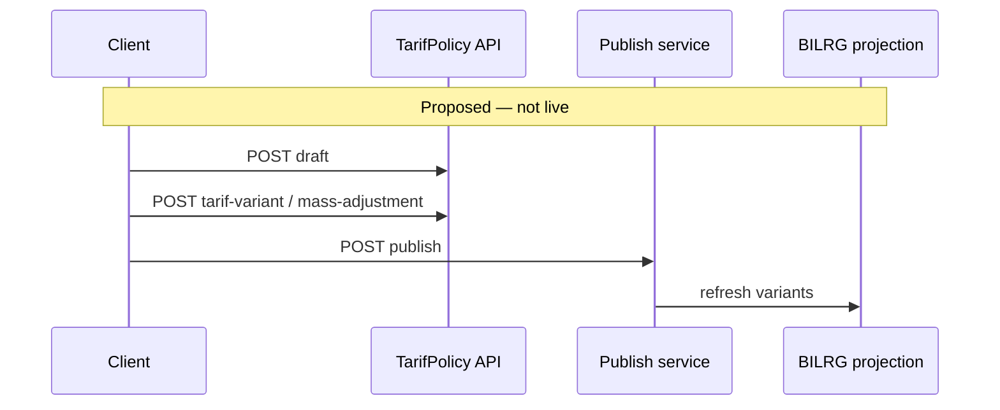

# Tarif Subsystem — API Contract

**Artifact role:** INTEGRATION — HTTP surface for clients  
**Base:** JWT authentication enabled globally (`Program.cs`); Tarif controllers inherit default auth — **no** feature-specific policies on controllers today.

---

## Contract legend

| Tag | Meaning |
| --- | ------- |
| **[Live]** | Implemented route in codebase |
| **[Proposed]** | Target contract; **not** implemented |

---

## [Live] endpoints

### Import NilaiTarif projection

```http
POST /api/NilaiTarif/import
```

| Item | Detail |
| ---- | ------ |
| Controller | `Bilreg.Api/Controllers/ChargeContext/NilaiTarifController` |
| Handler | `TrfImportNilaiTarifCmd` → `INilaiTarifRepo.Import()` |
| Effect | Clears `BILRG_NilaiTarif` + `BILRG_NilaiTarifKomponen`; reloads from legacy `ta_trs_tarif2/3` (filter: parent `fd_tgl_expired = '3000-01-01'`, `fn_nilai > 0`) |
| Body | None |
| Success | 200 (handler completes import) |
| Failure | Unhandled exception → 500; **no** structured Tarif error catalog yet |

**Operational warning:** destructive full replace — coordinate maintenance window (see runbook).

---

### Search tarif barang (layanan + variant + keyword)

```http
GET /api/NilaiTarif/tarif-brg?layananId={layananId}&kelasId={kelasId}&tipeTarifId={tipeTarifId}&keyword={keyword}
```

| Query | Required | Purpose |
| ----- | -------- | ------- |
| `layananId` | Yes | Scope to layanan (`ta_tarif4` linkage) |
| `kelasId` | Yes | Kelas variant |
| `tipeTarifId` | Yes | Tipe tarif variant |
| `keyword` | Yes | Search text (stok path may require len ≥ 3 in repo) |

| Item | Detail |
| ---- | ------ |
| Handler | `TrfListTarifBrgQuery` |
| Data source | `BILRG_*` via `INilaiTarifRepo.Search` + `IStokRepo` |

---

### Get NilaiTarif by composite key

```http
GET /api/Tarif/nilai/{tarifId}/{tipeTarifId}/{kelasId}
```

| Item | Detail |
| ---- | ------ |
| Controller | `Bilreg.Api/Controllers/BillContext/TindakanSub/TarifController` |
| Handler | `TrfGetNilaiTarifQuery` |
| Path | `tarifId`, `tipeTarifId`, `kelasId` |
| Success | `NilaiTarifType` JSON (komponen lines; SatTugas ids enriched via `IKomponenRepo`) |
| Not found | `KeyNotFoundException` → typically 404/500 depending on global exception handling |

**Note:** Duplicate route on `NilaiTarifController` is **commented out**.

---

## [Live] consumption (no Tarif HTTP)

These flows call `INilaiTarifRepo` internally — document for integrators debugging “wrong nilai”:

| Area | Typical entry | Load pattern |
| ---- | ------------- | ------------ |
| Tindakan | `TdkCreateTindakanCmd`, `TdkSaveTindakanCmd` | By `NilaiTarifId` |
| Reg | walk-in, booking, ubah kunjungan/jaminan, darurat | `NilaiTarifType.KeyComposite(tarif, tipe, kelas)` |
| Lab | `LabTestDefinitionController` | `TarifId` reference on master |

---

## [Proposed] TarifPolicy / publish API

> **Future implementation** — routes and payloads below are design targets only.

### Create policy draft

```http
POST /api/tarif-policy
```

```json
{
  "policyNo": "SK-007",
  "policyName": "Penyesuaian Tarif 2026",
  "effectiveDateInfo": "2026-06-01",
  "description": "Kenaikan tarif laboratorium"
}
```

### Copy policy (operational helper)

```http
POST /api/tarif-policy/{policyId}/copy
```

Creates **new independent** policy; no lineage link.

### Add variant line

```http
POST /api/tarif-policy/{policyId}/tarif-variant
```

```json
{
  "tarifId": "TRF001",
  "kelasId": "KLS01",
  "tipeTarifId": "UMUM",
  "komponen": [
    { "komponenId": "JASA", "nilai": 50000 }
  ]
}
```

### Mass adjustment (draft only)

```http
POST /api/tarif-policy/{policyId}/mass-adjustment
```

```json
{
  "scope": "ALL",
  "adjustmentType": "PERCENTAGE",
  "value": 10
}
```

### Publish

```http
POST /api/tarif-policy/{policyId}/publish
```

| Item | Detail |
| ---- | ------ |
| Behavior | Validate draft → write publish log → refresh `BILRG_*` projection |
| Trigger | **Manual** only |

---

## [Deprecated / inactive] legacy BillContext controllers

Under `Bilreg.Api/Controllers/BillContext/TindakanSub/` — e.g. `KomponenTarifController`, `GrupKomponenController`, `JenisTarifController` — **fully commented**. Persistence (Repo/DAL) exists; do not rely on these routes in new clients.

---

## Validation matrix

| Rule | [Live] enforcement | [Proposed] |
| ---- | ------------------ | ---------- |
| ≥ 1 komponen per nilai | Not enforced in domain | Publish validator |
| Unique (tarif, kelas, tipe) | In-memory filter on composite load only | DB unique + publish check |
| Σ komponen = header nilai | Import sums on build only | Publish validator |
| COA on komponen | Master data assumption | Master API + publish check |
| PPA vs SatTugas | `IsValidPpa` at tindakan create | Unchanged |
| Policy overlap | N/A | Publish rejects |

---

## [Proposed] error shapes

```json
{
  "code": "TARIF_OVERLAP",
  "message": "Tarif effective date overlap detected"
}
```

```json
{
  "code": "DUPLICATE_VARIANT",
  "message": "Projection variant already exists"
}
```

Live endpoints today rely on standard exceptions, not these codes.

---

## Authorization (proposed)

| Action | Suggested role |
| ------ | -------------- |
| View nilai / search | Operational user |
| Import projection | Keuangan / DBA (restricted) |
| Edit policy draft | Keuangan |
| Publish | Supervisor / Direktur |
| Mass adjustment | Keuangan |

---

## Workflow sequence (target)



**Live today:** `Client → POST /api/NilaiTarif/import → BILRG`.

---

## Related artifacts

| Path | Role |
| ---- | ---- |
| `docs/contexts/tarif/tarif-03-design.md` | Import and persistence |
| `docs/contexts/tarif/tarif-05-runbook.md` | Import procedure and checks |
