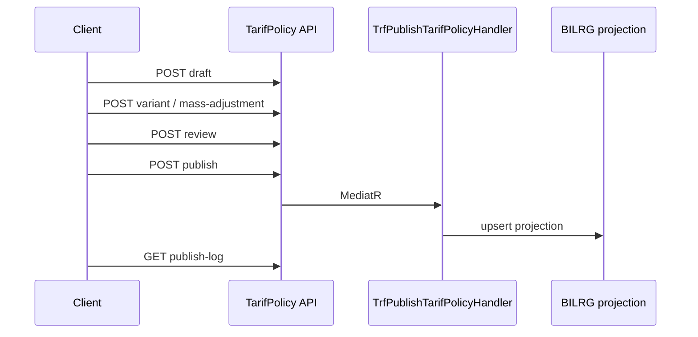

# Tarif Subsystem — API Contract

**Artifact role:** INTEGRATION — HTTP surface for clients  
**Base:** JWT authentication enabled (`Program.cs`). `TarifPolicyController` requires `[Authorize]` (authenticated JWT). Role-based Keuangan/Supervisor gates are **deferred** — see [`tarif-07-admin-workflow.md`](tarif-07-admin-workflow.md).

---

## Contract legend

| Tag | Meaning |
| --- | ------- |
| **[Live]** | Implemented route in codebase |
| **[Proposed]** | Target contract; **not** implemented |

---

## [Live] endpoints

### Import NilaiTarif projection

```http
POST /api/NilaiTarif/import
```

| Item | Detail |
| ---- | ------ |
| Controller | `Bilreg.Api/Controllers/ChargeContext/NilaiTarifController` |
| Handler | `TrfImportNilaiTarifCmd` → `INilaiTarifRepo.Import()` |
| Effect | Clears `BILRG_NilaiTarif` + `BILRG_NilaiTarifKomponen`; reloads from legacy `ta_trs_tarif2/3` (filter: parent `fd_tgl_expired = '3000-01-01'`, `fn_nilai > 0`) |
| Body | None |
| Success | 200 (handler completes import) |
| Failure | Unhandled exception → 500; **no** structured Tarif error catalog yet |

**Operational warning:** destructive full replace — coordinate maintenance window (see runbook).

---

### Search tarif barang (layanan + variant + keyword)

```http
GET /api/NilaiTarif/tarif-brg?layananId={layananId}&kelasId={kelasId}&tipeTarifId={tipeTarifId}&keyword={keyword}
```

| Query | Required | Purpose |
| ----- | -------- | ------- |
| `layananId` | Yes | Scope to layanan (`ta_tarif4` linkage) |
| `kelasId` | Yes | Kelas variant |
| `tipeTarifId` | Yes | Tipe tarif variant |
| `keyword` | Yes | Search text (stok path may require len ≥ 3 in repo) |

| Item | Detail |
| ---- | ------ |
| Handler | `TrfListTarifBrgQuery` |
| Data source | `BILRG_*` via `INilaiTarifRepo.Search` + `IStokRepo` |

---

### Get NilaiTarif by composite key

```http
GET /api/Tarif/nilai/{tarifId}/{tipeTarifId}/{kelasId}
```

| Item | Detail |
| ---- | ------ |
| Controller | `Bilreg.Api/Controllers/BillContext/TindakanSub/TarifController` |
| Handler | `TrfGetNilaiTarifQuery` |
| Path | `tarifId`, `tipeTarifId`, `kelasId` |
| Success | `NilaiTarifType` JSON (komponen lines; SatTugas ids enriched via `IKomponenRepo`) |
| Not found | `KeyNotFoundException` → typically 404/500 depending on global exception handling |

**Note:** Duplicate route on `NilaiTarifController` is **commented out**.

---

## [Live] consumption (no Tarif HTTP)

These flows call `INilaiTarifRepo` internally — document for integrators debugging “wrong nilai”:

| Area | Typical entry | Load pattern |
| ---- | ------------- | ------------ |
| Tindakan | `TdkCreateTindakanCmd`, `TdkSaveTindakanCmd` | By `NilaiTarifId` |
| Reg | walk-in, booking, ubah kunjungan/jaminan, darurat | `NilaiTarifType.KeyComposite(tarif, tipe, kelas)` |
| Lab | `LabTestDefinitionController` | `TarifId` reference on master |

---

## [Live] TarifPolicy admin API

**Controller:** `Bilreg.Api/Controllers/ChargeContext/TarifPolicyController`  
**Route prefix:** `/api/tarif-policy`  
**Auth:** JWT required on all routes (`[Authorize]`).

| Method | Route | Handler | Notes |
| ------ | ----- | ------- | ----- |
| POST | `/` | `TrfCreateTarifPolicyCmd` | Creates `Draft` policy |
| GET | `/{id}` | `TrfGetTarifPolicyQry` | Detail + variants + komponen |
| GET | `/` | `TrfListTarifPolicyQry` | Query: `policyStatus`, `keyword` |
| PUT | `/{id}` | `TrfUpdateTarifPolicyCmd` | Metadata only; `Draft`/`Reviewed` |
| POST | `/{id}/variant` | `TrfAddTarifPolicyVariantCmd` | Body includes `userId` |
| PUT | `/{id}/variant/{itemNo}` | `TrfUpdateTarifPolicyVariantCmd` | |
| DELETE | `/{id}/variant/{itemNo}` | `TrfRemoveTarifPolicyVariantCmd` | |
| POST | `/{id}/copy` | `TrfCopyTarifPolicyCmd` | Independent draft; body: `newPolicyNo`, `newPolicyName`, `userId` |
| POST | `/{id}/mass-adjustment` | `TrfMassAdjustTarifPolicyCmd` | `scope=ALL`, `adjustmentType=PERCENTAGE` |
| POST | `/{id}/review` | `TrfReviewTarifPolicyCmd` | `Draft` → `Reviewed` |
| POST | `/{id}/publish` | `TrfPublishTarifPolicyCmd` | Body: `publishedBy`, optional `note` |
| GET | `/{id}/publish-log` | `TrfListTarifPolicyPublishLogQry` | Append-only audit |

### Create policy draft

```http
POST /api/tarif-policy
```

```json
{
  "policyNo": "SK-007",
  "policyName": "Penyesuaian Tarif 2026",
  "effectiveDateInfo": "2026-06-01T00:00:00",
  "description": "Kenaikan tarif laboratorium",
  "userId": "USR001"
}
```

### Add variant line

```http
POST /api/tarif-policy/{policyId}/variant
```

```json
{
  "tarifId": "TRF001",
  "kelasId": "KLS01",
  "tipeTarifId": "UMUM",
  "komponen": [
    { "komponenId": "JASA", "nilai": 50000 }
  ],
  "userId": "USR001"
}
```

### Mass adjustment (draft/reviewed only)

```http
POST /api/tarif-policy/{policyId}/mass-adjustment
```

```json
{
  "scope": "ALL",
  "adjustmentType": "PERCENTAGE",
  "value": 10,
  "userId": "USR001"
}
```

### Publish

```http
POST /api/tarif-policy/{policyId}/publish
```

```json
{
  "publishedBy": "USR-SPV",
  "note": "Aktivasi SK-007"
}
```

| Item | Detail |
| ---- | ------ |
| Behavior | Validate → publish log → upsert `BILRG_*` → `Published` (first publish) |
| Handler | `TrfPublishTarifPolicyHandler` |
| Trigger | **Manual** only |

Workflow detail: [`tarif-07-admin-workflow.md`](tarif-07-admin-workflow.md).

---

## [Deprecated / inactive] legacy BillContext controllers

Under `Bilreg.Api/Controllers/BillContext/TindakanSub/` — e.g. `KomponenTarifController`, `GrupKomponenController`, `JenisTarifController` — **fully commented**. Persistence (Repo/DAL) exists; do not rely on these routes in new clients.

---

## Validation matrix

| Rule | [Live] enforcement |
| ---- | ------------------ |
| ≥ 1 komponen per policy variant | Domain + `EnsurePublishable` on publish |
| Unique (tarif, kelas, tipe) in policy | `AddVariant` / `UpdateVariant` + publish duplicate check |
| Σ komponen = header nilai | Domain `TarifVariantType` |
| Edit after published | `EnsureEditable` on policy mutations |
| COA on komponen | Master refs validated at publish |
| PPA vs SatTugas | `IsValidPpa` at tindakan create (unchanged) |

---

## Publish / policy errors (HTTP)

`ErrorHandlerMiddleware` maps exceptions to JSend JSON:

| Case | Exception | HTTP |
| ---- | --------- | ---- |
| Policy / variant not found | `KeyNotFoundException` | 400 (`Data Not Found`) |
| Invalid status / duplicate / business rule | `InvalidOperationException` | 400 |
| Komponen invariant | `ArgumentException` | 400 |

Structured error codes (`DUPLICATE_VARIANT`, etc.) remain **future** hardening.

---

## Authorization

| Action | Phase 4 (LIVE) | Target (future) |
| ------ | -------------- | --------------- |
| TarifPolicy routes | Authenticated JWT | Keuangan = edit; Supervisor = publish |
| Import projection | No controller auth | Keuangan / DBA |
| View nilai / search | Existing routes | Operational user |

---

## Workflow sequence



**Legacy path (unchanged):** `Client → POST /api/NilaiTarif/import → BILRG`.

---

## Related artifacts

| Path | Role |
| ---- | ---- |
| `docs/contexts/tarif/tarif-03-design.md` | Import and persistence |
| `docs/contexts/tarif/tarif-05-runbook.md` | Import procedure and checks |
| `docs/contexts/tarif/tarif-07-admin-workflow.md` | Policy draft → publish operational flow |
